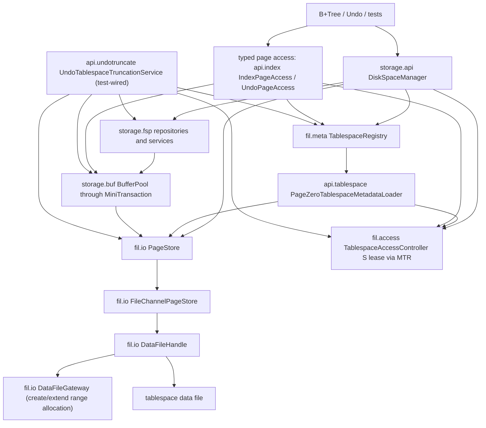
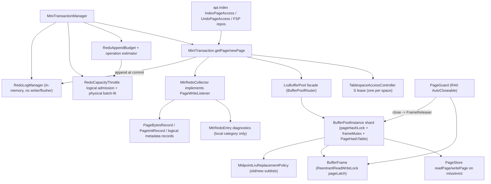
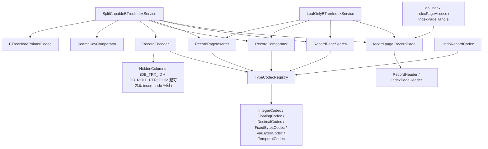
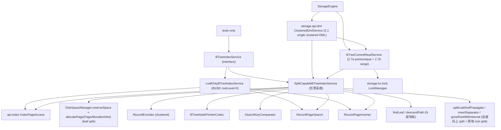
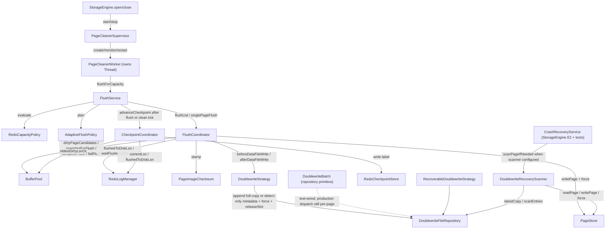
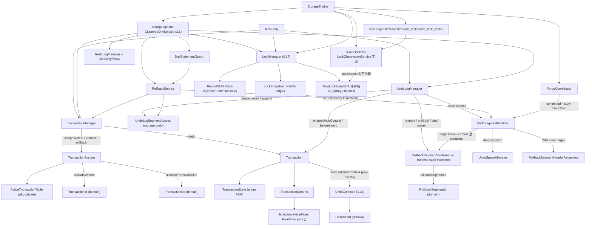
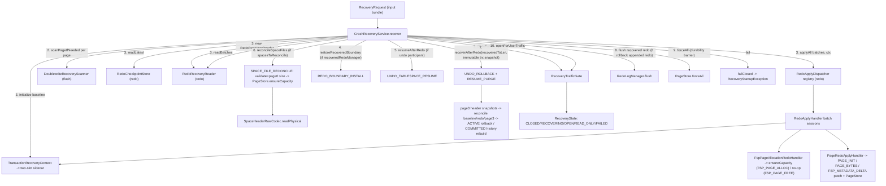
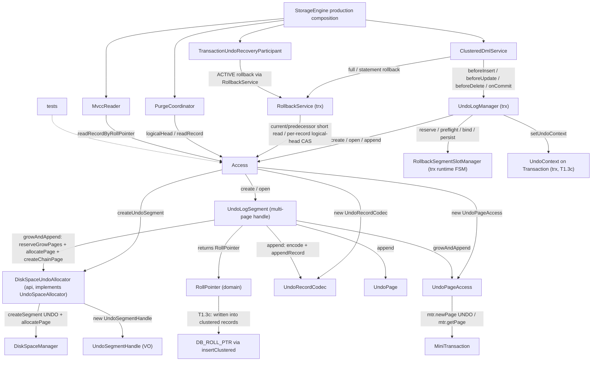

# Current Implementation Map

本文档记录当前生产代码的真实接线和已知缺口。全局设计文档和 `docs/design/diagrams/*.mmd` 表达目标架构；本文件表达当前实现状态。两者不一致时，开发判断当前代码行为以本文件和源码为准，目标演进以对应设计文档为准。

## Maintenance Rules

- 实线只表示当前生产代码已经存在的调用、持有、写入或读写关系。
- 虚线只表示已经决定但尚未闭环的 `planned`、`partial` 或 `unwired` 关系。
- 每个 `unwired` 生产类型都必须写清现状、保留理由和下一步动作。
- 每次实现切片结束后，只更新受影响的小节；只有目标架构变化时才更新全局架构图。
- 本文件不得用未决占位词替代明确判断；如果状态不确定，应写出需要核对的源码入口。

## Storage Disk Manager Slice

### Current Flow



### Current Data Chains

| Flow | Current production chain | Current state |
| --- | --- | --- |
| Create tablespace | `DiskSpaceManager.createTablespace` -> `PageStore.create` -> `DataFileHandle.create`; then `SpaceHeaderRepository.initialize`（含 page0 FSP_HDR 信封盖戳）; GENERAL writes `TablespaceLifecycleHeader(NORMAL,currentSize,epoch=0)`; UNDO writes `TablespaceLifecycleHeader(ACTIVE,initialSize,epoch=0)`; reserve extent0 and `TablespaceRegistry.replace` | Implemented; GENERAL publishes/persists NORMAL，UNDO publishes/persists ACTIVE；4-arg overload仍默认 GENERAL；page0 现携带统一 FSP_HDR FilePageHeader 信封 |
| Open tablespace | `DiskSpaceManager.openTablespace` -> `PageStore.open`; `TablespaceRegistry.open` -> `api.tablespace.PageZeroTablespaceMetadataLoader` 持 S lease raw 读 page0 -> FSP_HDR 信封校验(pageType==FSP_HDR/pageNo==0，否则 `TablespaceCorruptedException`) -> checksum/trailer 校验（新盖戳页严格校验；历史 header/trailer checksum 同为 0 的 page0 兼容）-> physical/lifecycle codecs | Implemented for already-known path；GENERAL 从 page0 恢复 NORMAL/CORRUPTED，普通访问继续拒绝 CORRUPTED；新 UNDO 恢复持久 ACTIVE/INACTIVE/TRUNCATING，旧 UNDO 无 lifecycle header 时按 NORMAL 打开但禁止 truncate |
| Recovery open | `DiskSpaceManager.openTablespaceForRecovery` -> `PageStore.open` -> `TablespaceRegistry.requireForRecovery` -> page0 loader（同样做 FSP_HDR 信封 + checksum/trailer 校验） | Implemented；允许加载 GENERAL CORRUPTED 与 UNDO TRUNCATING，供启动恢复、诊断和续作 |
| Space-management admission | `DiskSpaceManager.createSegment/allocatePage/freePage/dropSegment/usage` -> `MiniTransaction.acquireTablespaceLease(S)` (`MiniTransaction.java:108`) -> `TablespaceRegistry.require`（lease 后复核）-> FSP | Implemented；拒绝 CORRUPTED/INACTIVE/TRUNCATING/DISCARDED，消除状态先检后等待竞态 |
| Space reservation | `DiskSpaceManager.reserveSpace` -> ordinary access lease + Registry require -> `SpaceReservationService.reserve` -> page0/FLST 容量快照（不持账本锁）-> `PageStore.ensureCapacity` + `SpaceHeaderRepository.setCurrentSizeInPages` if needed -> capacity counter publish -> `MiniTransaction.enlistResource` | Implemented core + consumers（0.14a/0.14b）；per-process in-memory capacity counters + `SpaceReservationKind`；capacity counter lock 只保护内存承诺计数，不包住 Buffer Pool/page latch/file extend；B+Tree split/root split 以 `NORMAL` 预算调用，Undo grow 以 `UNDO` 预算调用，失败发生在真正 page allocation 和页内容修改前 |
| Allocate page | `DiskSpaceManager.allocatePage(mtr, ref[, PageAllocationHint])` -> `TablespaceRegistry.require` -> optional `SpaceReservationService.consumePageIfReserved` -> `SegmentPageAllocator.allocatePage(..., ExtentAllocationDirection, hintPageNo, pagesNeeded)` -> `DefaultExtentAllocationPolicy` -> `SegmentSpaceService.assignExtentToSegment` -> `FreeExtentService.acquireFreeExtent`; on no space without reservation, `PageStore.extend` then `SpaceHeaderRepository.setCurrentSizeInPages` and retry -> `MiniTransaction.appendLogicalRedo(FspPageAllocationRecord)` -> `mtr.newPage(..., PageType.ALLOCATED)` | Implemented for current FSP model；0.19b 起 allocation intent 以 `FSP_PAGE_ALLOC` 持久化并在 `PAGE_INIT(ALLOCATED)` 前进入同一 MTR batch，recovery handler 只 `ensureCapacity` 不重跑 allocator；0.19c 起 SpaceHeader/XDES/INODE/FLST 写点同时追加 `FspMetadataDeltaRecord`，`freePage`/`dropSegment` fragment 释放追加 `FspPageFreeRecord`；0.19d 起提交视图会过滤被 metadata delta after-image 精确覆盖的 FSP `PAGE_BYTES`，未覆盖的页信封/生命周期字节仍保留物理 redo；no-hint API delegates to `PageAllocationHint.none()` and keeps fragment→segment extent→autoextend behavior；direction hint only affects new extent selection/batch count after fragment slots and existing segment extents are exhausted；`INDEX_LEAF` + UP/DOWN may acquire 2-4 extents, UNDO/non-leaf/NO_DIRECTION stays single extent；active reservation 会先消费 page quota（当前 MTR reservation 的 atomic quota，无全局账本锁，避免持 index page latch 时阻塞在 reservation lock），耗尽则在分配前抛 `SpaceReservationExceededException`；registry size snapshot is not updated after autoextend because page0 remains the size authority；autoextend 现 crash-safe：恢复期 `FSP_PAGE_ALLOC`/`PAGE_INIT` 与 `SPACE_FILE_RECONCILE` 都可把物理文件长度重对齐到 redo 恢复出的逻辑边界 |
| Typed INDEX/UNDO access | production `StorageEngine` 注入共享 `TablespaceRegistry`：`api.index.IndexPageAccess` / `UndoPageAccess` -> `MiniTransaction.acquireTablespaceLease(S)` -> `TablespaceRegistry.require` -> `MiniTransaction.getPage/newPage` -> `BufferPool` -> `PageStore` | Implemented；生产 typed access 在 lease 后拒绝稳定 INACTIVE/CORRUPTED/DISCARDED；两参构造仍保留给低层页格式测试，不做 registry 准入 |
| Dirty page flush | `FlushCoordinator` 持同 space S lease -> snapshot -> WAL gate -> doublewrite -> `PageStore.writePage/force` -> `DataFileHandle.force` 持 per-file `FsyncLock` -> complete | Implemented；与 truncate X 互斥；同一 data file 并发 force 经 `FsyncLock` 串行化 |
| UNDO truncate | `UndoTablespaceTruncationService.truncate` (`UndoTablespaceTruncationService.java:105`) -> X lease/校验/marker -> `FlushService.flushThrough` (`FlushService.java:127`) -> `LruBufferPool.invalidateTablespace` (`LruBufferPool.java:320`) -> `DataFileHandle.truncateTo` (`DataFileHandle.java:247`) -> `UndoTablespaceFspRebuilder.rebuild` (`UndoTablespaceFspRebuilder.java:45`) -> final state/Registry publish | Implemented (test-wired)；同 epoch 可故障续作；旧 UNDO/GENERAL/活动 inode 明确拒绝；`FlushService.drainTablespace` 的目标 space dirty drain 已通过 `BufferPool.awaitDirtyStateChange` 等待 dirty-state signal，不再固定 1ms 轮询 |
| Redo replay | `RedoApplyDispatcher registry` -> `FspPageAllocationRedoHandler` / `PageRedoApplyHandler` / `TransactionStateRedoHandler` batch sessions -> page records 写 `PageStore`；trx record 经 `TransactionStateDeltaSink` 交给 `RecoveredTransactionTable` | Implemented physical replay path + FSP intent/metadata delta + undo/rseg metadata delta + undo payload + B+Tree structure delta + non-page trx state recovery；page handler 批末一次写回，transaction handler 不触碰 PageStore/事务状态机，正式 `StorageEngine` dispatcher 注入 recovery context sink，通用 dispatcher 保留 no-op sink；recovery discovery is not fully wired to registry |

### Package Status

| Package area | Representative classes | Current state | Notes |
| --- | --- | --- | --- |
| `storage.api` disk facade | `DiskSpaceManager`, `PageAllocationHint`, `SegmentRef`, `SpaceUsage`, `DiskSpaceUndoAllocator` | Implemented | DiskSpaceManager 管普通 FSP；`PageAllocationHint` 是上层页分配方向/邻近页/页需求的稳定 API，DiskSpaceManager 转换为 FSP 内部方向；SegmentRef/SpaceUsage 是门面值对象；undo allocator 是 undo 端口适配器 |
| `storage.api.undotruncate` lifecycle orchestration | `UndoTablespaceTruncationService`, `UndoTablespaceTruncationRecovery` | Implemented; recovery wired by `StorageEngine` E2 | 可恢复 UNDO 物理收缩与 recovery participant；E2 existing open 构造恢复参与者用于 TRUNCATING 续作；主动 truncate 仍待 purge/DML 调度 |
| `storage.api.index` typed index page entry | `IndexPageAccess`, `IndexPageHandle` | Implemented | Bridges B+Tree/record code to `MiniTransaction`-owned page guards；生产三参构造注入 registry 后先 lease+require 再 fix/new page |
| `storage.api.tablespace` metadata adapter | `PageZeroTablespaceMetadataLoader` | Implemented | Registry 懒加载协作者；留在 api 侧以避免 `fil` 直接编排 `fsp` page0/lifecycle codec；打开/恢复时先做 page0 FSP_HDR 信封校验(pageType/pageNo)，再做 checksum/trailer 校验；GENERAL marker 只接受 NORMAL/CORRUPTED，UNDO marker 只接受 ACTIVE/INACTIVE/TRUNCATING；历史未盖 checksum 的 page0 仅在两个 checksum 字段同为 0 时兼容 |
| `storage.api.dml` single-clustered DML facade | `ClusteredDmlService`, `DmlStatementGuard`, `ClusteredInsertCommand`, `ClusteredUpdateCommand`, `ClusteredDeleteCommand`, `DmlCommitCommand`, `DmlRollbackCommand`, result/exception records | Implemented; production-wired by `StorageEngine` | 2.1：单表/单聚簇索引 INSERT/UPDATE/DELETE/COMMIT/ROLLBACK 编排入口；`beginStatement(txn,index)` 返回显式 Guard，已有 undo 走 savepoint、首写前持一次性 `EmptyUndoBoundary`；调用方仍显式传 `Transaction`/`BTreeIndex`/row/key，不接 SQL parser、session autocommit、DD、多索引或二级索引 |
| `storage.fsp.flst` file-list primitives | `FileAddress`, `Flst`, `FlstBase`, `FlstNode` | Implemented | FSP/XDES/INODE 链表指针与 base/node 编解码；不接触文件 IO；0.19c 起 FLST base/node 写入经 `FspRedoDeltas` 追加 metadata delta，0.19d 起对应物理 `PAGE_BYTES` 被提交过滤器替代 |
| `storage.fsp.header` space header | `SpaceHeaderRepository`, `SpaceHeaderSnapshot`, `SpaceHeaderRawCodec`, `SpaceHeaderPhysical` | Implemented | page0 header 读写与 raw metadata 加载；`initialize` 盖 page0 FSP_HDR FilePageHeader 信封头；layout 常量供 extent/lifecycle codec 共享；0.19c 起 space header 字段写入追加 `FspMetadataDeltaRecord`，0.19d 起被 delta 覆盖的字段字节不再持久化 `PAGE_BYTES`；lifecycle truncate marker 和 page0 信封仍走物理 `PAGE_BYTES` |
| `storage.fsp.reservation` space reservation | `SpaceReservationService`, `SpaceReservation`, `SpaceReservationKind` | Implemented | `DiskSpaceManager.reserveSpace` 生产接线；内存态容量账本，预扩物理文件/page0 currentSize；0.14b 已接 B+Tree split/root split 与 Undo grow 真实消费者；2026-07-03 修正锁边界：reserve 不持账本锁等待 page0/FLST，consume 不取全局账本锁而只改当前 reservation 原子页额度 |
| `storage.fsp.extent` extent management | `ExtentDescriptorRepository`, `ExtentState`, `FreeExtentService`, `ExtentAllocationPolicy`, `ExtentAllocationDirection`, `ExtentAllocationRequest` | Implemented | XDES state/owner/bitmap + 全局 FREE/FREE_FRAG/FULL_FRAG 分配；不打开文件；direction hint 在已材料化 FREE 链中选 UP/DOWN 最近候选，UP 可推进 freeLimit 材料化右侧候选，NO_DIRECTION 保持链头语义；0.19c 起 XDES field/bitmap 写入追加 metadata delta，0.19d 起对应物理 `PAGE_BYTES` 被提交过滤器替代 |
| `storage.fsp.segment` segment management | `SegmentInodeRepository`, `SegmentPurpose`, `SegmentSpaceService`, `SegmentPageAllocator` | Implemented | INODE slot、segment extent list、fragment 页和 segment 页分配；`SegmentPageAllocator` 在需要新 extent 时构造 `ExtentAllocationRequest`，leaf 顺序 hint 可批量挂 2-4 个 extent；0.19c 起 inode slot image/field/fragment slot 写入追加 metadata delta，0.19d 起对应物理 `PAGE_BYTES` 被提交过滤器替代 |
| `storage.fsp.lifecycle` lifecycle marker | `TablespaceLifecycleHeader`, `TablespaceLifecycleRawCodec` | Implemented | page0 198–237 持久化 GENERAL NORMAL/CORRUPTED marker 与 UNDO ACTIVE/INACTIVE/TRUNCATING marker；GENERAL 稳定状态拒绝 truncation epoch/target |
| `storage.fsp.undo` undo rebuild | `UndoTablespaceFspRebuilder` | Implemented | 物理 truncate 后清零并重建 page0/page2/extent0 |
| `storage.fsp.exception` exceptions | `FspMetadataException`, `NoFreeSpaceException`, `SpaceReservationExceededException` | Implemented | FSP 元数据损坏/空间耗尽/预留额度耗尽领域异常 |
| `storage.fil.io` physical IO | `PageStore`, `FileChannelPageStore`, `DataFileDescriptor`, `DataFileHandle`, `AutoExtendPolicy`, `DataFileGateway`, `ZeroFillDataFileGateway`, `PreallocationStrategy` | Implemented | State/registry-free；单文件 `truncate`（缩短）与 `ensureCapacity`（幂等扩到至少 N，crash recovery 用），均持 physical Lifecycle->FileSize(X)；create/extend/ensureCapacity 的新页范围初始化委托 `DataFileGateway`，默认 `ZeroFillDataFileGateway` 保持零填充行为，`PreallocationStrategy` seam 已存在但平台 native adapter 未接；`force/forceAll` 经 `FsyncLock` 串行化同一 data file 的 `FileChannel.force(true)` |
| `storage.fil.lock` physical locks | `TablespaceLifecycleLatch`, `FileSizeLock`, `ResourceGuard`, `FsyncLock` | Implemented | lifecycle/file-size/fsync 均由 `DataFileHandle` 使用；未接线的 `DataFileHandleLock`/`PageIoRangeLock` 已删除，物理层暂不建句柄替换锁或 page-range 合并锁 |
| `storage.fil.access` operation admission | `TablespaceAccessController`, `TablespaceAccessLease` | Implemented | controller 每 SpaceId 公平显式 RW lease；`StorageEngine` E1/E2 创建单实例并注入 MTR/loader/disk/flush/recovery undo truncate |
| `storage.fil.meta` runtime metadata | `TablespaceRegistry`, `CachingTablespaceRegistry`, `TablespaceMetadata`, `Tablespace`, `TablespaceHandle` | Implemented for runtime admission | registry 保存当前进程打开视图；UNDO lifecycle 与 GENERAL NORMAL/CORRUPTED 已由 page0 恢复；DISCARD/DROP 文件生命周期仍仅 runtime/unwired，等待 DDL 语义 |
| `storage.fil.state` type/state values | `TablespaceState`, `TablespaceType`, `TablespaceTypeFlags`, `SpaceFlags` | Implemented | 表空间类型与状态编码值对象；状态转换由 api/engine 层编排 |
| `storage.fil.exception` exceptions | `TablespaceNotFoundException`, `TablespaceUnavailableException`, `DataFilePhysicalException`, `PageOutOfBoundsException` | Implemented | 表空间文件缺失、越界、损坏、不可用等 fil 领域异常 |
| `storage.page` physical envelope | `PageEnvelopeLayout`, `FilePageHeader`, `PageEnvelope`, `PageChecksum`, `PageImageChecksum`, `PageType` | Implemented | Shared header/trailer/checksum helpers over raw page bytes；`PageImageChecksum.verify` 同时校验 header checksum、trailer checksum 与 trailer low32 LSN |

## Buffer Pool + MiniTransaction Slice

### Current Flow



### Current Data Chains

| Flow | Current production chain | Current state |
| --- | --- | --- |
| Page fix (INDEX) | `api.index.IndexPageAccess.openIndexPage` -> optional production `MiniTransaction.acquireTablespaceLease(S)` + `TablespaceRegistry.require` -> `MiniTransaction.getPage` -> `LruBufferPool.getPage`（facade 经 `BufferPoolRouter` 路由到归属 `BufferPoolInstance`）-> `instance.getPage` -> `acquire` (`BufferPoolInstanceLatchSet`: `pageHashLock` 查/注册 `PageId -> frame`，目标 `frameMutex` 固定/检查 LOADING/dirty/state；miss 时通过 `freeListLock` 取空闲帧，或经 `lruListLock` 复制 victim 顺序后逐帧复核；命中 LOADING 出锁等 `PageLoadFuture`；装 LOADING 占位后**出所有内部锁** `readAndPublish` 读盘) -> `pageLatch.lock` -> `new PageGuard`(releaser=instance) -> `attachWriteListener(MtrRedoCollector)` + `memo.pushPageGuard`；facade 再调 read-ahead 钩子 | Implemented；生产组合根使用 registry-aware typed access，测试两参构造仍可只测页格式；**0.10d 多 instance（默认 N=1，生产 N=1）**：facade 路由单页操作到分片、跨切面查询逐分片聚合；miss 读盘移出内部锁（Phase B：per-frame LOADING + load future）；**13.1d** 已拆 `pageHashLock + frameMutex + freeListLock/lruListLock/flushListLock`，dirty view 由 `DirtyPageList` 真实 flush list 承载 |
| Page fix (UNDO) | `UndoPageAccess.openUndoPage` -> optional production lease+Registry require -> `MiniTransaction.getPage` (same path); page-type gate rejects non-UNDO pages | Implemented |
| New page (INDEX) | `api.index.IndexPageAccess.createIndexPage` -> optional production lease+Registry require -> `MiniTransaction.newPage` -> `LruBufferPool.newPage` -> `acquire(readFromDisk=false)` -> zero-fill under X latch; MTR `collector.recordInit(pageId, PageType.INDEX)` | Implemented |
| New page (UNDO) | `UndoPageAccess.newUndoEnvelope` -> optional production lease+Registry require -> `MiniTransaction.newPage(...,PageType.UNDO)` | Implemented |
| MTR begin/commit | 生产读路径 `MiniTransactionManager.beginReadOnly()`（零预算）或写路径 `budgetFor(purpose)` -> `begin(RedoAppendBudget)` -> throttle 在页/FSP 资源前按 logical 上界准入并校验 physical LogBlock file-fit -> `MiniTransaction.commit` 冻结一次 persisted records -> 精确结算/上界校验 -> append 后 reservation ownership transfer -> disable collector -> stamp touched pages -> `memo.releaseAll()` LIFO（发布 dirty/pageLSN）-> `RedoLogManager.markClosed(range)` | Implemented；生产 25 个匿名 `begin()` 已清零；默认 no-op 测试 manager 保留匿名无界预算；只读零预算不触发 flush；预算低估在 append 前抛 `RedoBudgetExceededException` 并保持 COMMITTING fail-stop；当前领域估算按用途和实例页大小使用保守 page-image profile，后续可用 B+Tree height / undo segment plan snapshot 收紧而不改变结算协议 |
| MTR rollback | `MiniTransaction.rollbackUncommitted` -> `memo.releaseAll()` only (`:167`) | Implemented; dirty pages stay dirty — no buffer-content undo (documented simplification `:18-19`) |
| Dirty page mark | `PageGuard.close` -> `FrameReleaser.release(frame, wrote)` -> `BufferPoolInstance.release`（归属分片，0.10d 起 `FrameReleaser` 由 instance 实现）OR-dirties via `markDirty` under target `frameMutex`; sets `oldestModificationLsn`/`newestModificationLsn`/bumps `dirtyVersion` and publishes/upserts `DirtyPageList` under `flushListLock` | Implemented；**13.1d**：同页重复修改只保留一条 flush list 记录，oldest LSN 约束 checkpoint，newest LSN 随页面最新 LSN 更新；**E1 修 bug**：`markDirty` 改用 `oldestModificationLsn==null` 守卫（原 `!dirty`）——newPage 对驻留页重初始化先置 dirty=true（无 LSN），双 newPage 同 MTR（allocatePage+createIndexPage 同根页）后 commit markDirty 会因 dirty 已真而漏设 oldestMod，留 dirty+null oldestMod 帧致 flush/checkpoint NPE。flush-after-双newPage 之前潜伏（既有 btree 测试不 flush 未触发） |
| Eviction | `BufferPoolInstance.obtainVictim(cleanSkip)`（分片本地，无跨分片 stealing）优先 free/clean 帧直接复用；仅有脏 unfixed 帧时记 PageId、出所有内部锁经 `DirtyVictimFlusher.flushVictim`（→`FlushCoordinator.singlePageFlush`：WAL gate+checksum+doublewrite+`completeFlush`）刷干净后回环重选；本轮 `cleanSkip` 防空转，无干净帧抛 `BufferPoolExhaustedException`；无 `DirtyVictimFlusher` 时遇到脏 victim 直接抛 `BufferPoolExhaustedException`，不再 fallback 直写 PageStore | Implemented；注入 flusher（生产 `StorageEngine`）后脏页淘汰 WAL 安全：redo 未 durable→`flushVictim` 返回 false→不写盘；`FAILED`→抛根因不吞。2026-07-05 已移除 legacy no-flusher direct-write fallback |
| Checkpoint feed | `CheckpointCoordinator` 算 safe LSN -> `CheckpointMetadataParticipant` 捕获 `TransactionSystem.snapshotCounters` 并 force `TransactionRecoveryCheckpointStore` -> force `RedoCheckpointStore` label -> 发布内存 checkpoint -> 锁外 `RedoReclaimBoundary` | Implemented；sidecar→redo label→reclaim 顺序保证 fuzzy checkpoint/redo ring 回收后仍有事务高水位；sidecar/label 失败都不发布或回收。`FLUSHING` 页仍留在 `DirtyPageList`，safe LSN 不能越过正在写出的页 |
| Tablespace invalidation | `UndoTablespaceTruncationService` 持 X lease -> `LruBufferPool.invalidateTablespace` -> `SpaceLifecycleClock.beginInvalidation` 关闭该 space 新前台准入/预读 -> 各分片 Condition 等待 fixCount=0 -> dirty 则拒绝并 abort 版本窗口 -> 全分片 drain+check 通过后 `advanceInvalidation` 推进 `TablespaceVersion` -> 移除旧版本 frame -> finish 重新开放 | Implemented；fixed 等待有 timeout/interrupt；不隐式绕过 WAL flush；并发前台 get/new 命中失效窗口抛 `BufferPoolStalePageException`，prefetch 直接跳过，LOADING 发布前会复核版本并清占位；dirty drain 等待独立走 facade 级 `awaitDirtyStateChange`，由 flush/guard release/reset 等 dirty-view 变化路径 signal |

### Package Status

| Package area | Representative classes | Current state | Notes |
| --- | --- | --- | --- |
| `storage.buf` pool core | `BufferPool`, `LruBufferPool`(facade), `BufferPoolInstance`, `BufferPoolInstanceLatchSet`, `PageHashTable`, `BufferPoolRouter`, `BufferFrame`, `PageGuard`, `PageLatchMode`, `DirtyVictimFlusher`, `DirtyPageList`, `BufferFrameState`, `FrameStateMachine`, `PageLoadFuture`, `BufferPoolLoadTimeoutException`, `BufferPoolLatchViolationException`, `SpaceLifecycleClock`, `TablespaceVersion`, `BufferPoolStalePageException` | Implemented (production-wired) | **0.10d 多 instance 分片**：`LruBufferPool` 转 facade，经 `BufferPoolRouter`(`hash(PageId)%N` 确定路由) 把单页操作转发到归属 `BufferPoolInstance`、跨切面查询（dirty 候选合并按 oldestLSN 升序 / oldest LSN 全局 min / hasDirty / residentCount / residentCountInRange / 截断）逐分片聚合；分片间无 work stealing（某分片满即抛 `BufferPoolExhaustedException`）；`invalidateTablespace` 两阶段（全分片 drain+check 通过后再移除）保 all-or-nothing。容量按 base+前 r 个+1 切分（capacity≥N）。生产 N=1（`EngineConfig.bufferPoolInstanceCount` 默认 1，`StorageEngine` 经此构造）。**Phase B + 13.1a/b/c/d + legacy flush removal**：`FrameStateMachine`(FREE/LOADING/CLEAN/DIRTY/FLUSHING) + LOADING single-flight；`PageHashTable` 由 `pageHashLock` 保护，`BufferFrame` 当前绑定/状态/fix/dirty/LSN/loadFuture/spaceVersion 由 `frameMutex` 保护；free list、LRU、flush list 分别由 `freeListLock`/`lruListLock`/`flushListLock` 保护；`DirtyPageList` 保存 `PageId + oldest/newest LSN` 而非 frame 引用，候选枚举走 flush-list 快照后再 pageHash/frame 复核，fixed DIRTY 页仍出候选供 drain 看到 dirty view，`FLUSHING` 页留链约束 checkpoint 但不重复出候选；Buffer Pool 不再提供 `flush/flushAll` 直写 PageStore API，所有脏页物理写出只走 `FlushCoordinator`；miss 读盘、`PageLoadFuture` wait、dirty victim flush 前均由 `BufferPoolInstanceLatchSet.assertMetadataUnlocked` 守卫无内部锁。**0.22 stale-frame 版本语义**：每个 resident/LOADING frame 带 `TablespaceVersion`，`SpaceLifecycleClock` 在 truncate/drop invalidation 窗口拒绝前台准入、跳过 prefetch，并在 lookup/LOADING 发布前复核版本；已过期 clean unfixed frame 只隔离不复活。剩余 `DIRTY_PENDING/EVICTING/STALE` 态仍待后续。**0.13d SX latch**：`PageLatchMode` 增 `SHARED_EXCLUSIVE`（SIX），分层实现=帧内 `pageLatch.readLock()`（与 S 共存、排它 X）+ 每帧 `pageIntentLatch`(`ReentrantLock`，排它另一 SX/X)；`BufferPoolInstance.acquire` 对 SX 先取 read latch 再取 intent latch，`PageGuard` 持双闩、close 逆序先放 intent 后放 read；SX 只授只读内容（写仍须 X，`requireExclusive` 拦截），不支持原地 SX→X 升级（RRWL 无升级会自死锁）。**已接入 btree 悲观 SMO 下降**（root SX 首遍 + restart-in-X，见 B+Tree 小节） |
| `storage.buf` replacement | `ReplacementPolicy`, `MidpointLruReplacementPolicy` | Implemented (production-wired) | Midpoint LRU(old/new 子链)：读入进 old 头、`oldBlocksTime`(注入毫秒时钟) 提升窗 + `youngDistanceThreshold`(young 子链 1/4) 抗抖动 → 抗扫描污染（Phase A 0.8）；sole impl，injection ctor `LruBufferPool(...,ReplacementPolicy)` 供测试注入可控时钟；read-ahead-aware 分类、`oldBlocksPct` 配比再平衡待 0.10 |
| `storage.buf` flush support | `DirtyPageCandidate`, `FlushPageSnapshot`, `BufferPoolExhaustedException` | Implemented | Value objects consumed by flush module；`failFlush` 现 FLUSHING→DIRTY（Phase B，不再 no-op）；`snapshotForFlush` DIRTY→FLUSHING、`completeFlush` 版本符→CLEAN/不符→DIRTY；`FlushCoordinator` WAL-gate skip 路径补 `failFlush` 复位 |
| `storage.buf` write listener | `PageWriteListener` | Implemented | DI seam; only production impl is `MtrRedoCollector`; `NO_OP` path has no production caller |
| `storage.buf` read-ahead + warmup | `BufferPool.prefetch`/`residentPageIds`/`residentCountInRange`, `LinearReadAheadTracker`, `RandomReadAheadDetector`, `ReadAheadRequest`, `ReadAheadHook`, `ReadAheadService`, `ReadAheadState`, `BufferPoolWarmupService` | Implemented (production-wired) | 0.10a linear read-ahead：`prefetch`=free-frame-only 载入 old 不 fix 不提升（跳过驻留/无空闲帧丢弃/IO 失败回收）；`LinearReadAheadTracker`(单顺序流，同 extent 连续达 threshold→预取下一 extent，`PAGES_PER_EXTENT=64`)；`ReadAheadService`(实现 `ReadAheadHook`，前台 `recordAccess` 喂检测器+有界队列、单 worker `prefetch`)；`attachReadAheadHook`+`getPage` 回调；engine 后台启停（linear threshold 56、门控 `backgroundFlushEnabled`）。**0.10c random read-ahead（默认禁用）**：`BufferPool.residentCountInRange`(page hash 短锁内逐页查区间驻留数，O(extent)) + `RandomReadAheadDetector`(同 extent 驻留数达 threshold→补取整 extent，bounded recent 窗去重而非永久 set)；`ReadAheadService` 4 参构造增 `randomThreshold`(0=禁用→不构造检测器/普通路径不查 residentCountInRange)，`recordAccess` 持 service.lock 时查 residentCountInRange(page hash 短锁，单向无环) 喂 detector、命中入队，random 检测异常吞掉只丢本次预取；`StorageEngine` 以 `RANDOM_READ_AHEAD_THRESHOLD=0` 构造（对齐 MySQL `innodb_random_read_ahead=OFF`），生产启用留 config（延后）。0.10b warmup：`BufferPoolWarmupService` dump(residentPageIds→文件 magic+crc32)/load(读回→prefetch，缺失/损坏 no-op)，`StorageEngine` close 写 / open 预取。简化：单流、free-frame-only、random 触发用「extent 驻留数」启发式(非 access-bit)、warmup 同步预取/无 IO 速率控制/space version；多 instance 分片 + 专用 `PageHashTable` 已由 0.10d 闭合 |
| `storage.mtr` transaction | `MiniTransaction`, `MiniTransactionManager`, `MtrOperationRedoBudgetEstimator`, `MiniTransactionState`, `MtrSavepoint`, `MtrRedoCategoryScope` | Implemented (production-wired by engine) | Manager 注入共享 controller + durable redo + throttle + 实例页大小；生产读/写分别走零预算/显式 operation budget；commit 精确验证并返回 end LSN；默认测试构造仍内存 redo/no-op reservation |
| `storage.mtr` memo + collector | `MtrMemo`, `MtrRedoCollector`, `MtrRedoEntry`, `MtrRedoCategory`, `MtrLatchOrderScope`, `MtrStateException` | Implemented | memo 同时持 page guard 与 per-space lease；LIFO 保证 latch/fix 先释放、lease 最后释放。**0.13d SX**：`fix` 的同页升级防护由「S→X 禁」扩为「S 或 SHARED_EXCLUSIVE 仍持时求 X 且未持 X 即禁」（两者都持该页 readLock，再求 X 会自死锁）。**0.23a MTR page latch ordering**：默认独立多页 latch 必须按 `(spaceId,pageNo)` 升序获取；同页重入和已提前释放页不计入违规；违反时在进入 Buffer Pool 等待前抛 `MtrStateException`。`allowOutOfOrderPageLatch(reason)` 只给 B+Tree root/child/sibling/SMO allocation-format-free、Undo grow/FIL 链读/rseg page3 slot 等有局部无环证明的路径短暂开例外，作用域关闭后恢复默认守卫。**0.23b MTR/Redo 纪律**：savepoint 不允许释放 touched page；commit 固定 append -> stamp pageLSN -> release/dirty publish -> markClosed；collector 维护本地分类诊断（默认 `PAGE_BYTES_GENERIC`，`PAGE_INIT` 由 newPage 固定产生）。**0.19d/0.19f/0.19g/0.19h logical redo 去重**：提交给 redo manager 的视图会删除被 FSP metadata、undo metadata、完整 undo payload、B+Tree sibling delta after-image 精确覆盖的物理 `PAGE_BYTES`，但 touched page 仍由真实页写维护；`TRX_STATE` 分类承载 non-page 正式事务终态/高水位 logical redo，恢复时仍与 page3 物理证据交叉校验 |

## Record Layer Slice

### Current Flow



### Current Data Chains

| Flow | Current production chain | Current state |
| --- | --- | --- |
| INDEX page record access | `api.index.IndexPageAccess.openIndexPage` -> `new RecordPage(guard, pageSize)` -> `rp.format(...)` / `rp.freeSpace()` / etc. | Implemented; `api.index.IndexPageHandle.recordPage()` also constructs `RecordPage` |
| In-page search | `LeafOnlyBTreeIndexService`/`SplitCapableBTreeIndexService` -> `new RecordPageSearch(registry)` (`:49`/`:72`) -> `search.findEqual/findInsertPosition` -> `RecordCursor` per row | Implemented |
| In-page insert | btree service -> `new RecordPageInserter(registry)` (`:51`/`:73`) -> `inserter.insert` -> `HeapSpaceManager` alloc + `RecordPageDirectory` slot maintenance; `RecordPageOverflowException` triggers btree split | Implemented |
| Clustered record encode | `SplitCapableBTreeIndexService.insertClustered` -> stamps `new HiddenColumns(transactionId, rollPointer)`（T1.3c 起为调用方传入的真 insert undo 指针，非 NULL） (`:105`) -> `RecordEncoder.encode` (`:426`) | Implemented; T1.3c 起 `DB_ROLL_PTR` 可写真 undo 指针（由 `UndoLogManager.beforeInsert` 返回）；未接 undo 的路径仍传 `RollPointer.NULL` |
| Undo record codec | `UndoRecordCodec` -> `TypeCodecRegistry.codecFor` per column -> `FieldWriter`/`FieldSlice` self-framing payload；UPDATE_ROW **和** DELETE_MARK 追加全量旧 image（旧隐藏列 + 全列）尾部 | Implemented (INSERT_ROW + UPDATE_ROW + DELETE_MARK，T1.3f)；DELETE_MARK 复用 UPDATE 旧 image 结构（不存 old delete flag=阶段差异）；INSERT golden bytes 钉死；type 首字节权威 |
| Record decode | `RecordFieldResolver` -> `TypeCodecRegistry` -> per-column `FieldSlice`/`ColumnValue`; reached via `RecordCursor` (btree scan/lookup) | Implemented; standalone `RecordDecoder` has no production caller (test-only) |

### Package Status

| Package area | Representative classes | Current state | Notes |
| --- | --- | --- | --- |
| `record.schema` | `TableSchema`, `ColumnType`, `IndexKeyDef`, `ColumnDef`, `KeyPartDef`, `KeyOrder`, `TypeId` | Implemented | Foundational immutable value objects; consumed by btree + undo; 13 `TypeId` (TINYINT…DATETIME); `CharsetId` UTF8-only, `CollationId` BINARY-only |
| `record.type` | `TypeCodecRegistry`, `TypeCodec`, `ColumnValue`, `FieldSlice`, `FieldWriter`, `IntegerCodec`/`FloatingCodec`/`DecimalCodec`/`FixedBytesCodec`/`VarBytesCodec`/`TemporalCodec` | Implemented (subset) | Order-preserving codecs; `new TypeCodecRegistry()` only in tests (no production bootstrap); `UnsupportedColumnTypeException` declared but unreachable (exhaustive switch) |
| `record.format` | `RecordEncoder`, `RecordFieldResolver`, `LogicalRecord`, `RecordHeader`, `RecordType`, `HiddenColumns`, `HiddenColumnLayout`, `NullBitmap`, `VarLenDirectory` | Partial | Inline-only format (`MAX_RECORD_LENGTH=65535`, no overflow chain); `RecordDecoder` is test-only; `RecordHeaderLayout` is simplified 8-byte fixed (not InnoDB-binary-compatible); T1.3c 起 `HiddenColumns.dbRollPtr` 可写真 undo 指针（不再恒 `RollPointer.NULL`） |
| `record.page` | `RecordPage`, `RecordPageSearch`, `RecordPageInserter`, `RecordCursor`, `RecordComparator`, `IndexPageHeader`, `RecordRef`, `SearchKey`, `RecordPageDirectory`, `HeapSpaceManager` | Partial | Insert/search/cursor/comparator wired into btree+api; T1.3d 起 `RecordPageDeleter`/`RecordPagePurger` 经 `SplitCapableBTreeIndexService.deleteClustered` 接入 rollback（不再 test-only）；`RecordPageUpdater` + `UpdateResult`/`UpdateOutcome` 经 `replaceClustered`（T1.3e）接入；`RecordPageReorganizer` 自 0.12 起经 btree merge（`mergeLeaf`/`mergeInternal` 压实 survivor）接入（均 test-wired，随 btree 包整体上行）；record layer 仍只提供页内原语，不做 split/merge 决策（结构变更归 btree）|

## B+Tree Layer Slice

### Current Flow



### Current Data Chains

| Flow | Current production chain | Current state |
| --- | --- | --- |
| Point lookup | `BTreeIndexService.lookup` -> SplitCapable `findLeafSharedCrab`（N 层 `chooseChild` **S-crab** 下降：持父 S→latch 子 S→放父 S，祖先早释放，0.13c）-> `search.findEqual` -> `RecordCursor` -> `materialize` | Implemented；SplitCapable 任意高度（0.11）；读路径 S-crab（0.13c）；LeafOnly 仍 level 0 |
| Point current-read (2.7a) | `BTreeCurrentReadService.lockPoint` -> 短 MTR `SplitCapableBTreeIndexService.locatePointForCurrentRead`（S 定位 record/gap，构造 `RecordLockKey`/`GapLockKey`/`NextKeyLockKey`）-> commit 释放 page latch/fix -> `LockManager.acquire` -> 短 MTR 重新定位校验；RC miss 不锁 gap，RR miss 按模式锁 gap | Implemented；`StorageEngine` production-held；2.1 起 `ClusteredDmlService.update/delete` 调用 `FOR_UPDATE`；SQL/session/executor 仍未接 |
| Unique insert current-read check (2.7a) | `BTreeCurrentReadService.checkUniqueForInsert` -> 物理 duplicate 命中取 `REC_S` 并重定位确认；miss 取 `INSERT_INTENTION` 到目标 gap 并重定位确认 -> `BTreeUniqueCheckResult` | Implemented；2.1 起 `ClusteredDmlService.insert` 调用；仍是物理唯一检查（delete-marked 同 key 算 duplicate），不做 MVCC 逻辑唯一 |
| Range current-read (2.7b) | `BTreeCurrentReadService.lockRange` -> 短 MTR `SplitCapableBTreeIndexService.locateRangeForCurrentRead`（扫描 range records，构造 `RecordLockKey`/`NextKeyLockKey` 与 terminal `GapLockKey`）-> commit 释放 page latch/fix -> RC 对返回记录取 `REC_S/REC_X`，RR 取 `NEXT_KEY_S/X` + `GAP_S/X` -> 短 MTR 重扫 range 并校验；失败尝试释放已授予锁 | Implemented；批量 range 结果，不实现长期 cursor；terminal gap 仍是页级简化；SQL/session/executor range DML 尚未接 |
| Bounded scan | `SplitCapableBTreeIndexService.scan` -> `descendSharedCrab(lowerKey)` **S-crab** 定位起始 leaf -> sibling loop via `fileHeader().nextPageNo()`（`FIL_NULL` 终止，**hand-over-hand**：先 latch 后继 leaf 再 `releaseHandle` 前驱）-> `scanLeafPage` per page | Implemented；任意高度；读路径 S-crab + sibling hand-over-hand（0.13c），任一时刻只持「父+子」/「≤2 leaf」|
| Insert (no split) | SplitCapable `insert` -> **乐观** `tryOptimisticInsert`：`descendOptimistic`（内部层 S-crab、leaf X）-> unique check -> `inserter.insert`（放得下即成，仅 leaf 持 X）；溢出=unsafe 释放 leaf X 回退 `pessimisticInsert`。**悲观 insert 走 safe-node 下降（0.13d）**：`descendPathInsertSafeNode` 全 X 下降但每 latch 到内部 child 若 safe（`freeSpace ≥ maxSeparatorSize`=该索引 node pointer 编码严格上界）即释放其以上全部祖先 X（含 root）→ split 不传播到 root 时 **root X 不再持到 commit**；只判内部页（leaf 恒保留），既有 split 传播引擎在截断后的保留链上零改动正确。LeafOnly 仍 `descendPath` X-latch root→leaf | Implemented；overflow → `BTreeSplitRequiredException`（LeafOnly）或悲观 split 传播（SplitCapable，写路径 latch coupling 0.13a + safe-node 0.13d）；诊断计数 `safeNodeAncestorReleaseCount()`。insert/delete/purge 的 safe-node 下降共用 `descendPathSafeNode`（谓词参数化）。**0.13d SX+restart（§10.3 ROOT_LATCHED_SX）**：快照树高 ≥2 的悲观 SMO 首遍 root 取 **SX**（与读者/乐观写者 root S 并存、排它其它 SMO），safe 节点吸收 → 全程不 X root；首遍链顶仍是 root（SMO 可能写 root，SX 禁升级）→ 零写整链释放、root X 重启第二遍（至多一次，重启即全新导航天然正确）；level 0/1 树必写 root 故跳过 SX 首遍直取 X；计数 `rootSxDescentCount()`/`rootXRestartCount()` |
| Insert split 传播（0.11/0.14b/0.15/0.23a） | `insert` overflow -> `pessimisticInsert` 计算 split 预算 -> 释放未写保留链 -> `reserveSplitSpace(NORMAL)`（按 leaf split + 可能 parent/root split 最坏页数预算，且至少一 extent，失败在任何页改写前）-> 重新下降并复核 unique/leaf 容量 -> `splitLeafAndPropagate`。leaf 即 root → `splitRootLeaf`（原地 level0→1，若插入 key 高于旧 root 最大 key 且无右 sibling，则用 `PageAllocationHint.up` 分配两个新 leaf；低于最小 key 且无左 sibling 则 `down`）；否则 `splitNonRootLeaf`（旧 leaf=左半 + 新右兄弟 + sibling 链，边界顺序插入且对应方向无 sibling 时传 leaf hint）→ `insertSeparator` 上插父页 -> 父满则内部 split：root→`growRootWithInternal`（两 level-L 新子页 + root 页号不变重建 level L+1）、非 root→`splitNonRootInternal` 递归上插。leaf 行/内部 pointer 统一对半切，separator=右半 lowKey | Implemented（任意高度）；内部/root-split 子页自 `nonLeafSegment` 分配且继续无方向 hint；root 页号稳定；返回 `BTreeInsertResult(after.withRootLevel, allocatedPages)`；0.14b 起 split/root split 不再半途 immediate allocation ENOSPC；0.15 起 leaf split 可给 DiskSpaceManager 传保守方向 hint，随机中间 split 和已有 sibling 的 split 仍 none；0.23a 起预留不在持 index page latch 时触碰 page0/FLST，SMO 新页分配/格式化和 child/sibling hand-over-hand 打开通过 `allowOutOfOrderPageLatch(reason)` 记录局部无环证明 |
| Clustered insert | `SplitCapableBTreeIndexService.insertClustered(mtr, index, record, transactionId, rollPointer)` (`:91`) -> stamps `new HiddenColumns(transactionId, rollPointer)`（T1.3c 起调用方传入真 insert undo 指针，替换恒 NULL） -> delegates `insert` (`:106`) | Implemented; `DB_ROLL_PTR` 由上层 orchestration（`assignWriteId → UndoLogManager.beforeInsert → insertClustered`）传入；不 import trx/undo |
| Clustered delete (T1.3d；0.12 merge；0.13a latch coupling) | `SplitCapableBTreeIndexService.deleteClustered(...)` -> **乐观** `tryOptimisticDelete`：`descendOptimistic`（内部层 S-crab、leaf X）-> `findEqual`（未命中/所有权不符=幂等 no-op）-> `deleteWouldUnderflow` 预判（同 `isUnderfull` 公式、freed 取上界偏保守）：不欠载则 `deleteMark`+`purge` **跳过 `reclaimAfterRemoval`**（仅 leaf 持 X）；欠载=unsafe **写页前**释放 leaf X 回退悲观 **`descendPathDeleteSafeNode`（0.13d safe-node：X 下降遇「摘一最大指针后仍不欠载」的 safe 内部节点即释放其以上祖先 X 含 root，保留链=「safe 节点…leaf」）** -> `deleteInLeaf`（`findEqual`->所有权校验->`deleteMark`/`purge`->`reclaimAfterRemoval` 带 merge，只在保留链内传播）-> `BTreeDeleteResult(removed, indexAfter, freedPages)` | Implemented (StorageEngine service root + `RollbackService` + tests); 幂等（未命中/不匹配=no-op）；不 import trx/undo；**0.12 起删成功触发 merge + 原地 root shrink + free page（仅悲观路径）**；**0.13a 乐观不欠载删除仅 leaf 持 X、跳过 merge**；**0.13d merge 不传播到 root 时 root X 不再持到 commit**，诊断计数 `safeNodeDeleteAncestorReleaseCount()` |
| Clustered purge (T1.3d；0.12 merge；0.13b latch coupling) | `SplitCapableBTreeIndexService.purgeDeleteMarkedClustered(...)` -> **乐观** `tryOptimisticPurge`：`descendOptimistic`（内部 S、leaf X）-> `findEqual` 严格校验（命中 + 仍 delete-marked + 隐藏列匹配，任一不符=stale no-op）-> `deleteWouldUnderflow` 预判：不欠载则 `purger.purge` **跳过 `reclaimAfterRemoval`**（仅 leaf 持 X）；欠载=unsafe 写页前释放 leaf X 回退悲观 `descendPathDeleteSafeNode`（0.13d safe-node，与 delete 同）+`purgeInLeaf`（带 merge）-> `BTreeDeleteResult(removed, indexAfter, freedPages)` | Implemented (StorageEngine service root + `PurgeCoordinator` + tests)；stale=no-op；与 delete 共用 0.12 欠载回收 + 0.13b 乐观预判 + 0.13d safe-node 下降/计数 |
| Clustered replace (T1.3e；0.13b latch coupling) | `SplitCapableBTreeIndexService.replaceClustered(...)` -> **乐观** `tryOptimisticReplace`：`descendOptimistic`（内部 S、leaf X）-> `replaceInLeaf`：`findEqual` -> 所有权校验 -> `updater.update` 整记录替换；root 即 leaf 交悲观 `findLeaf(X)`。**恒 safe**（原地/页内搬迁，永不 split/merge）；REQUIRES_REINSERT(改 PK)→`BTreeUnsupportedStructureException`、搬迁溢出→`RecordPageOverflowException`（leaf 未改，与路径无关直接上抛）-> `BTreeUpdateResult(replaced)` | Implemented; 前向 UPDATE 与 rollback 恢复共用；幂等；不 import trx/undo；**0.13b 乐观 leaf-only，无 unsafe 回退** |
| Clustered delete-mark (T1.3f；0.13b latch coupling) | `SplitCapableBTreeIndexService.setClusteredDeleteMark(...)` -> **乐观** `tryOptimisticMark`：`descendOptimistic`（内部 S、leaf X）-> `markInLeaf` plan-then-execute：`findEqual`(含已标记)→所有权校验→翻转合法校验→`setDeleted`+`writeHiddenColumns`(等长两步纯写)；root 即 leaf 交悲观。**恒 safe**（等长纯写、无 size 变化/无结构变更）-> `BTreeDeleteMarkResult(changed)`；`lookupIncludingDeleted` 不过滤 delete-marked | Implemented; 前向删除与 rollback 取消标记共用；幂等、非法翻转抛；不 import trx/undo；**0.13b 乐观 leaf-only，无 unsafe 回退** |
| Underflow reclaim (0.12 merge+shrink / 0.12b redistribute，delete+purge 共用) | `deleteInLeaf`/`purgeInLeaf` 物理删除成功 -> `reclaimAfterRemoval` -> `considerMerge(path, depth)`：`isUnderfull`(可回收空闲 `freeSpace+garbage` > 页半) -> `chooseMergePair`（parent pointer 顺序，survivor=左/victim=右）-> `mergeFits`(reclaimable)？**fit** → `reorganize` survivor 压实 + 并入 victim（leaf 修 FIL 链）-> `removePointerFromParent`(deleteMark+purge) -> `freeSmoPage(victim)` -> 传播 `considerMerge(depth-1)` / parent 是 root 剩 1 pointer 则 `shrinkRoot`（吸收唯一 child、树高-1、级联）；**fit 不下** → `redistribute`：合并相邻对对半重分到两页（`splitRows`/`splitPointers`）+ 只更新 parent 中 right 成员 lowKey（删旧插新）| Implemented (StorageEngine service root + tests)；min-key-pointer 约定下 survivor/left 父 pointer key 不变（merge 无 separator 更新、redistribute 仅改 right lowKey）；**redistribute 不删页/不传播/不改树高**（leaf+internal 统一，0.12b）；root 页号稳定；额外 sibling/远兄弟/child latch 入 MTR memo；**0.13d 起 path 可为 safe-node 截断保留链**：`considerMerge` 的 root 判定改按 `parentHandle.pageId()==rootPageId`（页号跨 split/shrink 稳定）而非链下标——防止对非 root 的 safe 链顶误做 `shrinkRoot`；safe 链顶保证摘一指针后不欠载 → merge 传播必停在链顶；0.23a 起回收页触碰 FSP 元页经 `freeSmoPage` 使用带理由的 MTR ordering 例外（FSP 不反向等待 index latch）|

### Package Status

| Package area | Representative classes | Current state | Notes |
| --- | --- | --- | --- |
| `storage.btree` facade | `BTreeIndexService` (interface), `BTreeIndex` (descriptor record), `BTreeLookupResult`, `BTreeInsertResult`, `BTreeScanRange` | Implemented (partially production-wired) | `StorageEngine` 构造并暴露 `SplitCapableBTreeIndexService`；2.1 起 `ClusteredDmlService` 调用 clustered insert/replace/delete-mark；descriptor/result 值对象随该 service 进入生产根。`BTreeIndexService` interface 与 leaf-only 旧实现仍主要是测试/遗留抽象；SQL executor/DD 尚未接入 |
| `storage.btree` current-read | `BTreeCurrentReadService`, `BTreeCurrentReadRequest`, `BTreeCurrentReadMode`, `BTreeCurrentReadPosition`, `BTreeCurrentReadRangePosition`, `BTreeUniqueCheckResult` | Implemented; production-held by `StorageEngine` | 2.7a 点查/unique-check + 2.7b range：短 MTR 定位 -> 释放 latch/fix -> `LockManager.acquire` -> 重定位校验；2.1 起单聚簇 DML insert/update/delete 使用 unique/point current-read；RC range 只锁记录，RR range 锁 next-key + terminal gap；成功锁由 `ClusteredDmlService.commit/rollback` 调 `releaseAll` 释放 |
| `storage.btree` leaf-only | `LeafOnlyBTreeIndexService` | Implemented (test-wired) | B1/B2 rootLevel=0 only; point lookup + in-page scan + insert-no-split; retained for regression/teaching tests while production root uses split-capable service |
| `storage.btree` split-capable | `SplitCapableBTreeIndexService`, node pointer types, `BTreeRedoDeltas`, `RecordPageStructureSnapshot` | Implemented (StorageEngine + DML facade + tests) | 任意高度 split、merge/root shrink、redistribute、全部读写 latch coupling、safe-node/SX restart 与 MTR ordering 均生产接线。B+Tree redo：sibling link；internal/root 完整结构动作结束后读取 header、used heap、directory 三段最终 after-image，分别追加 `PAGE_FORMAT_IMAGE/NODE_POINTER_AREA/ROOT_LEVEL_OR_HEADER`；root shrink 到 leaf 只记录 level/index identity，leaf row bytes 仍走 `PAGE_BYTES`。恢复只 patch 页面，不重跑 SMO；同值物理 bytes 由 collector 精确过滤。仍缺 B-link/OLC、MVCC/segment 辅助页头、SQL/DD 多索引 |
| `storage.btree` exceptions | `BTreeException` + 6 subclasses | Implemented | `BTreeCurrentReadRelocationException`（授锁后多次重定位失败）, `BTreeDuplicateKeyException` (physical unique check), `BTreeSplitRequiredException`, `BTreeStructureCorruptedException`, `BTreeUnsupportedStructureException`；`BTreeRootChangedException` 自 0.12 起**不再由 `openRoot` 的 level guard 抛出**（导航按实际 root level；reserved 供 0.13/2.7 并发重定位协议）|

## Redo Log Layer Slice

### Current Flow

```mermaid
flowchart TD
  MtrBegin["MiniTransactionManager.beginReadOnly / begin(RedoAppendBudget)"] -->|logical reservation + physical fit before latch/lease| Throttle["RedoCapacityThrottle"]
  MtrCommit["MiniTransaction.commit"] -->|append records| Mgr["RedoLogManager"]
  MgrMgr["MiniTransactionManager"] -->|owns new RedoLogManager| Mgr
  Mgr -->|memory mode: no writer/flusher| Buffer["in-memory buffer + batches"]
  Mgr -->|durable() factory: StorageEngine + tests| Writer["RedoLogWriter"]
  Writer -.-> Repo["RedoLogFileRepository.append"]
  Mgr -->|flush(): StorageEngine checkpoint/close + recovery/truncate + tests| Flusher["RedoLogFlusher"]
  Flusher -.-> Repo
  Repo --> Block["RedoLogBlockCodec / RedoLogBlockScanner"]
  Block --> Frame["nested RLG1 RedoBatchFrameCodec"]
  Block -.-> File["single file / redo ring v2"]
  Collector["MtrRedoCollector"] -->|onWrite + local category| Entry["MtrRedoEntry"]
  Collector -->|onWrite| PBR["PageBytesRecord"]
  Collector -->|recordInit| PIR["PageInitRecord"]
  Collector -->|recordLogical| LogicalRecords["FSP / Undo / BTree / Trx logical records"]
  FlushCoord["FlushCoordinator"] -->|flushedToDiskLsn / waitFlushed WAL gate| Mgr
  Checkpoint["CheckpointCoordinator"] -->|currentLsn / flushedToDiskLsn| Mgr
  Recovery["CrashRecoveryService (StorageEngine E2 + tests)"] --> Reader["RedoRecoveryReader"]
  Reader --> Repo
  Recovery --> Dispatcher["RedoApplyDispatcher registry"]
  Dispatcher --> Handler["RedoApplyHandler sessions"]
  Handler --> FspHandler["FspPageAllocationRedoHandler"]
  Handler --> PageHandler["PageRedoApplyHandler"]
  Handler --> TrxHandler["TransactionStateRedoHandler"]
  FspHandler -->|ensureCapacity| PageStore["PageStore"]
  PageHandler -->|readPage / writePage| PageStore["PageStore"]
  TrxHandler -->|TransactionStateDeltaSink| TrxTable["RecoveredTransactionTable"]
  Checkpoint -->|write label| CkptStore["RedoCheckpointStore"]
  Recovery -->|read + validate format| CkptStore
```

### Current Data Chains

| Flow | Current production chain | Current state |
| --- | --- | --- |
| Redo collect (MTR) | PageGuard writes -> `PageBytesRecord`; explicit FSP/Undo/BTree/Trx logical records -> collector；commit view 精确过滤被最终 after-image 覆盖的物理 bytes | Implemented；B+Tree delta 已覆盖 sibling、internal header/used pointer heap/directory、root header/identity；未覆盖或与最终 image 不同的中间态写继续保留，leaf row bytes 仍为 physical redo |
| Redo append (MTR commit) | `beginReadOnly()` 或 `budgetFor(purpose)` + `begin(budget)` -> `RedoCapacityThrottle.reserveAppendBudget` -> reservation 挂入 memo -> commit 冻结 `collector.records()` 一次并 `budget.requireCovers` -> `redoLogManager.append(records)` 分配 `[start,end)` -> reservation `transferToAppend` -> disable/stamp -> `memo.releaseAll()` 发布 dirty -> `markClosed(range)` | Implemented；生产 manager 禁匿名 begin；只读零预算不参与压力判断；logical 预算参与 LSN capacity，physical 上界在 begin 拒绝超过 ring 单文件的 sealed batch；actual 低估在 append 前 fatal，append 后立即解除 reservation 与 real current LSN 的双计数 |
| Durable write | `RedoLogManager.write()` / `flush()` -> `ioLock` serializes repository append/force -> repository 以 `RedoLogBlockCodec` 把每个非空 MTR batch 的嵌套 `RLG1` frame 封成独立 512B block chain -> 单文件或 ring v2 -> 单调推进 written/flushed LSN | Implemented；header 32B + payload 472B + trailer 8B，blockNo 全局连续；batch 可跨 block 但不跨 ring 文件、不同 batch 不复用尾块；逻辑 LSN/pageLSN 不含物理 padding且保持不变；`DurabilityPolicy` 可选择 wait-written、wait-flushed 或后台策略 |
| WAL gate (flush module) | `FlushCoordinator.flushPage` -> `redo.flushedToDiskLsn()` (`FlushCoordinator.java:91`) + `redo.waitFlushed(pageLsn, timeout)` (`:92`) | Implemented；`StorageEngine` durable redo 路径可通过 WAL gate；memory-mode 组合中 durable LSN 恒 0，会跳过脏页 |
| Checkpoint read | `flush.checkpoint.CheckpointCoordinator.advanceCheckpoint` -> safe LSN -> `RedoCheckpointStore.write(RedoCheckpointLabel.of(..., redoFormatVersion=1))` -> 双 4KiB 隔离 slot v2（总长 8192B，generation + CRC） | Implemented；control v2 同时绑定 redo data format；旧 control v1 明确格式拒绝；READ_ONLY_VALIDATE 只读打开且不创建/预分配/force |
| Redo replay (recovery) | `StorageEngine.open(existing)` -> 只读/读写打开 redo data + control -> `CrashRecoveryService.recover` 先校验 control/data format -> repository `readRecoveryScan`（batches + retainedStart/end）-> `RedoRecoveryReader` 校验 checkpoint 覆盖、batch LSN 连续 -> block scanner 仅容忍逻辑末尾 torn chain -> dispatcher replay -> `RedoLogManager.restoreRecoveredBoundary(recoveredTo)` -> UNDO tablespace resume -> `SPACE_FILE_RECONCILE` -> recovery table/page3 reconcile + active undo rollback -> force recovery redo/data pages -> open traffic | Implemented production path for explicitly configured spaces；`RedoRecoveryScan` 保留“非零 checkpoint 后只剩 torn batch”时的 ring header 起点，恢复可停在 checkpoint；缺少可信旧 blockNo 时以 retained start LSN 单调跳号续写；CRC 正确的 block 语义错误、非末文件损坏、LSN/blockNo gap 均 fail-closed；旧裸 RLG1/ring header v1 不混读；READ_ONLY_VALIDATE 对 redo data/control 无写副作用；无 DD/tablespace discovery |
| Capacity pressure | `StorageEngine.open` constructs throttle with policy/current/checkpoint/flush callbacks/timeout + ring `fileBytes` -> write `begin(RedoAppendBudget)` atomically aggregates logical outstanding budget before any MTR page latch/lease and validates physical batch-fit; ASYNC -> page cleaner request; SYNC/HARD -> `redo.flush()` + `FlushService.flushForCapacity(...)` until pressure drops or timeout | Implemented production path；read-only zero budget never triggers flush；operation profile replaces capacity/8；append ownership transfer prevents outstanding budget and current LSN double counting；timeout/physical oversize fail-closed；前台同步刷页预算独立于 background maxPages |
| Background redo flush | `StorageEngine.open` starts `RedoFlushWorker` (when `backgroundFlushEnabled`) -> periodic/on-demand `RedoFlushTarget.flush()` (-> `RedoLogManagerFlushTarget` -> `RedoLogManager.flush()`) -> 推进 `flushedToDiskLsn` + 唤醒 `waitFlushed` | Implemented production path；空转跳过（`currentLsn<=flushedToDiskLsn` 不 fsync）；失败即 FAILED；engine 在 page cleaner 前启动、close 时先停（停 page cleaner→停 redo flusher→final flushThrough）；解淘汰/flush WAL gate 因无人 flush 而跳过的根因 |

### Package Status

| Package area | Representative classes | Current state | Notes |
| --- | --- | --- | --- |
| `storage.redo` core | `RedoLogManager`, `ContiguousLsnTracker`, `RedoLogIo`, `DurabilityPolicy`, batches/ranges/records (`PAGE_INIT`/`PAGE_BYTES`/`FSP_PAGE_ALLOC`/`FSP_METADATA_DELTA`/`FSP_PAGE_FREE`/`UNDO_METADATA_DELTA`/`UNDO_RECORD_PAYLOAD`/`BTREE_PAGE_DELTA`/`TRX_STATE_DELTA`) | Partial | 默认 manager 为 memory mode；`StorageEngine`/truncation/DML facade 组合注入 durable manager；支持 recovery boundary 恢复与连续续写；recent written/closed 连续边界已接，append 与 fsync 状态锁已拆分；三阶段 append→`write()`(OS cache)→`flush()`(fsync) 原语齐备（`writtenToDiskLsn`/`waitWritten`，守 `flushed<=written`）；2.1 `ClusteredDmlService.commit` 已消费 `DurabilityPolicy`，但 `TransactionManager.commit` 本身仍保持纯内存状态机 |
| `storage.redo` durable IO | `RedoLogWriter`, `RedoLogFlusher`, `RedoLogFileRepository`, `SingleFileRedoLogRepository`, `RotatingRedoLogRepository`, `RedoLogBlockCodec`, `RedoLogBlockScanner`, `RedoBatchFrameCodec` | Implemented | 单文件与默认 ring 共用固定 512B LogBlock v1；内部仍嵌套 RLG1 frame CRC。ring header 已升 v2，`fileBytes` 为 512B 对齐 block 区容量，batch 不跨文件；文件集合、跨文件 LSN/blockNo、末尾 torn 位置均校验。旧 data/ring 格式拒绝且无迁移；只读工厂不创建/修复/force |
| `storage.redo` checkpoint | `RedoCheckpointStore`, `RedoCheckpointLabel` | Implemented | redo-control v2 使用偏移 0/4096 的双槽和 8192B 固定文件，slot 含 redo format、generation、CRC；先选最高 checkpoint 再选 generation；旧 v1/格式不匹配 fail-closed；只读工厂不产生文件副作用 |
| `storage.redo` recovery | `RedoRecoveryReader`, `RedoRecoveryScan`, `RedoLogBlockScanner`, `RedoApplyDispatcher`, `RedoApplyHandler`, `RedoApplyBatchHandler`, `RedoApplyContext`, `FspPageAllocationRedoHandler`, `PageRedoApplyHandler`, `TransactionStateRedoHandler` | Implemented; production-wired by `StorageEngine` E2 | engine 先验证 control/data format；repository 原子返回 batches + retained 边界，scanner 组装完整 batch chain，reader 再验证 checkpoint 覆盖与批次 LSN 无 gap/overlap。dispatcher 的 FSP/page/trx handler 行为不变；READ_ONLY_VALIDATE 走只读 redo data/control channel；只恢复已打开/显式配置的表空间 |
| `storage.redo` capacity | `RedoCapacityPolicy`, `RedoCapacityPressure`, `RedoCapacityDecision`, `RedoCapacityThrottle`, `RedoCapacityThrottle.Reservation`, `RedoCapacityThrottleTimeoutException` | Implemented | `StorageEngine` 和 tests 使用 fixed capacity；4 pressure levels NONE/ASYNC_FLUSH/SYNC_FLUSH/HARD_LIMIT; consumed by `FlushService` and foreground MTR begin reservation throttle；reservation tracks outstanding foreground budgets only, not authoritative LSN ranges |
| `storage.redo` background flush | `RedoFlushWorker`, `RedoFlushWorkerState`, `RedoFlushTarget`, `RedoLogManagerFlushTarget` | Implemented; production-wired by `StorageEngine` | 单 daemon 线程周期/on-demand 驱动 `redo.flush()`，空转跳过、失败即 FAILED；worker 依赖 `RedoFlushTarget` 端口（生产用 `RedoLogManagerFlushTarget` 适配，便于测试注入 fake）；`RedoLogManager` 已拆 state lock 与 `ioLock` |
| `storage.redo` exceptions | `RedoLogIoException` (runtime), `RedoLogCorruptedException` / `RedoLogFormatException` (fatal) | Implemented | 介质/语义损坏与明确的不支持持久格式分别表达；repo/reader/recovery 都 fail-closed |

## Flush + Doublewrite + Checkpoint Slice

### Current Flow



### Current Data Chains

| Flow | Current production chain | Current state |
| --- | --- | --- |
| Capacity-driven flush | `StorageEngine.open` -> `PageCleanerSupervisor(factory, maxRestarts=1, backoff=interval, monitorInterval=interval)` -> creates `PageCleanerWorker(flushService, queue, interval, maxPages)` -> worker idle timeout 或显式 request -> `FlushService.flushForCapacity` -> `RedoCapacityPolicy.evaluate(redo.currentLsn(), checkpointLsn)` -> `AdaptiveFlushPolicy.plan(decision,maxPages)` -> if pressure: `FlushCoordinator.flushList` -> per page WAL gate/doublewrite/data file -> checkpoint；if no pressure and dirty view empty: checkpoint-only tick | Implemented production path (E3a + 0.6b)；`StorageEngine.close` 先 `PageCleanerSupervisor.stop(timeout)`（停 monitor + 当前 worker）再停 redo flusher/final `flushThrough`；supervisor 暴露 `PageCleanerMetricsSnapshot`，worker 失败有限重启；foreground reservation throttle 的 ASYNC_FLUSH 只 request supervisor，SYNC_FLUSH/HARD_LIMIT 在 MTR begin 前同步执行 `redo.flush()` + `flushForCapacity(foregroundCapacityFlushMaxPages)`；foreground max pages uses buffer pool capacity and is not capped by background maxPages |
| Single page flush | `FlushCoordinator.flushPage` 持 space S lease -> snapshot -> WAL gate -> checksum/doublewrite -> data write+force -> complete | Implemented foreground path；与 truncate X lease 互斥；WAL gate 仍逐页同步 |
| Tablespace drain | `FlushService.drainTablespace(spaceId, duration)` -> loop `bufferPool.dirtyPageCandidates(MAX, capacity)` filtered by spaceId -> per page `FlushCoordinator.singlePageFlush` -> `advanceCheckpoint()`；当仍有目标 space dirty page 但刷页无进展时调用 `BufferPool.awaitDirtyStateChange(timeout)` | Implemented code; no production caller; dirty-state condition wake-up 已接，`release/completeFlush/failFlush/resetFrameToFree` 会 signal；`flushThrough` 仍保留短 `parkNanos` 路径 |
| Lifecycle flush barrier | `FlushService.flushThrough(marker,timeout)` -> redo flush -> 刷出所有 space 中 oldest<=marker 的 dirty page -> `flush.checkpoint.CheckpointCoordinator.advanceCheckpoint` 直到 checkpoint>=marker | Implemented；truncate 和 `StorageEngine.close/checkpoint` 在物理关闭/缩短前强制调用 |
| Checkpoint advance | `flush.checkpoint.CheckpointCoordinator.advanceCheckpoint` -> no dirty: safe=`min(redo.closedLsn(), redo.flushedToDiskLsn())`; dirty: safe=`min(bufferPool.oldestDirtyLsnOr(flushed), redo.closedLsn(), redo.flushedToDiskLsn())` -> if safe > last: if `checkpointStore != null` -> `checkpointStore.write(RedoCheckpointLabel.of(safe, redo.currentLsn(), now))`, then publish `lastCheckpointLsn = safe` | Implemented code; called by `FlushService` from tests, `StorageEngine` foreground lifecycle, and E3a periodic page cleaner tick；checkpoint 不再用 `currentLsn()` 近似 closed boundary |
| Doublewrite write | recoverable: `RecoverableDoublewriteStrategy.beforeDataFileWrite` -> `repository.append(snapshot)`（内部走 single `DoublewriteBatch`）-> `repository.force()`；detect-only: `DetectOnlyDoublewriteStrategy.beforeDataFileWrite` -> `repository.appendDetectOnly(snapshot)` -> `repository.force()`；data file force 成功后 `afterDataFileWrite` -> `repository.releaseSlot(snapshot)` | Implemented; production `StorageEngine` 默认仍注入 recoverable full-copy；detect-only strategy/repository path 已测试接线。0.5 后 `DoublewriteFileRepository` 默认 1024 个固定 slot 循环复用，in-flight slot 在 data file force 前不可覆盖；0.7 新写 slot 统一 v2 header，scanner 仍兼容 v1 full-copy；`appendBatch/releaseBatch` 连续 slot 原语仍仅 test-wired，生产 `FlushCoordinator` 仍逐页调用 |
| Doublewrite repair/detect | recovery participant 先修显式配置 UNDO page0/读 marker；普通 scanner 对 pageNo>= 当前文件大小的越界页跳过（交 redo 重建）、对 TRUNCATING space 的 pageNo>=target 跳过；其余 checksum-invalid 页经 `scanPageIfNeeded` 区分 `REPAIRED_FROM_COPY` / `DETECTED_ONLY` / `CLEAN_OR_NOT_COVERED` | **Implemented production path（0.2 + 0.7 detect-only）**：`StorageEngine` E2 配 `DoublewriteRecoveryScanner` + `DoublewriteFileRepository.pageIds()`（过滤到恢复已打开空间）；full-copy 可真正修复 torn data/undo 页，detect-only metadata 只报告并计入 `RecoveryReport.detectedOnlyPageCount`，不写 data file；未打开空间的 torn 页留待该空间打开/discovery |

### Package Status

| Package area | Representative classes | Current state | Notes |
| --- | --- | --- | --- |
| `storage.flush` facade/coordinator | `FlushService`, `FlushCoordinator`, `FlushCycleResult`, `FlushResult`, `FlushResultStatus`, `TablespaceDrainResult`, `CoordinatedDirtyVictimFlusher` | Implemented | Ties redo capacity -> flush -> checkpoint；`StorageEngine` 构造 foreground barrier + E3a background page cleaner path；`CoordinatedDirtyVictimFlusher` 适配 buf 淘汰端口到 `singlePageFlush`（CLEAN→true/skip→false/FAILED→抛），`StorageEngine` 注入 pool |
| `storage.flush.policy` adaptive policy | `AdaptiveFlushPolicy`, `FlushAdvice` | Implemented | §7.4 比例版：production(`StorageEngine`) 用 `adaptive`=`clamp(basePages + factor·dirtyPagesBeforeTarget, min, max)`（factor 随压力 0.25/0.5/1.0，NONE→0）；`fixed` 离散档位保留供定向测试；`FlushService` 经 dirty view 计 `dirtyPagesBeforeTarget` 传入 |
| `storage.flush.checkpoint` checkpoint | `CheckpointCoordinator` | Implemented | Fuzzy checkpoint = min(oldestDirty, current, flushed); optional `RedoCheckpointStore` persistence；`StorageEngine` 注入 checkpoint store |
| `storage.flush.doublewrite` doublewrite | `DoublewriteStrategy`, `RecoverableDoublewriteStrategy`, `DetectOnlyDoublewriteStrategy`, `NoDoublewriteStrategy`, `DoublewriteBatch`, `DoublewriteFileRepository`(+`pageIds()`/`scanEntries()`), `DoublewriteRecoveryScanner`, `DoublewriteRecoveryResult`, `DoublewriteRecoveryOutcome`, `DoublewriteMode` | Implemented; **recoverable 模式 production-wired（0.2）+ bounded slot reuse（0.5）+ detect-only metadata/report（0.7）+ repository batch primitive（test-wired）** | `StorageEngine` 默认注入 `RecoverableDoublewriteStrategy`（前向整页副本+fsync，data file force 后释放 in-flight slot）+ E2 配 scanner + `DoublewriteFileRepository.pageIds()`（恢复待检查页来源）；repository 读取兼容 v1 full-copy，新写 full-copy/detect-only 统一 v2 header 并通过 payload 校验区分 `FULL_COPY` / `DETECT_ONLY_METADATA`；`DetectOnlyDoublewriteStrategy` 已有仓储/恢复统计测试，但尚未作为 engine 配置开关暴露；`DoublewriteBatch` 可在同一文件锁内连续写 slot 并一次 force，但生产 `FlushCoordinator` 尚未批量 dispatch；flush-list 与 LRU 双文件/全空间 discovery deferred |
| `storage.flush.cleaner` page cleaner | `PageCleanerSupervisor`, `PageCleanerWorker`, `PageCleanerWorkerHandle`, `PageCleanerWorkerFactory`, `PageCleanerWorkerSnapshot`, `PageCleanerMetricsSnapshot`, `PageCleanerState`, `PageCleanerStoppedException` | Implemented; production-wired by `StorageEngine` E3a | Supervisor daemon monitors worker snapshot, records metrics, restarts FAILED worker up to configured limit；worker remains single daemon `Thread` "minimysql-page-cleaner" with bounded explicit queue + periodic idle tick；no multi-worker dispatch |
| `storage.flush` exceptions | `FlushWriteException`, `FlushBarrierTimeoutException` | Implemented | Root flush exceptions shared by coordinator/doublewrite/cleaner/barrier |

## Transaction Layer Slice

### Current Flow



### Current Data Chains

| Flow | Current production chain | Current state |
| --- | --- | --- |
| Begin | `TransactionManager.begin(options)` (`:34`) -> `new Transaction(options, now)` state `ACTIVE`; **no id allocation** (lazy) | Implemented; `StorageEngine` constructs `TransactionManager`；session/autocommit 尚未接，调用方仍显式持有事务并传入 DML facade |
| Assign write id | `ClusteredDmlService.insert/update/delete` -> `TransactionManager.assignWriteId(txn)` (`:45`) -> requires `ACTIVE`, rejects read-only -> `system.allocateWriteId()` (`:53`) -> `txn.setTransactionId` (`:54`); idempotent if already set | Implemented; 2.1 production DML caller wired；`allocateWriteId` -> `active.register(id)` (`TransactionSystem.java:33`) |
| Commit | `ClusteredDmlService.commit` -> `TransactionManager.prepareCommit(txn)`（仅预留 `TransactionNo`，不移出 active）-> `UndoLogManager.onCommit(txn)`：含 update/delete 写 first-page `STATE_COMMITTED + COMMIT_NO + TRX_STATE_DELTA` 后入 history；纯 insert 经 `UndoSegmentFinalizer` 先取 FINALIZING lease，再同一 MTR drop segment + `clearSlot(expectedFirstPage)` + commit delta，MTR commit 后才 complete lease 发布 FREE -> `TransactionManager.commit(txn)`（ACTIVE→COMMITTING→COMMITTED，removeActive/release ReadView）-> `DurabilityPolicy.awaitCommitDurable` -> `LockManager.releaseAll(txnId)` | Implemented for storage DML facade；纯 insert 不再进入 reclaim queue；`TransactionManager.commit()` public 行为仍纯内存、不自动 onCommit/releaseAll；若 `onCommit` 失败，事务保持 ACTIVE 且 row locks 不释放；durability timeout 发生在 COMMITTED 后，仍按 commit-uncertain 释放锁 |
| Rollback (consume undo, T1.3d/1.4b/1.4c) | `ClusteredDmlService.rollback` -> `RollbackService.rollback(txn, clusteredIndex)` -> 从 persistent logical head 逐条短读/inverse/marker -> EMPTY 后 `UndoSegmentFinalizer` 同一 MTR drop segment + CAS 清 page3 + terminal `TRX_STATE_DELTA` -> commit 后发布 FREE | Implemented for storage DML facade 与 recovery；live rollback 写 `ROLLBACK` reason，recovery rollback 无 live Transaction、用已校验 creator id 写独立 `RECOVERY_ROLLBACK` reason，因此 page3 已清后仍保留终态/id 证据；marker 永不领先 inverse，物理边界后失败保持 fail-stop |
| Statement/savepoint rollback (1.4/1.4b) | `ClusteredDmlService.beginStatement(txn,index)` -> 已有 `UndoContext` 时 `RollbackService.createSavepoint`，尚未首写时 `createEmptyStatementBoundary`；失败 `DmlStatementGuard.rollback` -> 从内存逻辑头逐 pointer 用独立短只读 MTR 预检并精确命中 `(RollPointer,UndoNo)`/NULL -> 逐条释放 undo latch 后用独立 index MTR 逆操作 -> 独立 X MTR `UndoLogSegment.updateLogicalHead(expected,target)` compare-and-set 持久 first-page logical head -> marker commit 成功后才移动 `UndoContext` 逻辑头并消费边界；成功 `close` 只消费边界 | Implemented as explicit storage DML API；marker 永不领先数据逆操作，落后时 recovery 可幂等重做；marker/CAS 失败不移动内存头，Guard 标记 rollback-only；partial rollback 保持 ACTIVE，不释放 slot/ReadView/row locks、不写终态 trx redo；物理 `lastUndoNo` 高水位不回退，后续 append 从已退回逻辑头接新分支且不复用 undoNo；SQL/session/executor 自动 lifecycle、命名 SAVEPOINT 与 savepoint 后锁精细释放未接 |
| Undo write (INSERT/UPDATE/DELETE) | `ClusteredDmlService.insert/update/delete` 在业务 MTR 中调用 `UndoLogManager.beforeInsert/beforeUpdate/beforeDelete` -> require ACTIVE + non-NONE txnId -> `ensureUndoContext`：首写 `slotManager.reserveClaim` 进入 RESERVED -> page3 S-latch `requireSlotFree` 并提前释放 -> `access.create` -> claim lease bind 为 ACTIVE -> page3 `claimSlot` CAS -> `new UndoContext` + `txn.setUndoContext`；续写 `access.open(firstPageId, EXCLUSIVE)` -> `UndoLogSegment.append` 在任何写前校验 creator/index/undoNo/record-count/持久 predecessor -> 同一 MTR 写 record payload、物理 `LOG_LAST_UNDO_NO`/count 与持久 `UndoLogicalHead` -> 推进 `UndoContext` -> facade 写聚簇记录并提交同一 MTR | Implemented; page3 冲突在段分配前取消 RESERVED，空间用量不变；绑定 owner 后的异常不做不安全补偿；append 元数据、record 与聚簇写共享 WAL batch；持久头 pair 由一条 15-byte `UNDO_LOG_HEADER_FIELD` after-image 原子恢复 |
| Slot claim | `RollbackSegmentSlotManager.reserveClaim` 短锁 `FREE -> RESERVED` -> 当前业务 MTR `RollbackSegmentHeaderRepository.requireSlotFree` 以 S latch 预检 page3 并在返回前释放 -> `access.create` -> claim lease `bind(firstPageId)` 变 ACTIVE -> 同一业务 MTR 在局部 latch-order 例外内 `claimSlot(slot,firstPageId)` X-latch CAS -> append/publish context | Implemented；RESERVED 计入占用但无 owner，未 bind lease close 才可退回 FREE；持久 claim 再次 CAS 防异常漂移；page3 header/slot 写有 `UndoMetadataDeltaRecord(RSEG_HEADER_FIELD/RSEG_SLOT)` |
| Atomic slot release / segment finalization | `RollbackSegmentSlotManager.beginFinalization(slot,expectedOwner)` -> `UndoSegmentFinalizer.prepare` 校验 page3/first-page identity -> final MTR `dropUndoSegment` + `clearSlot` owner CAS + 可选 terminal trx delta -> commit -> lease `complete` 发布 FREE；purge 再摘 history | Implemented for INSERT commit、live rollback、recovery rollback、committed purge；FSP metadata、RSEG_SLOT clear 与 commit/rollback terminal delta 同一 redo batch，正式 recovery table 可在 page3 已清后消费终态；持久 history linked-list仍未实现 |
| ReadView 创建 (T1.4) | `ReadViewManager.openReadView(txn)` -> 按隔离级别 RR 缓存到 `Transaction.readView` / RC 新建 / RU·SERIALIZABLE 抛 -> `TransactionSystem.openReadViewSnapshot(txn)`（锁内：可写事务分配 creator id + 原子捕获 {activeIds, nextId, **nextTransactionNo→`ReadView.lowLimitNo`**} 建 `ReadView` 并**登记 live 集合**，purge 用） | Implemented (test-only); commit/finishRollback 调 `release` 清 RR 缓存并注销 live view；RC 经 `ReadViewManager.closeReadView` 语句末注销（purge 边界用，T-purge） |
| Purge boundary + 单线程聚簇 purge (T-purge/1.4b) | `TransactionSystem.purgeLowWaterNo()`=min(live ReadView lowLimitNo)/无则 nextTransactionNo -> committed history FIFO 取 `transactionNo<boundary` -> 短 MTR 读取 persistent logical head -> 沿 `prevRollPointer` 每条短 MTR 校验严格下降、creator/index并收集 DELETE_MARK tasks -> 每条独立 index MTR purge -> `UndoSegmentFinalizer.finalizePurgedHistory(expected)` FINALIZING lease + 原子 drop/clear/complete -> `HistoryList.completeCommitted(expected)` | Implemented；纯 insert 不进 history；detached rolled-back 物理分支不再被 purge；task 失败保留 COMMITTED page3 slot，finalization commit 后即使 history 内存摘除前 crash，重启也不会重建已释放段；history 队列本身仍是 page3 恢复投影而非持久链表 |
| Consistent read (MVCC, T1.4) | `MvccReader.read(readView, index, key)` -> MTR-1 `btree.lookup` 物化当前版本并提交（释放 index latch）-> 循环 `ReadView.isVisible(trxId)`：可见即重建 `LogicalRecord` 返回；否则 rollPtr NULL/insert→empty，UPDATE→独立 MTR `undoAccess.readRecordByRollPointer` 读 undo→校验 type/key→沿 `oldHidden.dbRollPtr` 构造上一版本（visited+maxVersionHops 防环） | Implemented; `StorageEngine` production-held，session/executor 尚未调用；任一时刻不同持 index+undo latch（§17） |
| Row-lock diagnostics (2.8a) | `LockManager.acquire/release/releaseAll` -> `RowLockEventSink` 事件端口（端口与事件载荷 `RowLockObservation`/`RowLockBlocker`/`ThreadEventId` 定义在 `storage.trx.lock`，server.lockobs 向下实现，无反向依赖）；`StorageEngine.lockDiagnosticSnapshot` -> `lockManager.snapshot()` -> `DefaultLockObservationService.captureSnapshot` -> `data_locks` / `data_lock_waits` rows | Implemented; row-lock only；不授锁、不 release、不 rollback；session/statement id 为 0，DD 未接所以 schema/table 为空、index 名为 `index#<indexId>` |

### Package Status

| Package area | Representative classes | Current state | Notes |
| --- | --- | --- | --- |
| `storage.trx` facade | `TransactionManager`, `UndoLogManager`, `RollbackService`, `UndoSegmentFinalizer`, `ReadViewManager`, `MvccReader`, `PurgeCoordinator`, `HistoryList`, `PurgeSummary` | Implemented; production-held by `StorageEngine`; DML-wired by `ClusteredDmlService` | 生命周期门面 + undo 写/原子终结 + savepoint/full/recovery rollback progress + ReadView/MVCC + 按 persistent head 的单线程 purge；SQL/session/autocommit/命名 SAVEPOINT 尚未接 |
| `storage.trx` system | `TransactionSystem`, `ActiveTransactionTable`, `TransactionCounterSnapshot` | Implemented; production-held by `StorageEngine` | `ReentrantLock` 短锁保护 id/no/active/read views；checkpoint 用 `snapshotCounters()` 原子读取两个 next-counter（不消费号码），recovery 用 `restoreCounters` 只前进不回退 |
| `storage.trx` aggregate | `Transaction`, `TransactionState`, `TransactionOptions`, `IsolationLevel`, `UndoContext`, `TransactionSavepoint`, `EmptyUndoBoundary`, `ReadView` | Implemented; DML facade consumes explicit transaction | 5-state FSM + ACTIVE rollback-only 提交资格；T1.3c 惰性 `UndoContext`；1.4 增 `TransactionSavepoint`、一次性空 undo statement boundary 与失败事务 rollback-only 防提交；T1.4 增 `Transaction.readView` 字段 + `ReadView` 五规则；`IsolationLevel` 驱动 RR/RC ReadView 生命周期（RU/SERIALIZABLE 拒绝） |
| `storage.trx.lock` lock core | `LockManager`, `LockHandle`, `RecordLockKey`, `GapLockKey`, `NextKeyLockKey`, `InsertIntentionLockKey`, `TransactionLockMode`, `TransactionLockState`, `LockSnapshot`, `WaitForEdgeSnapshot`, `RowLockEventSink`(+`NoopRowLockEventSink`), `RowLockObservation`, `RowLockBlocker`, `ThreadEventId`, `LockWaitTimeoutException`, `DeadlockDetectedException` | Implemented; production-held by `StorageEngine`; DML-wired | 0.17 内存锁内核：按 indexId 分片的 `ReentrantLock` 锁表、record/gap/next-key/insert-intention 兼容判断、Condition wait queue、timeout 清理、`releaseAll(TransactionId)`、row-lock wait-for graph + bounded deadlock detector；2.7a/2.7b 已被 `BTreeCurrentReadService` 用于 point/unique/range current-read；2.1 `ClusteredDmlService.commit/rollback` 调 `releaseAll`；2.8a 通过 storage 侧 `RowLockEventSink` 事件端口发布观测事件，LockManager 不反向依赖 server.lockobs |
| `server.lockobs` row-lock diagnostics | `LockObservationService`(extends `storage.trx.lock.RowLockEventSink`), `DefaultLockObservationService`, `SnapshotRequest`, `DataLockRow`, `DataLockWaitRow`, `LockDiagnosticSnapshot`, `WaitSlotSnapshot`, `DeadlockReport` | Implemented; production-wired by `StorageEngine` | 第一阶段只**向下依赖** `storage.trx.lock` 的事件端口与只读快照类型：实现 `RowLockEventSink` 消费 row-lock 事件，并追加 `captureSnapshot`/`latestDeadlocks` 生成 Java API 级 `data_locks` / `data_lock_waits` 当前快照与最近 deadlock report；不实现 SQL 视图、MDL、物理 latch/mutex/condition 采集或跨域 victim |
| `storage.trx` undo context | `UndoContext`, `TransactionSavepoint`, `EmptyUndoBoundary` | Implemented; DML facade writes through `UndoLogManager` and drives boundaries through `DmlStatementGuard` | `lastUndoNo` 是不回退 append 高水位；`logicalLastUndoNo + lastRollPointer` 是内存 pair，并与 first-page `UndoLogicalHead` 同步；partial rollback 在单个 marker 后更新 pair/savepoint stack，full rollback 每个 marker commit 后调用 `publishFullRollbackProgress` 发布 pair 并清保存点；empty boundary 退为 `NONE/NULL`；`updateUndoLogId`/`modifiedTables` 仍 deferred |
| `storage.trx` rseg slot | `RollbackSegmentSlotManager`, `UndoSlotExhaustedException` | Implemented | 固定单一默认 rseg 的内存投影；显式 `FREE/RESERVED/ACTIVE/FINALIZING`，claim/finalization RAII lease 与 restore 都由 `ReentrantLock` 短临界区保护，锁内无 IO；RESERVED/FINALIZING 均计占用，恢复按 page3 下标重建 ACTIVE |
| `storage.trx` exception | `TransactionStateException`, `UndoSlotExhaustedException`, `UndoClaimPublicationException`, `UndoFinalizationException`, lock exceptions；`storage.undo.UndoSlotOwnershipConflictException` | Implemented; production-reachable | All extend `DatabaseRuntimeException` hierarchy；page3 预检 owner 冲突在物理分配前可恢复；segment bind 后 owner/context 发布失败与 finalization 物理边界后的不确定失败均抛 fatal，调用方不得同进程重试 |

## Recovery Layer Slice

### Current Flow



### Current Data Chains

| Flow | Current production chain | Current state |
| --- | --- | --- |
| Recovery orchestration | `StorageEngine.open(existing)` -> gate/doublewrite -> 读 redo checkpoint 并初始化 `TransactionRecoveryContext` sidecar baseline -> dispatcher 重放物理页且把 `TRX_STATE_DELTA` 顺序并入 `RecoveredTransactionTable` -> boundary/undo truncate/space reconcile -> participant 消费 immutable snapshot，先把全部 page3/first-page header 复制为无 latch evidence，再由 `RecoveredTransactionReconciler` 全量交叉校验，最后恢复 counter/slot、ACTIVE rollback、COMMITTED history -> flush recovery redo -> `PageStore.forceAll` -> open | Implemented production path；baseline 可比 redo label 新但不得落后，实际完整 redo 尾还必须覆盖 baseline LSN；非零 checkpoint 缺/坏 sidecar、terminal/commitNo/reason 冲突、PREPARED 无 XA 均 fail-closed；ACTIVE 无显式索引也 fail-closed；READ_ONLY_VALIDATE 只读 sidecar 并 scan-only 校验 trx delta，不发布 table/counter 或写流量；多索引/DD/XA/DDL_RECOVERY 未接 |
| Space file reconcile (autoextend crash-safety) | undo resume 后若 `spacesToReconcile()` 非空：`reconcileSpaceFiles` 逐空间 `PageStore.readPage(page0)` -> `SpaceHeaderRawCodec.readPhysical` -> `validateReconcileHeader`（spaceId/pageSize 一致、size>0、偏移不溢出，否则 `TablespaceCorruptedException`）-> 幂等 `PageStore.ensureCapacity`；replay 期 `PageRedoApplyHandler` 仅对 PAGE_INIT extend-on-demand，首触越界 PAGE_BYTES 判 `RedoLogCorruptedException` | Implemented; `StorageEngine` E2 对系统 UNDO + 显式配置数据表空间执行；只恢复物理文件长度，不重建 FSP bitmap；弥补 autoExtend 不 fsync 在崩溃后留下的"物理短于 page0 逻辑"背离 |
| Failure path | any `DatabaseRuntimeException` / `RuntimeException` inside an active stage -> `RecoveryProgressJournal.stageFailed`（memory + JSONL sink）-> `failClosed(mode, e)` -> `gate.failClosed(error)` -> state `FAILED` -> FAILED `RecoveryReport` with zeroed LSNs/counts -> throw `RecoveryStartupException` | Implemented; gate stays closed on failure; failed stage is visible through `StorageEngine.recoveryDiagnostics()` and `EngineConfig.recoveryProgressFile()`；若 failure progress 本身写文件失败，会作为 suppressed cause 保留但仍继续 fail-closed；`RecoveryStartupException` extends `DatabaseFatalException` |

### Package Status

| Package area | Representative classes | Current state | Notes |
| --- | --- | --- | --- |
| `storage.recovery` facade | `CrashRecoveryService`, `RecoveryTrafficGate`, `RecoveryState`, `RecoveryProgressJournal`, `RecoveryProgressSink`, `FileRecoveryProgressSink`, `RecoveryDiagnosticsSnapshot` | Implemented; production-wired by `StorageEngine` E2 | `StorageEngine.open(existing)` constructs service/gate/journal and exposes `recoveryState()`/`lastRecoveryReport()`/`recoveryDiagnostics()`；public `StorageEngine` uses `RecoveryProgressJournal.persistent(EngineConfig.recoveryProgressFile())` and appends JSONL progress events；ordinary `StorageEngine` accessors now require `RecoveryState.OPEN` in addition to `EngineState.OPEN`；`RecoveryTrafficGate.enterReadOnlyDiagnostic()` represents successful read-only validation without opening traffic；session API 仍未接 |
| `storage.recovery` request/report | `RecoveryRequest`, `RecoveryReport`, `RecoveryMode`, `RecoveryStageName`, `RecoveryProgressEvent` | Implemented; production-wired by `StorageEngine` E2 | `StorageEngine` builds NORMAL request with redo repo/checkpoint/dispatcher/context/recovered manager/undo participant/reconcile spaces + **doublewrite scanner + `dwRepo.pageIds()`（过滤到恢复已打开空间）（0.2）**；`RecoveryRequest.readOnlyValidate` + `EngineConfig.withRecoveryMode(READ_ONLY_VALIDATE)` build the non-mutating scan branch；non-NORMAL recoveryMode is rejected on fresh open before redo/doublewrite/undo formatting；`RecoveryReport` remains final snapshot, while progress events record stage start/complete/fail in memory and JSONL file；progress file is diagnostic-only and is never read to skip recovery；read-only validation reports `appliedBatchCount=0` |
| `storage.recovery` exception | `RecoveryStartupException` | Implemented | Extends `DatabaseFatalException`; thrown by `CrashRecoveryService` on fail-closed |

## Undo Log Layer Slice

### Current Flow



### Current Data Chains

| Flow | Current production chain | Current state |
| --- | --- | --- |
| Undo segment create | `UndoLogManager.ensureUndoContext` -> `RollbackSegmentSlotManager.reserveClaim` -> page3 `requireSlotFree` S-latch preflight/release -> `UndoLogSegmentAccess.create(mtr, spaceId, txnId)` -> `UndoSpaceAllocator.createUndoSegment`（engine 为 `DiskSpaceUndoAllocator`）-> FSP segment/page allocation -> `UndoPageAccess.createFirstPage`/format -> claim lease bind ACTIVE -> page3 `claimSlot` CAS -> publish `UndoContext` | Implemented and production-reachable through `ClusteredDmlService` first write；预检 owner 冲突在分配前取消 RESERVED；bind 后 claim/context 发布失败抛 fatal `UndoClaimPublicationException` 并保留 ACTIVE fence；仍是单系统 undo space/单默认 rseg |
| Undo append | `UndoLogSegment.append(rec,keyDef,schema)` -> `preflightAppend` 在任何页写前校验 creator transaction、index、连续且不复用的 undoNo、record count、persistent head/predecessor 与 head record -> encode/append（溢出时 grow）-> 构造新 `RollPointer` -> 同一 MTR 更新 record count、物理 `LOG_LAST_UNDO_NO` 与 `UndoLogicalHead(undoNo,pointer)` | Implemented and production-reachable；完整 record 槽由 `UNDO_RECORD_PAYLOAD` redo，header count/high-water/head pair 由 metadata after-image 保护；logical head pair 是连续 15 bytes，同一 append batch 内发布，物理高水位在 partial rollback 后不回退 |
| Undo chain growth | `UndoLogSegment.growAndAppend` -> fresh-page capacity preflight -> `reserveGrowPagesForChainAppend`（0.14b，经 `DiskSpaceUndoAllocator` 映射到 `DiskSpaceManager.reserveSpace(UNDO)`，0.23a 用 MTR out-of-order scope 触碰 FSP 元页）-> `allocateChainPageForAppend` -> `createChainPageForAppend` -> `current.linkNextTo(newPage)` + `newPage.linkPrevTo(current)` -> `firstPage.setLastPageNo(newId.pageNo())` -> `handle.withLastPage(newId)` -> retry `appendRecord` on new page | Implemented；reservation 失败发生在分配、格式化、FIL 链接和 first header 推进前；`ALLOCATED->UNDO` double-newPage pattern reuses D3/D4 physical redo (no new redo type)；0.23a 局部无环前提：undo segment 单 writer，且 FSP 预留/分配不反向等待 undo 页 latch；current 页若已 touched 不能提前释放 X guard |
| Undo page create | `UndoPageAccess.createFirstPage`/`createChainPage` -> production lease+Registry require -> `mtr.newPage(..., PageType.UNDO)` + envelope -> `UndoPage.format*` 写 flags 中 format version 1；first page 初始化 EMPTY logical head，record area 从 105 移到 120 | Implemented；v0/未知版本不做隐式迁移，open 时 fail-closed；旧测试/教学数据必须重建；header/log-header metadata 与 payload redo 规则不变 |
| Undo page open | `UndoPageAccess.openUndoPage` -> production lease+Registry require -> `mtr.getPage` -> PageType.UNDO gate -> `UndoPage.requireCurrentFormat` | Implemented；first/chain 任一页都执行 version gate，避免 direct roll-pointer read 绕过兼容性校验 |
| Undo record/logical-chain read | `UndoLogSegment.readRecord(rp,keyDef,schema)` -> 校验 pointer insert bit、page/segment/creator/index -> resolve/open chain page -> decode；rollback/recovery 共用 `RollbackService.readUndoRecord` 短读 current 与真实 predecessor，purge 逐 `prevRollPointer` 独立短读 | Implemented and production-reachable；full/recovery 在 inverse 前已验证 current=head pair、前驱归属及 undoNo 严格下降，任一 B+Tree 逆操作前均释放 undo latch/fix；`forEachRecord*` 仅保留物理诊断/测试用途，不再有 production caller |
| Transaction undo write (T1.3c/1.4b) | `UndoLogManager.beforeInsert/beforeUpdate/beforeDelete` -> ensure context -> `seg.append(record, prevRollPointer=ctx.lastRollPointer)` -> append 同 MTR 发布物理高水位与 persistent logical head -> 更新 `UndoContext` 高水位/内存 logical pair -> return pointer | Implemented and DML production-reachable；partial rollback 后 append predecessor 指向持久/内存回退边界，被抛弃物理分支不重新接回；失败聚簇写留下的 orphan undo 仍由幂等 full/recovery rollback 处理 |
| Single-page undo (T1.3a) | `UndoLog.append(page, rec, keyDef, schema)` -> `codec.encode` -> `page.appendRecord` -> `new RollPointer` (`UndoLog.java:29-35`) | Implemented (test-only); superseded by `UndoLogSegment` for multi-page; only `UndoLogStoreTest` uses it |

### Package Status

| Package area | Representative classes | Current state | Notes |
| --- | --- | --- | --- |
| `storage.undo` access | `UndoLogSegmentAccess`, `UndoLogSegment`, `UndoLogicalHead`, `UndoLog`, `UndoSegmentHandle`, allocation ports | Implemented; production-held by `StorageEngine` | create/open/append、commit header、persistent logical head CAS、按 pointer 直读均生产可达；rollback recovery/purge 以 logical head 为入口；`UndoLog` 单页 predecessor 与 `forEachRecord*` 仅供测试/物理诊断；单 writer/out-of-order scope 约束不变 |
| `storage.undo` page | `UndoPageAccess`, `UndoPage`, `UndoPageLayout`, `UndoRedoDeltas` | Implemented | v1 flags version gate；first-page log header 增加 15-byte logical pair，record area=120；v0/未知版本 fail-closed；pair 更新复用 `UNDO_LOG_HEADER_FIELD` metadata delta，redo replay 以整 pair after-image 幂等恢复 |
| `storage.undo` rseg header | `RollbackSegmentHeaderRepository`, `RollbackSegmentHeaderLayout`, `RollbackSegmentHeaderSnapshot` | Implemented; production-wired by `StorageEngine`（0.3 + atomic finalization） | undo 表空间固定 **page3** slot 目录 `format`/`claimSlot(FIL_NULL→owner)`/`clearSlot(expectedOwner→FIL_NULL)`/`read`（redo 保护，`PageType.RSEG_HEADER`）；fresh format、claim/finalization/recovery scan 共用，owner CAS fail-closed；0.19e 起字段写追加 `UndoMetadataDeltaRecord`；§6.3 history/cached/free segment/lastTransactionNo 富字段与 truncate rebuild 重格式化 page3 留后续 |
| `storage.undo` record | `UndoRecord`, `UndoRecordCodec`, `UndoRecordType`, `UndoLogKind` | Partial | `INSERT_ROW`(T1.3a) + `UPDATE_ROW`(T1.3e) + `DELETE_MARK`(T1.3f) 全部编解码（UPDATE/DELETE 带全量旧 image：旧隐藏列+全列；DELETE 不存 old delete flag=阶段差异）；`UndoRecord` 类型判别(insert()/update()/deleteMark() 工厂，old* 可空性校验)；混合段段头 `UndoLogKind` 非权威、记录 type 字节权威；codec self-framing |
| `storage.undo` exceptions | `UndoPageOverflowException`, `UndoLogFormatException`, `UndoLogicalHeadConflictException` | Implemented | overflow 在页写前失败；format exception 表达页版本、pair/链/归属损坏；logical-head conflict 表达 marker compare-and-set 发现并发/陈旧 expected，均扩展项目异常层次 |
| `storage.api` undo adapter | `DiskSpaceUndoAllocator` | Implemented | Implements `UndoSpaceAllocator`; delegates to `DiskSpaceManager.createSegment(UNDO)`/`allocatePage` and maps `reserveGrowPages` to `DiskSpaceManager.reserveSpace(UNDO)`; T1.3c 起被 `UndoLogManager` 经端口调用，0.14b 起服务 undo grow 预留 |

## Domain + Common Slice

### Package Status

| Package area | Representative classes | Current state | Notes |
| --- | --- | --- | --- |
| `domain` page locator | `PageId` `(SpaceId, PageNo)`, `SpaceId` `(int)`, `PageNo` `(long)`, `PageSize` `(int)` | Implemented | Immutable records; `PageId.offset(PageSize)` for positional IO; `PageSize.extentSizeBytes()`/`pagesPerExtent()`; consumed by api/buf/fil/fsp/flush/btree/redo |
| `domain` segment/extent | `SegmentId` `(long)`, `ExtentId` `(SpaceId, long)` | Implemented | `ExtentId.from(PageId, PageSize)`/`firstPageNo(PageSize)`; consumed by api (`DiskSpaceManager`/`DiskSpaceUndoAllocator`/`SegmentRef`), fsp |
| `domain` LSN | `Lsn` `(long)` | Implemented | Redo LSN; WAL/pageLSN/checkpoint boundary; consumed by buf/flush/mtr/redo/recovery |
| `domain` transaction | `TransactionId` `(long)` `NONE=0`, `TransactionNo` `(long)` `NONE=0` | Implemented | `TransactionId` = DB_TRX_ID writer id (consumed by trx/record.format/record.page/btree/undo); `TransactionNo` = commit sequence (consumed by trx only — purge/history not yet implemented) |
| `domain` undo pointer | `RollPointer` `(boolean insert, PageNo, int offset)` 7B codec, `NULL`, `UndoNo` `(long)` `NONE=0`, `RollbackSegmentId` `(int)`, `UndoSlotId` `(int)` (T1.3c) | Implemented | `RollPointer` = DB_ROLL_PTR (consumed by record.format/record.page/btree/undo); T1.3c 起聚簇 `DB_ROLL_PTR` 可写真 insert undo 指针（`UndoLogManager.beforeInsert` 返回）；`RollbackSegmentId`/`UndoSlotId` = T1.3c rseg/slot 定位（consumed by trx `UndoContext`/`RollbackSegmentSlotManager`，不进 `RollPointer` 编码）；`UndoNo` = per-txn undo sequence (consumed by undo + trx `UndoContext`) |
| `common.exception` | `DatabaseRuntimeException` (root), `DatabaseFatalException` (fatal), `DatabaseValidationException` (validation) | Implemented | Project exception hierarchy root；模块异常统一沿 `DatabaseRuntimeException` 层次派生；5 个 fatal 叶子为 `RedoLogCorruptedException`、`DataFileCorruptedException`、`RecoveryStartupException`、`UndoFinalizationException`、`UndoClaimPublicationException`；`DatabaseValidationException` replaces `IllegalArgumentException` across all packages |
| `common.logging` | `ColoredLevelConverter` | Implemented | Logback ANSI color converter: ERROR red, WARN yellow (`:25-30`) |
| `common` | `package-info` | Implemented | Only package-info; clock/config/util interfaces not yet added |

## Reserved / Unwired Production Types

> 以下类型存在于生产源码中，但尚未完全闭环、无直接生产调用，或只有部分能力接线。按 AGENTS.md 要求，每个必须写清现状、保留理由和下一步动作。

### api / lifecycle 无生产组合根

| Type | Current caller | Why it exists | Next action |
| --- | --- | --- | --- |
| `UndoTablespaceTruncationService` / `UndoTablespaceTruncationRecovery` | `StorageEngine.open(existing)` 构造 recovery participant；tests；主动 truncate 仍无 purge 调用方 | 可由未来 purge 调用的 crash-safe UNDO 物理收缩与启动续作 | 已在 engine recovery bootstrap 共享 controller/redo/flush/registry 并注入；purge 片接主动 truncate 调用方 |

### buf + mtr 层部分预留类型

| Type | Current caller | Why it exists | Next action |
| --- | --- | --- | --- |
| `MtrMemo.push(AutoCloseable)` | None | Generic non-page resource push; all production code uses `pushPageGuard` | Use for non-page latch/fix reservations if needed |
| `RandomReadAheadDetector` + `ReadAheadService` random 路径（`maybeScheduleRandom`）| 生产代码已接（`ReadAheadService.maybeScheduleRandom`），但 `StorageEngine` 以 `RANDOM_READ_AHEAD_THRESHOLD=0` 构造 → 运行时检测器仅由测试实例化 | 0.10c：random read-ahead 机制完整 + 单测；生产**默认禁用**对齐 MySQL `innodb_random_read_ahead=OFF`（禁用时 `recordAccess` 不查 residentCountInRange、零额外开销）| 把 `RANDOM_READ_AHEAD_THRESHOLD` 升为 config flag 并设非 0 即激活；后续可加 IO budget（预取未访问淘汰计数）/ access-bit 启发式细化 |

### record 层 test-only 算子

| Type | Current caller | Why it exists | Next action |
| --- | --- | --- | --- |
| `RecordDecoder` | Tests only (3 test classes) | Standalone decoder; production decode path goes through `RecordFieldResolver` via `RecordCursor` | Wire into a read/scan path, or fold into `RecordFieldResolver` if redundant |
| `RecordPageDeleter` | `SplitCapableBTreeIndexService.deleteClustered` (StorageEngine service root + rollback tests) + tests | In-page delete-mark operator | rollback 已用；普通 session/executor delete facade 仍待 |
| `RecordPagePurger` | `SplitCapableBTreeIndexService.deleteClustered` / `purgeDeleteMarkedClustered` (StorageEngine service root + rollback/purge tests) + tests | In-page purge: physically remove delete-marked record + dir/group fixup | rollback/purge 已用；普通后台 purge 仍是单显式聚簇索引 |
| `RecordPageReorganizer` | `SplitCapableBTreeIndexService` merge（`mergeLeaf`/`mergeInternal` 压实 survivor，0.12，StorageEngine service root + tests）+ tests | In-page dense rewrite + GarbageList reclaim + dir/n_owned rebuild | merge 已用；其余 page-compaction admin op 仍待 |
| `RecordPageUpdater` | `SplitCapableBTreeIndexService.replaceClustered` (StorageEngine service root + `RollbackService`) + tests | In-page update: in-place / move / reinsert-required | UPDATE 写 + rollback 恢复已用；普通 session/executor update facade 仍待；改聚簇 PK(REQUIRES_REINSERT) 抛 unsupported |
| `UpdateResult` / `UpdateOutcome` | `RecordPageUpdater` (via `replaceClustered`, T1.3e) + tests | Update result value objects | live；REQUIRES_REINSERT → `BTreeUnsupportedStructureException` |
| `UnsupportedColumnTypeException` | None (never thrown) | `TypeCodecRegistry.codecFor` switch is exhaustive over `TypeId` | Reserved for future extensible type dispatch |

### btree 层仍未上接 SQL/DD 的类型

| Type | Current caller | Why it exists | Next action |
| --- | --- | --- | --- |
| `BTreeIndexService` (interface) | Tests/legacy abstraction only; production root exposes concrete `SplitCapableBTreeIndexService` from `StorageEngine` | Old BTree facade contract kept for teaching/regression while split-capable API grew more operations | Either expose the interface through storage API after SQL DML lands, or remove/fold it |
| `LeafOnlyBTreeIndexService` | Tests only | Root-level-only B1/B2 implementation retained as small reference path and regression target | Remove after split-capable tests fully cover the same cases, or keep explicitly as teaching fixture |
| `BTreeRootChangedException` | None（0.12 起 `openRoot` 不再抛）| 旧 root snapshot-lag guard；导航改按 root 页实际 level 后 level 相等断言去除（root shrink 使批量 rollback/purge 的快照合法陈旧）| 0.13/2.7 并发下以 latch coupling + 版本校验重定位时复用，否则移除 |

### redo 层持久化/恢复/容量路径

| Type | Current caller | Why it exists | Next action |
| --- | --- | --- | --- |
| `RedoLogWriter` / `RedoLogFlusher` / `RedoLogFileRepository` / 单文件/ring repository / `RedoLogBlockCodec` / `RedoLogBlockScanner` / `RedoBatchFrameCodec` / `RedoReclaimBoundary` | `StorageEngine` + tests | Durable redo write/flush/file IO（**文件环默认** + 单文件 opt-out）；0.20b 起共用 512B LogBlock v1；0.20c 起 operation budget 在 begin 校验单文件 physical fit | Add richer capacity diagnostics；按领域 plan snapshot 收紧 profile |
| `RedoCheckpointStore` / `RedoCheckpointLabel` / `TransactionRecoveryCheckpointStore` / `TransactionRecoveryCheckpoint` | `StorageEngine` + tests | redo-control v2 与事务高水位 sidecar 都使用独立 4KiB 双槽 CRC；redo label 绑定 data format，checkpoint 严格 sidecar→label→reclaim | Add richer checkpoint diagnostics；旧非零 checkpoint 无 sidecar 明确要求重建 |
| `RedoRecoveryReader` / `RedoRecoveryScan` / dispatcher/handler types / `TransactionStateDeltaSink` | `StorageEngine.open(existing)` + tests | retained scan；page-local patch（含 B+Tree sibling/node/root）到 PageStore；trx handler 保序交付 recovery context；FORCE_SKIP 前置过滤 | Add tablespace discovery；trx recovery v1 已接 |
| `RedoCapacityPolicy` / `RedoCapacityPressure` / `RedoCapacityDecision` / `RedoCapacityThrottle` | `StorageEngine` + tests | Redo capacity pressure evaluation + foreground reservation throttle | Add config-driven thresholds / richer diagnostics if needed |

### flush 层部分未接线能力

| Type | Current caller | Why it exists | Next action |
| --- | --- | --- | --- |
| `FlushService` / `FlushCoordinator` / `CheckpointCoordinator` / `CheckpointMetadataParticipant` | `StorageEngine` composition root + `PageCleanerWorker` + tests | Flush/WAL/doublewrite executor + checkpoint barrier；metadata participant 在 redo label/reclaim 前 force 事务 counter baseline | Add configurable flush/backoff knobs and future checkpoint metadata participants |
| `flush.doublewrite.NoDoublewriteStrategy` | Tests only（生产已改用 recoverable） | OFF 模式占位 / 不想要 doublewrite 开销的定向测试 | 引入 `DoublewriteMode` 配置开关时作为 OFF 实现；否则保留为测试桩 |
| `flush.doublewrite.DetectOnlyDoublewriteStrategy` | Tests only（生产默认仍用 recoverable） | DETECT_ONLY 模式实现；写 metadata slot 并让恢复报告可疑页，不保存完整页副本 | 后续引入 `DoublewriteMode` engine 配置开关时接入生产策略选择 |
| `flush.policy.AdaptiveFlushPolicy` | `StorageEngine` + tests | Maps `RedoCapacityDecision` + dirty backlog -> `FlushAdvice` | production 已用 §7.4 proportional adaptive；0.6b 前台 throttle 已接；后续：config 化 factor/阈值、引入 redo 生成率/IO capacity/idle 输入 |

### trx 层生产持有但上层入口仍有限

| Type | Current caller | Why it exists | Next action |
| --- | --- | --- | --- |
| `TransactionManager` / `TransactionSystem` / transaction value/state types | `StorageEngine` production-held; DML + checkpoint/recovery | In-memory lifecycle + active table；`snapshotCounters` 给 sidecar，`restoreCounters` 消费合并后的 recovery high water | Wire session/executor；XA/PREPARED、RU/SERIALIZABLE 仍是后续 |
| undo/rollback/finalizer types | `StorageEngine` + `ClusteredDmlService` + formal recovery | undo append/persistent logical head、精确 savepoint、可重试 full/recovery rollback、四路 atomic finalization；recovery rollback terminal delta 已接 | Wire automatic statement lifecycle / named SAVEPOINT；DD 多索引入口 |
| `LockManager` / `LockHandle` / `RecordLockKey` / `GapLockKey` / `NextKeyLockKey` / `InsertIntentionLockKey` / lock snapshot types / lock exceptions | `StorageEngine` production-held；`BTreeCurrentReadService` point/unique/range 调用；`ClusteredDmlService.commit/rollback` releaseAll；tests | 0.17 事务锁内核 + 2.7a/2.7b B+Tree current-read 已接；2.1 DML commit/rollback 释放锁；2.8a row-lock observer/snapshot 已接；仍保留为 SERIALIZABLE 的前置能力 | 接 SQL/session/executor locking read/DML；global gap 精确化另列后续 |
| `PurgeCoordinator`(impl `PurgeTarget`) / `PurgeDriverWorker` / `HistoryList` / history value types | `StorageEngine` production-wired（配置 `clusteredIndex` 时）；formal RESUME_PURGE 重建 committed history | purge 从 persistent logical head 短 MTR 收集当前分支；task 成功后 finalizer 用 FINALIZING lease 原子 drop/clear/complete，再按 expected identity 摘 history；纯 insert 无独立队列 | 多 worker、二级索引、持久 history linked-list 与 DD-driven recovery 留后续片 |

### recovery 层已由 Engine E2 接入

| Type | Current caller | Why it exists | Next action |
| --- | --- | --- | --- |
| recovery service/request/gate/progress + transaction recovery context/table/snapshot/reconciler/evidence types | `StorageEngine.open(existing)` + tests | doublewrite→redo + trx sink→undo resume/reconcile→immutable trx snapshot + page3 cross-check→rollback/purge→force/open；FORCE_SKIP/progress diagnostics 保持 | Session gate diagnostics；full discovery、DDL、多索引、XA/PREPARED 决议 |

### undo 层底层类型生产入口

| Type | Current caller | Why it exists | Next action |
| --- | --- | --- | --- |
| `DiskSpaceUndoAllocator` | `UndoLogManager` / `UndoLogSegment` grow path + tests | Adapter implementing `UndoSpaceAllocator` port; bridges undo -> `DiskSpaceManager` including 0.14b UNDO reservation | 已被 `UndoLogManager` 经端口调用；`reserveGrowPages` 已接 `DiskSpaceManager.reserveSpace(UNDO)`；2.1 起单聚簇 DML 经 `UndoLogManager.beforeX` 触达该分配端口 |
| `UndoLogSegmentAccess` / `UndoLogSegment` / `UndoLogicalHead` / `UndoLogicalHeadConflictException` / `UndoPageAccess` / `UndoPage` / record/codec/handle/allocation ports | `UndoLogManager` + `RollbackService` + `MvccReader` + recovery/purge production paths + tests | Multi-page undo、v1 page gate、persistent logical head/CAS、record codec 与 allocation port | 已生产接线；后续只需 DD 多索引、多 rseg/undo space、extern payload 与格式迁移方案 |
| `UndoLog` | `UndoLogStoreTest` only | 早期单页 undo predecessor，保留用于教学对照和单页 codec 测试；生产已由 `UndoLogSegment` 取代 | 若教学对照价值消失则删除；不得重新接入生产 rollback/recovery/purge |
| `UndoRecordType.DELETE_MARK` | `ClusteredDmlService.delete` -> `UndoLogManager.beforeDelete`; plus codec/`RollbackService`/`MvccReader` | Undo record type for delete-mark | 已实现：DML 写+rollback+MVCC 可见性；物理移除归 purge 片 |
| `UndoLogKind.UPDATE` / `TEMPORARY` | None (reserved enum constants) | Undo log kinds for update/temporary logs | Implement in future undo slices |

## Known Implementation Gaps

### 全局架构缺口

| Gap | Current consequence | Preferred resolution |
| --- | --- | --- |
| 生产组合根 E1/E2/E3a/R 1.3/2.1 已接线；完整恢复与上层 SQL/DD 仍待接 | **engine bootstrap**：`StorageEngine`(+`EngineConfig`/`EngineTablespaceConfig`/`EngineState`/`EngineStateException`) 组合根已接线 buf+mtr(durable redo)+disk+trx+undo(HistoryList)+btree+flush/checkpoint+recovery+page cleaner/redo flusher/purge driver+单聚簇 DML facade，共享单一 `TablespaceAccessController` 与 registry；`open()` fresh 建系统 undo 表空间，existing 对系统 UNDO + 显式 `recoveryTablespaces` 执行 `CrashRecoveryService.recover`（NORMAL: redo replay、redo boundary install、UNDO tablespace resume、SPACE_FILE_RECONCILE、formal UNDO_ROLLBACK/RESUME_PURGE；READ_ONLY_VALIDATE: scan-only report -> `EngineState.READ_ONLY`；FORCE_SKIP: `EngineConfig.forceSkippedSpaces` 非空校验后只打开 non-skipped recovery tablespace，并将 configured set 传入 skip 诊断）；NORMAL/FORCE_SKIP 成功后按配置启动后台 workers。`StorageEngine` 本身仍仅 tests 构造（无 main/launcher/session）。**剩余**：DD/tablespace discovery、多索引 recovery、DDL_RECOVERY/prepared txn、SQL/session/executor DML | 按完整 recovery 与 SQL/DD 接入继续；无 DD discovery，恢复/rollback/purge resume 仍依赖显式配置的表空间和单聚簇索引 |
| 后台 redo flush + recent tracker/closedLsn + DurabilityPolicy 已接；DML commit 已消费 | `RedoFlushWorker`（`StorageEngine` 启动）周期/on-demand 驱动 `redo.flush()`，`flushedToDiskLsn` 自动前进；`RedoLogManager` 已拆 state lock 与 `ioLock`，append 不再被 fsync 持有状态锁阻塞；`readyForWriteLsn`/`closedLsn` 由连续区间 tracker 推进，checkpoint 读取 closed boundary；`DurabilityPolicy` 已能选择 wait-written / wait-flushed / background。2.1 起 `ClusteredDmlService.commit` 在 `UndoLogManager.onCommit` 后调用 `DurabilityPolicy.awaitCommitDurable`；`MiniTransaction.commit`/`TransactionManager.commit` 本身仍不按策略等待，以保持底层状态机纯粹 | 随 session/executor 接入复用 `ClusteredDmlService.commit`，或另建更高层事务 facade 统一提交编排 |
| recovery 启动入口只覆盖显式配置表空间 | `StorageEngine.open(existing)` 已构造并调用 `CrashRecoveryService.recover`，但只能恢复系统 UNDO 和 `EngineConfig.recoveryTablespaces`，没有 data dictionary/tablespace discovery（NORMAL/READ_ONLY 页列表来自 doublewrite 文件枚举 + 显式恢复空间过滤；FORCE_SKIP 保留 configured recovery spaces 用于 skip 计数，但只打开 non-skipped 文件）| 接 data dictionary / tablespace discovery 替代显式空间集与 doublewrite 页过滤 |
| `RecoveryTrafficGate` 已覆盖 engine 普通 accessor 和已接 DML facade；session 尚未接 | `StorageEngine.recoveryState()` / `lastRecoveryReport()` / `recoveryDiagnostics()` 可查询启动恢复结果；普通 `StorageEngine` service accessors 现在要求 gate `OPEN`；2.1 `ClusteredDmlService` 也在 DML/commit/rollback 入口拒绝非 `OPEN`（含 `READ_ONLY`）访问；SQL/session API 尚未统一查询 gate | 在后续 session/executor 入口继续补 gate 查询；补 worker resume 结果记录、恢复锁快照/诊断接口 |

### Disk Manager 缺口

| Gap | Current consequence | Preferred resolution |
| --- | --- | --- |
| Global `architecture.mmd` shows `PageStore --> TablespaceRegistry` | Misleading if read as current wiring | Treat global graph as target architecture; current implementation uses `PageStore` registry-free |
| Remaining SpaceReservation consumers are future-only | 0.14b 已接 B+Tree split/root split 与 Undo grow；0.15 leaf split 已把 `PageAllocationHint.pagesNeeded` 传给 extent 策略，但 reservation 预算仍按页/extent 保底而非动态 reserveFactor；当前仍未涉及 BLOB/extern payload、LOB 页链 | 随 0.21/LOB 或更精细 IO-capacity/reserveFactor 策略出现真实消费者时，按操作预算扩展 `reserveSpace` 并补红测 |
| DISCARD/DROP lifecycle 仍为 runtime-only | GENERAL NORMAL/CORRUPTED 与 UNDO ACTIVE/INACTIVE/TRUNCATING 已进 page0；但 DISCARD/DROP 需要 DDL、buffer invalidation、文件删除/重建编排，目前 registry-only/unwired | 后续 DDL/Disk Manager lifecycle 切片补齐 DISCARD/DROP 持久 marker 与文件生命周期 |
| Registry type for existing 4-arg create defaults to GENERAL | Existing undo test harnesses that call 4-arg `createTablespace` register as GENERAL even when segment purpose is UNDO | Switch undo harnesses or undo allocator setup to typed `TablespaceType.UNDO` when that semantic distinction becomes required |
| 平台 native preallocation adapter 尚未接 | `DataFileGateway` seam 已接入 `DataFileHandle.create/extend/ensureCapacity`，默认 `ZeroFillDataFileGateway` 保持原零填充语义；当前 `PreallocationStrategy` 仅有 no-op/测试替身，没有 `posix_fallocate` 或 Windows 平台适配 | 后续按平台能力补 native preallocation strategy；仍保持 PageStore registry-free 和现有 Lifecycle/FileSize/Fsync 锁顺序 |

### Buffer Pool + MTR 缺口

| Gap | Current consequence | Preferred resolution |
| --- | --- | --- |
| miss 读盘已移出 Buffer Pool 内部锁；多 instance 分片已落（0.10d）；13.1a/13.1b-pre/13.1c/13.1d 锁边界已落；legacy `BufferPool.flush/flushAll` 已移除 | per-frame LOADING 占位 + `PageLoadFuture` 有界等待：不同页 miss 并发读、同页只读一次、读失败清占位、命中 LOADING 超时/中断不悬挂；脏 victim 刷盘亦在锁外。0.10d：facade 路由 + 每分片实例。13.1d：`PageHashTable` 由 `pageHashLock` 保护，frame 元数据由 `frameMutex` 保护，free/LRU/flush list 分别由专用短锁保护，dirty view 由 `DirtyPageList` 提供真实 flush list 快照；page read、PageLoadFuture wait、dirty victim flush 前均断言无内部锁。2026-07-05：`BufferPool` public API 不再提供 direct-write flush；无 flusher 的脏 victim 淘汰显式失败。**剩余**：读写并发期更细的 IO_FIX/DIRTY_PENDING/EVICTING/STALE 态 | 按需细分 IO 状态 |
| MTR rollback 不撤销 buffer 内容 | `rollbackUncommitted` 只 `releaseAll`，会释放 page guard / tablespace lease / space reservation 等 memo 资源，但脏页保持脏；已写页的事务级回滚依赖 undo/rollback/recovery 路径 | 依赖事务 undo 或后续更细 content undo 设计 |
| FSP/Undo/B+Tree/Trx logical/page-local redo 已替代或补充物理 bytes | MTR 纪律、FSP/undo/trx delta、B+Tree sibling/internal node/root after-image、LogBlock 与 operation budget 均已接；同值物理 bytes 精确过滤 | page0 信封、lifecycle marker、leaf/record row bytes 等未覆盖内容仍走 `PAGE_BYTES` |
| 脏页淘汰 WAL gate 已闭合（生产侧）| 注入 `DirtyVictimFlusher` 后脏 victim 经 WAL gate+checksum+doublewrite 刷盘；未注入 flusher 的独立池遇到脏 victim 直接失败，不再直写 PageStore | recoverable doublewrite（0.2）+ 后台 redo flusher（0.1）已接；淘汰现获真 torn-page 防护且无 legacy direct-write fallback |
| 替换策略 = midpoint LRU（Phase A 0.8 已落） | `MidpointLruReplacementPolicy`：old/new 双子链 + `oldBlocksTime` 提升窗 + `youngDistanceThreshold` 抗抖动，已抗一次性大扫描污染（`largeScanDoesNotEvictHotWorkingSet` 验证）；仍缺 read-ahead-aware 访问型分类、`oldBlocksPct` 容量配比再平衡 | 补访问型分类（预取页/扫描页区别对待）与配比再平衡 |
| 0.10 全落：read-ahead（linear+warmup+random）+ 多 instance 分片 + 专用 PageHashTable | 0.10a linear + 0.10b warmup + 0.10c random read-ahead（默认禁用）+ **0.10d 多 instance（facade+`BufferPoolRouter`+per-shard `BufferPoolInstance`/`PageHashTable`，默认 N=1）** 已落并生产接线（`StorageEngine` 经 `EngineConfig.bufferPoolInstanceCount`）；简化为单顺序流、random extent 驻留数启发式、warmup 同步预取；0.22 已补 `TablespaceVersion` / `SpaceLifecycleClock` stale-frame 版本复核；13.1d 已补 pageHash/frame/list 子锁和真实 flush list | random 生产 config 开关；warmup IO 速率控制 |
| DROP/DISCARD 完整 tablespace lifecycle 仍缺 | 0.22 已在 Buffer Pool 内闭合 truncate/drop invalidation 版本语义：前台准入、prefetch、resident lookup、LOADING 发布均复核 `TablespaceVersion`。但普通 DROP/DISCARD DDL、文件删除/重建编排仍未实现 | 随 DDL/Disk Manager lifecycle 切片接入；Buffer Pool 侧继续复用 `SpaceLifecycleClock` 作为准入边界 |

### Record 缺口

| Gap | Current consequence | Preferred resolution |
| --- | --- | --- |
| 类型子集：仅 13 `TypeId` | 无 TIME/TIMESTAMP/YEAR/TEXT/BLOB/ENUM/SET/JSON/bitstring | 扩展 `TypeId` + 对应 `TypeCodec` |
| 仅 BINARY collation / UTF8 charset | 无大小写不敏感 / weight-based collation；无其他 charset | 扩展 `CollationStrategy` / `CharsetId` |
| 无 overflow chain | 记录内联上限 65535，超长直接抛 `RecordTooLargeException` | 实现 BLOB/overflow page 指针机制 |
| Delete/Purge/Reorganize/Update 算子已有服务根与单聚簇 DML 触达，但缺 SQL/DD 多索引驱动 | `StorageEngine` 构造 `SplitCapableBTreeIndexService`，rollback/purge/MVCC 路径可经 btree service 使用 record 原语；2.1 `ClusteredDmlService` 已驱动单聚簇 INSERT/UPDATE/DELETE；普通 session/executor DML、二级索引与 DD 元数据仍未驱动这些算子 | 接 SQL executor、DD index metadata 与多索引协作 |
| `DB_ROLL_PTR` 写真指针 + rollback 消费 + 版本链结构已建（T1.3c/d/e） | T1.3c insert 指针；T1.3d rollback 删；T1.3e `replaceClustered` 写真 update 指针、UPDATE undo 存全量旧 image，**记录版本链结构已建**（`DB_ROLL_PTR`→update undo→`oldHidden.dbRollPtr`）；但无 ReadView 遍历、无 delete-mark undo | T1.4 ReadView+`buildPreviousVersion` 读版本链；T1.3f delete-mark undo |
| 索引页头缺 `PAGE_MAX_TRX_ID` / `PAGE_BTR_SEG_LEAF` / `PAGE_BTR_TOP` | MVCC 可见性 / B+Tree segment 指针不支持 | 在 MVCC / B+Tree segment 切片补充 |
| prefix index 比较已接（0.13d 分片） | `KeyPartDef.prefixBytes>0` 经 `record.type.KeyPrefix` 只比列前 N 字节：`RecordComparator`（含 `RecordPageSearch`/scan）与 `SearchKeyComparator`（node pointer）两侧同截保持同序；仅字节类型（CHAR/VARCHAR/BINARY/VARBINARY）可前缀，数值列 `prefixBytes>0` 拒绝（`DatabaseValidationException`）。**简化**：prefixBytes 以字节计非字符（binary collation）；存储仍存整值、只在比较时截前缀 | 后续可在存储层截断前缀键 + 二级索引 DML 驱动 |

### B+Tree 缺口

| Gap | Current consequence | Preferred resolution |
| --- | --- | --- |
| 0.13d 主体已完成，仍缺 B-link/OLC 通用版本重定位 | **写：全部聚簇写算子乐观 S-crab 下降 + 悲观回退（0.13a/0.13b）**；**读：`lookup`/`scan`/current-read 定位经 `descendSharedCrab` 全 S hand-over-hand 下降 + scan sibling hand-over-hand（0.13c）**；**0.13d 已接 SX latch、safe-node 早释放祖先、root SX 下降 + restart-in-X**。当前仍无 B-link/OLC 版本页重定位，2.7a/2.7b current-read 只有授锁后重定位 | B-link/OLC 版本重启长期 deferred；除非并发性能目标明确，否则优先做 DD/session/redo/MVCC 辅助字段 |
| B+Tree sibling/internal node/root page-local redo 已接 | 结构动作完成后 snapshot header/used heap/directory；root leaf 只 snapshot identity；固定 kind 布局校验，恢复只 patch；同值 physical bytes 过滤 | leaf row semantic redo、PAGE_MAX_TRX_ID/segment header 未做；当前物理 redo仍安全覆盖 |
| B+Tree current-read 已接 point/unique/range，但 SQL/session range DML 未接 | `BTreeCurrentReadService` 已支持 point `FOR_SHARE/FOR_UPDATE`、RC/RR miss gap 策略、unique insert `INSERT_INTENTION`、RC/RR range 锁策略；2.1 `ClusteredDmlService` 已调用 unique/point current-read；SQL/session/executor 尚未调用，terminal gap 仍是页级简化，非长期 cursor | 接 executor/DD/session locking read 与 range DML；后续 global gap ref 精确化和 cursor 化 |
| 唯一检查仍是物理语义 | 2.7a unique check 会等待 record/gap 锁，但 delete-marked key 仍被视为重复；不沿 undo 判断逻辑可见性 | 接入 MVCC 逻辑唯一检查后区分 delete-marked 可见性 |
| `nonLeafSegment` 已用于分配（0.11） | 内部页/root-split 子页经 `index.nonLeafSegment()` 分配（`requireNonLeafSegment` 校验）；root 仍页号稳定原地重建 | — |

### Redo 缺口

| Gap | Current consequence | Preferred resolution |
| --- | --- | --- |
| 0.19 page-local/logical redo + trx recovery、LogBlock、operation budget 已闭合 | FSP/undo/B+Tree sibling+node+root 可独立 patch；trx delta 合并 baseline/page3；固定 block 与预算保护输入 | 按领域 plan snapshot 收紧 profile；按需 leaf row semantic redo |
| commit durability 只由 storage DML facade 消费 | `DurabilityPolicy`(FLUSH/WRITE/BACKGROUND) + redo `write()`/`waitWritten()`/`writtenToDiskLsn()` 三阶段原语已就绪并单测（0.20a）；2.1 `ClusteredDmlService.commit` 已等待策略目标；`MiniTransaction.commit`/`TransactionManager.commit` 仍不按策略等待，避免底层 MTR/事务状态机携带上层提交语义 | session/executor 接事务结束时复用 DML facade 或更高层 transaction facade |
| redo 环满仍保留最终 fail-closed，operation profile 是安全但可收紧的上界 | 默认 ring 已用 LogBlock v1 跨文件扫描；0.20c 在 MTR begin 前聚合 operation logical budget、校验 physical file-fit，commit 验证 actual；timeout、低估或无可回收区间均 fail-closed | 按需补更细 capacity diagnostics；用 B+Tree height / undo plan snapshot 降低保守余量 |
| 生产默认 handler 已覆盖现有 record，仍无 tablespace discovery | page handler 通吃 B+Tree sibling/node/root after-image，trx handler 使用 recovery sink；均不重跑业务状态机 | 接 DD/tablespace discovery |

### Flush 缺口

| Gap | Current consequence | Preferred resolution |
| --- | --- | --- |
| doublewrite 生产仍为单文件逐页 dispatch | 0.5 已把 append-only 改成固定 slot 复用，并提供仓储级 `DoublewriteBatch` 连续 slot 原语；但 flush list 与 LRU/single page 仍共用一个文件，`FlushCoordinator/FlushService` 生产链仍逐页调用策略 | 添加 FlushList/LRU 双文件与生产 batch dispatch 策略 |
| `DoublewriteMode.DETECT_ONLY` 尚未成为 engine 配置开关 | mode、strategy、metadata slot 与恢复报告已实现并测试；`StorageEngine` 生产默认仍固定 recoverable full-copy | 后续在 engine/session 配置层接入 `DoublewriteMode` 策略选择 |
| `PageCleanerSupervisor` 策略仍固定 | 已由 `PageCleanerSupervisor` 监控并有限重启；超过上限后 supervisor 进入 FAILED 并拒绝 request | 后续可把重启次数、backoff、监控间隔配置化并接诊断输出 |

### Transaction 缺口

| Gap | Current consequence | Preferred resolution |
| --- | --- | --- |
| MVCC ReadView + 一致性读已接（T1.4 + T1.3f delete 可见性） | `ReadView`（五规则可见性）+ `ReadViewManager`（RR/RC）+ `openReadViewSnapshot`（锁内原子建快照）+ `MvccReader`（沿版本链构造旧版本，独立 MTR、不同持 index+undo latch）；T1.3f 加 delete-mark 可见性（`lookupIncludingDeleted` + 可见删除→消失/不可见→删除前版本）、**版本链所有权校验**（undo.transactionId==当前版本 trxId）、**MTR 异常清理**（修 T1.4 泄漏） | locking/current read、RU/SERIALIZABLE、二级索引 MVCC 留后续片 |
| LockManager 已接 B+Tree current-read、DML 释放与 row-lock 诊断快照 | `BTreeCurrentReadService` 已构造 record/gap/next-key/insert-intention key 并调用 `LockManager.acquire`；2.1 `ClusteredDmlService.commit/rollback` 调 `releaseAll`；`server.lockobs` 已生成 row-lock `data_locks`/`data_lock_waits` Java 快照；但 `TransactionManager.commit/rollback` 不自动释放锁，SQL/session/executor 尚未调用 current-read，SERIALIZABLE 仍不支持 | 在 executor/session 接 locking read/DML；后续接 SQL Performance Schema 视图、MDL 与物理等待 |
| rollback 消费 undo 已接（含 atomic finalization + recovery terminal delta） | live/recovery 共用 per-record progress；EMPTY 后 drop+page3 clear+terminal delta 同批，recovery 使用独立 reason 与 creator id | crash 边界已闭合；剩余 DD 多索引与 XA/PREPARED 决议 |
| Storage DML 显式 statement guard 已接，自动语句原子性仍缺 | `beginStatement`/Guard 可精确 partial rollback，边界已通过 first-page persistent logical head 跨 crash/reopen；Guard rollback 失败会把 ACTIVE 事务标为 rollback-only。当前单个 `insert/update/delete` 不会自行开启 Guard，session/executor 也未驱动 begin/rollback/close；命名 SAVEPOINT 与 savepoint 后 row-lock scope 仍不存在 | 在 SQL executor/session statement lifecycle 自动驱动 Guard，并接命名 SAVEPOINT；后续实现 savepoint 后行锁精细释放 |
| DML facade 仍限 storage 单聚簇入口 | `assignWriteId → beforeX → insert/replace/deleteMark`、commit 编排（`prepareCommit`+`onCommit`+`commit`+durability+`releaseAll`）、`RollbackService.rollback` 已由 `StorageEngine.dmlService()` 暴露；但调用方必须显式传 `Transaction`/`BTreeIndex`/row/key，无 SQL executor、session autocommit、DD 表/索引元数据或二级索引维护 | 接 SQL executor/session/DD，多索引维护与 autocommit/prepared statement 编排 |
| `PREPARED` 只有稳定 redo code，无 XA 决议 | recovery table 识别 PREPARED 并 fail-closed；`RECOVERED_ACTIVE` 已作为恢复内存态驱动 rollback，但不发布为普通运行事务 | 后续接 XA coordinator 与 prepared commit/rollback 决议 |
| 正式 trx recovery table v1 已接，尚无逐事务持久系统页 | sidecar 保存 counter baseline，redo 保存 terminal evidence，page3 保存仍占用 undo 的事务；三者交叉校验后恢复 counter/recovered-active/history | 若未来需要 XA/长 prepared，再设计持久 transaction system page/完整事务明细，不在 v1 扩张 |

### Recovery 缺口

| Gap | Current consequence | Preferred resolution |
| --- | --- | --- |
| DDL_RECOVERY / discovery / prepared 决议阶段缺 | 正式 trx recovery table 已先恢复 baseline/redo/page3 状态；ACTIVE rollback 仍依赖单显式聚簇索引，PREPARED fail-closed | 添加 DDL recovery、tablespace/DD discovery、多索引 recovery、XA coordinator |
| `RecoveryMode.FORCE_SKIP_CORRUPT_TABLESPACE` 仅支持显式 SpaceId 集合 | `StorageEngine` 要求 `EngineConfig.forceSkippedSpaces` 非空，且不得包含系统 undo 或当前配置的单聚簇索引空间；恢复期不打开 skipped recovery tablespace，`CrashRecoveryService` 对 doublewrite/redo/reconcile 做 per-space 过滤并在 `RecoveryReport`/progress detail 中记录计数。仍无 DD discovery、对象级不可用标记或多索引/DDL 粒度 force recovery | 接 DD/tablespace discovery 后，把 skipped space 绑定到字典对象不可用状态；补 DDL/object-level force recovery 与多索引 transaction undo skip 语义 |
| doublewrite/tablespace 无 discovery | Engine E2 只打开系统 UNDO + `EngineConfig.recoveryTablespaces`；doublewrite repair 已由 engine 配 scanner + `dwRepo.pageIds()`（过滤到恢复已打开空间，0.2），但页列表来自 doublewrite 文件枚举而非全空间 checksum discovery；undo truncate recovery 使用显式配置 SpaceId 集合并要求全部已打开 | 后续实现 discovery/loadAll 与全页 checksum 扫描，替代显式空间集 |
| Recovery control-plane/observability 不完整 | gate/status/report/progress events 已可经 `StorageEngine.recoveryDiagnostics()` 诊断，public engine 还会把 progress events 追加到 `recovery-progress.jsonl`；普通 engine accessors 和 DML facade 已拒绝非 `OPEN` gate；仍无恢复后后台 worker resume 诊断、恢复期锁/等待快照，session/executor 入口未接 | 补 worker resume 结果记录、恢复锁快照/诊断接口；在 session/executor 入口接 gate |

### Undo 缺口

| Gap | Current consequence | Preferred resolution |
| --- | --- | --- |
| rollback 消费者已接（T1.3d/e/f + 1.4/1.4b/1.4c） | full/recovery 每条短读 current/真实 predecessor、inverse commit、marker commit；live 再发布 `UndoContext`，crash 后从已持久 predecessor/EMPTY 继续。到 EMPTY 后共享 finalizer 终结段；partial rollback 仍只提交 first-page marker且保留 slot | SQL/session 自动 statement lifecycle、命名 SAVEPOINT、savepoint row-lock scope、多索引/DD 仍缺 |
| slot 目录、恢复重建与四路 atomic finalization 已接 | finalization 同批 FSP drop + page3 clear + 必要 terminal delta；恢复表用 sidecar/redo 弥补已清 slot 证据，再与仍占用 slot 交叉校验 | truncate rebuild 尚未重格式化 page3；多 rseg/history 持久链表、extern payload 另列后续 |
| btree 回收已接；undo 侧仍缺二级索引 purge 协调 | `deleteClustered`/`purgeDeleteMarkedClustered` 已在物理删除后触发 merge/redistribute/root shrink/free page；当前 purge driver 仍只拿显式单聚簇 index，无 DD 索引集合 | 随 DD/多索引 purge 切片解析 indexId，协调二级索引 delete-mark/purge 与聚簇回收 |
| 无多索引 rollback 解析 | `RollbackService` 单聚簇索引假设（用传入 index 的 schema 解码所有 undo）；无 data dictionary 按 indexId 解析 | 多索引/二级索引删除随 data dictionary 片接入 |
| 单线程聚簇 purge + **后台 driver + recovery resume 已接（0.4/R 1.3/1.4b）** | purge 沿 persistent logical head 短 MTR 收集当前分支；task 失败保留 COMMITTED page3 owner；成功后 finalizer 原子 drop+clear，内存 slot/history 仅作提交后投影。纯 insert commit 已直接终结，无 insert-reclaim 队列 | 多 worker / 二级索引 purge / 持久 history linked-list / 独立 update undo log 留后续片 |
| Undo page v1 与旧教学文件不兼容 | 1.4b 为持久 logical head 把 record area 从 105 移到 120，并在 page flags 写 format version 1；v0 或未知版本在 first/chain page open 时 fail-closed，避免把旧 record bytes 当新 header | 当前测试/教学数据重建；如未来需要保留用户数据，单独设计离线/在线格式迁移，不在 open 路径猜测布局 |
| truncate 机制已实现但无 purge→truncate 调度 | `UndoTablespaceTruncationService` 可恢复收缩并由 recovery 续作；后台 purge driver 已接（0.4）但**未驱动 undo tablespace truncate**（purge 只 dropUndoSegment 回收段页，不判 tablespace 死亡触发物理收缩）；活动 inode 会拒绝 | purge→undo tablespace truncate 调度（判 undo 死亡 → truncate）留后续片 |
| 版本链已被 MVCC 读消费（T1.3e/f 建 + T1.4/f 读） | UPDATE/DELETE undo 存全量旧 image 建记录版本链；`MvccReader` 跨事务直读 undo、沿 `oldHidden.dbRollPtr` 遍历构造旧版本，遍历接受 UPDATE_ROW+DELETE_MARK + **每跳所有权校验 `undo.transactionId()==当前版本 DB_TRX_ID`**（T1.3f 加固）；delete-mark 可见性：可见删除→行消失、不可见→见删除前版本 | 二级索引回表 MVCC；purge 物理移除 delete-marked |
| 单混合 undo 段（T1.3e 简化） | insert+update 同段；段头 `UndoLogKind` 非权威（记录 type 字节权威）；含 update 的已提交事务 slot/段不再泄漏——T-purge 经 history list + `PurgeCoordinator` 在 boundary 后 `dropUndoSegment`+release slot 回收 | 独立 insert/update undo log 留后续片（当前单混合段已可被 purge 回收） |
| 无 extern undo payload（T1.3e） | UPDATE 全量旧 image 超单页即抛 `UndoPageOverflowException`（不支持 extern 页）；无改聚簇 PK（`replaceClustered` REQUIRES_REINSERT→抛） | extern undo payload + 改 PK update 留后续片 |
| 单 writer 假设 | `UndoLogSegment` 假设单 EXCLUSIVE append 会话；T1.3c 同事务串行 beforeInsert 满足该假设 | 实现并发 multi-writer 锁序 / rseg slot 选择 |
| 单 undo 表空间假设 | `RollPointer` 只编 pageNo+offset；T1.3c 固定单一默认 rseg，rseg/slot 存 `UndoContext` + 内存目录不进指针 | 扩展多 rseg/多 undo 表空间编码 |
| recovery 仍缺 DD discovery / 多索引 / DDL / XA prepared | trx recovery table + formal UNDO_ROLLBACK/RESUME_PURGE 已接，但对象定位仍依赖显式表空间和单聚簇索引 | 接 DD/tablespace discovery、多索引 recovery、XA coordinator、DDL_RECOVERY |

## 10-Pass Review Checklist

本文件于 2026-06-18 首次生成（仅 Disk Manager Slice），同日大幅扩展为 10 模块全量 map。每次大幅改写后必须按以下 10 项复核，并对每个模块独立过一遍。15 遍独立复核记录见下方 15-Pass Review Log。

| Check | Requirement | Scope |
| --- | --- | --- |
| 1 | 每个 `Current Flow` 中的实线边对应当前生产代码且有 `file:line` 引用 | per module |
| 2 | 每个 planned/partial/unwired 边用虚线且标注 `planned`/`partial`/`unwired` | per module |
| 3 | 依赖方向合规：上层不 import 下层内部实现；底层不 import SQL/session/executor | per module |
| 4 | `PageStore` 保持 registry-free/state-free；`TablespaceRegistry` 只经 `DiskSpaceManager`/loader 接线 | Disk Manager |
| 5 | 每个 `Reserved / Unwired` 类型写清现状、保留理由、下一步动作 | per module |
| 6 | 每个 `Known Implementation Gaps` 条目写清后果和解决方向 | per module |
| 7 | 无未决占位词（TBD/TODO/待定）；状态不确定时写出需核对的源码入口 | whole doc |
| 8 | `Package Status` 中的 Implemented/Partial/test-only 标签与 `Reserved` 表一致 | per module |
| 9 | 跨模块调用链一致（如 MTR commit 在 buf/mtr/redo/flush 小节的描述吻合） | cross module |
| 10 | 本文件只描述当前实现，不改写目标设计 | whole doc |

## 2026-07-10 Undo Slot Concurrency Hardening 5-Pass Review Log

本切片在实现和独立 code review 完成后，按用户要求以最新源码再执行五遍成品检查；每遍使用不同事实面，
直接核对生产调用点、锁/状态、故障测试、current map 与固定 Gradle 报告，未使用 GitNexus。

| Pass | Dimension | Result | Evidence / correction |
| --- | --- | --- | --- |
| 1 | 生产调用链 / blast radius | PASS | 创建链只有 `UndoLogManager` 执行 reserve/preflight/create/bind/persist；四路终态只有 `UndoSegmentFinalizer` 进入 allocator/page3 clear；无直接 slot release 旁路 |
| 2 | 状态机 / 并发 / 锁序 | PASS | `FREE/RESERVED/ACTIVE/FINALIZING` 仅在 `ReentrantLock` 短临界区转换，锁内无 IO；double-finalize 与真实 stale/reuse 均在 allocator 前拒绝；无 Java monitor 调用 |
| 3 | 异常 / crash / recovery | PASS | 分配前 owner 冲突取消 RESERVED；bind 后发布冲突 fatal 并保留 ACTIVE；物理边界后与 commit-after-crash 保留 FINALIZING；live/recovery rollback、二次启动、purge resume 专项通过 |
| 4 | 文档 / 当前事实 | PASS | 三个 2026-07-10 slice 为 50/49/53 行；transaction/undo 两处 flow 均与源码一致；无旧 `InsertReclaim`、直接 release 或占位表述；backlog 下一推荐不变 |
| 5 | 全量回归 / 静态规则 | PASS | 固定 JDK 25.0.2 + Gradle 9.5.1 `test --rerun-tasks`：211 suites / **1090 tests**，0 failure/error/skip；`git diff --check` 仅换行提示；无裸 `IllegalArgumentException/RuntimeException` |

## 2026-07-10 Atomic Undo Segment Finalization 10-Pass Review Log

按用户要求分两轮各复核五遍：设计/开工前五遍用于确认边界，代码与文档完成后再以最新工作区复核五遍。
全过程直接核对本地设计、源码、测试、`rg`、Git 与 Gradle 报告，未使用 GitNexus 或 Superpowers。

| Pass | Phase / dimension | Result | Evidence / correction |
| --- | --- | --- | --- |
| 1 | 设计预检：FSP/page latch 顺序 | PASS | `dropSegment` 固定 page0→page2，XDES 内嵌 page0；finalizer 随后取 page3，不需要新的 ordering 例外 |
| 2 | 设计预检：事务证据边界 | PASS | 确认已清 slot 的纯 insert 不再给 counter scan 留证据；没有误宣称本片解决，backlog 下一推荐明确为正式 trx recovery table v1 |
| 3 | 设计预检：异常传播 | PASS | `UndoFinalizationException` 为 fatal 项目异常；DML 原样失败且事务不发布 COMMITTED，purge target 异常会使 worker 进入 FAILED |
| 4 | 设计预检：恢复权威 | PASS | page3 occupied slots 是 ACTIVE/COMMITTED undo 重建权威；slot clear 与 FSP drop 必须同批，内存 slot/history 只作提交后投影 |
| 5 | 设计预检：blast radius | PASS | 直接扫描 UndoLogManager/RollbackService/PurgeCoordinator 构造与 34 处 insert-reclaim 代码/测试/文档引用后再修改；未使用高层推断工具 |
| 6 | 完成复核：生产调用链 | PASS | 四个终态调用点全部收敛到 `UndoSegmentFinalizer`；生产中只有 finalizer 调 `dropUndoSegment`、page3 clear 和 expected-owner memory release；旧 reclaim 类型/队列删除 |
| 7 | 完成复核：锁序 / 资源 | PASS | 预检 MTR page3→first page 后全部释放；最终 MTR FSP page0/page2→page3；HistoryList/slot 短锁内无 IO，B+Tree inverse/purge 前不持 undo latch |
| 8 | 完成复核：redo / crash | PASS | 专项测试断言 `FspPageFreeRecord`、FSP metadata、`RSEG_SLOT` clear 与 trx delta 同 batch；insert 与 purge 均覆盖 commit 后、内存发布前 crash window；物理写阶段失败 fail-stop |
| 9 | 完成复核：recovery / extent | PASS | 非空 rollback head 在 drop 前拒绝；ACTIVE 三行 engine recovery 后 page3 slot 为 0，二次启动仍为 0；70×约7KiB undo 跨 fragment/extent，在 4-frame reopen 下终结并断言 XDES release delta |
| 10 | 完成复核：测试 / 文档 / 静态规则 | PASS | 固定 JDK 25.0.2 + Gradle 9.5.1 `test --rerun-tasks`：211 suites / 1078 tests，0 failure/error/skip；slice 50 行；`git diff --check` 通过；生产 Java 无 monitor 调用形态、裸 `IllegalArgumentException/RuntimeException` 或新增 TODO/TBD |

## 2026-07-10 Full Rollback Persistent Progress 5-Pass Review Log

本切片完成后按生产源码、redo/MTR 边界、故障测试和 Gradle XML 报告连续复核五遍；只使用本地设计文档、
current map、源码、测试、`rg` 与 Git，未使用 GitNexus 或 Superpowers。每遍均以最新工作区为准，未把
page3 release、正式 trx recovery table 或多索引/DD 等非目标写成已接生产边。

| Pass | Check dimension | Result | Notes |
| --- | --- | --- | --- |
| 1 | 逻辑链 / 数据语义 | PASS | live/recovery 共用短读入口；current 必须匹配 expected pair，target 从真实 predecessor record 构造，覆盖 partial rollback 后新 append 的 `3→1` 非连续 undoNo 链，不以算术减一复活 detached branch |
| 2 | WAL / crash 顺序 | PASS | 每条固定 current+predecessor read→inverse commit→marker CAS commit→live context publish；hook 只在成功 commit 后触发，inverse 后 crash 最多幂等重做当前 record，marker 后 crash 从 predecessor/EMPTY 继续；未声称解决 MTR COMMITTING fail-stop |
| 3 | 资源 / 失败边界 | PASS | undo record 在独立短读 MTR 中物化，进入 B+Tree inverse 前已释放 undo latch/fix；predecessor 损坏在 inverse 前失败；非终态失败保留 ROLLING_BACK、slot 与 row locks，到 EMPTY 后才做诊断 redo、release/finish |
| 4 | 生产调用链 / 文档分层 | PASS | 公开 `RollbackService` 五参构造不变并固定 no-op injector；包内 phase/injector 由生产 service 持有而非 Reserved；只更新 current map、storage backlog 与 49 行 slim slice，未修改全局目标图或持久 implementation plan |
| 5 | TDD / 回归 / 静态规则 | PASS | 先观察缺失 injector 的 RED 编译失败；固定 JDK 25.0.2 + Gradle 9.5.1 `test --rerun-tasks`：211 suites / 1074 tests，0 failure/error/skip；diff check 通过；生产 Java 无 monitor 调用形态或裸 `IllegalArgumentException/RuntimeException`，本切片无新增 TODO/TBD/待定 |

## 2026-07-10 Persistent Logical Undo Head 5-Pass Review Log

本切片在 slim slice 完成后按源码、redo batch、测试报告和 `rg` 调用点连续复核五遍；未使用 GitNexus。
每遍发现的问题先修正，再以最新工作区重新核对，不把设计目标当作已接生产边。

| Pass | Check dimension | Result | Notes |
| --- | --- | --- | --- |
| 1 | 语义 / 页格式 | PASS | v1 flags 对 first/chain 每页守门；header `[63,120)` 与 record area 120 无重叠；`UndoLogicalHead` 强制 `NONE/NULL` pair，legacy/未知版本 fail-closed |
| 2 | WAL / crash | PASS | append 在同一 MTR 发布 record、物理 count/high-water 与 15B persistent head；partial rollback 固定 inverse→marker→memory 顺序；marker 落后可幂等重做、不会领先数据修改；redo replay/pageLSN 测试通过 |
| 3 | 资源 / 失败边界 | PASS | full/partial/recovery/purge 均逐 pointer 短读并在 B+Tree 修改前释放 undo latch/fix；full rollback 可从 ROLLING_BACK 重试，非终态失败保留 slot/row locks；purge 先验链后副作用，insert reclaim 为 peek→drop→poll |
| 4 | 生产调用链 / current map | PASS | 源码核对 `StorageEngine/ClusteredDmlService/UndoLogManager/RollbackService/MvccReader/PurgeCoordinator` 真实边；recovery/purge 无 `forEachRecord*` production caller；修正旧 tests-only flow、Reserved 与 backlog，未宣称 SQL/session 或持久 history 已接 |
| 5 | 测试 / 静态规则 | PASS | 固定 JDK 25.0.2 + Gradle 9.5.1 `test --rerun-tasks`：211 suites / 1069 tests，0 failure/error/skip；定向 7 suites / 96 tests；slice 51 行；diff check 通过；无 Java monitor 调用形态、裸 `IllegalArgumentException/RuntimeException` 或新增 TODO/TBD 占位 |

## 15-Pass Review Log

2026-06-18 对扩展后的 10 模块全量 map 执行 15 遍独立复核。每遍聚焦一个维度，覆盖全部 10 个模块。工具：gitnexus MCP（已提交代码）+ grep/Read（未提交新文件）。

| Pass | Check dimension | Result | Notes |
| --- | --- | --- | --- |
| 1 | 实线边 `file:line` 引用准确性 | PASS | 9 个模块各抽 1 条引用验证，全部匹配源码行内容 |
| 2 | 虚线边标注 `planned`/`partial`/`unwired` | PASS | 8 条虚线边；3 条为 test-only 链延续边，隐式继承首边标注（`durable() factory, test-only` / `flush(), test-only`） |
| 3 | 依赖方向合规 | PASS | `record.page` → `buf.PageGuard` 是设计内接口（`PageGuard` 是公开 RAII 句柄，非内部 `BufferFrame`）；`fil`/`buf`/`redo` 无上层 import |
| 4 | `PageStore` registry-free/state-free | PASS | `PageStore.java`/`FileChannelPageStore.java` 仅 javadoc 注释含 "registry-无关"，无 registry import/字段 |
| 5 | 每个 Reserved 类型有下一步动作 | PASS | 全部 Reserved 表行 4 列完整（Type \| Current caller \| Why \| Next action） |
| 6 | 每个 Known Gap 有后果+解决方向 | PASS | 53 行 gap 数据，全部 3 列完整 |
| 7 | 无未决占位词 | PASS | "占位" 2 处匹配是规则描述本身（"不得用未决占位词"），非实际占位 |
| 8 | Package Status 标签与 Reserved 表一致 | PASS | Implemented/Partial/test-only 标签在两个表中描述一致 |
| 9 | 跨模块调用链一致 | PASS | MTR commit（`:154`）、WAL gate（`FlushCoordinator:91-92`）、page access 链在 buf/mtr/redo/flush/disk 小节描述吻合 |
| 10 | 只描述当前实现，不改写目标设计 | PASS | "目标架构" 仅在 header 引用全局设计文档时出现，map 本身无目标设计声明 |
| 11 | 生产代码无 `synchronized`/`wait`/`notify` | PASS | `src/main/java` 全量 grep 0 匹配 |
| 12 | test-only 构造声明验证 | PASS | 2026-06-18 当时 test-only 表已排除 E1 接线的 `FlushService`/`IndexPageAccess`/redo IO；E3a 后 `PageCleanerWorker` 已生产接线，当前状态见 Flush Package Status |
| 13 | 异常层次验证 | PASS | 30 个异常类：27 extends `DatabaseRuntimeException`（含 2 个 base 类），3 extends `DatabaseFatalException`（`RedoLogCorruptedException`/`DataFileCorruptedException`/`RecoveryStartupException`） |
| 14 | domain VO 消费范围验证 | PASS | `UndoNo` 仅被 `storage.undo` 4 文件 import；`TransactionNo` 仅被 `storage.trx` 2 文件 import；与 map 描述一致 |
| 15 | 最终通读 | PASS | 10 模块小节结构一致（Current Flow + Data Chains + Package Status）；全局 Reserved/Unwired 按模块分组；Known Gaps 按模块分组；无遗漏模块 |

## 2026-07-01 LockManager 5-Pass Review Log

本切片完成后按源码真实调用链复核，不按 slice 计划臆造生产接线。验证命令包含目标测试与固定 Gradle 全量测试。

| Pass | Check dimension | Result | Notes |
| --- | --- | --- | --- |
| 1 | TDD / 验收测试 | PASS | 先新增 `LockManagerCoreTest` 并观察缺失 API 编译失败；实现后目标测试通过，覆盖 record/gap/next-key/insert-intention、timeout、两/三事务死锁 |
| 2 | 生产接线真实性 | PASS | 0.17 当时 `storage.trx.lock` 仅 tests 调用；2.7a 后当前状态见上方 `storage.trx.lock`/`storage.btree current-read` 行 |
| 3 | 锁序与等待边界 | PASS | `LockManager` 使用 indexId 分片 `ReentrantLock` + `Condition`；wait-for graph 独立锁且只按“分片锁 -> graph 锁”获取；等待前 page latch 释放仍留后续 current-read 片 |
| 4 | 静态规则 | PASS | `src/main/java` 无 `synchronized(...)`/`wait()`/`notify()`/`notifyAll()` 调用形态；无直接 `throw new IllegalArgumentException/RuntimeException`；锁异常扩展 `DatabaseRuntimeException` |
| 5 | 回归 | PASS | 固定 Gradle/JDK 全量 `test` 通过，测试报告 828 tests；current map 与 storage backlog 已同步 0.17 状态 |

## 2026-07-01 B+Tree Current-Read 5-Pass Review Log

本切片按源码调用链复核：当时只把 point current-read / unique-check 标为已接，不把 range scan、SQL/session DML 或事务自动释放写成已实现；2.1 后单聚簇 DML 已释放 facade 持有的行锁，SQL/session 仍未接。

| Pass | Check dimension | Result | Notes |
| --- | --- | --- | --- |
| 1 | TDD / RED-GREEN | PASS | 先写 `BTreeCurrentReadServiceTest` 并观察缺失 API 编译失败；实现后目标测试通过，覆盖 latch 释放、重定位、RC/RR miss、unique duplicate/gap、timeout/deadlock 异常传播、重定位异常释放已授予锁 |
| 2 | 等待边界 | PASS | `BTreeCurrentReadService` 每次定位都用短 MTR 并在 `LockManager.acquire` 前 commit/rollback；测试在等待行锁时可另取 root X latch |
| 3 | 重定位与 stale lock | PASS | root split 后旧 `RecordLockKey` 失效，服务释放 stale lock 并重新锁新 record；若授锁后重定位抛异常，会释放刚授予的锁；成功锁仍由事务级 `releaseAll` 收尾 |
| 4 | 当前接线真实性 | PASS | 2.7a 当时 `StorageEngine` production-held `LockManager` + `BTreeCurrentReadService` 且 legacy `lookup/scan/insert` 未改；2.7b 后当前状态见上方 `storage.btree current-read` 行 |
| 5 | 回归与静态规则 | PASS | 固定 Gradle/JDK `test --rerun-tasks` 通过，测试报告 837 tests；新 btree/engine/trx.lock 代码无裸 `IllegalArgumentException/RuntimeException`、无 Java monitor 调用 |

## 2026-07-01 B+Tree Range Current-Read 5-Pass Review Log

本切片按源码调用链复核：当时只把 `BTreeCurrentReadService.lockRange` storage 内入口标为已接；2.1 后单聚簇 DML 已调用 point/unique current-read 并在 facade commit/rollback 释放锁，SQL/session/executor range DML 仍未接。

| Pass | Check dimension | Result | Notes |
| --- | --- | --- | --- |
| 1 | TDD / RED-GREEN | PASS | 先新增 range current-read 测试并观察缺失 `lockRange` 编译失败；实现后目标测试覆盖 RR next-key/terminal gap、RR empty gap、RC record-only、等待释放 latch、重定位变化、timeout/deadlock 清理 |
| 2 | 等待边界 | PASS | `lockRange` 经短 MTR 定位并在 `LockManager.acquire` 前 commit/rollback；测试在 range 等待 insert intention 冲突时可另取 root X latch |
| 3 | 多锁释放 | PASS | range 尝试中 timeout、deadlock、重定位变化、重定位异常都会关闭本次尝试已授予 handles；成功锁仍由事务级 `releaseAll` 收尾 |
| 4 | 当前接线真实性 | PASS | `StorageEngine` production-held `BTreeCurrentReadService`；legacy `scan` 未改；新增 `SplitCapableBTreeIndexService.locateRangeForCurrentRead` 仅被 current-read 服务调用 |
| 5 | 回归与静态规则 | PASS | 固定 Gradle/JDK `test --rerun-tasks` 通过，测试报告 844 tests；新 btree/engine/trx.lock 代码无裸 `IllegalArgumentException/RuntimeException`、无 Java monitor 调用 |

## 2026-07-01 lockobs 依赖方向修正（审查后续，零语义变更）

对 0.17/2.7a/2.7b/2.8a 未提交切片按源码调用链复核时发现分层违规并修复，只改结构不改行为。

| 项 | 内容 |
| --- | --- |
| 问题 | `storage.trx.lock` ⇄ `server.lockobs` 双向包循环：`LockManager` 及其快照 DTO(`Granted/Waiting/WaitForEdge`) 反向 import 上层 `server.lockobs` 的观测接口与事件值对象，违反「避免反向依赖和循环依赖」「底层不能 import 上层」 |
| 修复 | 观测端口下沉进 storage：新增 `storage.trx.lock.RowLockEventSink`(+`NoopRowLockEventSink`)，并把 `ThreadEventId`/`RowLockObservation`/`RowLockBlocker` 从 `server.lockobs.domain` 迁入 `storage.trx.lock`；`server.lockobs.LockObservationService` 改为 `extends RowLockEventSink` 只追加 `captureSnapshot`/`latestDeadlocks`；删除已无引用的 `NoopLockObservationService` |
| 顺带清理 | 删除 `LockManager` 中从未被调用的死方法 `blockingOwners` |
| 依赖核对 | `rg "import cn.zhangyis.db.server" src/main/java/.../storage/trx` 为空；storage→server 仅剩组合根 `StorageEngine`→`server.lockobs` 单向边，`server` 不 import `storage.engine`，无环 |
| 回归 | 固定 Gradle/JDK `test` 通过，179 suites / 849 tests，0 失败/错误/跳过 |

## 2026-07-01 B+Tree 读路径 crab 5-Pass Review Log（0.13c）

按源码调用链复核：只把 read-path S-crab 标为已接，不把 SX latch、乐观读重启或通用 root/version 重定位写成已实现。

| Pass | Check dimension | Result | Notes |
| --- | --- | --- | --- |
| 1 | TDD / RED-GREEN | PASS | 先加 `fullScanFitsInSmallBufferPoolBecauseReadPathCrabs`（cap 12 池 + ~20 leaf 全量 scan）：非 crab 因同时 fix root+全部 leaf 抛 `BufferPoolExhaustedException`（RED 已复现），实现 crab 后 GREEN；另加 reader/writer 并发一致性用例 |
| 2 | latch 早释放 | PASS | 点读/scan/current-read 定位改经 `descendSharedCrab` 全 S hand-over-hand，祖先经 `releaseHandle`→`releaseLatch` 早释放；scan sibling 链先 latch 后继再放前驱；写路径 `findLeaf(EXCLUSIVE)`/`descendPath` 未改 |
| 3 | 并发正确性 | PASS | 结构变更走悲观全 X 且持 root X 到 commit，与读者 root S 冲突串行；hand-over-hand 保证释放祖先/前驱前已 latch 到仍有效的子/后继页；并发 scan-vs-insert 每次快照有序无重、终局无丢无损 |
| 4 | 语义不变 | PASS | `lookup`/`scan` 返回等价物化结果；current-read 定位值对象不变；MVCC/purge/rollback/current-read 依赖 `lookup`/`scan` 的既有用例全绿 |
| 5 | 回归与静态规则 | PASS | 固定 Gradle/JDK 全量 `test` 通过，179 suites / **851 tests**，0 失败/错误/跳过；新代码无裸 `IllegalArgumentException/RuntimeException`、无 Java monitor 调用 |

## 2026-07-01 prefix index 比较 Review Log（0.13d 分片）

0.13d 是一整包，本次只落其中最自洽的 prefix index 比较；不碰 SX latch / root retry（大 epic）、btree redo handler、页头 MVCC 字段。

| 项 | 内容 |
| --- | --- |
| TDD RED-GREEN | 先加 4 个前缀比较用例（`RecordComparatorTest` 3 + `SearchKeyComparatorTest` 3），RED：整列比使 `'application'` vs `'apple'` prefix(3) 判不等、数值列 prefix 不拒绝；实现后 GREEN |
| 实现 | 新增 `record.type.KeyPrefix.apply(FieldSlice,ColumnType,prefixBytes)`：字节类型截前 N 字节、非字节类型 `prefixBytes>0` 抛 `DatabaseValidationException`；`RecordComparator` 与 `SearchKeyComparator` 两侧编码切片同截再 `codec.compare`，保持 leaf/node-pointer 同序 |
| 覆盖面 | `RecordPageSearch.findEqual/findInsertPosition`、btree scan 边界（走 `RecordComparator`）、node pointer 排序（走 `SearchKeyComparator`）自动覆盖 |
| 简化 | prefixBytes 以字节计非字符（binary collation）；存储仍存整值，只在比较时截前缀（未做存储层前缀截断键） |
| 回归 | 固定 Gradle/JDK 全量 `test` 通过，179 suites / **857 tests**（851+6），0 失败/错误/跳过 |

## 2026-07-02 SX（SHARED_EXCLUSIVE / SIX）page latch Review Log（0.13d 分片）

0.13d 剩余「SX latch + root/version retry」大 epic 分阶段推进：本次只落 SX latch 基础设施（新增第三种 page latch 模式与兼容矩阵），**不碰** root X 释放/OLC 版本校验/B-link 右链/乐观读重启（下一阶段独立切片）。SX 语义=可与多个 S 并存、但排它另一 SX 与 X，只授只读内容访问。

| 项 | 内容 |
| --- | --- |
| TDD RED-GREEN | 先加 `SharedExclusiveLatchTest`（5 例：S↔SX 双向共存、SX 排 SX、SX 排 X、X 排 SX、SX 只读内容）+ `MiniTransactionTest.sharedExclusiveToExclusiveUpgradeIsForbidden` + `BufExceptionTest` 断言模式数 2→3；RED：无 `SHARED_EXCLUSIVE` 常量不编译，实现后 GREEN |
| 实现 | `PageLatchMode` 增 `SHARED_EXCLUSIVE`（附兼容矩阵 Javadoc）；`BufferFrame` 增每帧 `pageIntentLatch`(`ReentrantLock`)；`BufferPoolInstance.acquire` 对 SX 先 `pageLatch.readLock()` 后 `pageIntentLatch.lock()`；`PageGuard` 加 `heldIntentLatch` 字段+5 参构造，close 逆序先放 intent 后放 read latch；写仍经 `requireExclusive` 只认 EXCLUSIVE |
| 分层实现理由 | 不替换核心 `ReentrantReadWriteLock`（改动面大、风险高），改用「readLock 并存 + 独立 per-frame intent lock 互斥」叠加实现 SIX；additive、对既有 S/X 路径零行为变化 |
| MTR 防护 | `MiniTransaction.fix` 同页升级防护扩为「持 S 或 SHARED_EXCLUSIVE 再求 X 即禁」（两者都持 readLock，再取 writeLock 自死锁）；本切片不支持原地 SX→X 升级 |
| 简化/非目标 | 未接入任何 B+Tree 写路径（SMO 尚用悲观全 X）；未做 root X 释放 + 版本重定位（下一阶段）；SX→X 原地升级、B-link 右链、OLC 乐观读 deferred |
| 回归 | 固定 Gradle/JDK 全量 `test` 通过，180 suites / **863 tests**（857+6），0 失败/错误/跳过 |

## 2026-07-02 悲观 insert safe-node 早释放祖先 Review Log（0.13d 分片）

0.13d 剩余大 epic 分阶段第二步：落 safe-node（设计 §10.2 step4-5）——悲观 insert 遇 safe 内部节点即释放其以上祖先 X（含 root），root X 不再持到 commit。**只覆盖 insert**；delete/purge safe-node、SX 下降+restart、B-link/OLC deferred。

| 项 | 内容 |
| --- | --- |
| TDD RED-GREEN | 先加 `pessimisticSplitReleasesRootLatchEarlyWhenSplitDoesNotReachRoot`（payloadKey 建 ≥2 层树，断言 `safeNodeAncestorReleaseCount()>0` + 全 key 有序无损）；RED：safe-node 前恒 0，实现后 GREEN |
| 实现 | `descendPathInsertSafeNode(mtr,index,key,maxSeparatorSize)` 替换 `pessimisticInsert` 的 `descendPath(X)`：每 latch 到内部 child 若 `writeDescendSafe`（`freeSpace ≥ maxSeparatorSize`）即 `releaseRetainedAncestors`（释放并清空保留链、计数）；`maxSeparatorSize` 按索引 key 列各类型最大字节编码一个 node pointer 取长 + margin；只判内部页（leaf 不判、恒保留） |
| 正确性 | 保留链顶恒为「最近 safe 内部节点」或真 root；`splitLeafAndPropagate`/`insertSeparator` 沿保留链自底向上遇 safe 顶（`pointerFits` 必真，因上界 ≥ 实际 separator 且持 X 期间 freeSpace 不变）即吸收返回，绝不越过访问已释放祖先，仅顶恰是 root 且放不下才 growRoot；每保留节点至多收 1 separator。既有 split 传播引擎零改动 |
| 死锁自由 | insert-only：下降起点短持 root X（遇 safe 即放）⟹ 任一时刻仅一个 insert「在 root 处」；leaf split 只触右邻兄弟（`nextPageNo`，单向全序）⟹ 并发 splitter 无环。读者/乐观 S-crab 正确性靠 hand-over-hand、**不依赖** root X 持到 commit（同步修正 `descendOptimistic`/`descendSharedCrab` Javadoc + `concurrentInsertsAcrossLeavesStayCorrect` 测试说明）。2026-07-03 修正 `SpaceReservationService` 账本锁边界：并发 split 的 `allocatePage -> consumePageIfReserved` 不再等待全局 reservation lock，`reserve` 也不再持该锁等待 page0，从而消除 reservation lock ↔ page0/index page latch 环 |
| 简化/非目标 | delete/purge 仍 `descendPath` 全 X 持到 commit（merge safe-node 需 `considerMerge` 的 `parentIsRoot` 按 rootPageId 重构 + 兄弟 latch 定序）；未用 0.13d SX latch（下阶段 SX 下降+restart 才用）；`maxSeparatorSize` 每次悲观 insert 现算（未缓存） |
| 回归 | 固定 Gradle/JDK 全量 `test` 通过，181 suites / **864 tests**（863+1），0 失败/错误/跳过；含并发 insert/scan 正确性用例不倒退 |

## 2026-07-02 delete/purge safe-node 早释放祖先 Review Log（0.13d 分片）

0.13d safe-node 第二步：把 insert-only 的 safe-node 扩展到 delete/purge 悲观 merge 路径。**至此全部悲观 SMO 路径（split+merge）都不再把 root X 持到 commit**（SMO 传播到 root 时除外）。

| 项 | 内容 |
| --- | --- |
| TDD RED-GREEN | 先加 `pessimisticMergeReleasesRootLatchEarlyWhenMergeDoesNotReachRoot`（10 宽 key 行 → level-2 树 root 子 [2ptr,3ptr]，删 key10 使 3ptr 子树最右 leaf 欠载 → 悲观回退经过 delete-safe 的 3ptr 节点，断言 `safeNodeDeleteAncestorReleaseCount()>0` + merge 停在子树内 + 全 key 有序无损）；RED：计数恒 0，实现后 GREEN |
| 实现 | 通用化 `descendPathSafeNode(mtr,index,key,Predicate<RecordPage>,LongAdder)`（insert/delete 谓词参数化、计数分开）；`deleteDescendSafe` = `(freeSpace+garbage+maxSeparatorSize)*2 <= pageSize`（与 `isUnderfull` 同公式、被摘指针取上界→偏保守）；`maxSeparatorSize(index)` 改为按列类型**合成** worst-case 值（变长填满 length、定长任一合法值，13 类 TypeId 全覆盖）——不再依赖调用方实际值，insert（有记录）与 delete/purge（只有 SearchKey 可为前缀）共用；`deleteClustered`/`purgeDeleteMarkedClustered` 悲观回退改走 `descendPathDeleteSafeNode` |
| 关键修正 | `considerMerge` 的 root 判定由链下标（`depth-1==0`）改为 **页号**（`parentHandle.pageId()==rootPageId`，root 页号跨 split/shrink 稳定）——safe-node 截断后链顶可能是非 root 的 safe 节点，按下标判会对它误做 `shrinkRoot`（结构损坏）；`depth==0` 链顶语义更新为「真 root 或 delete-safe 节点均收工」 |
| 正确性 | safe 链顶「摘一最大指针后仍不欠载」⟹ merge 传播到链顶时 `isUnderfull` 必假、必停；root shrink 只在链顶恰为真 root（无 safe 节点、链=全路径）时可达——若存在 safe 节点则 root 不失指针、本就无需 shrink。结构上 safe 节点必有 ≥3 指针（2 指针页 free 恒过半 → 不 safe），摘一后 ≥2、不会产生 1-ptr 退化链顶 |
| 死锁自由 | 三类跨 SMO 等待边均无环：① 下降阻塞边（被等者不回头申请上方页）② 同父兄弟边（保留链连续 ⟹ 任意保留节点的父页恒被本 SMO 持有，同父兄弟只可能被 leaf-only 乐观算子持有，乐观算子终结、绝不再申请 latch）③ FIL 右邻边（split 右兄弟/merge 远邻修 prev，恒指向更右 leaf，全序）。论证写入 `descendPathSafeNode` Javadoc |
| 简化/非目标 | redistribute 在父页「删旧插新 pointer」时新 lowKey 更大可能溢出——**继承既有风险**（全路径 X 时代同样存在），safe-node 不加剧；SX 下降+restart-in-X、B-link/OLC 仍 deferred |
| 回归 | 固定 Gradle/JDK 全量 `test` 通过，181 suites / **865 tests**（864+1），0 失败/错误/跳过；0.12 merge/shrink/redistribute 与并发用例全数不倒退 |

## 2026-07-02 root SX 下降 + restart-in-X Review Log（0.13d 分片）

0.13d 第四步：兑现设计 §10.3 `ROOT_LATCHED_SX` + 「upgrade 失败则 release and restart」——悲观 SMO 下降起点由 root X 改 root SX，SX latch 基础设施（前一分片）首次接入 btree 生产路径。**至此 0.13d 的 SX latch + root retry 主体完成**；剩余 B-link/OLC（设计未规定）、btree 专用 redo。

| 项 | 内容 |
| --- | --- |
| TDD RED-GREEN | 先加 `pessimisticSmoUsesRootSharedExclusiveFirstPassAndRestartsOnlyWhenReachingRoot`（80 宽 key 行到 level≥2，断言 sx>0、restart>0、sx>restart + 全 key 有序）；RED：无 SX 首遍两计数恒 0，实现后 GREEN；delete safe-node 用例补增量断言（快照 level2 悲观 merge 走 SX 首遍且 B delete-safe 零重启，用 before/after 差值确定性判定） |
| 实现 | `descendPathSafeNode` 改两遍制：快照 `rootLevel>=2` → `descendOnce(root=SHARED_EXCLUSIVE)`（内部 child/leaf 恒 X、safe-node 截断照旧）；链顶≠root → 返回（本 SMO 全程未 X 过 root、读者从未被 root 阻塞）；链顶=root → `releaseChain`（下降只读、全链非 touched）→ `descendOnce(root=EXCLUSIVE)` 重启。level 0/1 树跳过 SX 首遍直取 X（此类树任何 SMO 必写 root，首遍必重启纯浪费）；快照陈旧只影响收益不影响正确性 |
| 正确性 | 重启前**零页写入**（下降只读）故整链可干净释放；重启即全新导航（chooseChild 重新执行），无需版本校验天然正确；重启至多一次（第二遍 root X 可写 root）。SX 与读者 S 并存 ⟹ SMO 下降窗口不再阻塞读者，root 内容在 SX 持有期不可被写（X 被排斥）⟹ chooseChild 导航稳定 |
| 死锁自由 | root SX/X 起点互斥保持「任一时刻只有一个 SMO 在 root 处」；restart 重取 root X 前已释放全链 ⟹ 无 hold-and-wait；其余三类等待边论证（下降阻塞/同父兄弟-乐观算子终结/FIL 右邻全序）与 safe-node 分片不变，写入 `descendPathSafeNode` Javadoc |
| 简化/非目标 | 无 index-level latch（root 页 latch 兼任 §10.1 的「root latch」资源，教学简化）；无原地 SX→X 升级；乐观/读路径不变；B-link/OLC 不做 |
| 回归 | 固定 Gradle/JDK 全量 `test` 通过，181 suites / **866 tests**（865+1），0 失败/错误/跳过；root split（level 2→3）/全删 shrink 到 level 0 等 root 级 SMO 用例全数经 restart 路径通过 |

## 2026-07-03 MTR page latch ordering Review Log（0.23a）

0.23a 只落 MTR 默认 page latch 全序守卫与现有系统设计需要的局部例外；不改变 commit ordering、redo record 分类或 savepoint 语义。

| 项 | 内容 |
| --- | --- |
| TDD RED-GREEN | 先加 `MiniTransactionTest` 3 例：高页后取低页违规、同页重入/释放后低页放行、`allowOutOfOrderPageLatch` 仅作用域内放行；RED 为缺少 API 编译失败，实现后目标测试通过 |
| 默认守卫 | `MiniTransaction.fix` 在 Buffer Pool 等待前检查仍持有的最大 PageId；独立多页必须按 `(spaceId,pageNo)` 升序，同页重入和 `releaseLatch`/savepoint 已释放页不参与；违规抛 `MtrStateException` |
| 局部例外 | `MtrLatchOrderScope` 只在带理由的 try-with-resources 中递增例外深度。生产例外集中在：B+Tree root/child/sibling hand-over-hand、SMO allocate/format/free；Undo grow/FIL 链读；UndoLogManager rseg page3 slot 持久登记。finalizer 清理由 FSP page0/page2 到 page3 遵守默认升序。测试白盒结构 walk 单独标注 test reason |
| 系统设计一致性 | 保留 undo-before-index 写协议（同一 MTR 先写 undo，再改聚簇页）、B+Tree 逻辑树序/FIL 链序、FSP 元数据不反向等待 index/undo 页 latch、rseg page3 不反向等待 undo 页 latch 等局部无环前提；不把例外下沉成全局关闭 |
| 回归与静态规则 | 固定 Gradle/JDK 全量 `test` 通过，**894 tests**，0 失败；精确生产代码扫描无 Java monitor 调用、无 `throw new IllegalArgumentException/RuntimeException`；`git diff --check` 仅 CRLF 工作区提示 |

## 2026-06-22 Undo Truncation 10-Pass Review Log

本切片完成后按源码、测试和磁盘/恢复不变量执行 10 遍独立复核；不是只对照 slice spec。

| Pass | Check dimension | Result | Notes |
| --- | --- | --- | --- |
| 1 | slice 决策逐项映射 | PASS（修正） | 补齐 page0 loader 共享 operation lease，明确默认/共享 controller 构造边界 |
| 2 | 锁序与资源释放 | PASS（修正） | 验证 S/X drain、MTR LIFO；补跨线程 lease close 拒绝，防止错误线程把 lease 标成已关闭 |
| 3 | WAL/marker/checkpoint 顺序 | PASS | marker commit 返回精确 end LSN；物理 truncate 前 `flushThrough` 保证 redo durable + checkpoint 覆盖 |
| 4 | FSP/inode 重建可用性 | PASS（补测） | page0/page2/extent0 重建后实际重新 createSegment + allocatePage 成功 |
| 5 | 状态机/磁盘兼容 | PASS | stable state code、magic/format、epoch/target/finish 往返；旧 UNDO 不猜 initial size |
| 6 | 错误与失败边界 | PASS（补测） | GENERAL、活动 inode、旧 UNDO、配置空间未打开均在物理缩短前失败 |
| 7 | API/依赖方向 | PASS | PageStore 仍 state/registry-free；recovery 通过 participant 扩展点，不让底层依赖 session/SQL |
| 8 | 真重启恢复 | PASS（修正） | 关闭第一套对象后重开 redo/data；发现并修复恢复后空 flush 把 durable LSN 从 recoveredTo 降到 0 的 bug |
| 9 | doublewrite/redo 连续性 | PASS | page0 先修、tail pageNo>=target 跳过；恢复后新 redo 批次从 recoveredTo 连续追加 |
| 10 | map/静态规则/全量回归 | PASS | 无直接 IllegalArgumentException/RuntimeException、无 synchronized/wait/notify、无 TODO/TBD；固定 Gradle 全量测试通过 |

## 2026-07-12 Per-operation Redo Budget 5-Pass Review Log

本切片按源码真实调用链复核五遍；未使用 GitNexus 或 Superpowers。

| Pass | Check dimension | Result | Notes |
| --- | --- | --- | --- |
| 1 | 尺寸公式 / 设计不变量 | PASS | zero/单块/跨块公式与真实 LogBlock codec 一致；删除 capacity/8；commit 只冻结一次 persisted records |
| 2 | 生产调用链 / map | PASS（修正） | 25 个生产匿名 begin 清零；读路径零预算、写路径显式 purpose；复核时修正 redo/MTR 小节四处旧 fixed-reservation 表述 |
| 3 | 并发 / 失败边界 | PASS | atomic outstanding ledger；append ownership transfer 与 close 同一 one-shot 门；timeout、physical oversize、预算低估均 fail-closed；无 Java monitor |
| 4 | 定向验证 | PASS | sizing、throttle、MTR strict/fail-stop、StorageEngine 小容量/flush 集成测试通过 |
| 5 | diff / 文档 / 全量回归 | PASS（修正） | 清理 backlog/current map 残留“下一步预算”表述；固定 JDK/Gradle `test --rerun-tasks`：218 suites / 1155 tests，0 failure/error/skip；`git diff --check` 仅行尾提示 |

## 2026-07-12 B+Tree Node / Root Structure Redo 5-Pass Review Log

本切片按源码真实写点、页布局、恢复边界和测试复核五遍；未使用 GitNexus 或 Superpowers。

| Pass | Check dimension | Result | Notes |
| --- | --- | --- | --- |
| 1 | 写点 / snapshot 几何 | PASS | root split/grow、non-root split、separator insert、merge、redistribute、root shrink 均在完整动作末尾捕获；header/used heap/directory 排除 free-space |
| 2 | 持久格式 / 过滤 / 恢复 | PASS（加固） | 复用稳定 kind 2/3/4；固定 header/root layout fail-closed；同值 physical bytes 才过滤；复核补 node area 不得跨 file trailer 的恢复校验与失败测试 |
| 3 | latch / 依赖 / 失败边界 | PASS | snapshot 只读且发生在既有 X latch 内，不新增锁、IO、等待或上层依赖；recovery 只 patch，不运行 B+Tree SMO；无 Java monitor/裸异常 |
| 4 | 结构分支测试 | PASS | root leaf split、internal root grow、non-root internal split、internal redistribute、merge/root shrink、codec/replay、非法布局均覆盖 |
| 5 | map / backlog / 全量回归 | PASS（修正） | 清理所有“node/root redo 未实现”旧表述；固定 JDK/Gradle `test --rerun-tasks`：218 suites / 1158 tests，0 failure/error/skip；`git diff --check` 仅行尾提示 |
