# Current Implementation Map

本文档记录当前生产代码的真实接线和已知缺口。全局设计文档和 `docs/design/diagrams/*.mmd` 表达目标架构；本文件表达当前实现状态。两者不一致时，开发判断当前代码行为以本文件和源码为准，目标演进以对应设计文档为准。

## Maintenance Rules

- 实线只表示当前生产代码已经存在的调用、持有、写入或读写关系。
- 虚线只表示已经决定但尚未闭环的 `planned`、`partial` 或 `unwired` 关系。
- 每个 `unwired` 生产类型都必须写清现状、保留理由和下一步动作。
- 每次实现切片结束后，只更新受影响的小节；只有目标架构变化时才更新全局架构图。
- 本文件不得用未决占位词替代明确判断；如果状态不确定，应写出需要核对的源码入口。

## Storage Disk Manager Slice

### Current Flow

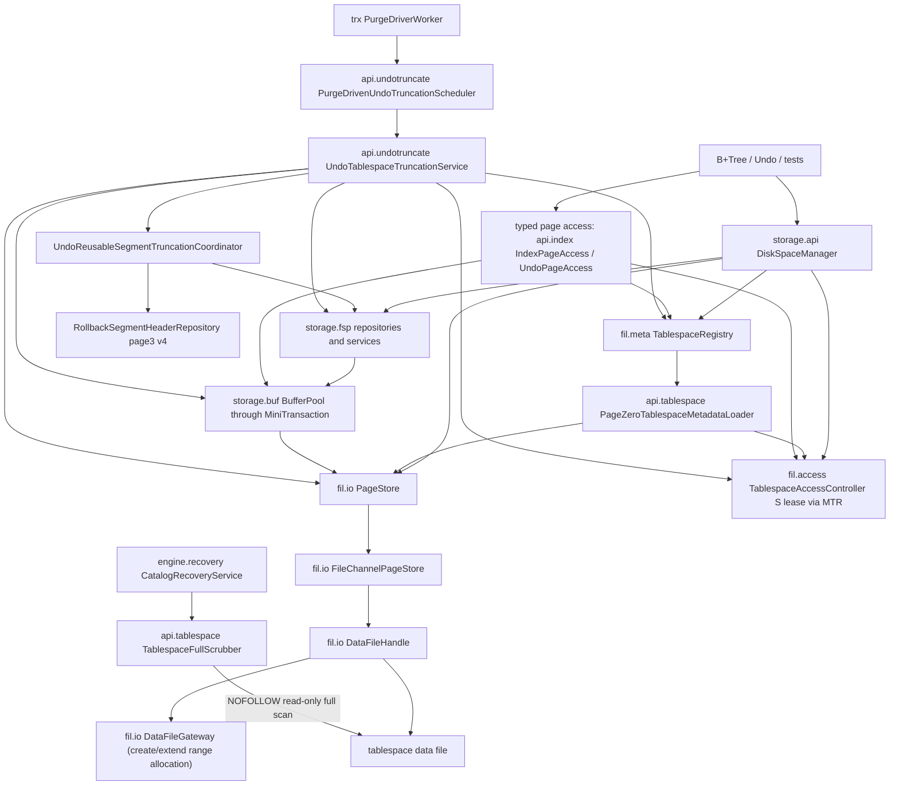

### Current Data Chains

| Flow | Current production chain | Current state |
| --- | --- | --- |
| Create tablespace | `DiskSpaceManager.createTablespace` -> `PageStore.create` -> `DataFileHandle.create`; then `SpaceHeaderRepository.initialize` + page1 IBUF_BITMAP/page2 INODE 信封初始化；GENERAL writes `TablespaceLifecycleHeader(NORMAL,currentSize,epoch=0)`; UNDO writes `TablespaceLifecycleHeader(ACTIVE,initialSize,epoch=0)`; SYSTEM 允许 `SpaceId(0)`、固定保留 page0..4；reserve extent0 and `TablespaceRegistry.replace`（`DiskSpaceManager.java:267`，`StorageEngine.java:760`） | Implemented; GENERAL/NORMAL、UNDO/ACTIVE 与 SYSTEM/NORMAL 都持久发布；4-arg overload 仍默认 GENERAL；新实例先创建 `system.ibd`，在同一 boot MTR 格式化 page3 IBUF_HEADER/page4 IBUF_INDEX，再创建 undo；legacy existing 无 system.ibd 不隐式升级 |
| Open tablespace | `DiskSpaceManager.openTablespace` -> `PageStore.open`; `TablespaceRegistry.open` -> `api.tablespace.PageZeroTablespaceMetadataLoader.load` 持 S lease raw 读 page0 -> FSP_HDR/checksum/physical/lifecycle -> `MaterializedXdesAdmissionValidator` 按 freeLimit 只读校验必需 primary/overflow XDES、重复 bitmap、canonical 管理 descriptor 与 page0 三个全局 FLST base 端点 | Implemented for already-known path；已跨区但 fixed page 缺失、descriptor 非 owner0/FSEG_FRAG、fixed bitmap 不精确或全局链引用管理 extent 时在普通句柄发布前抛 `TablespaceCorruptedException`；page0 legacy-zero checksum 兼容仍保留 |
| Recovery open | `DiskSpaceManager.openTablespaceForRecovery` -> `PageStore.open` -> `TablespaceRegistry.requireForRecovery` -> `PageZeroTablespaceMetadataLoader.loadForRecovery` 只校验 page0 恢复根 -> registry 发布 recovery-only cache entry | Implemented；允许 PAGE_INIT redo 修复尚未写回的 XDES/bitmap，也允许 GENERAL CORRUPTED 与 UNDO TRUNCATING；NORMAL/ACTIVE 句柄首次普通 `require` 在同键 compute 中严格重载，失败保留恢复句柄且不授予普通资格 |
| Catalog-loss full-page scrub | 显式 `CatalogRecoveryService.inspect/rebuild` -> `TablespaceFullScrubber.scrub` -> NOFOLLOW 属性/channel -> page0 FSP/lifecycle -> 按 `ExtentManagementRegionLayout` 读取 page0/primary/overflow XDES header、state/owner/跨页双向 list/bitmap -> 重复 IBUF_BITMAP 与每页 checksum/envelope -> page3 SDI/footer -> 属性复核 + 全文件 SHA-256 | Implemented for manifest-declared file-per-table candidates；只读且不挂载 PageStore/registry、不做 redo/doublewrite 修复；freeLimit 外物理零填充不要求 descriptor，已材料化独立 XDES 缺失/错型/错 header 会阻止重建；这不是每次启动的全实例 scrub |
| Space-management admission | `DiskSpaceManager.createSegment/allocatePage/freePage/dropSegment/usage` -> `MiniTransaction.acquireTablespaceLease(S)` (`MiniTransaction.java:108`) -> `TablespaceRegistry.require`（lease 后复核）-> FSP | Implemented；拒绝 CORRUPTED/INACTIVE/TRUNCATING/DISCARDED，消除状态先检后等待竞态 |
| Segment drop plan | `UndoSegmentFinalizer` 独立只读 MTR -> `UndoSpaceAllocator.inspectDropPlan` -> `DiskSpaceUndoAllocator` -> `DiskSpaceManager.inspectDropSegmentPlan` -> inode page2 identity + 32 fragment slots + 三条 extent list length | Implemented；plan MTR 在 finalization 写 MTR 前提交，只返回不可变 fragment/extent/used-page 快照；identity/计数损坏 fail-closed，不跨返回持 page2 latch/fix |
| Space reservation | `DiskSpaceManager.reserveSpace` -> ordinary access lease + Registry require -> `SpaceReservationService.reserve` -> page0/FLST 容量快照（不持账本锁）-> `PageStore.ensureCapacity` + `SpaceHeaderRepository.setCurrentSizeInPages` if needed -> capacity counter publish -> `MiniTransaction.enlistResource` | Implemented core + consumers（0.14a/0.14b/1.6 extern undo）；per-process in-memory capacity counters + `SpaceReservationKind`；capacity counter lock 只保护内存承诺计数，不包住 Buffer Pool/page latch/file extend；B+Tree split/root split 以 `NORMAL` 预算调用，Undo 主链 grow 与 external payload 按预规划精确页数以 `UNDO` 预算调用，失败发生在真正 page allocation 和页内容修改前 |
| Allocate page | `DiskSpaceManager.allocatePage(mtr, ref[, PageAllocationHint])` -> registry/reservation -> `SegmentPageAllocator` -> `SegmentSpaceService` -> `FreeExtentService`; freeLimit 跨区时 -> `ExtentManagementRegionInitializer` -> primary XDES / repeated IBUF_BITMAP / optional overflow -> reserve management extent -> ordinary FSP_FREE；无空间再 autoextend/retry -> allocation intent -> data `PAGE_INIT` | Implemented；page0 旧槽地址不变，region0 overflow 用 page5，后续区用 base/+1/+5；管理 extent 不计 reservation 业务容量且不进入 FLST；固定管理页先整组冲突预检，再记录 `PAGE_INIT` + header bytes + XDES delta，recovery 只扩容/patch 不重跑 allocator；legacy owner/非零固定页 fail-closed；UP hint 每次 MTR 最多材料化一个普通 extent后回退链头，控制 redo 上界；既有 FSP intent/delta、reservation、autoextend 与 page allocation 语义保持 |
| Typed INDEX/UNDO access | production `StorageEngine` 注入共享 `TablespaceRegistry`：`api.index.IndexPageAccess` / `UndoPageAccess` -> `MiniTransaction.acquireTablespaceLease(S)` -> `TablespaceRegistry.require` -> `MiniTransaction.getPage/newPage` -> `BufferPool` -> `PageStore` | Implemented；生产 typed access 在 lease 后拒绝稳定 INACTIVE/CORRUPTED/DISCARDED；两参构造仍保留给低层页格式测试，不做 registry 准入 |
| Dirty page flush | `FlushCoordinator` 按 `FlushBatchSource` 选择 FlushList/LRU -> 按 SpaceId 升序持 S lease -> batch snapshot/WAL gate -> doublewrite batch -> 按 space 写入并 force -> generation/dirtyVersion complete | Implemented；单页 API 转 batch；部分失败保留未成功页 dirty 与恢复副本；与 truncate X 互斥 |
| UNDO truncate | `PurgeDriverWorker` 成功 batch（含零进展）-> `PurgeDrivenUndoTruncationScheduler` 单调 cooldown -> `UndoTablespaceTruncationService.tryTruncate` 零等待公平 X lease -> page0 persisted initial/物理大小门槛 -> page3 history/active/reuse deferred 或 drain cache/free -> `truncate` 复核空 inode -> marker -> `FlushService.flushThrough` -> `LruBufferPool.invalidateTablespace` -> `DataFileHandle.truncateTo` -> `UndoTablespaceFspRebuilder.rebuild` + page3 v4 format -> final state/Registry publish | Implemented and production-wired by `StorageEngine`；默认启用、1 extent、30s；recovery/live 共享同一 service/controller/registry/redo/flush/reuse directory；TRUNCATING 无视阈值续作；普通竞争只计 deferred，格式/owner/IO/WAL 失败先记 metrics 再使 driver FAILED；同 epoch 可故障续作 |
| Redo replay | `RedoApplyDispatcher registry` -> `FspPageAllocationRedoHandler` / `PageRedoApplyHandler` / `TransactionStateRedoHandler` batch sessions -> page records 写 `PageStore`；trx record 经 `TransactionStateDeltaSink` 交给 `RecoveredTransactionTable` | Implemented physical replay path + FSP intent/metadata delta + undo/rseg metadata delta + undo payload + B+Tree structure delta + non-page trx state recovery；page handler 批末一次写回，transaction handler 不触碰 PageStore/事务状态机，正式 `StorageEngine` dispatcher 注入 recovery context sink，通用 dispatcher 保留 no-op sink；recovery discovery is not fully wired to registry |

### Package Status

| Package area | Representative classes | Current state | Notes |
| --- | --- | --- | --- |
| `storage.api` disk facade | `DiskSpaceManager`, `PageAllocationHint`, `SegmentRef`, `SpaceUsage`, `DiskSpaceUndoAllocator` | Implemented | DiskSpaceManager 管普通 FSP；`PageAllocationHint` 是上层页分配方向/邻近页/页需求的稳定 API，DiskSpaceManager 转换为 FSP 内部方向；SegmentRef/SpaceUsage 是门面值对象；undo allocator 是 undo 端口适配器 |
| `storage.api.undotruncate` lifecycle orchestration | `UndoTablespaceTruncationService`, `UndoTablespaceTruncationRecovery`, `UndoReusableSegmentTruncationCoordinator`, `PurgeDrivenUndoTruncationScheduler`, `UndoTruncationConfig`, `UndoTruncationMetricsSnapshot` | Implemented; recovery/live scheduler production-wired by `StorageEngine` | 可恢复 UNDO 物理收缩、cache/free owner 排空、purge-cycle 自动候选检查与原子 metrics；不新增持久 candidate 状态，当前只选择配置中的单系统 undo space |
| `storage.api.index` typed index page entry | `IndexPageAccess`, `IndexPageHandle` | Implemented | Bridges B+Tree/record code to `MiniTransaction`-owned page guards；生产三参构造注入 registry 后先 lease+require 再 fix/new page |
| `storage.api.tablespace` metadata/scrub adapter | `PageZeroTablespaceMetadataLoader`, `MaterializedXdesAdmissionValidator`, `TablespaceFullScrubber`, `TablespaceFullScrubRequest/Result` | Implemented | 普通 loader 除 page0 外按 freeLimit 定点校验已材料化 XDES/bitmap/管理 extent/全局 FLST 端点；恢复 loader 只建立 redo 所需 page0 根。scrubber 服务显式 catalog-loss 离线全页工具并返回 opaque SDI/文件指纹；三者都不让 `fil` 反向理解 DD |
| `storage.api.dml` table/clustered DML facades | `TableDmlService`, `ClusteredDmlService`, `SecondaryUniqueCheckService`, `TableUpdatePatchCommand`, table/clustered commands, `DmlStatementGuard`, terminal commands/results | Implemented; production-wired by `StorageEngine` and SQL gateway | `TableDmlService` 以聚簇 undo 为逻辑 anchor，按 index id 用独立短 MTR 维护全部 secondary，并把物理 mutation 交统一 Change Buffer coordinator buffer-or-direct；fresh non-unique INSERT 保持目标 leaf cold，unique/UPDATE/revive 继续读取真实状态；SQL INSERT/UPDATE/DELETE 均经 statement guard 与 exact-version LOB binding 进入表级服务 |
| `storage.fsp.flst` file-list primitives | `FileAddress`, `Flst`, `FlstBase`, `FlstNode` | Implemented | FSP/XDES/INODE 跨页链；reader/writer 先取 per-space page0 S/X gate，base/node 首次获取仍按 PageId 升序，持 gate 回访较低邻居时使用有证明的窄越序 scope；base/node 写继续产 FSP delta，不接触文件 IO |
| `storage.fsp.header` space header | `SpaceHeaderRepository`, `SpaceHeaderSnapshot`, `SpaceHeaderRawCodec`, `SpaceHeaderPhysical` | Implemented | page0 header 读写与 raw metadata 加载；`initialize` 盖 page0 FSP_HDR FilePageHeader 信封头；layout 常量供 extent/lifecycle codec 共享；0.19c 起 space header 字段写入追加 `FspMetadataDeltaRecord`，0.19d 起被 delta 覆盖的字段字节不再持久化 `PAGE_BYTES`；lifecycle truncate marker 和 page0 信封仍走物理 `PAGE_BYTES` |
| `storage.fsp.reservation` space reservation | `SpaceReservationService`, `SpaceReservation`, `SpaceReservationKind` | Implemented | `DiskSpaceManager.reserveSpace` 生产接线；内存态容量账本，预扩物理文件/page0 currentSize；0.14b 已接 B+Tree split/root split 与 Undo grow 真实消费者；2026-07-03 修正锁边界：reserve 不持账本锁等待 page0/FLST，consume 不取全局账本锁而只改当前 reservation 原子页额度 |
| `storage.fsp.extent` extent management | `ExtentManagementRegionLayout`, `ExtentManagementRegionInitializer`, `ExtentDescriptorRepository`, `XdesPageCodec`, `FreeExtentService`, allocation policy/direction | Implemented | 4K/8K/16K/32K/64K 共用双 XDES 页管理区公式；page0 `[0,C)` 兼容，page5/region base/+5 承载后续 entry，+1 为重复 bitmap；68-byte stride 仅消费有效 bitmap bytes；管理 extent owner0/FSEG_FRAG 且普通 mutator 拒绝；跨页读写仍产实际 pageId 的 FSP delta |
| `storage.fsp.segment` segment management | `SegmentInodeRepository`, `SegmentPurpose`, `SegmentSpaceService`, `SegmentPageAllocator` | Implemented | INODE slot、segment extent list、fragment 页和 segment 页分配；`SegmentPageAllocator` 在需要新 extent 时构造 `ExtentAllocationRequest`，leaf 顺序 hint 可批量挂 2-4 个 extent；0.19c 起 inode slot image/field/fragment slot 写入追加 metadata delta，0.19d 起对应物理 `PAGE_BYTES` 被提交过滤器替代 |
| `storage.fsp.lifecycle` lifecycle marker | `TablespaceLifecycleHeader`, `TablespaceLifecycleRawCodec` | Implemented | page0 198–237 持久化 GENERAL NORMAL/CORRUPTED/DISCARDED marker 与 UNDO ACTIVE/INACTIVE/TRUNCATING marker；GENERAL 稳定状态拒绝 truncation epoch/target，DDL DROP 用 DISCARDED 作文件删除前的 durable intent |
| `storage.fsp.undo` undo rebuild | `UndoTablespaceFspRebuilder` | Implemented | 物理 truncate 后清零并重建 page0/page2/extent0 |
| `storage.fsp.exception` exceptions | `FspMetadataException`, `NoFreeSpaceException`, `SpaceReservationExceededException` | Implemented | FSP 元数据损坏/空间耗尽/预留额度耗尽领域异常 |
| `storage.fil.io` physical IO | `PageStore`, `FileChannelPageStore`, `DataFileDescriptor`, `DataFileHandle`, `AutoExtendPolicy`, `DataFileGateway`, `ZeroFillDataFileGateway`, `PreallocationStrategy` | Implemented | State/registry-free；单文件 `truncate`（缩短）与 `ensureCapacity`（幂等扩到至少 N，crash recovery 用），均持 physical Lifecycle->FileSize(X)；create/extend/ensureCapacity 的新页范围初始化委托 `DataFileGateway`，默认 `ZeroFillDataFileGateway` 保持零填充行为，`PreallocationStrategy` seam 已存在但平台 native adapter 未接；`force/forceAll` 经 `FsyncLock` 串行化同一 data file 的 `FileChannel.force(true)` |
| `storage.fil.lock` physical locks | `TablespaceLifecycleLatch`, `FileSizeLock`, `ResourceGuard`, `FsyncLock` | Implemented | lifecycle/file-size/fsync 均由 `DataFileHandle` 使用；未接线的 `DataFileHandleLock`/`PageIoRangeLock` 已删除，物理层暂不建句柄替换锁或 page-range 合并锁 |
| `storage.fil.access` operation admission | `TablespaceAccessController`, `TablespaceAccessLease` | Implemented | controller 每 SpaceId 公平显式 RW lease；普通路径有界等待，自动维护用 `tryAcquireExclusive` 零等待且不越过排队 owner；`StorageEngine` 创建单实例并注入 MTR/loader/disk/flush/recovery/live undo truncate |
| `storage.fil.meta` runtime metadata | `TablespaceRegistry`, `CachingTablespaceRegistry`, `TablespaceMetadataLoader`, `TablespaceMetadata`, `Tablespace`, `TablespaceHandle` | Implemented for runtime admission | cache value 原子携带 handle 与 recovery-only 资格；恢复 cache miss 用最小 loader，NORMAL/ACTIVE 普通 require 必须严格重载晋升，非服务状态仍直接由白名单拒绝；UNDO/GENERAL lifecycle 来自 page0，registry 不读取 DD |
| `storage.fil.state` type/state values | `TablespaceState`, `TablespaceType`, `TablespaceTypeFlags`, `SpaceFlags` | Implemented | 表空间类型与状态编码值对象；状态转换由 api/engine 层编排 |
| `storage.fil.exception` exceptions | `TablespaceNotFoundException`, `TablespaceUnavailableException`, `DataFilePhysicalException`, `PageOutOfBoundsException` | Implemented | 表空间文件缺失、越界、损坏、不可用等 fil 领域异常 |
| `storage.page` physical envelope | `PageEnvelopeLayout`, `FilePageHeader`, `PageEnvelope`, `PageChecksum`, `PageImageChecksum`, `PageType` | Implemented | Shared header/trailer/checksum helpers over raw page bytes；`PageImageChecksum.verify` 同时校验 header checksum、trailer checksum 与 trailer low32 LSN；尾部追加稳定 `UNDO_PAYLOAD=9`、`IBUF_HEADER=11`、`IBUF_INDEX=12`，既有 code 不变 |

## Buffer Pool + MiniTransaction Slice

### Current Flow

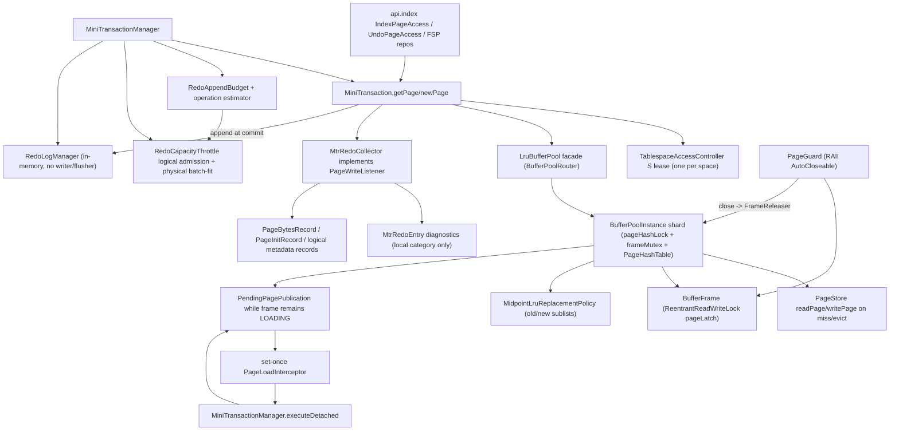

### Current Data Chains

| Flow | Current production chain | Current state |
| --- | --- | --- |
| Page fix (INDEX) | `api.index.IndexPageAccess.openIndexPage` -> optional production `MiniTransaction.acquireTablespaceLease(S)` + `TablespaceRegistry.require` -> `MiniTransaction.getPage` -> `LruBufferPool.getPage`（facade 经 `BufferPoolRouter` 路由到归属 `BufferPoolInstance`）-> `instance.getPage` -> `acquire` (`BufferPoolInstanceLatchSet`: `pageHashLock` 查/注册 `PageId -> frame`，目标 `frameMutex` 固定/检查 LOADING/dirty/state；miss 时通过 `freeListLock` 取空闲帧，或经 `lruListLock` 复制 victim 顺序后逐帧复核；命中 LOADING 出锁等 `PageLoadFuture`；装 LOADING 占位后**出所有内部锁** `readAndPublish` 读盘) -> `pageLatch.lock` -> `new PageGuard`(releaser=instance) -> `attachWriteListener(MtrRedoCollector)` + `memo.pushPageGuard`；facade 再调 read-ahead 钩子 | Implemented；生产组合根使用 registry-aware typed access，测试两参构造仍可只测页格式；**0.10d 多 instance（默认 N=1，生产 N=1）**：facade 路由单页操作到分片、跨切面查询逐分片聚合；miss 读盘移出内部锁（Phase B：per-frame LOADING + load future）；**13.1d** 已拆 `pageHashLock + frameMutex + freeListLock/lruListLock/flushListLock`，dirty view 由 `DirtyPageList` 真实 flush list 承载 |
| LOADING pre-publication mutation | `BufferPoolInstance.readAndPublish`（`BufferPoolInstance.java:388`）在读盘后、发布前构造 `PendingPagePublication` -> set-once `PageLoadInterceptor.beforePublish`；拦截器可 claim 一次 X guard，并交给 `MiniTransactionManager.executeDetached`（`MiniTransactionManager.java:196`）adopt；成功 commit 后才发布 CLEAN/DIRTY 并完成 future，claim/写入后的失败抛 `PagePublicationFatalException` 且不发布旧页 | Implemented and production-wired for Change Buffer；interceptor 在 page-hash/frame/LRU/flush-list 锁外运行；同页等待者、prefetch 与 demand load 共用该协议；非 INDEX/system/bitmap 页不进入 merge |
| Page fix (UNDO) | `UndoPageAccess.openUndoPage` -> optional production lease+Registry require -> `MiniTransaction.getPage` (same path); page-type gate rejects non-UNDO pages | Implemented |
| New page (INDEX) | `api.index.IndexPageAccess.createIndexPage` -> optional production lease+Registry require -> `MiniTransaction.newPage` -> `LruBufferPool.newPage` -> `acquire(readFromDisk=false)` -> zero-fill under X latch; MTR `collector.recordInit(pageId, PageType.INDEX)` | Implemented |
| New page (UNDO) | `UndoPageAccess.newUndoEnvelope` -> optional production lease+Registry require -> `MiniTransaction.newPage(...,PageType.UNDO)` | Implemented |
| New page (UNDO external payload) | `UndoPayloadStorage.write` -> `UndoSpaceAllocator.allocatePage` -> `MiniTransaction.newPage(...,PageType.UNDO_PAYLOAD)` -> `UndoPayloadPage.format` | Implemented；与 root 同属 FSP undo segment，但不加入主 UNDO FIL chain；页内保存 owner/segment identity/index/count/length/CRC，segment drop 统一释放 |
| MTR begin/commit | 生产读路径 `MiniTransactionManager.beginReadOnly()`（零预算）；固定布局写走 `budgetFor(purpose)`，动态写走 `budgetFor(purpose, RedoBudgetWorkload)` -> `begin(RedoAppendBudget)` -> throttle 在页/FSP 资源前按 logical 上界准入并校验 physical LogBlock file-fit -> `MiniTransaction.commit` 冻结一次 persisted records -> 精确结算/上界校验 -> append 后 reservation ownership transfer -> disable collector -> stamp touched pages -> `memo.releaseAll()` LIFO（发布 dirty/pageLSN）-> `RedoLogManager.markClosed(range)`；`executeDetached` 为发布前 merge 暂时隐藏当前外层 MTR，子操作独立准入/提交后无条件恢复父绑定 | Implemented；外层仍可能持导航 parent S latch，detached 仅用于有局部无环证明的 target/global-ibuf/bitmap 路径，不是通用嵌套事务 API；B+Tree height、DML 首写、rollback undo、Change Buffer append/merge 均有 purpose/budget；预算低估在 append 前 fail-stop |
| MTR rollback | `MiniTransaction.rollbackUncommitted` -> `memo.releaseAll()` only (`:167`) | Implemented; dirty pages stay dirty — no buffer-content undo (documented simplification `:18-19`) |
| Dirty page mark | `PageGuard.close` -> `FrameReleaser.release(frame, wrote)` -> `BufferPoolInstance.release`（归属分片，0.10d 起 `FrameReleaser` 由 instance 实现）OR-dirties via `markDirty` under target `frameMutex`; sets `oldestModificationLsn`/`newestModificationLsn`/bumps `dirtyVersion` and publishes/upserts `DirtyPageList` under `flushListLock` | Implemented；**13.1d**：同页重复修改只保留一条 flush list 记录，oldest LSN 约束 checkpoint，newest LSN 随页面最新 LSN 更新；**E1 修 bug**：`markDirty` 改用 `oldestModificationLsn==null` 守卫（原 `!dirty`）——newPage 对驻留页重初始化先置 dirty=true（无 LSN），双 newPage 同 MTR（allocatePage+createIndexPage 同根页）后 commit markDirty 会因 dirty 已真而漏设 oldestMod，留 dirty+null oldestMod 帧致 flush/checkpoint NPE。flush-after-双newPage 之前潜伏（既有 btree 测试不 flush 未触发） |
| Eviction | `BufferPoolInstance.obtainVictim(cleanSkip)`（分片本地，无跨分片 stealing）优先 free/clean 帧直接复用；仅有脏 unfixed 帧时记 PageId、出所有内部锁经 `DirtyVictimFlusher.flushVictim`（→`FlushCoordinator.singlePageFlush`：WAL gate+checksum+doublewrite+`completeFlush`）刷干净后回环重选；本轮 `cleanSkip` 防空转，无干净帧抛 `BufferPoolExhaustedException`；无 `DirtyVictimFlusher` 时遇到脏 victim 直接抛 `BufferPoolExhaustedException`，不再 fallback 直写 PageStore | Implemented；注入 flusher（生产 `StorageEngine`）后脏页淘汰 WAL 安全：redo 未 durable→`flushVictim` 返回 false→不写盘；`FAILED`→抛根因不吞。2026-07-05 已移除 legacy no-flusher direct-write fallback |
| Checkpoint feed | `CheckpointCoordinator` 算 safe LSN -> `CheckpointMetadataParticipant` 捕获 `TransactionSystem.snapshotCounters` 并 force `TransactionRecoveryCheckpointStore` -> force `RedoCheckpointStore` label -> 发布内存 checkpoint -> 锁外 `RedoReclaimBoundary` | Implemented；sidecar→redo label→reclaim 顺序保证 fuzzy checkpoint/redo ring 回收后仍有事务高水位；sidecar/label 失败都不发布或回收。`FLUSHING` 页仍留在 `DirtyPageList`，safe LSN 不能越过正在写出的页 |
| Tablespace invalidation | `UndoTablespaceTruncationService` 持 X lease -> `LruBufferPool.invalidateTablespace` -> `SpaceLifecycleClock.beginInvalidation` 关闭该 space 新前台准入/预读 -> 各分片 Condition 等待 fixCount=0 -> dirty 则拒绝并 abort 版本窗口 -> 全分片 drain+check 通过后 `advanceInvalidation` 推进 `TablespaceVersion` -> 移除旧版本 frame -> finish 重新开放 | Implemented；fixed 等待有 timeout/interrupt；不隐式绕过 WAL flush；并发前台 get/new 命中失效窗口抛 `BufferPoolStalePageException`，prefetch 直接跳过，LOADING 发布前会复核版本并清占位；dirty drain 等待独立走 facade 级 `awaitDirtyStateChange`，由 flush/guard release/reset 等 dirty-view 变化路径 signal |

### Package Status

| Package area | Representative classes | Current state | Notes |
| --- | --- | --- | --- |
| `storage.buf` pool core | `BufferPool`, `LruBufferPool`(facade), `BufferPoolInstance`, `BufferPoolInstanceLatchSet`, `PageHashTable`, `BufferPoolRouter`, `BufferFrame`, `PageGuard`, `PageLatchMode`, `DirtyVictimFlusher`, `DirtyPageList`, `BufferFrameState`, `FrameStateMachine`, `PageLoadFuture`, `BufferPoolLoadTimeoutException`, `BufferPoolLatchViolationException`, `SpaceLifecycleClock`, `TablespaceVersion`, `BufferPoolStalePageException` | Implemented (production-wired) | **0.10d 多 instance 分片**：`LruBufferPool` 转 facade，经 `BufferPoolRouter`(`hash(PageId)%N` 确定路由) 把单页操作转发到归属 `BufferPoolInstance`、跨切面查询（dirty 候选合并按 oldestLSN 升序 / oldest LSN 全局 min / hasDirty / residentCount / residentCountInRange / 截断）逐分片聚合；分片间无 work stealing（某分片满即抛 `BufferPoolExhaustedException`）；`invalidateTablespace` 两阶段（全分片 drain+check 通过后再移除）保 all-or-nothing。容量按 base+前 r 个+1 切分（capacity≥N）。生产 N=1（`EngineConfig.bufferPoolInstanceCount` 默认 1，`StorageEngine` 经此构造）。**Phase B + 13.1a/b/c/d + legacy flush removal**：`FrameStateMachine` 覆盖 FREE/LOADING/CLEAN/DIRTY_PENDING/DIRTY/FLUSHING/EVICTING/STALE；普通 MTR 写先进入 DIRTY_PENDING 再在提交时发布 DIRTY，Change Buffer 发布前子 MTR在回调内提交后由 LOADING 发布路径直接建立 DIRTY/flush-list；`PageHashTable` 由 `pageHashLock` 保护，`BufferFrame` 当前绑定/状态/fix/dirty/LSN/loadFuture/spaceVersion 由 `frameMutex` 保护；free list、LRU、flush list 分别由 `freeListLock`/`lruListLock`/`flushListLock` 保护；`DirtyPageList` 保存 `PageId + oldest/newest LSN` 而非 frame 引用，候选枚举走 flush-list 快照后再 pageHash/frame 复核，fixed DIRTY 页仍出候选供 drain 看到 dirty view，`FLUSHING` 页留链约束 checkpoint 但不重复出候选；Buffer Pool 不再提供 `flush/flushAll` 直写 PageStore API，所有脏页物理写出只走 `FlushCoordinator`；miss 读盘、`PageLoadFuture` wait、dirty victim flush 前均由 `BufferPoolInstanceLatchSet.assertMetadataUnlocked` 守卫无内部锁。**0.22 stale-frame 版本语义**：每个 resident/LOADING frame 带 `TablespaceVersion`，`SpaceLifecycleClock` 在 truncate/drop invalidation 窗口拒绝前台准入、跳过 prefetch，并在 lookup/LOADING 发布前复核版本；已过期 clean unfixed frame 只隔离不复活。**0.13d SX latch**：`PageLatchMode` 增 `SHARED_EXCLUSIVE`（SIX），分层实现=帧内 `pageLatch.readLock()`（与 S 共存、排它 X）+ 每帧 `pageIntentLatch`(`ReentrantLock`，排它另一 SX/X)；`BufferPoolInstance.acquire` 对 SX 先取 read latch 再取 intent latch，`PageGuard` 持双闩、close 逆序先放 intent 后放 read；SX 只授只读内容（写仍须 X，`requireExclusive` 拦截），不支持原地 SX→X 升级（RRWL 无升级会自死锁）。**已接入 btree 悲观 SMO 下降**（root SX 首遍 + restart-in-X，见 B+Tree 小节） |
| `storage.buf` pre-publication extension | `PageLoadInterceptor`, `PendingPagePublication`, `PagePublicationFatalException`, `BufferPool.isResident` | Implemented (Change Buffer production-wired) | set-once interceptor 只在 miss 私有 LOADING frame 读盘后运行；claim X guard 不增加普通 fixCount，detached MTR 可 adopt；回调返回时 guard 必须关闭，commit/rollback 后 Buffer Pool 才完成 single-flight future。认领/写入/最终发布后的失败不回收 frame并向 owner/等待者传播 fatal；`isResident` 把 LOADING/CLEAN/DIRTY/FLUSHING 都视为不可缓冲，且不执行 IO |
| `storage.buf` replacement | `ReplacementPolicy`, `MidpointLruReplacementPolicy` | Implemented (production-wired) | Midpoint LRU(old/new 子链)：读入进 old 头、`oldBlocksTime`(注入毫秒时钟) 提升窗 + `youngDistanceThreshold`(young 子链 1/4) 抗抖动 → 抗扫描污染（Phase A 0.8）；sole impl，injection ctor `LruBufferPool(...,ReplacementPolicy)` 供测试注入可控时钟；read-ahead-aware 分类、`oldBlocksPct` 配比再平衡待 0.10 |
| `storage.buf` flush support | `DirtyPageCandidate`, `FlushPageSnapshot`, `BufferPoolExhaustedException` | Implemented | Value objects consumed by flush module；`failFlush` 现 FLUSHING→DIRTY（Phase B，不再 no-op）；`snapshotForFlush` DIRTY→FLUSHING、`completeFlush` 版本符→CLEAN/不符→DIRTY；`FlushCoordinator` WAL-gate skip 路径补 `failFlush` 复位 |
| `storage.buf` write listener | `PageWriteListener` | Implemented | DI seam; only production impl is `MtrRedoCollector`; `NO_OP` path has no production caller |
| `storage.buf` read-ahead + warmup | `BufferPool.prefetch`/`residentPageIds`/`residentCountInRange`, `LinearReadAheadTracker`, `RandomReadAheadDetector`, `ReadAheadRequest`, `ReadAheadHook`, `ReadAheadService`, `ReadAheadState`, `BufferPoolWarmupService` | Implemented (production-wired) | 0.10a linear read-ahead：`prefetch`=free-frame-only 载入 old 不 fix 不提升（跳过驻留/无空闲帧丢弃/IO 失败回收）；`LinearReadAheadTracker`(单顺序流，同 extent 连续达 threshold→预取下一 extent，`PAGES_PER_EXTENT=64`)；`ReadAheadService`(实现 `ReadAheadHook`，前台 `recordAccess` 喂检测器+有界队列、单 worker `prefetch`)；`attachReadAheadHook`+`getPage` 回调；engine 后台启停（linear threshold 56、门控 `backgroundFlushEnabled`）。**0.10c random read-ahead（默认禁用）**：`BufferPool.residentCountInRange`(page hash 短锁内逐页查区间驻留数，O(extent)) + `RandomReadAheadDetector`(同 extent 驻留数达 threshold→补取整 extent，bounded recent 窗去重而非永久 set)；`ReadAheadService` 4 参构造增 `randomThreshold`(0=禁用→不构造检测器/普通路径不查 residentCountInRange)，`recordAccess` 持 service.lock 时查 residentCountInRange(page hash 短锁，单向无环) 喂 detector、命中入队，random 检测异常吞掉只丢本次预取；`StorageEngine` 以 `RANDOM_READ_AHEAD_THRESHOLD=0` 构造（对齐 MySQL `innodb_random_read_ahead=OFF`），生产启用留 config（延后）。0.10b warmup：`BufferPoolWarmupService` dump(residentPageIds→文件 magic+crc32)/load(读回→prefetch，缺失/损坏 no-op)，`StorageEngine` close 写 / open 预取。简化：单流、free-frame-only、random 触发用「extent 驻留数」启发式(非 access-bit)、warmup 同步预取/无 IO 速率控制/space version；多 instance 分片 + 专用 `PageHashTable` 已由 0.10d 闭合 |
| `storage.mtr` transaction | `MiniTransaction`, `MiniTransactionManager`, `MtrOperationRedoBudgetEstimator`, `MiniTransactionState`, `MtrSavepoint`, `MtrRedoCategoryScope` | Implemented (production-wired by engine) | Manager 注入共享 controller + durable redo + throttle + 实例页大小；固定 profile 与领域 `RedoBudgetWorkload` 分入口；commit 精确验证并返回 end LSN；默认测试构造仍内存 redo/no-op reservation |
| `storage.mtr` memo + collector | `MtrMemo`, `MtrRedoCollector`, `MtrRedoEntry`, `MtrRedoCategory`, `MtrLatchOrderScope`, `MtrStateException` | Implemented | memo 同时持 page guard 与 per-space lease；LIFO 保证 latch/fix 先释放、lease 最后释放。**0.13d SX**：`fix` 的同页升级防护由「S→X 禁」扩为「S 或 SHARED_EXCLUSIVE 仍持时求 X 且未持 X 即禁」（两者都持该页 readLock，再求 X 会自死锁）。**0.23a MTR page latch ordering**：默认独立多页 latch 必须按 `(spaceId,pageNo)` 升序获取；同页重入和已提前释放页不计入违规；违反时在进入 Buffer Pool 等待前抛 `MtrStateException`。`allowOutOfOrderPageLatch(reason)` 只给 B+Tree root/child/sibling/SMO allocation-format-free、Undo grow/FIL 链读/rseg page3 slot 等有局部无环证明的路径短暂开例外，作用域关闭后恢复默认守卫。**0.23b MTR/Redo 纪律**：savepoint 不允许释放 touched page；commit 固定 append -> stamp pageLSN -> release/dirty publish -> markClosed；collector 维护本地分类诊断（默认 `PAGE_BYTES_GENERIC`，`PAGE_INIT` 由 newPage 固定产生）。**0.19d/0.19f/0.19g/0.19h logical redo 去重**：提交给 redo manager 的视图会删除被 FSP metadata、undo metadata、完整 undo payload、B+Tree sibling delta after-image 精确覆盖的物理 `PAGE_BYTES`，但 touched page 仍由真实页写维护；`TRX_STATE` 分类承载 non-page 正式事务终态/高水位 logical redo，恢复时仍与 page3 物理证据交叉校验 |

## Change Buffer Slice

### Current Flow

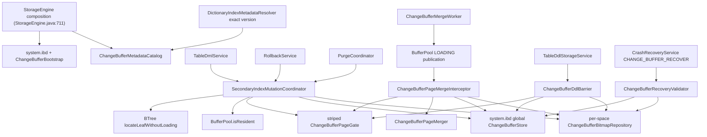

### Current Data Chains

| Flow | Current production chain | Current state |
| --- | --- | --- |
| Bootstrap / effective mode | fresh `StorageEngine.open` -> create SYSTEM SpaceId 0 -> `ChangeBufferBootstrap.initialize`（`StorageEngine.java:771`，`ChangeBufferBootstrap.java:66`）在 boot MTR 创建 leaf/non-leaf segment、page3 header、page4 stable root；existing 先 recovery-open system.ibd；`initializeChangeBufferComponents`（`StorageEngine.java:831`）按 system/resolver 能力收窄 effective mode | Implemented；旧实例缺 system.ibd 时 legacy `NONE`，不创建升级文件；缺持久 exact-version resolver 时不产生新跨重启记录；新实例配置模式持久保留作诊断 |
| Buffer-or-direct decision | `TableDmlService` / `RollbackService` / `PurgeCoordinator` -> `SecondaryIndexMutationCoordinator`（`SecondaryIndexMutationCoordinator.java:164,188,214`）-> 注册 exact metadata -> `locateLeafWithoutLoading`（`SplitCapableBTreeIndexService.java:1272`）-> residency/gate/bitmap/capacity/pending 二次复核 -> `ChangeBufferStore.requireAppendCapacity`（`:118`）page 3 X-latch 最终容量门 -> append 或普通 B+Tree direct | Implemented；仅 non-unique、全 ASC、非 root-leaf、非 system/bitmap、未驻留且由 page1 bitmap 管理的 leaf 可 buffer；max-size 以 Buffer Pool frame 百分比为基准、每条 pending 保守计一页等价量；不同 target 的并发资格快照不能越过全局上限，mode/范围/容量/gate/pending 失败直接回退，不触碰未预留重复 bitmap，也不等待 worker 腾空 |
| Durable append | gate 内写 MTR -> `ChangeBufferStore.append`（`ChangeBufferStore.java:75`）在 page3 X latch 下分配 sequence、插入 IBUF_INDEX、推进 root level/pending -> 同 MTR `ChangeBufferBitmapRepository.write` 置 buffered；commit 后才返回 BUFFERED | Implemented；全局 key `(space,page,sequence)` 严格稳定；payload 带 table/schema/index/operation/entry 与双 CRC；header/tree/bitmap 任一步失败不发布完成结果 |
| Pre-publication merge | cold target miss -> `BufferPoolInstance.readAndPublish` -> interceptor（`ChangeBufferPageMergeInterceptor.java:135`）取得 target gate -> 只读 MTR 扫 bitmap/store -> detached merge MTR adopt LOADING target -> `ChangeBufferPageMerger.apply`（`ChangeBufferPageMerger.java:88`）幂等达到目标状态 -> consume records/header pending + 重算 bitmap -> commit -> Buffer Pool 发布 DIRTY | Implemented；普通读、预取、worker 都看不到“磁盘旧页 + pending mutation”；单页最多 64 条且 merge 预算为 128 page-image equivalents；未关闭 guard、exact-version resolver 缺失/错配、页 identity/容量/后半程失败向 owner/等待者传播 fatal，局部 DELETE 不触发 B+Tree leaf merge |
| Background merge | `StorageEngine.startBackgroundChangeBufferMerge` 在 redo/page cleaner/purge 后启动 -> worker 每轮只读选最多 64 个不同目标 -> 对冷页普通 `getPage` 复用 interceptor；close 先 `ChangeBufferMergeWorker.close` 再关闭其 pool/redo 依赖 | Implemented；单 daemon、Condition 可提前唤醒、stop timeout 有界；已驻留页跳过；任何运行期失败保留 pending 证据并发布 fatal，StorageEngine 关闭写准入/recovery gate，DatabaseEngine 转 FAILED |
| DDL barrier / transfer | `TableDdlStorageService` -> `discardIndex` / `discardSpace`（`ChangeBufferDdlBarrier.java:90,111`）按稳定 PageId gate 消费旧 identity；IMPORT 在用户 X lease 外先 discard，挂载候选后 `resetImportedSpaceBitmaps`（`:164`），最后 NORMAL + WAL flush + force + registry publish | Implemented；DROP/DISCARD/REBUILD 不在回收后留下悬空记录；不可读文件走 global-only discard；IMPORT 每 bitmap 页单 MTR 幂等清零，重复公式页类型不符则保持 DISCARDED 并 fail-closed |
| Recovery | `StorageEngine` 把 participant 写入 `RecoveryRequest` -> redo boundary 后 `CrashRecoveryService` 进入 `CHANGE_BUFFER_RECOVER` -> `ChangeBufferRecoveryValidator.validateAfterRedo` 以 `pending+1` 扫描并核对固定 header identity、全树/count、sequence/nextSequence、单 target 64 条上限和逐 target bitmap；正常模式随后 attach interceptor | Implemented；先释放 system 页再读用户 bitmap；READ_ONLY_VALIDATE 只校验不 attach/merge；FORCE 拒绝 SpaceId 0；pending 非零且 exact-version resolver 不可用时拒绝开放流量；用户页保持惰性 merge |
| Observability | `StorageEngine.changeBufferSnapshot`（`StorageEngine.java:2668`）-> read header pending + system tree segment usage + shared commit-after counters + observed bitmap pages + worker state | Implemented Java snapshot；bitmap pages 是本进程已验证集合，不是磁盘全扫描；日志限于初始化、模式降级、recovery、DDL 与 worker failure |

### Package Status

| Package area | Representative classes | Current state | Notes |
| --- | --- | --- | --- |
| `storage.changebuffer` persistent format | config/mode/operation/header snapshot+codec+repository, mutation codec/store, bitmap layout+repository | Implemented; production-wired | system.ibd page3/page4 与用户 page1 bitmap 均走 Buffer Pool/MTR/redo；CRC、版本、FIL identity、固定 root/index/segment、sequence 与 bitmap/tree 矛盾都 fail-closed；第二覆盖区间在 FSP 支持前不参与普通 buffering |
| `storage.changebuffer` mutation/merge | `SecondaryIndexMutationCoordinator`, `ChangeBufferPageGate`, `ChangeBufferPageMerger`, `ChangeBufferPageMergeInterceptor` | Implemented; DML/rollback/purge/Buffer Pool-wired | 一个决策点、一个单页执行器；不把 record/metadata 语义下沉到 Buffer Pool，也不让 changebuffer 依赖 SQL/session/DD 实现 |
| `storage.changebuffer` lifecycle | `ChangeBufferBootstrap`, `ChangeBufferMergeWorker`, `ChangeBufferDdlBarrier`, `ChangeBufferRecoveryValidator`, `ChangeBufferSnapshot` | Implemented; engine/DDL/recovery-wired | fresh/existing/legacy/read-only/FORCE、后台启停、DDL discard/import reset 与诊断闭环；无新增 Reserved/Unwired 类型 |

## Record Layer Slice

### Current Flow

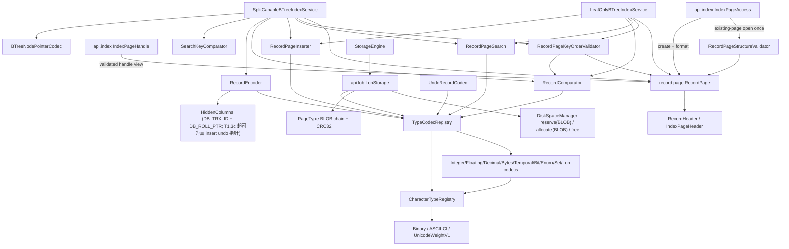

### Current Data Chains

| Flow | Current production chain | Current state |
| --- | --- | --- |
| INDEX page record access | 新页：`IndexPageAccess.createIndexPage` -> `mtr.newPage(INDEX)` -> `RecordPage.format`；既有页：`openIndexPage/openIndexPageHandle` -> `mtr.getPage(S/X)` -> `RecordPageStructureValidator.validate` -> `IndexPageHandle.recordPage` | Implemented；既有页每次 fix 后、返回 handle 前校验一次 header/system records/live chain/heap identity+range/PageDirectory+nOwned，并校验 FREE fragment chain 与 `linkedFreeBytes<=GARBAGE<=physicalDeadUpper`；损坏早于 B+Tree 字段解析、underflow/merge-fit 和写页 fail-closed；高扇出 `recordPage()` 不重复校验 |
| INDEX page schema-aware key order | LeafOnly `openRootLeaf` / SplitCapable `openBTreePageOutOfOrder(index)` -> indexId 核对 -> 按实际 page level 选择 leaf schema/keyDef/CONVENTIONAL 或 `BTreeNodePointerSchema`/NODE_POINTER -> `RecordPageKeyOrderValidator.validate` -> `RecordComparator.compare(record,record)` | Implemented (0.21d)；既有页在 search/scan/SMO 写入前逐链校验 record type、完整 CHAR/VARCHAR 严格 charset 解码与相邻 key 非降序；NULL/DESC/byte-prefix/collation 复用 0.21c；重复/等价 key 与 delete-mark 合法。物理 validator 继续 schema-free，fresh create/format 空页不重复扫描 |
| In-page search | `LeafOnlyBTreeIndexService`/`SplitCapableBTreeIndexService` -> `new RecordPageSearch(registry)` (`:49`/`:72`) -> `search.findEqual/findInsertPosition` -> `RecordCursor` per row | Implemented |
| Index key comparison | leaf `RecordComparator` / node-pointer `SearchKeyComparator` -> shared `EncodedKeyPartComparator` -> NULL order -> `TypeCodec.compareKeyPart`；CHAR/VARCHAR/TEXT -> `CharacterTypeRegistry.collationFor(charset,collation)` | Implemented；0.21c 起两条链共享 nullable/prefix/ASC-DESC；0.21g 追加 stable-id Unicode weight v1 与 UTF-8 code-point-safe prefix；0.21h TEXT/BLOB 只允许显式 prefix 且 external 值只比较 32B inline prefix，JSON/full LOB fail-closed |
| Inline temporal scalar codec | `RecordEncoder` / `RecordFieldResolver` / `UndoRecordCodec` / leaf+node key comparator -> shared `TypeCodecRegistry` -> `TemporalCodec` | Implemented (0.21e1)；DATE=4B signed epochDay、TIME=8B signed duration millis、DATETIME=8B signed epoch millis、TIMESTAMP=8B signed UTC epoch millis、YEAR=2B unsigned；均可直接按 unsigned encoded bytes 保序比较 |
| BIT / ENUM / SET codec | Record/Undo/B+Tree shared `TypeCodecRegistry` -> `BitCodec` / `EnumCodec` / `SetCodec` | Implemented (0.21e2/0.21f)；BIT(1..64) 左对齐 canonical 尾位、ENUM 1-based ordinal、SET 最多 64 member bitmap；均有 schema 边界与保序比较，不能误用 prefix |
| Off-page LOB plan/write/read/free | `LobStorage.planWrite` 无 IO 冻结 payload/pageCount/CRC/prefix/workload -> `writePlanned` reserve/allocate/format；`planFreeBatch/executeFreeBatch` 先整批校验 chain/segment/重叠再释放；read 逐页 S latch/release + chain/CRC | Implemented (0.21h + DML ownership lifecycle)；INSERT 自动 externalize；UPDATE replacement 的新链由 rollback owner、旧链由 committed purge owner；DELETE 把旧 external 链交给 purge。未赋值 external 列由 `TableUpdatePatchCommand` 保留原引用，不经 SQL hydrate/rewrite |
| In-page insert | btree service -> `new RecordPageInserter(registry)` (`:51`/`:73`) -> `inserter.insert` -> `HeapSpaceManager` alloc + `RecordPageDirectory` slot maintenance; `RecordPageOverflowException` triggers btree split | Implemented |
| Clustered record encode | `SplitCapableBTreeIndexService.insertClustered` -> stamps `new HiddenColumns(transactionId, rollPointer)`（T1.3c 起为调用方传入的真 insert undo 指针，非 NULL） (`:105`) -> `RecordEncoder.encode` (`:426`) | Implemented; `DB_ROLL_PTR` 可写真 INSERT undo 指针（由 `UndoLogManager.planInsert/appendPlanned` 返回）；未接 undo 的路径仍传 `RollPointer.NULL` |
| Undo record codec | `UndoRecordCodec` -> shared type codecs；INSERT 可追加 `LO/v1` ownership；UPDATE/DELETE 可追加 `LV/v1` old/new version ownership；随后可组合 `SI/v1` secondary tail | Implemented；旧 EOF、旧 LO/SI 组合继续兼容；LV 对 ordinal/flag/type/external envelope 严格校验。UPDATE rollback 只释放新链，committed purge 只释放旧链；DELETE 只声明 purge-old |
| Record decode | `RecordFieldResolver` -> `TypeCodecRegistry` -> per-column `FieldSlice`/`ColumnValue`; reached via `RecordCursor` (btree scan/lookup) | Implemented; standalone `RecordDecoder` has no production caller (test-only) |

### Package Status

| Package area | Representative classes | Current state | Notes |
| --- | --- | --- | --- |
| `record.schema` | `TableSchema`, `ColumnType`, `IndexKeyDef`, `ColumnDef`, `KeyPartDef`, `KeyOrder`, `TypeId` | Implemented | 28 `TypeId`；0.21e1/e2/f/h 只在尾部追加 TIME/TIMESTAMP/YEAR/BIT/ENUM/SET/TEXT/BLOB/JSON family，既有枚举顺序不变且磁盘不存 ordinal；`StorageKind.OVERFLOW_CAPABLE` 明确 inline/external 边界 |
| `record.type` | `TypeCodecRegistry`, `CharacterTypeRegistry`, `EncodedKeyPartComparator`, `TypeCodec`, `ColumnValue`, codecs/collations | Implemented (0.21 type subset) | 内联标量、BIT/ENUM/SET、TEXT/BLOB/JSON envelope 均生产可解析；Unicode V1 是项目版本化教学 weight，不是 MySQL UCA/locale tailoring；TIME/TIMESTAMP SQL 范围/时区和 MySQL binary JSON 属上层/后续语义 |
| `record.format` | `RecordEncoder`, `RecordFieldResolver`, `LogicalRecord`, `RecordHeader`, `RecordType`, `HiddenColumns`, `HiddenColumnLayout`, `NullBitmap`, `VarLenDirectory` | Partial | `VARIABLE`/`OVERFLOW_CAPABLE` 共用变长目录；单条 record 仍受 `MAX_RECORD_LENGTH=65535`，但 LOB 完整 payload 可通过 external reference 落页链；`RecordDecoder` test-only；header 为教学 8B、非 InnoDB binary-compatible |
| `record.page` | `RecordPage`, validators/search/insert/update/delete/purge/reorganize, `RecordComparator`, `IndexPageHeader` | Partial | 0.21a-d validator/排序与 0.21e-h 类型均经共享 codec 进入 leaf/node pointer；页内算子完整，但仍缺 `PAGE_MAX_TRX_ID`/`PAGE_BTR_SEG_*`，split/merge 决策继续归 btree |
| `api.lob` | `LobStorage`, `LobWritePlan`, `LobWriteAllocation`, `LobFreeBatchPlan`, `LobFreeTarget`, page/layout/exceptions | Implemented; DML/rollback/purge production-wired | `StorageEngine` 生产持有；写入、读取与批量释放复用 BLOB reservation、authoritative table LOB segment、MTR/WAL/recovery。批量释放在首次 FSP 修改前验证整批 chain 与页集合，防止重复 ownership 或部分可预见失败 |

## B+Tree Layer Slice

### Current Flow

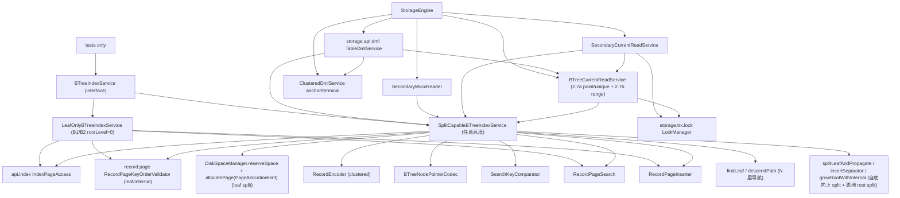

### Current Data Chains

| Flow | Current production chain | Current state |
| --- | --- | --- |
| Existing-page semantic open | `IndexPageAccess` 物理校验 -> LeafOnly root header / SplitCapable unified helper indexId 核对 -> 按实际 page level 选择 leaf 或 derived node-pointer schema -> `RecordPageKeyOrderValidator` | Implemented (0.21d)；12 个 SplitCapable existing-page 打开点与 LeafOnly 单一 root 入口均在业务读取/修改前 fail-closed；3 个 fresh create/format 空页直开点保持不重复扫描；校验期只读且仍持当前 S/X latch |
| Locate leaf without target IO | `SecondaryIndexMutationCoordinator` -> `SplitCapableBTreeIndexService.locateLeafWithoutLoading`（`:1272`）以 S-crab 只打开 root/internal，最后一个内部 pointer 返回 `BTreeLeafTarget(pageId,rootLeaf=false)`；root 自身是 leaf 时返回 root identity 并要求 direct | Implemented for Change Buffer eligibility；不打开、prefetch 或 fix 目标 leaf；内部页 descriptor 仍按 `BTreeIndex.pageType` 校验，结构损坏不降级为猜测页号 |
| Point lookup | `BTreeIndexService.lookup` -> SplitCapable `findLeafSharedCrab`（N 层 `chooseChild` **S-crab** 下降：持父 S→latch 子 S→放父 S，祖先早释放，0.13c）-> `search.findEqual` -> `RecordCursor` -> `materialize` | Implemented；SplitCapable 任意高度（0.11）；读路径 S-crab（0.13c）；LeafOnly 仍 level 0 |
| Point current-read (2.7a) | `BTreeCurrentReadService.lockPoint` -> 建立单次 monotonic deadline -> 短 MTR 定位 record/gap -> commit 释放 page latch/fix -> `LockManager.acquire(remaining)` -> 短 MTR 重定位校验；RC miss 不锁 gap，RR miss 按模式锁 gap | Implemented；point/unique 的全部 relocation 共用原请求剩余预算，不按重试刷新 timeout；SQL INSERT 消费 unique-check/insert-intention；SQL point UPDATE/DELETE 经 `TableDmlService` 消费 FOR_UPDATE record lock；普通 point SELECT 走 `PhysicalPointAccess` MVCC cursor，`FOR SHARE/UPDATE` 由 `PhysicalRangeAccess` cursor 消费同一 current-read 锁链 |
| Unique insert current-read check (2.7a) | `BTreeCurrentReadService.checkUniqueForInsert` -> 物理 duplicate 命中取 `REC_S` 并重定位确认；miss 取 `INSERT_INTENTION` 到目标 gap 并重定位确认 -> `BTreeUniqueCheckResult` | Implemented；2.1 起 `ClusteredDmlService.insert` 调用；仍是物理唯一检查（delete-marked 同 key 算 duplicate），不做 MVCC 逻辑唯一 |
| Secondary logical key DML check | `TableDmlService.insert/update/delete` -> `SecondaryUniqueCheckService.lockLogicalKey/check` 以 collation/prefix 规范化 logical key -> `SecondaryLogicalKeyLockKey` X（事务终态释放）-> `scanSecondaryPrefixIncludingDeleted(limit=1025)`；等待后只看当前前缀，不读 ReadView/undo：任意 live 冲突、其它主键 marked 跳过、同 identity marked 供 UPDATE revive；UPDATE 初查 marked 后在 row guard 内 `recheckExactPublishState` 抵御 purge 竞态。fresh non-unique INSERT 仍由 `checkFreshInsert` 跳过必然 absent 的 leaf read | Implemented；DELETE commit 后 logical unique key 可在 purge 前复用，rollback/live 与 PREPARED 二阶段等待语义已有回归；无 live 时超过 1024 候选抛容量异常而非截断发布；完整 physical key 仍由 B+Tree `physicalUnique` 保护 |
| Non-unique secondary logical-prefix read | consistent：`SecondaryMvccReader.readRange` -> including-deleted prefix candidate 短 MTR -> 聚簇 MVCC/undo -> 可见完整行重算 key/按 clustered identity 去重；locking：`SecondaryCurrentReadService.readRange` -> logical-prefix S/X -> candidate 重扫 -> 聚簇 `lockPoint` S/X -> 当前完整行重算 key | Implemented / partial cursor；SQL 完整单列、无 prefix、non-unique secondary equality 经 `PhysicalSecondaryPrefixAccess` 返回多行；对 Executor 已包装为 `SqlStorageCursor`，但底层 reader 当前仍先形成稳定完整行列表；ReadView 覆盖 Filter/LOB/Project，locking 等待不持 page latch，锁到事务终态；Executor 第 4097 行 fail-closed |
| Range current-read (2.7b) | `BTreeCurrentReadService.lockRange` -> 建立单次 monotonic deadline -> 短 MTR `SplitCapableBTreeIndexService.locateRangeForCurrentRead` -> commit 释放 page latch/fix -> RC record、RR next-key+terminal gap 逐项消费 remaining -> 短 MTR重扫校验；`RangeSqlStorageCursor` 以 256 physical rows 分页，secondary 再锁 clustered row，最终 residual 交 `FilterNode` | Implemented；同一批次逐行锁、terminal gap 与 relocation 共享一个绝对预算，超时逆序释放本轮已授予锁；SQL comparison/composite/full-scan locking SELECT 与 range UPDATE/DELETE 已生产消费；SELECT cursor 覆盖本语句并由 Executor finally 关闭，range DML 仍在首笔 mutation 前物化全部匹配聚簇 identity；terminal gap 保持全局边界简化 |
| Optional-bound paged scan | `SplitCapableBTreeIndexService.scan` -> 有 lower 时 `descendSharedCrab`、无 lower 时 `descendLeftmostSharedCrab` -> sibling hand-over-hand -> open/closed/optional upper 过滤；`RangeSqlStorageCursor` 下一批使用上一批完整 physical key exclusive continuation | Implemented；任意高度；SELECT 每批 256 physical candidates、全语句最多 16384 candidates，Filter 后公开 eager `QueryResult` 最多 4096 rows；`scanClusteredIncludingDeleted` 为 range MVCC 保留 delete-marked 当前版本 |
| Insert (no split) | SplitCapable `insert` -> **乐观** `tryOptimisticInsert`：`descendOptimistic`（内部层 S-crab、leaf X）-> unique check -> `inserter.insert`（放得下即成，仅 leaf 持 X）；溢出=unsafe 释放 leaf X 回退 `pessimisticInsert`。**悲观 insert 走 safe-node 下降（0.13d）**：`descendPathInsertSafeNode` 全 X 下降但每 latch 到内部 child 若 safe（`freeSpace ≥ maxSeparatorSize`=该索引 node pointer 编码严格上界）即释放其以上全部祖先 X（含 root）→ split 不传播到 root 时 **root X 不再持到 commit**；只判内部页（leaf 恒保留），既有 split 传播引擎在截断后的保留链上零改动正确。LeafOnly 仍 `descendPath` X-latch root→leaf | Implemented；overflow → `BTreeSplitRequiredException`（LeafOnly）或悲观 split 传播（SplitCapable，写路径 latch coupling 0.13a + safe-node 0.13d）；诊断计数 `safeNodeAncestorReleaseCount()`。insert/delete/purge 的 safe-node 下降共用 `descendPathSafeNode`（谓词参数化）。**0.13d SX+restart（§10.3 ROOT_LATCHED_SX）**：快照树高 ≥2 的悲观 SMO 首遍 root 取 **SX**（与读者/乐观写者 root S 并存、排它其它 SMO），safe 节点吸收 → 全程不 X root；首遍链顶仍是 root（SMO 可能写 root，SX 禁升级）→ 零写整链释放、root X 重启第二遍（至多一次，重启即全新导航天然正确）；level 0/1 树必写 root 故跳过 SX 首遍直取 X；计数 `rootSxDescentCount()`/`rootXRestartCount()` |
| Insert split 传播（0.11/0.14b/0.15/0.23a） | `insert` overflow -> `pessimisticInsert` 计算 split 预算 -> 释放未写保留链 -> `reserveSplitSpace(NORMAL)`（按 leaf split + 可能 parent/root split 最坏页数预算，且至少一 extent，失败在任何页改写前）-> 重新下降并复核 unique/leaf 容量 -> `splitLeafAndPropagate`。leaf 即 root → `splitRootLeaf`（原地 level0→1，若插入 key 高于旧 root 最大 key 且无右 sibling，则用 `PageAllocationHint.up` 分配两个新 leaf；低于最小 key 且无左 sibling 则 `down`）；否则 `splitNonRootLeaf`（旧 leaf=左半 + 新右兄弟 + sibling 链，边界顺序插入且对应方向无 sibling 时传 leaf hint）→ `insertSeparator` 上插父页 -> 父满则内部 split：root→`growRootWithInternal`（两 level-L 新子页 + root 页号不变重建 level L+1）、非 root→`splitNonRootInternal` 递归上插。leaf 行/内部 pointer 统一对半切，separator=右半 lowKey | Implemented（任意高度）；内部/root-split 子页自 `nonLeafSegment` 分配且继续无方向 hint；root 页号稳定；返回 `BTreeInsertResult(after.withRootLevel, allocatedPages)`；0.14b 起 split/root split 不再半途 immediate allocation ENOSPC；0.15 起 leaf split 可给 DiskSpaceManager 传保守方向 hint，随机中间 split 和已有 sibling 的 split 仍 none；0.23a 起预留不在持 index page latch 时触碰 page0/FLST，SMO 新页分配/格式化和 child/sibling hand-over-hand 打开通过 `allowOutOfOrderPageLatch(reason)` 记录局部无环证明 |
| Clustered insert | `SplitCapableBTreeIndexService.insertClustered(mtr, index, record, transactionId, rollPointer)` (`:91`) -> stamps `new HiddenColumns(transactionId, rollPointer)`（调用方传入真 INSERT undo 指针，替换恒 NULL） -> delegates `insert` (`:106`) | Implemented; `DB_ROLL_PTR` 由上层 orchestration（`assignWriteId → planInsert → appendPlanned → insertClustered`）传入；B+Tree 不 import trx/undo |
| Clustered delete (T1.3d；0.12 merge；0.13a latch coupling) | `SplitCapableBTreeIndexService.deleteClustered(...)` -> **乐观** `tryOptimisticDelete`：`descendOptimistic`（内部层 S-crab、leaf X）-> `findEqual`（未命中/所有权不符=幂等 no-op）-> `deleteWouldUnderflow` 预判（同 `isUnderfull` 公式、freed 取上界偏保守）：不欠载则 `deleteMark`+`purge` **跳过 `reclaimAfterRemoval`**（仅 leaf 持 X）；欠载=unsafe **写页前**释放 leaf X 回退悲观 **`descendPathDeleteSafeNode`（0.13d safe-node：X 下降遇「摘一最大指针后仍不欠载」的 safe 内部节点即释放其以上祖先 X 含 root，保留链=「safe 节点…leaf」）** -> `deleteInLeaf`（`findEqual`->所有权校验->`deleteMark`/`purge`->`reclaimAfterRemoval` 带 merge，只在保留链内传播）-> `BTreeDeleteResult(removed, indexAfter, freedPages)` | Implemented (StorageEngine service root + `RollbackService` + tests); 幂等（未命中/不匹配=no-op）；不 import trx/undo；**0.12 起删成功触发 merge + 原地 root shrink + free page（仅悲观路径）**；**0.13a 乐观不欠载删除仅 leaf 持 X、跳过 merge**；**0.13d merge 不传播到 root 时 root X 不再持到 commit**，诊断计数 `safeNodeDeleteAncestorReleaseCount()` |
| Clustered purge (T1.3d；0.12 merge；0.13b latch coupling) | `SplitCapableBTreeIndexService.purgeDeleteMarkedClustered(...)` -> **乐观** `tryOptimisticPurge`：`descendOptimistic`（内部 S、leaf X）-> `findEqual` 严格校验（命中 + 仍 delete-marked + 隐藏列匹配，任一不符=stale no-op）-> `deleteWouldUnderflow` 预判：不欠载则 `purger.purge` **跳过 `reclaimAfterRemoval`**（仅 leaf 持 X）；欠载=unsafe 写页前释放 leaf X 回退悲观 `descendPathDeleteSafeNode`（0.13d safe-node，与 delete 同）+`purgeInLeaf`（带 merge）-> `BTreeDeleteResult(removed, indexAfter, freedPages)` | Implemented (StorageEngine service root + `PurgeCoordinator` + tests)；stale=no-op；与 delete 共用 0.12 欠载回收 + 0.13b 乐观预判 + 0.13d safe-node 下降/计数 |
| Clustered replace (T1.3e；0.13b latch coupling) | `SplitCapableBTreeIndexService.replaceClustered(...)` -> **乐观** `tryOptimisticReplace`：`descendOptimistic`（内部 S、leaf X）-> `replaceInLeaf`：`findEqual` -> 所有权校验 -> `updater.update` 整记录替换；root 即 leaf 交悲观 `findLeaf(X)`。**恒 safe**（原地/页内搬迁，永不 split/merge）；REQUIRES_REINSERT(改 PK)→`BTreeUnsupportedStructureException`、搬迁溢出→`RecordPageOverflowException`（leaf 未改，与路径无关直接上抛）-> `BTreeUpdateResult(replaced)` | Implemented; 前向 UPDATE 与 rollback 恢复共用；幂等；不 import trx/undo；**0.13b 乐观 leaf-only，无 unsafe 回退** |
| Clustered delete-mark (T1.3f；0.13b latch coupling) | `SplitCapableBTreeIndexService.setClusteredDeleteMark(...)` -> **乐观** `tryOptimisticMark`：`descendOptimistic`（内部 S、leaf X）-> `markInLeaf` plan-then-execute：`findEqual`(含已标记)→所有权校验→翻转合法校验→`setDeleted`+`writeHiddenColumns`(等长两步纯写)；root 即 leaf 交悲观。**恒 safe**（等长纯写、无 size 变化/无结构变更）-> `BTreeDeleteMarkResult(changed)`；`lookupIncludingDeleted` 不过滤 delete-marked | Implemented; 前向删除与 rollback 取消标记共用；幂等、非法翻转抛；不 import trx/undo；**0.13b 乐观 leaf-only，无 unsafe 回退** |
| Secondary entry operations | `SplitCapableBTreeIndexService.insertSecondary` (`:222`) / `deletePublishedSecondary` (`:564`) / `purgeDeleteMarkedSecondary` (`:580`) / `setSecondaryDeleteMark` (`:927`) / `scanSecondaryPrefixIncludingDeleted` (`:1142`) -> 完整 physical key（logical parts + 完整聚簇主键后缀）定位；物理删除复用同一 underflow merge/redistribute/root-shrink | Implemented；DML、rollback、purge、unique check 与 secondary MVCC 均生产调用；`ABSENT` 是 crash 重试完成证据，live/marked 状态冲突显式返回 |
| Underflow reclaim (0.12 merge+shrink / 0.12b redistribute，delete+purge 共用) | `deleteInLeaf`/`purgeInLeaf` 物理删除成功 -> `reclaimAfterRemoval` -> `considerMerge(path, depth)`：`isUnderfull`(可回收空闲 `freeSpace+garbage` > 页半) -> `chooseMergePair`（parent pointer 顺序，survivor=左/victim=右）-> `mergeFits`(reclaimable)？**fit** → `reorganize` survivor 压实 + 并入 victim（leaf 修 FIL 链）-> `removePointerFromParent`(deleteMark+purge) -> `freeSmoPage(victim)` -> 传播 `considerMerge(depth-1)` / parent 是 root 剩 1 pointer 则 `shrinkRoot`（吸收唯一 child、树高-1、级联）；**fit 不下** → `redistribute`：合并相邻对对半重分到两页（`splitRows`/`splitPointers`）+ 只更新 parent 中 right 成员 lowKey（删旧插新）| Implemented (StorageEngine service root + tests)；min-key-pointer 约定下 survivor/left 父 pointer key 不变（merge 无 separator 更新、redistribute 仅改 right lowKey）；**redistribute 不删页/不传播/不改树高**（leaf+internal 统一，0.12b）；root 页号稳定；额外 sibling/远兄弟/child latch 入 MTR memo；**0.13d 起 path 可为 safe-node 截断保留链**：`considerMerge` 的 root 判定改按 `parentHandle.pageId()==rootPageId`（页号跨 split/shrink 稳定）而非链下标——防止对非 root 的 safe 链顶误做 `shrinkRoot`；safe 链顶保证摘一指针后不欠载 → merge 传播必停在链顶；0.23a 起回收页触碰 FSP 元页经 `freeSmoPage` 使用带理由的 MTR ordering 例外（FSP 不反向等待 index latch）|

### Package Status

| Package area | Representative classes | Current state | Notes |
| --- | --- | --- | --- |
| `storage.btree` facade | `BTreeIndexService` (interface), `BTreeIndex`, `BTreeLeafTarget`, table/secondary metadata, clustered/secondary result types | Implemented (split-capable production-wired) | `BTreeIndex.pageType` 使用户/DD `INDEX` 与全局 `IBUF_INDEX` 复用同一结构算法但保持 envelope 类型；`StorageEngine` 暴露 concrete `SplitCapableBTreeIndexService`；TableDml/rollback/purge/MVCC/Change Buffer 生产调用。旧 interface/leaf-only 主要为教学回归 |
| `storage.btree` current-read | `BTreeCurrentReadService` point/physical-unique/range + `SecondaryUniqueCheckService` logical DML key + `SecondaryCurrentReadService` logical-prefix locking read | Implemented; production-held by `StorageEngine` | 聚簇 current-read 仍按短 MTR 定位→事务锁→重定位；唯一二级在 logical X 等待后重扫当前 marked/live 前缀，不消费 ReadView/undo。SQL adapter 已生产消费 point/comparison/composite/full-scan current range，secondary 再取 clustered S/X；global precise gap 与 RC residual-miss 提前解锁留后续 |
| `storage.btree` leaf-only | `LeafOnlyBTreeIndexService` | Implemented (test-wired) | B1/B2 rootLevel=0 only; point lookup + in-page scan + insert-no-split; retained for regression/teaching tests while production root uses split-capable service |
| `storage.btree` split-capable | `SplitCapableBTreeIndexService`, `BTreeRootSnapshotService`, node pointer/redo snapshot types | Implemented (StorageEngine + table DML/rollback/purge/MVCC) | 任意高度 clustered/secondary split、merge/root shrink、redistribute、latch coupling、safe-node/SX restart 与 MTR ordering 均生产接线；结构写前从稳定 root 页头刷新 level，redo 只 patch 页面不重跑 SMO。仍缺 B-link/OLC 与 `PAGE_MAX_TRX_ID`/segment 辅助页头 |
| `storage.btree` exceptions | `BTreeException` + 6 subclasses | Implemented | `BTreeCurrentReadRelocationException`（授锁后多次重定位失败）, `BTreeDuplicateKeyException` (physical unique check), `BTreeSplitRequiredException`, `BTreeStructureCorruptedException`, `BTreeUnsupportedStructureException`；`BTreeRootChangedException` 自 0.12 起**不再由 `openRoot` 的 level guard 抛出**（导航按实际 root level；reserved 供 0.13/2.7 并发重定位协议）|

## Redo Log Layer Slice

### Current Flow

```mermaid
flowchart TD
  MtrBegin["MiniTransactionManager.beginReadOnly / begin(RedoAppendBudget)"] -->|logical reservation + physical fit before latch/lease| Throttle["RedoCapacityThrottle"]
  MtrCommit["MiniTransaction.commit"] -->|append records| Mgr["RedoLogManager"]
  MgrMgr["MiniTransactionManager"] -->|owns new RedoLogManager| Mgr
  Mgr -->|memory mode: no writer/flusher| Buffer["in-memory buffer + batches"]
  Mgr -->|durable() factory: StorageEngine + tests| Writer["RedoLogWriter"]
  Writer -.-> Repo["RedoLogFileRepository.append"]
  Mgr -->|flush(): StorageEngine checkpoint/close + recovery/truncate + tests| Flusher["RedoLogFlusher"]
  Flusher -.-> Repo
  Repo --> Block["RedoLogBlockCodec / RedoLogBlockScanner"]
  Block --> Frame["nested RLG1 RedoBatchFrameCodec"]
  Block -.-> File["single file / redo ring v2"]
  Collector["MtrRedoCollector"] -->|onWrite + local category| Entry["MtrRedoEntry"]
  Collector -->|onWrite| PBR["PageBytesRecord"]
  Collector -->|recordInit| PIR["PageInitRecord"]
  Collector -->|recordLogical| LogicalRecords["FSP / Undo / BTree / Trx logical records"]
  FlushCoord["FlushCoordinator"] -->|flushedToDiskLsn / waitFlushed WAL gate| Mgr
  Checkpoint["CheckpointCoordinator"] -->|currentLsn / flushedToDiskLsn| Mgr
  Recovery["CrashRecoveryService (StorageEngine E2 + tests)"] --> Reader["RedoRecoveryReader"]
  Reader --> Repo
  Recovery --> Dispatcher["RedoApplyDispatcher registry"]
  Dispatcher --> Handler["RedoApplyHandler sessions"]
  Handler --> FspHandler["FspPageAllocationRedoHandler"]
  Handler --> PageHandler["PageRedoApplyHandler"]
  Handler --> TrxHandler["TransactionStateRedoHandler"]
  FspHandler -->|ensureCapacity| PageStore["PageStore"]
  PageHandler -->|readPage / writePage| PageStore["PageStore"]
  TrxHandler -->|TransactionStateDeltaSink| TrxTable["RecoveredTransactionTable"]
  Checkpoint -->|write label| CkptStore["RedoCheckpointStore"]
  Recovery -->|read + validate format| CkptStore
```

### Current Data Chains

| Flow | Current production chain | Current state |
| --- | --- | --- |
| Redo collect (MTR) | PageGuard writes -> `PageBytesRecord`; explicit FSP/Undo/BTree/Trx logical records -> collector；commit view 精确过滤被最终 after-image 覆盖的物理 bytes | Implemented；B+Tree delta 已覆盖 sibling、internal header/used pointer heap/directory、root header/identity；未覆盖或与最终 image 不同的中间态写继续保留，leaf row bytes 仍为 physical redo |
| Redo append (MTR commit) | `beginReadOnly()` 或 `budgetFor(purpose)` + `begin(budget)` -> `RedoCapacityThrottle.reserveAppendBudget` -> reservation 挂入 memo -> commit 冻结 `collector.records()` 一次并 `budget.requireCovers` -> `redoLogManager.append(records)` 分配 `[start,end)` -> reservation `transferToAppend` -> disable/stamp -> `memo.releaseAll()` 发布 dirty -> `markClosed(range)` | Implemented；生产 manager 禁匿名 begin；只读零预算不参与压力判断；logical 预算参与 LSN capacity，physical 上界在 begin 拒绝超过 ring 单文件的 sealed batch；actual 低估在 append 前 fatal，append 后立即解除 reservation 与 real current LSN 的双计数 |
| Durable write | `RedoLogManager.write()` / `flush()` -> `ioLock` serializes repository append/force -> repository 以 `RedoLogBlockCodec` 把每个非空 MTR batch 的嵌套 `RLG1` frame 封成独立 512B block chain -> 单文件或 ring v2 -> 单调推进 written/flushed LSN | Implemented；header 32B + payload 472B + trailer 8B，blockNo 全局连续；batch 可跨 block 但不跨 ring 文件、不同 batch 不复用尾块；逻辑 LSN/pageLSN 不含物理 padding且保持不变；`DurabilityPolicy` 可选择 wait-written、wait-flushed 或后台策略 |
| WAL gate (flush module) | `FlushCoordinator.flushPage` -> `redo.flushedToDiskLsn()` (`FlushCoordinator.java:91`) + `redo.waitFlushed(pageLsn, timeout)` (`:92`) | Implemented；`StorageEngine` durable redo 路径可通过 WAL gate；memory-mode 组合中 durable LSN 恒 0，会跳过脏页 |
| Checkpoint read | `flush.checkpoint.CheckpointCoordinator.advanceCheckpoint` -> safe LSN -> `RedoCheckpointStore.write(RedoCheckpointLabel.of(..., redoFormatVersion=1))` -> 双 4KiB 隔离 slot v2（总长 8192B，generation + CRC） | Implemented；control v2 同时绑定 redo data format；旧 control v1 明确格式拒绝；READ_ONLY_VALIDATE 只读打开且不创建/预分配/force |
| Redo replay (recovery) | public `DatabaseEngine.open(existing)` 先从 DD binding 构造 recovery tablespace 列表 -> `StorageEngine.open(existing)` -> 只读/读写打开 redo data + control -> `CrashRecoveryService.recover` 校验并 replay -> UNDO resume / SPACE_FILE_RECONCILE / transaction rollback+purge resume -> force recovery redo/data pages -> 返回 public engine 做 DDL cleanup 后 open traffic | Implemented production path；低层 `StorageEngine` 仍支持显式 recovery list，公共组合根已用 DD 发现替代手工列表；`RedoRecoveryScan` 保留非零 checkpoint+torn tail 语义，CRC 正确但语义错误、非末损坏、LSN/blockNo gap 均 fail-closed；READ_ONLY_VALIDATE 对 redo data/control 无写副作用 |
| Capacity pressure | `StorageEngine.open` constructs throttle with policy/current/checkpoint/flush callbacks/timeout + ring `fileBytes` -> write `begin(RedoAppendBudget)` atomically aggregates logical outstanding budget before any MTR page latch/lease and validates physical batch-fit; ASYNC -> page cleaner request; SYNC/HARD -> `redo.flush()` + `FlushService.flushForCapacity(...)` until pressure drops or timeout | Implemented production path；read-only zero budget never triggers flush；operation profile replaces capacity/8；append ownership transfer prevents outstanding budget and current LSN double counting；timeout/physical oversize fail-closed；前台同步刷页预算独立于 background maxPages |
| Background redo flush | `StorageEngine.open` starts `RedoFlushWorker` (when `backgroundFlushEnabled`) -> periodic/on-demand `RedoFlushTarget.flush()` (-> `RedoLogManagerFlushTarget` -> `RedoLogManager.flush()`) -> 推进 `flushedToDiskLsn` + 唤醒 `waitFlushed` | Implemented production path；空转跳过（`currentLsn<=flushedToDiskLsn` 不 fsync）；失败即 FAILED；engine 在 page cleaner 前启动、close 时先停（停 page cleaner→停 redo flusher→final flushThrough）；解淘汰/flush WAL gate 因无人 flush 而跳过的根因 |

### Package Status

| Package area | Representative classes | Current state | Notes |
| --- | --- | --- | --- |
| `storage.redo` core | `RedoLogManager`, `ContiguousLsnTracker`, `RedoLogIo`, `DurabilityPolicy`, batches/ranges/records (`PAGE_INIT`/`PAGE_BYTES`/`FSP_PAGE_ALLOC`/`FSP_METADATA_DELTA`/`FSP_PAGE_FREE`/`UNDO_METADATA_DELTA`/`UNDO_RECORD_PAYLOAD`/`BTREE_PAGE_DELTA`/`TRX_STATE_DELTA`) | Partial | 默认 manager 为 memory mode；`StorageEngine`/truncation/DML facade 组合注入 durable manager；支持 recovery boundary 恢复与连续续写；recent written/closed 连续边界已接，append 与 fsync 状态锁已拆分；三阶段 append→`write()`(OS cache)→`flush()`(fsync) 原语齐备（`writtenToDiskLsn`/`waitWritten`，守 `flushed<=written`）；2.1 `ClusteredDmlService.commit` 已消费 `DurabilityPolicy`，但 `TransactionManager.commit` 本身仍保持纯内存状态机 |
| `storage.redo` durable IO | `RedoLogWriter`, `RedoLogFlusher`, `RedoLogFileRepository`, `SingleFileRedoLogRepository`, `RotatingRedoLogRepository`, `RedoLogBlockCodec`, `RedoLogBlockScanner`, `RedoBatchFrameCodec` | Implemented | 单文件与默认 ring 共用固定 512B LogBlock v1；内部仍嵌套 RLG1 frame CRC。ring header 已升 v2，`fileBytes` 为 512B 对齐 block 区容量，batch 不跨文件；文件集合、跨文件 LSN/blockNo、末尾 torn 位置均校验。旧 data/ring 格式拒绝且无迁移；只读工厂不创建/修复/force |
| `storage.redo` checkpoint | `RedoCheckpointStore`, `RedoCheckpointLabel` | Implemented | redo-control v2 使用偏移 0/4096 的双槽和 8192B 固定文件，slot 含 redo format、generation、CRC；先选最高 checkpoint 再选 generation；旧 v1/格式不匹配 fail-closed；只读工厂不产生文件副作用 |
| `storage.redo` recovery | `RedoRecoveryReader`, `RedoRecoveryScan`, `RedoLogBlockScanner`, `RedoApplyDispatcher`, `RedoApplyHandler`, `RedoApplyBatchHandler`, `RedoApplyContext`, `FspPageAllocationRedoHandler`, `PageRedoApplyHandler`, `TransactionStateRedoHandler` | Implemented; production-wired by `StorageEngine` E2 | engine 先验证 control/data format；repository 原子返回 batches + retained 边界，scanner 组装完整 batch chain，reader 再验证 checkpoint 覆盖与批次 LSN 无 gap/overlap。dispatcher 的 FSP/page/trx handler 行为不变；READ_ONLY_VALIDATE 走只读 redo data/control channel；只恢复已打开/显式配置的表空间 |
| `storage.redo` capacity | `RedoCapacityPolicy`, `RedoCapacityPressure`, `RedoCapacityDecision`, `RedoCapacityThrottle`, `RedoCapacityThrottle.Reservation`, `RedoCapacityThrottleTimeoutException` | Implemented | `StorageEngine` 和 tests 使用 fixed capacity；4 pressure levels NONE/ASYNC_FLUSH/SYNC_FLUSH/HARD_LIMIT; consumed by `FlushService` and foreground MTR begin reservation throttle；reservation tracks outstanding foreground budgets only, not authoritative LSN ranges |
| `storage.redo` background flush | `RedoFlushWorker`, `RedoFlushWorkerState`, `RedoFlushTarget`, `RedoLogManagerFlushTarget` | Implemented; production-wired by `StorageEngine` | 单 daemon 线程周期/on-demand 驱动 `redo.flush()`，空转跳过、失败即 FAILED；worker 依赖 `RedoFlushTarget` 端口（生产用 `RedoLogManagerFlushTarget` 适配，便于测试注入 fake）；`RedoLogManager` 已拆 state lock 与 `ioLock` |
| `storage.redo` exceptions | `RedoLogIoException` (runtime), `RedoLogCorruptedException` / `RedoLogFormatException` (fatal) | Implemented | 介质/语义损坏与明确的不支持持久格式分别表达；repo/reader/recovery 都 fail-closed |

## Flush + Doublewrite + Checkpoint Slice

### Current Flow

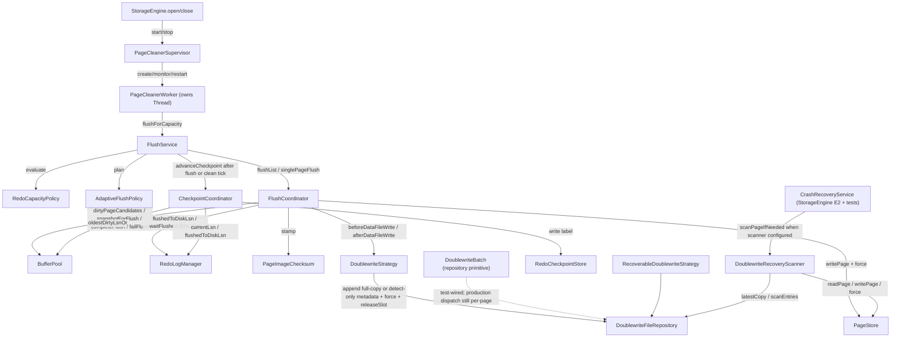

### Current Data Chains

| Flow | Current production chain | Current state |
| --- | --- | --- |
| Capacity-driven flush | `StorageEngine.open` -> `PageCleanerSupervisor(factory, maxRestarts=1, backoff=interval, monitorInterval=interval)` -> creates `PageCleanerWorker(flushService, queue, interval, maxPages)` -> worker idle timeout 或显式 request -> `FlushService.flushForCapacity` -> `RedoCapacityPolicy.evaluate(redo.currentLsn(), checkpointLsn)` -> `AdaptiveFlushPolicy.plan(decision,maxPages)` -> if pressure: `FlushCoordinator.flushList` -> per page WAL gate/doublewrite/data file -> checkpoint；if no pressure and dirty view empty: checkpoint-only tick | Implemented production path (E3a + 0.6b)；`StorageEngine.close` 先 `PageCleanerSupervisor.stop(timeout)`（停 monitor + 当前 worker）再停 redo flusher/final `flushThrough`；supervisor 暴露 `PageCleanerMetricsSnapshot`，worker 失败有限重启；foreground reservation throttle 的 ASYNC_FLUSH 只 request supervisor，SYNC_FLUSH/HARD_LIMIT 在 MTR begin 前同步执行 `redo.flush()` + `flushForCapacity(foregroundCapacityFlushMaxPages)`；foreground max pages uses buffer pool capacity and is not capped by background maxPages |
| Single page flush | `FlushCoordinator.flushPage` 持 space S lease -> snapshot -> WAL gate -> checksum/doublewrite -> data write+force -> complete | Implemented foreground path；与 truncate X lease 互斥；WAL gate 仍逐页同步 |
| Tablespace drain | `FlushService.drainTablespace(spaceId, duration)` -> loop `bufferPool.dirtyPageCandidates(MAX, capacity)` filtered by spaceId -> per page `FlushCoordinator.singlePageFlush` -> `advanceCheckpoint()`；当仍有目标 space dirty page 但刷页无进展时调用 `BufferPool.awaitDirtyStateChange(timeout)` | Implemented code; no production caller; dirty-state condition wake-up 已接，`release/completeFlush/failFlush/resetFrameToFree` 会 signal；`flushThrough` 仍保留短 `parkNanos` 路径 |
| Lifecycle flush barrier | `FlushService.flushThrough(marker,timeout)` -> redo flush -> 刷出所有 space 中 oldest<=marker 的 dirty page -> `flush.checkpoint.CheckpointCoordinator.advanceCheckpoint` 直到 checkpoint>=marker | Implemented；truncate 和 `StorageEngine.close/checkpoint` 在物理关闭/缩短前强制调用 |
| Checkpoint advance | `flush.checkpoint.CheckpointCoordinator.advanceCheckpoint` -> no dirty: safe=`min(redo.closedLsn(), redo.flushedToDiskLsn())`; dirty: safe=`min(bufferPool.oldestDirtyLsnOr(flushed), redo.closedLsn(), redo.flushedToDiskLsn())` -> if safe > last: if `checkpointStore != null` -> `checkpointStore.write(RedoCheckpointLabel.of(safe, redo.currentLsn(), now))`, then publish `lastCheckpointLsn = safe` | Implemented code; called by `FlushService` from tests, `StorageEngine` foreground lifecycle, and E3a periodic page cleaner tick；checkpoint 不再用 `currentLsn()` 近似 closed boundary |
| Doublewrite write | recoverable: `RecoverableDoublewriteStrategy.beforeDataFileWrite` -> `repository.append(snapshot)`（内部走 single `DoublewriteBatch`）-> `repository.force()`；detect-only: `DetectOnlyDoublewriteStrategy.beforeDataFileWrite` -> `repository.appendDetectOnly(snapshot)` -> `repository.force()`；data file force 成功后 `afterDataFileWrite` -> `repository.releaseSlot(snapshot)` | Implemented; production `StorageEngine` 默认仍注入 recoverable full-copy；detect-only strategy/repository path 已测试接线。0.5 后 `DoublewriteFileRepository` 默认 1024 个固定 slot 循环复用，in-flight slot 在 data file force 前不可覆盖；0.7 新写 slot 统一 v2 header，scanner 仍兼容 v1 full-copy；`appendBatch/releaseBatch` 连续 slot 原语仍仅 test-wired，生产 `FlushCoordinator` 仍逐页调用 |
| Doublewrite repair/detect | recovery participant 先修显式配置 UNDO page0/读 marker；普通 scanner 对 pageNo>= 当前文件大小的越界页跳过（交 redo 重建）、对 TRUNCATING space 的 pageNo>=target 跳过；其余 checksum-invalid 页经 `scanPageIfNeeded` 区分 `REPAIRED_FROM_COPY` / `DETECTED_ONLY` / `CLEAN_OR_NOT_COVERED` | **Implemented production path（0.2 + 0.7 detect-only）**：`StorageEngine` E2 配 `DoublewriteRecoveryScanner` + `DoublewriteFileRepository.pageIds()`（过滤到恢复已打开空间）；full-copy 可真正修复 torn data/undo 页，detect-only metadata 只报告并计入 `RecoveryReport.detectedOnlyPageCount`，不写 data file；未打开空间的 torn 页留待该空间打开/discovery |

### Package Status

| Package area | Representative classes | Current state | Notes |
| --- | --- | --- | --- |
| `storage.flush` facade/coordinator | `FlushService`, `FlushCoordinator`, `FlushCycleResult`, `FlushResult`, `FlushResultStatus`, `TablespaceDrainResult`, `CoordinatedDirtyVictimFlusher` | Implemented | Ties redo capacity -> flush -> checkpoint；`StorageEngine` 构造 foreground barrier + E3a background page cleaner path；`CoordinatedDirtyVictimFlusher` 适配 buf 淘汰端口到 `singlePageFlush`（CLEAN→true/skip→false/FAILED→抛），`StorageEngine` 注入 pool |
| `storage.flush.policy` adaptive policy | `AdaptiveFlushPolicy`, `FlushAdvice`, `FlushBatchPlan`, `FlushRateMeter`, `FlushTuning` | Implemented | production 在比例 backlog 上叠加 redo/flush 速率缺口、IO capacity/idle cap，并按 free ratio 分配 FlushList/LRU；旧 `plan`/构造器保持兼容 |
| `storage.flush.checkpoint` checkpoint | `CheckpointCoordinator` | Implemented | Fuzzy checkpoint = min(oldestDirty, current, flushed); optional `RedoCheckpointStore` persistence；`StorageEngine` 注入 checkpoint store |
| `storage.flush.doublewrite` doublewrite | `DoublewriteStrategy`, `RecoverableDoublewriteStrategy`, `DetectOnlyDoublewriteStrategy`, `NoDoublewriteStrategy`, `DoublewriteBatch`, `DoublewriteChannel`, `DoublewriteChannelId`, `DoublewriteFileRepository`, `DoublewriteRecoveryScanner`, `DoublewriteRecoveryResult`, `DoublewriteRecoveryOutcome`, `DoublewriteMode` | Implemented; **bounded slot reuse + production FlushList/LRU batch dispatch + dual physical channel + engine mode selection** | `StorageEngine` 按 `EngineConfig.doublewriteMode()` 选择 OFF/DETECT_ONLY/DETECT_AND_RECOVER；FlushList 与 LRU 使用独立有界文件；恢复合并两个文件和旧单文件兼容副本，按 pageLSN 选择有效 full-copy；READ_ONLY 只读打开已有 doublewrite 文件，前向写失败会释放全部 reservation；全空间 discovery 与动态 slot/IO 配置仍 deferred |
| `storage.flush.cleaner` page cleaner | `PageCleanerSupervisor`, `PageCleanerWorker`, `PageCleanerWorkerHandle`, `PageCleanerWorkerFactory`, `PageCleanerWorkerSnapshot`, `PageCleanerMetricsSnapshot`, `PageCleanerState`, `PageCleanerStoppedException` | Implemented; production-wired by `StorageEngine` E3a | Supervisor daemon monitors worker snapshot, records metrics, restarts FAILED worker up to configured limit；worker remains single daemon `Thread` "minimysql-page-cleaner" with bounded explicit queue + periodic idle tick；no multi-worker dispatch |
| `storage.flush` exceptions | `FlushWriteException`, `FlushBarrierTimeoutException` | Implemented | Root flush exceptions shared by coordinator/doublewrite/cleaner/barrier |

## Transaction Layer Slice

### Current Flow

```mermaid
flowchart TD
  Tests["tests only"] --> Mgr["TransactionManager"]
  Tests --> UndoMgr["UndoLogManager"]
  Engine["StorageEngine"] --> DML["storage.api.dml TableDmlService"]
  Engine --> ClusteredDML["ClusteredDmlService"]
  DML --> ClusteredDML
  DML --> Mgr
  DML --> UndoMgr
  DML --> RollbackSvc["RollbackService"]
  Engine --> Purge["PurgeCoordinator"]
  Engine --> PurgeDriver["PurgeDriverWorker"]
  PurgeDriver -->|periodic / on-demand batch| Purge
  Purge -->|bounded table-token DAG| PurgePool["PurgeWorkerPool"]
  Engine --> SecondaryMvcc["SecondaryMvccReader"]
  Engine --> SecondaryCurrent["SecondaryCurrentReadService"]
  DML --> Guard["DmlStatementGuard"]
  Guard --> RollbackSvc
  DML --> LockMgr
  DML --> RowGuard["PurgeDmlRowGuardManager"]
  Purge --> RowGuard
  DML --> RedoMgr["RedoLogManager + DurabilityPolicy"]
  Mgr -->|begin| Txn["Transaction"]
  Mgr -->|assignWriteId / commit / rollback| Sys["TransactionSystem"]
  Sys --> ATT["ActiveTransactionTable (pkg-private)"]
  Sys -->|allocateWriteId| TxId["TransactionId (domain)"]
  Sys -->|allocateTransactionNo| TxNo["TransactionNo (domain)"]
  Txn --> State["TransactionState (enum FSM)"]
  Txn --> Opts["TransactionOptions"]
  Opts --> Iso["IsolationLevel (drives ReadView policy)"]
  Txn -->|"lazy setUndoContext (pkg-private)"| Ctx["UndoContext (T1.3c)"]
  UndoMgr -->|planX / appendPlanned / publish UndoContext| Txn
  UndoMgr -->|snapshot / plan / reserve / create / open / append| Access["UndoLogSegmentAccess (storage.undo)"]
  UndoMgr -->|reserve / preflight / bind owner| Slots["RollbackSegmentSlotManager (runtime state machine)"]
  UndoMgr -->|cache-first/free FIFO peek + lease publish| Cache["UndoSegmentReuseDirectory"]
  UndoMgr -->|INSERT/UPDATE/mixed commit| Finalizer["UndoSegmentFinalizer"]
  RollbackSvc -->|live / recovery finalization| Finalizer
  Purge -->|committed history finalization| Finalizer
  Finalizer -->|drop ineligible segment| Allocator["UndoSpaceAllocator"]
  Finalizer -->|owner + history/free base CAS| RsegHeader["RollbackSegmentHeaderRepository page3 v4"]
  Finalizer -->|globally sorted history/cache/free first-page batch| Access
  UndoMgr -->|begin append lease| History["HistoryList persistent-chain projection"]
  Purge -->|snapshotPrefix + strict READY head-removal| History
  Finalizer -->|MTR 后 publish| History
  History --> Barrier["HistoryTablePurgeBarrier -> storage.api TablePurgeBarrier"]
  Finalizer -->|reserve push / commit 后 publish| Cache
  Finalizer -->|begin lease / commit 后 complete| Slots
  Tests --> LockMgr["LockManager (0.17)"]
  Engine --> LockMgr
  LockMgr --> LockKeys["Record/GAP/Next-key/Insert-intention keys"]
  LockMgr --> LockSnap["LockSnapshot / wait-for edges"]
  LockMgr --> Sink["RowLockEventSink 事件端口 (storage.trx.lock)"]
  LockObs["server.lockobs LockObservationService 实现"] -->|implements 向下依赖| Sink
  Engine --> LockObs
  Engine --> LockDiag["lockDiagnosticSnapshot(data_locks/data_lock_waits)"]
  LockDiag --> LockObs
  Slots -->|rollbackSegmentId| RsegId["RollbackSegmentId (domain)"]
  Ctx --> SlotId["UndoSlotId (domain)"]
  RollbackSvc --> Access
  RollbackSvc --> Mgr
```

### Current Data Chains

| Flow | Current production chain | Current state |
| --- | --- | --- |
| Begin | `SessionTransactionPolicy.ensureTransaction` -> `SqlStorageGateway.begin` -> `DefaultSqlStorageGateway.begin` -> `TransactionManager.begin(options)` -> `new Transaction(options, now)` state `ACTIVE`; **no id allocation** (lazy) | Implemented；Session 持 opaque handle，不越层接触 storage transaction；低层调用方仍可显式持事务调用 DML facade |
| Assign write id | `TableDmlService.insert/update/delete` (`TableDmlService.java:130/193/266`) -> `ClusteredDmlService` anchor -> `TransactionManager.assignWriteId(txn)` -> requires `ACTIVE`, rejects read-only -> `system.allocateWriteId()` -> `txn.setTransactionId`; idempotent if already set | Implemented；表级和低层单聚簇入口共享同一 active transaction table |
| Commit | `TableDmlService/ClusteredDmlService.commit` -> `prepareCommit` 分配 no -> `UndoLogManager.onCommit`：有 UPDATE 时冻结 history base，并把当前 reachable logical chain 的 `affectedTableIds` 写入 `HistoryEntry` -> finalizer 单 MTR 处理 owner/history/free/terminal -> commit 后发布 slot/reuse/history table counters -> transaction commit -> durability -> release locks | Implemented；同一 history entry 对同一 table 只计一次；纯 INSERT 不进 history；transition lock 不跨 IO，失败边界保持原有 fail-stop 语义 |
| Prepare / commit prepared | SQL XA -> `PersistentXaCoordinator` 以 per-XID fair operation lock 串行并让 owner wait/storage phase 共用 monotonic deadline -> 先持久化 registry PREPARING/decision -> `DefaultSqlStorageGateway.prepareXa/commitPreparedXa` -> `StorageEngine.preparedTransactionService` -> `PreparedTransactionService` -> `UndoSegmentFinalizer` 同 MTR 改 first-page owner/state + trx delta -> redo fsync -> transaction terminal + release locks -> registry PREPARED/COMPLETED | Implemented；同 XID 并发 phase-two 有界超时且不阻塞其它 branch；storage participant 仍只认识 `TransactionId`，XID ownership/决议由 server registry 持有；prepare/phase-two 固定强持久，durability 确认失败保留可按同一决议重试的持久状态 |
| Rollback prepared | `PreparedTransactionService.rollbackPrepared`（legacy index 或 DD resolved 命令）-> `RollbackService.rollbackPrepared` -> PREPARED_ROLLING_BACK -> 双 persistent head按 undoNo 归并 inverse/marker -> `UndoSegmentFinalizer.finalizePreparedRollback` 同 MTR drop全部 owner、clear page3、写 `PREPARED_ROLLBACK` -> ROLLED_BACK -> terminal redo fsync -> release locks | Implemented；普通 rollback 拒绝 PREPARED；中途失败保留 prepared rollback 重试态、active membership 与锁，不能切换相反决议 |
| Rollback (multi-index) | production terminal -> `ResolvedDmlRollbackCommand` -> `TableDmlService.rollback` (`TableDmlService.java:338`) -> `RollbackService` 预检双 persistent head -> 每条 undo 解析 exact-version `TableIndexMetadata` (`DictionaryIndexMetadataResolver.java:37`) -> 共用 row guard，secondary inverse 按 index id 各自短 MTR、clustered inverse 最后、logical-head marker 再后 -> 双链 EMPTY 后 batch finalization/terminal | Implemented for statement/full/recovery；INSERT/UPDATE/DELETE secondary inverse、clustered inverse 与 marker-lag 均幂等；`RollbackService.java:842` 的 stable hook 验证首棵 secondary commit 后 persistent head 不提前移动 |
| Statement/savepoint rollback | SQL INSERT/point+range UPDATE/DELETE -> `DefaultSqlStorageGateway` -> `DmlStatementGuard` -> internal savepoint；命名 `SAVEPOINT/ROLLBACK TO/RELEASE` -> `SessionTransactionPolicy` 名称表 -> opaque `SqlSavepointHandle` -> gateway -> `RollbackService` 双 head + `LockManager` acquisition boundary | Implemented；同名替换、ROLLBACK TO 保留目标并删除更晚名称、RELEASE 单目标已接；普通 record/gap/next-key/logical lock 有意保留到事务终态，只有明确 `SAVEPOINT_RELEASEABLE/STATEMENT_DURATION` 锁按保存点释放 |
| Undo write (INSERT/UPDATE/DELETE) | `TableDmlService` (`TableDmlService.java:130/193/266`) 在聚簇首 MTR 前冻结按 index id 排序的 `SecondaryUndoMutation`（INSERT_ENTRY / CHANGE_KEY / DELETE_MARK_ENTRY）-> `ClusteredDmlService` 调 `UndoLogManager.planX/appendPlanned` 写同一行级 undo anchor -> 聚簇写成功后各 secondary 独立短 MTR 发布 (`TableDmlService.java:370/420`) | Implemented；codec secondary tail 与 LOB tail 可组合，旧记录解码为空 mutation 列表；失败由 statement/full/recovery rollback 从同一 tail 收敛 |
| Slot claim | `RollbackSegmentSlotManager.reserveClaim` 短锁 `FREE -> RESERVED` -> 当前业务 MTR `RollbackSegmentHeaderRepository.requireSlotFree` 以 S latch 预检 page3 并在返回前释放 -> `access.create` -> claim lease `bind(firstPageId)` 变 ACTIVE -> 同一业务 MTR 在局部 latch-order 例外内 `claimSlot(slot,firstPageId)` X-latch CAS -> append/publish context | Implemented；RESERVED 计入占用但无 owner，未 bind lease close 才可退回 FREE；持久 claim 再次 CAS 防异常漂移；page3 header/slot 写有 `UndoMetadataDeltaRecord(RSEG_HEADER_FIELD/RSEG_SLOT)` |
| Atomic slot release / segment finalization | `RollbackSegmentSlotManager.beginBatchFinalization` all-or-none 取 FINALIZING leases -> `UndoSegmentFinalizer` 短读 owner/kind/drop plan/history/free evidence -> 精确单 fragment 先尝试同 kind cache，未接纳则进入 free FIFO，其余 drop -> 动态预算 MTR 固定 FSP page0/page2→page3→全部普通 first pages 全局排序，原子修改 owner、history/free base/link 与 terminal delta -> commit 后发布 slot/reuse directory/history | Implemented for INSERT/mixed commit、live/recovery 双段 rollback、committed UPDATE purge；cache 容量满/0/transition busy 可降级 free，只有不合格 segment 才 drop；history/reuse lease 不持锁跨 IO；物理前失败恢复运行时 transition，物理后失败保留 fail-stop fence |
| ReadView 创建 (T1.4) | RR/RC -> `SqlCursorScope` 延迟调用 `ReadViewManager.openReadView(txn)`：RR 缓存、RC 每语句 scope 新建一次 -> `TransactionSystem.openReadViewSnapshot` 原子捕获 active/counter 并登记 live view；同一 SELECT 的 outer/inner cursor 共用该 view；RU -> gateway/MVCC 直接读取当前非 delete-marked 聚簇版本，不创建 ReadView；SERIALIZABLE 普通 SELECT 由 Session policy 按事务模式提升 FOR SHARE | Implemented；RC view 在 statement scope finally 注销，RR 在事务终态释放；RU secondary 只作候选且回聚簇复核 current logical key/residual；autocommit 单语句 SERIALIZABLE 保持语句级一致性读；locking JOIN v1 明确拒绝 |
| Version-safe secondary/LOB purge | `PurgeCoordinator.runBatch` -> `HistoryList.snapshotPrefix` 冻结有界 eligible 物理前缀 -> `PurgeWorkerPool` 以 affected-table completion DAG 派发整 log task -> 每个 worker 从持久 logical head 逐记录执行 secondary/clustered/LOB + `PURGE_RECORD_PROGRESS` -> dispatcher 只 finalization 连续 READY 物理 head | Implemented；生产默认 4 worker/16 logs/5s，同表 FIFO、异表并行，多表 log 同时占有全部 table lane；row guard busy 只阻塞同表后继；worker 不摘 history，后方已 EMPTY 日志仍由 dispatcher 在前驱收口后严格摘链；legacy 构造保持 direct 串行 |
| Recovery-unavailable undo/purge | `DictionaryIndexMetadataResolver` 把隔离 DD state 映射为 `UndoTargetDisposition.RECOVERY_UNAVAILABLE` -> live `RollbackService/PurgeCoordinator` 抛 `UndoTargetUnavailableException`；startup recovery 在完整解码 current 与验证 predecessor 后只推进链首并累计 skip report | Implemented；不可用目标的 B+Tree/record/page 不被访问；skip 只允许 recovery participant，普通在线路径不吞掉一致性错误；system undo space 本身永不排除 |
| Consistent read (point + general range + two-table join) | 单表 SQL SELECT -> `PhysicalQuery(project(filter(access)))`；二表等值 INNER JOIN -> `PhysicalJoinQuery(outerAccess, parameterized innerProbe, ON, WHERE, order/limit/project)` -> statement-private PlanNode tree -> `SqlCursorScope` -> 一个或多个 point/secondary/range `SqlStorageCursor` -> RR/RC shared ReadView -> 聚簇 `MvccReader`/undo -> `NestedLoopJoinNode` ON -> `FilterNode` WHERE -> sort/limit/project -> Executor eager result -> child close -> scope/RC view close | Implemented M4 + JOIN v1；Binder 绑定 relation ordinal、qualified/ambiguous name、column-column ON；Optimizer 对 inner 单列完整 clustered/unique/ordinary secondary 选择 point/prefix Index NLJ，否则普通 NLJ 每个 outer row 重开 full scan；range cursor 256-candidate 分页，4096 result/16384 physical candidate 超限不返回 partial；RR view 归事务，RC view 与 operation lease 归 statement scope |
| General locking current read | SQL comparison/composite/full-scan 显式 `FOR SHARE/FOR UPDATE`，或 SERIALIZABLE 显式/implicit transaction普通SELECT自动FOR SHARE -> `PhysicalRangeAccess` -> `RangeSqlStorageCursor` -> RW transaction/write id -> `BTreeCurrentReadService.lockRange` -> secondary candidate 再锁 clustered point -> `FilterNode` current row residual -> lazy LOB/project | Implemented M4；锁等待共享 absolute deadline且不持 page latch；statement scope close 释放 operation lease（locking read 不创建 RC view），事务行锁留到终态；range DML 仍先物化 identity 防 Halloween/partial mutation。RR/SERIALIZABLE next-key/terminal gap、RC/RU record-only 规则已接；locking JOIN 与 RC residual-miss 提前释放仍未接 |
| Table purge barrier / DROP | commit/recovery publish `HistoryEntry.affectedTableIds` -> `HistoryList.awaitTableUnreferenced` 在同一显式锁下维护 per-table 引用计数/Condition -> `HistoryTablePurgeBarrier.awaitUnreferenced` (`HistoryTablePurgeBarrier.java:36`) -> DD `DictionaryDdlService.dropTable` (`DictionaryDdlService.java:303`) 在 table MDL X 下、写 PREPARED/发布 DROP_PENDING 前等待；logged/legacy pending recovery (`DictionaryDdlRecoveryService.java:314`) 在物理删除前再次等待 | Implemented；timeout 保持 ACTIVE 或 DROP_PENDING+文件及当前 marker phase；purge finalization 原子摘 history 后唤醒；无独立持久计数，page3/first-page history 始终是重启真相 |
| Row-lock diagnostics (2.8a) | `LockManager.acquire/release/releaseAll` -> `RowLockEventSink` 事件端口（端口与事件载荷 `RowLockObservation`/`RowLockBlocker`/`ThreadEventId` 定义在 `storage.trx.lock`，server.lockobs 向下实现，无反向依赖）；`StorageEngine.lockDiagnosticSnapshot` -> `lockManager.snapshot()` -> `DefaultLockObservationService.captureSnapshot` -> `data_locks` / `data_lock_waits` rows | Implemented; row-lock only；不授锁、不 release、不 rollback；session/statement id 为 0，DD 未接所以 schema/table 为空、index 名为 `index#<indexId>` |

### Package Status

| Package area | Representative classes | Current state | Notes |
| --- | --- | --- | --- |
| `storage.api.trx` prepared facade | `PreparedTransactionService` + phase-one/commit/legacy-resolved rollback commands/results | Implemented; production-held and exposed by `StorageEngine` | 强制 redo fsync、terminal 后锁收尾；只表达 resource-manager participant，不保存/暴露 XID；resolved rollback 不向上暴露 B+Tree/page |
| `storage.trx` facade | transaction/undo/finalizer/rollback, `MvccReader`, `SecondaryMvccReader`, `SecondaryCurrentReadService`, `PurgeCoordinator`, `PurgeWorkerPool`, `HistoryList`, `HistoryTablePurgeBarrier` | Implemented; production-held by `StorageEngine`; DML/gateway/DD-wired | 多索引 undo/rollback、prepared phase-one/two、四隔离级别、命名 savepoint、locking range、version-safe multi-worker purge 与 persistent-history DROP barrier 均接入；当前分片粒度是整 history log + affected-table token，index/page 内并行 deferred |
| `storage.trx` system | `TransactionSystem`, `ActiveTransactionTable`, `TransactionCounterSnapshot` | Implemented; production-held by `StorageEngine` | `ReentrantLock` 短锁保护 id/no/active/read views；checkpoint 用 `snapshotCounters()` 原子读取两个 next-counter（不消费号码），recovery 用 `restoreCounters` 只前进不回退，并在 gate 关闭期间短暂恢复 PREPARED active owner |
| `storage.trx` aggregate | `Transaction`, `TransactionState`, `TransactionOptions`, `IsolationLevel`, `UndoContext`, `TransactionSavepoint`, `EmptyUndoBoundary`, `ReadView` | Implemented; DML/prepared facade consumes explicit transaction | ACTIVE/PREPARED/COMMITTING/ROLLING_BACK/PREPARED_ROLLING_BACK/terminal 状态机 + rollback-only；惰性双 `UndoContext`、savepoint/empty boundary、RR/RC ReadView；RU current-version 与 SERIALIZABLE locking policy 由 gateway/session 编排；recovery 可从 first-page 重建最小 PREPARED 聚合 |
| `storage.trx.lock` lock core | existing record/gap/next-key/insert-intention keys + `SecondaryLogicalKeyLockKey`, snapshots/events/exceptions | Implemented; production-held by `StorageEngine`; DML/locking-read-wired | 按 indexId 分片显式锁表、Condition 有界等待、wait-for/deadlock 与 `releaseAll` 不变；normalized secondary logical prefix 支持 S/S、S/X、X/X 矩阵，SELECT 与 DML 共用同一事务持锁集合；LockManager 不反向依赖 DD/SQL |
| `server.lockobs` row-lock diagnostics | `LockObservationService`(extends `storage.trx.lock.RowLockEventSink`), `DefaultLockObservationService`, `SnapshotRequest`, `DataLockRow`, `DataLockWaitRow`, `LockDiagnosticSnapshot`, `WaitSlotSnapshot`, `DeadlockReport` | Implemented; production-wired by `StorageEngine` | 第一阶段只**向下依赖** `storage.trx.lock` 的事件端口与只读快照类型：实现 `RowLockEventSink` 消费 row-lock 事件，并追加 `captureSnapshot`/`latestDeadlocks` 生成 Java API 级 `data_locks` / `data_lock_waits` 当前快照与最近 deadlock report；不实现 SQL 视图、MDL、物理 latch/mutex/condition 采集或跨域 victim |
| `storage.trx` undo context | `UndoContext`, `UndoLogBinding`, `TransactionSavepoint`, `EmptyUndoBoundary` | Implemented; table DML/rollback/history-wired | `lastUndoNo` 为全局 append 高水位；双 binding/savepoint 语义不变；UPDATE reachable logical head 同步维护 `undoNo -> tableId` 投影，savepoint/full rollback 剪枝后 `affectedTableIds()` 精确生成 commit history 表集合 |
| `storage.trx` rseg slot | `RollbackSegmentSlotManager`, `UndoSlotExhaustedException` | Implemented | 固定单一默认 rseg 的内存投影；显式 `FREE/RESERVED/ACTIVE/FINALIZING`，claim/finalization RAII lease 与 restore 都由 `ReentrantLock` 短临界区保护，锁内无 IO；RESERVED/FINALIZING 均计占用，恢复按 page3 下标重建 ACTIVE |
| `storage.trx` exception | `TransactionStateException`, `UndoSlotExhaustedException`, `UndoWriteStalePlanException`, `UndoWriteFatalException`, `UndoClaimPublicationException`, `UndoFinalizationException`, lock exceptions；`storage.undo.UndoSlotOwnershipConflictException` | Implemented; production-reachable | All extend project exception hierarchy；stale plan/reservation 前错误可重试；page3 预检 owner 冲突在物理分配前可恢复；external/root 物理写开始后、segment bind 后 owner/context 发布失败与 finalization 物理边界后的不确定失败均抛 fatal，调用方不得同进程重试 |

## Recovery Layer Slice

### Current Flow

```mermaid
flowchart TD
  DbEngine["DatabaseEngine.open"] --> Isolation["DictionaryRecoveryIsolationPlanner"]
  Isolation -->|"atomic DD isolation + union policy"| Request
  Request["RecoveryRequest (input bundle)"] --> Svc["CrashRecoveryService.recover"]
  Request --> Exclusion["RecoverySpaceExclusionPolicy"]
  Svc -->|1. closeForRecovery| Gate["RecoveryTrafficGate"]
  Svc -->|2. scanPageIfNeeded per page| Scanner["DoublewriteRecoveryScanner (flush)"]
  Svc -->|3. readLatest| CkptStore["RedoCheckpointStore (redo)"]
  Svc -->|"3. initialize baseline"| TrxContext["TransactionRecoveryContext -> two-slot sidecar"]
  Svc -->|3. new RedoRecoveryReader| Reader["RedoRecoveryReader (redo)"]
  Svc -->|3. readBatches| Reader
  Svc -->|3. applyAll batches, ctx| Dispatcher["RedoApplyDispatcher registry (redo)"]
  Dispatcher --> Handler["RedoApplyHandler batch sessions"]
  Handler --> FspHandler["FspPageAllocationRedoHandler -> ensureCapacity (FSP_PAGE_ALLOC) / no-op (FSP_PAGE_FREE)"]
  Handler --> PageHandler["PageRedoApplyHandler -> PAGE_INIT / PAGE_BYTES / FSP_METADATA_DELTA patch + PageStore"]
  Handler --> TrxContext
  Svc -->|"4. restoreRecoveredBoundary (if recoveredRedoManager)"| Boundary["REDO_BOUNDARY_INSTALL"]
  Svc -->|"5. validateAfterRedo (if system.ibd exists)"| ChangeBuffer["CHANGE_BUFFER_RECOVER"]
  ChangeBuffer --> IbufEvidence["page3 header + global IBUF_INDEX tree/count"]
  Svc -->|"6. resumeAfterRedo (if undo participant)"| UndoResume["UNDO_TABLESPACE_RESUME"]
  Svc -->|"7. reconcileSpaceFiles (if spacesToReconcile)"| Reconcile["SPACE_FILE_RECONCILE: validate+page0 size -> PageStore.ensureCapacity"]
  Reconcile --> Codec["SpaceHeaderRawCodec.readPhysical"]
  Svc -->|"8. recoverAfterRedo"| TrxUndo["UNDO_ROLLBACK + rebuild persistent history/table refs"]
  Exclusion --> TrxUndo
  TrxUndo --> TrxWork["page3 v4 -> validate cache/free/FSP/history -> PREPARED decision -> ACTIVE multi-index rollback"]
  Svc -->|"9. resumePurgeAfterRedo"| ResumePurge["RESUME_PURGE real batches"]
  Exclusion --> ResumePurge
  ResumePurge --> TrxWork
  Svc -->|"10. flush recovered redo"| RedoFlush["RedoLogManager.flush"]
  Svc -->|"11. forceAll (durability barrier)"| Force["PageStore.forceAll"]
  Svc -->|12. openForUserTraffic| Gate
  Svc -->|fail| Fail["failClosed -> RecoveryStartupException"]
  Gate --> States["RecoveryState: CLOSED/RECOVERING/OPEN/READ_ONLY/FAILED"]
```

### Current Data Chains

| Flow | Current production chain | Current state |
| --- | --- | --- |
| Recovery orchestration | `DatabaseEngine.open` -> instance lock -> catalog/manifest admission -> `FileXaRegistry.openOrCreate` -> `DictionaryRecoveryIsolationPlanner` -> DD discovery -> `StorageEngine.open(existing, xaRegistry decision provider)` 执行 doublewrite/redo/Change Buffer/undo/PREPARED decision/ACTIVE rollback/purge -> `xaRegistry.completeRecoveryDecisions` -> recovery-object/ordinary DDL marker、SDI/orphan recovery -> clean manifest -> `PersistentXaCoordinator` + Session registry -> public OPEN | Implemented production path；PREPARING 自动裁决 rollback、DECIDED 按持久方向完成、无决议 PREPARED 或不可解析 pending Change Buffer 阻止 OPEN；普通启动不自动 catalog rebuild；对象级 force 不允许跳过 system.ibd，仍缺更丰富 worker/lock diagnostics |
| Change Buffer recovery | redo replay + recovered boundary -> `RecoveryRequest.changeBufferRecovery` -> `CrashRecoveryService` `CHANGE_BUFFER_RECOVER`（`CrashRecoveryService.java:148`）-> `ChangeBufferRecoveryValidator.validateAfterRedo` -> 再进入 undo tablespace resume / transaction rollback / purge | Implemented；header CRC/state/fixed root/index/segment、`pending+1` 全树 record/key/payload/count、全局 sequence/nextSequence 和 target bitmap buffered/internal 交叉验证；先释放 system 页再读用户 bitmap，不 eager-load leaf；READ_ONLY_VALIDATE 走相同只读校验，正常模式随后 attach interceptor |
| Object-level FORCE isolation | `EngineConfig.forceSkippedSpaces` -> planner 以 committed DD 建立 SpaceId/path 唯一反向索引 -> 拒绝 system/undo/unknown/shared/non-stable/unresolved-DDL intersection -> 单 dictionary transaction 提交 `RECOVERY_UNAVAILABLE` -> `RecoverySpaceExclusionPolicy` 合并管理员与 DD 长期集合 -> doublewrite/redo/reconcile/undo/purge 过滤 -> `DatabaseAccessMode.RECOVERY_EXPORT_READ_ONLY` | Implemented file-per-table v1；普通启动从 recovery states 重建 `DEGRADED` 与 unavailable table 清单；恢复态不进入 ACTIVE SDI/discovery；同一次 open 的 access mode 保持稳定，不支持共享/系统/undo 空间或自动修复 |
| Space file reconcile (autoextend crash-safety) | undo resume 后若 `spacesToReconcile()` 非空：`reconcileSpaceFiles` 逐空间 `PageStore.readPage(page0)` -> `SpaceHeaderRawCodec.readPhysical` -> `validateReconcileHeader`（spaceId/pageSize 一致、size>0、偏移不溢出，否则 `TablespaceCorruptedException`）-> 幂等 `PageStore.ensureCapacity`；replay 期 `PageRedoApplyHandler` 仅对 PAGE_INIT extend-on-demand，首触越界 PAGE_BYTES 判 `RedoLogCorruptedException` | Implemented; `StorageEngine` E2 对系统 UNDO + 显式配置数据表空间执行；只恢复物理文件长度，不重建 FSP bitmap；弥补 autoExtend 不 fsync 在崩溃后留下的"物理短于 page0 逻辑"背离 |
| Failure path | any `DatabaseRuntimeException` / `RuntimeException` inside an active stage -> `RecoveryProgressJournal.stageFailed`（memory + JSONL sink）-> `failClosed(mode, e)` -> `gate.failClosed(error)` -> state `FAILED` -> FAILED `RecoveryReport` with zeroed LSNs/counts -> throw `RecoveryStartupException` | Implemented; gate stays closed on failure; failed stage is visible through `StorageEngine.recoveryDiagnostics()` and `EngineConfig.recoveryProgressFile()`；若 failure progress 本身写文件失败，会作为 suppressed cause 保留但仍继续 fail-closed；`RecoveryStartupException` extends `DatabaseFatalException` |

### Package Status

| Package area | Representative classes | Current state | Notes |
| --- | --- | --- | --- |
| `storage.recovery` facade | `CrashRecoveryService`, `ChangeBufferRecoveryParticipant`, `RecoveryTrafficGate`, `RecoveryState`, `RecoveryProgressJournal`, `RecoveryProgressSink`, `FileRecoveryProgressSink`, `RecoveryDiagnosticsSnapshot` | Implemented; production-wired by `StorageEngine` E2 | `DatabaseEngine` 只在 storage recovery + Change Buffer/transaction recovery + DDL recovery 成功后构造 parser/binder/session registry 并发布 OPEN；普通 storage accessor/DML 仍要求 recovery gate OPEN，`openSession` 在 NEW/OPENING/CLOSING/FAILED/CLOSED 全部拒绝；READ_ONLY 只开放诊断 |
| `storage.recovery` request/report | `RecoveryRequest`, `RecoveryReport`, `RecoveryMode`, `RecoverySpaceExclusionPolicy`, `RecoveryExclusionSummary`, `RecoveryStageName`, `RecoveryProgressEvent` | Implemented; production-wired by `StorageEngine` E2 | request 携带管理员/DD 两类不可变 skip 集合；doublewrite、redo、reconcile、undo rollback 与 purge 共用 union policy 并分别报告数量；READ_ONLY_VALIDATE 保持非写扫描；`RecoveryReport` 是最终快照，progress JSONL 只诊断、不作为跳过证据 |
| `storage.recovery` prepared decision | `PreparedTransactionDecisionProvider`, `PreparedTransactionDecision`, `RecoveredUndoState.PREPARED`, reconciliation lists | Implemented; provider injected by `StorageEngine` constructor | redo/page3/first-page 同态闭包；baseline 可覆盖已回收 PREPARE delta；COMMIT/ROLLBACK 在 OPEN 前执行并 fsync新 terminal redo；默认 UNRESOLVED 阻止 OPEN；不重建已丢失的 live row-lock handles |
| `storage.recovery` exception | `RecoveryStartupException` | Implemented | Extends `DatabaseFatalException`; thrown by `CrashRecoveryService` on fail-closed |

## Undo Log Layer Slice

### Current Flow

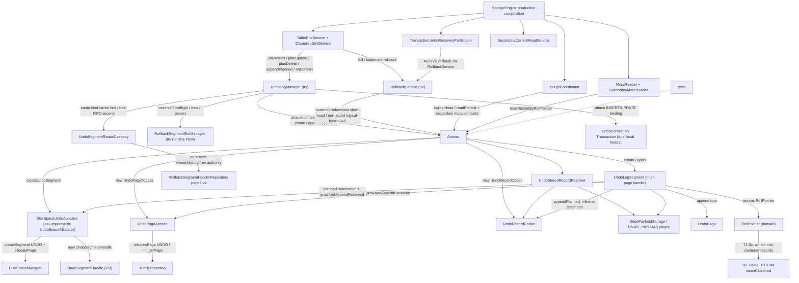

### Current Data Chains

| Flow | Current production chain | Current state |
| --- | --- | --- |
| Undo segment acquire | `UndoLogManager.planX` 按 record 类型选择 INSERT/UPDATE binding；目标 kind 尚无 log 时先由 `UndoSegmentReuseDirectory.peekCache(kind)` 冻结同 kind LIFO top/count，未命中再冻结 free FIFO head/successor/tail/length，依次形成 `REUSE_CACHED` / `REUSE_FREE` / `ALLOCATE_NEW` -> 业务 MTR reserve active slot；cache reuse 原子 page3 top→slot + activate，free reuse 原子 page3 摘头→slot、按全局页序清 successor.prev 并以新 kind/txn 激活，fresh 才创建 FSP segment；随后 append、bind、attach | Implemented and production-reachable；同一事务最多一条 INSERT 与一条 UPDATE log；cache 按 kind 有界 LIFO，free 跨 kind FIFO；reuse 只为 external payload 预留新页，stale owner/base/link 在物理前失败，物理后失败 fail-stop；仍是单系统 undo space/单默认 rseg |
| Undo append | `UndoLogSegmentAccess.planRecord` -> `UndoRecordWritePlan` 冻结完整 codec bytes（含 INSERT ownership 尾部）、fresh-root inline/external 决策、页数与 CRC -> `plannedNewPages` 算 root grow + payload 精确页数 -> execution `UndoLogSegment.appendPlanned` -> `preflightAppend` 校验 creator/index/物理高水位/persistent logical predecessor -> external 先写 payload 链再在普通 UNDO 槽发布 35B descriptor，inline 直接写编码 -> 构造 `RollPointer` -> 同一 MTR 更新 record count、物理 `LOG_LAST_UNDO_NO` 与 `UndoLogicalHead` | Implemented and production-reachable；ownership 不绕过既有 external undo payload/CRC/reservation；root 槽仍由 `UNDO_RECORD_PAYLOAD` redo，payload 页由 `PAGE_INIT(UNDO_PAYLOAD)+PAGE_BYTES` 保护，header count/high-water/head pair 由 metadata after-image 保护；物理高水位在 partial rollback 后不回退 |
| Undo main-chain growth | 已规划 root payload 若尾页放不下 -> consume 已预留 quota -> `allocateChainPageForAppend` -> `createChainPageForAppend` -> current/new/first FIL 链元数据更新 -> `appendRecord` | Implemented；reservation 已在任何 root/payload 页修改前覆盖 grow + external 总页数；`ALLOCATED->UNDO` double-newPage 复用通用 redo；main chain 只含 `PageType.UNDO`，external payload 页不改变 `lastPageId` |
| External undo payload write/read | write: `UndoPayloadStorage.write` 按计划分块 -> 同 segment `allocatePage` -> `UndoPayloadPage.format(PageType.UNDO_PAYLOAD)`，页保存 prev/next、chunk index、segment/inode identity、transactionId、undoNo、total length/page count/CRC；read: `UndoStoredRecordResolver` 识别 root tag `0x7F` -> `UndoPayloadStorage.read` 逐页短 fix 并严格验证全部证据/链接/配置上限 -> 整值 CRC -> `UndoRecordCodec.decode` 严格消费全部字节 -> descriptor identity 复核 | Implemented；root descriptor v1 固定 35B；`EngineConfig.maxExternalUndoPayloadPages` 默认 16 且不大于最小 buffer-pool instance；payload 与业务 `PageType.BLOB`/`LobReference` ownership 完全分离，同 FSP undo segment 的 drop 自动统一回收 |
| Undo page create | `UndoPageAccess.createFirstPage`/`createChainPage` -> production lease+Registry require -> `mtr.newPage(..., PageType.UNDO)` + envelope -> `UndoPage.format*` 写 flags format version 3；first page 初始化 EMPTY logical head 与 NULL history prev/next，chain 页复制同一 `UndoLogKind`，record area=136 | Implemented；v1/v2/未知版本不迁移且 open fail-closed；每张普通 UNDO 页可独立做 kind/type 守门，history link 只在 first page 读写 |
| Undo page open | `UndoPageAccess.openUndoPage` -> production lease+Registry require -> `mtr.getPage` -> PageType.UNDO gate -> `UndoPage.requireCurrentFormat` | Implemented；first/chain 任一页都执行 version gate，避免 direct roll-pointer read 绕过兼容性校验 |
| Reusable page reset/activation | finalization 对单普通页、`used=fragment=1, extent=0` 的 segment 先尝试 `STATE_CACHED`，cache 不接纳则 `STATE_FREE` 尾插 FIFO；两者清事务/commit/count/head，旧 record bytes 留在不可寻址区。cache activation 保持 kind，free activation 覆盖新 kind；FREE 复用 history prev/next 物理槽保存 free links，并用独立 redo kind | Implemented；cache/free/header/FSP 证据恢复期交叉验证；多页、external 或 extent segment 不 shrink，直接 drop |
| Persistent history/reuse node mutation | commit、rollback、purge 按场景把 history old/new、cache reset、free old tail/new nodes 一次收集，并在 page3 owner/base 写后按 `(spaceId,pageNo)` 全局升序获取全部普通 undo 首页；history 写 prev/next/state/commitNo，free 写 tail.next 与新节点 prev/next，purge/free reuse 清新 head.prev | Implemented and production-reachable；全部证据先校验后写；没有多个 helper 分别获取局部首页集合；history/free links 使用稳定独立 metadata redo kind |
| Undo record/logical-chain read | `UndoLogSegment.readRecord` / `UndoLogSegmentAccess.readRecordByRollPointer` / `forEachRecord` -> root page segment/creator/index/pointer 校验 -> `UndoStoredRecordResolver` 对 inline 直接 codec、对 descriptor 完整加载 external chain 后 codec；rollback/recovery 共用 `RollbackService.readUndoRecord` 短读 current/真实 predecessor，purge 与 MVCC 均经同一 access 入口 | Implemented and production-reachable；full/recovery 在 inverse 前验证 current=head pair、前驱归属及 undoNo 严格下降；external 逐页用 MTR savepoint 释放已读 payload 页，任一 B+Tree 逆操作前不持 undo latch/fix；`forEachRecord*` 仅物理诊断/测试使用 |
| Transaction undo write (1.6 dual log) | `planInsert` 只读 INSERT binding/reuse directory，`planUpdate/planDelete` 只读 UPDATE binding/reuse directory -> immutable `UndoWritePlan(kind,acquisition,globalHighWater,targetSnapshot/cacheOrFreeCandidate)` -> DML admission/begin -> `appendPlanned` -> record predecessor=同 kind 局部 head -> 同 MTR append/header update -> `UndoContext.publishAppend` 更新目标 binding head 与事务全局 `lastUndoNo` | Implemented and DML production-reachable；事务 undoNo 全局唯一递增；`ALLOCATE_NEW/REUSE_CACHED/REUSE_FREE/APPEND_EXISTING` 四路预算不同；旧 `beforeX` API 已删除 |
| Single-page undo (T1.3a) | `UndoLog.append(page, rec, keyDef, schema)` -> `codec.encode` -> `page.appendRecord` -> `new RollPointer` (`UndoLog.java:29-35`) | Implemented (test-only); superseded by `UndoLogSegment` for multi-page; only `UndoLogStoreTest` uses it |

### Package Status

| Package area | Representative classes | Current state | Notes |
| --- | --- | --- | --- |
| `storage.undo` access | `UndoLogSegmentAccess`, `UndoLogSegment`, `UndoAppendSnapshot`, `UndoHistoryNodeSnapshot`, `UndoFreeListNodeSnapshot`, `UndoRecordWritePlan`, `UndoStoredRecordResolver`, `UndoPayloadStorage`, `UndoLogicalHead`, `UndoLog`, `UndoSegmentHandle`, allocation ports | Implemented; production-held by `StorageEngine` | create/open/plan/append、external chain、commit header、logical-head CAS、history/free node inspect/link/unlink/activate、按 pointer 直读均生产可达；rollback/recovery/purge/MVCC 共用 resolver；`UndoLog` 单页 predecessor 与 `forEachRecord*` 仅测试/诊断 |
| `storage.undo` page | `UndoPageAccess`, `UndoPage`, `UndoPageLayout`, `UndoLogState`, `UndoPayloadPage`, `UndoPayloadPageLayout`, `UndoRedoDeltas` | Implemented | 普通 UNDO v3 flags gate + first-page 15-byte logical pair + state-discriminated history/free prev/next + record area=136 + every-page kind；external 页仍使用 `UNDO_PAYLOAD=9` 与 `UEP1/v1` body header；普通 v1/v2/未知版本 fail-closed |
| `storage.undo` rseg header | `RollbackSegmentHeaderRepository`, `RollbackSegmentHeaderLayout`, `RollbackSegmentHeaderSnapshot`, `RollbackSegmentHeaderCapacity`, `RollbackSegmentHistoryBase`, `RollbackSegmentFreeListBase` | Implemented; production-wired by `StorageEngine` | 固定 **page3 v4**：history base/high-water + free head/tail/length + active slots + INSERT/UPDATE cache arrays；fresh/rebuild、slot/cache/free owner CAS、history append/remove、truncate/recovery 共用；active/cache/free owner 唯一，history 是 occupied UPDATE 关系而非额外 owner；expected base/owner/count/top fail-closed；v1-v3/未知版本拒绝；多 rseg 未实现 |
| `storage.undo` record | `UndoRecord`, codec/types, `SecondaryUndoMutation`, `LobVersionOwnership`, external payload descriptor | Partial | 三类行记录、secondary tail 与 LOB version ownership 均已编解码并由 rollback/purge 消费；Atomic DDL marker 已作为 `storage.api.ddl.DdlUndoMarker` 写独立 catalog DDL log，不混入普通 row undo/history。partial 仅指未来改聚簇键/更多专用 row 格式与 temporary undo 未实现 |
| `storage.undo` exceptions | `UndoPageOverflowException`, `UndoPayloadTooLargeException`, `UndoLogFormatException`, `UndoLogicalHeadConflictException` | Implemented | ordinary root 槽异常、external 配置上限、descriptor/page/link/owner/CRC/codec 损坏和 logical-head stale 均使用领域异常；页数上限在 reservation 前拒绝，物理发布后的事务编排不确定性由 trx fatal 异常表达 |
| `storage.api` undo adapter | `DiskSpaceUndoAllocator` | Implemented | Implements `UndoSpaceAllocator`; delegates to `DiskSpaceManager.createSegment(UNDO)`/`allocatePage` and maps exact planned reservation to `DiskSpaceManager.reserveSpace(UNDO)`；同时服务主 UNDO chain grow 与同 segment external payload 页分配 |

## Domain + Common Slice

### Package Status

| Package area | Representative classes | Current state | Notes |
| --- | --- | --- | --- |
| `domain` page locator | `PageId` `(SpaceId, PageNo)`, `SpaceId` `(int)`, `PageNo` `(long)`, `PageSize` `(int)` | Implemented | Immutable records; `PageId.offset(PageSize)` for positional IO; `PageSize.extentSizeBytes()`/`pagesPerExtent()`; consumed by api/buf/fil/fsp/flush/btree/redo |
| `domain` segment/extent | `SegmentId` `(long)`, `ExtentId` `(SpaceId, long)` | Implemented | `ExtentId.from(PageId, PageSize)`/`firstPageNo(PageSize)`; consumed by api (`DiskSpaceManager`/`DiskSpaceUndoAllocator`/`SegmentRef`), fsp |
| `domain` LSN | `Lsn` `(long)` | Implemented | Redo LSN; WAL/pageLSN/checkpoint boundary; consumed by buf/flush/mtr/redo/recovery |
| `domain` transaction | `TransactionId` `(long)` `NONE=0`, `TransactionNo` `(long)` `NONE=0` | Implemented | `TransactionId` = DB_TRX_ID writer id；`TransactionNo` = commit sequence，已由 prepareCommit、persistent history、purge eligibility 与 recovery high-water 消费；物理 history 顺序不要求 no 单调 |
| `domain` XA identity | `XaId` `(formatId,gtrid,bqual)` | Implemented | signed formatId；gtrid 1..64B、bqual 0..64B、总长≤128B；防御性复制；只由 parser/session/engine XA registry 使用，storage transaction 不持有 XID |
| `domain` undo pointer | `RollPointer` `(boolean insert, PageNo, int offset)` 7B codec, `NULL`, `UndoNo` `(long)` `NONE=0`, `RollbackSegmentId` `(int)`, `UndoSlotId` `(int)` | Implemented | `RollPointer.insert` 同时参与 INSERT/UPDATE log kind 守门；聚簇 `DB_ROLL_PTR` 由 `planX/appendPlanned` 返回；rseg/slot 仅存在 `UndoLogBinding`，不进入指针编码；`UndoNo` 为 per-txn 全局序号，两个局部 log 共享高水位 |
| `common.exception` | `DatabaseRuntimeException` (root), `DatabaseFatalException` (fatal), `DatabaseValidationException` (validation) | Implemented | Project exception hierarchy root；模块异常统一沿 `DatabaseRuntimeException` 层次派生；当前 20 个 direct fatal 类型覆盖 data/redo/recovery/undo/catalog publication 与 `LobPageCorruptedException`；`DatabaseValidationException` replaces `IllegalArgumentException` across all packages |
| `common.logging` | `ColoredLevelConverter` | Implemented | Logback ANSI color converter: ERROR red, WARN yellow (`:25-30`) |
| `common` | `package-info` | Implemented | Only package-info; clock/config/util interfaces not yet added |

## Data Dictionary + Physical DDL Slice

### Current Flow

```mermaid
flowchart TD
  Admin["explicit offline admin caller"] --> RecoverySvc["CatalogRecoveryService inspect/quarantine/rebuild"]
  Engine["DatabaseEngine"] --> InstanceLock["DatabaseInstanceFileLock mysql.instance.lock"]
  RecoverySvc --> InstanceLock
  Engine --> Control["DictionaryControlStore mysql.dd.ctrl"]
  Engine --> Admission["CatalogBootstrapAdmission"]
  Admission -->|"existing open / proven-fresh create"| Catalog["FileInternalCatalogStore mysql.ibd"]
  Admission -->|"read-only presence probe"| Evidence["DD control / manifest / redo / undo / doublewrite / controlled tablespace"]
  Catalog --> Repo["PersistentDictionaryRepository"]
  Engine --> Manifest["DictionaryRecoveryManifestRepository"]
  Manifest --> ManifestStore["FileDictionaryRecoveryManifestStore mysql.dd.manifest"]
  Control -->|"before reservation (:290)"| Manifest
  Repo -->|"before mutation (:241)"| Manifest
  Repo -->|"constructs (:50)"| DdlLog["PersistentDdlLogRepository"]
  DdlLog -->|"append/read DDL_LOG(7) (:137/:145)"| Catalog
  Engine --> Discovery["DictionaryTablespaceDiscovery"]
  Engine --> Isolation["DictionaryRecoveryIsolationPlanner"]
  Isolation -->|"RECOVERY_UNAVAILABLE DD commit + exclusion policy"| Storage["StorageEngine.open(recoveryTablespaces)"]
  Discovery -->|ACTIVE / DROP_PENDING bindings| Storage
  Engine --> DdlRecovery["DictionaryDdlRecoveryService"]
  DdlRecovery -->|"unresolved/transition (:126+)"| DdlLog
  DdlRecovery --> Physical["TableDdlStorageService"]
  DdlRecovery --> Sdi["SerializedDictionaryInfoService / DictionarySdiCodec"]
  DdService["DataDictionaryService"] --> Mdl["MetadataLockManager"]
  DdService --> Cache["DictionaryObjectCache"]
  Cache --> Repo
  Ddl["DictionaryDdlService"] --> Mdl
  Ddl --> Repo
  Ddl --> Publisher["DictionaryRecoverySnapshotPublisher"]
  Publisher -->|"writer-fenced clean snapshot"| Manifest
  Ddl -->|"prepare/transition (:241-363)"| DdlLog
  Ddl --> Barrier["storage.api TablePurgeBarrier"]
  Ddl --> Sdi
  Ddl --> Backup["RecoveryBackupService + HMAC manifest"]
  Ddl -->|"alterTableOnline (:2632)"| AlterRuntime["OnlineAlterRuntime + OnlineDdlTableGate"]
  AlterRuntime -->|"operation-owned journal"| AlterLog["FileOnlineAlterChangeLog"]
  DdlRecovery -->|"recoverGeneralOnlineAlter (:450)"| AlterLog
  Backup --> Identity["RecoveryIdentityStore"]
  Backup --> Physical
  Physical -->|"rebuildTable: 256-row batches"| BTreeLob["B+Tree rebuild + LobStorage reallocation"]
  Physical -->|"DISCARD/IMPORT + recovery raw DDL"| Transfer["tablespace-transfer/discarded + recovery-incoming"]
  Sdi -->|"opaque table/version/payload"| Physical
  Ddl --> Physical
  Physical --> SdiPage["storage.sdi page0 SDI_ROOT -> fixed page3"]
  Resolver["DictionaryIndexMetadataResolver"] --> Repo
  Resolver --> Mapper["DictionaryStorageMetadataMapper"]
  Mapper --> Factory["BTreeIndexMetadataFactory"]
  Storage -->|rollback / purge identity| Resolver
  Storage -->|persistent history table refs| Barrier
  RecoverySvc -->|"strict committed events"| ManifestStore
  RecoverySvc -->|"full-page scrub + opaque SDI"| FullScrub["TablespaceFullScrubber"]
  RecoverySvc -->|"safe control / verified baseline"| Control
  RecoverySvc --> Catalog
```

### Current Data Chains

| Flow | Current production chain | Current state |
| --- | --- | --- |
| Public bootstrap | `DatabaseEngine.open` 先取得 `DatabaseInstanceFileLock` -> `CatalogBootstrapAdmission` -> 严格打开/必要时保留并再生 manifest -> 以 manifest witness 打开 control/repository -> FORCE isolation planner -> DD discovery + `StorageEngine.open` -> logged/legacy/recovery-object DDL recovery + ACTIVE SDI reconcile + orphan cleanup -> clean snapshot -> 按 unavailable 集合发布 NORMAL/DEGRADED/RECOVERY_EXPORT_READ_ONLY | Implemented；普通启动从不触发 catalog rebuild；missing/empty catalog 遇既有实例证据 fail-closed；FORCE 隔离先于任何用户 tablespace open，instance lock 持有到 storage/control/catalog/manifest 全关闭 |
| Recovery manifest / mutation fence | `DictionaryControlStore.reserve` -> `beforeControlReservation`（`DictionaryControlStore.java:290`）-> manifest durable event；`PersistentDictionaryRepository.commit`（`PersistentDictionaryRepository.java:241`）-> `beforeCatalogMutation` -> manifest durable intent -> catalog append；DDL 稳定终点 -> `DictionaryRecoverySnapshotPublisher.publish`（`:81`）在 repository writer fence 内发布 full clean baseline | Implemented v1；三类 event 使用独立 magic、双 header、frame CRC/batch SHA/body SHA/chunk 校验；safe control 按分量最大；并发临时 DDL 保留 unresolved intent，不用旧 clean 越过新 mutation；clean 失败建立后续 DDL fence |
| Explicit catalog-loss recovery | admin -> `CatalogRecoveryService.inspect`（`CatalogRecoveryService.java:122`）完整枚举/scrub并签发 token -> 可选 `quarantine`（`:148`）显式原子隔离 extra 或坏 catalog/control -> 再 inspect -> `rebuild`（`:232`）先发布 safe control，再按 clean manifest digest 写/重开验证稳定 baseline temp，复扫 expected 后 atomic publish `mysql.ibd` -> 普通 `DatabaseEngine.open` 再验证并服务 | Implemented offline API；missing manifest、dirty intent、missing/invalid expected、SDI/archive 不一致均阻塞；token 绑定 manifest 最新 sequence、catalog/control、所有 raw/scrub 指纹和 conflicts；control 推进造成新 token 时，同一 clean digest 仍定位并严格复用已验证 temp；实例 busy、timeout/interruption、stale token 与非原子文件系统均拒绝 |
| Catalog baseline batch | clean archive -> `DictionaryCatalogArchiveCodec` -> `CATALOG_BASELINE_META(8)` + schema/table/column/index records + `CATALOG_BASELINE_COMMIT(126)` -> `FileInternalCatalogStore.append` -> `PersistentDictionaryRepository.rebuild`（`PersistentDictionaryRepository.java:413`） | Implemented；baseline 只能是首个且最多一次，保留对象 version 与 index ordinal，严格校验 map key、父子、identity/name、稳定状态与 aggregate counts；旧 catalog 无 baseline 保持兼容，baseline 后允许正常 mutation |
| Statement metadata lease | `DataDictionaryService.openTable(owner,name,TableAccessIntent,timeout)` -> schema MDL(SR) -> READ/table SR 或 WRITE/table SW -> cache single-flight load + pin -> `TableMetadataLease`；close 逆序 pin→table→schema | Implemented；访问意图无隐式默认值；DDL publish 后旧 pinned 版本可保持 stale，DROP_PENDING/DROPPED 不再由普通 lookup 打开 |
| Table options / column defaults | `TableOptions`、`ColumnDefaultDefinition`、`ColumnGeneration` 与 comment -> catalog column payload v3 + SDI logical payload v4 -> repository/SDI decode -> CREATE/ALTER binder/storage mapping | Implemented；CREATE constant default 在 implicit commit 前按最终列类型校验，字符列 0/0 继承哨兵在 schema IX/table X 下解析；column/table comment、AUTO_INCREMENT、table default charset/collation、REQUIRED/IMPLICIT_NULL/typed CONSTANT 都是 DD 权威状态；legacy payload 确定性补齐空 comment/NONE generation，未知版本 fail-closed |
| CREATE TABLE | SQL `CreateTableStatementNode` -> `BoundCreateTable/CreateTableCommand` -> Session implicit commit -> `SqlDdlGateway` 独立 owner -> schema IX/table X -> reserve object/space/ddl/version -> DDL log `PREPARED` -> `TableDdlStorageService.createTable` schema/LOB/redo admission + 单 MTR 创建 GENERAL/FSP、index segments/root、可选 LOB segment及空 SDI page3 -> redo durable -> `ENGINE_DONE` -> SDI v4 durable -> repository ACTIVE commit -> `DICTIONARY_COMMITTED` -> cache publish -> `COMMITTED` | Implemented SQL + file-per-table atomic DDL v2；两条用户给出的 MySQL dump 风格 CREATE 已做 parser 与真实 engine 集成回归。支持整数显示宽度兼容、NULL/default、列/表 comment、AUTO_INCREMENT、内联/表级 PRIMARY、具名 UNIQUE KEY/INDEX、普通 KEY/INDEX、ASC/DESC、USING BTREE 前/后置及 IF NOT EXISTS warning；仍要求显式恰好一个 PRIMARY，固定 128 初始页，不支持隐藏聚簇键、foreign/generated/check、prefix/expression index和 COMMENT 以外 table options |
| AUTO_INCREMENT | DD `ColumnGeneration.AUTO_INCREMENT` -> storage mapping active flag -> CREATE 初始化 page0 high-water -> `DefaultSqlStorageGateway.insertBatch` 按 exact 整数位宽/signed 属性计算列域上限并汇总本批显式值/待生成数 -> `AutoIncrementService.allocate` 在 per-SpaceId 显式锁和单 MTR 中推进 high-water并使 redo durable -> 批量 DML；重启由 DD active 与 page0 header 交叉验证 | Implemented v1；至多一列且必须是 NOT NULL 整数和聚簇主键第一列；NULL/省略触发生成，显式正值推进 high-water，TINYINT/SMALLINT/INT/BIGINT 分别在声明的 signed/unsigned 上限停止，unsigned BIGINT 按原始位比较；值一经分配即使 statement rollback 也不回收，`UpdateResult.generatedKey` 返回首个生成值 |
| DROP TABLE / SCHEMA | 单表 DROP 保留既有 op2 链；多表 `DROP TABLE` 在全部 schema IX/table X 下完成对象/binding/purge/digest 预检后写一个 op12 `DdlBatchManifest`，用一个 DD transaction 发布全部 DROP_PENDING；随后逐表等待 pin，由 storage DROP 丢弃 change-buffer evidence并删除空间，再用一个 DD transaction发布全部 DROPPED；`DROP SCHEMA` 以 schema X 冻结表集，op13 在同一终结 transaction 写 schema 与全部 table tombstone | Implemented DDL v5；`IF EXISTS` 只把缺失对象转为 1051/1008 warning，列表重复目标拒绝；CREATE SCHEMA/TABLE 已存在分别为 1007/1050 warning。恢复只接受全 ACTIVE+PREPARED 回滚、全 DROP_PENDING 前滚或全 DROPPED 终结，混合状态 fail-closed；空 schema 也走固定 marker/version 生命周期；删除当前 schema 后 Session 清空 current schema |
| Online CREATE secondary index | `CREATE [UNIQUE] INDEX` / 单动作 `ALTER TABLE ... ADD [UNIQUE] INDEX` -> Session bind + implicit commit -> `DictionaryDdlService.createSecondaryIndexOnline`（`DictionaryDdlService.java:687`）：schema IX/table SU→initial X，冻结 gate + force manifest/`CREATE_INDEX/PREPARED`，创建 staged descriptor，force `CAPTURING` 后 X→SU -> 256-row clustered base scan；并发 DML 在短物理修改后捕获 before/after candidate，普通 commit/XA PREPARE force 自身 high-water -> final SU→X + gate seal -> force `SEALED`，按 cutover current truth reconciliation + 双向验证 -> 数据/WAL force + `RECONCILED` force -> `ENGINE_DONE` -> SDI/DD/cache/footer/`COMMITTED` | Implemented online v1；base scan 允许 SELECT/INSERT/UPDATE/DELETE，rollback candidate 可安全冗余，容量耗尽先 durable `ABORT_REQUIRED` 且业务 DML 继续；terminal reserve最少256 bytes并同时覆盖最后一次force watermark。final UNIQUE 按 non-NULL logical prefix 裁决。PREPARED recovery（`DictionaryDdlRecoveryService.java:1304`）在开放流量前丢弃旧 generation/tree并从当前聚簇真相重建；ENGINE_DONE/committed DD 只前滚；legacy 无 row-log marker 仍走 blocking recovery；terminal/orphan log 只按受控 build identity 精确清理 |
| Online DROP secondary index | `DROP INDEX ... ON ...` / 单动作 `ALTER TABLE ... DROP INDEX ...` -> Session bind + implicit commit -> `DictionaryDdlService.dropSecondaryIndexOnline`（`DictionaryDdlService.java:1359`）：schema IX/table SU -> `DROP_INDEX/PREPARED/OPEN`（source/target digest）-> gate `RETIREMENT_OPEN` + durable DROP descriptor -> final X排空旧admission/writer -> 捕获persistent history high-water与exact source metadata version -> 一次安装retirement fence -> `OPEN→FORWARD_ONLY` CAS -> target SDI/DD/cache发布 -> X降回SU并清gate -> 有界等待history与source pin共同安全 -> `ChangeBufferDdlBarrier.discardIndex` -> 单MTR回收segments/footer -> `ENGINE_DONE/COMMITTED` | Implemented online v1；旧 exact index identity 的 buffered records 在 segment 回收前清零；prepare/descriptor/final-X等待及 FORWARD_ONLY 前仍可 durable cancel；target 发布后新 DML 不维护旧索引。恢复按 committed DD、digest、control、fence 和 exact descriptor 裁决；不支持 IF EXISTS、DROP PRIMARY KEY 或多 action 原子在线回收 |
| Controlled DISCARD / IMPORT | SQL `ALTER TABLE ... DISCARD/IMPORT TABLESPACE` -> dedicated bound plan -> implicit commit -> DDL owner table X -> DDL log phase；DISCARD 先 Change Buffer space barrier 再 exact path atomic move；IMPORT 先在用户 X lease 外 discard 旧 global evidence，再校验 page0/SDI/file identity、以 DISCARDED 挂载、按公式清零可信 IBUF_BITMAP、恢复 NORMAL + WAL/force 并递增 spaceVersion（`TableDdlStorageService.java:4054`） | Implemented v1；只允许实例内受控路径；旧 incarnation 不能污染导入页；跨第二 bitmap 区间但文件未预留正确类型页时 fail-closed 并保持 DISCARDED；startup 按 DD lifecycle + marker exact path 续作，不接受任意外部路径 |
| Recovery object DISCARD / DROP | Java DDL facade -> schema IX/table X -> history/pin drain -> op 8/9 `PREPARED` -> storage SpaceId X lease + no handle/frame proof -> raw atomic move/delete without page0 -> `ENGINE_DONE` -> `RECOVERY_DISCARDED/DROPPED` DD -> terminal marker | Implemented；所有 canonical/transfer 路径逐级拒绝符号链接；source missing 幂等成功、source+target 同时存在 fail-closed；DROP 只删除对象当前拥有的 canonical 或固定 discarded 文件，不删除 archive/incoming |
| Trusted recovery backup / replacement | ACTIVE table X -> history/pin drain -> storage X lease + dirty drain/force/stable copy -> 副本 page0 DISCARDED+checksum+force -> SHA-256 -> 本实例 UUID/HMAC manifest 最后原子发布；管理员 stage 固定 incoming pair -> HMAC/hash/definition/file/page0 校验 -> op 10 physical import/NORMAL mount -> ACTIVE DD | Implemented Java facade v1；identity 文件懒创建并带 CRC，损坏只阻断 backup/import；archive/incoming 保留；不支持 SQL 语法、任意路径、跨实例 trust 或坏页 repair |
| General Online ALTER | SQL ordered AST -> Binder typed `BoundAlterTable` -> one implicit-commit DDL -> `OnlineAlterStrategySelector.select`（`OnlineAlterStrategySelector.java:64`）在副作用前冻结完整action集合；`DictionaryDdlService.alterTableOnline`（`DictionaryDdlService.java:2632`）使metadata-only走短X instant，仅secondary集合进入一个`ONLINE_ALTER_INPLACE_V1` manifest/capture/descriptor generation，row-layout或mixed action进入一个`ONLINE_ALTER_SHADOW_V1` manifest/capture/shadow space。两路均按`PREPARED/OPEN -> READY -> FORWARD_ONLY -> RECONCILED/ENGINE_DONE -> single target DD version -> retirement -> COMMITTED`推进 | Implemented v1, production-wired；INPLACE由`TableDdlStorageService.beginOnlineAlterIndexDescriptors`（`TableDdlStorageService.java:517`）以专属segment/page chain原子拥有多个ADD/DROP descriptor并流式reconcile candidate；SHADOW由`rebuildTableOnline`（`:2126`）在SU下bounded copy，DML捕获clustered identity，final X后严格delete/ensure两遍reconcile、双向验证并等待ReadView/purge barrier，发布后延迟回收旧space。恢复入口为`DictionaryDdlRecoveryService.recoverGeneralOnlineAlter`（`DictionaryDdlRecoveryService.java:450`）；统一tracker/cancel、manifest digest、exact path和故障注入均已接；不支持主键/任意类型/foreign/generated、prefix/FULLTEXT/SPATIAL、binlog、并行/外排或持久scan continuation |
| DDL log / undo marker v5 | `DictionaryDdlService`按 operation 构造 canonical digest、execution protocol、control及可选 batch manifest -> `PersistentDdlLogRepository.prepare` 校验固定 shape/checkpoint -> catalog `DDL_LOG(7)`；`DdlLogCatalogCodec` 写 v5、分块保存最多 4096 个排序 entry，并兼容读 v1-v4 | Implemented for stable operation 1..13；op12/13 使用 `BATCH_DROP_V1`，manifest 固定 schema/table identity、SpaceId、受控相对路径、row format和 source/pending/target digest。repository phase CAS 不允许 identity/protocol/digest/manifest 变更；恢复在采用 DD/SDI/path 前复算并核对；legacy 格式仍可恢复但不能由 v5 encoder 产生或冒充 digest verified；temporary undo未接 |
| Online DDL observability / cancel | `DatabaseEngine.onlineDdlControl`（`DatabaseEngine.java:400`）-> `OnlineDdlControlService.list/find`（`OnlineDdlControlService.java:65`）合并共享`OnlineDdlOperationRegistry` active/history与durable marker；`requestCancel`（`:129`）先做privilege和prepare handoff，再调用repository control CAS，锁外按index build/general capture identity分别唤醒gate并取消pending MDL；`awaitTerminal`有界等待本进程tracker | Implemented stable Java/admin facade；snapshot含identity、runtime/gate/durable phase、control、scan/row-log/high-water、wait、retirement和forward-recovery字段且不打开表空间/row-log。取消结果区分before-prepare、durable accepted、already requested、too late、terminal、not found；重启遗留marker可返回durable-only弱一致视图；尚无SQL/协议命令或权限系统 |
| SDI v1 envelope | `DictionarySdiCodec.encode(ACTIVE TableDefinition)` -> `SerializedDictionaryInfoService` -> `TableDdlStorageService.writeSerializedDictionaryInfo` -> SDI write MTR(page0 root→page3 body) -> `flushThrough` -> tablespace force；startup 只对 committed ACTIVE 表执行 exact compare | Implemented；GENERAL extent0 固定 page3、`PageType.SDI=4`、`SDI1/v1` header + CRC32C；逻辑 payload v4 保存 row format/options/default/comment/generation；`RECOVERY_UNAVAILABLE/RECOVERY_DISCARDED` 明确拒绝 encode/reconcile，不从损坏 SDI 猜归属；index footer 与原有 fail-closed 规则不变 |
| Index/LOB metadata mapping | binder scope pins exact `TableDefinition` -> gateway mapper 生成 `TableIndexMetadata`（clustered + 按 id 排序 secondary）/LOB binding；rollback/purge -> undo identity -> `UndoTargetMetadataResolver` -> same mapper/factory | Implemented；SQL table INSERT、primary/unique-secondary SELECT、multi-index rollback/purge 共用 exact-version layout/root/binding；旧 catalog empty binding 保留而不猜测能力 |

### Package Status

| Package area | Representative classes | Current state | Notes |
| --- | --- | --- | --- |
| `engine` catalog bootstrap/recovery | `CatalogBootstrapAdmission`, `DatabaseInstanceFileLock`, `CatalogRecoveryService` 及 inspection/token/conflict/result 类型 | Implemented; public composition + explicit offline API | 普通启动仅 fail-closed guard；离线门面才允许 inspect/quarantine/rebuild。两者共用有界跨进程实例锁；没有 CLI/SQL 自动触发、没有 force/bypass |
| `dd.domain/repo/tx` | immutable schema/table/index/options/default/generation definitions, `DictionaryControlStore`, `PersistentDictionaryRepository`, `PersistentDdlLogRepository`, archive/witness | Implemented catalog/baseline + DDL log v5 | column payload v3 与 SDI v4 保存 comment/generation；schema ACTIVE/DROPPED 生命周期、multi-object transaction mutation 和 batch marker 已接；control/catalog 写前接 manifest witness；clean snapshot 过滤 schema/table tombstone，允许同名重建形成无歧义 baseline |
| `dd.cache/mdl/service` | `DictionaryObjectCache`, `MetadataLockManager`, `DataDictionaryService`, `TableAccessIntent`, `TableMetadataLease` | Implemented | cache single-flight/pin/stale + DROP version barrier；显式 READ→table SR、WRITE→table SW，schema 恒 SR；MDL 六模式矩阵、FIFO、upgrade、timeout、deadlock wait graph；schema→table 锁序 |
| `dd.ddl/recovery` | `DictionaryDdlService`, `DictionaryDdlRecoveryService`, `DdlBatchManifest`, schema/table digest、control/registry facade, online ALTER runtime/barrier、recovery backup及catalog-loss服务 | Production-wired marker v5 + atomic batch DROP + online ALTER + object-force/catalog-loss v1 | op12/13 recovery 对整组 DD 状态和 manifest identity/digest/path 做 fail-closed 裁决；live/recovery共用既有 purge/pin/change-buffer/physical gate。通用 ALTER 恢复仍逐字段核对 marker/header/manifest/DD/SDI/descriptor/fence；复制 binlog、跨实例 trust、主键/任意类型/foreign/generated ALTER 仍未实现 |
| `dd.sdi` | `DictionarySdiCodec`, `SerializedDictionaryInfoService`, `DictionarySdiCorruptionException` | Implemented v1; production-wired | DD 拥有完整 table 聚合确定性编码；CREATE 在 ACTIVE publish 前写，recovery 只以 committed DD 比较/重写；不接 page/BufferFrame，也不把 SDI 反向发布进 repository |
| `storage.api.catalog` / `storage.fil.catalog` | `InternalCatalogStore`, catalog records/exceptions, `FileInternalCatalogStore`, `FileDictionaryRecoveryManifestStore` | Implemented v1 | catalog 与 manifest 复用同一 durable batch 物理协议但使用不同 8-byte magic，互相不能误开；existing manifest（含零长度）永不由 open-or-create 原地初始化；底层 channel 使用 NOFOLLOW；物理实现只依赖 common + storage API，不反向 import DD |
| `storage.api.ddl` + `storage.sdi` | storage schema/default/rewrite/rebuild DTO, `TableDdlStorageService`, `OnlineAlterDescriptorSet`, descriptor page repository/codec, `RecoveryBackupFile`, `DdlUndoMarker`, SDI repository/layout | Implemented v1 + online shadow/recovery raw IO | create/drop/index/transfer之外，提供versioned descriptor chain、bounded shadow copy、candidate identity delete/ensure、双向验证、raw recovery SDI read/mount/exact unopened cleanup；write admission、SpaceId lease、handle/frame/path约束均在stable storage API内，storage不反向依赖DD |
| `storage.api.ddl.online` + `storage.fil.online` | `OnlineDdlTableGate`, index/alter capture target、candidate/log records, `FileOnlineIndexChangeLog`, `FileOnlineAlterChangeLog`, controlled path factories | Implemented online ADD/DROP + general ALTER v1; production-wired | per-table gate以显式锁保护ACTIVATING/CAPTURING/SEALING/RETIREMENT_OPEN/ABORTING；通用journal拥有immutable manifest header、CRC/sequence/force watermark、READY/RECONCILED和有界可rewind candidate stream。所有文件只按exact id/path打开清理，不替代redo/undo/binlog |
| `engine` | `DatabaseEngine`, `DatabaseAccessMode`, unavailable diagnostics、execution/write gates、DD metadata resolver/mapper、SQL gateways | Implemented public composition root | FORCE completion hook 在 worker/warmup 前执行 recovery-object DDL；NORMAL/DEGRADED/RECOVERY_EXPORT_READ_ONLY/VALIDATION_READ_ONLY 由启动证据发布；Session gateway 与 storage write admission 双层守门 |

## SQL Calcite-Lite Planning + Executor / Session Slice

### Current Flow

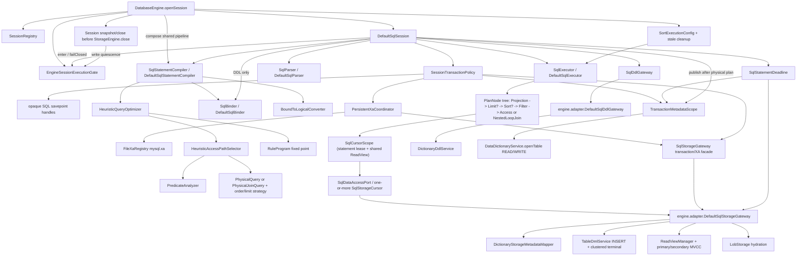

### Current Flow Source Anchors

| Diagram edges | Production source evidence |
| --- | --- |
| Engine -> Registry / Session / Gate / Compiler / sort config | `DatabaseEngine.java:219,253,473-485` |
| Session -> Gate / Deadline / Parser / Policy | `DefaultSqlSession.java:297-315,402-405` |
| Session -> Compiler -> Binder / Converter / Optimizer -> Executor | `DefaultSqlSession.java:413-416`; `DefaultSqlStatementCompiler.java:72-76` |
| Optimizer -> RuleProgram / Access selector -> Predicate analyzer / physical ordering | `HeuristicQueryOptimizer.optimize`; `RuleProgram.rewrite`; `HeuristicAccessPathSelector.optimizeSelect/optimizeJoin`; `PredicateAnalyzer.analyze` |
| Session -> DDL port -> adapter -> DD coordinator | `DefaultSqlSession.java:469-566`; `DefaultSqlDdlGateway.java:53-141` |
| Policy -> Savepoint / XA / Gateway / Metadata | `SessionTransactionPolicy.java:243-307,321-389,554-607` |
| XA coordinator -> durable registry / storage facade | `PersistentXaCoordinator.java:90-97,166-190` |
| Metadata -> DD and publish transfer | `StatementBindingScope.java:63-94`; `TransactionMetadataScope.java:100-120` |
| Executor -> PlanNode tree -> statement cursor scope -> Data Port cursor -> adapter | `DefaultSqlExecutor.executeQuery`; `PlanNodeFactory.create(PhysicalQuery/PhysicalJoinQuery)`; `NestedLoopJoinNode.advanceNode`; `StorageAccessNode.openNode`; `DefaultSqlStorageGateway.openCursorScope` |
| Sort config / node -> controlled spill | `DatabaseEngine.java:219,253,484`; `SortExecutionConfig.cleanupStaleStatements`; `SortNode.openNode/writeRun/reduceRunsToFanIn` |
| Adapter cursor scope/cursors -> mapper / MVCC / current-read / lazy LOB | `DefaultSqlStorageGateway.openCursorScope`、`EngineSqlCursorScope.openCursor/readView/close` 与三类 `*SqlStorageCursor`；range DML 保持独立入口 |
| Engine close -> Session convergence / execution gate | `DatabaseEngine.java:532-567` |

### Current Data Chains

| Flow | Current production chain | Current state |
| --- | --- | --- |
| Session admission | `DatabaseEngine.openSession` under lifecycle lock -> `SessionRegistry.register` -> `DefaultSqlSession`；每次 `execute` 先 `EngineSessionExecutionGate.enter` 取 read permit、再取 Session operation lock，并读取本次 open 的 `DatabaseAccessMode` | Implemented；NORMAL/DEGRADED 保持原语义；RECOVERY_EXPORT_READ_ONLY 允许 consistent SELECT 与只加共享锁的 `FOR SHARE`，拒绝 `FOR UPDATE`、DML、DDL 与 XA；本地 transaction/savepoint control 仍可编排只读事务，gateway/storage write admission 是二次防线；close 锁序固定 gate→Session |
| Parse / compile / publish | `DatabaseEngine` 组合共享 compiler；`DefaultSqlSession.execute` 创建 one deadline/解析 -> `compiler.compile` -> semantic Binder / logical converter -> optimizer；单表生成 `PhysicalQuery(root=project(filter(access)))`，二表等值 JOIN 生成 `PhysicalJoinQuery(outerAccess, innerProbe, ON, WHERE)`，DML 生成其它 `PhysicalPlan` -> Session `StatementBindingScope.publish()` -> Executor | Implemented；Parser 支持两表 alias/qualified column/等值 ON；Binder 按 canonical table key 取得 lease、解析 unknown/ambiguous column 并携带 relation ordinal，不选择索引且不 publish/close scope；Optimizer 只构造不可变物理树和排序策略，不创建运行资源；只有完整 plan 成功后才 publish |
| INSERT / point + range writes | Parser 保存多组 VALUES -> Binder 对每行按列顺序冻结 `InsertValueSource`（显式值/default/NULL/AUTO_INCREMENT）-> `PhysicalInsert` -> Executor 一次 `insertBatch` -> gateway 先持久分配本批自增区间，再在一个 `DmlStatementGuard` 内逐行调用 `TableDmlService`；range DML 仍先物化全部 clustered identity | Implemented；多行 INSERT statement 原子，任一行失败回滚该批已写行；自增号分配不回滚并允许产生 gap，首个生成键进入 `UpdateResult`。28 类型、external LOB、logical unique/NULL、多索引 rollback 均走生产链；range 修改 access key 不会 Halloween，仍禁止修改主键 |
| Point SELECT | semantic `BoundSelect.condition` -> logical `project(filter(scan))` -> RuleProgram/PredicateAnalyzer -> selector primary 或 stable-id logical-unique secondary (`HeuristicAccessPathSelector.java:126-177`) -> `PhysicalQuery(PhysicalProject(PhysicalFilter(PhysicalPointAccess)))` -> `PlanNodeFactory` -> `PointAccessNode` -> `SqlDataAccessPort.openCursor` -> `PointSqlStorageCursor` MVCC/current row -> `FilterNode` residual -> `ProjectionNode` lazy value/LOB -> Executor eager `QueryResult` -> finally close | Implemented M4；point key 必须由最外层正向 AND 的相同 typed equality 证明；一致性 SELECT 允许完整唯一键加 opaque residual，locking read 仍归 range access；RR/RC/RU 聚簇与 secondary 都在完整行上求最终 SQL truth；row view 在下一次 advance/close 后失效，不泄露 storage reference |
| Boolean/comparison/composite/full-scan SELECT | parser/Binder sealed condition -> logical `PredicateSet` -> bottom-up RuleProgram -> `PredicateAnalyzer` 正向 AND 安全交集 -> `PhysicalRangeAccess`/`PhysicalSecondaryPrefixAccess` -> PlanNode tree；`RangeSqlStorageCursor` 逐 256 physical candidates 回聚簇并发布完整行 -> `FilterNode` 三值/短路 -> 可选 Sort/Limit -> Projection -> eager result | Implemented；`condition` 是唯一权威；OR/NOT/null-test 是 residual barrier，range 只缩小候选、TRUE 才命中；external TEXT/BLOB 只有被比较、排序或投影时才 hydrate；普通 secondary-prefix 对 Executor 为 cursor，但底层 reader 仍先物化稳定列表（partial）；尚无 IN/LIKE、OR range union、NULL endpoint 或 prefix-index SQL range |
| Two-table INNER JOIN | qualified/alias AST -> `BoundJoinSelect`（两个 exact table versions、relation-aware ON/WHERE、扁平 projection/order）-> `LogicalProject(Filter(Join(scans)))` -> `PhysicalJoinQuery` -> `PlanNodeFactory` -> `NestedLoopJoinNode`；outer 固定 SQL 左表，inner 每个 outer row 重开 point/prefix/full-scan cursor；ON TRUE 后再执行 WHERE、Sort/Limit/Projection | Implemented v1；支持恰好两个输入和列列等值 ON；inner 单列完整 clustered/unique/non-unique secondary 分别选择 point/prefix Index NLJ，无安全索引回退普通 NLJ；NULL outer key 不打开 inner；joined row 随任一 child advance 失效，跨推进排序/公开结果立即物化；不支持 outer/multi-way/hash/merge/join reorder/locking JOIN |
| ORDER BY / LIMIT | Binder 将排序列解析为 exact table ordinal/type；selector 证明等值固定前缀后索引剩余连续 key part 与索引声明方向一致，成功选 `INDEX`，否则小 `offset+count` 选 `TOP_N_HEAP`，其余选 `PARTITIONED_HEAP_MERGE`；`PlanNodeFactory` 组合 Sort/Limit，`LIMIT 0` 不打开 child | Implemented v1；索引排序当前只支持 forward scan，不能用整体反向扫描翻转全部 key part。Top-N 使用最大堆且实际 retained bytes 超限时不重扫地降级；分堆排序逐分区建立最小堆生成 versioned/CRC32C run，再以有界 fan-in 最小堆多轮归并；内存、临时总额、deadline、稳定 sequence、受控路径和启动遗留清理已接。生成 run 时 child cursor 仍 OPEN 但不持当前 row/page 引用，归并前关闭；公开结果仍 eager |
| Isolation + named savepoint | Session options `READ_UNCOMMITTED/READ_COMMITTED/REPEATABLE_READ/SERIALIZABLE` -> policy/gateway mapping；`SAVEPOINT/ROLLBACK TO [SAVEPOINT]/RELEASE SAVEPOINT` -> canonical session map -> opaque handle -> undo+lock boundaries | Implemented；RU 当前版本读且按 RC gap rule，RR transaction ReadView，RC statement ReadView，SERIALIZABLE 显式/implicit transaction SELECT 自动 FOR SHARE；普通事务锁保留到终态，保存点释放仅限明确白名单 retention |
| SQL XA | parser `XA START|BEGIN/END/PREPARE/COMMIT/ROLLBACK/RECOVER` -> `SessionTransactionPolicy` branch state -> `PersistentXaCoordinator` -> fsync append-only `FileXaRegistry` -> gateway storage PREPARED facade；phase two 可由其它 Session 按 XID 发起 | Implemented v1；PREPARING→PREPARED→DECIDED→COMPLETED 顺序、只读 prepare、one-phase、startup decision provider 与离线 `XaRecoveryMaintenance` 已接；JOIN/RESUME/SUSPEND 仅同 Session 兼容，FOR MIGRATE/跨 Session active migration 拒绝，无 compaction/heuristic/权限系统 |
| Controlled tablespace DDL | `ALTER TABLE t DISCARD|IMPORT TABLESPACE` -> dedicated AST/bound plan -> `prepareDdl` -> `SqlDdlGateway.alterTablespace` -> DD operation-specific lifecycle/recovery | Implemented；必须单 action；普通 ACTIVE/DISCARDED 使用既有 transfer 状态机，recovery states 由同一 Java DDL facade 路由到 raw/trusted 状态机；RECOVERY_EXPORT_READ_ONLY 拒绝所有 DDL |
| General ALTER TABLE SQL | ordered multi-action AST -> `DefaultSqlBinder.bindAlterTable`纯SQL normalization -> `BoundAlterTable` -> implicit commit -> 单ADD/DROP可归一到专用online index command；其余由`SqlDdlGateway.alterTable`交给DD selector冻结instant、通用INPLACE或SHADOW策略 | Implemented online v1 for metadata options/rename、多个secondary ADD/DROP、ADD/DROP COLUMN、charset/collation及其mixed action；一个SQL只发布一个目标DD版本。无`ALGORITHM/LOCK`语法、主键/任意类型/foreign/generated ALTER、prefix/FULLTEXT/SPATIAL、binlog、并行/外排与持久断点 |
| CREATE TABLE SQL | parser -> `CreateTableStatementNode` -> `DefaultSqlBinder.bindDdl` -> `BoundCreateTable/CreateTableCommand` -> implicit commit -> `SqlDdlGateway.createTable` -> independent DDL owner -> `DictionaryDdlService.createTable`；finally `resumeAfterDdl` | Implemented v2；支持用户给出的两种 dump SQL、IF NOT EXISTS warning、整数显示宽度、column/table comment、AUTO_INCREMENT、DEFAULT NULL/字符串数字 coercion、PRIMARY/UNIQUE/普通 BTREE 索引及 USING 前/后置；对象状态在 MDL 内重验。仍要求显式 PRIMARY，不支持 hidden clustered key、foreign/generated/check、prefix/expression index或其它 table options |
| Schema / DROP SQL | `CREATE SCHEMA|DATABASE`、多目标 `DROP TABLE`、`DROP SCHEMA|DATABASE` AST -> bound command -> Session implicit commit -> DDL gateway -> DD schema/batch lifecycle；result 将 1007/1008/1050/1051 放入 `CommandResult.warnings` | Implemented v2；IF 仅降级 object-exists/not-found；多表 DROP 和级联 schema DROP 使用 DDL v5 batch manifest 原子恢复；成功删除当前 schema 后 Session current schema 置空 |
| CREATE secondary index SQL | parser -> `CreateIndexStatementNode` -> `DefaultSqlBinder.bindDdl` -> `BoundCreateIndex` -> `SessionTransactionPolicy.prepareDdl` 隐式提交并释放用户事务 metadata -> `SqlDdlGateway` -> `DefaultSqlDdlGateway` -> `DictionaryDdlService.createSecondaryIndex` -> production online runtime；若 autocommit=false，DDL 结束后重建空 implicit transaction | Implemented online v1；支持 `CREATE [UNIQUE] INDEX ... ON ...` 与单动作 `ALTER TABLE ... ADD [UNIQUE] INDEX ...`、复合 key ASC/DESC；DDL 不进入普通 Executor/storage gateway；语法/绑定错误发生在 implicit commit 前，base scan 允许并发 DML，storage/DD 失败按 durable row-log/marker 恢复且不把已结束用户事务复活 |
| DROP secondary index SQL | parser -> `DropIndexStatementNode` -> `DefaultSqlBinder.bindDdl` -> `BoundDropIndex` -> `SessionTransactionPolicy.prepareDdl` -> `SqlDdlGateway.dropSecondaryIndex` -> `DefaultSqlDdlGateway` -> `DictionaryDdlService.dropSecondaryIndex` online retirement；finally `resumeAfterDdl` | Implemented online v1；支持`DROP INDEX idx ON table`与单动作`ALTER TABLE table DROP INDEX idx`，拒绝IF EXISTS/聚簇/不存在目标；final X只冻结发布边界，target DD发布后降回SU等待history/pin并物理回收；重启按durable fence/control继续同一方向 |
| Transaction terminal | `SessionTransactionPolicy` -> gateway `commit` (`DefaultSqlStorageGateway.java:192`) / `rollback` (`:222`) -> DML facade terminal + durability/row-lock release -> close transaction metadata scope | Implemented；storage 终态先于 MDL/pin 释放；outcome unknown 进入 FAILED；close rollback；rollback-only 只允许 rollback/close |
| Fatal propagation | storage fatal（即使位于 cause/suppressed）-> `DefaultSqlStorageGateway.adapt` / `DatabaseFailureClassifier` 保持 fatal -> `DefaultSqlSession` 进入 FAILED并 `SessionExecutionAdmission.failClosed` -> `DatabaseEngine` 发布 FAILED | Implemented；fatal 不再降级为可重试 `SqlStorageException`，组合根立即拒绝新 Session/statement；活动线程不递归 close，显式 close 再按 quiescence 顺序收敛 |
| Engine close | `DatabaseEngine.close` -> lifecycle 发布 CLOSING/snapshot -> `EngineSessionExecutionGate.awaitQuiescence` write permit -> `closeSessions` virtual-thread bounded convergence -> `StorageEngine.close` -> DD resources | Implemented；write permit 证明全部 execute 已退出并覆盖 Session rollback + resource close；timeout 保持 CLOSING 且不关闭 storage；失败用 suppressed 聚合 |

### Package Status

| Package area | Representative classes | Current state | Notes |
| --- | --- | --- | --- |
| `sql.parser` | `SqlParser`, lexer/token/source position、boolean/qualified-column/INNER JOIN AST、CREATE/DROP schema/table AST、ORDER/LIMIT AST、`DefaultSqlParser` | Implemented SQL JOIN v1 / DDL v2 | 手写 recursive descent 已接二表 alias/qualified projection/WHERE/ORDER、等值 ON、dump-style CREATE、multi-row INSERT、两种 LIMIT 及既有 boolean/XA/locking grammar；不支持 outer/multi-way/USING/NATURAL JOIN、foreign/generated/check、prefix/expression index、通用 Pratt scalar expression、IN/LIKE |
| `common.json` | `StrictJsonValidator` | Implemented and production-wired | binder 与 record LOB codec 共享 RFC 8259 严格文本校验；零对象树、保留原始文本/数字精度；拒绝宽松扩展并限制嵌套深度；不实现 MySQL binary JSON |
| `sql.type` / `sql.expression` | `SqlValue`, `SqlBoolean`, sealed `BoundExpression`、column/literal/comparison/AND/OR/NOT/null-test/truth | Implemented JOIN v1; production-wired | 列引用携带 relation ordinal、stable id、local ordinal、exact DD type 和 source position；`ExpressionEvaluator` 支持 column-literal 与 exact-type column-column comparison，保持三值与短路；仍无 function/arithmetic/通用 scalar tree |
| `sql.binder` | `SqlBinder`, `DefaultSqlBinder`, semantic DML、`BoundJoinSelect`、`BoundSortKey/BoundLimit`、CREATE/DROP schema/table commands | Implemented JOIN v1 / DDL v2 | JOIN 按 canonical table key 获取两个 lease，alias 存在时屏蔽原表 qualifier，未限定列唯一命中，ON exact type；CREATE/INSERT/ORDER 既有语义不变。Binder 仍不含 index id/range、不选择 join/sort 策略且不 publish metadata |
| `sql.optimizer.logical/physical/rewrite` | `LogicalJoin`, `PredicateSet`, `RuleProgram`、`PredicateAnalyzer`, `HeuristicAccessPathSelector`, `PhysicalQuery/PhysicalJoinQuery/PhysicalJoinProbe` 与 DML variants | Implemented JOIN + ordering v1 | 单表保持 project(filter(access))；二表保持独立 ON/WHERE 和参数化 inner probe。固定左驱动、单列右索引 heuristic，无统计 cost/reorder；策略含 NONE/INDEX/TOP_N_HEAP/PARTITIONED_HEAP_MERGE；无 reverse index scan、outer/hash/merge join、OR union/NULL endpoint/memo/statistics/EXPLAIN |
| `sql.executor` + `.node/.row/.runtime/.storage` | `DefaultSqlExecutor`, `PlanNodeFactory`, `NestedLoopJoinNode`, access/filter/sort/limit/project nodes, `JoinedSqlRowView`, `SqlCursorScope` | Implemented pull tree + JOIN/sort v1 | JoinNode 每 outer row 重新创建 NEW inner subtree并复用同一 context/scope；scope 统一持有 operation lease、deadline、RC ReadView 和多个 cursor，child close 不提前解锁；Sort 既有有界算法不变；公开 `QueryResult` 允许重复显示列名、仍 eager 且最多 4096 行 |
| `session` | `DefaultSqlSession`, execution admission, `SessionTransactionPolicy`, registry/state/options, `session.xa` port/DTO | Implemented in-process v1 + recovery export gate | autocommit、四隔离级别、XA/savepoint/DDL 与 fatal fail-close 已接；导出只读按语句类型拒绝所有会建立事务锁或持久状态的命令；无 network/prepared/plan cache/权限系统，XA 无 active branch migration |
| `engine.adapter` | `DefaultSqlStorageGateway`, `DefaultSqlDdlGateway`, opaque transaction/savepoint handles | Implemented statement cursor scope/batch DML bridge + DDL v2 | data adapter 的 `EngineSqlCursorScope` 在一个 operation lease 下按需打开多个三类 SELECT cursor，并让 RC statement 共享一个 view；旧 `openCursor` 通过单 cursor scope 兼容；secondary-prefix 底层列表仍为明确 partial，range DML 原子路径不变 |
| `engine.xa` | `FileXaRegistry`, `PersistentXaCoordinator`, `XaRecoveryMaintenance`, registry entry/state | Implemented persistent v1 | append-only sequence+CRC32C+force；append/force I/O 失败把 registry 标为 fail-stop，禁止在未知尾部后继续读写，reopen 仍只截断不完整末帧；per-XID owner wait 与 storage phase 共用绝对预算；提供 startup PREPARED decision、Session coordinator 与 instance-lock offline decision；不打开 storage 的 maintenance 不执行普通事务 |

## Reserved / Unwired Production Types

> 以下类型存在于生产源码中，但尚未完全闭环、无直接生产调用，或只有部分能力接线。按 AGENTS.md 要求，每个必须写清现状、保留理由和下一步动作。

### DD / DDL 保留能力

| Type | Current caller | Why it exists | Next action |
| --- | --- | --- | --- |
| `CatalogEntityKind.SCHEMA_TOMBSTONE/TABLE_TOMBSTONE` | None | 预留 append catalog 的对象级删除记录 | 需 catalog compaction/通用 delete mutation 时落 codec；当前 table 删除用 `DROPPED` lifecycle version |
| `DictionaryDdlFaultInjector` | 生产 `DictionaryDdlService` 固定注入 `NO_OP`；`DictionaryDdlServiceTest` 使用阶段 override | 只为确定性钉住 PREPARED/ENGINE_DONE/DD committed 等 durable crash window，不参与 DDL 裁决 | 保持 no-op 测试接缝；只有新增真实持久 phase 时扩展 default 方法，不作为业务 callback |

### buf + mtr 层部分预留类型

| Type | Current caller | Why it exists | Next action |
| --- | --- | --- | --- |
| `MtrMemo.push(AutoCloseable)` | None | Generic non-page resource push; all production code uses `pushPageGuard` | Use for non-page latch/fix reservations if needed |
| `RandomReadAheadDetector` + `ReadAheadService` random 路径（`maybeScheduleRandom`）| 生产代码已接（`ReadAheadService.maybeScheduleRandom`），但 `StorageEngine` 以 `RANDOM_READ_AHEAD_THRESHOLD=0` 构造 → 运行时检测器仅由测试实例化 | 0.10c：random read-ahead 机制完整 + 单测；生产**默认禁用**对齐 MySQL `innodb_random_read_ahead=OFF`（禁用时 `recordAccess` 不查 residentCountInRange、零额外开销）| 把 `RANDOM_READ_AHEAD_THRESHOLD` 升为 config flag 并设非 0 即激活；后续可加 IO budget（预取未访问淘汰计数）/ access-bit 启发式细化 |

### record 层 test-only 算子

| Type | Current caller | Why it exists | Next action |
| --- | --- | --- | --- |
| `RecordDecoder` | Tests only (3 test classes) | Standalone decoder; production decode path goes through `RecordFieldResolver` via `RecordCursor` | Wire into a read/scan path, or fold into `RecordFieldResolver` if redundant |
| `RecordPageDeleter` | `SplitCapableBTreeIndexService.deleteClustered` -> table point/range DELETE + rollback tests | In-page delete-mark operator | SQL DML 与 rollback 已生产接线；purge 物理删除走独立 purger |
| `RecordPagePurger` | clustered delete/purge 与 secondary rollback/purge physical remove 共用，经 `SplitCapableBTreeIndexService` 生产调用 | In-page physical unlink + directory/garbage fixup | 已生产接线到 multi-index rollback/purge；后续只需其它 page-compaction/admin 消费者 |
| `RecordPageReorganizer` | `SplitCapableBTreeIndexService` merge（`mergeLeaf`/`mergeInternal` 压实 survivor，0.12，StorageEngine service root + tests）+ tests | In-page dense rewrite + GarbageList reclaim + dir/n_owned rebuild | merge 已用；其余 page-compaction admin op 仍待 |
| `RecordPageUpdater` | `SplitCapableBTreeIndexService.replaceClustered` -> table point/range UPDATE + `RollbackService` | In-page update: in-place / move / reinsert-required | SQL UPDATE 与 rollback 已生产接线；改聚簇 PK(REQUIRES_REINSERT) 仍抛 unsupported |
| `UpdateResult` / `UpdateOutcome` | `RecordPageUpdater` (via `replaceClustered`, T1.3e) + tests | Update result value objects | live；REQUIRES_REINSERT → `BTreeUnsupportedStructureException` |

### btree 层保留的 legacy / teaching 类型

| Type | Current caller | Why it exists | Next action |
| --- | --- | --- | --- |
| `BTreeIndexService` (interface) | Tests/legacy abstraction only; production SQL DML 已经由稳定 gateway 间接使用 `StorageEngine` 暴露的 concrete `SplitCapableBTreeIndexService` | Old BTree facade contract kept for teaching/regression while split-capable API grew more operations | 明确选择保留为教学接口，或在回归覆盖证明无独立价值后删除；不得为迁就旧接口削弱 concrete secondary API |
| `LeafOnlyBTreeIndexService` | Tests only | Root-level-only B1/B2 implementation retained as small reference path and regression target | Remove after split-capable tests fully cover the same cases, or keep explicitly as teaching fixture |
| `BTreeRootChangedException` | None（0.12 起 `openRoot` 不再抛）| 旧 root snapshot-lag guard；导航改按 root 页实际 level 后 level 相等断言去除（root shrink 使批量 rollback/purge 的快照合法陈旧）| 0.13/2.7 并发下以 latch coupling + 版本校验重定位时复用，否则移除 |

### redo 层持久化/恢复/容量路径

| Type | Current caller | Why it exists | Next action |
| --- | --- | --- | --- |
| `RedoLogWriter` / `RedoLogFlusher` / `RedoLogFileRepository` / 单文件/ring repository / `RedoLogBlockCodec` / `RedoLogBlockScanner` / `RedoBatchFrameCodec` / `RedoReclaimBoundary` | `StorageEngine` + tests | Durable redo write/flush/file IO（**文件环默认** + 单文件 opt-out）；0.20b 起共用 512B LogBlock v1；0.20c 起 operation budget 在 begin 校验单文件 physical fit；领域 workload 已按 B+Tree/Undo plan 接线 | Add richer capacity diagnostics |
| `RedoCheckpointStore` / `RedoCheckpointLabel` / `TransactionRecoveryCheckpointStore` / `TransactionRecoveryCheckpoint` | `StorageEngine` + tests | redo-control v2 与事务高水位 sidecar 都使用独立 4KiB 双槽 CRC；redo label 绑定 data format，checkpoint 严格 sidecar→label→reclaim | Add richer checkpoint diagnostics；旧非零 checkpoint 无 sidecar 明确要求重建 |
| `RedoRecoveryReader` / `RedoRecoveryScan` / dispatcher/handler types / `TransactionStateDeltaSink` | `StorageEngine.open(existing)` + tests | retained scan；page-local patch（含 B+Tree sibling/node/root）到 PageStore；trx handler 保序交付 recovery context；FORCE_SKIP 前置过滤 | Add tablespace discovery；trx recovery v1 已接 |
| `RedoCapacityPolicy` / `RedoCapacityPressure` / `RedoCapacityDecision` / `RedoCapacityThrottle` | `StorageEngine` + tests | Redo capacity pressure evaluation + foreground reservation throttle | Add config-driven thresholds / richer diagnostics if needed |

### flush 层部分未接线能力

| Type | Current caller | Why it exists | Next action |
| --- | --- | --- | --- |
| `FlushService` / `FlushCoordinator` / `CheckpointCoordinator` / `CheckpointMetadataParticipant` | `StorageEngine` composition root + `PageCleanerWorker` + tests | Flush/WAL/doublewrite executor + checkpoint barrier；metadata participant 在 redo label/reclaim 前 force 事务 counter baseline | Add configurable flush/backoff knobs and future checkpoint metadata participants |
| `flush.policy.AdaptiveFlushPolicy` | `StorageEngine` + tests | Maps `RedoCapacityDecision` + dirty backlog -> `FlushAdvice` | production 已用 §7.4 proportional adaptive；0.6b 前台 throttle 已接；后续：config 化 factor/阈值、引入 redo 生成率/IO capacity/idle 输入 |

### trx 层生产持有但上层入口仍有限

| Type | Current caller | Why it exists | Next action |
| --- | --- | --- | --- |
| `TransactionManager` / `TransactionSystem` / transaction value/state types | `StorageEngine` production-held; gateway/session + DML/prepared + checkpoint/recovery | In-memory lifecycle + active table；四隔离级别由 session/gateway 编排；server registry 以 TransactionId 调 storage PREPARED；opaque SQL handle 隔离上层 | 多 rseg/undo space 与更细 transaction diagnostics |
| undo/rollback/finalizer types | `StorageEngine` + table/clustered DML + SQL gateway/savepoint + formal recovery | 双 log、named/internal savepoint、secondary/LOB inverse、逐记录 purge progress、table-token multi-worker 与 batch finalization | multi-rseg/undo-space purge；普通事务锁按设计保留到终态 |
| `LockManager` / physical/logical lock keys / lock savepoint/retention/snapshot types | `StorageEngine` production-held；SQL DML、point/range locking SELECT、SERIALIZABLE promotion、savepoint rollback；tests；当前生产 acquire 全部使用 `TRANSACTION`，`SAVEPOINT_RELEASEABLE/STATEMENT_DURATION` 仅由锁内核测试覆盖 | 分片显式锁表、wait-for/deadlock/observer；owner acquisition sequence + retention 白名单；普通 locks transaction-duration；两种短 retention 常量为未来插入实体锁/语句临时锁保留，不伪装为已接线 | global comparator-aware gap、RC residual-miss 提前释放；出现真实短生命周期锁消费者时显式传 retention 并补 rollback/release 测试 |
| `PurgeCoordinator` / `PurgeWorkerPool` / `PurgeDriverWorker` / `PurgeCycleMaintenance` / `HistoryList` / `HistoryTablePurgeBarrier` / purge safety/guard types | `StorageEngine` production-wired；recovery、DD DROP、DML 与 undo truncate scheduler 共用 | persistent history projection、affected-table completion DAG、version-safe secondary-first multi-worker、strict head finalization、real RESUME_PURGE、DROP barrier 与成功 batch 后 maintenance 已闭环；STOPPING 先发布则跳过未 claim 维护，已 claim 维护自然完成；普通 close 共享 deadline await | 多 rseg/undo-space、跨 rseg blocked-head 选择；index/page 内并行与自适应 IO 限速 deferred |
| `TableDmlProgressFaultInjector` / `TableDmlProgressPhase` / `TableDmlSecondaryOperation` / `PurgeProgressFaultInjector` / `PurgeProgressPhase` | 生产 `TableDmlService`/`PurgeCoordinator` 固定调用 package-private `NO_OP` seam；同包故障测试临时安装 injector | 在不公开测试 API 的前提下钉住“短 MTR 已 durable、logical marker/history 尚未推进”等 crash 边界，验证重试幂等与恢复收敛 | 保持 package-private 与生产默认 no-op；只有新增真实持久化阶段时才扩展 phase，禁止作为业务回调使用 |

### recovery 层已由 Engine E2 接入

| Type | Current caller | Why it exists | Next action |
| --- | --- | --- | --- |
| recovery service/request/gate/progress + transaction recovery context/table/snapshot/reconciler/evidence + `PersistentHistoryRecovery` | `StorageEngine.open(existing)` + public `DatabaseEngine` + XA registry + session integration tests | catalog admission 后，XA registry 提供 PREPARED 决议；storage 完成 doublewrite→redo→undo/PREPARED→purge→force，DD 再收敛 table/index/transfer/rebuild/online marker、SDI 与 row-log orphan，全部成功才 OPEN | object-level force、catalog-loss/XA maintenance 与 online ADD INDEX recovery 已 production-wired；后续补更丰富 Session/worker/lock diagnostics |

### undo 层底层类型生产入口

| Type | Current caller | Why it exists | Next action |
| --- | --- | --- | --- |
| `DiskSpaceUndoAllocator` | `UndoLogManager` / `UndoLogSegment` main grow + external payload path + tests | Adapter implementing `UndoSpaceAllocator` port; bridges undo -> `DiskSpaceManager` including exact UNDO reservation | 已被 `UndoLogManager` 经端口调用；表级及低层 DML 的 plan/append 路径在页写前精确预留 root grow + payload 总页数 |
| `UndoLogSegmentAccess` / `UndoLogSegment` / `UndoRecordWritePlan` / `UndoStoredRecordResolver` / `UndoPayloadStorage` / `UndoLogicalHead` / history/free snapshot / page/record/codec/handle/allocation ports | `UndoLogManager` + `RollbackService` + `MvccReader` + recovery/purge production paths + tests | Multi-page root + external payload、v3 every-page kind/state-discriminated history/free links、cache/free reset/activation、persistent local head/history/free CAS、统一 resolver | 已生产接线；后续只需多 rseg/undo space、多页 shrink 与未来格式迁移方案 |
| `UndoLog` | `UndoLogStoreTest` only | 早期单页 undo predecessor，保留用于教学对照和单页 codec 测试；生产已由 `UndoLogSegment` 取代 | 若教学对照价值消失则删除；不得重新接入生产 rollback/recovery/purge |
| `UndoRecordType.DELETE_MARK` | `TableDmlService.delete` -> clustered anchor + `DELETE_MARK_ENTRY` secondary tail；rollback/MVCC/purge/recovery 消费 | 行删除逻辑证据 | 已实现：secondary 与 clustered 都先标记，purge 安全边界满足后按 secondary-first 物理移除 |
| `UndoLogKind.TEMPORARY` | None (reserved enum constant) | Temporary-object undo kind | 普通 undo create/binding/recovery 明确拒绝；待临时表模块接独立临时 undo tablespace |

## Known Implementation Gaps

### 全局架构缺口

| Gap | Current consequence | Preferred resolution |
| --- | --- | --- |
| 公共 DD+storage+SQL Session+XA 组合根已接 | `DatabaseEngine`先打开catalog/manifest/XA registry，规划对象级force isolation并从DD发现recovery spaces；storage以registry决议恢复PREPARED，随后完成logged DDL（含 batch DROP、index/general journal、descriptor、retirement与shadow recovery）、SDI reconcile/orphan cleanup，再清理受控 sort temp、构造XA coordinator、Online DDL control与Session | SQL 已含 boolean/logical/rule/physical、pull access/filter/sort/limit/project、二表等值 INNER JOIN（普通/Index NLJ）、多行 INSERT/AUTO_INCREMENT 与基础 DDL v2；仍缺 IN/LIKE/函数算术、OR union/NULL endpoint、outer/multi-way/hash/merge join、aggregate、reverse index scan、数值 cost/statistics/EXPLAIN、客户端流式 ResultSet、network/prepared/plan cache/权限系统及更多 ALTER |
| 后台 redo flush + recent tracker/closedLsn + DurabilityPolicy 已接；Session commit 已消费 | `SessionTransactionPolicy` 把 durability mode 经 gateway 传入 `ClusteredDmlService.commit`，在 `UndoLogManager.onCommit` 后按 FLUSH/WRITE/BACKGROUND 等待；`MiniTransaction.commit`/`TransactionManager.commit` 本身仍不携带上层 durability 语义 | 后续协议层只映射 Session option，不绕过该 gateway/DML 终态链 |
| public recovery 已从 DD 发现并隔离表空间，低层入口仍接受显式列表 | `DatabaseEngine` 用字典 binding 生成 recovery spaces，并用 DD/管理员 union exclusion policy 过滤隔离空间；`StorageEngine` 保留显式列表作为稳定低层 API。2.9 离线 scanner 仍只校验 clean manifest 的 ACTIVE file-per-table | 保持该分层；共享/系统/undo 空间对象级隔离与全实例离线 scrub 仍由 engine/DD 编排，不能让 fil 反向读 DD |
| Recovery/closing gate 已覆盖 Session admission 与 DML | `DatabaseEngine` 仅在 recovery + DDL recovery 后发布 OPEN；`openSession` 要求 OPEN，CLOSING 先拒绝新流量；普通 storage accessor 和 DML facade 仍要求 recovery gate OPEN（含拒绝 READ_ONLY diagnostic） | 补 worker resume 结果、恢复锁/等待快照和更丰富 Session diagnostics |
| 通用Online ALTER v1不覆盖MySQL完整action/性能矩阵 | multi-index与row-layout/mixed action已用一个manifest、descriptor generation、journal和目标版本闭环；仍不支持主键/任意类型/foreign/generated、prefix/FULLTEXT/SPATIAL，也没有binlog、并行/外排或持久scan continuation | 新action必须先扩展canonical digest、manifest/action codec、row transform、锁/恢复矩阵；性能能力必须保持现有有界deadline、取消与重启语义 |

### Disk Manager 缺口

| Gap | Current consequence | Preferred resolution |
| --- | --- | --- |
| Global `architecture.mmd` shows `PageStore --> TablespaceRegistry` | Misleading if read as current wiring | Treat global graph as target architecture; current implementation uses `PageStore` registry-free |
| SpaceReservation 三类生产消费者已接 | B+Tree split/root split 消费 NORMAL、Undo grow 消费 UNDO、0.21h `LobStorage.write` 按精确 chain page count 消费 BLOB；reservation 仍按页/extent 保底而非动态 reserveFactor | 后续按 IO capacity/extent locality 引入动态 reserveFactor 与观测，不再需要新增占位消费者 |
| DROP lifecycle + DISCARD/IMPORT control-plane/SQL v1 | DROP 持 X lease、durable DISCARDED、flush/invalidate/delete；DISCARD/IMPORT 使用 DD lifecycle、operation-specific marker、受控 atomic move、identity/SDI 校验与 spaceVersion bump；Session 走独立 ALTER TABLE grammar/implicit commit | 完整目录 fsync 和跨设备 atomic rename 不承诺；外部文件必须先由管理员复制并 force 到受控 incoming |
| Registry type for existing 4-arg create defaults to GENERAL | Existing undo test harnesses that call 4-arg `createTablespace` register as GENERAL even when segment purpose is UNDO | Switch undo harnesses or undo allocator setup to typed `TablespaceType.UNDO` when that semantic distinction becomes required |
| 平台 native preallocation adapter 尚未接 | `DataFileGateway` seam 已接入 `DataFileHandle.create/extend/ensureCapacity`，默认 `ZeroFillDataFileGateway` 保持原零填充语义；当前 `PreallocationStrategy` 仅有 no-op/测试替身，没有 `posix_fallocate` 或 Windows 平台适配 | 后续按平台能力补 native preallocation strategy；仍保持 PageStore registry-free 和现有 Lifecycle/FileSize/Fsync 锁顺序 |

### Buffer Pool + MTR 缺口

> 2026-07-18 slice update：`DIRTY_PENDING/EVICTING/STALE`、frame generation、FlushList/LRU batch dispatch、redo/flush rate adaptive tuning 已接入生产组合根；下方历史缺口行中的这三类状态描述仅保留为原始阶段记录，当前真实链路以本注记和源码为准。

| Gap | Current consequence | Preferred resolution |
| --- | --- | --- |
| miss 读盘已移出 Buffer Pool 内部锁；多 instance 分片已落（0.10d）；13.1a/13.1b-pre/13.1c/13.1d 锁边界已落；legacy `BufferPool.flush/flushAll` 已移除 | per-frame LOADING 占位 + `PageLoadFuture` 有界等待：不同页 miss 并发读、同页只读一次、读失败清占位、命中 LOADING 超时/中断不悬挂；脏 victim 刷盘亦在锁外。0.10d：facade 路由 + 每分片实例。13.1d：`PageHashTable` 由 `pageHashLock` 保护，frame 元数据由 `frameMutex` 保护，free/LRU/flush list 分别由专用短锁保护，dirty view 由 `DirtyPageList` 提供真实 flush list 快照；page read、PageLoadFuture wait、dirty victim flush 前均断言无内部锁。2026-07-05：`BufferPool` public API 不再提供 direct-write flush；无 flusher 的脏 victim 淘汰显式失败。**剩余**：读写并发期更细的 IO_FIX/DIRTY_PENDING/EVICTING/STALE 态 | 按需细分 IO 状态 |
| MTR rollback 不撤销 buffer 内容 | `rollbackUncommitted` 只 `releaseAll`，会释放 page guard / tablespace lease / space reservation 等 memo 资源，但脏页保持脏；已写页的事务级回滚依赖 undo/rollback/recovery 路径 | 依赖事务 undo 或后续更细 content undo 设计 |
| FSP/Undo/B+Tree/Trx logical/page-local redo 已替代或补充物理 bytes | MTR 纪律、FSP/undo/trx delta、B+Tree sibling/internal node/root after-image、LogBlock 与 operation budget 均已接；同值物理 bytes 精确过滤 | page0 信封、lifecycle marker、leaf/record row bytes 等未覆盖内容仍走 `PAGE_BYTES` |
| 脏页淘汰 WAL gate 已闭合（生产侧）| 注入 `DirtyVictimFlusher` 后脏 victim 经 WAL gate+checksum+doublewrite 刷盘；未注入 flusher 的独立池遇到脏 victim 直接失败，不再直写 PageStore | recoverable doublewrite（0.2）+ 后台 redo flusher（0.1）已接；淘汰现获真 torn-page 防护且无 legacy direct-write fallback |
| 替换策略 = midpoint LRU（Phase A 0.8 已落） | `MidpointLruReplacementPolicy`：old/new 双子链 + `oldBlocksTime` 提升窗 + `youngDistanceThreshold` 抗抖动，已抗一次性大扫描污染（`largeScanDoesNotEvictHotWorkingSet` 验证）；仍缺 read-ahead-aware 访问型分类、`oldBlocksPct` 容量配比再平衡 | 补访问型分类（预取页/扫描页区别对待）与配比再平衡 |
| 0.10 全落：read-ahead（linear+warmup+random）+ 多 instance 分片 + 专用 PageHashTable | 0.10a linear + 0.10b warmup + 0.10c random read-ahead（默认禁用）+ **0.10d 多 instance（facade+`BufferPoolRouter`+per-shard `BufferPoolInstance`/`PageHashTable`，默认 N=1）** 已落并生产接线（`StorageEngine` 经 `EngineConfig.bufferPoolInstanceCount`）；简化为单顺序流、random extent 驻留数启发式、warmup 同步预取；0.22 已补 `TablespaceVersion` / `SpaceLifecycleClock` stale-frame 版本复核；13.1d 已补 pageHash/frame/list 子锁和真实 flush list | random 生产 config 开关；warmup IO 速率控制 |
| DROP/DISCARD/IMPORT/ALTER swap 已消费 stale-frame 语义 | physical drop/transfer/rebuild 在 durable phase 下 drain/invalidate；IMPORT 恢复 NORMAL 并递增 generation，旧 frame 不可复活；buffer pool 不理解 DD 对象 | 后续跨设备导入仍保持 admin 预复制，不在 buffer pool 增加路径语义 |

### Record 缺口

| Gap | Current consequence | Preferred resolution |
| --- | --- | --- |
| 28 类型 SQL binder 已接，物理简化仍保留 | `SqlTypeCoercion` 已补 TIME/YEAR 范围、Session 时区 TIMESTAMP、ENUM/SET 名称、BIT declared-width canonical；JSON 仍是严格 UTF-8 text，非 MySQL binary JSON | 未来 binary JSON/partial-update 必须追加明确格式版本，不得改变既有 Record stable encoding |
| charset/collation v1 已接（0.21c/0.21g） | UTF8/LATIN1 + BINARY/charset-specific ASCII_CI + UTF8 Unicode weight v1 已生产接线；Unicode v1 固定 case/accent 子集与 code-point fallback，不含完整 UCA normalization/locale tailoring | 新增 weight 行为必须追加 stable collation id；不能静默改变已建索引顺序 |
| INSERT/UPDATE/DELETE external LOB ownership 已接 | DDL table binding 提供 authoritative LOB segment；INSERT rollback 释放新链；UPDATE replacement 区分 rollback-new/purge-old；DELETE 交旧链给 purge；point SELECT hydrate 完整值，旧 catalog empty binding 的大值 fail-closed | 后续 binary JSON/partial LOB update 需新格式与 ownership 协议；不得从引用猜 segment 或给旧表偷建 segment |
| Delete/Purge/Reorganize/Update 算子已被多索引 SQL DML/rollback/purge 消费 | SQL INSERT、point/range UPDATE/DELETE 同步维护全部 secondary；range 先锁定并物化 clustered identity，再在单 statement guard 内逐点修改；statement/full/recovery rollback 和 secondary-first/LOB-aware purge 已接 | admin compaction 与 RC residual-miss 锁提前释放仍待 |
| `DB_ROLL_PTR` 版本链已被 primary/secondary MVCC 与 purge safety 消费 | `MvccReader` 构造可见旧版本；point 与 general comparison/composite range 都先含 marked candidate 再回聚簇并执行可见行 residual；`SecondaryPurgeSafetyChecker` 到 target 前判断较新 live identity | `PAGE_MAX_TRX_ID` 与更强 object-level corruption diagnostics 仍待 |
| 索引页头缺 `PAGE_MAX_TRX_ID` / `PAGE_BTR_SEG_LEAF` / `PAGE_BTR_TOP` | MVCC 可见性 / B+Tree segment 指针不支持 | 在 MVCC / B+Tree segment 切片补充 |
| prefix index 比较与 secondary 紧凑物化已接 | leaf/node-pointer/unique-lock/layout 共用 codec/collation；`SecondaryIndexLayout` 按 byte prefix 截断且回退完整 UTF-8 code point，补齐缺失聚簇主键后缀。**简化**：prefix 仍按字节而非 MySQL 字符数 | 完整 UCA/更多 charset 另用新 stable id；SQL unique-secondary point access 当前只选择无 prefix 索引 |

### B+Tree 缺口

| Gap | Current consequence | Preferred resolution |
| --- | --- | --- |
| 0.13d 主体已完成，仍缺 B-link/OLC 通用版本重定位 | **写：全部聚簇写算子乐观 S-crab 下降 + 悲观回退（0.13a/0.13b）**；**读：`lookup`/`scan`/current-read 定位经 `descendSharedCrab` 全 S hand-over-hand 下降 + scan sibling hand-over-hand（0.13c）**；**0.13d 已接 SX latch、safe-node 早释放祖先、root SX 下降 + restart-in-X**。当前仍无 B-link/OLC 版本页重定位，2.7a/2.7b current-read 只有授锁后重定位 | B-link/OLC 版本重启长期 deferred；除非并发性能目标明确，否则优先做 DD/session/redo/MVCC 辅助字段 |
| B+Tree sibling/internal node/root page-local redo 已接 | 结构动作完成后 snapshot header/used heap/directory；root leaf 只 snapshot identity；固定 kind 布局校验，恢复只 patch；同值 physical bytes 过滤 | leaf row semantic redo、PAGE_MAX_TRX_ID/segment header 未做；当前物理 redo仍安全覆盖 |
| B+Tree current-read 已接 point/physical-unique/range并由通用 SQL range/SERIALIZABLE 消费 | 聚簇唯一继续用 record/gap/insert-intention；显式 locking 与 SERIALIZABLE promotion 都走短定位→等锁→重定位，secondary 再锁 clustered row；所有稳定命中锁仍留到事务终态 | `2026-07-23-read-committed-residual-miss-unlock.md` 已设计但 `planned / unwired`：拟新增 RC-only scoped candidate 精确释放 miss；global gap ref/cursor 化仍独立保留 |
| 聚簇物理 unique 仍采用保守 marked 语义 | `BTreeCurrentReadService.checkUniqueForInsert` 对同主键 delete-marked 聚簇记录仍判 duplicate，必须等待 purge 后才能重用主键；当前 INSERT_ROW undo 无 old image，不能安全直接清标复活 | `2026-07-23-clustered-delete-marked-key-reuse.md` 已设计但 `planned / unwired`：state-aware current-read + update-class reuse undo + secondary publish-before-state + MVCC/rollback/purge/recovery 闭环 |
| `nonLeafSegment` 已用于分配（0.11） | 内部页/root-split 子页经 `index.nonLeafSegment()` 分配（`requireNonLeafSegment` 校验）；root 仍页号稳定原地重建 | — |

### Change Buffer 缺口

| Gap | Current consequence | Preferred resolution |
| --- | --- | --- |
| 重复 bitmap 已随 freeLimit 管理区材料化；IMPORT 仍按物理 currentSize 枚举 | 普通 allocation 跨区会预留并格式化 `1 + k*pageSize.bytes()`，coordinator/store 已支持后续区间；但 reservation 预扩可能让 currentSize 跨区而 freeLimit 尚未材料化，对这种文件执行 IMPORT 会因公式页全零保持 DISCARDED fail-closed | 若要让“预扩但未材料化”的文件也可 IMPORT，应让 reset 枚举 page0 freeLimit 覆盖区间，或在 reservation 扩容阶段以独立可恢复协议预格式化固定页；不得直接覆盖未知公式页 |
| 全局树复用通用 Record/B+Tree，worker 为单线程固定节拍 | 持久 record 比 MySQL ibuf entry 大；后台只按 key 顺序取有界目标页，未按 IO 压力、空间/热点自适应，也没有并行 partition | 在不改变 per-target gate、发布前 merge 与 WAL 原子性的前提下，引入专用紧凑版本化 codec、IO-capacity policy 和按 PageId 分区 worker |
| 可观察性仅有 Java snapshot 与关键生命周期日志 | pending/counter/system-tree-pages/本进程 observed bitmap pages/worker state 可读，但没有全盘 bitmap 计数、per-operation/per-space 分布或 Performance Schema/SQL 视图 | 增加只读诊断 scanner 与 server 适配层；不得让 storage.changebuffer 反向依赖 SQL/DD，也不得为统计扫描持有全局树 latch 做用户页 IO |

### 2026-07-22 Change Buffer v1 5-Pass Review Log

全部复核直接以设计、生产源码、测试、Git 与固定 Gradle 报告为事实源，未使用 GitNexus；每轮发现的问题均先修正并补回归，再进入下一轮。

| Pass | Dimension | Result | Evidence / correction |
| --- | --- | --- | --- |
| 1 | 持久格式 / 容量 / 计数 | PASS | header/mutation 双 CRC、固定 root/index/segment、sequence/pending 同 MTR 与 4-bit bitmap 均复核；修正 max-size 为 Buffer Pool 百分比，在 page 3 X latch 下增加最终容量门，补 sequence 耗尽前拒绝与单 target 64 条恢复上限测试 |
| 2 | 并发 / 发布 / 资源释放 | PASS | 同 target append/merge/DDL 共用 timeout gate；LOADING interceptor 在内部锁外运行，pending guard 一次认领并在回调内关闭；detached scan/merge 不泄漏 MTR，worker Condition/stop 均有界，owner/future fatal 传播测试通过 |
| 3 | 生产调用链 / 分层 | PASS | 从 `StorageEngine` 核对唯一组合图，DML/rollback/purge 统一进入 coordinator，DDL DROP/DISCARD/IMPORT 进入 barrier，DD exact resolver 位于 engine adapter；`storage.changebuffer` 无 SQL/session/DD/engine 反向 import，新增类型均生产接线，无 Reserved/Unwired 遗漏 |
| 4 | recovery / DDL / fail-closed | PASS | 顺序为 redo boundary→CHANGE_BUFFER_RECOVER→undo rollback/purge→DDL completion→worker；恢复校验 count/sequence/单页上限/bitmap，FORCE 拒绝 pending/SpaceId 0；修正 exact-version resolver 异常为保留 cause 的格式 fatal，并验证页面不发布、global mutation 不消费 |
| 5 | 文档 / 静态 / 全量回归 | PASS | thick design、51 行 slice 与本 map 按 10 项清单核对；85 个变更/新增 Java 文件无 executable monitor、wait/notify、裸 `IllegalArgumentException/RuntimeException`、TODO/TBD/FIXME、`System.out` 或越层 import；`git diff --check` 无 whitespace error（仅 CRLF 提示）；固定 JDK 25.0.2 + Gradle 9.5.1 全量：326 suites / **1875 tests**，0 failure/error/skip，高于基线 315 / 1814 |

### Redo 缺口

| Gap | Current consequence | Preferred resolution |
| --- | --- | --- |
| 0.19 page-local/logical redo + trx recovery、LogBlock、operation budget 已闭合 | FSP/undo/B+Tree sibling+node+root 可独立 patch；trx delta 合并 baseline/page3；固定 block 与预算保护输入 | 按领域 plan snapshot 收紧 profile；按需 leaf row semantic redo |
| Session commit 已消费 storage durability policy | Session durability option -> gateway commit request -> `ClusteredDmlService.commit` -> FLUSH/WRITE/BACKGROUND；无写事务由 gateway 直接 `TransactionManager.commit` | network/protocol 层后续复用 Session option；底层 MTR/TransactionManager 继续不携带上层提交策略 |
| redo 环满仍保留最终 fail-closed，领域 workload 仍是安全上界 | 默认 ring 已用 LogBlock v1 跨文件扫描；0.20c 在 MTR begin 前聚合 operation logical budget、校验 physical file-fit；B+Tree height、DML 首写、rollback undo 类型、undo fragment/extent plan 已接；commit 验证 actual，timeout、低估或无可回收区间均 fail-closed | 按需补更细 capacity diagnostics 与实际/预算偏差观测 |
| 生产默认 handler 已覆盖现有 record，public engine 已从 DD 发现 replay 目标空间 | page handler 通吃 B+Tree sibling/node/root及 SDI page0/page3 的 PAGE_INIT/PAGE_BYTES，trx handler 使用 recovery sink；DDL log 使用 catalog 原子批次而非 redo semantic handler；恢复均不重跑业务状态机 | SDI 仍只做物理 replay，逻辑 compare/rewrite 固定在 redo 后的 DD recovery；后续不得在 redo handler 执行 DDL SQL |

### Flush 缺口

| Gap | Current consequence | Preferred resolution |
| --- | --- | --- |
| doublewrite 生产仍为单文件逐页 dispatch | 已由 `DoublewriteChannel` 拆为 FlushList/LRU 两个 bounded 文件；`FlushCoordinator` source-aware 批量 append/force，single-page 归 LRU；旧 `doublewrite.dwb` 仅作为恢复兼容输入 | 全空间 discovery、动态 slot/IO 配置 |
| `DoublewriteMode.DETECT_ONLY` 尚未成为 engine 配置开关 | `EngineConfig.withDoublewriteMode()` 已接入 StorageEngine 策略选择；OFF 不创建双写文件，READ_ONLY 不创建缺失文件 | 后续可增加运行时诊断指标与配置文件映射 |
| `PageCleanerSupervisor` 策略仍固定 | 已由 `PageCleanerSupervisor` 监控并有限重启；超过上限后 supervisor 进入 FAILED 并拒绝 request | 后续可把重启次数、backoff、监控间隔配置化并接诊断输出 |

### Transaction 缺口

| Gap | Current consequence | Preferred resolution |
| --- | --- | --- |
| 四隔离级别的 point/general range pull cursor 已接 | RR/RC ReadView 覆盖分页、undo、Filter 与 lazy LOB；RU 无 ReadView、回聚簇取 current non-marked version；SERIALIZABLE 按 Session transaction mode 自动 locking read；cursor 仅存活于单条 eager Executor 调用 | 对客户端流式/可暂停 ResultSet cursor、secondary-prefix 底层分页与 `SET TRANSACTION ISOLATION LEVEL` 留后续 |
| LockManager 已接 SQL DML/current-read/SERIALIZABLE 与保存点 retention boundary | point/range DML/SELECT 锁进入事务 owner 集合；普通 record/gap/next-key/logical lock rollback-to 后仍保留，只有白名单锁按 acquisition boundary 释放；等待前无 page latch/fix | RC residual-miss 提前释放、插入实体锁更细分类与更完整 Performance Schema 语义 |
| rollback 消费 multi-index/LOB ownership、命名 savepoint 与 PREPARED owner | live/statement/savepoint/recovery/prepared 共用 progress；secondary→clustered→LOB+marker 顺序；Session 名称只持 opaque boundary | 多 worker/multi-rseg 与未来跨 Session branch migration 不在 storage rollback 内解决 |
| SQL compiler/executor/gateway 已接 semantic→logical→heuristic physical tree、PlanNode/StorageCursor、sort/limit、二表 INNER JOIN、批量 DML、四隔离级别和 named savepoint | DD exact-version metadata、relation-aware residual、PhysicalQuery/PhysicalJoinQuery、Nested/Index Nested Loop、statement cursor scope/shared RC ReadView、lock/LOB 与 sort temp 生命周期均生产接线；range/insert batch 防 partial/Halloween；公开 QueryResult 仍在 scope close 前完整物化 | memo/numeric cost/statistics/trait/EXPLAIN、outer/multi-way/hash/merge join、aggregate、reverse index scan、prepared statement/plan cache、network streaming 与独立 query cancel token 未接 |
| persistent server XA + storage PREPARED 已接 | `FileXaRegistry` 持久 XID/state/decision，`PersistentXaCoordinator` 编排 gateway phase one/two，startup registry 是 decision provider；无决议 PREPARED fail-closed，离线 maintenance 可决议 | 无在线 compaction、heuristic、权限/协议 packet、active branch 跨 Session migration |
| 正式 trx recovery table v1 已接，尚无逐事务持久系统页 | sidecar 保存 counter baseline，redo 保存 terminal evidence，page3 保存仍占用 undo 的事务；三者交叉校验后恢复 counter/recovered-active/history | 若未来需要 XA/长 prepared，再设计持久 transaction system page/完整事务明细，不在 v1 扩张 |

### Recovery 缺口

| Gap | Current consequence | Preferred resolution |
| --- | --- | --- |
| catalog-loss admission + clean manifest/full-page scrub/显式 baseline rebuild 已接 | 普通启动 fail-closed；离线 inspect 只接受完整 clean evidence；rebuild 后回普通链验证；XA registry、online row-log 与 REBUILD marker 在同一 instance lock 生命周期中按 recovery 顺序收敛 | 不自动 catalog 恢复、不从散落 SDI 猜 schema；online PREPARED 不保存 scan continuation，恢复会从空 staged tree 重建 |
| `RecoveryMode.FORCE_SKIP_CORRUPT_TABLESPACE` 已由 DD/管理员 union exclusion 接入 | public engine 把 skipped space 发布为 `RECOVERY_UNAVAILABLE` 并过滤 doublewrite/redo/reconcile/undo/purge；系统/undo/共享空间仍不可 object-skip | 扩展系统/共享空间隔离前必须先定义其全局 owner 与恢复安全边界，不复用用户 file-per-table 路径 |
| DD tablespace discovery 与 catalog-loss ACTIVE candidate scrub 已接，doublewrite 仍不做全 data-dir checksum discovery | public engine 用 catalog binding 填充 recovery spaces；离线 2.9 scrubber 只扫描 clean manifest 声明的 file-per-table 文件；doublewrite repair 仍从 `dwRepo.pageIds()` 枚举候选并过滤到已打开空间 | 若需全实例校验，扩展独立 scrub orchestration 覆盖系统/undo/未受 manifest 管理空间，不把高成本扫描混入每次 startup |
| Recovery control-plane/observability 不完整 | gate/status/report/progress events 已可诊断；Session 只在 public engine OPEN 后创建，CLOSING 拒绝新请求，active Session 先 rollback；仍无恢复后 worker resume 诊断、恢复期锁/等待快照 | 补 worker resume 结果、恢复锁快照与 Session/statement 关联诊断 |

### Undo 缺口

| Gap | Current consequence | Preferred resolution |
| --- | --- | --- |
| 双链 + secondary/LOB rollback 与命名 savepoint 已接 | full/recovery 每步选择较大 head undoNo；Session statement/named/full/close rollback 复用；rollback-to 后重建等价目标 boundary | 普通 row/gap locks 按设计保留至终态；仅白名单 retention 提前释放，后续可细化 INSERT 实体锁分类 |
| page3 v4 owner/history/free 目录、恢复分组与多段 atomic finalization 已接 | mixed transaction 占两个 active slots；终结同批处理 owner、history/free base 与全部首页；recovery 分开校验 active/cache/free 证据，再严格遍历 committed UPDATE history 与 free FIFO；truncate drain/rebuild 覆盖 page3 且非空 history 拒绝 | 多页 free shrink、多 rseg/tablespace 选择另列后续 |
| Secondary/LOB purge 协调已接 | undo tail 重建 exact physical key；UPDATE 用聚簇版本链证明 REMOVE/RETAIN，DELETE secondary-first；每条 logical record 用 progress MTR 原子消费 purge-old LOB 与推进 head；整 log 按 table-token 多 worker，EMPTY 后由 dispatcher strict-head finalization | 跨 rseg blocked-head 调度、index/page 内并行与更细 purge diagnostics 仍待 |
| 多表/多索引/LOB/prepared rollback 定位与 inverse 已接 | `UndoTargetMetadataResolver` 返回表级 metadata 与 authoritative LOB binding；persistent XA 只用 TransactionId 调 resolved prepared facade/recovery，不暴露物理索引 | 改聚簇 PK 仍需新的 ownership 迁移语义 |
| 有界 multi-worker table-aware purge + 后台 driver + real recovery resume + 自动 undo truncate 已接 | 默认 4 worker/16-log window；同表 completion DAG，异表并行；task 失败保留 COMMITTED owner/history/table barrier；finalization 后才摘 history并唤醒 DROP；成功 batch 后按 cooldown 尝试单 undo space 截断，普通忙 deferred、真实存储失败 fail-stop；关闭不强制中断已 claim 物理阶段 | 跨 rseg blocked-head 调度与多 undo space 候选选择需先扩展持久 identity |
| Undo page v3 与旧教学文件不兼容 | v3 record area=136，first/chain 每页持久 kind，first page 增 history prev/next；v1/v2/未知版本在任意普通 UNDO page open 时 fail-closed | 当前测试/教学数据重建；未来若保留用户数据需单独迁移，不在 open 路径猜测布局 |
| 版本链已被 primary/secondary point/comparison/composite/full scan 与 purge safety 消费 | UPDATE/DELETE 全量 old image + ownership 校验；SELECT cursor 的 secondary candidate 回表执行 view/current 并交 Filter residual；purge checker 在 target 前检测较新 live identity；链脱节/环/上限均 fail-closed | 更复杂 purge 调度与跨客户端拉取长期存活的 ResultSet cursor 仍待 |
| cache + persistent free undo segment reuse 已接 | INSERT/UPDATE cache 各自固定容量 LIFO；cache 满/0/忙时，合格单页段进入无配置上限的持久 FIFO 并可跨 kind 复用；page3 v4 是 owner/history/free 恢复权威，重启校验首页/链/FSP 后一次恢复统一目录；truncate 非阻塞 drain 并重建 page3 | 多页 segment shrink、多 rseg/tablespace 需要分区 reuse directory 与选择策略；不在当前 `RollPointer` 中猜测 space/rseg |
| Extern undo record payload 已接；仍无改聚簇 PK | 1.6 起过大完整 `UndoRecordCodec` 字节由普通 root 槽中的 `0x7F/v1` descriptor 指向同 segment `UNDO_PAYLOAD=9` 页链；统一 resolver 校验 link/owner/identity/count/length/CRC，MVCC/rollback/purge/recovery 无旁路；DML begin 前冻结计划并精确 admission。Record LOB reference 与该链仍是两套 ownership | 改聚簇 PK update 仍需 delete+insert、多索引与锁语义；不要把业务 LOB chain 和 undo payload chain 合并 |
| 单 writer 假设 | `UndoLogSegment` 假设同一事务/同 kind 单 EXCLUSIVE append 会话 | 实现并发 multi-writer 锁序 / rseg slot 选择 |
| 单 undo 表空间假设 | `RollPointer` 只编 pageNo+offset；T1.3c 固定单一默认 rseg，rseg/slot 存 `UndoContext` + 内存目录不进指针 | 扩展多 rseg/多 undo 表空间编码 |
| recovery 已接 catalog-loss、XA registry decision、DD discovery、ACTIVE/PREPARED transaction、table/index/transfer/rebuild、online ADD/DROP与通用INPLACE/SHADOW ALTER、SDI reconcile | public engine阻止误建空catalog；digest/control/manifest/journal/descriptor/retirement与committed DD共同决定tree/SDI/space方向，非法generation、path、schema image或phase/control组合均fail-closed；在用户流量开放前同步收敛 | 全实例离线scrub、恢复/worker/lock可观察性 |

## 2026-07-24 SQL Two-Table INNER JOIN v1 10-Pass Review Log

本轮依据 59 行 JOIN slice、Parser/Binder、Optimizer、Executor 三份厚设计、生产源码、测试、
`rg`、Git diff 与固定工具链复核；实现计划未持久化，未使用 GitNexus。

| Pass | Dimension | Result | Evidence / correction |
| --- | --- | --- | --- |
| 1 | Parser / AST | PASS | `[INNER] JOIN`、AS/隐式 alias、限定 projection/WHERE/ORDER 与列列等值 ON 进入封闭 AST；旧单表构造形状兼容，SERIALIZABLE 重建保留 alias/join 后由 locking JOIN 边界显式拒绝 |
| 2 | Binder / metadata | PASS | 两表先规范化再按 canonical table key 获取 lease；alias 屏蔽原表 qualifier，unknown/ambiguous/duplicate alias fail-closed；列携带 relation+stable id+local ordinal+exact type，ON 不做隐式 coercion |
| 3 | Logical / rule | PASS | `LogicalJoin` 独立保存 ON，上层 `LogicalFilter` 独立保存 WHERE；RelNode 按有序 tables 暴露 schema，sealed expression rewriter 递归重建 JOIN condition，单表 `table()` 兼容入口仍受单关系校验 |
| 4 | Physical / optimizer | PASS | `PhysicalJoinQuery` 固定 SQL 左驱动；右 ON 列单列完整 clustered/unique/non-unique secondary 分别生成 point/prefix Index NLJ，无安全索引生成 full-scan NLJ；不伪称统计 reorder 或跨循环索引排序 |
| 5 | JoinNode / row lifecycle | PASS | `NestedLoopJoinNode` 每个非 NULL outer key 创建 NEW inner subtree；ON 仅 TRUE 发布，NULL key 不开 inner；`JoinedSqlRowView` 左后右扁平且随任一 child advance 失效，异常路径逆序关闭 |
| 6 | Cursor scope / MVCC | PASS | `SqlCursorScope` 持一个 operation lease/deadline/RC ReadView 和多个 child cursor；真实 adapter 测试在两 cursor 打开之间提交新行，后开的 cursor 仍观察同一 RC 快照；child close 不提前放行 terminal |
| 7 | Sort / result semantics | PASS | JOIN 后 WHERE→Sort→Limit→Projection 的真实 Session 集成通过；小窗口 Top-N、其余分堆归并复用既有有界实现；不同输入同名投影允许重复显示列名，行宽校验不放宽 |
| 8 | 依赖 / static / reserved | PASS | SQL 代码无 storage internal/engine/session 反向依赖，storage 无 SQL import；本切片生产源码无 executable monitor、裸 `IllegalArgumentException/RuntimeException`、TODO/TBD/FIXME 或 `System.out`；新增类型均有生产调用方 |
| 9 | Docs / current map | PASS | JOIN slice、三份厚设计和本 flow/data-chain/package/gap 已按源码同步；全局目标图未改，普通 secondary 底层稳定列表继续标 partial，outer/hash/merge/multi-way/locking JOIN 明确为 gap |
| 10 | Regression / Git | PASS | parser/binder/compiler/node/adapter/真实 CREATE+INSERT+JOIN 定向通过；固定 JDK 25.0.2 + Gradle 9.5.1 `test --rerun-tasks --no-daemon`：336 suites / **1977 tests**，0 failure/error/skip；`git diff --check` 仅 CRLF 提示 |

## 2026-07-24 SQL DDL v2 + DDL v5 + Ordering 10-Pass Review Log

本轮直接依据相关厚设计、生产源码、测试、`rg`、Git diff 与固定工具链复核；按项目约束没有新增
slice spec、没有持久化 implementation plan，也未使用 GitNexus。检查中发现并修正了分堆 run 仍调用
列表排序、PlanNode 运行顺序、DDL v5 manifest 编解码数量边界、恢复 marker 主路径绑定和自增列域上限等问题。

| Pass | Dimension | Result | Evidence / correction |
| --- | --- | --- | --- |
| 1 | 两条 CREATE SQL / parser | PASS | `CreateTableSqlIntegrationTest` 以用户给出的 customer/device 两条完整 dump SQL 进入真实 Session；覆盖整数显示宽度、DEFAULT NULL/引号数值、JSON/DECIMAL/DATETIME、列/表 comment、AUTO_INCREMENT、PRIMARY/UNIQUE、USING BTREE 前后置，unsupported table options 仍显式拒绝 |
| 2 | Binder / DD / SDI 格式 | PASS | CREATE 在 implicit commit 前冻结 typed default/comment/generation/options；catalog column payload v3、SDI logical payload v4 与 schema digest v2 均兼容旧读且未知版本 fail-closed；重启 exact metadata 回归通过 |
| 3 | Schema / 原子 DROP / DDL v5 | PASS | CREATE/DROP schema、multi-table DROP 与 IF warning 进入生产 Session→gateway→DD 链；op12/13 的 `BATCH_DROP_V1` 最多 4096 个 canonical entry，pending/final DD 各用单 transaction；恢复只接受整组 ACTIVE/PENDING/DROPPED 合法截面，混合状态、manifest/path/digest 不一致均拒绝 |
| 4 | INSERT / AUTO_INCREMENT | PASS | 多组 VALUES 在一个 statement guard 内原子写入，失败批次回滚行但不回收已 durable 序号；page0 high-water 用 per-SpaceId 显式锁+单 MTR+WAL barrier，重启连续；复核补上 exact 整数位宽及 signed/unsigned 上限，避免在 Record 编码后才发现溢出 |
| 5 | ORDER BY 物理属性 | PASS | Binder 只解析 exact ordinal/type；selector 仅在等值固定前缀后连续 key part 与索引声明方向一致时选择 `INDEX`，小有界窗口选择 `TOP_N_HEAP`，其余选择 `PARTITIONED_HEAP_MERGE`；整体 reverse index scan 保持明确 gap |
| 6 | 排序算法 / 文件完整性 | PASS | Top-N 使用最大堆；分堆路径按内存分区建立最小堆生成 run，并以有界 fan-in 最小堆多轮归并；run 校验 magic/version/schema fingerprint、frame CRC32C/trailer/count，稳定 sequence 参与相等键排序，损坏与超额均不发布 partial result |
| 7 | 排序资源 / 生命周期 | PASS | `SortExecutionConfig` 的 statement memory、temp bytes、fan-in、deadline 和受控 temp root 已接组合根；root/statement path 拒绝符号链接，启动清理遗留目录；生成 run 时 child cursor 不持 row/page 引用且归并前关闭，所有失败路径逆序关闭并清理临时文件 |
| 8 | Executor / Session 语义 | PASS | 运行树为 Projection→Limit?→Sort?→Filter→Access，`LIMIT 0` 不打开 child；DDL 维持绑定早于 implicit commit 与独立 owner，IF warning 随 `CommandResult` 保留，DROP 当前 schema 后会话清空选择；公开 `QueryResult` eager、独立 kill token 未接的边界仍准确 |
| 9 | 分层 / 状态 / current map | PASS | 111 个变更/新增生产 Java 文件无 executable monitor、wait/notify、裸 `IllegalArgumentException/RuntimeException`、TODO/TBD/FIXME 或 `System.out`；storage→SQL/DD/session、SQL→storage internals、DD→SQL/session 反向 import 扫描通过；新增类型均有生产调用，Reserved/Unwired 无遗漏，相关 Known Gaps 与 Package Status 已同步 |
| 10 | 测试 / 文档 / Git | PASS | parser/binder/optimizer/executor/sort、完整 CREATE、批量自增、DDL codec/live/recovery/fault 定向回归通过；固定 JDK 25.0.2 + Gradle 9.5.1 `test --rerun-tasks --no-daemon`：335 suites / **1970 tests**，0 failure/error/skip；`git diff --check` exit 0（仅 CRLF 提示）；七份相关厚设计、backlog 与本 map 已按最终源码更新 |

## 2026-07-23 Calcite-Lite SQL Pull Executor M4 10-Pass Review Log

本轮依据 56 行 M4 slice、Optimizer/Executor 两份厚设计、生产源码、测试、`rg`、Git diff
与固定工具链逐项复核；未使用 GitNexus，也未持久化 implementation plan。

| Pass | Dimension | Result | Evidence / correction |
| --- | --- | --- | --- |
| 1 | 生产调用链与职责 | PASS | 从源码重核 Compiler → `PhysicalQuery(project(filter(access)))` → `PlanNodeFactory` → Projection/Filter/Access → `SqlDataAccessPort.openCursor` → adapter 三类 cursor；Optimizer 不创建运行期状态，Executor 不读取 storage internal |
| 2 | 物理计划不变量 | PASS | SELECT projection、residual、access 各只有一个权威节点；point/secondary key 必须由父 Filter 正向 AND equality 证明；LOB/JSON key、SQL NULL key/endpoint、错配 index kind 和越界 ordinal 均在打开 cursor 前失败 |
| 3 | PlanNode / row-view 生命周期 | PASS | NEW→OPEN→EXHAUSTED→CLOSED 显式且 close 幂等；child-first open、逆序 close；open 失败收口部分 child，pull 失败由 Executor finally 关闭；下一次 advance/close 后旧 `SqlRowView` 稳定失败 |
| 4 | 表达式、三值与 LOB | PASS（修正） | `ExpressionEvaluator` 统一 comparison/AND/OR/NOT/null-test，FALSE/TRUE 短路与 UNKNOWN 保留；null-test 不 hydration；复核补 full TEXT payload 在无 page latch 阶段按 exact collation 比较，JSON v1 继续明确是严格 UTF-8 文本简化 |
| 5 | 事务、ReadView 与锁 | PASS（修正） | RR view 仍归事务，RC view/operation lease 归 cursor；close 的子资源、RC view、lease 三段清理互不跳过并聚合 suppressed；增加 `cursorActive` 拒绝 ReentrantLock 同线程 commit/rollback 重入；事务行锁仍留到终态 |
| 6 | 扫描、容量与 DML | PASS | range cursor 每批 256 physical candidates，完整 physical continuation、secondary 回聚簇、identity 去重、16384 candidate 上限；Filter 后第 4097 行 fail-closed；range DML 仍先物化 identity 并在单 guard 内修改，未引入 Halloween/partial 回归 |
| 7 | 隔离级别、deadline 与失败图 | PASS | RR/RC/RU、primary/unique secondary/ordinary secondary、consistent/locking 路径均共享 statement absolute deadline；锁等待前无 page latch/fix；cursor open/advance/LOB/close 失败不发布 partial `QueryResult`，主异常不被 close 覆盖 |
| 8 | 依赖、静态与 Reserved | PASS | 旧三种扁平 SELECT 类型、Data Port `selectPoint/selectRange` 与 adapter 物化 helper 零生产/测试引用；变更生产源码无 Java monitor、裸 `IllegalArgumentException/RuntimeException`、TODO/TBD/FIXME 或越层 import；新增类型均有生产调用方，Reserved/Unwired 无新增行 |
| 9 | 文档与 current-map 清单 | PASS | M4 slice、Optimizer/Executor 厚设计和本 SQL/B+Tree/transaction flow、Package Status、Known Gaps 已按源码同步；10 项清单重核实线都有 source anchor，secondary-prefix 底层列表标为 partial，公开 eager ResultSet/network streaming 仍是明确 gap |
| 10 | 定向与全量回归 | PASS | Optimizer/Compiler/Executor/Session/真实 adapter 定向通过；固定 JDK 25.0.2 + Gradle 9.5.1 已执行 `test --rerun-tasks --no-daemon`，最终源码再执行无过滤 `test --no-daemon`，报告均为 333 suites / **1941 tests**、0 failure/error/skip，较基线 331 / 1933 不倒退；`git diff --check` 仅 CRLF 提示 |

## 2026-07-23 Calcite-Lite SQL Boolean Expression M3 10-Pass Review Log

本轮在 M1/M2 未提交工作区上增量实现，以 57 行 M3 slice、三份相关厚设计、生产源码、
测试、`rg`、Git diff 与固定工具链逐项复核；未使用 GitNexus，也未持久化 implementation plan。

| Pass | Dimension | Result | Evidence / correction |
| --- | --- | --- | --- |
| 1 | Parser / AST / precedence | PASS | statement AST 已从 predicate list 单一迁移为 `BooleanExpressionNode condition`；源码核对 `NOT > AND > OR`、括号、comparison、BETWEEN 专用 AND、IS NULL/IS NOT NULL 与稳定错误位置；Session 的 SERIALIZABLE clause 重建同步迁移，无旧 AST accessor 生产引用 |
| 2 | Binder / type / identity | PASS | Binder 递归生成 AND/OR/NOT/null-test typed tree，列继续携带 stable id、ordinal、exact DD type 与 source position；同一正向 AND 域重复 equality 仍拒绝，OR 分支独立；null-test 不调用 LOB comparator，nullable external TEXT 真实 Session 测试通过 |
| 3 | Rule fixed point / three-valued logic | PASS | 新 `BoundExpressionTreeRewriter` exhaustive sealed switch 统一 bottom-up 遍历；四条默认规则按 AND flatten→OR flatten→comparison canonicalize→truth fold 运行，16-pass/cycle/fake-change 防线保留；AND/OR/NOT 三值表、null-test 二值性和嵌套子树 canonicalization 均有测试 |
| 4 | Analyzer / safe pushdown | PASS | `PredicateAnalyzer` 只消费 `PredicateSet.conjuncts()` 的最外层正向 canonical comparison；OR/NOT/null-test 标为 opaque residual，不再作为未知 shape 失败；root OR/NOT/null-test 无约束时确定回退聚簇无界扫描，不实施 OR union 或 NULL endpoint |
| 5 | Access path / point proof | PASS | 一致性 SELECT 在完整主键或 logical-unique key 被正向 equality 覆盖时允许 point+额外 residual；locking read 继续 range；point validator 只从最外层 AND comparison 证明 key，专项测试拒绝仅由 OR 分支提供的 key，防止 under-scan |
| 6 | Physical residual / evaluator | PASS | 物理校验递归覆盖 truth/comparison/AND/OR/NOT/null-test，comparison 仍要求 column-literal，null-test 只接受 column/literal；adapter 在完整聚簇行上 AND/OR 短路、NOT 保留 UNKNOWN、null-test 只检查 NullValue，未下沉 B+Tree/Record |
| 7 | SELECT / DML / isolation | PASS | Session 真实链覆盖 point+opaque residual、root OR full scan、NOT、nullable external TEXT、FOR SHARE 与 range UPDATE/DELETE；adapter 另覆盖 RU point OR/null-test，既有 RC/RR、ReadView、LOB hydration、锁等待、range identity 物化/Halloween 与 statement guard 回归全部通过 |
| 8 | Dependency / resources / Reserved | PASS | 新 parser/binder/expression/optimizer 类型不依赖 engine/session/storage internal；既有 Binder→`storage.api.ddl` 稳定端口未改变；无新增锁、等待、共享可变状态、持久格式或恢复阶段。逐类型 `rg` 证明全部新增生产类型有生产调用方，Reserved/Unwired 无新增行 |
| 9 | Docs / current map checklist | PASS | 57 行 slice、Parser/Binder、Optimizer、Executor 厚设计和本 SQL flow/package/gap 小节已按最终源码同步；重新执行本文件 10 项清单，实线均有 source anchor，OR union/NULL endpoint/pull executor/cost/statistics 保持明确 gap，未改目标架构图 |
| 10 | Static / forced full regression | PASS | M3 生产范围无 executable Java monitor、裸 `IllegalArgumentException/RuntimeException`、未决占位标记、`System.out` 或越层 import；`git diff --check` 无 whitespace error（仅 CRLF 提示）。固定 JDK 25.0.2 + Gradle 9.5.1 `test --rerun-tasks --no-daemon`：331 suites / **1933 tests**，0 failure/error/skip，相对 M2 增加 9 tests |

## 2026-07-23 Calcite-Lite SQL Expression + Rule M2 10-Pass Review Log

本轮在 M1 未提交工作区上继续实现，先以 Git 状态区分并保留既有改动，再按相关厚设计、
M2 57 行 slice、生产源码、测试、`rg` 和固定工具链执行十个独立事实面复核；未使用 GitNexus。

| Pass | Dimension | Result | Evidence / correction |
| --- | --- | --- | --- |
| 1 | 权威来源 / 工作区 / blast radius | PASS | 先读 current map 与 parser/binder、optimizer、executor 三份厚设计；高扇出扫描确认旧 `BoundRowPredicate` 覆盖 13 个生产/4 个测试文件，旧 `executor.SqlValue` 覆盖 20 个生产/9 个测试文件，迁移前先跑 SQL+adapter+Session 基线并保持 M1 其它改动 |
| 2 | Value / Expression 语义 | PASS | `SqlValue` 下移 `sql.type` 且旧 FQN 在 `src/main`/`src/test` 零引用；sealed expression 只含 column/literal/comparison/AND/truth，列携带 stable id+ordinal+exact type+position，comparison exact-type，`SqlBoolean` 真值表与 WHERE-only-TRUE 有单测 |
| 3 | Predicate 单一权威 | PASS | `BoundSelect/Update/Delete` 只保存完整 condition；`PredicateSet` 私有构造且 conjunct/引用 ordinal 均递归派生，equals/hash 只基于 condition；旧 `BoundRowPredicate*` 源文件删除，生产/测试零引用，不存在双轨状态 |
| 4 | Rule 固定点 / 封闭性 | PASS（加固） | 默认稳定顺序为 AND 展平→literal-column 反转→三值折叠；最多16 pass，拒绝重复规则名、伪 changed、循环和不收敛；复核把关系树 rewriter 改为 sealed exhaustive switch，并补 comparison 方向反转测试 |
| 5 | Analyzer / Access path 安全 | PASS | `PredicateAnalyzer` 只消费 canonical condition 并派生 equality/range/empty；string/binary 等未知 collation 顺序不用于矛盾或收紧证明；Selector 独占 M1-compatible primary→unique→non-unique→longest-prefix→clustered 选择、stable-id tie-break 与 DESC 交换 |
| 6 | Physical plan / residual | PASS（加固） | point、secondary-prefix、general range SELECT 都携带完整 residual；复核新增 canonical residual 校验和“每个 point key 必须由相同 typed equality 证明”，替代 optimizer 不能提交 under-scan；LOB/JSON、NULL key、endpoint width 与 exact table version 继续 fail-closed |
| 7 | Executor / adapter / 事务语义 | PASS（修正） | Executor 仍只封闭分派 PhysicalPlan/Data Port；adapter 在 MVCC/current-read 完整聚簇行上用 Record comparator 递归求值三值 residual，只有 TRUE 命中；复核补 RU 聚簇 point residual 过滤及真实 adapter 回归，ReadView、LOB、deadline、range DML identity 物化/Halloween 与 statement guard 未改 |
| 8 | Metadata / 依赖 / 并发 / Reserved | PASS | Compiler/规则/分析/选路不 publish/close metadata，不创建事务、锁、ReadView 或 cursor；Session 仍在完整 PhysicalPlan 后 publish。optimizer/expression/type 无 engine/session/storage 上行 import，storage 无 SQL/session/engine 反向 import；无新增锁/等待或共享可变状态；新增生产类型均有生产调用方，Reserved/Unwired 无新增行 |
| 9 | TDD / 文档 / current map | PASS | 先加入缺失 expression/rule 类型的编译红灯，再实现并迁移高扇出调用方；定向 36 tests 通过。M2 slice、三份厚设计和本 SQL flow/package/gap 小节已同步；按本文件 10 项清单逐项复核实线、planned 标记、依赖、PageStore 不变、Reserved、Gap、占位词、状态、跨模块语义和文档分层 |
| 10 | 静态规则 / 强制全量 | PASS | 新生产范围无 executable Java monitor、裸 `IllegalArgumentException/RuntimeException`、TODO/TBD/FIXME、`System.out` 或越层 import；`git diff --check` 无 whitespace error（仅 CRLF 提示）。固定 JDK 25.0.2 + Gradle 9.5.1 `test --rerun-tasks --no-daemon`：331 suites / **1924 tests**，0 failure/error/skip，相对 329/1916 基线增加 2 suites/8 tests |

## 2026-07-23 Calcite-Lite SQL Planning M1 10-Pass Review Log

本轮按用户要求以十个独立事实面复核最终源码；实现计划只保留在 agent todo，持久资产仅为 53 行 slice、
37 行 ADR 与受影响的厚设计/current map 小节。调用链直接由设计、源码、`rg`、Git diff 和测试报告核对，
未使用 GitNexus。

| Pass | Dimension | Result | Evidence / correction |
| --- | --- | --- | --- |
| 1 | 目标架构与生产接线 | PASS | `DatabaseEngine` 组合共享 `SqlStatementCompiler` 并注入 Session；真实链为 Parser → semantic Binder → logical converter → heuristic optimizer → PhysicalPlan → Executor → Data Port → adapter，DDL/session control 保持旁路；高扇出改动覆盖 Session、Executor、gateway、adapter 与测试调用方 |
| 2 | Binder / IR 职责与封闭性 | PASS | Binder 只保留 exact table、ordinal、typed value/predicate、assignment/read intent，不含 index/range；旧 `BoundPoint/Range/Secondary` 物理类型及校验器已删除，`BoundRelationalStatement`、`RelNode`、`PhysicalPlan` 均 sealed，converter/optimizer/executor switch 穷尽且无 default |
| 3 | 优化规则语义等价 | PASS | 逐段对照旧 Binder 的 predicate 交集与 access selector：完整 primary → 最小 stable-id unique secondary → 单列 non-unique equality → 最长连续 composite prefix/stable-id → clustered scan；DESC 边界交换、unknown collation 宽化、locking point、完整 residual 与 empty 证明保持 |
| 4 | 计划不变量与失败前置 | PASS（修正） | semantic/logical/physical 构造器冻结集合并交叉校验 exact table/index/ordinal/key width；SQL NULL 只能形成 empty、不能进入 point key/endpoint。当时补上扁平 point plan 自身的 LOB/JSON key 拒绝；M4 删除该类型后由 `PhysicalPointAccess` 与 `PhysicalQuery` 跨算子证明继续承担同一防线 |
| 5 | Metadata scope 所有权 | PASS | Binder/Compiler 都不 publish/close；Session 仅在完整 PhysicalPlan 返回后 `scope.publish()`，再进入 Executor。Compiler optimizer-failure 测试证明 staged MDL 随调用方 close；注入失败 compiler 的 Session 测试证明 Executor 未调用、autocommit 空事务回滚且 Session 恢复 OPEN |
| 6 | Executor / Data Port / 存储语义 | PASS | Executor 只消费 PhysicalPlan 并依赖 `SqlDataAccessPort`；`SqlStorageGateway` 只额外组合 transaction/XA facade。adapter diff 除物理类型迁移、诊断和注释外未改 ReadView、LOB、deadline、fatal 或 DML 算法；range UPDATE/DELETE 仍先物化全部 identity，再在一个 `DmlStatementGuard` 内原子修改 |
| 7 | 依赖、异常与并发边界 | PASS（修正） | storage 无 SQL/session/engine/DD 反向 import，optimizer 无 engine/session/storage import，Session 无 storage internal import；跨 Session/storage 的 recovery-export 异常移至 `common.exception`。Compiler/Converter/Optimizer 无共享可变状态；变更范围无 Java monitor、wait/notify 或无界新增等待 |
| 8 | 定向与跨模块回归 | PASS | Binder/Compiler/Optimizer/Executor/Session 定向通过；随后 gateway、transaction policy、Session end-to-end、MVCC concurrency、crash recovery 与 DatabaseEngine integration 扩展回归通过，覆盖锁定读、range DML、LOB、事务终态和重启链 |
| 9 | 文档与 current-map 10 项清单 | PASS（修正） | ADR、slice 与 parser/binder、optimizer、executor 三份权威厚设计已同步；SQL 图每组实线有 production source anchor，memo/cost/cursor/EXPLAIN 只列 gap。全部新生产类型均有生产调用方，因此 Reserved/Unwired 无新增项；复核按源码把 recovery-export 准入更正为 consistent/FOR SHARE 可用、FOR UPDATE/写入拒绝 |
| 10 | 静态规则与强制全量 | PASS | 旧物理 Bound 在 `src/main`/`src/test` 零引用；变更生产范围无裸 `IllegalArgumentException/RuntimeException`、monitor、TODO/TBD/FIXME、`System.out` 或越层 import；`git diff --check` 无 whitespace error（仅 CRLF 提示）。固定 JDK 25.0.2 + Gradle 9.5.1 `test --rerun-tasks --no-daemon`：329 suites / **1916 tests**，0 failure/error/skip |

## 2026-07-22 Online DDL Evolution E+F Five-Pass Implementation Review Log

本轮从生产源码重新核对通用INPLACE/SHADOW调用链，不以设计或旧计划代替实现事实；未使用GitNexus或子代理。

| Pass | Dimension | Result | Evidence / correction |
| --- | --- | --- | --- |
| 1 | 架构、生产接线与blast radius | PASS | `DatabaseEngine`仅在注入`OnlineAlterRuntime`时启用完整selector，并向live/recovery注入同目录journal与retirement barrier；SQL/session只到DD port，storage online无DD/SQL/session反向import；新增生产类型全部有生产调用方，未新增Reserved/Unwired项 |
| 2 | marker/manifest/descriptor与恢复矩阵 | PASS | stable protocol/action code、strict version/length/CRC、SHA-256、exact path、owner/generation/index ordinal逐层交叉验证；source+OPEN/CANCEL回滚，source+FORWARD_ONLY要求READY+RECONCILED后前滚，target继续retirement。六个真实restart故障点覆盖SHADOW/INPLACE source/target与非法forward证据 |
| 3 | 并发、取消、deadline与释放 | PASS（修正） | gate、journal、tracker、MDL、ReadView/purge barrier均用显式锁/原子状态和有界等待；base-copy batch返回后才观察取消，两遍reconcile按bounded stream rewind。复核修正通用取消按capture id唤醒、pending final-MDL映射为`OnlineDdlCancellationException`，并保留`CANCELLED`而非误记`INTERNAL_FAILURE` |
| 4 | 物理真相、MVCC与原子发布 | PASS（修正） | multi-index descriptor chain由一个owner/manifest拥有，DD repository只接受exact secondary set alter且一次提交target version；shadow严格完成全部delete pass后再ensure current truth，LOB跨space重分配，final ReadView+purge barrier先于发布，旧space只在retirement安全后回收；端到端组合覆盖并发普通提交、INSERT/UPDATE/DELETE、savepoint rollback冗余candidate与XA PREPARE/COMMIT |
| 5 | TDD、静态规则、文档与全量回归 | PASS | 新增通用取消集成回归先暴露MDL异常语义后修正；无裸`IllegalArgumentException/RuntimeException`、Java monitor、TODO/TBD/FIXME、持久enum ordinal或storage反向import；`git diff --check`无whitespace error。固定JDK 25.0.2 + Gradle 9.5.1 `test --rerun-tasks --no-daemon`：313 suites / **1802 tests**，0 failure/error/skip |

## 2026-07-21 Online DDL Evolution A-D + E-partial Historical 10-Pass Review Log

以下是Slice E/F完成前保留的历史审查记录，不表达2026-07-22当前能力。本轮当时在既有Online ADD基础上完成
marker schema digest/control、Java管理面可观察与取消、Online DROP以及通用ALTER早期部分；当时未把尚未实现的
multi-index/shadow能力写成实线。当前生产事实以前一节、Current Data Chains与源码为准。

| Pass | Dimension | Result | Evidence / correction |
| --- | --- | --- | --- |
| 1 | 工作区、权威来源与blast radius | PASS | 先区分未提交/未跟踪实现并保留既有改动；按AGENTS、current map、DD与Online DDL厚设计核对；高扇出marker、DDL coordinator、MDL、DML/XA、storage facade调用点均由`rg`回扫 |
| 2 | Digest与marker v4格式 | PASS（加固） | canonical SHA-256覆盖逻辑aggregate并排除物理root/binding；v1-v3仅decoder产生legacy。复核补“v4 encoder拒绝legacy”及startup首条PREPARED复用live checkpoint校验，非法历史先红后绿 |
| 3 | Control、取消与单调历史 | PASS（加固） | `OPEN→CANCEL_REQUESTED/FORWARD_ONLY`由单writer CAS唯一裁决，prepare handoff消除内存取消窗口；retirement fence只在`PREPARED/OPEN`冻结。复核补live/restart反序fence测试，并限制ADD不得携带retirement语义 |
| 4 | 可观察性与失败诊断 | PASS（修正） | registry只提供弱一致快照且不拥有业务资源；durable-only重启视图不打开表文件。复核把`forwardRecoveryRequired`收紧为仅跨过forward fence后的未终态失败，pre-forward清理错误不再误报必须前滚 |
| 5 | Online ADD、DML与XA恢复顺序 | PASS | DML candidate在物理修改后捕获，COMMIT/XA PREPARE先force自身high-water；startup未决PREPARED事务在DDL hook前fail-closed，已有决议先完成phase-two，因此PREPARED ADD重扫只观察裁决后的聚簇真相 |
| 6 | Online DROP与延迟回收 | PASS | final X排空source writer，history high-water与exact source pin组成持久fence；target发布后清gate再等待，segment只在双边界安全后回收。source/cancel/forward/target与descriptor缺失组合均由恢复状态机单向裁决 |
| 7 | General ALTER当前边界 | PASS | selector在副作用前冻结完整action集合；instant metadata用独立operation/protocol/digest/control/recovery，单ADD/DROP复用在线协议；多索引与row-layout仍一次blocking，未伪装成已完成Online ALTER |
| 8 | 并发、等待与异常边界 | PASS（加固） | gate/row-log/MDL/tracker/history/cache均使用显式锁且慢IO在锁外；复核补超大正Duration饱和测试，修复gate与row-log纳秒溢出；retirement资源null元素稳定映射领域异常；无Java monitor或无界等待 |
| 9 | Current map、分层与缺口 | PASS（修正） | 新实线补关键`file:line`，Package Status把DROP gate接线与ADD row-log职责拆清；storage online无DD/SQL/session反向import；新增生产类型均有生产消费者，multi-index sidecar/shadow change-log/MVCC retention继续明确为gap |
| 10 | TDD、静态规则与强制全量 | PASS | 新缺口均先红后绿；变更Java无TODO/TBD/FIXME、executable monitor、裸`IllegalArgumentException/RuntimeException`或新增越层import；`git diff --check`无whitespace error（仅CRLF提示）；固定JDK 25.0.2 + Gradle 9.5.1 `test --rerun-tasks --no-daemon`：304 suites / **1765 tests**，0 failure/error/skip |

## 2026-07-21 Online ADD INDEX v1 Corrective 10-Pass Re-review Log

本轮再次从当前未提交源码、生产调用链、持久格式和故障测试独立复查，发现首次十遍复核遗漏了一个
CAPTURING→SEALING竞态、manifest非法UTF-8以及terminal reserve组合边界。三项均先补红灯测试再修复；
本日志取代下方首次记录作为当前结论。复查只使用设计、源码、测试、`rg`、Git和固定工具链，未使用GitNexus。

| Pass | Dimension | Result | Evidence / correction |
| --- | --- | --- | --- |
| 1 | 工作区与权威来源 | PASS | 先核对未提交Online ADD实现、current map、相关厚设计和diff；未覆盖其它工作区改动，目标架构图未被当作当前接线事实 |
| 2 | Gate append/seal竞态 | PASS（修正） | 新回归钉住candidate在CAPTURING取得lease、SEALING期间append成功的窗口；finally现在在CAPTURING或SEALING都登记事务high-water，避免COMMIT/XA PREPARE漏force |
| 3 | 普通事务与XA终态 | PASS | candidate force仍早于普通undo terminal和XA PREPARE；commit/phase-two在既有redo边界释放table引用，abort只作废同build requirement |
| 4 | Manifest格式 | PASS（修正） | 索引名改用REPORT模式严格UTF-8 decoder，malformed bytes不再被replacement character静默改写；magic/version/长度/order/尾随校验保持fail-closed |
| 5 | Row-log容量 | PASS（修正） | 复现最后一次FORCE_WATERMARK侵占小reserve后无法写ABORT_REQUIRED；API、engine config和文件层统一要求至少256-byte terminal reserve，默认4KiB不变 |
| 6 | Row-log状态与路径 | PASS | generation、连续sequence、CRC、torn-tail-only repair、RECONCILED后拒绝abort、NOFOLLOW exact path和terminal/orphan cleanup重新核对；修正文档中未实现group-force和ENGINE_DONE可回滚旧表述 |
| 7 | Live发布与恢复 | PASS | live在durable RECONCILED后只保留前滚证据；PREPARED reset generation/tree，ENGINE_DONE/committed DD只前滚，损坏committed row-log不推翻已验证DD truth |
| 8 | 生产接线与分层 | PASS | `DatabaseEngine→runtime/gate`、DML、COMMIT/XA、DDL/recovery调用点重新扫描；storage online包无DD/SQL/session反向import，新增常量未引入越层依赖 |
| 9 | 下一阶段设计真相 | PASS | 新增`mysql-online-ddl-evolution-design.md`，digest/control/observability/Online DROP/general ALTER全部明确为planned；current map只更新当前reserve事实和缺口链接 |
| 10 | 静态与强制全量 | PASS | 变更Java无executable monitor、`wait/notify`、裸`IllegalArgumentException/RuntimeException`、TODO/TBD或反向import；`git diff --check`无whitespace error（仅CRLF提示）；固定JDK 25.0.2 + Gradle 9.5.1：299 suites / **1715 tests**，0 failure/error/skip |

## 2026-07-21 Online ADD INDEX v1 10-Pass Review Log（已由纠正日志取代）

本轮按用户要求把完整 design/plan 一次性落地，并在完成 TDD、两次普通全量回归后，再从不同事实面独立复核
十遍。结论只依据相关厚设计、生产源码、测试、`rg`、Git diff 与固定工具链报告，未使用 GitNexus。

| Pass | Dimension | Result | Evidence / correction |
| --- | --- | --- | --- |
| 1 | 设计边界与 blast radius | PASS | `mysql-online-add-index-design.md` 明确 SU/X、gate、row-log、事务/XA、WAL/DD 与恢复边界；`EngineConfig`、`ClusteredDmlService`、`PreparedTransactionService`、MDL、旧 backfill 高扇出调用点在编辑前后均用 `rg` 复核，兼容构造器保留且测试数未倒退 |
| 2 | 持久格式与路径 | PASS（加固） | header/manifest/frame CRC、连续 sequence、单 generation 状态机、force watermark、terminal reserve、torn-tail-only repair、NOFOLLOW exact path 已覆盖；复审新增 RECONCILED 后拒绝相反 ABORT 的 fail-stop 守卫。核心入口见 `FileOnlineIndexChangeLog.java:248,414` |
| 3 | Gate 并发与资源 | PASS（加固） | `OnlineDdlTableGate.java:80,136,258` 的短显式锁只保护 phase/ref/lease；文件 force、B+Tree、redo 和 DD 全在锁外。activate/seal/abort 均有界，容量 abort 不覆盖 SEALING 裁决，abort cleanup 等待 I/O lease 且允许业务 DML 继续 |
| 4 | DML、COMMIT 与 XA | PASS | INSERT/UPDATE/DELETE 在物理 MTR 前捕获，miss/非 key update 不记录；普通 commit 在 undo terminal 前 force candidate（`ClusteredDmlService.java:587`），XA PREPARE 同序（`PreparedTransactionService.java:108`），phase two/rollback 释放事务引用；capacity abort 专项证明业务 DML 不回滚 |
| 5 | MDL 生命周期 | PASS（补测） | `MetadataLockManager.java:245` 原地 X→SU 保持 request/owner/duration，唤醒 SR/SW 且仍阻塞 SU/X；live coordinator initial/final upgrade 复用同 ticket。新增真实 SQL final-X timeout 回归，证明只回滚 DDL、持 SW 用户事务随后仍可提交且 gate/log 清理完成 |
| 6 | 有界物理构建与唯一性 | PASS（修正） | `TableDdlStorageService.java:810,1100` 提供 exclusive continuation、幂等 ensure/remove、including-deleted scan 与双向验证；复审修正 base scan 不提前裁决可能回滚的 UNIQUE 版本，最终按 current committed truth + non-NULL logical prefix 决定，重复 NULL 保持允许 |
| 7 | Live 发布不可回退点 | PASS（加固） | `DictionaryDdlService.java:603` 严格执行 manifest/PREPARED/descriptor/CAPTURING→base scan→SEALED/reconcile/verify/data force/RECONCILED→ENGINE_DONE→SDI/DD/cache/footer/terminal；RECONCILED 后异常不走普通 rollback，DD outcome unknown 保持恢复证据 |
| 8 | Crash recovery 与组合顺序 | PASS（加固） | `DictionaryDdlRecoveryService.java:855` 对 PREPARED reset generation/tree 后重扫，对 abort 精确回滚，对 ENGINE_DONE/committed DD 只前滚；损坏 committed row-log 先验证 exact DD tree再清理，legacy marker/orphan 保持兼容。`DatabaseEngine.java:272` 在用户流量开放前同步注入 recovery runtime |
| 9 | 生产接线、分层与文档真相 | PASS | `DatabaseEngine.java:291` 注入唯一 gate/runtime；全部新增生产类型至少有直接生产消费者，Reserved/Unwired 无新增遗漏。storage online/record 包无 DD/SQL/session/engine 反向 import；current map、DD 厚设计与 backlog 已按源码更新，全局目标图职责未变化故未改 |
| 10 | 注释、静态规则与强制全量 | PASS | 核心类/字段/方法补齐中文契约与编号数据流；变更生产源码无 executable monitor、`wait/notify`、裸 `IllegalArgumentException/RuntimeException`、TODO/TBD/FIXME 或越层 import；`git diff --check` 无 whitespace error（仅 CRLF 提示）。固定 JDK 25.0.2 + Gradle 9.5.1 `test --rerun-tasks --no-daemon`：299 suites / **1712 tests**，0 failure/error/skip |

## 2026-07-21 Unified XA / Range / Transaction / ALTER Corrective Re-review Log

本轮在 2026-07-20 首次五遍复核后再次从源码、并发等待与故障窗口独立检查，发现首次结论遗漏了
current-read 累计 timeout、XA branch/registry 失败边界，以及 table aggregate 的 DD/cache publication 分叉。
下表是当前纠正结论；旧日志仅保留实施历史。本轮直接使用设计、源码、测试、`rg` 与 Git，未使用 GitNexus。

| Pass | Dimension | Result | Evidence / correction |
| --- | --- | --- | --- |
| 1 | Current-read deadline / cleanup | PASS（修正） | `BTreeCurrentReadService` 的 point、unique、range 入口各建立一次 monotonic deadline；逐行 record、terminal gap 与 relocation 只传 remaining。新增双 blocker range 回归证明第二个锁不会重新领取完整 timeout，且 timeout 后已授予锁和 wait edge 均清理 |
| 2 | XA concurrency / registry I/O | PASS（修正） | `PersistentXaCoordinator` per-XID owner 改为有界 `tryLock`，owner wait 与 storage phase 共用绝对预算；并发 phase-two 测试证明第二命令有界失败且 storage 只提交一次。`FileXaRegistry` partial append/force I/O 失败改为 `DatabaseFatalException` + fail-stop，禁止在未知尾部后继续操作 |
| 3 | DD/cache publication / recovery | PASS（修正） | ALTER metadata/rebuild 与 CREATE/DROP INDEX 均在 DD commit 前建立 table publication barrier；成功允许 exact target version 发布，结果不确定或 DD 已提交但 cache 未发布时旧 aggregate 保持拒绝。recovery 以 committed DD 裁决：旧版本调用专用 rollback restore，新版本发布 target；新增 post-durable ALTER 失败回归并重跑既有 index/rebuild crash 矩阵 |
| 4 | Map / backlog / Reserved | PASS（修正） | current map 与 backlog 已同步 deadline、registry fail-stop、publication barrier；`LockRetentionKind` 明确当前生产 acquire 仅 `TRANSACTION`，`SAVEPOINT_RELEASEABLE/STATEMENT_DURATION` 仍为 test-covered reserved constants，未伪装成生产短锁已接 |
| 5 | 静态 / 定向 / 强制全量 | PASS | 四个 slice 仍为 42/49/50/53 行；生产源码无 executable monitor、裸 `IllegalArgumentException/RuntimeException`、TODO/TBD/FIXME 或 storage/DD 反向 import；`git diff --check` 无 whitespace error（仅 CRLF 提示）；固定 JDK 25.0.2 + Gradle 9.5.1 `test --rerun-tasks --no-daemon`：290 suites / **1659 tests**，0 failure/error/skip |

## 2026-07-20 Unified XA / Range / Transaction / ALTER 5-Pass Review Log

本轮以 `mysql-xa-range-transaction-alter-integration-design.md` 为统一厚设计，四个 40–60 行 slice 为
实施边界；implementation plan 只保留在对话 todo。复核直接使用设计、源码、测试、`rg` 与 Git，未使用
GitNexus。下表同时复核本文件 10 项检查清单。

| Pass | Dimension | Result | Evidence / correction |
| --- | --- | --- | --- |
| 1 | 生产调用链与分层 | PASS | 源码重核 `DefaultSqlSession→policy/binder/executor/gateway`、`PersistentXaCoordinator→FileXaRegistry/storage participant`、`DictionaryDdlService→TableDdlStorageService.rebuildTable` 与 recovery switch；新增实线均有生产入口，无 planned edge 伪装；storage→DD/engine/sql/session、DD→engine/sql/session 反向 import 扫描为空，PageStore 边界未变 |
| 2 | 事务、锁与 XA durable state | PASS | RU/RR/RC/SERIALIZABLE 读策略、命名/internal savepoint namespace、lock acquisition sequence/retention 白名单均有定向测试；XA 固定 PREPARING→PREPARED→DECIDED→COMPLETED，registry frame sequence/CRC/fsync、startup unresolved gate 与 offline decision 已覆盖 |
| 3 | Range、DDL 与 crash window | PASS | comparison intersection、composite/full scan、256-row continuation、candidate/row 上限与 Halloween 防线已覆盖；ALTER 顺序 stage、target unique/encoding、LOB 重分配、catalog outcome unknown、ENGINE_DONE old-DD rollback 与 new-DD finish 均有测试；marker v1 未含 schema digest 已明确保留为 gap |
| 4 | Current map / backlog / Reserved | PASS | 四个 slice 为 40–60 行；Package Status、Reserved/Unwired 与 Known Gaps 已按源码同步，新增 AST/DTO/exception 均被 production chain 消费；仍保留 online DDL、主键/类型/foreign/generated、temporary undo、RC residual unlock、XA compaction/migration 等明确非目标，无不确定占位词 |
| 5 | 静态与全量回归 | PASS | 首次全量发现旧 `UndoContextTest` 仍断言“释放旧 savepoint 删除更新边界”；blast-radius 核对后修正为新命名替换契约并定向通过。生产源码无 executable monitor、直接抛裸 `IllegalArgumentException/RuntimeException`、TODO/TBD/FIXME 或越层 import；`git diff --check` 无 whitespace error（仅 CRLF 提示）；固定 JDK 25.0.2 + Gradle 9.5.1 最终 `test --rerun-tasks --no-daemon`：289 suites / **1655 tests**，0 failure/error/skip |

## 2026-07-20 Catalog Loss Recovery v1 Corrective 5-Pass Review Log

再次从源码独立复审时发现：首次检查没有实际覆盖 NOFOLLOW channel 边界、control 推进后 token 变化的
temp 重试、零长度 manifest 证据、XDES state/owner/list 语义，以及一个裸 `RuntimeException` 内部控制流。
这些问题已修复；本日志取代下方首次记录作为当前结论，未使用 GitNexus。

| Pass | Result | Evidence / correction |
| --- | --- | --- |
| 1. 路径身份与 TOCTOU | PASS | `TablespaceFullScrubber`、raw fingerprint、catalog/manifest/control 与 instance-lock 的相关 channel 均用 `NOFOLLOW_LINKS`；scrub 结束再次要求 regular 非 symlink 并比较 size/mtime/fileKey；测试在 channel 打开后改变 mtime，证明混合扫描不会返回结果；manifest 非常规目录项/可用时 symlink 均被拒绝 |
| 2. 持久证据与 crash 幂等 | PASS | rebuild temp 从 state `scanId` 改为 clean manifest digest 前缀；故障测试删除 control 后 inspect，在第一次 rebuild 创建 control、final move 失败并导致新 token 的情况下，第二次 inspect 仍定位并严格复用同一 temp；`FileDictionaryRecoveryManifestStore.openOrCreate` 只创建明确 missing 文件，零长度 existing 严格失败，普通引擎先原子保留 evidence 再再生 clean |
| 3. XDES 与异常层次 | PASS | full scrub 在消费 bitmap 前逐 extent 校验持久 state ordinal、extent0 system state、owner sentinel、page0 FLST 地址范围/自引用/双向互指、FREE/FULL_FRAG 与 EOF bitmap；测试在重算 page0 checksum 后分别注入 invalid state、owner 和单边 list pointer；`NoSuchManifestException extends RuntimeException` 已移除，missing 改用 `Optional` 控制流 |
| 4. 冲突与故障矩阵 | PASS | 新增/复核零长度 manifest、非空损坏 catalog/control、duplicate table/space identity、NOFOLLOW 非常规 entry、扫描中变化、control-advance + final rename failure、XDES 语义损坏；既有 missing/dirty/expected invalid、partial quarantine、stale token、instance busy、SDI/footer/checksum、baseline/manifest 格式与普通重开测试继续通过 |
| 5. 地图、静态与全量 | PASS | current map 受影响实线、Package Status、backlog 2.9 与厚设计已同步；生产源码扫描无新增 executable monitor、直接抛裸 `IllegalArgumentException/RuntimeException`、storage→DD/engine/sql/session 或 DD→engine/sql/session 反向 import；`git diff --check` 无 whitespace error（仅 CRLF 提示）；固定 JDK 25.0.2 + Gradle 9.5.1 多次 `test --rerun-tasks --no-daemon` 最终为 288 suites / **1624 tests**，0 failure/error/skip |

## 2026-07-20 Catalog Loss Recovery v1 Initial 5-Pass Review Log（已由纠正日志取代）

本轮以 [2026-07-20-catalog-loss-rebuild.md](slices/2026-07-20-catalog-loss-rebuild.md) 为瘦切片、
[mysql-catalog-loss-rebuild-design.md](mysql-catalog-loss-rebuild-design.md) 为完整设计依据；implementation
plan 只保留在 agent todo。五遍结论均重新从生产源码、持久格式、故障测试和最终 Gradle 报告核对，
未使用 GitNexus。

> 该首次记录保留为审计历史，但其 PASS 对上述五个边界判断过早，不能再作为当前验收结论。

| Pass | Result | Evidence / correction |
| --- | --- | --- |
| 1. 生产调用链与范围 | PASS | 源码重核 `DatabaseEngine.open -> instance lock -> admission -> manifest/control/repository -> storage/DDL recovery -> clean publisher -> Session OPEN`；离线入口只由 public `CatalogRecoveryService` 暴露，普通启动无自动 rebuild 分支；scrubber 只返回 storage API opaque SDI，storage 不反向 import DD/engine；新增类型都是入口、运行时协作者或 API DTO，无 Reserved/Unwired 遗漏 |
| 2. 持久格式、兼容与 crash window | PASS | manifest 使用独立 `MINIDDRM` magic、双 4KiB header、frame CRC/batch SHA/body SHA/chunk；catalog baseline 稳定码 8/126 已由测试钉死，旧 mutation-only catalog 保持兼容；baseline 保留对象 version/index ordinal并双向校验 binding、父子、聚合计数及 control high-water；control 先发布，已验证 temp 可复用，损坏 temp 保留 evidence，final atomic move 失败可重试 |
| 3. 并发、资源与 token | PASS | instance `FileLock` 使用有界 tryLock/中断并修正饱和 deadline；锁序固定 repository writer -> control snapshot -> manifest，不持 page latch/MDL/事务锁；clean 不越过并发 intent，临时 DDL 状态跳过发布；raw fingerprint + full scrub + 前后属性 + 全文件 SHA-256 与 manifest/control/conflict 一并进入 token，quarantine/rebuild 锁内重扫 |
| 4. 冲突矩阵、scrub 与故障测试 | PASS | 测试覆盖无 manifest、dirty intent、expected missing/损坏、extra、显式隔离、部分 quarantine 失败、stale token、instance busy、control 丢失、损坏 manifest 保留、page checksum/identity/page2 type/SDI footer/timeout、baseline/manifest 格式、写前 witness、writer-fence、invalid/reusable temp 与 final move retry；唯一 expected 永不可隔离，重建后由普通引擎按 schema/table 名重新打开 |
| 5. 地图、静态与全量 | PASS | current map 10 项清单复核：新增实线均有源码入口和行号、无 planned 边伪装、依赖方向/PageStore 边界未变、Package Status/Reserved/Gaps 一致、backlog 2.9 与 DD/SDI/disk/recovery 厚设计同步；35 个变更生产文件无 executable monitor、裸 `IllegalArgumentException/RuntimeException`、TODO/TBD/FIXME 或越层 import；`git diff --check` 无 whitespace error（仅 CRLF 提示）；固定 JDK 25.0.2 + Gradle 9.5.1 `test --rerun-tasks --no-daemon`：288 suites / **1617 tests**，0 failure/error/skip |

## 2026-07-20 Catalog Loss Admission Guard 5-Pass Review Log

本轮以 [2026-07-20-catalog-loss-admission-guard.md](slices/2026-07-20-catalog-loss-admission-guard.md)
为瘦切片依据；结论重新从 `DatabaseEngine.open`、catalog store、redo ring 探针、orphan cleanup 和自动化测试核对，
未使用 GitNexus，也未新增持久 implementation plan。

| Pass | Result | Evidence |
| --- | --- | --- |
| 1. 启动顺序 / 数据安全边界 | PASS | `ensureBaseDirectory -> CatalogBootstrapAdmission.openCatalog -> control/repository/discovery/storage/recovery` 是生产唯一链路；missing/empty catalog 的拒绝发生在空 catalog 创建、control 打开、storage 构造和 orphan cleanup 前，失败状态由组合根发布为 `FAILED` |
| 2. 证据矩阵 / 格式兼容 | PASS | 非空 catalog 只调用 `openExisting`；missing/empty 扫描 DD control、single/ring redo、redo/transaction control、任意数字 undo、三类 doublewrite 与 cleanup 同 glob 表空间。progress/warmup、空目录和近似文件名不算证据；不修改任何 catalog/redo/SDI 持久格式 |
| 3. 资源 / 并发 / 异常 | PASS | guard 只读文件属性与目录项，证据用有界 `EnumSet`，不读取页、不进入 storage、不保留 channel；任一扫描异常保留 cause 并抛 `DictionaryCatalogAdmissionException`；沿用单进程独占 baseDir 假设，未新增锁或无界等待 |
| 4. TDD / 故障回归 | PASS | RED 先固定缺失类型；GREEN 覆盖 11 类权威证据、zero catalog、非权威文件、非空损坏 catalog、目录扫描失败；公共引擎覆盖 existing 空库截空 catalog 与有表实例删除 catalog，后者断言表空间逐字节不变且 catalog 不重建 |
| 5. 地图 / 静态 / 全量 | PASS | current map、backlog、DD 与 SDI 设计只更新受影响小节；10 项清单复核新增类型均生产接线、rebuild 缺口仍准确；变更生产文件无 executable monitor、裸 `IllegalArgumentException/RuntimeException`、TODO/TBD；`git diff --check` 无 whitespace error（仅 CRLF 提示）；固定 JDK 25.0.2 + Gradle 9.5.1 `test --rerun-tasks --no-daemon`：283 suites / **1595 tests**，0 failure/error/skip |

## 2026-07-20 Atomic DROP Secondary Index v1 5-Pass Review Log

本轮以 [2026-07-20-drop-secondary-index-atomic-ddl.md](slices/2026-07-20-drop-secondary-index-atomic-ddl.md)
为瘦切片依据；结论重新从生产源码、持久格式、故障注入、并发等待和 SQL 重启测试核对，未使用 GitNexus，
也未新增持久 implementation plan。

| Pass | Result | Evidence |
| --- | --- | --- |
| 1. 生产调用链与分层 | PASS | 从源码重核 `DefaultSqlSession -> DropIndexStatementNode -> BoundDropIndex -> SqlDdlGateway -> DictionaryDdlService.dropSecondaryIndex -> TableDdlStorageService`，以及 `DatabaseEngine.open -> DictionaryDdlRecoveryService.recoverDropIndex`；SQL/session 不 import storage internal，storage 不反向 import DD/SQL/session，新增类型均有生产调用方，无新增 Reserved/Unwired 项 |
| 2. 持久格式与兼容 | PASS | `DROP_INDEX(6)` 追加稳定 operation code，phase identity 跨 append 比较 secondary index id；page3 仍保留 96 bytes，footer v2 新增 BUILD/DROP action，v1 固定按 BUILD 兼容，CRC/action/reserved bytes/identity mismatch 均 fail-closed；普通 SDI rewrite 不覆盖 descriptor |
| 3. 并发、资源与发布 | PASS | schema IX/table X 阻断同表 metadata/DML，history/pin 等待不持 MTR/page/file 资源；顺序固定为 durable descriptor→SDI→DD exact remove-one→cache→单 MTR drop 双 segment+clear footer，drop plan 在独立只读 MTR 冻结后才等待动态 redo admission，提交后执行 WAL/flush/force |
| 4. TDD 与 crash recovery | PASS | 覆盖两种 grammar/binder、拒绝 IF EXISTS/聚簇/不存在目标、DDL implicit commit、MDL 等待、exact aggregate remove、footer v1/v2、rollback 保留 segment、finish 回收双 segment、旧 DD 回滚、`PREPARED + 新 DD` 前滚、正常 SQL 重启后不复活索引且聚簇行保留 |
| 5. 地图、静态与全量 | PASS | current map 10 项检查清单复核：新增实线均由生产源码证明，phase/格式/缺口状态准确；backlog 与 DD 厚设计已同步；相关源码无 executable monitor、裸 `IllegalArgumentException/RuntimeException`、TODO/TBD 或越层 import；`git diff --check` 仅既有 CRLF 转换提示；固定 JDK 25.0.2 + Gradle 9.5.1 `test --rerun-tasks --no-daemon`：282 suites / **1586 tests**，0 failure/error/skip |

## 2026-07-18 Blocking CREATE Secondary Index v1 5-Pass Review Log

本轮以 [mysql-create-secondary-index-v1-design.md](mysql-create-secondary-index-v1-design.md) 为切片设计依据，
最终结论逐项回到生产源码、持久格式、崩溃测试、SQL 重启测试和固定工具链报告核对；implementation plan
只保留在 agent todo，未新增持久 plan，未使用 GitNexus。

| Pass | Result | Evidence |
| --- | --- | --- |
| 1. 生产调用链与分层 | PASS | 从源码重核 `DefaultSqlSession -> CreateIndexStatementNode -> BoundCreateIndex -> SqlDdlGateway -> DictionaryDdlService -> TableDdlStorageService -> SplitCapableBTreeIndexService`，以及 `DatabaseEngine.open -> DictionaryDdlRecoveryService`；SQL/session 不 import storage internal，storage 不反向 import SQL/session/engine/DD；`DefaultSqlExecutor` 明确拒绝绕过 Session DDL implicit-commit 边界 |
| 2. 持久格式与兼容 | PASS | DDL log v2 在 key/payload 双份保存 index id并兼容 v1 table marker；DD catalog 与 DDS payload 显式持久 `rowFormatVersion`，旧 EOF/v1 payload 按旧 table version 推导；page3 的 96-byte descriptor 有 identity/root/双 segment/CRC，普通 SDI rewrite 保留 footer；未知、截断、尾随与 identity mismatch 均 fail-closed |
| 3. 并发、资源与发布 | PASS | v1 全程持有 schema IX/table X，不假装 online DDL；Session 先完成 syntax bind 再隐式提交用户事务，DDL 使用独立 owner；聚簇扫描在短 MTR 中物化并释放 latch/fix，secondary 每行独立短 MTR，durable wait 有正 timeout；DD 只允许 ACTIVE aggregate 精确追加一个 secondary，row format version、旧 index/binding 与 LOB 均不可变 |
| 4. TDD 与 crash recovery | PASS | RED->GREEN 覆盖两种 grammar、binder、implicit commit、已有行 backfill、unique duplicate/NULL/ASC-DESC、footer 跨 SDI rewrite、normal publish、engine restart query；ENGINE_DONE+旧 DD 回滚 exact staged segments，DD committed+新 aggregate 前滚并清 footer，descriptor 单独存在绝不发布 catalog |
| 5. 地图、静态与全量 | PASS | current map 10 项检查清单复核：新增实线均有生产调用、状态/缺口准确、无新增 Reserved/Unwired 类型遗漏；backlog 与 DD 厚设计已同步，明确 online row log、DROP INDEX/其余 ALTER、catalog-loss rebuild 仍缺；相关源码无 executable monitor、裸 `IllegalArgumentException/RuntimeException`、TODO/TBD 或越层 import；`git diff --check` 仅 CRLF 提示；固定 JDK 25.0.2 + Gradle 9.5.1 `test --rerun-tasks --no-daemon`：277 suites / **1539 tests**，0 failure/error/skip |

## 2026-07-17 SDI v1 5-Pass Review Log

本轮以 [mysql-sdi-v1-design.md](mysql-sdi-v1-design.md) 为持久格式与恢复边界依据，最终结论重新回到
生产源码、物理页/MTR/flush 调用链和故障测试核对；implementation plan 只保留在 agent todo，未生成持久 plan，
未使用 GitNexus。

| Pass | Dimension | Result | Evidence / correction |
| --- | --- | --- | --- |
| 1 | 持久格式 / crash window | PASS | GENERAL extent0 固定 page3，page0 `SDI_ROOT=3`；`SDI1/v1` header 保存 table/version/length/CRC32C，DD payload `DDS1/v1` 保存完整聚合；CREATE 固定为 physical/empty page3 durable→ENGINE_DONE→full SDI durable→ACTIVE DD，单页超限不发布 DD并由 marker recovery 删除 orphan |
| 2 | WAL / 并发 / 资源 | PASS | page0/page3 修改只经 MTR/PAGE_INIT/PAGE_BYTES，写后 `flushThrough(commitLsn)` 再 force；普通写锁序 page0→page3，CREATE 唯一逆序位于尚未发布、无业务并发的 space 并使用有理由的短 `MtrLatchOrderScope`；MTR shared tablespace lease 与 DROP X lease 互斥，所有 durable wait 有正 timeout |
| 3 | 分层 / API / 异常 | PASS | `DictionarySdiCodec` 只在 DD 层解释聚合，`SerializedDictionaryInfo` 以防御数组和 content equality 暴露稳定 opaque DTO，`storage.sdi` 不 import DD；binding/opened path、table identity、root、envelope、长度和 CRC 均使用项目异常 fail-closed，无 `synchronized`、裸 `RuntimeException` 或 `IllegalArgumentException` |
| 4 | 恢复 / 兼容 / 安全 | PASS | recovery 在 logged/legacy DDL 收敛后逐张处理 ACTIVE；root=0、空页、逻辑 header/CRC、version/payload mismatch 只按 committed DD 重写；较高 SDI version 无反向发布权；未知 root、物理 envelope/checksum 与 ACTIVE 缺文件阻止 OPEN；UNDO page3 继续是 RSEG_HEADER |
| 5 | 测试 / 文档 / 真实接线 | PASS | codec round-trip/未知格式/截断/尾随、固定 page3、durable API、path 错绑、正常 CREATE、超限不发布、错版本修复、逻辑 CRC 重启修复、legacy root=0 升级、未知 root fail-closed 均有断言；固定 Gradle 全量 277 suites / 1522 tests，0 failure/error/skip；current map/backlog/DD/disk/recovery 文档已同步，catalog-loss rebuild 明确保留 |

## 2026-07-17 CREATE/DROP Atomic DDL Log / Undo Marker 5-Pass Review Log

本轮按最终源码、持久格式、故障测试与当前地图独立复核五遍；implementation plan 仅保留在 agent todo，
未新增持久 plan。调用链由设计文档、源码、`rg`、Git diff 与固定 Gradle 报告直接核对，未使用 GitNexus。

| Pass | Result | Evidence |
| --- | --- | --- |
| 1. 分层、格式与兼容 | PASS | `storage.api.ddl.DdlUndoMarker` 只携带数值 identity，storage 无 DD 反向依赖；`PersistentDdlLogRepository` 与普通 DD repository 共享 `InternalCatalogStore` 但只解释 `DDL_LOG(7)` 单记录 batch；key/payload 双 identity、stable operation/phase code、path 上限/UTF-8/尾随字节/平台非法路径全部 fail-closed；旧 catalog 无 marker 时 legacy pending/orphan recovery 保留 |
| 2. 状态机与崩溃裁决 | PASS | CREATE 固定 PREPARED→ENGINE_DONE→DICTIONARY_COMMITTED→COMMITTED 或前两阶段 ROLLED_BACK；DROP 固定 PREPARED→DICTIONARY_COMMITTED→ENGINE_DONE→COMMITTED 或 ACTIVE+PREPARED ROLLED_BACK；恢复只以 committed DD + marker identity/version/space/exact path 裁决，错绑、ACTIVE 缺文件、跨提交阶段退回 ACTIVE 均阻止 OPEN |
| 3. 并发、资源与 high-water | PASS | DDL repository writer lock 只覆盖 expected-phase CAS+单 batch append+snapshot publish，不跨 MDL、purge barrier、物理 DDL 或 dictionary transaction；DROP 等待仍不持 page/file/catalog 锁；control 回退同时消费最大 marker 与 `dictionaryVersion-1` 保守下界，CREATE SCHEMA 无 marker 也不复用 DDL id，DROP/recovery 多版本只产生安全空洞 |
| 4. TDD 与故障窗口 | PASS | RED→GREEN 覆盖合法/非法 phase、终态不可推进、跨重启重建、普通 DD batch 隔离、损坏 codec；CREATE PREPARED/ENGINE_DONE/ACTIVE 三边界和 DROP PREPARED/DROP_PENDING/ENGINE_DONE/DROPPED 四边界分别验证 rollback/finish；另覆盖歧义 DD commit、exact-path 拒绝、purge barrier timeout 与 control 双槽回退 |
| 5. 文档、静态与全量 | PASS | design、DD/undo/recovery 厚设计落点、current map 与 backlog 已按最终生产调用链同步；`DdlId/DDL_LOG` 从 Reserved 移除，`UndoLogKind.TEMPORARY` 继续明确 unwired；current map 10 项清单复核无 planned 边伪装实线；变更范围无 executable Java monitor、裸 `IllegalArgumentException/RuntimeException`、TODO/TBD 或越层 import；`git diff --check` 通过（仅 CRLF 提示）；固定 JDK 25.0.2 + Gradle 9.5.1：276 suites / **1514 tests**，0 failure/error/skip |

## 2026-07-17 Non-Unique Secondary Logical-Prefix Range / Locking Read 5-Pass Review Log

本轮按最终源码、测试、文档与固定工具链报告复核五遍；实现计划只保留在 agent todo，不新增持久 plan，
所有调用链均直接由本仓库设计、源码、`rg`、Git diff 与测试结果核对，未使用 GitNexus。

| Pass | Result | Evidence |
| --- | --- | --- |
| 1. SQL/Session/production chain | PASS | 从源码重核 `DefaultSqlSession → Parser → Binder → Executor → SqlStorageGateway → SecondaryMvccReader/SecondaryCurrentReadService`；locking clause 只为完整单列、无 prefix、non-unique secondary equality 发布 RW plan，point locking、comparison/composite range 与 residual predicate fail-closed；SQL/session 不 import storage internal |
| 2. MVCC/LOB/result completeness | PASS | consistent range 先在独立短 MTR 物化 including-deleted prefix candidates，再逐候选走聚簇 MVCC/undo、从可见完整行重算 logical key并按 clustered identity 去重；同一 RC/RR view 覆盖全部 external LOB hydration/投影；4096+1 溢出显式失败，不返回截断列表 |
| 3. Locking/concurrency/resource order | PASS | `SecondaryLogicalKeyLockKey` 支持 normalized REC_S/REC_X；locking read 先锁 logical prefix，再扫描候选并逐行走 clustered point current-read，所有锁等待均共享 absolute timeout 且不持 page latch/fix；INSERT、key-changing UPDATE 与 DELETE 在物理 secondary 操作前申请同 key X，事务 terminal 统一 `releaseAll` |
| 4. TDD/behavior coverage | PASS | RED→GREEN 覆盖 parser clause、Binder 确定性 access path、Executor/Gateway 多行与 LOB、旧/新 ReadView key-change、logical S/X 兼容、空/non-empty `FOR SHARE` 分别阻塞同 prefix INSERT、key-changing UPDATE 与 DELETE、Session RO/RW 路由、autocommit/显式事务终态，以及真实 Session `FOR UPDATE` 持锁到 COMMIT 后插入重试成功 |
| 5. 文档/静态/全量 | PASS | design、current map 与 backlog 已按最终生产调用链同步；旧 unique-only lock key/current gap 表述已清理；受影响生产源码无 executable Java monitor、裸 `IllegalArgumentException/RuntimeException`、TODO/TBD；`git diff --check` 通过（仅 CRLF 提示）；固定 JDK 25.0.2 + Gradle 9.5.1 `test --rerun-tasks --no-daemon`：275 suites / **1500 tests**，0 failure/error/skip |

## 2026-07-17 Secondary Index MVCC / Purge Closure 5-Pass Review Log

本轮按最终源码、测试与恢复接线独立复核五遍；所有调用链均直接由本仓库源码、`rg`、Git diff 和固定 Gradle 报告核对，未使用 GitNexus。

| Pass | Result | Evidence |
| --- | --- | --- |
| 1. 生产调用链与分层 | PASS | 从源码重核 `DefaultSqlExecutor → DefaultSqlStorageGateway → TableDmlService/SecondaryMvccReader`、`CrashRecoveryService → PersistentHistoryRecovery/RESUME_PURGE`、`DictionaryDdlService/RecoveryService → TablePurgeBarrier`；SQL/session 无 storage internal import，storage 无 SQL/session/engine/DD 反向 import，未把 SQL UPDATE/DELETE、non-unique range MVCC 或多 worker purge 画成实线 |
| 2. 物理格式、metadata 与兼容 | PASS | `SecondaryIndexLayout` 固定 logical parts + 去重后的完整 clustered-key suffix；`BTreeIndex.physicalUnique` 与 logical unique 分离；root level 每次从稳定 root 页头刷新；undo secondary v1 tail 保留旧 EOF、LOB+secondary 双尾，并对未知/截断/尾随格式 fail-closed；A→B→A 与 marked identity 均有回归 |
| 3. 并发、锁序与资源释放 | PASS | logical unique 使用统一 `LockManager` 事务级 X 锁，NULL 不冲突；1024 fair stripe 只协调 DML/purge 同行物理操作；所有等待有 timeout/zero-wait，锁序为 current-read/unique lock → row guard → 单树短 MTR，secondary/clustered/undo latch 不重叠；生产源码无 executable Java monitor |
| 4. rollback、purge 与恢复 | PASS | statement/full/recovery rollback 按 secondary → clustered → logical marker 收敛；故障测试覆盖 secondary/cluster/marker durable 边界；purge 用聚簇版本链证明旧 secondary 可删，DELETE secondary-first，task commit 后崩溃不提前推进 history；affected-table projection 可由 persistent history 重建，DROP 与 DROP_PENDING recovery 都等待 barrier |
| 5. 注释、文档、静态与全量 | PASS | 完整 design/implementation plan 已持久化；current map/backlog/相关厚设计按真实接线同步，fault seam 进入 Reserved/Unwired 表；新增/修改核心类、字段、方法和复杂测试补齐中文契约与阶段化数据流；无裸 `IllegalArgumentException/RuntimeException`、越层 import 或 feature 占位；固定 JDK 25.0.2 + Gradle 9.5.1 `test --rerun-tasks --no-daemon`：275 suites / **1476 tests**，0 failure/error/skip；`git diff --check` 通过 |

## 2026-07-16 Primary-Point SQL / Session v1 Corrective 5-Pass Review Log

| Pass | Result | Evidence |
| --- | --- | --- |
| 1. 生产调用链与分层 | PASS | 从源码重核 `DatabaseEngine.openSession → DefaultSqlSession → parser/policy/binder/executor → SqlStorageGateway → engine.adapter → DD/DML/MVCC/LOB`；新增 deadline/admission 均位于既有向下依赖方向，SQL/session 对 storage 零 import，storage 无反向 import；未把 optimizer/network/prepared/UPDATE/DELETE/range locking 画成实线 |
| 2. SQL/DD/类型与身份 | PASS | 28 DD types 与 external LOB 既有覆盖保留；JSON 改为 binder/record 共用严格 RFC 8259 validator；Session MDL owner 进入保留高半区，DDL facade 拒绝保留 owner，测试证明相同普通数字不能绕过 MDL 等待 |
| 3. LOB/MVCC/Undo crash 边界 | PASS | RC ReadView 的 finally 移到 external LOB hydration/投影之后；INSERT ownership rollback 以精确 durable hook 验证 inverse 后 marker 前 LOB 仍可读、marker 后已释放，两侧重试分别幂等重放或只终结，不再用正常 close/reopen 冒充该故障窗口 |
| 4. Session/Engine/timeout/fatal | PASS | 锁序固定 Engine read permit→Session operation lock；CLOSING 既拒新 Session 也拒既有 Session 新语句，close 持 write quiescence 后才关闭 Session/storage；共享 absolute deadline 贯穿 handle/row lock/LOB；cause/suppressed fatal 保持严重度并发布 Engine FAILED |
| 5. 文档/静态/全量 | PASS | current map 只更新受影响 SQL/transaction/engine 小节并按 10 项清单复核实线/状态/Reserved/Gap；2.8 保持 complete，2.2/2.3 与 LOB replacement purge 仍是 gap；无 executable Java monitor、裸 runtime exception、TODO/TBD 或越层 import；固定 JDK 25.0.2 + Gradle 9.5.1 `test --rerun-tasks --no-daemon`：267 suites / **1419 tests**，0 failure/error/skip；`git diff --check` 通过（仅 Git CRLF 提示） |

## 2026-07-15 Data Dictionary + Physical DDL v1 5-Pass Review Log

直接核对设计文档、生产源码调用链、真实文件/MTR 路径、测试与当前实现地图；未使用 GitNexus 或生成式调用图。

| Pass | Dimension | Result | Evidence / correction |
| --- | --- | --- | --- |
| 1 | 持久化 / crash window | PASS | 核对 control 双槽、catalog manifest、version gap、CREATE 物理先于 DD publish、DROP_PENDING→DISCARDED→DROPPED；修正 CREATE 歧义提交误删物理文件与 DROP_PENDING 歧义提交重载旧 ACTIVE 的窗口，并补两侧重启裁决、high-water 反向校正、durable DISCARDED 后崩溃/重试及 binding/opened path 不符拒绝测试 |
| 2 | 并发 / 资源边界 | PASS with documented limit | schema→table MDL，cache pin 逆序释放，tablespace X lease 后再 drain/MTR；等待均有 timeout；明确 DROP 尚缺 table-level persistent purge-history barrier |
| 3 | 分层 / 异常 / 不变量 | PASS | 修正 `storage.fil.catalog`→DD 异常反向 import，并把 DD discovery→`storage.engine` 配置转换上移到公共组合根；DD→BTree 转换留在 `engine.adapter`；补齐 logical/storage/binding 的 index id/name 唯一、clustered unique 与 root/segment 同 space 校验；cache loader 的 JVM `Error` 原样传播并清理 single-flight；无 `synchronized`、裸 runtime/argument 异常或未决占位 |
| 4 | 测试 / 兼容 | PASS | 保留 `TableDefinition` 旧构造与 legacy 单索引 rollback/purge 构造；二次复核补多索引 root、事务 rollback、ACTIVE 缺文件、CREATE/DROP 歧义提交、purge identity resolver、durable marker 续作、损坏 binding 与分层契约测试；固定工具链全量 249 suites / 1348 tests，0 failure/error/skip |
| 5 | 文档 / 真实接线 | PASS | 从源码重画 public bootstrap、DDL 和 undo resolver 实线；将 DDL_LOG/SDI/purge-aware DROP 留在 partial/reserved；同步厚设计落点、slice spec 和 backlog |

## 2026-07-13 Extern Undo Record Payload 5-Pass Review Log

直接核对设计、生产源码调用链、页格式/失败边界、测试与文档；未使用 GitNexus、Superpowers 或生成式调用图。

| Pass | Dimension | Result | Evidence / correction |
| --- | --- | --- | --- |
| 1 | 持久格式 / 损坏拒绝 | PASS | `PageType.UNDO_PAYLOAD=9`、35B `0x7F/v1` descriptor 与 `UEP1/v1` payload header 均钉死；补正 FIL_NULL/越界 next/cyclic page 在构造 PageId 前 fail-closed，codec 拒绝尾随字节 |
| 2 | 规划 / reservation / fail-stop | PASS | `UndoWritePlan` 冻结 physical/logical head、完整编码、root grow、external 页数与 redo workload；复核后把 first-write claim 的不可逆栅栏移到 reservation 成功之后，容量申请失败不会泄漏 RESERVED slot；stale 双计划专项通过 |
| 3 | 生产调用链 / 回收恢复 | PASS | `rg` 核对生产 DML 只走 `planX→appendPlanned`；segment/direct pointer/rollback/purge/MVCC 均经 `UndoStoredRecordResolver`；payload 与 root 同 FSP segment、与主 FIL chain/LOB ownership 分离，既有 finalizer drop plan 自动覆盖全部页 |
| 4 | 配置 / 静态规则 / 文档 | PASS | `EngineConfig` 默认 16、wither/旧构造兼容、最小分片上限有测试；slice 49 行；thick design/backlog/current map 已同步；变更范围无 Java monitor、裸 `IllegalArgumentException/RuntimeException`、TODO/TBD，`git diff --check` 通过（仅 CRLF 提示） |
| 5 | 定向 + 强制全量回归 | PASS | 格式/codec/segment/manager/config/DML 定向测试通过；固定 JDK 25.0.2 + Gradle 9.5.1 `test --rerun-tasks`：232 suites / **1249 tests**，0 failure/error/skip；包含 oversized 主链不增长、planned 精确页数、flush-close-reopen 外置链读回 |

## 10-Pass Review Checklist

本文件于 2026-06-18 首次生成（仅 Disk Manager Slice），同日大幅扩展为 10 模块全量 map。每次大幅改写后必须按以下 10 项复核，并对每个模块独立过一遍。15 遍独立复核记录见下方 15-Pass Review Log。

| Check | Requirement | Scope |
| --- | --- | --- |
| 1 | 每个 `Current Flow` 中的实线边对应当前生产代码且有 `file:line` 引用 | per module |
| 2 | 每个 planned/partial/unwired 边用虚线且标注 `planned`/`partial`/`unwired` | per module |
| 3 | 依赖方向合规：上层不 import 下层内部实现；底层不 import SQL/session/executor | per module |
| 4 | `PageStore` 保持 registry-free/state-free；`TablespaceRegistry` 只经 `DiskSpaceManager`/loader 接线 | Disk Manager |
| 5 | 每个 `Reserved / Unwired` 类型写清现状、保留理由、下一步动作 | per module |
| 6 | 每个 `Known Implementation Gaps` 条目写清后果和解决方向 | per module |
| 7 | 无未决占位词（TBD/TODO/待定）；状态不确定时写出需核对的源码入口 | whole doc |
| 8 | `Package Status` 中的 Implemented/Partial/test-only 标签与 `Reserved` 表一致 | per module |
| 9 | 跨模块调用链一致（如 MTR commit 在 buf/mtr/redo/flush 小节的描述吻合） | cross module |
| 10 | 本文件只描述当前实现，不改写目标设计 | whole doc |

## 2026-07-10 Undo Slot Concurrency Hardening 5-Pass Review Log

本切片在实现和独立 code review 完成后，按用户要求以最新源码再执行五遍成品检查；每遍使用不同事实面，
直接核对生产调用点、锁/状态、故障测试、current map 与固定 Gradle 报告，未使用 GitNexus。

| Pass | Dimension | Result | Evidence / correction |
| --- | --- | --- | --- |
| 1 | 生产调用链 / blast radius | PASS | 创建链只有 `UndoLogManager` 执行 reserve/preflight/create/bind/persist；四路终态只有 `UndoSegmentFinalizer` 进入 allocator/page3 clear；无直接 slot release 旁路 |
| 2 | 状态机 / 并发 / 锁序 | PASS | `FREE/RESERVED/ACTIVE/FINALIZING` 仅在 `ReentrantLock` 短临界区转换，锁内无 IO；double-finalize 与真实 stale/reuse 均在 allocator 前拒绝；无 Java monitor 调用 |
| 3 | 异常 / crash / recovery | PASS | 分配前 owner 冲突取消 RESERVED；bind 后发布冲突 fatal 并保留 ACTIVE；物理边界后与 commit-after-crash 保留 FINALIZING；live/recovery rollback、二次启动、purge resume 专项通过 |
| 4 | 文档 / 当前事实 | PASS | 三个 2026-07-10 slice 为 50/49/53 行；transaction/undo 两处 flow 均与源码一致；无旧 `InsertReclaim`、直接 release 或占位表述；backlog 下一推荐不变 |
| 5 | 全量回归 / 静态规则 | PASS | 固定 JDK 25.0.2 + Gradle 9.5.1 `test --rerun-tasks`：211 suites / **1090 tests**，0 failure/error/skip；`git diff --check` 仅换行提示；无裸 `IllegalArgumentException/RuntimeException` |

## 2026-07-10 Atomic Undo Segment Finalization 10-Pass Review Log

按用户要求分两轮各复核五遍：设计/开工前五遍用于确认边界，代码与文档完成后再以最新工作区复核五遍。
全过程直接核对本地设计、源码、测试、`rg`、Git 与 Gradle 报告，未使用 GitNexus 或 Superpowers。

| Pass | Phase / dimension | Result | Evidence / correction |
| --- | --- | --- | --- |
| 1 | 设计预检：FSP/page latch 顺序 | PASS | `dropSegment` 固定 page0→page2，XDES 内嵌 page0；finalizer 随后取 page3，不需要新的 ordering 例外 |
| 2 | 设计预检：事务证据边界 | PASS | 确认已清 slot 的纯 insert 不再给 counter scan 留证据；没有误宣称本片解决，backlog 下一推荐明确为正式 trx recovery table v1 |
| 3 | 设计预检：异常传播 | PASS | `UndoFinalizationException` 为 fatal 项目异常；DML 原样失败且事务不发布 COMMITTED，purge target 异常会使 worker 进入 FAILED |
| 4 | 设计预检：恢复权威 | PASS | page3 occupied slots 是 ACTIVE/COMMITTED undo 重建权威；slot clear 与 FSP drop 必须同批，内存 slot/history 只作提交后投影 |
| 5 | 设计预检：blast radius | PASS | 直接扫描 UndoLogManager/RollbackService/PurgeCoordinator 构造与 34 处 insert-reclaim 代码/测试/文档引用后再修改；未使用高层推断工具 |
| 6 | 完成复核：生产调用链 | PASS | 四个终态调用点全部收敛到 `UndoSegmentFinalizer`；生产中只有 finalizer 调 `dropUndoSegment`、page3 clear 和 expected-owner memory release；旧 reclaim 类型/队列删除 |
| 7 | 完成复核：锁序 / 资源 | PASS | 预检 MTR page3→first page 后全部释放；最终 MTR FSP page0/page2→page3；HistoryList/slot 短锁内无 IO，B+Tree inverse/purge 前不持 undo latch |
| 8 | 完成复核：redo / crash | PASS | 专项测试断言 `FspPageFreeRecord`、FSP metadata、`RSEG_SLOT` clear 与 trx delta 同 batch；insert 与 purge 均覆盖 commit 后、内存发布前 crash window；物理写阶段失败 fail-stop |
| 9 | 完成复核：recovery / extent | PASS | 非空 rollback head 在 drop 前拒绝；ACTIVE 三行 engine recovery 后 page3 slot 为 0，二次启动仍为 0；70×约7KiB undo 跨 fragment/extent，在 4-frame reopen 下终结并断言 XDES release delta |
| 10 | 完成复核：测试 / 文档 / 静态规则 | PASS | 固定 JDK 25.0.2 + Gradle 9.5.1 `test --rerun-tasks`：211 suites / 1078 tests，0 failure/error/skip；slice 50 行；`git diff --check` 通过；生产 Java 无 monitor 调用形态、裸 `IllegalArgumentException/RuntimeException` 或新增 TODO/TBD |

## 2026-07-10 Full Rollback Persistent Progress 5-Pass Review Log

本切片完成后按生产源码、redo/MTR 边界、故障测试和 Gradle XML 报告连续复核五遍；只使用本地设计文档、
current map、源码、测试、`rg` 与 Git，未使用 GitNexus 或 Superpowers。每遍均以最新工作区为准，未把
page3 release、正式 trx recovery table 或多索引/DD 等非目标写成已接生产边。

| Pass | Check dimension | Result | Notes |
| --- | --- | --- | --- |
| 1 | 逻辑链 / 数据语义 | PASS | live/recovery 共用短读入口；current 必须匹配 expected pair，target 从真实 predecessor record 构造，覆盖 partial rollback 后新 append 的 `3→1` 非连续 undoNo 链，不以算术减一复活 detached branch |
| 2 | WAL / crash 顺序 | PASS | 每条固定 current+predecessor read→inverse commit→marker CAS commit→live context publish；hook 只在成功 commit 后触发，inverse 后 crash 最多幂等重做当前 record，marker 后 crash 从 predecessor/EMPTY 继续；未声称解决 MTR COMMITTING fail-stop |
| 3 | 资源 / 失败边界 | PASS | undo record 在独立短读 MTR 中物化，进入 B+Tree inverse 前已释放 undo latch/fix；predecessor 损坏在 inverse 前失败；非终态失败保留 ROLLING_BACK、slot 与 row locks，到 EMPTY 后才做诊断 redo、release/finish |
| 4 | 生产调用链 / 文档分层 | PASS | 公开 `RollbackService` 五参构造不变并固定 no-op injector；包内 phase/injector 由生产 service 持有而非 Reserved；只更新 current map、storage backlog 与 49 行 slim slice，未修改全局目标图或持久 implementation plan |
| 5 | TDD / 回归 / 静态规则 | PASS | 先观察缺失 injector 的 RED 编译失败；固定 JDK 25.0.2 + Gradle 9.5.1 `test --rerun-tasks`：211 suites / 1074 tests，0 failure/error/skip；diff check 通过；生产 Java 无 monitor 调用形态或裸 `IllegalArgumentException/RuntimeException`，本切片无新增 TODO/TBD/待定 |

## 2026-07-10 Persistent Logical Undo Head 5-Pass Review Log

本切片在 slim slice 完成后按源码、redo batch、测试报告和 `rg` 调用点连续复核五遍；未使用 GitNexus。
每遍发现的问题先修正，再以最新工作区重新核对，不把设计目标当作已接生产边。

| Pass | Check dimension | Result | Notes |
| --- | --- | --- | --- |
| 1 | 语义 / 页格式 | PASS | v1 flags 对 first/chain 每页守门；header `[63,120)` 与 record area 120 无重叠；`UndoLogicalHead` 强制 `NONE/NULL` pair，legacy/未知版本 fail-closed |
| 2 | WAL / crash | PASS | append 在同一 MTR 发布 record、物理 count/high-water 与 15B persistent head；partial rollback 固定 inverse→marker→memory 顺序；marker 落后可幂等重做、不会领先数据修改；redo replay/pageLSN 测试通过 |
| 3 | 资源 / 失败边界 | PASS | full/partial/recovery/purge 均逐 pointer 短读并在 B+Tree 修改前释放 undo latch/fix；full rollback 可从 ROLLING_BACK 重试，非终态失败保留 slot/row locks；purge 先验链后副作用，insert reclaim 为 peek→drop→poll |
| 4 | 生产调用链 / current map | PASS | 源码核对 `StorageEngine/ClusteredDmlService/UndoLogManager/RollbackService/MvccReader/PurgeCoordinator` 真实边；recovery/purge 无 `forEachRecord*` production caller；修正旧 tests-only flow、Reserved 与 backlog，未宣称 SQL/session 或持久 history 已接 |
| 5 | 测试 / 静态规则 | PASS | 固定 JDK 25.0.2 + Gradle 9.5.1 `test --rerun-tasks`：211 suites / 1069 tests，0 failure/error/skip；定向 7 suites / 96 tests；slice 51 行；diff check 通过；无 Java monitor 调用形态、裸 `IllegalArgumentException/RuntimeException` 或新增 TODO/TBD 占位 |

## 15-Pass Review Log

2026-06-18 对扩展后的 10 模块全量 map 执行 15 遍独立复核。每遍聚焦一个维度，覆盖全部 10 个模块。工具：gitnexus MCP（已提交代码）+ grep/Read（未提交新文件）。

| Pass | Check dimension | Result | Notes |
| --- | --- | --- | --- |
| 1 | 实线边 `file:line` 引用准确性 | PASS | 9 个模块各抽 1 条引用验证，全部匹配源码行内容 |
| 2 | 虚线边标注 `planned`/`partial`/`unwired` | PASS | 8 条虚线边；3 条为 test-only 链延续边，隐式继承首边标注（`durable() factory, test-only` / `flush(), test-only`） |
| 3 | 依赖方向合规 | PASS | `record.page` → `buf.PageGuard` 是设计内接口（`PageGuard` 是公开 RAII 句柄，非内部 `BufferFrame`）；`fil`/`buf`/`redo` 无上层 import |
| 4 | `PageStore` registry-free/state-free | PASS | `PageStore.java`/`FileChannelPageStore.java` 仅 javadoc 注释含 "registry-无关"，无 registry import/字段 |
| 5 | 每个 Reserved 类型有下一步动作 | PASS | 全部 Reserved 表行 4 列完整（Type \| Current caller \| Why \| Next action） |
| 6 | 每个 Known Gap 有后果+解决方向 | PASS | 53 行 gap 数据，全部 3 列完整 |
| 7 | 无未决占位词 | PASS | "占位" 2 处匹配是规则描述本身（"不得用未决占位词"），非实际占位 |
| 8 | Package Status 标签与 Reserved 表一致 | PASS | Implemented/Partial/test-only 标签在两个表中描述一致 |
| 9 | 跨模块调用链一致 | PASS | MTR commit（`:154`）、WAL gate（`FlushCoordinator:91-92`）、page access 链在 buf/mtr/redo/flush/disk 小节描述吻合 |
| 10 | 只描述当前实现，不改写目标设计 | PASS | "目标架构" 仅在 header 引用全局设计文档时出现，map 本身无目标设计声明 |
| 11 | 生产代码无 `synchronized`/`wait`/`notify` | PASS | `src/main/java` 全量 grep 0 匹配 |
| 12 | test-only 构造声明验证 | PASS | 2026-06-18 当时 test-only 表已排除 E1 接线的 `FlushService`/`IndexPageAccess`/redo IO；E3a 后 `PageCleanerWorker` 已生产接线，当前状态见 Flush Package Status |
| 13 | 异常层次验证 | PASS | 30 个异常类：27 extends `DatabaseRuntimeException`（含 2 个 base 类），3 extends `DatabaseFatalException`（`RedoLogCorruptedException`/`DataFileCorruptedException`/`RecoveryStartupException`） |
| 14 | domain VO 消费范围验证 | PASS | `UndoNo` 仅被 `storage.undo` 4 文件 import；`TransactionNo` 仅被 `storage.trx` 2 文件 import；与 map 描述一致 |
| 15 | 最终通读 | PASS | 10 模块小节结构一致（Current Flow + Data Chains + Package Status）；全局 Reserved/Unwired 按模块分组；Known Gaps 按模块分组；无遗漏模块 |

## 2026-07-01 LockManager 5-Pass Review Log

本切片完成后按源码真实调用链复核，不按 slice 计划臆造生产接线。验证命令包含目标测试与固定 Gradle 全量测试。

| Pass | Check dimension | Result | Notes |
| --- | --- | --- | --- |
| 1 | TDD / 验收测试 | PASS | 先新增 `LockManagerCoreTest` 并观察缺失 API 编译失败；实现后目标测试通过，覆盖 record/gap/next-key/insert-intention、timeout、两/三事务死锁 |
| 2 | 生产接线真实性 | PASS | 0.17 当时 `storage.trx.lock` 仅 tests 调用；2.7a 后当前状态见上方 `storage.trx.lock`/`storage.btree current-read` 行 |
| 3 | 锁序与等待边界 | PASS | `LockManager` 使用 indexId 分片 `ReentrantLock` + `Condition`；wait-for graph 独立锁且只按“分片锁 -> graph 锁”获取；等待前 page latch 释放仍留后续 current-read 片 |
| 4 | 静态规则 | PASS | `src/main/java` 无 `synchronized(...)`/`wait()`/`notify()`/`notifyAll()` 调用形态；无直接 `throw new IllegalArgumentException/RuntimeException`；锁异常扩展 `DatabaseRuntimeException` |
| 5 | 回归 | PASS | 固定 Gradle/JDK 全量 `test` 通过，测试报告 828 tests；current map 与 storage backlog 已同步 0.17 状态 |

## 2026-07-01 B+Tree Current-Read 5-Pass Review Log

本切片按源码调用链复核：当时只把 point current-read / unique-check 标为已接，不把 range scan、SQL/session DML 或事务自动释放写成已实现；2.1 后单聚簇 DML 已释放 facade 持有的行锁，SQL/session 仍未接。

| Pass | Check dimension | Result | Notes |
| --- | --- | --- | --- |
| 1 | TDD / RED-GREEN | PASS | 先写 `BTreeCurrentReadServiceTest` 并观察缺失 API 编译失败；实现后目标测试通过，覆盖 latch 释放、重定位、RC/RR miss、unique duplicate/gap、timeout/deadlock 异常传播、重定位异常释放已授予锁 |
| 2 | 等待边界 | PASS | `BTreeCurrentReadService` 每次定位都用短 MTR 并在 `LockManager.acquire` 前 commit/rollback；测试在等待行锁时可另取 root X latch |
| 3 | 重定位与 stale lock | PASS | root split 后旧 `RecordLockKey` 失效，服务释放 stale lock 并重新锁新 record；若授锁后重定位抛异常，会释放刚授予的锁；成功锁仍由事务级 `releaseAll` 收尾 |
| 4 | 当前接线真实性 | PASS | 2.7a 当时 `StorageEngine` production-held `LockManager` + `BTreeCurrentReadService` 且 legacy `lookup/scan/insert` 未改；2.7b 后当前状态见上方 `storage.btree current-read` 行 |
| 5 | 回归与静态规则 | PASS | 固定 Gradle/JDK `test --rerun-tasks` 通过，测试报告 837 tests；新 btree/engine/trx.lock 代码无裸 `IllegalArgumentException/RuntimeException`、无 Java monitor 调用 |

## 2026-07-01 B+Tree Range Current-Read 5-Pass Review Log

本切片按源码调用链复核：当时只把 `BTreeCurrentReadService.lockRange` storage 内入口标为已接；2.1 后单聚簇 DML 已调用 point/unique current-read 并在 facade commit/rollback 释放锁，SQL/session/executor range DML 仍未接。

| Pass | Check dimension | Result | Notes |
| --- | --- | --- | --- |
| 1 | TDD / RED-GREEN | PASS | 先新增 range current-read 测试并观察缺失 `lockRange` 编译失败；实现后目标测试覆盖 RR next-key/terminal gap、RR empty gap、RC record-only、等待释放 latch、重定位变化、timeout/deadlock 清理 |
| 2 | 等待边界 | PASS | `lockRange` 经短 MTR 定位并在 `LockManager.acquire` 前 commit/rollback；测试在 range 等待 insert intention 冲突时可另取 root X latch |
| 3 | 多锁释放 | PASS | range 尝试中 timeout、deadlock、重定位变化、重定位异常都会关闭本次尝试已授予 handles；成功锁仍由事务级 `releaseAll` 收尾 |
| 4 | 当前接线真实性 | PASS | `StorageEngine` production-held `BTreeCurrentReadService`；legacy `scan` 未改；新增 `SplitCapableBTreeIndexService.locateRangeForCurrentRead` 仅被 current-read 服务调用 |
| 5 | 回归与静态规则 | PASS | 固定 Gradle/JDK `test --rerun-tasks` 通过，测试报告 844 tests；新 btree/engine/trx.lock 代码无裸 `IllegalArgumentException/RuntimeException`、无 Java monitor 调用 |

## 2026-07-01 lockobs 依赖方向修正（审查后续，零语义变更）

对 0.17/2.7a/2.7b/2.8a 未提交切片按源码调用链复核时发现分层违规并修复，只改结构不改行为。

| 项 | 内容 |
| --- | --- |
| 问题 | `storage.trx.lock` ⇄ `server.lockobs` 双向包循环：`LockManager` 及其快照 DTO(`Granted/Waiting/WaitForEdge`) 反向 import 上层 `server.lockobs` 的观测接口与事件值对象，违反「避免反向依赖和循环依赖」「底层不能 import 上层」 |
| 修复 | 观测端口下沉进 storage：新增 `storage.trx.lock.RowLockEventSink`(+`NoopRowLockEventSink`)，并把 `ThreadEventId`/`RowLockObservation`/`RowLockBlocker` 从 `server.lockobs.domain` 迁入 `storage.trx.lock`；`server.lockobs.LockObservationService` 改为 `extends RowLockEventSink` 只追加 `captureSnapshot`/`latestDeadlocks`；删除已无引用的 `NoopLockObservationService` |
| 顺带清理 | 删除 `LockManager` 中从未被调用的死方法 `blockingOwners` |
| 依赖核对 | `rg "import cn.zhangyis.db.server" src/main/java/.../storage/trx` 为空；storage→server 仅剩组合根 `StorageEngine`→`server.lockobs` 单向边，`server` 不 import `storage.engine`，无环 |
| 回归 | 固定 Gradle/JDK `test` 通过，179 suites / 849 tests，0 失败/错误/跳过 |

## 2026-07-01 B+Tree 读路径 crab 5-Pass Review Log（0.13c）

按源码调用链复核：只把 read-path S-crab 标为已接，不把 SX latch、乐观读重启或通用 root/version 重定位写成已实现。

| Pass | Check dimension | Result | Notes |
| --- | --- | --- | --- |
| 1 | TDD / RED-GREEN | PASS | 先加 `fullScanFitsInSmallBufferPoolBecauseReadPathCrabs`（cap 12 池 + ~20 leaf 全量 scan）：非 crab 因同时 fix root+全部 leaf 抛 `BufferPoolExhaustedException`（RED 已复现），实现 crab 后 GREEN；另加 reader/writer 并发一致性用例 |
| 2 | latch 早释放 | PASS | 点读/scan/current-read 定位改经 `descendSharedCrab` 全 S hand-over-hand，祖先经 `releaseHandle`→`releaseLatch` 早释放；scan sibling 链先 latch 后继再放前驱；写路径 `findLeaf(EXCLUSIVE)`/`descendPath` 未改 |
| 3 | 并发正确性 | PASS | 结构变更走悲观全 X 且持 root X 到 commit，与读者 root S 冲突串行；hand-over-hand 保证释放祖先/前驱前已 latch 到仍有效的子/后继页；并发 scan-vs-insert 每次快照有序无重、终局无丢无损 |
| 4 | 语义不变 | PASS | `lookup`/`scan` 返回等价物化结果；current-read 定位值对象不变；MVCC/purge/rollback/current-read 依赖 `lookup`/`scan` 的既有用例全绿 |
| 5 | 回归与静态规则 | PASS | 固定 Gradle/JDK 全量 `test` 通过，179 suites / **851 tests**，0 失败/错误/跳过；新代码无裸 `IllegalArgumentException/RuntimeException`、无 Java monitor 调用 |

## 2026-07-01 prefix index 比较 Review Log（0.13d 分片）

0.13d 是一整包，本次只落其中最自洽的 prefix index 比较；不碰 SX latch / root retry（大 epic）、btree redo handler、页头 MVCC 字段。

| 项 | 内容 |
| --- | --- |
| TDD RED-GREEN | 先加 4 个前缀比较用例（`RecordComparatorTest` 3 + `SearchKeyComparatorTest` 3），RED：整列比使 `'application'` vs `'apple'` prefix(3) 判不等、数值列 prefix 不拒绝；实现后 GREEN |
| 实现 | 新增 `record.type.KeyPrefix.apply(FieldSlice,ColumnType,prefixBytes)`：字节类型截前 N 字节、非字节类型 `prefixBytes>0` 抛 `DatabaseValidationException`；`RecordComparator` 与 `SearchKeyComparator` 两侧编码切片同截再 `codec.compare`，保持 leaf/node-pointer 同序 |
| 覆盖面 | `RecordPageSearch.findEqual/findInsertPosition`、btree scan 边界（走 `RecordComparator`）、node pointer 排序（走 `SearchKeyComparator`）自动覆盖 |
| 简化 | prefixBytes 以字节计非字符（binary collation）；存储仍存整值，只在比较时截前缀（未做存储层前缀截断键） |
| 回归 | 固定 Gradle/JDK 全量 `test` 通过，179 suites / **857 tests**（851+6），0 失败/错误/跳过 |

## 2026-07-02 SX（SHARED_EXCLUSIVE / SIX）page latch Review Log（0.13d 分片）

0.13d 剩余「SX latch + root/version retry」大 epic 分阶段推进：本次只落 SX latch 基础设施（新增第三种 page latch 模式与兼容矩阵），**不碰** root X 释放/OLC 版本校验/B-link 右链/乐观读重启（下一阶段独立切片）。SX 语义=可与多个 S 并存、但排它另一 SX 与 X，只授只读内容访问。

| 项 | 内容 |
| --- | --- |
| TDD RED-GREEN | 先加 `SharedExclusiveLatchTest`（5 例：S↔SX 双向共存、SX 排 SX、SX 排 X、X 排 SX、SX 只读内容）+ `MiniTransactionTest.sharedExclusiveToExclusiveUpgradeIsForbidden` + `BufExceptionTest` 断言模式数 2→3；RED：无 `SHARED_EXCLUSIVE` 常量不编译，实现后 GREEN |
| 实现 | `PageLatchMode` 增 `SHARED_EXCLUSIVE`（附兼容矩阵 Javadoc）；`BufferFrame` 增每帧 `pageIntentLatch`(`ReentrantLock`)；`BufferPoolInstance.acquire` 对 SX 先 `pageLatch.readLock()` 后 `pageIntentLatch.lock()`；`PageGuard` 加 `heldIntentLatch` 字段+5 参构造，close 逆序先放 intent 后放 read latch；写仍经 `requireExclusive` 只认 EXCLUSIVE |
| 分层实现理由 | 不替换核心 `ReentrantReadWriteLock`（改动面大、风险高），改用「readLock 并存 + 独立 per-frame intent lock 互斥」叠加实现 SIX；additive、对既有 S/X 路径零行为变化 |
| MTR 防护 | `MiniTransaction.fix` 同页升级防护扩为「持 S 或 SHARED_EXCLUSIVE 再求 X 即禁」（两者都持 readLock，再取 writeLock 自死锁）；本切片不支持原地 SX→X 升级 |
| 简化/非目标 | 未接入任何 B+Tree 写路径（SMO 尚用悲观全 X）；未做 root X 释放 + 版本重定位（下一阶段）；SX→X 原地升级、B-link 右链、OLC 乐观读 deferred |
| 回归 | 固定 Gradle/JDK 全量 `test` 通过，180 suites / **863 tests**（857+6），0 失败/错误/跳过 |

## 2026-07-02 悲观 insert safe-node 早释放祖先 Review Log（0.13d 分片）

0.13d 剩余大 epic 分阶段第二步：落 safe-node（设计 §10.2 step4-5）——悲观 insert 遇 safe 内部节点即释放其以上祖先 X（含 root），root X 不再持到 commit。**只覆盖 insert**；delete/purge safe-node、SX 下降+restart、B-link/OLC deferred。

| 项 | 内容 |
| --- | --- |
| TDD RED-GREEN | 先加 `pessimisticSplitReleasesRootLatchEarlyWhenSplitDoesNotReachRoot`（payloadKey 建 ≥2 层树，断言 `safeNodeAncestorReleaseCount()>0` + 全 key 有序无损）；RED：safe-node 前恒 0，实现后 GREEN |
| 实现 | `descendPathInsertSafeNode(mtr,index,key,maxSeparatorSize)` 替换 `pessimisticInsert` 的 `descendPath(X)`：每 latch 到内部 child 若 `writeDescendSafe`（`freeSpace ≥ maxSeparatorSize`）即 `releaseRetainedAncestors`（释放并清空保留链、计数）；`maxSeparatorSize` 按索引 key 列各类型最大字节编码一个 node pointer 取长 + margin；只判内部页（leaf 不判、恒保留） |
| 正确性 | 保留链顶恒为「最近 safe 内部节点」或真 root；`splitLeafAndPropagate`/`insertSeparator` 沿保留链自底向上遇 safe 顶（`pointerFits` 必真，因上界 ≥ 实际 separator 且持 X 期间 freeSpace 不变）即吸收返回，绝不越过访问已释放祖先，仅顶恰是 root 且放不下才 growRoot；每保留节点至多收 1 separator。既有 split 传播引擎零改动 |
| 死锁自由 | insert-only：下降起点短持 root X（遇 safe 即放）⟹ 任一时刻仅一个 insert「在 root 处」；leaf split 只触右邻兄弟（`nextPageNo`，单向全序）⟹ 并发 splitter 无环。读者/乐观 S-crab 正确性靠 hand-over-hand、**不依赖** root X 持到 commit（同步修正 `descendOptimistic`/`descendSharedCrab` Javadoc + `concurrentInsertsAcrossLeavesStayCorrect` 测试说明）。2026-07-03 修正 `SpaceReservationService` 账本锁边界：并发 split 的 `allocatePage -> consumePageIfReserved` 不再等待全局 reservation lock，`reserve` 也不再持该锁等待 page0，从而消除 reservation lock ↔ page0/index page latch 环 |
| 简化/非目标 | delete/purge 仍 `descendPath` 全 X 持到 commit（merge safe-node 需 `considerMerge` 的 `parentIsRoot` 按 rootPageId 重构 + 兄弟 latch 定序）；未用 0.13d SX latch（下阶段 SX 下降+restart 才用）；`maxSeparatorSize` 每次悲观 insert 现算（未缓存） |
| 回归 | 固定 Gradle/JDK 全量 `test` 通过，181 suites / **864 tests**（863+1），0 失败/错误/跳过；含并发 insert/scan 正确性用例不倒退 |

## 2026-07-02 delete/purge safe-node 早释放祖先 Review Log（0.13d 分片）

0.13d safe-node 第二步：把 insert-only 的 safe-node 扩展到 delete/purge 悲观 merge 路径。**至此全部悲观 SMO 路径（split+merge）都不再把 root X 持到 commit**（SMO 传播到 root 时除外）。

| 项 | 内容 |
| --- | --- |
| TDD RED-GREEN | 先加 `pessimisticMergeReleasesRootLatchEarlyWhenMergeDoesNotReachRoot`（10 宽 key 行 → level-2 树 root 子 [2ptr,3ptr]，删 key10 使 3ptr 子树最右 leaf 欠载 → 悲观回退经过 delete-safe 的 3ptr 节点，断言 `safeNodeDeleteAncestorReleaseCount()>0` + merge 停在子树内 + 全 key 有序无损）；RED：计数恒 0，实现后 GREEN |
| 实现 | 通用化 `descendPathSafeNode(mtr,index,key,Predicate<RecordPage>,LongAdder)`（insert/delete 谓词参数化、计数分开）；`deleteDescendSafe` = `(freeSpace+garbage+maxSeparatorSize)*2 <= pageSize`（与 `isUnderfull` 同公式、被摘指针取上界→偏保守）；`maxSeparatorSize(index)` 改为按列类型**合成** worst-case 值（变长填满 length、定长任一合法值，13 类 TypeId 全覆盖）——不再依赖调用方实际值，insert（有记录）与 delete/purge（只有 SearchKey 可为前缀）共用；`deleteClustered`/`purgeDeleteMarkedClustered` 悲观回退改走 `descendPathDeleteSafeNode` |
| 关键修正 | `considerMerge` 的 root 判定由链下标（`depth-1==0`）改为 **页号**（`parentHandle.pageId()==rootPageId`，root 页号跨 split/shrink 稳定）——safe-node 截断后链顶可能是非 root 的 safe 节点，按下标判会对它误做 `shrinkRoot`（结构损坏）；`depth==0` 链顶语义更新为「真 root 或 delete-safe 节点均收工」 |
| 正确性 | safe 链顶「摘一最大指针后仍不欠载」⟹ merge 传播到链顶时 `isUnderfull` 必假、必停；root shrink 只在链顶恰为真 root（无 safe 节点、链=全路径）时可达——若存在 safe 节点则 root 不失指针、本就无需 shrink。结构上 safe 节点必有 ≥3 指针（2 指针页 free 恒过半 → 不 safe），摘一后 ≥2、不会产生 1-ptr 退化链顶 |
| 死锁自由 | 三类跨 SMO 等待边均无环：① 下降阻塞边（被等者不回头申请上方页）② 同父兄弟边（保留链连续 ⟹ 任意保留节点的父页恒被本 SMO 持有，同父兄弟只可能被 leaf-only 乐观算子持有，乐观算子终结、绝不再申请 latch）③ FIL 右邻边（split 右兄弟/merge 远邻修 prev，恒指向更右 leaf，全序）。论证写入 `descendPathSafeNode` Javadoc |
| 简化/非目标 | redistribute 在父页「删旧插新 pointer」时新 lowKey 更大可能溢出——**继承既有风险**（全路径 X 时代同样存在），safe-node 不加剧；SX 下降+restart-in-X、B-link/OLC 仍 deferred |
| 回归 | 固定 Gradle/JDK 全量 `test` 通过，181 suites / **865 tests**（864+1），0 失败/错误/跳过；0.12 merge/shrink/redistribute 与并发用例全数不倒退 |

## 2026-07-02 root SX 下降 + restart-in-X Review Log（0.13d 分片）

0.13d 第四步：兑现设计 §10.3 `ROOT_LATCHED_SX` + 「upgrade 失败则 release and restart」——悲观 SMO 下降起点由 root X 改 root SX，SX latch 基础设施（前一分片）首次接入 btree 生产路径。**至此 0.13d 的 SX latch + root retry 主体完成**；剩余 B-link/OLC（设计未规定）、btree 专用 redo。

| 项 | 内容 |
| --- | --- |
| TDD RED-GREEN | 先加 `pessimisticSmoUsesRootSharedExclusiveFirstPassAndRestartsOnlyWhenReachingRoot`（80 宽 key 行到 level≥2，断言 sx>0、restart>0、sx>restart + 全 key 有序）；RED：无 SX 首遍两计数恒 0，实现后 GREEN；delete safe-node 用例补增量断言（快照 level2 悲观 merge 走 SX 首遍且 B delete-safe 零重启，用 before/after 差值确定性判定） |
| 实现 | `descendPathSafeNode` 改两遍制：快照 `rootLevel>=2` → `descendOnce(root=SHARED_EXCLUSIVE)`（内部 child/leaf 恒 X、safe-node 截断照旧）；链顶≠root → 返回（本 SMO 全程未 X 过 root、读者从未被 root 阻塞）；链顶=root → `releaseChain`（下降只读、全链非 touched）→ `descendOnce(root=EXCLUSIVE)` 重启。level 0/1 树跳过 SX 首遍直取 X（此类树任何 SMO 必写 root，首遍必重启纯浪费）；快照陈旧只影响收益不影响正确性 |
| 正确性 | 重启前**零页写入**（下降只读）故整链可干净释放；重启即全新导航（chooseChild 重新执行），无需版本校验天然正确；重启至多一次（第二遍 root X 可写 root）。SX 与读者 S 并存 ⟹ SMO 下降窗口不再阻塞读者，root 内容在 SX 持有期不可被写（X 被排斥）⟹ chooseChild 导航稳定 |
| 死锁自由 | root SX/X 起点互斥保持「任一时刻只有一个 SMO 在 root 处」；restart 重取 root X 前已释放全链 ⟹ 无 hold-and-wait；其余三类等待边论证（下降阻塞/同父兄弟-乐观算子终结/FIL 右邻全序）与 safe-node 分片不变，写入 `descendPathSafeNode` Javadoc |
| 简化/非目标 | 无 index-level latch（root 页 latch 兼任 §10.1 的「root latch」资源，教学简化）；无原地 SX→X 升级；乐观/读路径不变；B-link/OLC 不做 |
| 回归 | 固定 Gradle/JDK 全量 `test` 通过，181 suites / **866 tests**（865+1），0 失败/错误/跳过；root split（level 2→3）/全删 shrink 到 level 0 等 root 级 SMO 用例全数经 restart 路径通过 |

## 2026-07-03 MTR page latch ordering Review Log（0.23a）

0.23a 只落 MTR 默认 page latch 全序守卫与现有系统设计需要的局部例外；不改变 commit ordering、redo record 分类或 savepoint 语义。

| 项 | 内容 |
| --- | --- |
| TDD RED-GREEN | 先加 `MiniTransactionTest` 3 例：高页后取低页违规、同页重入/释放后低页放行、`allowOutOfOrderPageLatch` 仅作用域内放行；RED 为缺少 API 编译失败，实现后目标测试通过 |
| 默认守卫 | `MiniTransaction.fix` 在 Buffer Pool 等待前检查仍持有的最大 PageId；独立多页必须按 `(spaceId,pageNo)` 升序，同页重入和 `releaseLatch`/savepoint 已释放页不参与；违规抛 `MtrStateException` |
| 局部例外 | `MtrLatchOrderScope` 只在带理由的 try-with-resources 中递增例外深度。生产例外集中在：B+Tree root/child/sibling hand-over-hand、SMO allocate/format/free；Undo grow/FIL 链读；UndoLogManager rseg page3 slot 持久登记。finalizer 清理由 FSP page0/page2 到 page3 遵守默认升序。测试白盒结构 walk 单独标注 test reason |
| 系统设计一致性 | 保留 undo-before-index 写协议（同一 MTR 先写 undo，再改聚簇页）、B+Tree 逻辑树序/FIL 链序、FSP 元数据不反向等待 index/undo 页 latch、rseg page3 不反向等待 undo 页 latch 等局部无环前提；不把例外下沉成全局关闭 |
| 回归与静态规则 | 固定 Gradle/JDK 全量 `test` 通过，**894 tests**，0 失败；精确生产代码扫描无 Java monitor 调用、无 `throw new IllegalArgumentException/RuntimeException`；`git diff --check` 仅 CRLF 工作区提示 |

## 2026-06-22 Undo Truncation 10-Pass Review Log

本切片完成后按源码、测试和磁盘/恢复不变量执行 10 遍独立复核；不是只对照 slice spec。

| Pass | Check dimension | Result | Notes |
| --- | --- | --- | --- |
| 1 | slice 决策逐项映射 | PASS（修正） | 补齐 page0 loader 共享 operation lease，明确默认/共享 controller 构造边界 |
| 2 | 锁序与资源释放 | PASS（修正） | 验证 S/X drain、MTR LIFO；补跨线程 lease close 拒绝，防止错误线程把 lease 标成已关闭 |
| 3 | WAL/marker/checkpoint 顺序 | PASS | marker commit 返回精确 end LSN；物理 truncate 前 `flushThrough` 保证 redo durable + checkpoint 覆盖 |
| 4 | FSP/inode 重建可用性 | PASS（补测） | page0/page2/extent0 重建后实际重新 createSegment + allocatePage 成功 |
| 5 | 状态机/磁盘兼容 | PASS | stable state code、magic/format、epoch/target/finish 往返；旧 UNDO 不猜 initial size |
| 6 | 错误与失败边界 | PASS（补测） | GENERAL、活动 inode、旧 UNDO、配置空间未打开均在物理缩短前失败 |
| 7 | API/依赖方向 | PASS | PageStore 仍 state/registry-free；recovery 通过 participant 扩展点，不让底层依赖 session/SQL |
| 8 | 真重启恢复 | PASS（修正） | 关闭第一套对象后重开 redo/data；发现并修复恢复后空 flush 把 durable LSN 从 recoveredTo 降到 0 的 bug |
| 9 | doublewrite/redo 连续性 | PASS | page0 先修、tail pageNo>=target 跳过；恢复后新 redo 批次从 recoveredTo 连续追加 |
| 10 | map/静态规则/全量回归 | PASS | 无直接 IllegalArgumentException/RuntimeException、无 synchronized/wait/notify、无 TODO/TBD；固定 Gradle 全量测试通过 |

## 2026-07-12 Per-operation Redo Budget 5-Pass Review Log

本切片按源码真实调用链复核五遍；未使用 GitNexus 或 Superpowers。

| Pass | Check dimension | Result | Notes |
| --- | --- | --- | --- |
| 1 | 尺寸公式 / 设计不变量 | PASS | zero/单块/跨块公式与真实 LogBlock codec 一致；删除 capacity/8；commit 只冻结一次 persisted records |
| 2 | 生产调用链 / map | PASS（修正） | 25 个生产匿名 begin 清零；读路径零预算、写路径显式 purpose；复核时修正 redo/MTR 小节四处旧 fixed-reservation 表述 |
| 3 | 并发 / 失败边界 | PASS | atomic outstanding ledger；append ownership transfer 与 close 同一 one-shot 门；timeout、physical oversize、预算低估均 fail-closed；无 Java monitor |
| 4 | 定向验证 | PASS | sizing、throttle、MTR strict/fail-stop、StorageEngine 小容量/flush 集成测试通过 |
| 5 | diff / 文档 / 全量回归 | PASS（修正） | 清理 backlog/current map 残留“下一步预算”表述；固定 JDK/Gradle `test --rerun-tasks`：218 suites / 1155 tests，0 failure/error/skip；`git diff --check` 仅行尾提示 |

## 2026-07-12 B+Tree Node / Root Structure Redo 5-Pass Review Log

本切片按源码真实写点、页布局、恢复边界和测试复核五遍；未使用 GitNexus 或 Superpowers。

| Pass | Check dimension | Result | Notes |
| --- | --- | --- | --- |
| 1 | 写点 / snapshot 几何 | PASS | root split/grow、non-root split、separator insert、merge、redistribute、root shrink 均在完整动作末尾捕获；header/used heap/directory 排除 free-space |
| 2 | 持久格式 / 过滤 / 恢复 | PASS（加固） | 复用稳定 kind 2/3/4；固定 header/root layout fail-closed；同值 physical bytes 才过滤；复核补 node area 不得跨 file trailer 的恢复校验与失败测试 |
| 3 | latch / 依赖 / 失败边界 | PASS | snapshot 只读且发生在既有 X latch 内，不新增锁、IO、等待或上层依赖；recovery 只 patch，不运行 B+Tree SMO；无 Java monitor/裸异常 |
| 4 | 结构分支测试 | PASS | root leaf split、internal root grow、non-root internal split、internal redistribute、merge/root shrink、codec/replay、非法布局均覆盖 |
| 5 | map / backlog / 全量回归 | PASS（修正） | 清理所有“node/root redo 未实现”旧表述；固定 JDK/Gradle `test --rerun-tasks`：218 suites / 1158 tests，0 failure/error/skip；`git diff --check` 仅行尾提示 |

## 2026-07-12 Domain-scaled Redo Budget 5-Pass Review Log

本切片按生产源码、inode 账本、MTR 锁序与真实测试报告复核五遍；未使用 GitNexus、Superpowers 或子代理。

| Pass | Check dimension | Result | Notes |
| --- | --- | --- | --- |
| 1 | 生产调用链 / blast radius | PASS | 六个动态 purpose 的生产调用全部改走 workload 入口；固定入口仅保留显式拒绝测试；`UndoSpaceAllocator` 的生产适配器与四个测试 wrapper 均已实现新只读端口 |
| 2 | 公式 / 溢出 / 单调性 | PASS（补测） | workload 合并、B+Tree height、DML 首写、terminal delta、fragment/extent 均有精确值与单调断言；所有乘加 checked；大 segment 超出单批上限会在写 MTR 前 fail-closed |
| 3 | latch / lease / 失败边界 | PASS | finalization 严格执行 page3+undo 预检提交、page2 plan 提交、写 MTR 三段；不跨返回持 page latch/fix；plan/预算失败发生在 `physicalMutationStarted` 前；无 Java monitor、裸异常或 TODO/TBD |
| 4 | 定向协作与异常验证 | PASS | DML normal/split、rollback、purge、四路 finalization、引擎恢复、真实 32 fragment+1 extent drop 与 stale segment identity 均通过；commit 继续执行 actual≤budget 精确结算 |
| 5 | map / backlog / 全量回归 | PASS | current map 与 backlog 已删除“下一步收紧 profile”旧状态；下一推荐切换到 0.21 Record 页内校验；固定 JDK/Gradle `test --rerun-tasks`：222 suites / 1169 tests，0 failure/error/skip；`git diff --check` 仅行尾提示 |

## 2026-07-12 Record Page Structure Validation 5-Pass Review Log

本切片按生产 open 调用链、现有页操作算法与真实测试报告复核五遍；未使用 GitNexus、Superpowers 或子代理。

| Pass | Check dimension | Result | Notes |
| --- | --- | --- | --- |
| 1 | 生产调用链 / blast radius | PASS | validator 只接 `IndexPageAccess.openIndexPageHandle` 一处；覆盖 LeafOnly 1 个与 SplitCapable 4 个直接入口；未修改 B+Tree 内 40 处 `recordPage()` 视图调用，create/format 路径独立 |
| 2 | 页内结构不变量 | PASS | header geometry、系统记录、链 0/环/越界、record length/live range、heapNo/nRecs、sentinel/internal owner/nOwned 均逐项实现并有失败测试；合法 insert/update/delete-mark/purge/reorganize 逐阶段通过 |
| 3 | latch / 依赖 / 异常边界 | PASS | 校验发生在既有 S/X fix 后且早于本次 B+Tree 解析/写入；只读 RecordPage，不新增锁/等待/IO，不反向依赖 api/btree/mtr；低层格式/边界异常保留 cause；无 Java monitor、裸异常或 TODO/TBD |
| 4 | 受影响回归 | PASS | 完整 record/B+Tree、api.index、storage DML、rollback/purge 与 StorageEngine 测试通过；leaf/internal、split/merge/root shrink、garbage heapNo 复用和恢复链均兼容 |
| 5 | map / backlog / 全量回归 | PASS | current map/backlog 已标记 0.21a 接线并把下一推荐切换为 0.21b GarbageList 账本；固定 JDK/Gradle `test --rerun-tasks`：223 suites / 1175 tests，0 failure/error/skip；`git diff --check` 仅行尾提示 |

## 2026-07-12 Record Page Garbage Accounting Validation 5-Pass Review Log

本切片按 FREE/GARBAGE 真实写点、B+Tree 空间决策与生产 open 调用链复核五遍；未使用 GitNexus、Superpowers 或子代理。

| Pass | Check dimension | Result | Notes |
| --- | --- | --- | --- |
| 1 | 生产调用链 / blast radius | PASS | 只扩展既有 validator，生产仍只有 `IndexPageAccess.openIndexPageHandle` 一个调用点；`HeapSpaceManager`、IndexPageAccess 与 B+Tree 40 处 `recordPage()` 均未改 |
| 2 | 账本公式 / 合法状态 | PASS | 核对 free/add、reuse/subtract、in-place shrink 三个写点；实现 `linkedFreeBytes<=GARBAGE<=heapSpan-liveRecordBytes`，覆盖 multi-fragment、first-fit skip、exact/oversized reuse、moved update、shrink 与 reorganize |
| 3 | identity / range / 异常边界 | PASS | FREE offset/type/length/环、live/free heapNo、free/free heapNo、live/free 物理区间与 checked byte sum 均 fail-closed；低层 cause 保留；无 Java monitor、裸异常、上层反向依赖或 TODO/TBD |
| 4 | 受影响回归 | PASS | 完整 record/B+Tree、api.index、storage DML、rollback/purge 与 StorageEngine 测试通过；underflow/merge-fit、split/merge/root shrink 和恢复链兼容 |
| 5 | map / backlog / 全量回归 | PASS | current map/backlog 已标记 0.21b 并把下一推荐切换为 0.21c charset/collation；固定 JDK/Gradle `test --rerun-tasks`：223 suites / 1180 tests，0 failure/error/skip；`git diff --check` 仅行尾提示 |

## 2026-07-12 Record Charset / Collation / Ordering 5-Pass Review Log

本切片按生产 registry 注入链、默认磁盘兼容与 leaf/node-pointer 排序矩阵复核五遍；未使用 GitNexus、Superpowers 或子代理。

| Pass | Check dimension | Result | Notes |
| --- | --- | --- | --- |
| 1 | 生产调用链 / blast radius | PASS | `StorageEngine` 仍单点创建 `TypeCodecRegistry`；16 个生产文件的既有注入 API 未改；只在字符 codec 内持只读 `CharacterTypeRegistry`，两个高扇出比较器共同持 `EncodedKeyPartComparator` |
| 2 | charset / collation / 兼容性 | PASS | UTF8/LATIN1 与三种 collation 使用显式 stable id；四个合法 pair 精确注册、错配拒绝；encoder/decoder 均 REPORT；既有 UTF8+BINARY factory、payload、page/undo/redo 格式与 binary 次序不变 |
| 3 | NULL / direction / prefix 同序 | PASS | 单一比较器负责 NULL、byte-prefix、codec/collation 与 ASC/DESC sign；Record/SearchKey 两条链保留哨兵与短 key；BINARY/ASCII_CI × full/prefix × ASC/DESC × NULL 矩阵及 leaf/node sign 一致均有测试 |
| 4 | 依赖 / 异常 / 并发纪律 | PASS | Record 未反向依赖 SQL/DD/session；无运行时 registry mutation、Java monitor、裸异常或 TODO/TBD；不可映射/损坏字符与缺失 pair 均抛保留 cause 的领域异常；Record/B+Tree/Undo 协作回归通过 |
| 5 | map / backlog / 全量回归 | PASS | current map/backlog 已标记 0.21c 并把下一推荐切换为 0.21d schema-aware key 顺序校验；固定 JDK/Gradle `test --rerun-tasks`：225 suites / 1191 tests，0 failure/error/skip；`git diff --check` 仅行尾提示 |

## 2026-07-13 Record Schema-aware Key Order Validation 5-Pass Review Log

本切片按物理/schema 校验分层、leaf/internal 生产打开链与损坏构造复核五遍；遵守用户要求未使用 GitNexus、Superpowers 或子代理。

| Pass | Check dimension | Result | Notes |
| --- | --- | --- | --- |
| 1 | 生产调用链 / blast radius | PASS | LeafOnly 只有 `openRootLeaf` 一个入口；SplitCapable 12 个 existing-page 调用统一经带 `BTreeIndex` 的 `openBTreePageOutOfOrder`，另 3 个直开点均为 fresh create/format 空页；高扇出 `IndexPageAccess` API 未改 |
| 2 | schema / record type / key order | PASS | 实际 page level=0 使用 leaf schema/keyDef/CONVENTIONAL，level>0 使用派生 node-pointer schema/NODE_POINTER；相邻比较允许重复、prefix/collation 等价与 delete-mark，拒绝逆序和类型混入 |
| 3 | charset / 物理损坏 / 异常边界 | PASS | CHAR/VARCHAR 在 byte-prefix 前严格解码完整字段，单记录坏 UTF-8 也拒绝并保留 cause；`recordOffsetsInOrder` 物理链错误继续保持 `PageDirectoryCorruptedException`，不被语义异常遮蔽 |
| 4 | latch / redo / 依赖纪律 | PASS | 校验只在既有 S/X page latch 内只读执行，不新增 latch/lock/wait、dirty、redo 或修复动作；Record 不依赖 B+Tree 元数据类型，物理 validator 继续 schema-free；无 Java monitor、裸异常或 TODO/TBD |
| 5 | 测试 / map / backlog | PASS | Record/B+Tree 包回归及固定 JDK/Gradle 全量 `test --rerun-tasks` 通过：226 suites / 1203 tests，0 failure/error/skip；current map/backlog 标记 0.21d 并把下一推荐切换为 0.21e inline scalar types |

## 2026-07-13 Record Inline Temporal Types 5-Pass Review Log

本切片按 TypeId 高扇出、保序字节兼容、共享生产 registry 与跨模块往返复核五遍；遵守用户要求未使用 GitNexus、Superpowers 或子代理。

| Pass | Check dimension | Result | Notes |
| --- | --- | --- | --- |
| 1 | 生产调用链 / blast radius | PASS | 新增 TypeId 前逐一扫描穷尽分支：`ColumnType` metadata、`TypeCodecRegistry`、`KeyPrefix` 与 SplitCapable 最坏键预算；新常量追加在 DATETIME 后，既有 enum 顺序不变；Record/Undo/B+Tree 无 registry API 改动 |
| 2 | 物理编码 / 范围 / 兼容性 | PASS | TIME/TIMESTAMP 为 8B signed sign-flip big-endian；YEAR 为 2B unsigned big-endian 且只接受 0..65535；DATE/DATETIME 的 epoch=0 golden bytes 保持不变，完整 long/边界/保序均有测试 |
| 3 | Record / Undo / B+Tree 协作 | PASS | Record 整记录、Undo self-framing cluster key、SearchKeyComparator ASC/DESC 均经共享 registry 验证；split redo budget 的 worst-case value 已覆盖三种新 fixed 类型；KeyPrefix default 继续拒绝所有非 byte 类型 |
| 4 | 分层 / 异常 / 并发纪律 | PASS | 时区、MySQL TIME/YEAR SQL 合法范围留在 SQL/session；Record 只校验物理 kind/type/range；无页格式、redo/undo framing、latch/lock/wait 或可变共享状态变化；无 Java monitor、裸异常或反向依赖 |
| 5 | 测试 / map / backlog | PASS | 固定 JDK/Gradle 全量 `test --rerun-tasks`：226 suites / 1210 tests，0 failure/error/skip；slice 为 51 行；current map/backlog 标记 0.21e1 并把下一推荐切换为 0.21e2 BIT(n) |

## 2026-07-13 Record 0.21 Completion 10-Pass Review Log

本轮按源码重新复核 0.21e2/f/g/h 与此前 a-e1 的组合结果；未使用 GitNexus、Superpowers 或子代理。

| Pass | Dimension | Result | Evidence / correction |
| --- | --- | --- | --- |
| 1 | 高扇出 / 兼容 | PASS | `TypeId` 只在尾部追加到 28 类；扫描并补齐 `ColumnType`、registry、B+Tree worst-case key 的 exhaustive switch；既有磁盘编码与 stable id 不变 |
| 2 | 依赖方向 | PASS | Record 只持 `LobReference`/envelope；跨 record/buf/FSP 的协作位于 `storage.api.lob.LobStorage`；FSP/redo/recovery 不依赖 SQL/session |
| 3 | inline 类型 | PASS | BIT 1..64 canonical、ENUM 1-based ordinal、SET 64-bit bitmap 均由 Record/Undo/leaf/node-pointer 共享 codec，并覆盖非法范围与 prefix 拒绝 |
| 4 | charset / 排序 | PASS | Unicode V1 使用新 stable collation id、严格 UTF-8 与 code-point fallback；leaf/node 共用 `compareKeyPart`，UTF-8 prefix 不截断 code point |
| 5 | LOB 页链 / 锁序 | PASS | write 先按 page0→page2 X 复核 LOB segment，再 reserve/allocate；read 逐页 S latch 后立即 release；free 先全链校验再 FSP 修改，无 row-lock wait |
| 6 | WAL / recovery | PASS | 分配产生 FSP allocation intent + PAGE_INIT(BLOB)，body/link 产生 PAGE_BYTES；free 产生 FSP free + PAGE_INIT(ALLOCATED)；通用 dispatcher 实际重放 BLOB type/body |
| 7 | 损坏 / 失败路径 | PASS | 页 type/magic/version/index/link/count/segment/length/canonical chunk/CRC 全部 fail-closed；错误 segment 在 reserve/allocation 前拒绝；部分分配清理保留 suppressed cause |
| 8 | Record / Undo 协作 | PASS | `OVERFLOW_CAPABLE` 进入变长目录；inline/external envelope 经 Record round-trip；UPDATE undo 只保存 external reference，不复制 payload；undo record 自身跨页仍明确为 gap |
| 9 | map / reserved / non-goal | PASS | current map 实线逐项回到 `StorageEngine→LobStorage→DiskSpaceManager/LobPage/TypeCodecRegistry` 核对；移除已被 LOB comparator 使用的旧 reserved exception；自动 DML ownership 保持明确 gap |
| 10 | 文档 / 回归 | PASS | slice 行数：temporal 51、BIT 50、ENUM/SET 50、Unicode 51、LOB 49；固定 JDK/Gradle 全量 `test --rerun-tasks`：231 suites / 1242 tests，0 failure/error/skip；并收紧 page-cleaner 既有 restart 测试的 replacement-publication 等待条件；`git diff --check` 仅行尾提示 |

## 2026-07-14 Independent INSERT / UPDATE Undo Log v2 5-Pass Review Log

本切片按页格式、事务状态、原子终结、恢复清理和源码真实调用链独立复核五遍；未使用 GitNexus、Superpowers 或子代理。

| Pass | Dimension | Result | Evidence / correction |
| --- | --- | --- | --- |
| 1 | 页格式 / 类型守门 | PASS | 普通 UNDO 升 v2，first/chain 每页持久 kind；v1/未知版本 fail-closed；append、direct read、segment read/traversal 都拒绝 record type 与 kind 错配 |
| 2 | 事务状态 / 写计划 | PASS（加固） | `UndoContext` 用双 `UndoLogBinding` + 全局 `lastUndoNo`；I-U-I/U-I-U 验证局部 predecessor 跨序号间隙；复核补 binding 非空 head 的 RollPointer kind 校验，slotCapacity=1 第二类首写无污染失败 |
| 3 | commit / batch finalization | PASS（加固） | mixed commit 同 MTR drop/clear INSERT、标 UPDATE COMMITTED、单 terminal delta；双段 rollback all-or-none lease；复核补 batch lease 重复 physical/complete 防护并删除旧单段终结入口 |
| 4 | rollback / recovery / purge | PASS（加固） | partial/full/recovery 从双 head 按全局 undoNo 归并；partial 单 marker batch；恢复按 creator 聚合双 ACTIVE 后原子清两 slot；purge 只收 COMMITTED UPDATE；复核把 live persistent/context 头漂移提前到任何 inverse 前拒绝 |
| 5 | 文档 / 静态规则 / 全量回归 | PASS | slim slice 51 行；current map、两份厚设计、DML 设计与 backlog 已同步；固定 JDK/Gradle `test --rerun-tasks`：233 suites / 1261 tests，0 failure/error/skip；无新增 monitor、裸异常、TODO/TBD；`git diff --check` 通过（仅行尾转换提示） |

## 2026-07-14 Bounded Cached Undo Segment Reuse 5-Pass Review Log

本切片按生产调用链、page3 owner、并发锁序、恢复/截断边界和真实测试报告复核五遍；未使用 GitNexus、
Superpowers 或子代理。

| Pass | Dimension | Result | Evidence / correction |
| --- | --- | --- | --- |
| 1 | 生产调用链 / blast radius | PASS | `StorageEngine` 单点创建共享 cache directory 并注入 manager/finalizer/truncate；生产 segment drop 仅剩 finalizer 与 truncate coordinator；配置/format/read 均显式传同一容量 |
| 2 | page3 / owner / reuse | PASS（修正） | page3 v2 精确校验 slot+双 cache 布局、连续 count 与跨 active/cache owner 唯一性；active↔cache 同 MTR；首页 reset/activate 全字段 redo 化；复核清理了仍写“始终 drop”的旧注释 |
| 3 | 并发 / latch / 失败边界 | PASS（加固） | cache 短 `ReentrantLock` 内无 IO；per-kind push/pop 与全局 drain 均用 lease/fence；写序 FSP page0/page2→page3→undo 首页；复核把 truncate 前置校验从仅 count 加固为完整双栈顺序比对，并补同数量不同 owner 回归 |
| 4 | recovery / truncate / crash | PASS | 恢复分别短读 page3、cached 首页和 FSP inode，只接受空单 fragment owner，cache 不进入事务 reconciliation；truncate 先拒绝 active、每 MTR 最多回收 8 段、marker 后恢复断言空 owner，rebuild 同批恢复 page0/page2/page3 |
| 5 | 文档 / 静态规则 / 全量回归 | PASS | slim slice 49 行；current map、backlog 与相关厚设计已同步；固定 JDK/Gradle `test --rerun-tasks`：235 suites / 1276 tests，0 failure/error/skip；无新增 monitor、裸异常或 TODO/TBD；`git diff --check` 通过（仅行尾转换提示） |

## 2026-07-14 Persistent Rollback-Segment History List v1 5-Pass Review Log

本切片按生产调用链、格式/redo、并发失败边界、恢复/truncate 与测试文档五个事实面复核；未使用 GitNexus、
Superpowers 或子代理。每轮都回到当前源码和测试，不根据计划文件推断生产接线。

| Pass | Dimension | Result | Evidence / correction |
| --- | --- | --- | --- |
| 1 | 生产调用链 / blast radius | PASS | 生产 history append/unlink 只由 `UndoSegmentFinalizer` 调 page3 repository 与 first-page access；`UndoLogManager`/`PurgeCoordinator` 只取得 transition lease；恢复唯一发布入口是 `StorageEngine→PersistentHistoryRecovery→HistoryList.restore`；无旧 submit/complete 旁路 |
| 2 | page3/UNDO v3 / redo / latch order | PASS（修正） | page3 base offsets 66/74/82/90、slot base 98，UNDO links 120/128、record area 136；stable redo codes 8/9；最终 MTR 固定 FSP→page3→普通 first-page 全序；复核修正 `UndoPage`、package-info 与 truncate 的旧 v2/120 注释 |
| 3 | 并发 / purge 安全 / crash fence | PASS（加固） | `HistoryList` 短显式锁 + Condition timeout，锁不跨 IO；pre-physical close 可重试、post-physical close fail-stop；并发 purge/remove 与 commit/append 无丢更新；复核新增 creator 仍在 active table 时即使无 live ReadView 也拒绝 purge，失败测试先红后绿 |
| 4 | recovery / truncate / counter | PASS（加固） | 按物理 next 链逐节点短 MTR 校验 exact length、双向链接、cycle、slot/state/identity；all-purged 仍取 `lastTransactionNo+1`，溢出拒绝；marker 前/TRUNCATING 均守 history 空；复核补 ACTIVE 二次快照的 state/kind/creator/commitNo 交叉校验，失败测试先红后绿 |
| 5 | 文档 / 静态规则 / 全量回归 | PASS | slim slice 49 行；current map、backlog、transaction/undo/DML 设计同步；固定 JDK 25.0.2 + Gradle 9.5.1 `test --rerun-tasks`：236 suites / **1297 tests**，0 failure/error/skip；生产源码无 monitor 调用、裸 `IllegalArgumentException/RuntimeException` 或 feature TODO/TBD；`git diff --check` 无错误（仅行尾转换提示） |

## 2026-07-22 Bounded Multi-Worker Purge 5-Pass Review Log

本切片按生产装配、table-token 并发、history/crash 顺序、取消生命周期和真实回归报告复核五遍；未使用
GitNexus、Superpowers 或子代理。实现计划未持久化，结论均重新回到当前源码、测试与持久 history 语义核对。

| Pass | Dimension | Result | Evidence / correction |
| --- | --- | --- | --- |
| 1 | 生产调用链 / blast radius | PASS | `PurgeCoordinator` 共 6 个构造调用点：`StorageEngine` 3 路装配中只有完整 `UndoTargetMetadataResolver` 路径注入 `EngineConfig.purgeConfig` 并创建平台 pool，两个 legacy 生产分支和 3 个直接测试构造保持 direct；`EngineConfig` 55 个构造点由兼容构造器与全量编译覆盖 |
| 2 | 分片 / 顺序 / bounded memory | PASS | `HistoryList.snapshotPrefix` 只复制 `min(maxLogs,maxInFlightLogs)` 物理前缀；completion DAG 以全部 affected table id 更新 tail，同表和多表 fence FIFO，异表并行，依赖等待不占 worker；复核覆盖两异表并发、同表+异表、跨表日志和 DEFERRED 局部阻塞 |
| 3 | history / MVCC / crash 边界 | PASS | worker 逐记录复核 eligibility，在同行 guard 内保持 secondary→clustered→LOB/head progress；只返回 READY/DEFERRED/BLOCKED/FAILED，不取得 history transition；dispatcher 收齐稳定结果后只 finalization 连续 READY 物理 head，后方 EMPTY 日志不能越序释放 segment/table barrier |
| 4 | timeout / cancellation / lifecycle | PASS（修正） | 初版 `shutdownNow` 可能在线程位于 B+Tree/MTR 中间时打断；RED 测试钉住后改为取消 stage + `shutdown`，coordinator 在下一 undo record 边界观察 pool 状态。普通 close 对 driver/pool 先同时 request，再共享 monotonic deadline await；超时拒绝进入后续句柄释放。另补极大 Duration 纳秒饱和，消除裸 `ArithmeticException` |
| 5 | 配置 / 文档 / 全量回归 | PASS | 默认 4 worker/16 logs/5s，固定上限 32/4096，legacy 行为兼容；current map、backlog 与 transaction/undo 两份厚设计同步；固定 JDK 25.0.2 + Gradle 9.5.1 `test --rerun-tasks`：315 suites / **1814 tests**，0 failure/error/skip；新增生产源码无 Java monitor、裸 `IllegalArgumentException/RuntimeException`、TODO/TBD；`git diff --check` 仅行尾提示 |

## 2026-07-23 Secondary Unique Delete-Marked Current-Read 5-Pass Review Log

本切片按事务可见性、锁序、候选完整性、purge 竞态和真实回归报告复核；结论来自当前源码、测试与本 map，未使用 GitNexus、Superpowers 或子代理。

| Pass | Dimension | Result | Evidence / correction |
| --- | --- | --- | --- |
| 1 | current-read / 事务终态 | PASS | 非 NULL logical key 使用事务级 X；DELETE/改键持锁到 commit/rollback，PREPARED 持到二阶段；等待后重扫当前前缀，不读取 ReadView/undo |
| 2 | duplicate / 容量语义 | PASS | 任意 live 冲突，其它主键 marked 跳过，同 identity marked 仅供 UPDATE revive；1024+1 扫描在无确定 live 时 overflow fail-closed，不把截断前缀当证明 |
| 3 | 锁序 / purge 竞态 | PASS | 事务 record/logical locks → row guard →短 MTR；初查 marked 后在 row guard 内 exact 重读，真实 purge-window 测试证明 rollback 按 ABSENT 前态收敛 |
| 4 | 文档 / 边界 | PASS | 56 行 slim slice、secondary/transaction 厚设计、backlog 与受影响 current map 已同步；聚簇物理 unique marked-key reuse 明确保留为独立正确性切片 |
| 5 | 测试 / 静态规则 | PASS | 首轮全量仅既有 PageCleaner 重启竞态 1 例失败且定向重跑通过；第二轮固定 JDK/Gradle `test --rerun-tasks --no-daemon`：327 suites / **1908 tests**，0 failure/error/skip；无 executable monitor、裸运行时异常或新增 TODO/TBD；`git diff --check` 仅行尾提示 |
