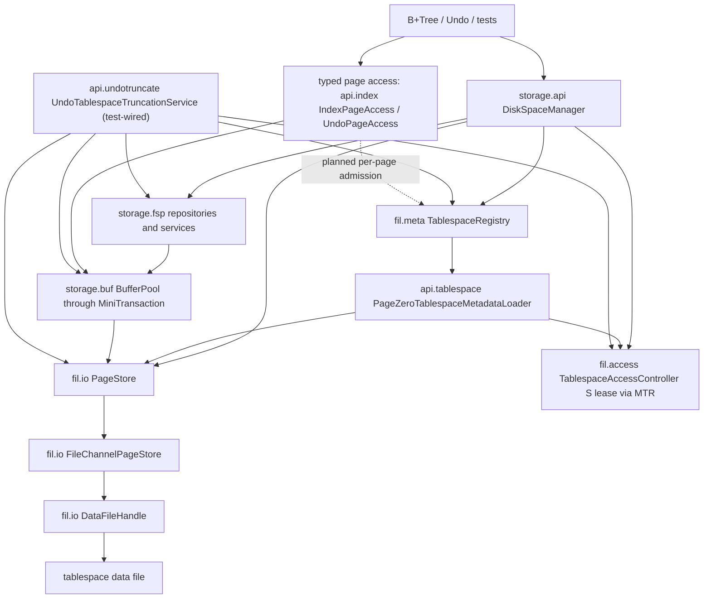
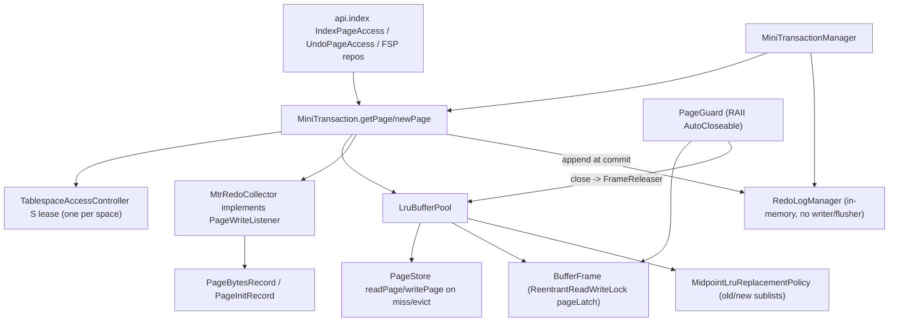
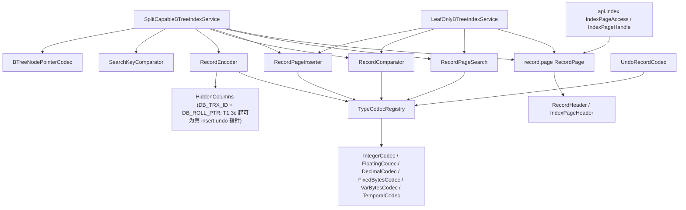
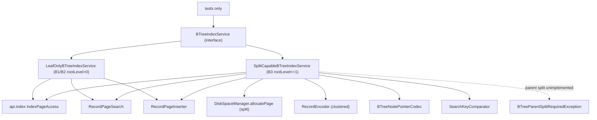
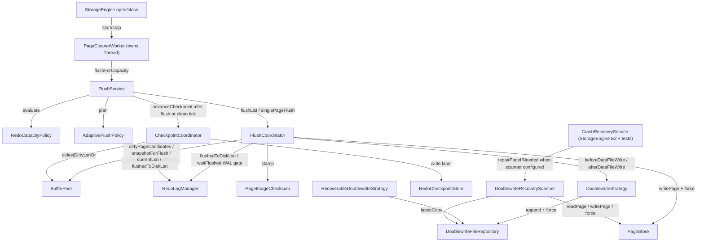
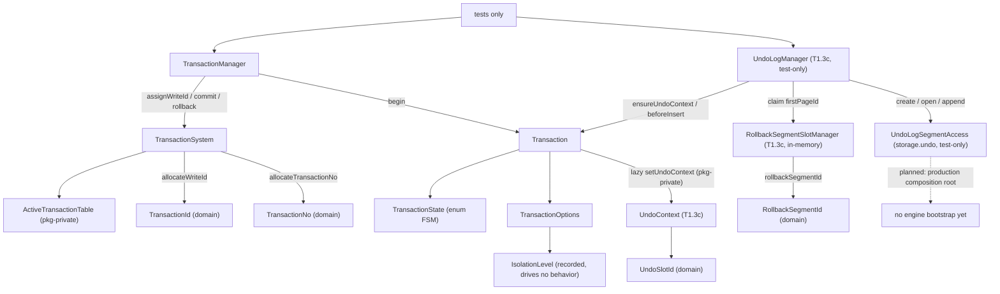
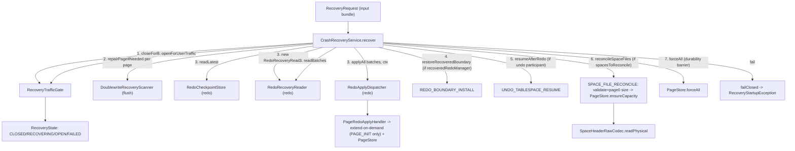
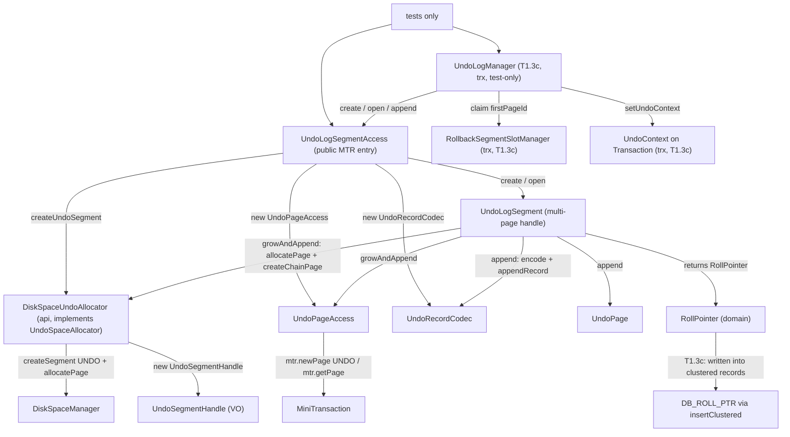

# Current Implementation Map

本文档记录当前生产代码的真实接线和已知缺口。全局设计文档和 `docs/design/diagrams/*.mmd` 表达目标架构；本文件表达当前实现状态。两者不一致时，开发判断当前代码行为以本文件和源码为准，目标演进以对应设计文档为准。

## Maintenance Rules

- 实线只表示当前生产代码已经存在的调用、持有、写入或读写关系。
- 虚线只表示已经决定但尚未闭环的 `planned`、`partial` 或 `unwired` 关系。
- 每个 `unwired` 生产类型都必须写清现状、保留理由和下一步动作。
- 每次实现切片结束后，只更新受影响的小节；只有目标架构变化时才更新全局架构图。
- 本文件不得用未决占位词替代明确判断；如果状态不确定，应写出需要核对的源码入口。

## Storage Disk Manager Slice

### Current Flow



### Current Data Chains

| Flow | Current production chain | Current state |
| --- | --- | --- |
| Create tablespace | `DiskSpaceManager.createTablespace` -> `PageStore.create` -> `DataFileHandle.create`; then `SpaceHeaderRepository.initialize`（含 page0 FSP_HDR 信封盖戳）; UNDO additionally writes `TablespaceLifecycleHeader(ACTIVE,initialSize,epoch=0)`; reserve extent0 and `TablespaceRegistry.replace` | Implemented; GENERAL publishes NORMAL，UNDO publishes/persists ACTIVE；4-arg overload仍默认 GENERAL；page0 现携带统一 FSP_HDR FilePageHeader 信封 |
| Open tablespace | `DiskSpaceManager.openTablespace` -> `PageStore.open`; `TablespaceRegistry.open` -> `api.tablespace.PageZeroTablespaceMetadataLoader` 持 S lease raw 读 page0 (`PageZeroTablespaceMetadataLoader.java:110`) -> FSP_HDR 信封校验(`:111` pageType==FSP_HDR/pageNo==0，否则 `TablespaceCorruptedException`) -> physical/lifecycle codecs | Implemented for already-known path；新 UNDO 恢复持久状态，旧 UNDO 无 lifecycle header 时按 NORMAL 打开但禁止 truncate；checksum/trailer 校验仍 deferred |
| Recovery open | `DiskSpaceManager.openTablespaceForRecovery` -> `PageStore.open` -> `TablespaceRegistry.requireForRecovery` -> page0 loader（同样做 FSP_HDR 信封校验） | Implemented；允许加载 TRUNCATING，供启动恢复续作 |
| Space-management admission | `DiskSpaceManager.createSegment/allocatePage/freePage/dropSegment/usage` -> `MiniTransaction.acquireTablespaceLease(S)` (`MiniTransaction.java:108`) -> `TablespaceRegistry.require`（lease 后复核）-> FSP | Implemented；拒绝 CORRUPTED/INACTIVE/TRUNCATING/DISCARDED，消除状态先检后等待竞态 |
| Allocate page | `DiskSpaceManager.allocatePage` -> `TablespaceRegistry.require` -> `SegmentPageAllocator` -> `SegmentSpaceService` / `FreeExtentService`; on no space, `PageStore.extend` then `SpaceHeaderRepository.setCurrentSizeInPages` and retry | Implemented for current FSP model; registry size snapshot is not updated after autoextend because page0 remains the size authority；autoextend 现 crash-safe：恢复期 `SPACE_FILE_RECONCILE` 经 `PageStore.ensureCapacity` 把物理文件长度重对齐到 redo 恢复出的 page0 大小 |
| Typed INDEX/UNDO access | `api.index.IndexPageAccess` / `UndoPageAccess` -> `MiniTransaction.getPage/newPage` -> 每 SpaceId 一个 S lease -> `BufferPool` -> `PageStore` | Implemented operation lease；typed access 本身仍不查 Registry 状态，完整状态准入依赖上层 facade |
| Dirty page flush | `FlushCoordinator` 持同 space S lease -> snapshot -> WAL gate -> doublewrite -> `PageStore.writePage/force` -> complete | Implemented；与 truncate X 互斥；data-file fsync 未经 `FsyncLock` 节流 |
| UNDO truncate | `UndoTablespaceTruncationService.truncate` (`UndoTablespaceTruncationService.java:105`) -> X lease/校验/marker -> `FlushService.flushThrough` (`FlushService.java:127`) -> `LruBufferPool.invalidateTablespace` (`LruBufferPool.java:320`) -> `DataFileHandle.truncateTo` (`DataFileHandle.java:247`) -> `UndoTablespaceFspRebuilder.rebuild` (`UndoTablespaceFspRebuilder.java:45`) -> final state/Registry publish | Implemented (test-wired)；同 epoch 可故障续作；旧 UNDO/GENERAL/活动 inode 明确拒绝 |
| Redo replay | `RedoApplyDispatcher` -> `PageRedoApplyHandler` -> `PageStore.readPage/writePage` | Implemented physical replay path; recovery discovery is not fully wired to registry |

### Package Status

| Package area | Representative classes | Current state | Notes |
| --- | --- | --- | --- |
| `storage.api` disk facade | `DiskSpaceManager`, `SegmentRef`, `SpaceUsage`, `DiskSpaceUndoAllocator` | Implemented | DiskSpaceManager 管普通 FSP；SegmentRef/SpaceUsage 是门面值对象；undo allocator 是 undo 端口适配器 |
| `storage.api.undotruncate` lifecycle orchestration | `UndoTablespaceTruncationService`, `UndoTablespaceTruncationRecovery` | Implemented; recovery wired by `StorageEngine` E2 | 可恢复 UNDO 物理收缩与 recovery participant；E2 existing open 构造恢复参与者用于 TRUNCATING 续作；主动 truncate 仍待 purge/DML 调度 |
| `storage.api.index` typed index page entry | `IndexPageAccess`, `IndexPageHandle` | Implemented | Bridges B+Tree/record code to `MiniTransaction`-owned page guards |
| `storage.api.tablespace` metadata adapter | `PageZeroTablespaceMetadataLoader` | Implemented | Registry 懒加载协作者；留在 api 侧以避免 `fil` 直接编排 `fsp` page0/lifecycle codec；打开/恢复时先做 page0 FSP_HDR 信封校验(pageType/pageNo)，checksum 校验 deferred |
| `storage.fsp.flst` file-list primitives | `FileAddress`, `Flst`, `FlstBase`, `FlstNode` | Implemented | FSP/XDES/INODE 链表指针与 base/node 编解码；不接触文件 IO |
| `storage.fsp.header` space header | `SpaceHeaderRepository`, `SpaceHeaderSnapshot`, `SpaceHeaderRawCodec`, `SpaceHeaderPhysical` | Implemented | page0 header 读写与 raw metadata 加载；`initialize` 盖 page0 FSP_HDR FilePageHeader 信封头；layout 常量供 extent/lifecycle codec 共享 |
| `storage.fsp.extent` extent management | `ExtentDescriptorRepository`, `ExtentState`, `FreeExtentService`, `ExtentAllocationPolicy` | Implemented | XDES state/owner/bitmap + 全局 FREE/FREE_FRAG/FULL_FRAG 分配；不打开文件 |
| `storage.fsp.segment` segment management | `SegmentInodeRepository`, `SegmentPurpose`, `SegmentSpaceService`, `SegmentPageAllocator` | Implemented | INODE slot、segment extent list、fragment 页和 segment 页分配 |
| `storage.fsp.lifecycle` lifecycle marker | `TablespaceLifecycleHeader`, `TablespaceLifecycleRawCodec` | Implemented | page0 198–237 持久化 UNDO lifecycle marker |
| `storage.fsp.undo` undo rebuild | `UndoTablespaceFspRebuilder` | Implemented | 物理 truncate 后清零并重建 page0/page2/extent0 |
| `storage.fsp.exception` exceptions | `FspMetadataException`, `NoFreeSpaceException` | Implemented | FSP 元数据损坏/空间耗尽领域异常 |
| `storage.fil.io` physical IO | `PageStore`, `FileChannelPageStore`, `DataFileDescriptor`, `DataFileHandle`, `AutoExtendPolicy` | Implemented | State/registry-free；单文件 `truncate`（缩短）与 `ensureCapacity`（幂等扩到至少 N，crash recovery 用），均持 physical Lifecycle->FileSize(X)、零填充/缩短后发布 size；`forceAll` 汇总 force 全部句柄（恢复末尾 durability 屏障） |
| `storage.fil.lock` physical locks | `TablespaceLifecycleLatch`, `FileSizeLock`, `ResourceGuard`, `DataFileHandleLock`, `FsyncLock`, `PageIoRangeLock` | Implemented / partially reserved | lifecycle/file-size 已由 `DataFileHandle` 使用；`DataFileHandleLock`/`FsyncLock`/`PageIoRangeLock` 仍为预留物理锁 |
| `storage.fil.access` operation admission | `TablespaceAccessController`, `TablespaceAccessLease` | Implemented | controller 每 SpaceId 公平显式 RW lease；`StorageEngine` E1/E2 创建单实例并注入 MTR/loader/disk/flush/recovery undo truncate |
| `storage.fil.meta` runtime metadata | `TablespaceRegistry`, `CachingTablespaceRegistry`, `TablespaceMetadata`, `Tablespace`, `TablespaceHandle` | Implemented for runtime admission | registry 保存当前进程打开视图；UNDO lifecycle 持久化，普通 state/discard/corruption 仍仅 runtime |
| `storage.fil.state` type/state values | `TablespaceState`, `TablespaceType`, `TablespaceTypeFlags`, `SpaceFlags` | Implemented | 表空间类型与状态编码值对象；状态转换由 api/engine 层编排 |
| `storage.fil.exception` exceptions | `TablespaceNotFoundException`, `TablespaceUnavailableException`, `DataFilePhysicalException`, `PageOutOfBoundsException` | Implemented | 表空间文件缺失、越界、损坏、不可用等 fil 领域异常 |
| `storage.page` physical envelope | `PageEnvelopeLayout`, `FilePageHeader`, `PageEnvelope`, `PageChecksum`, `PageImageChecksum`, `PageType` | Implemented | Shared header/trailer/checksum helpers over raw page bytes |

## Buffer Pool + MiniTransaction Slice

### Current Flow



### Current Data Chains

| Flow | Current production chain | Current state |
| --- | --- | --- |
| Page fix (INDEX) | `api.index.IndexPageAccess.openIndexPage` -> `MiniTransaction.getPage` -> `LruBufferPool.getPage` -> `acquire` (poolLock: resident hit / 命中 LOADING 出锁等 `PageLoadFuture` / `obtainVictim` 装 LOADING 占位后**出 poolLock** `readAndPublish` 读盘) -> release poolLock -> `pageLatch.lock` -> `new PageGuard` -> `attachWriteListener(MtrRedoCollector)` + `memo.pushPageGuard` (`MiniTransaction.java:103-106`) | Implemented；miss 读盘已移出 poolLock（Phase B：per-frame LOADING + load future，不同页并发读、同页只读一次、有界等待）|
| Page fix (UNDO) | `UndoPageAccess.openUndoPage` -> `MiniTransaction.getPage` (same path); page-type gate rejects non-UNDO pages (`UndoPageAccess.java:79-81`) | Implemented |
| New page (INDEX) | `api.index.IndexPageAccess.createIndexPage` -> `MiniTransaction.newPage` -> `LruBufferPool.newPage` -> `acquire(readFromDisk=false)` -> zero-fill under X latch; MTR `collector.recordInit(pageId, PageType.INDEX)` (`MiniTransaction.java:109`) | Implemented |
| New page (UNDO) | `UndoPageAccess.newUndoEnvelope` -> `MiniTransaction.newPage(...,PageType.UNDO)` (`UndoPageAccess.java:86`) | Implemented |
| MTR commit | `MiniTransaction.commit` -> append redo -> stamp touched pageLSN -> `memo.releaseAll()` LIFO（page guard 先于 tablespace lease）-> 返回 batch end LSN | Implemented；默认 manager 仍为内存 redo；可注入 durable manager 供 truncation/recovery 使用 |
| MTR rollback | `MiniTransaction.rollbackUncommitted` -> `memo.releaseAll()` only (`:167`) | Implemented; dirty pages stay dirty — no buffer-content undo (documented simplification `:18-19`) |
| Dirty page mark | `PageGuard.close` -> `FrameReleaser.release(frame, wrote)` -> `LruBufferPool.release` OR-dirties via `markDirty` under `poolLock`; sets `oldestModificationLsn`/`newestModificationLsn`/bumps `dirtyVersion` | Implemented；**E1 修 bug**：`markDirty` 改用 `oldestModificationLsn==null` 守卫（原 `!dirty`）——newPage 对驻留页重初始化先置 dirty=true（无 LSN），双 newPage 同 MTR（allocatePage+createIndexPage 同根页）后 commit markDirty 会因 dirty 已真而漏设 oldestMod，留 dirty+null oldestMod 帧致 flush/checkpoint NPE。flush-after-双newPage 之前潜伏（既有 btree 测试不 flush 未触发） |
| Eviction | `LruBufferPool.obtainVictim(cleanSkip)` 优先 free/clean 帧直接复用；仅有脏 unfixed 帧时记 PageId、出 `poolLock` 经 `DirtyVictimFlusher.flushVictim`（→`FlushCoordinator.singlePageFlush`：WAL gate+checksum+doublewrite+`completeFlush`）刷干净后回环重选；本轮 `cleanSkip` 防空转，无干净帧抛 `BufferPoolExhaustedException`。无 flusher 退回 legacy `writeBack` | Implemented；注入 flusher（生产 `StorageEngine`）后脏页淘汰 WAL 安全：redo 未 durable→`flushVictim` 返回 false→不写盘；`FAILED`→抛根因不吞。legacy no-flusher 路径字节级不变 |
| Checkpoint feed | `flush.checkpoint.CheckpointCoordinator` -> `bufferPool.oldestDirtyLsnOr(current)` -> `LruBufferPool` scans resident frames under `poolLock` for min `oldestModificationLsn` (`:292-306`) | Implemented; called by tests, `StorageEngine` foreground checkpoint/close path, and E3a background page cleaner tick |
| Tablespace invalidation | `UndoTablespaceTruncationService` 持 X lease -> `LruBufferPool.invalidateTablespace` Condition 等待 fixCount=0 -> dirty 则拒绝 -> 从 resident/LRU 移除该 space 全部 frame | Implemented；fixed 等待有 timeout/interrupt；不隐式绕过 WAL flush |

### Package Status

| Package area | Representative classes | Current state | Notes |
| --- | --- | --- | --- |
| `storage.buf` pool core | `BufferPool`, `LruBufferPool`, `BufferFrame`, `PageGuard`, `PageLatchMode`, `DirtyVictimFlusher`, `BufferFrameState`, `FrameStateMachine`, `PageLoadFuture`, `BufferPoolLoadTimeoutException` | Implemented (production-wired) | sole impl；per-space invalidate + frame release Condition；`DirtyVictimFlusher` 淘汰端口经 WAL 管线；**Phase B**：显式 `FrameStateMachine`(FREE/LOADING/CLEAN/DIRTY/FLUSHING) + miss 读盘移出 poolLock（LOADING 占位 + `PageLoadFuture` 有界等待）+ FLUSHING 与 dirty 正交；DIRTY_PENDING/EVICTING/STALE 态、读写并发期 IO_FIX 细分 deferred |
| `storage.buf` replacement | `ReplacementPolicy`, `MidpointLruReplacementPolicy` | Implemented (production-wired) | Midpoint LRU(old/new 子链)：读入进 old 头、`oldBlocksTime`(注入毫秒时钟) 提升窗 + `youngDistanceThreshold`(young 子链 1/4) 抗抖动 → 抗扫描污染（Phase A 0.8）；sole impl，injection ctor `LruBufferPool(...,ReplacementPolicy)` 供测试注入可控时钟；read-ahead-aware 分类、`oldBlocksPct` 配比再平衡待 0.10 |
| `storage.buf` flush support | `DirtyPageCandidate`, `FlushPageSnapshot`, `BufferPoolExhaustedException` | Implemented | Value objects consumed by flush module；`failFlush` 现 FLUSHING→DIRTY（Phase B，不再 no-op）；`snapshotForFlush` DIRTY→FLUSHING、`completeFlush` 版本符→CLEAN/不符→DIRTY；`FlushCoordinator` WAL-gate skip 路径补 `failFlush` 复位 |
| `storage.buf` write listener | `PageWriteListener` | Implemented | DI seam; only production impl is `MtrRedoCollector`; `NO_OP` path has no production caller |
| `storage.mtr` transaction | `MiniTransaction`, `MiniTransactionManager`, `MiniTransactionState`, `MtrSavepoint` | Implemented (test-wired) | Manager 可注入共享 controller + durable redo；commit 返回 marker end LSN；默认构造仍内存 redo |
| `storage.mtr` memo + collector | `MtrMemo`, `MtrRedoCollector`, `MtrStateException` | Implemented | memo 同时持 page guard 与 per-space lease；LIFO 保证 latch/fix 先释放、lease 最后释放 |

## Record Layer Slice

### Current Flow



### Current Data Chains

| Flow | Current production chain | Current state |
| --- | --- | --- |
| INDEX page record access | `api.index.IndexPageAccess.openIndexPage` -> `new RecordPage(guard, pageSize)` -> `rp.format(...)` / `rp.freeSpace()` / etc. | Implemented; `api.index.IndexPageHandle.recordPage()` also constructs `RecordPage` |
| In-page search | `LeafOnlyBTreeIndexService`/`SplitCapableBTreeIndexService` -> `new RecordPageSearch(registry)` (`:49`/`:72`) -> `search.findEqual/findInsertPosition` -> `RecordCursor` per row | Implemented |
| In-page insert | btree service -> `new RecordPageInserter(registry)` (`:51`/`:73`) -> `inserter.insert` -> `HeapSpaceManager` alloc + `RecordPageDirectory` slot maintenance; `RecordPageOverflowException` triggers btree split | Implemented |
| Clustered record encode | `SplitCapableBTreeIndexService.insertClustered` -> stamps `new HiddenColumns(transactionId, rollPointer)`（T1.3c 起为调用方传入的真 insert undo 指针，非 NULL） (`:105`) -> `RecordEncoder.encode` (`:426`) | Implemented; T1.3c 起 `DB_ROLL_PTR` 可写真 undo 指针（由 `UndoLogManager.beforeInsert` 返回）；未接 undo 的路径仍传 `RollPointer.NULL` |
| Undo record codec | `UndoRecordCodec` -> `TypeCodecRegistry.codecFor` per column -> `FieldWriter`/`FieldSlice` self-framing payload；UPDATE_ROW **和** DELETE_MARK 追加全量旧 image（旧隐藏列 + 全列）尾部 | Implemented (INSERT_ROW + UPDATE_ROW + DELETE_MARK，T1.3f)；DELETE_MARK 复用 UPDATE 旧 image 结构（不存 old delete flag=阶段差异）；INSERT golden bytes 钉死；type 首字节权威 |
| Record decode | `RecordFieldResolver` -> `TypeCodecRegistry` -> per-column `FieldSlice`/`ColumnValue`; reached via `RecordCursor` (btree scan/lookup) | Implemented; standalone `RecordDecoder` has no production caller (test-only) |

### Package Status

| Package area | Representative classes | Current state | Notes |
| --- | --- | --- | --- |
| `record.schema` | `TableSchema`, `ColumnType`, `IndexKeyDef`, `ColumnDef`, `KeyPartDef`, `KeyOrder`, `TypeId` | Implemented | Foundational immutable value objects; consumed by btree + undo; 13 `TypeId` (TINYINT…DATETIME); `CharsetId` UTF8-only, `CollationId` BINARY-only |
| `record.type` | `TypeCodecRegistry`, `TypeCodec`, `ColumnValue`, `FieldSlice`, `FieldWriter`, `IntegerCodec`/`FloatingCodec`/`DecimalCodec`/`FixedBytesCodec`/`VarBytesCodec`/`TemporalCodec` | Implemented (subset) | Order-preserving codecs; `new TypeCodecRegistry()` only in tests (no production bootstrap); `UnsupportedColumnTypeException` declared but unreachable (exhaustive switch) |
| `record.format` | `RecordEncoder`, `RecordFieldResolver`, `LogicalRecord`, `RecordHeader`, `RecordType`, `HiddenColumns`, `HiddenColumnLayout`, `NullBitmap`, `VarLenDirectory` | Partial | Inline-only format (`MAX_RECORD_LENGTH=65535`, no overflow chain); `RecordDecoder` is test-only; `RecordHeaderLayout` is simplified 8-byte fixed (not InnoDB-binary-compatible); T1.3c 起 `HiddenColumns.dbRollPtr` 可写真 undo 指针（不再恒 `RollPointer.NULL`） |
| `record.page` | `RecordPage`, `RecordPageSearch`, `RecordPageInserter`, `RecordCursor`, `RecordComparator`, `IndexPageHeader`, `RecordRef`, `SearchKey`, `RecordPageDirectory`, `HeapSpaceManager` | Partial | Insert/search/cursor/comparator wired into btree+api; T1.3d 起 `RecordPageDeleter`/`RecordPagePurger` 经 `SplitCapableBTreeIndexService.deleteClustered` 接入 rollback（不再 test-only）；`RecordPageReorganizer`/`RecordPageUpdater` + `UpdateResult`/`UpdateOutcome` 仍 test-only（no production caller）；no split/merge in record layer (overflow signal only) |

## B+Tree Layer Slice

### Current Flow



### Current Data Chains

| Flow | Current production chain | Current state |
| --- | --- | --- |
| Point lookup | `BTreeIndexService.lookup` -> `openRoot` S-latch -> level 0 `search.findEqual` -> `RecordCursor` -> `materialize` `BTreeLookupResult` | Implemented (both services); SplitCapable also handles level-1 `chooseChild` routing (`:124-127`) |
| Bounded scan | `SplitCapableBTreeIndexService.scan` (`:145`) -> `openRoot` S -> level 1 `chooseChild` -> sibling loop via `fileHeader().nextPageNo()` (`FIL_NULL` termination `:170`) -> `scanLeafPage` per page | Implemented in SplitCapable; LeafOnly inherits interface default -> single-page `scanLeaf` (`BTreeIndexService.java:40-42`) |
| Insert (no split) | `insert` -> `openRoot` X-latch -> unique check `search.findEqual` -> `inserter.insert` | Implemented (both services); `RecordPageOverflowException` -> `BTreeSplitRequiredException` (LeafOnly `:127`) or split (SplitCapable) |
| Root-leaf split | `SplitCapableBTreeIndexService.splitRootLeaf` (`:222`) -> `materializeLeafRecords` + `sortedWithInserted` + `splitRows` -> `disk.allocatePage` x2 (`:228,230`) -> `pageAccess.createIndexPage` x2 (`:229,231`) -> `writeSiblingLinks` -> `insertAll` x2 -> `root.format(indexId,1)` -> `insertRootPointer` x2 (`:247-248`) -> returns `BTreeInsertResult(split=true)` | Implemented; root page reused, content rewritten to level-1 |
| Level-1 leaf split | `SplitCapableBTreeIndexService.splitLevelOneLeaf` (`:256`) -> `ensureRootHasRoomForPointer` **first** (`:266`, throws `BTreeParentSplitRequiredException` `:428` if no room) -> `disk.allocatePage` (`:268`) -> `createIndexPage` (`:269`) -> sibling link surgery -> `insertAll` x2 -> `insertRootPointer` (`:286`) | Implemented; parent split NOT implemented — `BTreeParentSplitRequiredException` thrown before any leaf rewrite |
| Clustered insert | `SplitCapableBTreeIndexService.insertClustered(mtr, index, record, transactionId, rollPointer)` (`:91`) -> stamps `new HiddenColumns(transactionId, rollPointer)`（T1.3c 起调用方传入真 insert undo 指针，替换恒 NULL） -> delegates `insert` (`:106`) | Implemented; `DB_ROLL_PTR` 由上层 orchestration（`assignWriteId → UndoLogManager.beforeInsert → insertClustered`）传入；不 import trx/undo |
| Clustered delete (T1.3d) | `SplitCapableBTreeIndexService.deleteClustered(mtr, index, key, expectedTrxId, expectedRollPtr)` -> 导航 leaf (level 0/1, X) -> `deleteInLeaf`：`search.findEqual` -> 所有权校验 `RecordCursor.dbTrxId()/dbRollPtr()` 匹配 -> 未标记 `deleter.deleteMark` 后 `purger.purge`，已标记直接 `purge` -> `BTreeDeleteResult(removed)` | Implemented (test-wired via `RollbackService`); 幂等（未命中/不匹配=no-op）；不 import trx/undo（收 SearchKey + domain 值对象）；无 merge/空页回收 |
| Clustered replace (T1.3e) | `SplitCapableBTreeIndexService.replaceClustered(mtr, index, key, newRecordWithHidden, expectedTrxId, expectedRollPtr)` -> 导航 leaf (X) -> `replaceInLeaf`：`findEqual` -> 所有权校验 -> `updater.update` 整记录替换；REQUIRES_REINSERT(改 PK)→`BTreeUnsupportedStructureException` -> `BTreeUpdateResult(replaced)` | Implemented; 前向 UPDATE 与 rollback 恢复共用；前向 orchestration（`lookup→beforeUpdate→replaceClustered`）test-wired，rollback 恢复经 `RollbackService`(src/main)；幂等；不 import trx/undo |
| Clustered delete-mark (T1.3f) | `SplitCapableBTreeIndexService.setClusteredDeleteMark(mtr, index, key, deleted, newHidden, expectedTrxId, expectedRollPtr)` -> 导航 leaf (X) -> `markInLeaf` plan-then-execute：`findEqual`(含已标记)→所有权校验→翻转合法校验→`RecordPage.setDeleted`+`RecordPage.writeHiddenColumns`(两步纯写) -> `BTreeDeleteMarkResult(changed)`；`lookupIncludingDeleted` 不过滤 delete-marked | Implemented; 前向删除(true)与 rollback 取消标记(false)共用；幂等(所有权不符=false)、非法翻转抛；不 import trx/undo；物理移除归 purge |

### Package Status

| Package area | Representative classes | Current state | Notes |
| --- | --- | --- | --- |
| `storage.btree` facade | `BTreeIndexService` (interface), `BTreeIndex` (descriptor record), `BTreeLookupResult`, `BTreeInsertResult`, `BTreeScanRange` | Implemented (test-wired) | `import cn.zhangyis.db.storage.btree.*` has **zero** production matches; entire package only constructed in tests |
| `storage.btree` leaf-only | `LeafOnlyBTreeIndexService` | Implemented (test-wired) | B1/B2 rootLevel=0 only; point lookup + in-page scan + insert-no-split; `new`'d only at `LeafOnlyBTreeIndexServiceTest` |
| `storage.btree` split-capable | `SplitCapableBTreeIndexService`, `BTreeNodePointer`, `BTreeNodePointerCodec`, `BTreeNodePointerSchema`, `SearchKeyComparator` | Implemented (test-wired) | B3 root-leaf split + level-1 routing + leaf split + sibling scan + clustered insert; `new`'d only at `SplitCapableBTreeIndexServiceTest`/`ClusteredInsertTest` |
| `storage.btree` exceptions | `BTreeException` + 6 subclasses | Implemented | `BTreeDuplicateKeyException` (physical unique check), `BTreeSplitRequiredException`, `BTreeParentSplitRequiredException` (parent split unimplemented), `BTreeRootChangedException` (snapshot lag guard), `BTreeStructureCorruptedException`, `BTreeUnsupportedStructureException` |

## Redo Log Layer Slice

### Current Flow

```mermaid
flowchart TD
  MtrCommit["MiniTransaction.commit"] -->|append records| Mgr["RedoLogManager"]
  MgrMgr["MiniTransactionManager"] -->|owns new RedoLogManager| Mgr
  Mgr -->|memory mode: no writer/flusher| Buffer["in-memory buffer + batches"]
  Mgr -->|durable() factory: StorageEngine + tests| Writer["RedoLogWriter"]
  Writer -.-> Repo["RedoLogFileRepository.append"]
  Mgr -->|flush(): StorageEngine checkpoint/close + recovery/truncate + tests| Flusher["RedoLogFlusher"]
  Flusher -.-> Repo
  Repo -.-> File["redo data file"]
  Collector["MtrRedoCollector"] -->|onWrite| PBR["PageBytesRecord"]
  Collector -->|recordInit| PIR["PageInitRecord"]
  FlushCoord["FlushCoordinator"] -->|flushedToDiskLsn / waitFlushed WAL gate| Mgr
  Checkpoint["CheckpointCoordinator"] -->|currentLsn / flushedToDiskLsn| Mgr
  Recovery["CrashRecoveryService (StorageEngine E2 + tests)"] --> Reader["RedoRecoveryReader"]
  Reader --> Repo
  Recovery --> Dispatcher["RedoApplyDispatcher"]
  Dispatcher --> Handler["PageRedoApplyHandler"]
  Handler -->|readPage / writePage| PageStore["PageStore"]
  Checkpoint -->|write label| CkptStore["RedoCheckpointStore"]
```

### Current Data Chains

| Flow | Current production chain | Current state |
| --- | --- | --- |
| Redo collect (MTR) | `MtrRedoCollector.onWrite` -> `new PageBytesRecord(pageId, offset, bytes)` (`:32`); `MtrRedoCollector.recordInit` -> `new PageInitRecord(pageId, pageType)` (`:41`) | Implemented; only 2 record types: `PAGE_INIT`, `PAGE_BYTES` |
| Redo append (MTR commit) | `MiniTransaction.commit` -> `redoLogManager.append(collector.records())` (`MiniTransaction.java:154`) -> allocates `[start,end)` LSN interval, accumulates in-memory `buffer`/`batches`; if `writer != null` enqueues `pendingBatches` (`RedoLogManager.java:96`) | Implemented; default no-arg manager remains memory-mode, while `StorageEngine` injects durable redo |
| Durable write | `RedoLogManager.flush()` -> writer append -> repository force -> 单调推进 durable LSN | Implemented；`StorageEngine.checkpoint/close` 与 `UndoTablespaceTruncationService` 主动驱动；默认 test helpers 仍可用 memory mode |
| WAL gate (flush module) | `FlushCoordinator.flushPage` -> `redo.flushedToDiskLsn()` (`FlushCoordinator.java:91`) + `redo.waitFlushed(pageLsn, timeout)` (`:92`) | Implemented；`StorageEngine` durable redo 路径可通过 WAL gate；memory-mode 组合中 durable LSN 恒 0，会跳过脏页 |
| Checkpoint read | `flush.checkpoint.CheckpointCoordinator.advanceCheckpoint` -> `redo.currentLsn()` + `redo.flushedToDiskLsn()`; if `checkpointStore != null` -> `RedoCheckpointStore.write(RedoCheckpointLabel.of(...))` | Implemented；`StorageEngine` 和 tests 构造 checkpoint coordinator；checkpoint store 由 `StorageEngine`/tests 打开 |
| Redo replay (recovery) | `StorageEngine.open(existing)` -> recovery-open system UNDO + configured data spaces -> `CrashRecoveryService.recover` -> checkpoint-aware replay -> `RedoLogManager.restoreRecoveredBoundary(recoveredTo)` -> optional `UndoTablespaceRecoveryParticipant.resumeAfterRedo(recoveredTo)` -> `SPACE_FILE_RECONCILE` -> open traffic | Implemented production path for explicitly configured spaces；恢复边界安装后新 redo 从 recoveredTo 连续追加，durable LSN 不倒退；无 DD/tablespace discovery |
| Capacity pressure | `StorageEngine.open` starts `PageCleanerWorker` (when enabled) -> periodic `FlushService.flushForCapacity` -> `RedoCapacityPolicy.evaluate(redo.currentLsn(), checkpointLsn)` -> `RedoCapacityDecision(pressure, age, targetLsn)` | Implemented production path；`StorageEngine` 注入 fixed policy并启动单线程 page cleaner；当前仍不 throttle append；**后台 redo flush 已由 `RedoFlushWorker` 接**（独立于 page cleaner，见下） |
| Background redo flush | `StorageEngine.open` starts `RedoFlushWorker` (when `backgroundFlushEnabled`) -> periodic/on-demand `RedoFlushTarget.flush()` (-> `RedoLogManagerFlushTarget` -> `RedoLogManager.flush()`) -> 推进 `flushedToDiskLsn` + 唤醒 `waitFlushed` | Implemented production path；空转跳过（`currentLsn<=flushedToDiskLsn` 不 fsync）；失败即 FAILED；engine 在 page cleaner 前启动、close 时先停（停 page cleaner→停 redo flusher→final flushThrough）；解淘汰/flush WAL gate 因无人 flush 而跳过的根因 |

### Package Status

| Package area | Representative classes | Current state | Notes |
| --- | --- | --- | --- |
| `storage.redo` core | `RedoLogManager`, batches/ranges/physical records | Partial | 默认 manager 为 memory mode；`StorageEngine`/truncation 测试组合注入 durable manager；支持 recovery boundary 恢复与连续续写 |
| `storage.redo` durable IO | `RedoLogWriter`, `RedoLogFlusher`, `RedoLogFileRepository` | Implemented | `StorageEngine` 和 tests 打开 append-only redo file；no rotation/recycling; frame = magic + payloadLen + crc32 + payload |
| `storage.redo` checkpoint | `RedoCheckpointStore`, `RedoCheckpointLabel` | Implemented | Two-slot fuzzy checkpoint with CRC32；`StorageEngine` 和 tests 打开；`flush.checkpoint.CheckpointCoordinator` 写入 |
| `storage.redo` recovery | `RedoRecoveryReader`, `RedoApplyDispatcher`, `RedoApplyContext`, `PageRedoApplyHandler` | Implemented; production-wired by `StorageEngine` E2 | `StorageEngine.open(existing)` constructs `pageDispatcher` + `RedoApplyContext(PageStore,pageSize)`；single-handler dispatch (only `PageRedoApplyHandler`)；只恢复已打开/显式配置的表空间 |
| `storage.redo` capacity | `RedoCapacityPolicy`, `RedoCapacityPressure`, `RedoCapacityDecision` | Implemented | `StorageEngine` 和 tests 使用 fixed capacity；4 pressure levels NONE/ASYNC_FLUSH/SYNC_FLUSH/HARD_LIMIT; consumed by `FlushService` |
| `storage.redo` background flush | `RedoFlushWorker`, `RedoFlushWorkerState`, `RedoFlushTarget`, `RedoLogManagerFlushTarget` | Implemented; production-wired by `StorageEngine` | 单 daemon 线程周期/on-demand 驱动 `redo.flush()`，空转跳过、失败即 FAILED；worker 依赖 `RedoFlushTarget` 端口（生产用 `RedoLogManagerFlushTarget` 适配，便于测试注入 fake）；不改 `RedoLogManager` 锁结构 |
| `storage.redo` exceptions | `RedoLogIoException` (runtime), `RedoLogCorruptedException` (fatal) | Implemented | `RedoLogCorruptedException` extends `DatabaseFatalException`; thrown by repo/reader/handler on corruption |

## Flush + Doublewrite + Checkpoint Slice

### Current Flow



### Current Data Chains

| Flow | Current production chain | Current state |
| --- | --- | --- |
| Capacity-driven flush | `StorageEngine.open` -> `new PageCleanerWorker(flushService, queue, interval, maxPages)` -> `start()`；worker idle timeout 或显式 request -> `FlushService.flushForCapacity` -> `RedoCapacityPolicy.evaluate(redo.currentLsn(), checkpointLsn)` -> `AdaptiveFlushPolicy.plan(decision,maxPages)` -> if pressure: `FlushCoordinator.flushList` -> per page WAL gate/doublewrite/data file -> checkpoint；if no pressure and dirty view empty: checkpoint-only tick | Implemented production path (E3a)；`StorageEngine.close` 先 `PageCleanerWorker.stop(timeout)` 再 final `flushThrough`；无 purge driver、无 supervisor 重启、无后台 redo flusher |
| Single page flush | `FlushCoordinator.flushPage` 持 space S lease -> snapshot -> WAL gate -> checksum/doublewrite -> data write+force -> complete | Implemented foreground path；与 truncate X lease 互斥；WAL gate 仍逐页同步 |
| Tablespace drain | `FlushService.drainTablespace(spaceId, duration)` (`:84`) -> loop `bufferPool.dirtyPageCandidates(MAX, capacity)` filtered by spaceId -> per page `FlushCoordinator.singlePageFlush` (`:109`) -> `advanceCheckpoint()` (`:111`); `LockSupport.parkNanos(1ms)` backoff on no progress (`:113`) | Implemented code; no production caller; busy-waits with parkNanos (no condition wake-up from BufferPool) |
| Lifecycle flush barrier | `FlushService.flushThrough(marker,timeout)` -> redo flush -> 刷出所有 space 中 oldest<=marker 的 dirty page -> `flush.checkpoint.CheckpointCoordinator.advanceCheckpoint` 直到 checkpoint>=marker | Implemented；truncate 和 `StorageEngine.close/checkpoint` 在物理关闭/缩短前强制调用 |
| Checkpoint advance | `flush.checkpoint.CheckpointCoordinator.advanceCheckpoint` -> `computeSafeCheckpointLsn` = `min(bufferPool.oldestDirtyLsnOr(current), redo.currentLsn(), redo.flushedToDiskLsn())` -> if safe > last: if `checkpointStore != null` -> `checkpointStore.write(RedoCheckpointLabel.of(safe, redo.currentLsn(), now))`, then publish `lastCheckpointLsn = safe` | Implemented code; called by `FlushService` from tests, `StorageEngine` foreground lifecycle, and E3a periodic page cleaner tick；"closed LSN" approximated by `currentLsn()` |
| Doublewrite write | `flush.doublewrite.RecoverableDoublewriteStrategy.beforeDataFileWrite` -> `repository.append(snapshot)` -> `repository.force()` = `channel.force(true)` | Implemented; full-copy fsync'd before data file write; no slot reclamation (`afterDataFileWrite` is no-op); doublewrite file grows unbounded |
| Doublewrite repair | recovery participant 先修显式配置 UNDO page0/读 marker；普通 scanner 对 pageNo>= 当前文件大小的越界页跳过（交 redo 重建）、对 TRUNCATING space 的 pageNo>=target 跳过；其余 checksum-invalid 页从 doublewrite copy 修复 | **Implemented production path（0.2）**：`StorageEngine` E2 配 `DoublewriteRecoveryScanner` + `DoublewriteFileRepository.pageIds()`（**过滤到恢复已打开空间**：系统 undo + `recoveryTablespaces`，避免 scanner 读未打开空间），真正修复 torn data/undo 页；未打开空间的 torn 页留待该空间打开/discovery |

### Package Status

| Package area | Representative classes | Current state | Notes |
| --- | --- | --- | --- |
| `storage.flush` facade/coordinator | `FlushService`, `FlushCoordinator`, `FlushCycleResult`, `FlushResult`, `FlushResultStatus`, `TablespaceDrainResult`, `CoordinatedDirtyVictimFlusher` | Implemented | Ties redo capacity -> flush -> checkpoint；`StorageEngine` 构造 foreground barrier + E3a background page cleaner path；`CoordinatedDirtyVictimFlusher` 适配 buf 淘汰端口到 `singlePageFlush`（CLEAN→true/skip→false/FAILED→抛），`StorageEngine` 注入 pool |
| `storage.flush.policy` adaptive policy | `AdaptiveFlushPolicy`, `FlushAdvice` | Implemented | Maps redo capacity pressure to flush batch advice；`StorageEngine` 注入 fixed policy |
| `storage.flush.checkpoint` checkpoint | `CheckpointCoordinator` | Implemented | Fuzzy checkpoint = min(oldestDirty, current, flushed); optional `RedoCheckpointStore` persistence；`StorageEngine` 注入 checkpoint store |
| `storage.flush.doublewrite` doublewrite | `DoublewriteStrategy`, `RecoverableDoublewriteStrategy`, `NoDoublewriteStrategy`, `DoublewriteFileRepository`(+`pageIds()`), `DoublewriteRecoveryScanner`, `DoublewriteMode` | Implemented; **recoverable 模式 production-wired（0.2）** | `StorageEngine` 注入 `RecoverableDoublewriteStrategy`（前向，每次 flush 前写整页副本+fsync）+ E2 配 scanner + `DoublewriteFileRepository.pageIds()`（恢复待检查页来源）；`NoDoublewriteStrategy` 仅测试用；slot 回收（append-only unbounded，0.5）/`DETECT_ONLY`/全空间 discovery deferred |
| `storage.flush.cleaner` page cleaner | `PageCleanerWorker`, `PageCleanerState`, `PageCleanerStoppedException` | Implemented; production-wired by `StorageEngine` E3a | Single daemon `Thread` "minimysql-page-cleaner"；bounded explicit queue + periodic idle tick；failure is terminal；no supervisor restart |
| `storage.flush` exceptions | `FlushWriteException`, `FlushBarrierTimeoutException` | Implemented | Root flush exceptions shared by coordinator/doublewrite/cleaner/barrier |

## Transaction Layer Slice

### Current Flow



### Current Data Chains

| Flow | Current production chain | Current state |
| --- | --- | --- |
| Begin | `TransactionManager.begin(options)` (`:34`) -> `new Transaction(options, now)` state `ACTIVE`; **no id allocation** (lazy) | Implemented; `StorageEngine` constructs `TransactionManager`，但普通 SQL/session DML 入口尚未接 |
| Assign write id | `TransactionManager.assignWriteId(txn)` (`:45`) -> requires `ACTIVE`, rejects read-only -> `system.allocateWriteId()` (`:53`) -> `txn.setTransactionId` (`:54`); idempotent if already set | Implemented (test-only); `allocateWriteId` -> `active.register(id)` (`TransactionSystem.java:33`) |
| Commit | `TransactionManager.commit(txn)` -> `ACTIVE -> COMMITTING` -> if id != NONE: `allocateTransactionNo` + `setTransactionNo` + `removeActive` -> `COMMITTING -> COMMITTED`。slot 回收由编排另调 `UndoLogManager.onCommit(txn)`（释放 insert undo slot，T1.3d）；`commit()` public 行为不变（不自动调 onCommit） | Implemented; `onCommit` 在 engine 注入 `mtrManager/headerRepo` 时持久写 undo first 页 `STATE_COMMITTED + COMMIT_NO`，纯 insert 同 MTR 清 page3 slot；含 update/delete 入 history，普通 SQL/session commit facade 尚未接 |
| Rollback (consume undo, T1.3d) | `RollbackService.rollback(txn, clusteredIndex)` -> `txnMgr.beginRollback`（ACTIVE→ROLLING_BACK）-> 若有 `UndoContext`：从 `ctx.lastRollPointer` 反向走链，每条独立 MTR（`undoAccess.open(SHARED)` + `readRecord` + `applyUndoRecord`→INSERT_ROW 调 `deleteClustered` + `commit`）-> `slotManager.release(ctx.slotId)` -> `txnMgr.finishRollback`（removeActive + →ROLLED_BACK）-> `RollbackSummary(applied)` | Implemented (test-only); `new RollbackService` = 0 prod；trx→btree 新边；单条失败回滚当前 MTR 并传播、停 ROLLING_BACK 可重试；纯状态 `TransactionManager.rollback()` 仍供只读/未写事务 |
| Undo write (INSERT) | `UndoLogManager.beforeInsert(txn,mtr,tableId,indexId,clusterKey,keyDef,schema)` (`UndoLogManager.java:94`) -> require ACTIVE + non-NONE txnId -> `ensureUndoContext` (`:137`): 首写 `access.create` (`:143`) + `slotManager.claim(firstPageId)` (`:145`) + `new UndoContext(rseg,slot,firstPageId)` + `txn.setUndoContext`; 续写 `access.open(firstPageId, EXCLUSIVE)` (`:140`) -> `UndoNo.of(ctx.lastUndoNo+1)` -> `new UndoRecord(INSERT_ROW, undoNo, txnId, tableId, indexId, clusterKey, ctx.lastRollPointer)` -> `seg.append` (`:116`) -> `ctx.setLastUndoNo/setLastRollPointer` (`:119-120`) -> return insert `RollPointer` | Implemented; `StorageEngine` constructs `UndoLogManager` with durable MTR/header repo，but DML orchestration is still test-driven；undo append 与聚簇写同 MTR（WAL 同 redo batch，§7.2）；MTR rollback 不撤销页内容 → 失败插入留 orphan undo，由 `RollbackService` full rollback / recovery rollback 幂等清理 |
| Slot claim | `RollbackSegmentSlotManager.claim(firstPageId)` -> `ReentrantLock` 串行扫空 slot -> 登记 `slots[i]`、`activeCount++` -> `UndoSlotId.of(i)`；无空槽抛 `UndoSlotExhaustedException` | Implemented；**0.3**：`UndoLogManager.ensureUndoContext` 认领后**同一 MTR** 经 `RollbackSegmentHeaderRepository.writeSlot` 持久到 undo page3（redo 保护，crash-safe）——engine 注入 headerRepo 时生效，纯内存 fixture 不持久 |
| Slot release (T1.3d) | `RollbackSegmentSlotManager.release(slot)` -> 锁内校验已占用 -> `slots[idx]=null`、`activeCount--`（first-fit 可重认领）；由 `UndoLogManager.onCommit` / `RollbackService` / `PurgeCoordinator` 调用 | Implemented；**0.3**：纯 insert 事务 `onCommit` 释放在短 MTR 内清空 page3 槽（**提交后才释放内存**，engine 路径）；`RollbackService`/`PurgeCoordinator` 释放**暂未持久**——slot 重用时 page3 被覆盖、R 1.2 读 undo 状态判 active/committed，无正确性问题，留后续 |
| ReadView 创建 (T1.4) | `ReadViewManager.openReadView(txn)` -> 按隔离级别 RR 缓存到 `Transaction.readView` / RC 新建 / RU·SERIALIZABLE 抛 -> `TransactionSystem.openReadViewSnapshot(txn)`（锁内：可写事务分配 creator id + 原子捕获 {activeIds, nextId, **nextTransactionNo→`ReadView.lowLimitNo`**} 建 `ReadView` 并**登记 live 集合**，purge 用） | Implemented (test-only); commit/finishRollback 调 `release` 清 RR 缓存并注销 live view；RC 经 `ReadViewManager.closeReadView` 语句末注销（purge 边界用，T-purge） |
| Purge boundary + 单线程聚簇 purge (T-purge) | `TransactionSystem.purgeLowWaterNo()`=min(live ReadView lowLimitNo)/无则 nextTransactionNo -> `PurgeCoordinator.runBatch(maxLogs)`：排空 insert-reclaim（`dropUndoSegment`）→ `HistoryList.peekCommitted` FIFO 取 `transactionNo<boundary`（≥即停）→ 只读 MTR `UndoLogSegment.forEachRecordWithPointer` 收集 DELETE_MARK(key,地址) → 每条独立 index MTR `SplitCapableBTreeIndexService.purgeDeleteMarkedClustered`（严格：仍 delete-marked+隐藏列匹配才物理移除）→ 全成功 `dropUndoSegment`+`release` slot+`pollCommitted` | Implemented; `StorageEngine` 配 `clusteredIndex` 时生产启动 `PurgeDriverWorker` 周期调用；`onCommit` 入 history，R 1.3 恢复期从 COMMITTED undo header 重建 history；latch 纪律先 undo 后 index；per-entry 原子（硬失败保留队首停批） |
| Consistent read (MVCC, T1.4) | `MvccReader.read(readView, index, key)` -> MTR-1 `btree.lookup` 物化当前版本并提交（释放 index latch）-> 循环 `ReadView.isVisible(trxId)`：可见即重建 `LogicalRecord` 返回；否则 rollPtr NULL/insert→empty，UPDATE→独立 MTR `undoAccess.readRecordByRollPointer` 读 undo→校验 type/key→沿 `oldHidden.dbRollPtr` 构造上一版本（visited+maxVersionHops 防环） | Implemented; `StorageEngine` production-held，session/executor 尚未调用；任一时刻不同持 index+undo latch（§17） |

### Package Status

| Package area | Representative classes | Current state | Notes |
| --- | --- | --- | --- |
| `storage.trx` facade | `TransactionManager`, `UndoLogManager`, `RollbackService`, `ReadViewManager`, `MvccReader`, `PurgeCoordinator`, `HistoryList`, `PurgeSummary` | Implemented; production-held by `StorageEngine` | 生命周期门面（+`begin/finishRollback` 两阶段 T1.3d；拥有 `ReadViewManager`、commit/finishRollback 调 `release` T1.4）+ undo 写门面（`onCommit` 入 history/insert-reclaim，R 1.3 写 `COMMIT_NO`）+ rollback 执行器 + ReadView 门面 + MVCC 一致性读 + 单线程 purge 协调器；普通 SQL/session DML facade 尚未接 |
| `storage.trx` system | `TransactionSystem`, `ActiveTransactionTable` | Implemented; production-held by `StorageEngine` | Monotonic trx-id/trx-no allocation + `TreeSet<Long>` active table; `ReentrantLock`; T1.4 加 `openReadViewSnapshot(txn)`；R 1.3 加 `restoreCounters(nextId,nextNo)`，恢复期只前进不回退，使 purge boundary 覆盖重建 history |
| `storage.trx` aggregate | `Transaction`, `TransactionState`, `TransactionOptions`, `IsolationLevel`, `UndoContext`, `ReadView` | Implemented; DML use still test-driven | 5-state FSM；T1.3c 惰性 `UndoContext`；T1.4 增 `Transaction.readView` 字段 + `ReadView` 五规则；`IsolationLevel` 驱动 RR/RC ReadView 生命周期（RU/SERIALIZABLE 拒绝） |
| `storage.trx` undo context | `UndoContext` | Implemented; DML use still test-driven | T1.3c 事务 undo 子状态（设计 §5.3 简化版）：`rollbackSegmentId`/`slotId`/`insertUndoFirstPageId`/`lastUndoNo`/`lastRollPointer`；`updateUndoLogId`/`savepointStack`/`modifiedTables` 留 T1.3d+；包内 setter 仅 `UndoLogManager` 调 |
| `storage.trx` rseg slot | `RollbackSegmentSlotManager`, `UndoSlotExhaustedException` | Implemented | 内存 rseg slot 目录：固定单一默认 `RollbackSegmentId`，`ReentrantLock` 串行认领 + `release`；**0.3 加 `restore`**（恢复扫 page3 按下标重建）；claim/release 经 `UndoLogManager` 持久到 page3 rseg header（engine 路径），fixture 仍纯内存 |
| `storage.trx` exception | `TransactionStateException`, `UndoSlotExhaustedException` | Implemented (test-only) | Both extend `DatabaseRuntimeException`; `TransactionStateException` thrown by `TransactionManager`/`Transaction`/`UndoLogManager.beforeInsert` on illegal state / non-ACTIVE / NONE txn id |

## Recovery Layer Slice

### Current Flow



### Current Data Chains

| Flow | Current production chain | Current state |
| --- | --- | --- |
| Recovery orchestration | `StorageEngine.open(existing)` -> `DiskSpaceManager.openTablespaceForRecovery(undo + EngineConfig.recoveryTablespaces)` -> `CrashRecoveryService.recover(request)` -> `gate.closeForRecovery()` -> doublewrite stage -> checkpoint read -> `RedoRecoveryReader.readBatches` -> `dispatcher.applyAll` -> `RedoLogManager.restoreRecoveredBoundary(recoveredTo)` -> `UndoTablespaceTruncationRecovery.resumeAfterRedo` -> `SPACE_FILE_RECONCILE` -> `PageStore.forceAll` -> `gate.openForUserTraffic` -> `StorageEngine.restoreRollbackSegmentSlots` -> `recoverRollbackSegmentTransactions`（ACTIVE 回滚；COMMITTED 按 `COMMIT_NO` 重建 history + `TransactionSystem.restoreCounters`）-> background redo/page/purge workers -> publish OPEN | Implemented production path; **7 formal enum stages**: `TRAFFIC_CLOSED -> DOUBLEWRITE_REPAIR -> REDO_REPLAY -> [REDO_BOUNDARY_INSTALL] -> [UNDO_TABLESPACE_RESUME] -> [SPACE_FILE_RECONCILE] -> OPEN_TRAFFIC`（E2 engine 请求固定带后三个条件阶段）；forceAll 在开放流量前落盘恢复写；事务 rollback / purge resume 目前是 engine 后恢复步，非正式 stage；DDL_RECOVERY 未接 |
| Space file reconcile (autoextend crash-safety) | undo resume 后若 `spacesToReconcile()` 非空：`reconcileSpaceFiles` 逐空间 `PageStore.readPage(page0)` -> `SpaceHeaderRawCodec.readPhysical` -> `validateReconcileHeader`（spaceId/pageSize 一致、size>0、偏移不溢出，否则 `TablespaceCorruptedException`）-> 幂等 `PageStore.ensureCapacity`；replay 期 `PageRedoApplyHandler` 仅对 PAGE_INIT extend-on-demand，首触越界 PAGE_BYTES 判 `RedoLogCorruptedException` | Implemented; `StorageEngine` E2 对系统 UNDO + 显式配置数据表空间执行；只恢复物理文件长度，不重建 FSP bitmap；弥补 autoExtend 不 fsync 在崩溃后留下的"物理短于 page0 逻辑"背离 |
| Failure path | any `DatabaseRuntimeException` (`:75`) or `RuntimeException` (`:78`) -> `failClosed(mode, e)` (`:134`) -> `gate.failClosed(error)` (`:135`) -> state `FAILED` (`:136`) -> FAILED `RecoveryReport` with zeroed LSNs/counts (`:138-139`) -> throw `RecoveryStartupException` (`:77`/`:80`) | Implemented; gate stays closed on failure; `RecoveryStartupException` extends `DatabaseFatalException` |

### Package Status

| Package area | Representative classes | Current state | Notes |
| --- | --- | --- | --- |
| `storage.recovery` facade | `CrashRecoveryService`, `RecoveryTrafficGate`, `RecoveryState` | Implemented; production-wired by `StorageEngine` E2 | `StorageEngine.open(existing)` constructs service/gate and exposes `recoveryState()`/`lastRecoveryReport()`；session/storage API 仍未查询 gate |
| `storage.recovery` request/report | `RecoveryRequest`, `RecoveryReport`, `RecoveryMode`, `RecoveryStageName` | Implemented; production-wired by `StorageEngine` E2 | `StorageEngine` builds NORMAL request with redo repo/checkpoint/dispatcher/context/recovered manager/undo participant/reconcile spaces + **doublewrite scanner + `dwRepo.pageIds()`（过滤到恢复已打开空间）（0.2）** |
| `storage.recovery` exception | `RecoveryStartupException` | Implemented | Extends `DatabaseFatalException`; thrown by `CrashRecoveryService` on fail-closed |

## Undo Log Layer Slice

### Current Flow



### Current Data Chains

| Flow | Current production chain | Current state |
| --- | --- | --- |
| Undo segment create | `UndoLogSegmentAccess.create(mtr, spaceId, txnId)` (`:59`) -> `allocator.createUndoSegment(mtr, spaceId)` -> `DiskSpaceUndoAllocator.createUndoSegment` -> `diskSpaceManager.createSegment(mtr, space, SegmentPurpose.UNDO)` (`:39`) + `diskSpaceManager.allocatePage(mtr, ref)` (`:40`) -> `new UndoSegmentHandle(...)` (`:41`) -> `pageAccess.createFirstPage(mtr, firstPageId, UndoLogKind.INSERT, txnId, handle)` (`:64`) -> `new UndoLogSegment(..., EXCLUSIVE)` (`:65`) | Implemented (test-only); T1.3c 起 `DiskSpaceUndoAllocator` 被 `UndoLogManager` 经 `UndoSpaceAllocator` 端口调用（仍 test-wired，无 SQL/session 生产组合根） |
| Undo append | `UndoLogSegment.append(rec, keyDef, schema)` (`:109`) -> `codec.encode(rec, keyDef, schema)` (`:116`) -> `current.appendRecord(payload, undoNo)` (`:119`); on `UndoPageOverflowException` -> `growAndAppend` (`:121`) -> `firstPage.setLogRecordCount(+1)` (`:123`) + `firstPage.setLogLastUndoNo(undoNo)` -> `new RollPointer(true, current.pageId().pageNo(), off)` (`:125`) | Implemented (test-only); only `INSERT_ROW` type encoded; T1.3c 起 `RollPointer` 经 `UndoLogManager.beforeInsert` 返回并写入聚簇 `DB_ROLL_PTR`（不再恒 NULL） |
| Undo chain growth | `UndoLogSegment.growAndAppend` (`:139`) -> preflight against fresh-page capacity -> `allocator.allocatePage(mtr, space, inodeSlot, segmentId)` (`:146`) -> `pageAccess.createChainPage(mtr, newId, handle)` (`:147`) -> `current.linkNextTo(newPage)` + `newPage.linkPrevTo(current)` -> `firstPage.setLastPageNo(newId.pageNo())` (`:150`) -> `handle.withLastPage(newId)` (`:151`) -> retry `appendRecord` on new page (`:154`) | Implemented (test-only); `ALLOCATED->UNDO` double-newPage pattern reuses D3/D4 physical redo (no new redo type) |
| Undo page create | `UndoPageAccess.createFirstPage`/`createChainPage` -> `newUndoEnvelope(mtr, pageId)` -> `mtr.newPage(pool, pageId, EXCLUSIVE, PageType.UNDO)` (`:86`) + `PageEnvelope.writeHeader` (`:87-88`) -> `UndoPage.formatFirstPage`/`formatChainPage` writes page/log header bytes via `guard.writeX` | Implemented; all writes enter MTR redo as `PAGE_BYTES`; `pageLSN` stamped by MTR at commit |
| Undo page open | `UndoPageAccess.openUndoPage(mtr, pageId, mode)` -> `mtr.getPage(pool, pageId, mode)` (`:77`); page-type gate rejects non-UNDO pages (`:79-81`) | Implemented |
| Undo record read | `UndoLogSegment.readRecord(rp, keyDef, schema)` (`:161`) -> `resolvePage(rp.pageNo())` -> `pageAccess.openUndoPage(SHARED)` (`:237`) -> `codec.decode(page.recordAt(off), keyDef, schema)` | Implemented (test-only); `forEachRecord` walks FIL NEXT chain (`:179-200`); T1.3c `UndoLogManagerTest` reload 路径经 `access.open(firstPageId, SHARED)` + `readRecord(rp)` 读回 |
| Transaction undo write (T1.3c) | `UndoLogManager.beforeInsert` (`UndoLogManager.java:94`) -> `ensureUndoContext` (`:137`) -> `access.create` (`:143`) + `slotManager.claim` (`:145`) + `new UndoContext` + `txn.setUndoContext`; 续写 `access.open` (`:140`) -> `seg.append(INSERT_ROW record, prevRollPointer=ctx.lastRollPointer)` (`:116`) -> `ctx.setLastUndoNo/lastRollPointer` (`:119-120`) -> return `RollPointer` | Implemented (test-only); 见 Transaction Layer Slice；失败插入留 orphan undo（MTR rollback 不撤销页内容，已知缺口，留 T1.3d+） |
| Single-page undo (T1.3a) | `UndoLog.append(page, rec, keyDef, schema)` -> `codec.encode` -> `page.appendRecord` -> `new RollPointer` (`UndoLog.java:29-35`) | Implemented (test-only); superseded by `UndoLogSegment` for multi-page; only `UndoLogStoreTest` uses it |

### Package Status

| Package area | Representative classes | Current state | Notes |
| --- | --- | --- | --- |
| `storage.undo` access | `UndoLogSegmentAccess`, `UndoLogSegment`, `UndoLog`, `UndoSegmentHandle`, `UndoSpaceAllocator` (port) | Implemented; production-held by `StorageEngine` | `UndoLogSegmentAccess` is public MTR entry：`UndoLogManager` 经它 create/open/append；T1.4 加 `readRecordByRollPointer`（按 roll pointer 跨段直读单条 undo + 槽边界/insert 位/indexId 校验），供 `MvccReader` 构造旧版本；**R 1.2/1.3 加 `UndoLogSegment.markCommitted`/`state`/`isActive`/`isCommitted`/`committedTransactionNo`**（commit 写 `STATE_COMMITTED + COMMIT_NO`，恢复判 active/committed 并按提交序重建 history）；`UndoSpaceAllocator` port inverts undo->api; `UndoLogSegmentAccess` 现由 `StorageEngine` 生产持有（恢复读 state/回滚/history 重建） |
| `storage.undo` page | `UndoPageAccess`, `UndoPage`, `UndoPageLayout` | Implemented | `UndoPageAccess` centralizes `PageType.UNDO` envelope writes; `UndoPageLayout` pkg-private constants (record area start=105 after R 1.3 `COMMIT_NO`); `UndoPage` pkg-private ctor (only `UndoPageAccess` creates) |
| `storage.undo` rseg header | `RollbackSegmentHeaderRepository`, `RollbackSegmentHeaderLayout`, `RollbackSegmentHeaderSnapshot` | Implemented; production-wired by `StorageEngine`（0.3） | undo 表空间固定 **page3** slot 目录 `format`/`writeSlot`/`read`（redo 保护，`PageType.RSEG_HEADER`）；engine fresh format、slot claim/release 持久、恢复扫描共用；§6.3 history/cached·free segment/lastTransactionNo 富字段留后续；truncate rebuild 重格式化 page3 deferred |
| `storage.undo` record | `UndoRecord`, `UndoRecordCodec`, `UndoRecordType`, `UndoLogKind` | Partial | `INSERT_ROW`(T1.3a) + `UPDATE_ROW`(T1.3e) + `DELETE_MARK`(T1.3f) 全部编解码（UPDATE/DELETE 带全量旧 image：旧隐藏列+全列；DELETE 不存 old delete flag=阶段差异）；`UndoRecord` 类型判别(insert()/update()/deleteMark() 工厂，old* 可空性校验)；混合段段头 `UndoLogKind` 非权威、记录 type 字节权威；codec self-framing |
| `storage.undo` exceptions | `UndoPageOverflowException`, `UndoLogFormatException` | Implemented | `UndoPageOverflowException` thrown pre-mutation (MTR rollback leaves no half-written page); `UndoLogFormatException` for physical corruption |
| `storage.api` undo adapter | `DiskSpaceUndoAllocator` | Implemented (test-only) | Implements `UndoSpaceAllocator`; delegates to `DiskSpaceManager.createSegment(UNDO)`/`allocatePage`; T1.3c 起被 `UndoLogManager`（test-only）调用，仍无生产组合根 |

## Domain + Common Slice

### Package Status

| Package area | Representative classes | Current state | Notes |
| --- | --- | --- | --- |
| `domain` page locator | `PageId` `(SpaceId, PageNo)`, `SpaceId` `(int)`, `PageNo` `(long)`, `PageSize` `(int)` | Implemented | Immutable records; `PageId.offset(PageSize)` for positional IO; `PageSize.extentSizeBytes()`/`pagesPerExtent()`; consumed by api/buf/fil/fsp/flush/btree/redo |
| `domain` segment/extent | `SegmentId` `(long)`, `ExtentId` `(SpaceId, long)` | Implemented | `ExtentId.from(PageId, PageSize)`/`firstPageNo(PageSize)`; consumed by api (`DiskSpaceManager`/`DiskSpaceUndoAllocator`/`SegmentRef`), fsp |
| `domain` LSN | `Lsn` `(long)` | Implemented | Redo LSN; WAL/pageLSN/checkpoint boundary; consumed by buf/flush/mtr/redo/recovery |
| `domain` transaction | `TransactionId` `(long)` `NONE=0`, `TransactionNo` `(long)` `NONE=0` | Implemented | `TransactionId` = DB_TRX_ID writer id (consumed by trx/record.format/record.page/btree/undo); `TransactionNo` = commit sequence (consumed by trx only — purge/history not yet implemented) |
| `domain` undo pointer | `RollPointer` `(boolean insert, PageNo, int offset)` 7B codec, `NULL`, `UndoNo` `(long)` `NONE=0`, `RollbackSegmentId` `(int)`, `UndoSlotId` `(int)` (T1.3c) | Implemented | `RollPointer` = DB_ROLL_PTR (consumed by record.format/record.page/btree/undo); T1.3c 起聚簇 `DB_ROLL_PTR` 可写真 insert undo 指针（`UndoLogManager.beforeInsert` 返回）；`RollbackSegmentId`/`UndoSlotId` = T1.3c rseg/slot 定位（consumed by trx `UndoContext`/`RollbackSegmentSlotManager`，不进 `RollPointer` 编码）；`UndoNo` = per-txn undo sequence (consumed by undo + trx `UndoContext`) |
| `common.exception` | `DatabaseRuntimeException` (root), `DatabaseFatalException` (fatal), `DatabaseValidationException` (validation) | Implemented | Project exception hierarchy root; 27 module exceptions extend `DatabaseRuntimeException`, 3 extend `DatabaseFatalException` (`RedoLogCorruptedException`, `DataFileCorruptedException`, `RecoveryStartupException`); `DatabaseValidationException` replaces `IllegalArgumentException` across all packages |
| `common.logging` | `ColoredLevelConverter` | Implemented | Logback ANSI color converter: ERROR red, WARN yellow (`:25-30`) |
| `common` | `package-info` | Implemented | Only package-info; clock/config/util interfaces not yet added |

## Reserved / Unwired Production Types

> 以下类型存在于生产源码中，但尚未完全闭环、无直接生产调用，或只有部分能力接线。按 AGENTS.md 要求，每个必须写清现状、保留理由和下一步动作。

### fil.lock 层未接线锁

| Type | Current caller | Why it exists | Next action |
| --- | --- | --- | --- |
| `DataFileHandleLock` | None | Planned lock for handle replacement, mmap, preallocation, or recovery re-open | Remove unless the next file-handle replacement slice wires it |
| `PageIoRangeLock` | None | Optional page-range lock for truncate boundaries, write coalescing, or fault injection | Remove unless a concrete range-lock feature wires it |
| `FsyncLock` | None | Planned data-file fsync throttle | Wire into `DataFileHandle.force` or remove; `PageStore.force` already exists |

### api / lifecycle 无生产组合根

| Type | Current caller | Why it exists | Next action |
| --- | --- | --- | --- |
| `UndoTablespaceTruncationService` / `UndoTablespaceTruncationRecovery` | `StorageEngine.open(existing)` 构造 recovery participant；tests；主动 truncate 仍无 purge 调用方 | 可由未来 purge 调用的 crash-safe UNDO 物理收缩与启动续作 | 已在 engine recovery bootstrap 共享 controller/redo/flush/registry 并注入；purge 片接主动 truncate 调用方 |

### buf + mtr 层部分预留类型

| Type | Current caller | Why it exists | Next action |
| --- | --- | --- | --- |
| `BufferPool.flush(PageId)` / `flushAll()` | Tests only (`flushAll` called by `LruBufferPool.close()` in tests) | Legacy synchronous flush path; flush module uses snapshot/callback API instead | Either remove or wire as fallback flush |
| `BufferPool.failFlush` | `FlushCoordinator` | Production caller exists through `StorageEngine`; impl body is documented no-op | Add FLUSHING intermediate state when flush coordinator is fully stress-tested |
| `MtrMemo.push(AutoCloseable)` | None | Generic non-page resource push; all production code uses `pushPageGuard` | Use for non-page latch/fix reservations if needed |

### record 层 test-only 算子

| Type | Current caller | Why it exists | Next action |
| --- | --- | --- | --- |
| `RecordDecoder` | Tests only (3 test classes) | Standalone decoder; production decode path goes through `RecordFieldResolver` via `RecordCursor` | Wire into a read/scan path, or fold into `RecordFieldResolver` if redundant |
| `RecordPageDeleter` | `SplitCapableBTreeIndexService.deleteClustered` (T1.3d, test-wired) + tests | In-page delete-mark operator | rollback 已用；MVCC delete-mark 写路径留 T1.3e+ |
| `RecordPagePurger` | `SplitCapableBTreeIndexService.deleteClustered` (T1.3d, test-wired) + tests | In-page purge: physically remove delete-marked record + dir/group fixup | rollback 已用（删未提交插入）；后台 purge coordinator 留 purge 片 |
| `RecordPageReorganizer` | Tests only | In-page dense rewrite + GarbageList reclaim + dir/n_owned rebuild | Wire from B+Tree split/reclaim path or page-compaction admin op |
| `RecordPageUpdater` | `SplitCapableBTreeIndexService.replaceClustered` (T1.3e, test-wired via `RollbackService`) + tests | In-page update: in-place / move / reinsert-required | UPDATE 写 + rollback 恢复已用；改聚簇 PK(REQUIRES_REINSERT) 抛 unsupported |
| `UpdateResult` / `UpdateOutcome` | `RecordPageUpdater` (via `replaceClustered`, T1.3e) + tests | Update result value objects | live；REQUIRES_REINSERT → `BTreeUnsupportedStructureException` |
| `UnsupportedColumnTypeException` | None (never thrown) | `TypeCodecRegistry.codecFor` switch is exhaustive over `TypeId` | Reserved for future extensible type dispatch |

### btree 层整包无生产引用

| Type | Current caller | Why it exists | Next action |
| --- | --- | --- | --- |
| `BTreeIndexService` (interface) + `LeafOnlyBTreeIndexService` + `SplitCapableBTreeIndexService` | Tests only | `import cn.zhangyis.db.storage.btree.*` = 0 production matches; entire package is a test-wired island | Wire from executor/DD once SQL layer needs index access |
| `BTreeNodePointer` / `BTreeNodePointerCodec` / `BTreeNodePointerSchema` / `SearchKeyComparator` | Tests only (only `SplitCapableBTreeIndexService` uses them) | Non-leaf node-pointer model + in-memory key comparator for split sort | Goes live when SplitCapable is wired upward |

### redo 层持久化/恢复/容量路径

| Type | Current caller | Why it exists | Next action |
| --- | --- | --- | --- |
| `RedoLogWriter` / `RedoLogFlusher` / `RedoLogFileRepository` | `StorageEngine` + tests | Durable redo write/flush/file IO | Add redo recycling/rotation and true background redo writer/flusher |
| `RedoCheckpointStore` / `RedoCheckpointLabel` | `StorageEngine` + tests | Fuzzy checkpoint control file | Add redo recycling integration and richer checkpoint diagnostics |
| `RedoRecoveryReader` / `RedoApplyDispatcher` / `RedoApplyContext` / `PageRedoApplyHandler` | `StorageEngine.open(existing)` + tests | Redo replay path for configured/opened tablespaces | Add tablespace discovery and more redo handlers as formats expand |
| `RedoCapacityPolicy` / `RedoCapacityPressure` / `RedoCapacityDecision` | `StorageEngine` + tests | Redo capacity pressure evaluation | Add append throttle / wait policy and config-driven thresholds |

### flush 层部分未接线能力

| Type | Current caller | Why it exists | Next action |
| --- | --- | --- | --- |
| `FlushService` / `FlushCoordinator` / `flush.checkpoint.CheckpointCoordinator` | `StorageEngine` composition root + `PageCleanerWorker` + `UndoTablespaceTruncationService` + tests | Flush facade + per-page WAL/doublewrite executor + checkpoint/lifecycle barrier | Add metrics/backoff policy and unify legacy `BufferPool.flush` path |
| `flush.doublewrite.NoDoublewriteStrategy` | Tests only（生产已改用 recoverable） | OFF 模式占位 / 不想要 doublewrite 开销的定向测试 | 引入 `DoublewriteMode` 配置开关时作为 OFF 实现；否则保留为测试桩 |
| `flush.policy.AdaptiveFlushPolicy` | `StorageEngine` + tests | Maps `RedoCapacityDecision` -> `FlushAdvice` | Replace fixed policy with config-driven adaptive policy |

### trx 层整包无生产引用

| Type | Current caller | Why it exists | Next action |
| --- | --- | --- | --- |
| `TransactionManager` / `TransactionSystem` / `Transaction` / `TransactionState` / `TransactionOptions` / `IsolationLevel` / `ActiveTransactionTable` / `TransactionStateException` | `StorageEngine` production-held; DML still test-driven | In-memory transaction lifecycle + active table + state FSM; `TransactionSystem.restoreCounters` now used by recovery to advance id/no high water | Wire from session/executor once SQL layer begins transactions; LockManager/current-read/prepared states remain future work |
| `UndoLogManager` / `UndoContext` / `RollbackSegmentSlotManager` / `UndoSlotExhaustedException` (T1.3c) / `RollbackService` / `RollbackSummary` (T1.3d) | `StorageEngine` production-held; DML writes still test-driven | 事务 undo 写门面（+`onCommit` 入 history/insert-reclaim，T-purge）+ 事务 undo 子状态 + rseg slot 目录（+`release`+`restore`）+ rollback 执行器；engine recovery scans page3 and uses `RollbackService.rollbackRecovered` for ACTIVE slots | Wire from session/executor DML facade；slot claim/onCommit-release 持久到 page3；`RollbackService`/`PurgeCoordinator` release 持久化仍 deferred |
| `PurgeCoordinator`(impl `PurgeTarget`) / `PurgeDriverWorker` / `PurgeDriverWorkerState` / `HistoryList` / `HistoryEntry` / `InsertReclaimEntry` / `PurgeSummary` | **0.4 production-wired by `StorageEngine`（配置 `clusteredIndex` 时）；R 1.3 recovery rebuilds committed history** | 单线程 purge 协调器 + **后台 purge driver**（单 daemon 线程周期/on-demand `runBatch`，失败即 FAILED）+ 内存 history list；按 `purgeLowWaterNo` 回收 delete-marked 聚簇记录 + `dropUndoSegment`；恢复期从 COMMITTED undo header 重建 `HistoryEntry` 并按 `COMMIT_NO` FIFO 入队 | 多 worker + 二级索引 purge + formal `RESUME_PURGE` stage / DD-driven multi-index recovery 留后续片 |

### recovery 层已由 Engine E2 接入

| Type | Current caller | Why it exists | Next action |
| --- | --- | --- | --- |
| `CrashRecoveryService` / recovery request/report/gate + `UndoTablespaceRecoveryParticipant` | `StorageEngine.open(existing)` + tests；engine exposes `recoveryState()` / `lastRecoveryReport()` | doublewrite stage -> redo -> undo tablespace resume -> space-file reconcile -> traffic open 编排 | Session/storage API 查询 gate；接入 doublewrite scanner、tablespace discovery、UNDO_ROLLBACK/PURGE_RESUME/DDL_RECOVERY |

### undo 层整包无生产引用

| Type | Current caller | Why it exists | Next action |
| --- | --- | --- | --- |
| `DiskSpaceUndoAllocator` | `UndoLogManager` (test-only, T1.3c) + tests | Adapter implementing `UndoSpaceAllocator` port; bridges undo -> `DiskSpaceManager` | T1.3c 已被 `UndoLogManager` 经端口调用；待生产组合根接线 |
| `UndoLogSegmentAccess` / `UndoLogSegment` / `UndoLog` / `UndoPageAccess` / `UndoPage` / `UndoRecord` / `UndoRecordCodec` / `UndoSegmentHandle` / `UndoSpaceAllocator` | `UndoLogManager` (T1.3c/e: beforeInsert/beforeUpdate) + `RollbackService` (T1.3d/e) (both test-only) + tests | Multi-page undo log segment (T1.3b) + single-page predecessor (T1.3a) + record codec(INSERT+UPDATE) + page layout | `UndoLogManager` 接 create/open/append；`RollbackService` 接 `open(SHARED)`+`readRecord` 反向走链应用 INSERT/UPDATE undo；MVCC 旧版本读留 T1.4 |
| `UndoRecordType.DELETE_MARK` | `UndoRecord.deleteMark`/codec/`beforeDelete`/`RollbackService`/`MvccReader` (T1.3f, test-wired) | Undo record type for delete-mark | 已实现：写+rollback+MVCC 可见性；物理移除归 purge 片 |
| `UndoLogKind.UPDATE` / `TEMPORARY` | None (reserved enum constants) | Undo log kinds for update/temporary logs | Implement in future undo slices |

## Known Implementation Gaps

### 全局架构缺口

| Gap | Current consequence | Preferred resolution |
| --- | --- | --- |
| 生产组合根 E1/E2/E3a/R 1.3 已接线；DML/完整恢复待接 | **engine bootstrap**：`StorageEngine`(+`EngineConfig`/`EngineTablespaceConfig`/`EngineState`/`EngineStateException`) 组合根已接线 buf+mtr(durable redo)+disk+trx+undo(HistoryList)+btree+flush/checkpoint+recovery+page cleaner/redo flusher/purge driver，共享单一 `TablespaceAccessController` 与 registry；`open()` fresh 建系统 undo 表空间，existing 对系统 UNDO + 显式 `recoveryTablespaces` 执行 `CrashRecoveryService.recover`（redo replay、redo boundary install、UNDO tablespace resume、SPACE_FILE_RECONCILE），随后扫描 page3：ACTIVE rollback，COMMITTED history rebuild + counter restore；按配置启动后台 workers。`StorageEngine` 本身仍仅 tests 构造（无 main/launcher）。**剩余**：E4 DML facade、DD/tablespace discovery、多索引 recovery、formal UNDO_ROLLBACK/PURGE_RESUME/DDL stages | 按 E4/完整 recovery 继续；无 DD discovery，恢复/rollback/purge resume 仍依赖显式配置的表空间和单聚簇索引 |
| 后台 redo flush 已接；commit durable policy / 拆锁 / recent tracker 仍缺 | `RedoFlushWorker`（`StorageEngine` 启动）周期/on-demand 驱动 `redo.flush()`，`flushedToDiskLsn` 自动前进，淘汰/flush 的 WAL gate 不再因无人 flush 而长时间跳过；**但** `MiniTransaction.commit` 仍不等 durable（无 `FLUSH_ON_COMMIT`），`RedoLogManager` 的 append 与 fsync 仍同一 `lock` 串行（未拆 LSN 分配锁 vs write/flush 锁、无 recent_written/recent_closed tracker），checkpoint 仍用 `currentLsn()` 近似 `closedLsn` | commit durable policy（`FLUSH_ON_COMMIT`/等待）；拆锁 + recent_written/recent_closed tracker；closedLsn 修复（独立片）|
| recovery 启动入口只覆盖显式配置表空间 | `StorageEngine.open(existing)` 已构造并调用 `CrashRecoveryService.recover`，但只能恢复系统 UNDO 和 `EngineConfig.recoveryTablespaces`，没有 data dictionary/tablespace discovery（doublewrite scanner/pages 已由 engine 配置，0.2，但页列表来自 doublewrite 文件枚举 + 过滤到已打开空间，非全空间 discovery）| 接 data dictionary / tablespace discovery 替代显式空间集与 doublewrite 页过滤 |
| `RecoveryTrafficGate` 只有 engine 状态查询 | `StorageEngine.recoveryState()` / `lastRecoveryReport()` 可查询启动恢复结果；session/storage API 尚未在每个入口查询 gate | 在 storage facade 或 session 入口添加 gate 查询 |

### Disk Manager 缺口

| Gap | Current consequence | Preferred resolution |
| --- | --- | --- |
| Global `architecture.mmd` shows `PageStore --> TablespaceRegistry` | Misleading if read as current wiring | Treat global graph as target architecture; current implementation uses `PageStore` registry-free |
| Typed page access has lease but no Registry state check | `api.index.IndexPageAccess`/`UndoPageAccess` 经 MTR 持 S lease，可与 truncate X 互斥；若上层绕过 facade，仍不会拒绝稳定 INACTIVE | 在生产 storage facade 统一执行 lease 后 Registry 复核；PageStore 继续 state-free |
| 普通 lifecycle state 仍为 runtime-only | UNDO ACTIVE/INACTIVE/TRUNCATING 已进 page0；`markCorrupted/discard` 和普通 GENERAL 状态重启仍丢失 | 后续普通 tablespace lifecycle/discard 持久化切片补齐 |
| page0 FSP_HDR 信封已校验，checksum/trailer 仍未校验 | `SpaceHeaderRepository.initialize` 盖 page0 FSP_HDR 信封；`PageZeroTablespaceMetadataLoader` 打开/恢复时校验 `pageType==FSP_HDR` + `pageNo==0`（不符抛 `TablespaceCorruptedException`）。但 raw 直读不校验 checksum——写回/淘汰路径未盖 `PageImageChecksum`（只有 `FlushCoordinator` 盖），合法 page0 的 checksum 仍为 0，现在校验会误判损坏 | 待写盘统一盖 checksum（或 page0 读经校验路径）后，单独接入 checksum/trailer 校验 |
| Registry type for existing 4-arg create defaults to GENERAL | Existing undo test harnesses that call 4-arg `createTablespace` register as GENERAL even when segment purpose is UNDO | Switch undo harnesses or undo allocator setup to typed `TablespaceType.UNDO` when that semantic distinction becomes required |
| Data-file fsync throttle is absent | Concurrent `PageStore.force` calls only share `TablespaceLifecycleLatch(S)` | Implement `FsyncLock` if concurrent data-file fsync becomes a tested behavior |

### Buffer Pool + MTR 缺口

| Gap | Current consequence | Preferred resolution |
| --- | --- | --- |
| miss 读盘已移出 `poolLock`（Phase B 0.9 已落） | per-frame LOADING 占位 + `PageLoadFuture` 有界等待：不同页 miss 并发读、同页只读一次、读失败清占位、命中 LOADING 超时/中断不悬挂；脏 victim 刷盘亦在锁外；仅帧表/LRU/state 短临界区在锁内。**剩余**：legacy `flush`/`flushAll` 仍持锁直写（test/close-only）；读写并发期更细的 IO_FIX/EVICTING 态、多 instance 分片未做 | legacy flush 路径统一/移除；按需细分 IO 状态、多 pool instance 分片（0.10） |
| MTR rollback 不撤销 buffer 内容 | `rollbackUncommitted` 只 `releaseAll`，脏页保持脏（documented `:18-19`） | 依赖 redo/recovery 切片做内容撤销 |
| 无跨页 latch 顺序强制 | `MiniTransaction` 禁止同页 S->X 升级但无一般升序 pageId latch 排序 | 在 `MtrMemo`/`MiniTransaction` 添加一般 latch 排序策略 |
| 脏页淘汰 WAL gate 已闭合（生产侧）| 注入 `DirtyVictimFlusher` 后脏 victim 经 WAL gate+checksum+doublewrite 刷盘，绝不在 `poolLock` 内直写；legacy `flushAll`/无 flusher 独立测试池仍直接 `writeBack`（test/close-only，不承诺 WAL 安全）| recoverable doublewrite（0.2）+ 后台 redo flusher（0.1）已接，淘汰现获真 torn-page 防护；剩余统一/移除 legacy `flushAll` 直写路径 |
| 替换策略 = midpoint LRU（Phase A 0.8 已落） | `MidpointLruReplacementPolicy`：old/new 双子链 + `oldBlocksTime` 提升窗 + `youngDistanceThreshold` 抗抖动，已抗一次性大扫描污染（`largeScanDoesNotEvictHotWorkingSet` 验证）；仍缺 read-ahead-aware 访问型分类、`oldBlocksPct` 容量配比再平衡 | 随 0.10 read-ahead 补访问型分类与配比再平衡 |

### Record 缺口

| Gap | Current consequence | Preferred resolution |
| --- | --- | --- |
| 类型子集：仅 13 `TypeId` | 无 TIME/TIMESTAMP/YEAR/TEXT/BLOB/ENUM/SET/JSON/bitstring | 扩展 `TypeId` + 对应 `TypeCodec` |
| 仅 BINARY collation / UTF8 charset | 无大小写不敏感 / weight-based collation；无其他 charset | 扩展 `CollationStrategy` / `CharsetId` |
| 无 overflow chain | 记录内联上限 65535，超长直接抛 `RecordTooLargeException` | 实现 BLOB/overflow page 指针机制 |
| Delete/Purge/Reorganize/Update 算子无生产调用 | trx/MVCC/purge 未接入 record 层 | 在 trx 层落地后接入 |
| `DB_ROLL_PTR` 写真指针 + rollback 消费 + 版本链结构已建（T1.3c/d/e） | T1.3c insert 指针；T1.3d rollback 删；T1.3e `replaceClustered` 写真 update 指针、UPDATE undo 存全量旧 image，**记录版本链结构已建**（`DB_ROLL_PTR`→update undo→`oldHidden.dbRollPtr`）；但无 ReadView 遍历、无 delete-mark undo | T1.4 ReadView+`buildPreviousVersion` 读版本链；T1.3f delete-mark undo |
| 索引页头缺 `PAGE_MAX_TRX_ID` / `PAGE_BTR_SEG_LEAF` / `PAGE_BTR_TOP` | MVCC 可见性 / B+Tree segment 指针不支持 | 在 MVCC / B+Tree segment 切片补充 |
| 无 prefix index | `KeyPartDef.prefixBytes > 0` 被 `RecordComparator` 忽略 | 实现 prefix index 比较逻辑 |

### B+Tree 缺口

| Gap | Current consequence | Preferred resolution |
| --- | --- | --- |
| 无 delete / merge | 接口只有 `lookup`/`scan`/`insert` | 添加 delete + merge API |
| 无 parent split | `ensureRootHasRoomForPointer` 抛 `BTreeParentSplitRequiredException` | 实现 parent split 以支持 >1 层树 |
| 树高上限 1 | `rootLevel > 1` 被拒绝 | 实现 parent split 后解除 |
| 无事务锁等待 / MVCC 可见性 | btree 不做可见性判断 | 在 trx/MVCC 切片接入 |
| 唯一检查仅物理 | delete-marked key 被视为重复 | 接入 MVCC 可见性后做逻辑唯一检查 |
| `nonLeafSegment` 未用于分配 | root split 复用同页重写 | 在 parent split 切片启用 non-leaf segment 分配 |

### Redo 缺口

| Gap | Current consequence | Preferred resolution |
| --- | --- | --- |
| 仅 2 种 redo 记录类型 | 只有 `PAGE_INIT`/`PAGE_BYTES`，无 MLOG 逻辑 redo | 按需添加逻辑 redo 类型 |
| `append` 被 `flush` 的 fsync 串行 | 同一 `lock` 下 append 和 fsync 互斥（documented `:18-20`）；后台 flusher（`RedoFlushWorker`）已接但仍走该单 `lock`，故不恶化也不解此串行 | 拆分 LSN 分配锁与 write/flush 锁（recent_written/recent_closed tracker）使 append 不被 fsync 阻塞 |
| 无 redo 文件轮转/回收 | 单 append-only 文件无上限 | 添加 rotation/recycling/capacity reclaim |
| `RedoApplyDispatcher` 单 handler | 只注册 `PageRedoApplyHandler` | 按需添加多 handler dispatch table |

### Flush 缺口

| Gap | Current consequence | Preferred resolution |
| --- | --- | --- |
| 无 doublewrite slot 回收 | `afterDataFileWrite` 是 no-op，doublewrite 文件无界增长 | 添加 slot reclamation / truncate |
| `drainTablespace` busy-wait | `LockSupport.parkNanos(1ms)` 无 condition wake-up | 添加 BufferPool 条件变量唤醒 |
| `DoublewriteMode.DETECT_ONLY` 缺失 | 只有 `OFF` / `DETECT_AND_RECOVER` | 按需添加 detect-only 模式 |
| `PageCleanerWorker` 失败即终止 | 无重启策略，`FAILED` 后需新建 worker | 添加 supervisor 重启策略 |
| `BufferPool.flush` 与 `FlushCoordinator` 并存 | 两条 flush 路径并存，只有 `FlushCoordinator` 走 WAL+doublewrite | 统一 flush 路径或移除 legacy `BufferPool.flush` |

### Transaction 缺口

| Gap | Current consequence | Preferred resolution |
| --- | --- | --- |
| MVCC ReadView + 一致性读已接（T1.4 + T1.3f delete 可见性） | `ReadView`（五规则可见性）+ `ReadViewManager`（RR/RC）+ `openReadViewSnapshot`（锁内原子建快照）+ `MvccReader`（沿版本链构造旧版本，独立 MTR、不同持 index+undo latch）；T1.3f 加 delete-mark 可见性（`lookupIncludingDeleted` + 可见删除→消失/不可见→删除前版本）、**版本链所有权校验**（undo.transactionId==当前版本 trxId）、**MTR 异常清理**（修 T1.4 泄漏） | locking/current read、RU/SERIALIZABLE、二级索引 MVCC 留后续片 |
| 无 LockManager | 无 `LockManager`/record-lock 类；SERIALIZABLE 不支持 | 在锁切片实现 LockManager |
| rollback 消费 undo 已接（T1.3d/e/f） | `RollbackService.rollback` 反向走链，每条独立 MTR：INSERT_ROW→`deleteClustered`、UPDATE_ROW→`replaceClustered` 恢复旧 image、DELETE_MARK→`setClusteredDeleteMark(false)` 取消标记还原存活（均所有权校验 dbTrxId+dbRollPtr 幂等）；走到 prev=NULL 后按 hasUpdateUndo 决定释放 slot + finishRollback | **恢复期 rollback 已接（R 1.2）**：`RollbackService.rollbackRecovered(firstPage, 配置索引)` 无 live Transaction，`forEachRecordWithPointer` 正向收集→反向逐条 MTR 应用；engine 恢复扫 rseg 读 undo state，ACTIVE 段回滚（单显式索引，多索引/DD/prepared 留后续）|
| 失败插入 orphan undo 由幂等 rollback 兑现（T1.3d） | MTR 仍无 content undo，但 `deleteClustered` 未命中/所有权不匹配即 no-op，故 `RollbackService` full rollback 幂等清理 orphan undo（已写 undo 无对应行）；slot 仍释放 | 生产 DML facade 失败边界 + statement/savepoint rollback 留 T1.3e+ |
| 无生产 DML facade | `assignWriteId → beforeInsert → insertClustered`、commit 编排（`onCommit`+`commit`）、`RollbackService.rollback` 均仅由测试驱动，无 session/executor 生产入口 | 在 SQL executor/DML facade 切片接线 |
| 无 `PREPARED`/`RECOVERED_ACTIVE` 状态 | XA/recovery 事务状态不支持 | 在 trx-recovery 切片添加 |

### Recovery 缺口

| Gap | Current consequence | Preferred resolution |
| --- | --- | --- |
| formal PURGE_RESUME / DDL_RECOVERY 阶段缺（engine 后恢复步已接 R 1.2/R 1.3） | 已有 `UNDO_TABLESPACE_RESUME`（续作物理 truncate）；engine 恢复扫 rseg（0.3）→读 undo 段 state：ACTIVE 经 `RollbackService.rollbackRecovered`（显式单聚簇索引，无 DD）回滚；COMMITTED 读取 `COMMIT_NO`/`TRANSACTION_ID` 重建 committed history，`TransactionSystem.restoreCounters` 复位 id/no，高水位覆盖 history 后由后台 purge driver 续作 | 添加正式 `RecoveryStageName.UNDO_ROLLBACK`/`RESUME_PURGE`、DDL recovery、多索引/DD/prepared txn；现有 engine 后恢复步保留为简化实现 |
| `RecoveryMode` 仅 `NORMAL` 实现 | `READ_ONLY_VALIDATE` / `FORCE_SKIP_CORRUPT_TABLESPACE` 是扩展点 | 按需实现 |
| doublewrite/tablespace 无 discovery | Engine E2 只打开系统 UNDO + `EngineConfig.recoveryTablespaces`；doublewrite repair 已由 engine 配 scanner + `dwRepo.pageIds()`（过滤到恢复已打开空间，0.2），但页列表来自 doublewrite 文件枚举而非全空间 checksum discovery；undo truncate recovery 使用显式配置 SpaceId 集合并要求全部已打开 | 后续实现 discovery/loadAll 与全页 checksum 扫描，替代显式空间集 |

### Undo 缺口

| Gap | Current consequence | Preferred resolution |
| --- | --- | --- |
| rollback 消费者已接（T1.3d） | `RollbackService`（trx→btree 新边）读 undo 链经 `deleteClustered` 删已插入行；`TransactionManager.rollback` 拆为 `beginRollback`/`finishRollback` 两阶段，撤销夹在 ROLLING_BACK 内 | 见上「rollback 消费 undo 已接」 |
| slot 目录 0.3 已持久 + R 1.3 history 恢复已接；部分 release 路径仍缺 | **slot claim/onCommit-release 已持久到 undo page3 + 恢复扫描重建内存目录（0.3，engine 路径）**；COMMITTED 段由恢复期读取 `COMMIT_NO` 重建 history 后交给 `PurgeCoordinator` boundary 判死并 `dropUndoSegment` 回收；`RollbackService`/`PurgeCoordinator` 释放仍未持久、truncate rebuild 未重格式化 page3（test-wired 路径，未 engine 触达） | 全 release 路径持久 + truncate rebuild page3 format + formal recovery stages + 多 rseg/history 链表 |
| 无 btree merge / 空页回收 / node-pointer 删除维护 | `deleteClustered` 删后空 leaf 留页、root node pointer lowKey 仅作保守下界（不更新）；height-1 无 merge/redistribute | merge/空页回收/多层树留 B+Tree 后续片 |
| 无多索引 rollback 解析 | `RollbackService` 单聚簇索引假设（用传入 index 的 schema 解码所有 undo）；无 data dictionary 按 indexId 解析 | 多索引/二级索引删除随 data dictionary 片接入 |
| 单线程聚簇 purge + **后台 driver + recovery resume 已接（0.4/R 1.3）** | `HistoryList` + `PurgeCoordinator.runBatch`（按 `purgeLowWaterNo` 回收 delete-marked 记录 + `dropUndoSegment`）；`StorageEngine` 配 `clusteredIndex` 时启动 `PurgeDriverWorker` 后台周期驱动；`onCommit` 入 history；重启时 COMMITTED undo 段重建 history 后继续 purge（无 DD，单显式索引） | 多 worker / 二级索引 purge / `UndoLogKind.UPDATE` 独立 log / 持久 history 链表留后续片 |
| truncate 机制已实现但无 purge→truncate 调度 | `UndoTablespaceTruncationService` 可恢复收缩并由 recovery 续作；后台 purge driver 已接（0.4）但**未驱动 undo tablespace truncate**（purge 只 dropUndoSegment 回收段页，不判 tablespace 死亡触发物理收缩）；活动 inode 会拒绝 | purge→undo tablespace truncate 调度（判 undo 死亡 → truncate）留后续片 |
| 版本链已被 MVCC 读消费（T1.3e/f 建 + T1.4/f 读） | UPDATE/DELETE undo 存全量旧 image 建记录版本链；`MvccReader` 跨事务直读 undo、沿 `oldHidden.dbRollPtr` 遍历构造旧版本，遍历接受 UPDATE_ROW+DELETE_MARK + **每跳所有权校验 `undo.transactionId()==当前版本 DB_TRX_ID`**（T1.3f 加固）；delete-mark 可见性：可见删除→行消失、不可见→见删除前版本 | 二级索引回表 MVCC；purge 物理移除 delete-marked |
| 单混合 undo 段（T1.3e 简化） | insert+update 同段；段头 `UndoLogKind` 非权威（记录 type 字节权威）；含 update 的已提交事务 slot/段不再泄漏——T-purge 经 history list + `PurgeCoordinator` 在 boundary 后 `dropUndoSegment`+release slot 回收 | 独立 insert/update undo log 留后续片（当前单混合段已可被 purge 回收） |
| 无 extern undo payload（T1.3e） | UPDATE 全量旧 image 超单页即抛 `UndoPageOverflowException`（不支持 extern 页）；无改聚簇 PK（`replaceClustered` REQUIRES_REINSERT→抛） | extern undo payload + 改 PK update 留后续片 |
| 单 writer 假设 | `UndoLogSegment` 假设单 EXCLUSIVE append 会话；T1.3c 同事务串行 beforeInsert 满足该假设 | 实现并发 multi-writer 锁序 / rseg slot 选择 |
| 单 undo 表空间假设 | `RollPointer` 只编 pageNo+offset；T1.3c 固定单一默认 rseg，rseg/slot 存 `UndoContext` + 内存目录不进指针 | 扩展多 rseg/多 undo 表空间编码 |
| recovery 仍缺 DD discovery / formal stages | `UndoTablespaceRecoveryParticipant` 在 redo 后续作 TRUNCATING；engine 后恢复步已扫 rseg 做 ACTIVE rollback + COMMITTED history rebuild/purge resume，但依赖显式配置表空间和单聚簇索引，且不进入正式 `RecoveryStageName` | 接 DD/tablespace discovery、多索引 recovery、prepared txn、正式 UNDO_ROLLBACK/PURGE_RESUME/DDL_RECOVERY stages |

## 10-Pass Review Checklist

本文件于 2026-06-18 首次生成（仅 Disk Manager Slice），同日大幅扩展为 10 模块全量 map。每次大幅改写后必须按以下 10 项复核，并对每个模块独立过一遍。15 遍独立复核记录见下方 15-Pass Review Log。

| Check | Requirement | Scope |
| --- | --- | --- |
| 1 | 每个 `Current Flow` 中的实线边对应当前生产代码且有 `file:line` 引用 | per module |
| 2 | 每个 planned/partial/unwired 边用虚线且标注 `planned`/`partial`/`unwired` | per module |
| 3 | 依赖方向合规：上层不 import 下层内部实现；底层不 import SQL/session/executor | per module |
| 4 | `PageStore` 保持 registry-free/state-free；`TablespaceRegistry` 只经 `DiskSpaceManager`/loader 接线 | Disk Manager |
| 5 | 每个 `Reserved / Unwired` 类型写清现状、保留理由、下一步动作 | per module |
| 6 | 每个 `Known Implementation Gaps` 条目写清后果和解决方向 | per module |
| 7 | 无未决占位词（TBD/TODO/待定）；状态不确定时写出需核对的源码入口 | whole doc |
| 8 | `Package Status` 中的 Implemented/Partial/test-only 标签与 `Reserved` 表一致 | per module |
| 9 | 跨模块调用链一致（如 MTR commit 在 buf/mtr/redo/flush 小节的描述吻合） | cross module |
| 10 | 本文件只描述当前实现，不改写目标设计 | whole doc |

## 15-Pass Review Log

2026-06-18 对扩展后的 10 模块全量 map 执行 15 遍独立复核。每遍聚焦一个维度，覆盖全部 10 个模块。工具：gitnexus MCP（已提交代码）+ grep/Read（未提交新文件）。

| Pass | Check dimension | Result | Notes |
| --- | --- | --- | --- |
| 1 | 实线边 `file:line` 引用准确性 | PASS | 9 个模块各抽 1 条引用验证，全部匹配源码行内容 |
| 2 | 虚线边标注 `planned`/`partial`/`unwired` | PASS | 8 条虚线边；3 条为 test-only 链延续边，隐式继承首边标注（`durable() factory, test-only` / `flush(), test-only`） |
| 3 | 依赖方向合规 | PASS | `record.page` → `buf.PageGuard` 是设计内接口（`PageGuard` 是公开 RAII 句柄，非内部 `BufferFrame`）；`fil`/`buf`/`redo` 无上层 import |
| 4 | `PageStore` registry-free/state-free | PASS | `PageStore.java`/`FileChannelPageStore.java` 仅 javadoc 注释含 "registry-无关"，无 registry import/字段 |
| 5 | 每个 Reserved 类型有下一步动作 | PASS | 全部 Reserved 表行 4 列完整（Type \| Current caller \| Why \| Next action） |
| 6 | 每个 Known Gap 有后果+解决方向 | PASS | 53 行 gap 数据，全部 3 列完整 |
| 7 | 无未决占位词 | PASS | "占位" 2 处匹配是规则描述本身（"不得用未决占位词"），非实际占位 |
| 8 | Package Status 标签与 Reserved 表一致 | PASS | Implemented/Partial/test-only 标签在两个表中描述一致 |
| 9 | 跨模块调用链一致 | PASS | MTR commit（`:154`）、WAL gate（`FlushCoordinator:91-92`）、page access 链在 buf/mtr/redo/flush/disk 小节描述吻合 |
| 10 | 只描述当前实现，不改写目标设计 | PASS | "目标架构" 仅在 header 引用全局设计文档时出现，map 本身无目标设计声明 |
| 11 | 生产代码无 `synchronized`/`wait`/`notify` | PASS | `src/main/java` 全量 grep 0 匹配 |
| 12 | test-only 构造声明验证 | PASS | 2026-06-18 当时 test-only 表已排除 E1 接线的 `FlushService`/`IndexPageAccess`/redo IO；E3a 后 `PageCleanerWorker` 已生产接线，当前状态见 Flush Package Status |
| 13 | 异常层次验证 | PASS | 30 个异常类：27 extends `DatabaseRuntimeException`（含 2 个 base 类），3 extends `DatabaseFatalException`（`RedoLogCorruptedException`/`DataFileCorruptedException`/`RecoveryStartupException`） |
| 14 | domain VO 消费范围验证 | PASS | `UndoNo` 仅被 `storage.undo` 4 文件 import；`TransactionNo` 仅被 `storage.trx` 2 文件 import；与 map 描述一致 |
| 15 | 最终通读 | PASS | 10 模块小节结构一致（Current Flow + Data Chains + Package Status）；全局 Reserved/Unwired 按模块分组；Known Gaps 按模块分组；无遗漏模块 |

## 2026-06-22 Undo Truncation 10-Pass Review Log

本切片完成后按源码、测试和磁盘/恢复不变量执行 10 遍独立复核；不是只对照 slice spec。

| Pass | Check dimension | Result | Notes |
| --- | --- | --- | --- |
| 1 | slice 决策逐项映射 | PASS（修正） | 补齐 page0 loader 共享 operation lease，明确默认/共享 controller 构造边界 |
| 2 | 锁序与资源释放 | PASS（修正） | 验证 S/X drain、MTR LIFO；补跨线程 lease close 拒绝，防止错误线程把 lease 标成已关闭 |
| 3 | WAL/marker/checkpoint 顺序 | PASS | marker commit 返回精确 end LSN；物理 truncate 前 `flushThrough` 保证 redo durable + checkpoint 覆盖 |
| 4 | FSP/inode 重建可用性 | PASS（补测） | page0/page2/extent0 重建后实际重新 createSegment + allocatePage 成功 |
| 5 | 状态机/磁盘兼容 | PASS | stable state code、magic/format、epoch/target/finish 往返；旧 UNDO 不猜 initial size |
| 6 | 错误与失败边界 | PASS（补测） | GENERAL、活动 inode、旧 UNDO、配置空间未打开均在物理缩短前失败 |
| 7 | API/依赖方向 | PASS | PageStore 仍 state/registry-free；recovery 通过 participant 扩展点，不让底层依赖 session/SQL |
| 8 | 真重启恢复 | PASS（修正） | 关闭第一套对象后重开 redo/data；发现并修复恢复后空 flush 把 durable LSN 从 recoveredTo 降到 0 的 bug |
| 9 | doublewrite/redo 连续性 | PASS | page0 先修、tail pageNo>=target 跳过；恢复后新 redo 批次从 recoveredTo 连续追加 |
| 10 | map/静态规则/全量回归 | PASS | 无直接 IllegalArgumentException/RuntimeException、无 synchronized/wait/notify、无 TODO/TBD；固定 Gradle 全量测试通过 |
