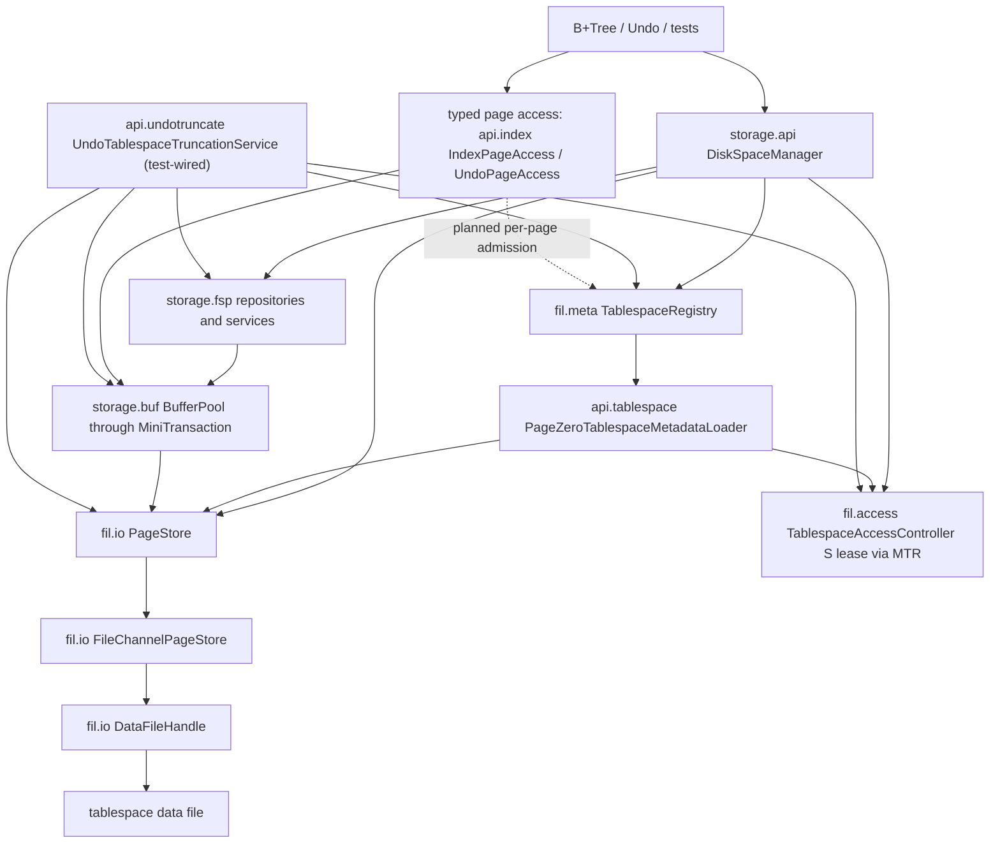
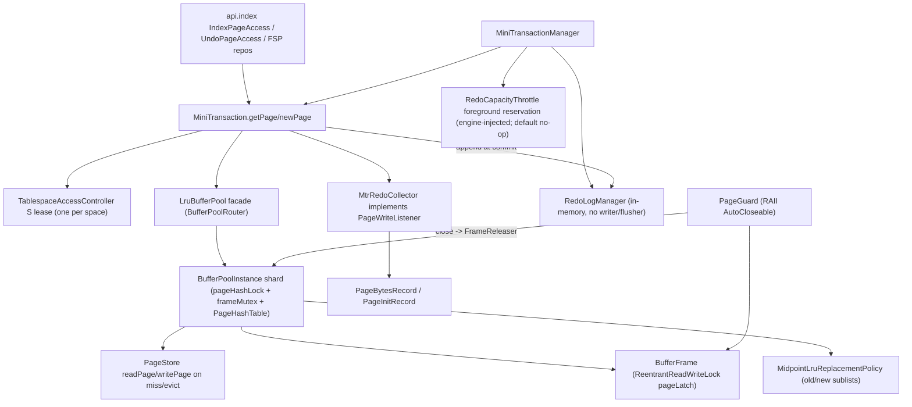
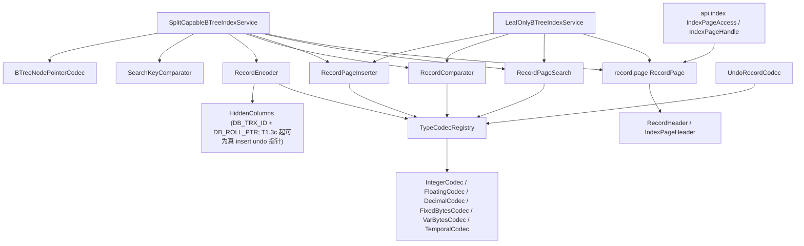
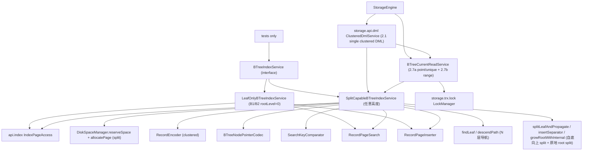
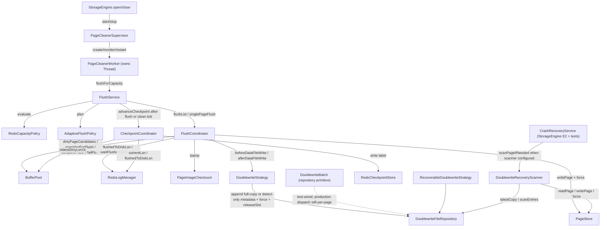
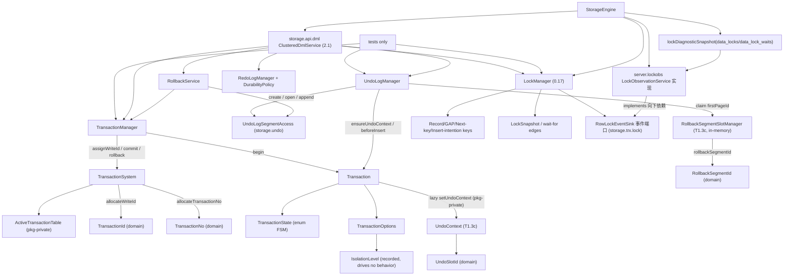
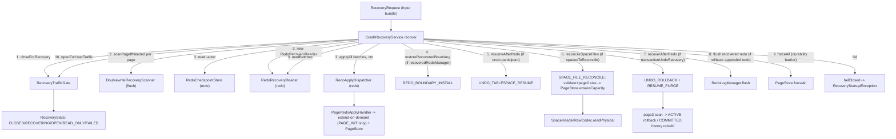
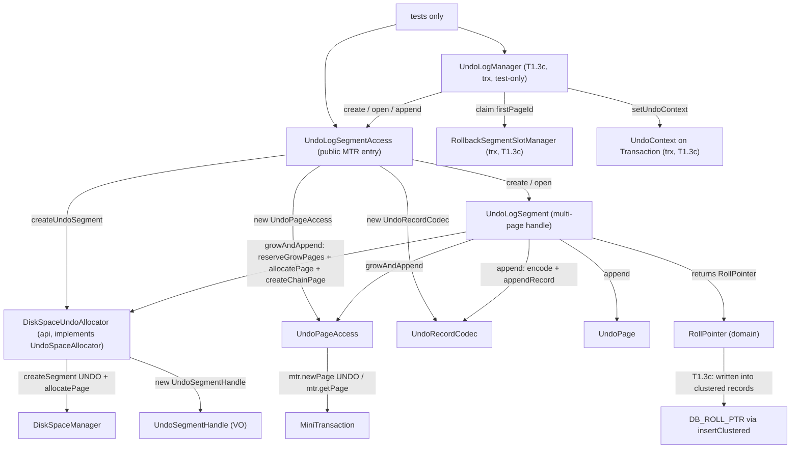

# Current Implementation Map

本文档记录当前生产代码的真实接线和已知缺口。全局设计文档和 `docs/design/diagrams/*.mmd` 表达目标架构；本文件表达当前实现状态。两者不一致时，开发判断当前代码行为以本文件和源码为准，目标演进以对应设计文档为准。

## Maintenance Rules

- 实线只表示当前生产代码已经存在的调用、持有、写入或读写关系。
- 虚线只表示已经决定但尚未闭环的 `planned`、`partial` 或 `unwired` 关系。
- 每个 `unwired` 生产类型都必须写清现状、保留理由和下一步动作。
- 每次实现切片结束后，只更新受影响的小节；只有目标架构变化时才更新全局架构图。
- 本文件不得用未决占位词替代明确判断；如果状态不确定，应写出需要核对的源码入口。

## Storage Disk Manager Slice

### Current Flow



### Current Data Chains

| Flow | Current production chain | Current state |
| --- | --- | --- |
| Create tablespace | `DiskSpaceManager.createTablespace` -> `PageStore.create` -> `DataFileHandle.create`; then `SpaceHeaderRepository.initialize`（含 page0 FSP_HDR 信封盖戳）; UNDO additionally writes `TablespaceLifecycleHeader(ACTIVE,initialSize,epoch=0)`; reserve extent0 and `TablespaceRegistry.replace` | Implemented; GENERAL publishes NORMAL，UNDO publishes/persists ACTIVE；4-arg overload仍默认 GENERAL；page0 现携带统一 FSP_HDR FilePageHeader 信封 |
| Open tablespace | `DiskSpaceManager.openTablespace` -> `PageStore.open`; `TablespaceRegistry.open` -> `api.tablespace.PageZeroTablespaceMetadataLoader` 持 S lease raw 读 page0 (`PageZeroTablespaceMetadataLoader.java:110`) -> FSP_HDR 信封校验(`:111` pageType==FSP_HDR/pageNo==0，否则 `TablespaceCorruptedException`) -> physical/lifecycle codecs | Implemented for already-known path；新 UNDO 恢复持久状态，旧 UNDO 无 lifecycle header 时按 NORMAL 打开但禁止 truncate；checksum/trailer 校验仍 deferred |
| Recovery open | `DiskSpaceManager.openTablespaceForRecovery` -> `PageStore.open` -> `TablespaceRegistry.requireForRecovery` -> page0 loader（同样做 FSP_HDR 信封校验） | Implemented；允许加载 TRUNCATING，供启动恢复续作 |
| Space-management admission | `DiskSpaceManager.createSegment/allocatePage/freePage/dropSegment/usage` -> `MiniTransaction.acquireTablespaceLease(S)` (`MiniTransaction.java:108`) -> `TablespaceRegistry.require`（lease 后复核）-> FSP | Implemented；拒绝 CORRUPTED/INACTIVE/TRUNCATING/DISCARDED，消除状态先检后等待竞态 |
| Space reservation | `DiskSpaceManager.reserveSpace` -> ordinary access lease + Registry require -> `SpaceReservationService.reserve` -> page0/FLST 容量快照（不持账本锁）-> `PageStore.ensureCapacity` + `SpaceHeaderRepository.setCurrentSizeInPages` if needed -> capacity counter publish -> `MiniTransaction.enlistResource` | Implemented core + consumers（0.14a/0.14b）；per-process in-memory capacity counters + `SpaceReservationKind`；capacity counter lock 只保护内存承诺计数，不包住 Buffer Pool/page latch/file extend；B+Tree split/root split 以 `NORMAL` 预算调用，Undo grow 以 `UNDO` 预算调用，失败发生在真正 page allocation 和页内容修改前 |
| Allocate page | `DiskSpaceManager.allocatePage` -> `TablespaceRegistry.require` -> optional `SpaceReservationService.consumePageIfReserved` -> `SegmentPageAllocator` -> `SegmentSpaceService` / `FreeExtentService`; on no space without reservation, `PageStore.extend` then `SpaceHeaderRepository.setCurrentSizeInPages` and retry | Implemented for current FSP model; active reservation 会先消费 page quota（当前 MTR reservation 的 atomic quota，无全局账本锁，避免持 index page latch 时阻塞在 reservation lock），耗尽则在分配前抛 `SpaceReservationExceededException`；无 reservation 调用保持兼容；registry size snapshot is not updated after autoextend because page0 remains the size authority；autoextend 现 crash-safe：恢复期 `SPACE_FILE_RECONCILE` 经 `PageStore.ensureCapacity` 把物理文件长度重对齐到 redo 恢复出的 page0 大小 |
| Typed INDEX/UNDO access | `api.index.IndexPageAccess` / `UndoPageAccess` -> `MiniTransaction.getPage/newPage` -> 每 SpaceId 一个 S lease -> `BufferPool` -> `PageStore` | Implemented operation lease；typed access 本身仍不查 Registry 状态，完整状态准入依赖上层 facade |
| Dirty page flush | `FlushCoordinator` 持同 space S lease -> snapshot -> WAL gate -> doublewrite -> `PageStore.writePage/force` -> complete | Implemented；与 truncate X 互斥；data-file fsync 未经 `FsyncLock` 节流 |
| UNDO truncate | `UndoTablespaceTruncationService.truncate` (`UndoTablespaceTruncationService.java:105`) -> X lease/校验/marker -> `FlushService.flushThrough` (`FlushService.java:127`) -> `LruBufferPool.invalidateTablespace` (`LruBufferPool.java:320`) -> `DataFileHandle.truncateTo` (`DataFileHandle.java:247`) -> `UndoTablespaceFspRebuilder.rebuild` (`UndoTablespaceFspRebuilder.java:45`) -> final state/Registry publish | Implemented (test-wired)；同 epoch 可故障续作；旧 UNDO/GENERAL/活动 inode 明确拒绝；`FlushService.drainTablespace` 的目标 space dirty drain 已通过 `BufferPool.awaitDirtyStateChange` 等待 dirty-state signal，不再固定 1ms 轮询 |
| Redo replay | `RedoApplyDispatcher` -> `PageRedoApplyHandler` -> `PageStore.readPage/writePage` | Implemented physical replay path; recovery discovery is not fully wired to registry |

### Package Status

| Package area | Representative classes | Current state | Notes |
| --- | --- | --- | --- |
| `storage.api` disk facade | `DiskSpaceManager`, `SegmentRef`, `SpaceUsage`, `DiskSpaceUndoAllocator` | Implemented | DiskSpaceManager 管普通 FSP；SegmentRef/SpaceUsage 是门面值对象；undo allocator 是 undo 端口适配器 |
| `storage.api.undotruncate` lifecycle orchestration | `UndoTablespaceTruncationService`, `UndoTablespaceTruncationRecovery` | Implemented; recovery wired by `StorageEngine` E2 | 可恢复 UNDO 物理收缩与 recovery participant；E2 existing open 构造恢复参与者用于 TRUNCATING 续作；主动 truncate 仍待 purge/DML 调度 |
| `storage.api.index` typed index page entry | `IndexPageAccess`, `IndexPageHandle` | Implemented | Bridges B+Tree/record code to `MiniTransaction`-owned page guards |
| `storage.api.tablespace` metadata adapter | `PageZeroTablespaceMetadataLoader` | Implemented | Registry 懒加载协作者；留在 api 侧以避免 `fil` 直接编排 `fsp` page0/lifecycle codec；打开/恢复时先做 page0 FSP_HDR 信封校验(pageType/pageNo)，checksum 校验 deferred |
| `storage.api.dml` single-clustered DML facade | `ClusteredDmlService`, `ClusteredInsertCommand`, `ClusteredUpdateCommand`, `ClusteredDeleteCommand`, `DmlCommitCommand`, `DmlRollbackCommand`, result/exception records | Implemented; production-wired by `StorageEngine` | 2.1：单表/单聚簇索引 INSERT/UPDATE/DELETE/COMMIT/ROLLBACK 编排入口；调用方显式传入 `Transaction`/`BTreeIndex`/row/key，不接 SQL parser、session autocommit、DD、多索引或二级索引 |
| `storage.fsp.flst` file-list primitives | `FileAddress`, `Flst`, `FlstBase`, `FlstNode` | Implemented | FSP/XDES/INODE 链表指针与 base/node 编解码；不接触文件 IO |
| `storage.fsp.header` space header | `SpaceHeaderRepository`, `SpaceHeaderSnapshot`, `SpaceHeaderRawCodec`, `SpaceHeaderPhysical` | Implemented | page0 header 读写与 raw metadata 加载；`initialize` 盖 page0 FSP_HDR FilePageHeader 信封头；layout 常量供 extent/lifecycle codec 共享 |
| `storage.fsp.reservation` space reservation | `SpaceReservationService`, `SpaceReservation`, `SpaceReservationKind` | Implemented | `DiskSpaceManager.reserveSpace` 生产接线；内存态容量账本，预扩物理文件/page0 currentSize；0.14b 已接 B+Tree split/root split 与 Undo grow 真实消费者；2026-07-03 修正锁边界：reserve 不持账本锁等待 page0/FLST，consume 不取全局账本锁而只改当前 reservation 原子页额度 |
| `storage.fsp.extent` extent management | `ExtentDescriptorRepository`, `ExtentState`, `FreeExtentService`, `ExtentAllocationPolicy` | Implemented | XDES state/owner/bitmap + 全局 FREE/FREE_FRAG/FULL_FRAG 分配；不打开文件 |
| `storage.fsp.segment` segment management | `SegmentInodeRepository`, `SegmentPurpose`, `SegmentSpaceService`, `SegmentPageAllocator` | Implemented | INODE slot、segment extent list、fragment 页和 segment 页分配 |
| `storage.fsp.lifecycle` lifecycle marker | `TablespaceLifecycleHeader`, `TablespaceLifecycleRawCodec` | Implemented | page0 198–237 持久化 UNDO lifecycle marker |
| `storage.fsp.undo` undo rebuild | `UndoTablespaceFspRebuilder` | Implemented | 物理 truncate 后清零并重建 page0/page2/extent0 |
| `storage.fsp.exception` exceptions | `FspMetadataException`, `NoFreeSpaceException`, `SpaceReservationExceededException` | Implemented | FSP 元数据损坏/空间耗尽/预留额度耗尽领域异常 |
| `storage.fil.io` physical IO | `PageStore`, `FileChannelPageStore`, `DataFileDescriptor`, `DataFileHandle`, `AutoExtendPolicy` | Implemented | State/registry-free；单文件 `truncate`（缩短）与 `ensureCapacity`（幂等扩到至少 N，crash recovery 用），均持 physical Lifecycle->FileSize(X)、零填充/缩短后发布 size；`forceAll` 汇总 force 全部句柄（恢复末尾 durability 屏障） |
| `storage.fil.lock` physical locks | `TablespaceLifecycleLatch`, `FileSizeLock`, `ResourceGuard`, `DataFileHandleLock`, `FsyncLock`, `PageIoRangeLock` | Implemented / partially reserved | lifecycle/file-size 已由 `DataFileHandle` 使用；`DataFileHandleLock`/`FsyncLock`/`PageIoRangeLock` 仍为预留物理锁 |
| `storage.fil.access` operation admission | `TablespaceAccessController`, `TablespaceAccessLease` | Implemented | controller 每 SpaceId 公平显式 RW lease；`StorageEngine` E1/E2 创建单实例并注入 MTR/loader/disk/flush/recovery undo truncate |
| `storage.fil.meta` runtime metadata | `TablespaceRegistry`, `CachingTablespaceRegistry`, `TablespaceMetadata`, `Tablespace`, `TablespaceHandle` | Implemented for runtime admission | registry 保存当前进程打开视图；UNDO lifecycle 持久化，普通 state/discard/corruption 仍仅 runtime |
| `storage.fil.state` type/state values | `TablespaceState`, `TablespaceType`, `TablespaceTypeFlags`, `SpaceFlags` | Implemented | 表空间类型与状态编码值对象；状态转换由 api/engine 层编排 |
| `storage.fil.exception` exceptions | `TablespaceNotFoundException`, `TablespaceUnavailableException`, `DataFilePhysicalException`, `PageOutOfBoundsException` | Implemented | 表空间文件缺失、越界、损坏、不可用等 fil 领域异常 |
| `storage.page` physical envelope | `PageEnvelopeLayout`, `FilePageHeader`, `PageEnvelope`, `PageChecksum`, `PageImageChecksum`, `PageType` | Implemented | Shared header/trailer/checksum helpers over raw page bytes |

## Buffer Pool + MiniTransaction Slice

### Current Flow



### Current Data Chains

| Flow | Current production chain | Current state |
| --- | --- | --- |
| Page fix (INDEX) | `api.index.IndexPageAccess.openIndexPage` -> `MiniTransaction.getPage` -> `LruBufferPool.getPage`（facade 经 `BufferPoolRouter` 路由到归属 `BufferPoolInstance`）-> `instance.getPage` -> `acquire` (`BufferPoolInstanceLatchSet`: `pageHashLock` 查/注册 `PageId -> frame`，目标 `frameMutex` 固定/检查 LOADING/dirty/state；miss 时通过 `freeListLock` 取空闲帧，或经 `lruListLock` 复制 victim 顺序后逐帧复核；命中 LOADING 出锁等 `PageLoadFuture`；装 LOADING 占位后**出所有内部锁** `readAndPublish` 读盘) -> `pageLatch.lock` -> `new PageGuard`(releaser=instance) -> `attachWriteListener(MtrRedoCollector)` + `memo.pushPageGuard` (`MiniTransaction.java:103-106`)；facade 再调 read-ahead 钩子 | Implemented；**0.10d 多 instance（默认 N=1，生产 N=1）**：facade 路由单页操作到分片、跨切面查询逐分片聚合；miss 读盘移出内部锁（Phase B：per-frame LOADING + load future）；**13.1d** 已拆 `pageHashLock + frameMutex + freeListLock/lruListLock/flushListLock`，dirty view 由 `DirtyPageList` 真实 flush list 承载 |
| Page fix (UNDO) | `UndoPageAccess.openUndoPage` -> `MiniTransaction.getPage` (same path); page-type gate rejects non-UNDO pages (`UndoPageAccess.java:79-81`) | Implemented |
| New page (INDEX) | `api.index.IndexPageAccess.createIndexPage` -> `MiniTransaction.newPage` -> `LruBufferPool.newPage` -> `acquire(readFromDisk=false)` -> zero-fill under X latch; MTR `collector.recordInit(pageId, PageType.INDEX)` (`MiniTransaction.java:109`) | Implemented |
| New page (UNDO) | `UndoPageAccess.newUndoEnvelope` -> `MiniTransaction.newPage(...,PageType.UNDO)` (`UndoPageAccess.java:86`) | Implemented |
| MTR begin/commit | `MiniTransactionManager.begin` -> optional foreground redo reservation -> `MiniTransaction.commit` -> append redo -> stamp touched pageLSN -> `memo.releaseAll()` LIFO（page guard 先于 reservation / tablespace lease）-> 返回 batch end LSN | Implemented；默认 manager 仍为内存 redo + no-op reservation；`StorageEngine` 注入 durable manager + foreground reservation throttle，等待发生在 page latch/fix/lease 前 |
| MTR rollback | `MiniTransaction.rollbackUncommitted` -> `memo.releaseAll()` only (`:167`) | Implemented; dirty pages stay dirty — no buffer-content undo (documented simplification `:18-19`) |
| Dirty page mark | `PageGuard.close` -> `FrameReleaser.release(frame, wrote)` -> `BufferPoolInstance.release`（归属分片，0.10d 起 `FrameReleaser` 由 instance 实现）OR-dirties via `markDirty` under target `frameMutex`; sets `oldestModificationLsn`/`newestModificationLsn`/bumps `dirtyVersion` and publishes/upserts `DirtyPageList` under `flushListLock` | Implemented；**13.1d**：同页重复修改只保留一条 flush list 记录，oldest LSN 约束 checkpoint，newest LSN 随页面最新 LSN 更新；**E1 修 bug**：`markDirty` 改用 `oldestModificationLsn==null` 守卫（原 `!dirty`）——newPage 对驻留页重初始化先置 dirty=true（无 LSN），双 newPage 同 MTR（allocatePage+createIndexPage 同根页）后 commit markDirty 会因 dirty 已真而漏设 oldestMod，留 dirty+null oldestMod 帧致 flush/checkpoint NPE。flush-after-双newPage 之前潜伏（既有 btree 测试不 flush 未触发） |
| Eviction | `BufferPoolInstance.obtainVictim(cleanSkip)`（分片本地，无跨分片 stealing）优先 free/clean 帧直接复用；仅有脏 unfixed 帧时记 PageId、出所有内部锁经 `DirtyVictimFlusher.flushVictim`（→`FlushCoordinator.singlePageFlush`：WAL gate+checksum+doublewrite+`completeFlush`）刷干净后回环重选；本轮 `cleanSkip` 防空转，无干净帧抛 `BufferPoolExhaustedException`；无 `DirtyVictimFlusher` 时遇到脏 victim 直接抛 `BufferPoolExhaustedException`，不再 fallback 直写 PageStore | Implemented；注入 flusher（生产 `StorageEngine`）后脏页淘汰 WAL 安全：redo 未 durable→`flushVictim` 返回 false→不写盘；`FAILED`→抛根因不吞。2026-07-05 已移除 legacy no-flusher direct-write fallback |
| Checkpoint feed | `flush.checkpoint.CheckpointCoordinator` -> `bufferPool.oldestDirtyLsnOr(current)` -> `LruBufferPool` per instance reads `DirtyPageList.oldestDirtyLsnOrNull()` under `flushListLock`, then facade takes global min | Implemented; called by tests, `StorageEngine` foreground checkpoint/close path, and E3a background page cleaner tick. `FLUSHING` pages remain in `DirtyPageList` until `completeFlush` clears them, so checkpoint cannot pass a page still being written |
| Tablespace invalidation | `UndoTablespaceTruncationService` 持 X lease -> `LruBufferPool.invalidateTablespace` -> `SpaceLifecycleClock.beginInvalidation` 关闭该 space 新前台准入/预读 -> 各分片 Condition 等待 fixCount=0 -> dirty 则拒绝并 abort 版本窗口 -> 全分片 drain+check 通过后 `advanceInvalidation` 推进 `TablespaceVersion` -> 移除旧版本 frame -> finish 重新开放 | Implemented；fixed 等待有 timeout/interrupt；不隐式绕过 WAL flush；并发前台 get/new 命中失效窗口抛 `BufferPoolStalePageException`，prefetch 直接跳过，LOADING 发布前会复核版本并清占位；dirty drain 等待独立走 facade 级 `awaitDirtyStateChange`，由 flush/guard release/reset 等 dirty-view 变化路径 signal |

### Package Status

| Package area | Representative classes | Current state | Notes |
| --- | --- | --- | --- |
| `storage.buf` pool core | `BufferPool`, `LruBufferPool`(facade), `BufferPoolInstance`, `BufferPoolInstanceLatchSet`, `PageHashTable`, `BufferPoolRouter`, `BufferFrame`, `PageGuard`, `PageLatchMode`, `DirtyVictimFlusher`, `DirtyPageList`, `BufferFrameState`, `FrameStateMachine`, `PageLoadFuture`, `BufferPoolLoadTimeoutException`, `BufferPoolLatchViolationException`, `SpaceLifecycleClock`, `TablespaceVersion`, `BufferPoolStalePageException` | Implemented (production-wired) | **0.10d 多 instance 分片**：`LruBufferPool` 转 facade，经 `BufferPoolRouter`(`hash(PageId)%N` 确定路由) 把单页操作转发到归属 `BufferPoolInstance`、跨切面查询（dirty 候选合并按 oldestLSN 升序 / oldest LSN 全局 min / hasDirty / residentCount / residentCountInRange / 截断）逐分片聚合；分片间无 work stealing（某分片满即抛 `BufferPoolExhaustedException`）；`invalidateTablespace` 两阶段（全分片 drain+check 通过后再移除）保 all-or-nothing。容量按 base+前 r 个+1 切分（capacity≥N）。生产 N=1（`EngineConfig.bufferPoolInstanceCount` 默认 1，`StorageEngine` 经此构造）。**Phase B + 13.1a/b/c/d + legacy flush removal**：`FrameStateMachine`(FREE/LOADING/CLEAN/DIRTY/FLUSHING) + LOADING single-flight；`PageHashTable` 由 `pageHashLock` 保护，`BufferFrame` 当前绑定/状态/fix/dirty/LSN/loadFuture/spaceVersion 由 `frameMutex` 保护；free list、LRU、flush list 分别由 `freeListLock`/`lruListLock`/`flushListLock` 保护；`DirtyPageList` 保存 `PageId + oldest/newest LSN` 而非 frame 引用，候选枚举走 flush-list 快照后再 pageHash/frame 复核，fixed DIRTY 页仍出候选供 drain 看到 dirty view，`FLUSHING` 页留链约束 checkpoint 但不重复出候选；Buffer Pool 不再提供 `flush/flushAll` 直写 PageStore API，所有脏页物理写出只走 `FlushCoordinator`；miss 读盘、`PageLoadFuture` wait、dirty victim flush 前均由 `BufferPoolInstanceLatchSet.assertMetadataUnlocked` 守卫无内部锁。**0.22 stale-frame 版本语义**：每个 resident/LOADING frame 带 `TablespaceVersion`，`SpaceLifecycleClock` 在 truncate/drop invalidation 窗口拒绝前台准入、跳过 prefetch，并在 lookup/LOADING 发布前复核版本；已过期 clean unfixed frame 只隔离不复活。剩余 `DIRTY_PENDING/EVICTING/STALE` 态仍待后续。**0.13d SX latch**：`PageLatchMode` 增 `SHARED_EXCLUSIVE`（SIX），分层实现=帧内 `pageLatch.readLock()`（与 S 共存、排它 X）+ 每帧 `pageIntentLatch`(`ReentrantLock`，排它另一 SX/X)；`BufferPoolInstance.acquire` 对 SX 先取 read latch 再取 intent latch，`PageGuard` 持双闩、close 逆序先放 intent 后放 read；SX 只授只读内容（写仍须 X，`requireExclusive` 拦截），不支持原地 SX→X 升级（RRWL 无升级会自死锁）。**已接入 btree 悲观 SMO 下降**（root SX 首遍 + restart-in-X，见 B+Tree 小节） |
| `storage.buf` replacement | `ReplacementPolicy`, `MidpointLruReplacementPolicy` | Implemented (production-wired) | Midpoint LRU(old/new 子链)：读入进 old 头、`oldBlocksTime`(注入毫秒时钟) 提升窗 + `youngDistanceThreshold`(young 子链 1/4) 抗抖动 → 抗扫描污染（Phase A 0.8）；sole impl，injection ctor `LruBufferPool(...,ReplacementPolicy)` 供测试注入可控时钟；read-ahead-aware 分类、`oldBlocksPct` 配比再平衡待 0.10 |
| `storage.buf` flush support | `DirtyPageCandidate`, `FlushPageSnapshot`, `BufferPoolExhaustedException` | Implemented | Value objects consumed by flush module；`failFlush` 现 FLUSHING→DIRTY（Phase B，不再 no-op）；`snapshotForFlush` DIRTY→FLUSHING、`completeFlush` 版本符→CLEAN/不符→DIRTY；`FlushCoordinator` WAL-gate skip 路径补 `failFlush` 复位 |
| `storage.buf` write listener | `PageWriteListener` | Implemented | DI seam; only production impl is `MtrRedoCollector`; `NO_OP` path has no production caller |
| `storage.buf` read-ahead + warmup | `BufferPool.prefetch`/`residentPageIds`/`residentCountInRange`, `LinearReadAheadTracker`, `RandomReadAheadDetector`, `ReadAheadRequest`, `ReadAheadHook`, `ReadAheadService`, `ReadAheadState`, `BufferPoolWarmupService` | Implemented (production-wired) | 0.10a linear read-ahead：`prefetch`=free-frame-only 载入 old 不 fix 不提升（跳过驻留/无空闲帧丢弃/IO 失败回收）；`LinearReadAheadTracker`(单顺序流，同 extent 连续达 threshold→预取下一 extent，`PAGES_PER_EXTENT=64`)；`ReadAheadService`(实现 `ReadAheadHook`，前台 `recordAccess` 喂检测器+有界队列、单 worker `prefetch`)；`attachReadAheadHook`+`getPage` 回调；engine 后台启停（linear threshold 56、门控 `backgroundFlushEnabled`）。**0.10c random read-ahead（默认禁用）**：`BufferPool.residentCountInRange`(page hash 短锁内逐页查区间驻留数，O(extent)) + `RandomReadAheadDetector`(同 extent 驻留数达 threshold→补取整 extent，bounded recent 窗去重而非永久 set)；`ReadAheadService` 4 参构造增 `randomThreshold`(0=禁用→不构造检测器/普通路径不查 residentCountInRange)，`recordAccess` 持 service.lock 时查 residentCountInRange(page hash 短锁，单向无环) 喂 detector、命中入队，random 检测异常吞掉只丢本次预取；`StorageEngine` 以 `RANDOM_READ_AHEAD_THRESHOLD=0` 构造（对齐 MySQL `innodb_random_read_ahead=OFF`），生产启用留 config（延后）。0.10b warmup：`BufferPoolWarmupService` dump(residentPageIds→文件 magic+crc32)/load(读回→prefetch，缺失/损坏 no-op)，`StorageEngine` close 写 / open 预取。简化：单流、free-frame-only、random 触发用「extent 驻留数」启发式(非 access-bit)、warmup 同步预取/无 IO 速率控制/space version；多 instance 分片 + 专用 `PageHashTable` 已由 0.10d 闭合 |
| `storage.mtr` transaction | `MiniTransaction`, `MiniTransactionManager`, `MiniTransactionState`, `MtrSavepoint` | Implemented (production-wired by engine) | Manager 可注入共享 controller + durable redo + foreground redo reservation budget；commit 返回 marker end LSN；默认构造仍内存 redo/no-op reservation |
| `storage.mtr` memo + collector | `MtrMemo`, `MtrRedoCollector`, `MtrLatchOrderScope`, `MtrStateException` | Implemented | memo 同时持 page guard 与 per-space lease；LIFO 保证 latch/fix 先释放、lease 最后释放。**0.13d SX**：`fix` 的同页升级防护由「S→X 禁」扩为「S 或 SHARED_EXCLUSIVE 仍持时求 X 且未持 X 即禁」（两者都持该页 readLock，再求 X 会自死锁）。**0.23a MTR page latch ordering**：默认独立多页 latch 必须按 `(spaceId,pageNo)` 升序获取；同页重入和已提前释放页不计入违规；违反时在进入 Buffer Pool 等待前抛 `MtrStateException`。`allowOutOfOrderPageLatch(reason)` 只给 B+Tree root/child/sibling/SMO allocation-format-free、Undo grow/FIL 链读/rseg page3 slot 等有局部无环证明的路径短暂开例外，作用域关闭后恢复默认守卫 |

## Record Layer Slice

### Current Flow



### Current Data Chains

| Flow | Current production chain | Current state |
| --- | --- | --- |
| INDEX page record access | `api.index.IndexPageAccess.openIndexPage` -> `new RecordPage(guard, pageSize)` -> `rp.format(...)` / `rp.freeSpace()` / etc. | Implemented; `api.index.IndexPageHandle.recordPage()` also constructs `RecordPage` |
| In-page search | `LeafOnlyBTreeIndexService`/`SplitCapableBTreeIndexService` -> `new RecordPageSearch(registry)` (`:49`/`:72`) -> `search.findEqual/findInsertPosition` -> `RecordCursor` per row | Implemented |
| In-page insert | btree service -> `new RecordPageInserter(registry)` (`:51`/`:73`) -> `inserter.insert` -> `HeapSpaceManager` alloc + `RecordPageDirectory` slot maintenance; `RecordPageOverflowException` triggers btree split | Implemented |
| Clustered record encode | `SplitCapableBTreeIndexService.insertClustered` -> stamps `new HiddenColumns(transactionId, rollPointer)`（T1.3c 起为调用方传入的真 insert undo 指针，非 NULL） (`:105`) -> `RecordEncoder.encode` (`:426`) | Implemented; T1.3c 起 `DB_ROLL_PTR` 可写真 undo 指针（由 `UndoLogManager.beforeInsert` 返回）；未接 undo 的路径仍传 `RollPointer.NULL` |
| Undo record codec | `UndoRecordCodec` -> `TypeCodecRegistry.codecFor` per column -> `FieldWriter`/`FieldSlice` self-framing payload；UPDATE_ROW **和** DELETE_MARK 追加全量旧 image（旧隐藏列 + 全列）尾部 | Implemented (INSERT_ROW + UPDATE_ROW + DELETE_MARK，T1.3f)；DELETE_MARK 复用 UPDATE 旧 image 结构（不存 old delete flag=阶段差异）；INSERT golden bytes 钉死；type 首字节权威 |
| Record decode | `RecordFieldResolver` -> `TypeCodecRegistry` -> per-column `FieldSlice`/`ColumnValue`; reached via `RecordCursor` (btree scan/lookup) | Implemented; standalone `RecordDecoder` has no production caller (test-only) |

### Package Status

| Package area | Representative classes | Current state | Notes |
| --- | --- | --- | --- |
| `record.schema` | `TableSchema`, `ColumnType`, `IndexKeyDef`, `ColumnDef`, `KeyPartDef`, `KeyOrder`, `TypeId` | Implemented | Foundational immutable value objects; consumed by btree + undo; 13 `TypeId` (TINYINT…DATETIME); `CharsetId` UTF8-only, `CollationId` BINARY-only |
| `record.type` | `TypeCodecRegistry`, `TypeCodec`, `ColumnValue`, `FieldSlice`, `FieldWriter`, `IntegerCodec`/`FloatingCodec`/`DecimalCodec`/`FixedBytesCodec`/`VarBytesCodec`/`TemporalCodec` | Implemented (subset) | Order-preserving codecs; `new TypeCodecRegistry()` only in tests (no production bootstrap); `UnsupportedColumnTypeException` declared but unreachable (exhaustive switch) |
| `record.format` | `RecordEncoder`, `RecordFieldResolver`, `LogicalRecord`, `RecordHeader`, `RecordType`, `HiddenColumns`, `HiddenColumnLayout`, `NullBitmap`, `VarLenDirectory` | Partial | Inline-only format (`MAX_RECORD_LENGTH=65535`, no overflow chain); `RecordDecoder` is test-only; `RecordHeaderLayout` is simplified 8-byte fixed (not InnoDB-binary-compatible); T1.3c 起 `HiddenColumns.dbRollPtr` 可写真 undo 指针（不再恒 `RollPointer.NULL`） |
| `record.page` | `RecordPage`, `RecordPageSearch`, `RecordPageInserter`, `RecordCursor`, `RecordComparator`, `IndexPageHeader`, `RecordRef`, `SearchKey`, `RecordPageDirectory`, `HeapSpaceManager` | Partial | Insert/search/cursor/comparator wired into btree+api; T1.3d 起 `RecordPageDeleter`/`RecordPagePurger` 经 `SplitCapableBTreeIndexService.deleteClustered` 接入 rollback（不再 test-only）；`RecordPageUpdater` + `UpdateResult`/`UpdateOutcome` 经 `replaceClustered`（T1.3e）接入；`RecordPageReorganizer` 自 0.12 起经 btree merge（`mergeLeaf`/`mergeInternal` 压实 survivor）接入（均 test-wired，随 btree 包整体上行）；record layer 仍只提供页内原语，不做 split/merge 决策（结构变更归 btree）|

## B+Tree Layer Slice

### Current Flow



### Current Data Chains

| Flow | Current production chain | Current state |
| --- | --- | --- |
| Point lookup | `BTreeIndexService.lookup` -> SplitCapable `findLeafSharedCrab`（N 层 `chooseChild` **S-crab** 下降：持父 S→latch 子 S→放父 S，祖先早释放，0.13c）-> `search.findEqual` -> `RecordCursor` -> `materialize` | Implemented；SplitCapable 任意高度（0.11）；读路径 S-crab（0.13c）；LeafOnly 仍 level 0 |
| Point current-read (2.7a) | `BTreeCurrentReadService.lockPoint` -> 短 MTR `SplitCapableBTreeIndexService.locatePointForCurrentRead`（S 定位 record/gap，构造 `RecordLockKey`/`GapLockKey`/`NextKeyLockKey`）-> commit 释放 page latch/fix -> `LockManager.acquire` -> 短 MTR 重新定位校验；RC miss 不锁 gap，RR miss 按模式锁 gap | Implemented；`StorageEngine` production-held；2.1 起 `ClusteredDmlService.update/delete` 调用 `FOR_UPDATE`；SQL/session/executor 仍未接 |
| Unique insert current-read check (2.7a) | `BTreeCurrentReadService.checkUniqueForInsert` -> 物理 duplicate 命中取 `REC_S` 并重定位确认；miss 取 `INSERT_INTENTION` 到目标 gap 并重定位确认 -> `BTreeUniqueCheckResult` | Implemented；2.1 起 `ClusteredDmlService.insert` 调用；仍是物理唯一检查（delete-marked 同 key 算 duplicate），不做 MVCC 逻辑唯一 |
| Range current-read (2.7b) | `BTreeCurrentReadService.lockRange` -> 短 MTR `SplitCapableBTreeIndexService.locateRangeForCurrentRead`（扫描 range records，构造 `RecordLockKey`/`NextKeyLockKey` 与 terminal `GapLockKey`）-> commit 释放 page latch/fix -> RC 对返回记录取 `REC_S/REC_X`，RR 取 `NEXT_KEY_S/X` + `GAP_S/X` -> 短 MTR 重扫 range 并校验；失败尝试释放已授予锁 | Implemented；批量 range 结果，不实现长期 cursor；terminal gap 仍是页级简化；SQL/session/executor range DML 尚未接 |
| Bounded scan | `SplitCapableBTreeIndexService.scan` -> `descendSharedCrab(lowerKey)` **S-crab** 定位起始 leaf -> sibling loop via `fileHeader().nextPageNo()`（`FIL_NULL` 终止，**hand-over-hand**：先 latch 后继 leaf 再 `releaseHandle` 前驱）-> `scanLeafPage` per page | Implemented；任意高度；读路径 S-crab + sibling hand-over-hand（0.13c），任一时刻只持「父+子」/「≤2 leaf」|
| Insert (no split) | SplitCapable `insert` -> **乐观** `tryOptimisticInsert`：`descendOptimistic`（内部层 S-crab、leaf X）-> unique check -> `inserter.insert`（放得下即成，仅 leaf 持 X）；溢出=unsafe 释放 leaf X 回退 `pessimisticInsert`。**悲观 insert 走 safe-node 下降（0.13d）**：`descendPathInsertSafeNode` 全 X 下降但每 latch 到内部 child 若 safe（`freeSpace ≥ maxSeparatorSize`=该索引 node pointer 编码严格上界）即释放其以上全部祖先 X（含 root）→ split 不传播到 root 时 **root X 不再持到 commit**；只判内部页（leaf 恒保留），既有 split 传播引擎在截断后的保留链上零改动正确。LeafOnly 仍 `descendPath` X-latch root→leaf | Implemented；overflow → `BTreeSplitRequiredException`（LeafOnly）或悲观 split 传播（SplitCapable，写路径 latch coupling 0.13a + safe-node 0.13d）；诊断计数 `safeNodeAncestorReleaseCount()`。insert/delete/purge 的 safe-node 下降共用 `descendPathSafeNode`（谓词参数化）。**0.13d SX+restart（§10.3 ROOT_LATCHED_SX）**：快照树高 ≥2 的悲观 SMO 首遍 root 取 **SX**（与读者/乐观写者 root S 并存、排它其它 SMO），safe 节点吸收 → 全程不 X root；首遍链顶仍是 root（SMO 可能写 root，SX 禁升级）→ 零写整链释放、root X 重启第二遍（至多一次，重启即全新导航天然正确）；level 0/1 树必写 root 故跳过 SX 首遍直取 X；计数 `rootSxDescentCount()`/`rootXRestartCount()` |
| Insert split 传播（0.11/0.14b/0.23a） | `insert` overflow -> `pessimisticInsert` 计算 split 预算 -> 释放未写保留链 -> `reserveSplitSpace(NORMAL)`（按 leaf split + 可能 parent/root split 最坏页数预算，且至少一 extent，失败在任何页改写前）-> 重新下降并复核 unique/leaf 容量 -> `splitLeafAndPropagate`。leaf 即 root → `splitRootLeaf`（原地 level0→1）；否则 `splitNonRootLeaf`（旧 leaf=左半 + 新右兄弟 + sibling 链）→ `insertSeparator` 上插父页 -> 父满则内部 split：root→`growRootWithInternal`（两 level-L 新子页 + root 页号不变重建 level L+1）、非 root→`splitNonRootInternal` 递归上插。leaf 行/内部 pointer 统一对半切，separator=右半 lowKey | Implemented（任意高度）；内部/root-split 子页自 `nonLeafSegment` 分配；root 页号稳定；返回 `BTreeInsertResult(after.withRootLevel, allocatedPages)`；0.14b 起 split/root split 不再半途 immediate allocation ENOSPC；0.23a 起预留不在持 index page latch 时触碰 page0/FLST，SMO 新页分配/格式化和 child/sibling hand-over-hand 打开通过 `allowOutOfOrderPageLatch(reason)` 记录局部无环证明 |
| Clustered insert | `SplitCapableBTreeIndexService.insertClustered(mtr, index, record, transactionId, rollPointer)` (`:91`) -> stamps `new HiddenColumns(transactionId, rollPointer)`（T1.3c 起调用方传入真 insert undo 指针，替换恒 NULL） -> delegates `insert` (`:106`) | Implemented; `DB_ROLL_PTR` 由上层 orchestration（`assignWriteId → UndoLogManager.beforeInsert → insertClustered`）传入；不 import trx/undo |
| Clustered delete (T1.3d；0.12 merge；0.13a latch coupling) | `SplitCapableBTreeIndexService.deleteClustered(...)` -> **乐观** `tryOptimisticDelete`：`descendOptimistic`（内部层 S-crab、leaf X）-> `findEqual`（未命中/所有权不符=幂等 no-op）-> `deleteWouldUnderflow` 预判（同 `isUnderfull` 公式、freed 取上界偏保守）：不欠载则 `deleteMark`+`purge` **跳过 `reclaimAfterRemoval`**（仅 leaf 持 X）；欠载=unsafe **写页前**释放 leaf X 回退悲观 **`descendPathDeleteSafeNode`（0.13d safe-node：X 下降遇「摘一最大指针后仍不欠载」的 safe 内部节点即释放其以上祖先 X 含 root，保留链=「safe 节点…leaf」）** -> `deleteInLeaf`（`findEqual`->所有权校验->`deleteMark`/`purge`->`reclaimAfterRemoval` 带 merge，只在保留链内传播）-> `BTreeDeleteResult(removed, indexAfter, freedPages)` | Implemented (StorageEngine service root + `RollbackService` + tests); 幂等（未命中/不匹配=no-op）；不 import trx/undo；**0.12 起删成功触发 merge + 原地 root shrink + free page（仅悲观路径）**；**0.13a 乐观不欠载删除仅 leaf 持 X、跳过 merge**；**0.13d merge 不传播到 root 时 root X 不再持到 commit**，诊断计数 `safeNodeDeleteAncestorReleaseCount()` |
| Clustered purge (T1.3d；0.12 merge；0.13b latch coupling) | `SplitCapableBTreeIndexService.purgeDeleteMarkedClustered(...)` -> **乐观** `tryOptimisticPurge`：`descendOptimistic`（内部 S、leaf X）-> `findEqual` 严格校验（命中 + 仍 delete-marked + 隐藏列匹配，任一不符=stale no-op）-> `deleteWouldUnderflow` 预判：不欠载则 `purger.purge` **跳过 `reclaimAfterRemoval`**（仅 leaf 持 X）；欠载=unsafe 写页前释放 leaf X 回退悲观 `descendPathDeleteSafeNode`（0.13d safe-node，与 delete 同）+`purgeInLeaf`（带 merge）-> `BTreeDeleteResult(removed, indexAfter, freedPages)` | Implemented (StorageEngine service root + `PurgeCoordinator` + tests)；stale=no-op；与 delete 共用 0.12 欠载回收 + 0.13b 乐观预判 + 0.13d safe-node 下降/计数 |
| Clustered replace (T1.3e；0.13b latch coupling) | `SplitCapableBTreeIndexService.replaceClustered(...)` -> **乐观** `tryOptimisticReplace`：`descendOptimistic`（内部 S、leaf X）-> `replaceInLeaf`：`findEqual` -> 所有权校验 -> `updater.update` 整记录替换；root 即 leaf 交悲观 `findLeaf(X)`。**恒 safe**（原地/页内搬迁，永不 split/merge）；REQUIRES_REINSERT(改 PK)→`BTreeUnsupportedStructureException`、搬迁溢出→`RecordPageOverflowException`（leaf 未改，与路径无关直接上抛）-> `BTreeUpdateResult(replaced)` | Implemented; 前向 UPDATE 与 rollback 恢复共用；幂等；不 import trx/undo；**0.13b 乐观 leaf-only，无 unsafe 回退** |
| Clustered delete-mark (T1.3f；0.13b latch coupling) | `SplitCapableBTreeIndexService.setClusteredDeleteMark(...)` -> **乐观** `tryOptimisticMark`：`descendOptimistic`（内部 S、leaf X）-> `markInLeaf` plan-then-execute：`findEqual`(含已标记)→所有权校验→翻转合法校验→`setDeleted`+`writeHiddenColumns`(等长两步纯写)；root 即 leaf 交悲观。**恒 safe**（等长纯写、无 size 变化/无结构变更）-> `BTreeDeleteMarkResult(changed)`；`lookupIncludingDeleted` 不过滤 delete-marked | Implemented; 前向删除与 rollback 取消标记共用；幂等、非法翻转抛；不 import trx/undo；**0.13b 乐观 leaf-only，无 unsafe 回退** |
| Underflow reclaim (0.12 merge+shrink / 0.12b redistribute，delete+purge 共用) | `deleteInLeaf`/`purgeInLeaf` 物理删除成功 -> `reclaimAfterRemoval` -> `considerMerge(path, depth)`：`isUnderfull`(可回收空闲 `freeSpace+garbage` > 页半) -> `chooseMergePair`（parent pointer 顺序，survivor=左/victim=右）-> `mergeFits`(reclaimable)？**fit** → `reorganize` survivor 压实 + 并入 victim（leaf 修 FIL 链）-> `removePointerFromParent`(deleteMark+purge) -> `freeSmoPage(victim)` -> 传播 `considerMerge(depth-1)` / parent 是 root 剩 1 pointer 则 `shrinkRoot`（吸收唯一 child、树高-1、级联）；**fit 不下** → `redistribute`：合并相邻对对半重分到两页（`splitRows`/`splitPointers`）+ 只更新 parent 中 right 成员 lowKey（删旧插新）| Implemented (StorageEngine service root + tests)；min-key-pointer 约定下 survivor/left 父 pointer key 不变（merge 无 separator 更新、redistribute 仅改 right lowKey）；**redistribute 不删页/不传播/不改树高**（leaf+internal 统一，0.12b）；root 页号稳定；额外 sibling/远兄弟/child latch 入 MTR memo；**0.13d 起 path 可为 safe-node 截断保留链**：`considerMerge` 的 root 判定改按 `parentHandle.pageId()==rootPageId`（页号跨 split/shrink 稳定）而非链下标——防止对非 root 的 safe 链顶误做 `shrinkRoot`；safe 链顶保证摘一指针后不欠载 → merge 传播必停在链顶；0.23a 起回收页触碰 FSP 元页经 `freeSmoPage` 使用带理由的 MTR ordering 例外（FSP 不反向等待 index latch）|

### Package Status

| Package area | Representative classes | Current state | Notes |
| --- | --- | --- | --- |
| `storage.btree` facade | `BTreeIndexService` (interface), `BTreeIndex` (descriptor record), `BTreeLookupResult`, `BTreeInsertResult`, `BTreeScanRange` | Implemented (partially production-wired) | `StorageEngine` 构造并暴露 `SplitCapableBTreeIndexService`；2.1 起 `ClusteredDmlService` 调用 clustered insert/replace/delete-mark；descriptor/result 值对象随该 service 进入生产根。`BTreeIndexService` interface 与 leaf-only 旧实现仍主要是测试/遗留抽象；SQL executor/DD 尚未接入 |
| `storage.btree` current-read | `BTreeCurrentReadService`, `BTreeCurrentReadRequest`, `BTreeCurrentReadMode`, `BTreeCurrentReadPosition`, `BTreeCurrentReadRangePosition`, `BTreeUniqueCheckResult` | Implemented; production-held by `StorageEngine` | 2.7a 点查/unique-check + 2.7b range：短 MTR 定位 -> 释放 latch/fix -> `LockManager.acquire` -> 重定位校验；2.1 起单聚簇 DML insert/update/delete 使用 unique/point current-read；RC range 只锁记录，RR range 锁 next-key + terminal gap；成功锁由 `ClusteredDmlService.commit/rollback` 调 `releaseAll` 释放 |
| `storage.btree` leaf-only | `LeafOnlyBTreeIndexService` | Implemented (test-wired) | B1/B2 rootLevel=0 only; point lookup + in-page scan + insert-no-split; retained for regression/teaching tests while production root uses split-capable service |
| `storage.btree` split-capable | `SplitCapableBTreeIndexService`, `BTreeNodePointer`, `BTreeNodePointerCodec`, `BTreeNodePointerSchema`, `SearchKeyComparator` | Implemented (StorageEngine service root + DML facade + tests) | `StorageEngine` constructs/exposes the service; 2.1 `ClusteredDmlService` production-calls `insertClustered` / `replaceClustered` / `setClusteredDeleteMark` for single clustered DML; SQL executor/DD/multi-index still absent. **任意高度（0.11）**：N 层 `findLeaf` 导航 + 自底向上 split 传播 + 内部页 split + 原地 root split；`nonLeafSegment` 分配内部/root-split 子页；**0.14b/0.23a**：split 预算在释放旧保留链后、重新下降前 `reserveSpace(NORMAL)`，至少预留一 extent，失败在任何 split 页改写前；clustered insert/delete/replace/mark/purge 全多层可用。**merge + 原地 root shrink（0.12）+ redistribute（0.12b）**：删/purge 后 underflow→`mergeFits`？fit 则 merge 同父兄弟（reorganize survivor + 并入 victim）→摘 parent pointer→`freeSmoPage`→自底向上传播→root 剩 1 pointer 原地 shrink；fit 不下则 `redistribute` 对半再平衡相邻对（只更新 right pointer lowKey、不删页/不传播）。导航改按 root 页**实际 level**（`openRoot` 不再断言 `rootLevel` 相等）。leaf+internal 统一；按记录数精确阈值 borrow 仍简化为对半。**写路径 latch coupling（0.13a/0.13b，全部聚簇写算子）**：`insert`/`deleteClustered`/`replaceClustered`/`setClusteredDeleteMark`/`purgeDeleteMarkedClustered` 乐观 `descendOptimistic` S-crab（内部 S、leaf X、latch 到子页后经 `IndexPageAccess.releaseHandle`→`MiniTransaction.releaseLatch` 提前放父页）。有 unsafe 回退的算子（insert 溢出 / delete·purge 删后欠载）**零页修改**释放 leaf X 回退悲观 safe-node/SX 重启；replace/setDeleteMark **恒 safe**（原地/页内搬迁、等长纯写，永不结构变更），只有 root 即 leaf 交悲观。**0.13d**：悲观 SMO 已接 safe-node 早释放和 root SX 首遍 + restart-in-X；root 级 SMO 才重启取 root X，非 root 传播不再长期持 root X。`releaseLatch` 只拦 touched 页的 X guard（放行同页 SHARED，支持同一 MTR 多算子乐观 crab）。**读路径 latch coupling（0.13c）**：`lookup`/`lookupIncludingDeleted`/`locatePointForCurrentRead` 与 `scan`/`locateRangeForCurrentRead`/`terminalGapForRange` 经 `descendSharedCrab` **全 S** hand-over-hand 下降（无 unsafe 回退，读从不结构变更；root 即 leaf 直接返回 root S），scan sibling 链亦 hand-over-hand（先 latch 后继再放前驱），不再把 root/祖先与全部已扫 leaf 持到 commit。**0.23a MTR ordering**：B+Tree root entry、child/sibling open 与 SMO page allocation/format/free 使用 `allowOutOfOrderPageLatch(reason)`，因为事务写协议可先写 undo 再进 index root、逻辑树序/FIL 链序不等于物理 PageId 升序，且 FSP 分配/回收不会反向等待 index page latch；普通页获取仍受 MTR 默认升序守卫。仍缺 B-link/OLC 通用版本重定位、btree 专用 redo、MVCC 辅助页头字段 |
| `storage.btree` exceptions | `BTreeException` + 6 subclasses | Implemented | `BTreeCurrentReadRelocationException`（授锁后多次重定位失败）, `BTreeDuplicateKeyException` (physical unique check), `BTreeSplitRequiredException`, `BTreeStructureCorruptedException`, `BTreeUnsupportedStructureException`；`BTreeRootChangedException` 自 0.12 起**不再由 `openRoot` 的 level guard 抛出**（导航按实际 root level；reserved 供 0.13/2.7 并发重定位协议）|

## Redo Log Layer Slice

### Current Flow

```mermaid
flowchart TD
  MtrBegin["MiniTransactionManager.begin"] -->|foreground reservation before latch/lease| Throttle["RedoCapacityThrottle"]
  MtrCommit["MiniTransaction.commit"] -->|append records| Mgr["RedoLogManager"]
  MgrMgr["MiniTransactionManager"] -->|owns new RedoLogManager| Mgr
  Mgr -->|memory mode: no writer/flusher| Buffer["in-memory buffer + batches"]
  Mgr -->|durable() factory: StorageEngine + tests| Writer["RedoLogWriter"]
  Writer -.-> Repo["RedoLogFileRepository.append"]
  Mgr -->|flush(): StorageEngine checkpoint/close + recovery/truncate + tests| Flusher["RedoLogFlusher"]
  Flusher -.-> Repo
  Repo -.-> File["redo data file"]
  Collector["MtrRedoCollector"] -->|onWrite| PBR["PageBytesRecord"]
  Collector -->|recordInit| PIR["PageInitRecord"]
  FlushCoord["FlushCoordinator"] -->|flushedToDiskLsn / waitFlushed WAL gate| Mgr
  Checkpoint["CheckpointCoordinator"] -->|currentLsn / flushedToDiskLsn| Mgr
  Recovery["CrashRecoveryService (StorageEngine E2 + tests)"] --> Reader["RedoRecoveryReader"]
  Reader --> Repo
  Recovery --> Dispatcher["RedoApplyDispatcher"]
  Dispatcher --> Handler["PageRedoApplyHandler"]
  Handler -->|readPage / writePage| PageStore["PageStore"]
  Checkpoint -->|write label| CkptStore["RedoCheckpointStore"]
```

### Current Data Chains

| Flow | Current production chain | Current state |
| --- | --- | --- |
| Redo collect (MTR) | `MtrRedoCollector.onWrite` -> `new PageBytesRecord(pageId, offset, bytes)` (`:32`); `MtrRedoCollector.recordInit` -> `new PageInitRecord(pageId, pageType)` (`:41`) | Implemented; only 2 record types: `PAGE_INIT`, `PAGE_BYTES` |
| Redo append (MTR commit) | `MiniTransactionManager.begin` -> optional `RedoCapacityThrottle.reserveAppendBytes(foregroundBudget)`（engine 注入；默认 no-op/0 budget）-> reservation 挂入 MTR memo -> `MiniTransaction.commit` -> `redoLogManager.append(collector.records())` -> allocates `[start,end)` LSN interval + advances `readyForWriteLsn`; stamp pageLSN -> `memo.releaseAll()` releases page guards then reservation -> `redoLogManager.markClosed(range)` advances `closedLsn` | Implemented; default no-arg manager remains memory-mode + no-op throttle, while `StorageEngine` injects durable redo + begin-time foreground reservation；capacity 等待在 MTR 获取 page latch/buffer fix/FSP lease 前执行；reservation 是保守预算账本，不改变真实 LSN 分配；checkpoint no longer treats append as closed before dirty publish |
| Durable write | `RedoLogManager.write()` / `flush()` -> `ioLock` serializes repository append/force -> 单调推进 written/flushed LSN; append only holds state lock and can reserve LSN while write/fsync is blocked | Implemented；`DurabilityPolicy` 可选择 wait-written、wait-flushed 或后台策略；2.1 起 `ClusteredDmlService.commit` 在 `UndoLogManager.onCommit` 后用 policy 等待 `redo.currentLsn()`；`StorageEngine.checkpoint/close` 与 `UndoTablespaceTruncationService` 主动驱动；默认 test helpers 仍可用 memory mode |
| WAL gate (flush module) | `FlushCoordinator.flushPage` -> `redo.flushedToDiskLsn()` (`FlushCoordinator.java:91`) + `redo.waitFlushed(pageLsn, timeout)` (`:92`) | Implemented；`StorageEngine` durable redo 路径可通过 WAL gate；memory-mode 组合中 durable LSN 恒 0，会跳过脏页 |
| Checkpoint read | `flush.checkpoint.CheckpointCoordinator.advanceCheckpoint` -> if no dirty: `min(redo.closedLsn(), redo.flushedToDiskLsn())`; if dirty: `min(bufferPool.oldestDirtyLsnOr(...), redo.closedLsn(), redo.flushedToDiskLsn())`; if `checkpointStore != null` -> `RedoCheckpointStore.write(RedoCheckpointLabel.of(...))` | Implemented；`StorageEngine` 和 tests 构造 checkpoint coordinator；checkpoint store 由 `StorageEngine`/tests 打开 |
| Redo replay (recovery) | `StorageEngine.open(existing)` -> recovery-open system UNDO + configured data spaces -> `CrashRecoveryService.recover` -> checkpoint-aware replay -> `RedoLogManager.restoreRecoveredBoundary(recoveredTo)` -> optional `UndoTablespaceRecoveryParticipant.resumeAfterRedo(recoveredTo)` -> `SPACE_FILE_RECONCILE` -> open traffic | Implemented production path for explicitly configured spaces；恢复边界安装后新 redo 从 recoveredTo 连续追加，durable LSN 不倒退；无 DD/tablespace discovery |
| Capacity pressure | `StorageEngine.open` constructs `RedoCapacityThrottle(policy, redo::currentLsn, checkpoint::lastCheckpointLsn, asyncRequest, blockingFlush, timeout)` -> `MiniTransactionManager.begin` reserves foreground redo budget before any MTR page latch/lease; ASYNC_FLUSH -> `PageCleanerSupervisor.requestFlush`; SYNC_FLUSH/HARD_LIMIT -> `redo.flush()` + `FlushService.flushForCapacity(foregroundCapacityFlushMaxPages)` loop until pressure drops or timeout | Implemented production path；`StorageEngine` 注入 §7.4 `adaptive` policy并启动 supervisor 托管的单线程 page cleaner；worker FAILED 后 supervisor 有有限重启和 `PageCleanerMetricsSnapshot`；0.6b 前台 reservation throttle 已接，timeout 仍 fail-closed 抛 `RedoCapacityThrottleTimeoutException`；前台同步刷页预算独立于 `backgroundFlushMaxPages`（后者可为 0）；**后台 redo flush 已由 `RedoFlushWorker` 接**（独立于 page cleaner，见下） |
| Background redo flush | `StorageEngine.open` starts `RedoFlushWorker` (when `backgroundFlushEnabled`) -> periodic/on-demand `RedoFlushTarget.flush()` (-> `RedoLogManagerFlushTarget` -> `RedoLogManager.flush()`) -> 推进 `flushedToDiskLsn` + 唤醒 `waitFlushed` | Implemented production path；空转跳过（`currentLsn<=flushedToDiskLsn` 不 fsync）；失败即 FAILED；engine 在 page cleaner 前启动、close 时先停（停 page cleaner→停 redo flusher→final flushThrough）；解淘汰/flush WAL gate 因无人 flush 而跳过的根因 |

### Package Status

| Package area | Representative classes | Current state | Notes |
| --- | --- | --- | --- |
| `storage.redo` core | `RedoLogManager`, `ContiguousLsnTracker`, `RedoLogIo`, `DurabilityPolicy`, batches/ranges/physical records | Partial | 默认 manager 为 memory mode；`StorageEngine`/truncation/DML facade 组合注入 durable manager；支持 recovery boundary 恢复与连续续写；recent written/closed 连续边界已接，append 与 fsync 状态锁已拆分；三阶段 append→`write()`(OS cache)→`flush()`(fsync) 原语齐备（`writtenToDiskLsn`/`waitWritten`，守 `flushed<=written`）；2.1 `ClusteredDmlService.commit` 已消费 `DurabilityPolicy`，但 `TransactionManager.commit` 本身仍保持纯内存状态机 |
| `storage.redo` durable IO | `RedoLogWriter`, `RedoLogFlusher`, `RedoLogFileRepository`(接口), `SingleFileRedoLogRepository`, `RotatingRedoLogRepository`, `RedoBatchFrameCodec` | Implemented | `RedoLogFileRepository` 现为角色接口（append/force/readBatches）；`SingleFileRedoLogRepository`=单 append-only legacy/opt-out；`RotatingRedoLogRepository`(0.18a/b)=固定文件环，轮转 + checkpoint 回收 + 跨文件恢复扫描；`StorageEngine.open` **默认**接入文件环（`EngineConfig` 默认 `RedoRotationConfig.defaults()`=8×8MiB；`withSingleFileRedo()` 显式 opt-out），checkpoint 经 `RedoReclaimBoundary`→`CheckpointCoordinator` 驱动回收（0.18b/收口）；frame 编解码抽到 `RedoBatchFrameCodec`，两实现共用（magic + payloadLen + crc32 + payload） |
| `storage.redo` checkpoint | `RedoCheckpointStore`, `RedoCheckpointLabel` | Implemented | Two-slot fuzzy checkpoint with CRC32；`StorageEngine` 和 tests 打开；`flush.checkpoint.CheckpointCoordinator` 写入 |
| `storage.redo` recovery | `RedoRecoveryReader`, `RedoApplyDispatcher`, `RedoApplyContext`, `PageRedoApplyHandler` | Implemented; production-wired by `StorageEngine` E2 | `StorageEngine.open(existing)` constructs `pageDispatcher` + `RedoApplyContext(PageStore,pageSize)`；single-handler dispatch (only `PageRedoApplyHandler`)；只恢复已打开/显式配置的表空间 |
| `storage.redo` capacity | `RedoCapacityPolicy`, `RedoCapacityPressure`, `RedoCapacityDecision`, `RedoCapacityThrottle`, `RedoCapacityThrottle.Reservation`, `RedoCapacityThrottleTimeoutException` | Implemented | `StorageEngine` 和 tests 使用 fixed capacity；4 pressure levels NONE/ASYNC_FLUSH/SYNC_FLUSH/HARD_LIMIT; consumed by `FlushService` and foreground MTR begin reservation throttle；reservation tracks outstanding foreground budgets only, not authoritative LSN ranges |
| `storage.redo` background flush | `RedoFlushWorker`, `RedoFlushWorkerState`, `RedoFlushTarget`, `RedoLogManagerFlushTarget` | Implemented; production-wired by `StorageEngine` | 单 daemon 线程周期/on-demand 驱动 `redo.flush()`，空转跳过、失败即 FAILED；worker 依赖 `RedoFlushTarget` 端口（生产用 `RedoLogManagerFlushTarget` 适配，便于测试注入 fake）；`RedoLogManager` 已拆 state lock 与 `ioLock` |
| `storage.redo` exceptions | `RedoLogIoException` (runtime), `RedoLogCorruptedException` (fatal) | Implemented | `RedoLogCorruptedException` extends `DatabaseFatalException`; thrown by repo/reader/handler on corruption |

## Flush + Doublewrite + Checkpoint Slice

### Current Flow



### Current Data Chains

| Flow | Current production chain | Current state |
| --- | --- | --- |
| Capacity-driven flush | `StorageEngine.open` -> `PageCleanerSupervisor(factory, maxRestarts=1, backoff=interval, monitorInterval=interval)` -> creates `PageCleanerWorker(flushService, queue, interval, maxPages)` -> worker idle timeout 或显式 request -> `FlushService.flushForCapacity` -> `RedoCapacityPolicy.evaluate(redo.currentLsn(), checkpointLsn)` -> `AdaptiveFlushPolicy.plan(decision,maxPages)` -> if pressure: `FlushCoordinator.flushList` -> per page WAL gate/doublewrite/data file -> checkpoint；if no pressure and dirty view empty: checkpoint-only tick | Implemented production path (E3a + 0.6b)；`StorageEngine.close` 先 `PageCleanerSupervisor.stop(timeout)`（停 monitor + 当前 worker）再停 redo flusher/final `flushThrough`；supervisor 暴露 `PageCleanerMetricsSnapshot`，worker 失败有限重启；foreground reservation throttle 的 ASYNC_FLUSH 只 request supervisor，SYNC_FLUSH/HARD_LIMIT 在 MTR begin 前同步执行 `redo.flush()` + `flushForCapacity(foregroundCapacityFlushMaxPages)`；foreground max pages uses buffer pool capacity and is not capped by background maxPages |
| Single page flush | `FlushCoordinator.flushPage` 持 space S lease -> snapshot -> WAL gate -> checksum/doublewrite -> data write+force -> complete | Implemented foreground path；与 truncate X lease 互斥；WAL gate 仍逐页同步 |
| Tablespace drain | `FlushService.drainTablespace(spaceId, duration)` -> loop `bufferPool.dirtyPageCandidates(MAX, capacity)` filtered by spaceId -> per page `FlushCoordinator.singlePageFlush` -> `advanceCheckpoint()`；当仍有目标 space dirty page 但刷页无进展时调用 `BufferPool.awaitDirtyStateChange(timeout)` | Implemented code; no production caller; dirty-state condition wake-up 已接，`release/completeFlush/failFlush/resetFrameToFree` 会 signal；`flushThrough` 仍保留短 `parkNanos` 路径 |
| Lifecycle flush barrier | `FlushService.flushThrough(marker,timeout)` -> redo flush -> 刷出所有 space 中 oldest<=marker 的 dirty page -> `flush.checkpoint.CheckpointCoordinator.advanceCheckpoint` 直到 checkpoint>=marker | Implemented；truncate 和 `StorageEngine.close/checkpoint` 在物理关闭/缩短前强制调用 |
| Checkpoint advance | `flush.checkpoint.CheckpointCoordinator.advanceCheckpoint` -> no dirty: safe=`min(redo.closedLsn(), redo.flushedToDiskLsn())`; dirty: safe=`min(bufferPool.oldestDirtyLsnOr(flushed), redo.closedLsn(), redo.flushedToDiskLsn())` -> if safe > last: if `checkpointStore != null` -> `checkpointStore.write(RedoCheckpointLabel.of(safe, redo.currentLsn(), now))`, then publish `lastCheckpointLsn = safe` | Implemented code; called by `FlushService` from tests, `StorageEngine` foreground lifecycle, and E3a periodic page cleaner tick；checkpoint 不再用 `currentLsn()` 近似 closed boundary |
| Doublewrite write | recoverable: `RecoverableDoublewriteStrategy.beforeDataFileWrite` -> `repository.append(snapshot)`（内部走 single `DoublewriteBatch`）-> `repository.force()`；detect-only: `DetectOnlyDoublewriteStrategy.beforeDataFileWrite` -> `repository.appendDetectOnly(snapshot)` -> `repository.force()`；data file force 成功后 `afterDataFileWrite` -> `repository.releaseSlot(snapshot)` | Implemented; production `StorageEngine` 默认仍注入 recoverable full-copy；detect-only strategy/repository path 已测试接线。0.5 后 `DoublewriteFileRepository` 默认 1024 个固定 slot 循环复用，in-flight slot 在 data file force 前不可覆盖；0.7 新写 slot 统一 v2 header，scanner 仍兼容 v1 full-copy；`appendBatch/releaseBatch` 连续 slot 原语仍仅 test-wired，生产 `FlushCoordinator` 仍逐页调用 |
| Doublewrite repair/detect | recovery participant 先修显式配置 UNDO page0/读 marker；普通 scanner 对 pageNo>= 当前文件大小的越界页跳过（交 redo 重建）、对 TRUNCATING space 的 pageNo>=target 跳过；其余 checksum-invalid 页经 `scanPageIfNeeded` 区分 `REPAIRED_FROM_COPY` / `DETECTED_ONLY` / `CLEAN_OR_NOT_COVERED` | **Implemented production path（0.2 + 0.7 detect-only）**：`StorageEngine` E2 配 `DoublewriteRecoveryScanner` + `DoublewriteFileRepository.pageIds()`（过滤到恢复已打开空间）；full-copy 可真正修复 torn data/undo 页，detect-only metadata 只报告并计入 `RecoveryReport.detectedOnlyPageCount`，不写 data file；未打开空间的 torn 页留待该空间打开/discovery |

### Package Status

| Package area | Representative classes | Current state | Notes |
| --- | --- | --- | --- |
| `storage.flush` facade/coordinator | `FlushService`, `FlushCoordinator`, `FlushCycleResult`, `FlushResult`, `FlushResultStatus`, `TablespaceDrainResult`, `CoordinatedDirtyVictimFlusher` | Implemented | Ties redo capacity -> flush -> checkpoint；`StorageEngine` 构造 foreground barrier + E3a background page cleaner path；`CoordinatedDirtyVictimFlusher` 适配 buf 淘汰端口到 `singlePageFlush`（CLEAN→true/skip→false/FAILED→抛），`StorageEngine` 注入 pool |
| `storage.flush.policy` adaptive policy | `AdaptiveFlushPolicy`, `FlushAdvice` | Implemented | §7.4 比例版：production(`StorageEngine`) 用 `adaptive`=`clamp(basePages + factor·dirtyPagesBeforeTarget, min, max)`（factor 随压力 0.25/0.5/1.0，NONE→0）；`fixed` 离散档位保留供定向测试；`FlushService` 经 dirty view 计 `dirtyPagesBeforeTarget` 传入 |
| `storage.flush.checkpoint` checkpoint | `CheckpointCoordinator` | Implemented | Fuzzy checkpoint = min(oldestDirty, current, flushed); optional `RedoCheckpointStore` persistence；`StorageEngine` 注入 checkpoint store |
| `storage.flush.doublewrite` doublewrite | `DoublewriteStrategy`, `RecoverableDoublewriteStrategy`, `DetectOnlyDoublewriteStrategy`, `NoDoublewriteStrategy`, `DoublewriteBatch`, `DoublewriteFileRepository`(+`pageIds()`/`scanEntries()`), `DoublewriteRecoveryScanner`, `DoublewriteRecoveryResult`, `DoublewriteRecoveryOutcome`, `DoublewriteMode` | Implemented; **recoverable 模式 production-wired（0.2）+ bounded slot reuse（0.5）+ detect-only metadata/report（0.7）+ repository batch primitive（test-wired）** | `StorageEngine` 默认注入 `RecoverableDoublewriteStrategy`（前向整页副本+fsync，data file force 后释放 in-flight slot）+ E2 配 scanner + `DoublewriteFileRepository.pageIds()`（恢复待检查页来源）；repository 读取兼容 v1 full-copy，新写 full-copy/detect-only 统一 v2 header 并通过 payload 校验区分 `FULL_COPY` / `DETECT_ONLY_METADATA`；`DetectOnlyDoublewriteStrategy` 已有仓储/恢复统计测试，但尚未作为 engine 配置开关暴露；`DoublewriteBatch` 可在同一文件锁内连续写 slot 并一次 force，但生产 `FlushCoordinator` 尚未批量 dispatch；flush-list 与 LRU 双文件/全空间 discovery deferred |
| `storage.flush.cleaner` page cleaner | `PageCleanerSupervisor`, `PageCleanerWorker`, `PageCleanerWorkerHandle`, `PageCleanerWorkerFactory`, `PageCleanerWorkerSnapshot`, `PageCleanerMetricsSnapshot`, `PageCleanerState`, `PageCleanerStoppedException` | Implemented; production-wired by `StorageEngine` E3a | Supervisor daemon monitors worker snapshot, records metrics, restarts FAILED worker up to configured limit；worker remains single daemon `Thread` "minimysql-page-cleaner" with bounded explicit queue + periodic idle tick；no multi-worker dispatch |
| `storage.flush` exceptions | `FlushWriteException`, `FlushBarrierTimeoutException` | Implemented | Root flush exceptions shared by coordinator/doublewrite/cleaner/barrier |

## Transaction Layer Slice

### Current Flow



### Current Data Chains

| Flow | Current production chain | Current state |
| --- | --- | --- |
| Begin | `TransactionManager.begin(options)` (`:34`) -> `new Transaction(options, now)` state `ACTIVE`; **no id allocation** (lazy) | Implemented; `StorageEngine` constructs `TransactionManager`；session/autocommit 尚未接，调用方仍显式持有事务并传入 DML facade |
| Assign write id | `ClusteredDmlService.insert/update/delete` -> `TransactionManager.assignWriteId(txn)` (`:45`) -> requires `ACTIVE`, rejects read-only -> `system.allocateWriteId()` (`:53`) -> `txn.setTransactionId` (`:54`); idempotent if already set | Implemented; 2.1 production DML caller wired；`allocateWriteId` -> `active.register(id)` (`TransactionSystem.java:33`) |
| Commit | `ClusteredDmlService.commit` -> `TransactionManager.prepareCommit(txn)`（仅预留 `TransactionNo`，不移出 active）-> `UndoLogManager.onCommit(txn)`（持久写 undo first 页 `STATE_COMMITTED + COMMIT_NO`，纯 insert 同 MTR 清 page3 slot，含 update/delete 入 history）-> `TransactionManager.commit(txn)`（ACTIVE→COMMITTING→COMMITTED，removeActive/release ReadView）-> `DurabilityPolicy.awaitCommitDurable(redo, redo.currentLsn(), timeout)` -> `LockManager.releaseAll(txnId)` | Implemented for storage DML facade；`TransactionManager.commit()` public 行为仍纯内存、不自动 onCommit/releaseAll；若 `onCommit` 失败，事务保持 ACTIVE 且 row locks 不释放，避免 undo marker 未持久时被恢复误判为已提交事务；durability timeout 发生在 COMMITTED 后，仍按 commit-uncertain 释放锁 |
| Rollback (consume undo, T1.3d) | `ClusteredDmlService.rollback` -> `RollbackService.rollback(txn, clusteredIndex)` -> `txnMgr.beginRollback`（ACTIVE→ROLLING_BACK）-> 若有 `UndoContext`：从 `ctx.lastRollPointer` 反向走链，每条独立 MTR（`undoAccess.open(SHARED)` + `readRecord` + `applyUndoRecord`→INSERT/UPDATE/DELETE_MARK 反向改聚簇记录 + `commit`）-> `slotManager.release(ctx.slotId)` -> `txnMgr.finishRollback`（removeActive + →ROLLED_BACK）-> `RollbackSummary(applied)` -> `LockManager.releaseAll(txnId)` | Implemented for storage DML facade；trx→btree 边为生产可达；单条失败回滚当前 MTR 并传播，facade 仍清理 row locks；纯状态 `TransactionManager.rollback()` 仍供只读/未写事务 |
| Undo write (INSERT/UPDATE/DELETE) | `ClusteredDmlService.insert/update/delete` 在业务 MTR 中调用 `UndoLogManager.beforeInsert/beforeUpdate/beforeDelete` -> require ACTIVE + non-NONE txnId -> `ensureUndoContext`：首写 `access.create` + `slotManager.claim` + `new UndoContext` + `txn.setUndoContext`；续写 `access.open(firstPageId, EXCLUSIVE)` -> append `UndoRecord` -> 推进 `UndoContext` -> return `RollPointer` -> facade 随后调用 `insertClustered`/`replaceClustered`/`setClusteredDeleteMark` 并提交同一 MTR | Implemented; `StorageEngine` constructs `UndoLogManager` with durable MTR/header repo；undo append 与聚簇写同 MTR（WAL 同 redo batch，§7.2）；MTR rollback 不撤销页内容 → 失败写留 orphan undo，由 `RollbackService` full rollback / recovery rollback 幂等清理 |
| Slot claim | `RollbackSegmentSlotManager.claim(firstPageId)` -> `ReentrantLock` 串行扫空 slot -> 登记 `slots[i]`、`activeCount++` -> `UndoSlotId.of(i)`；无空槽抛 `UndoSlotExhaustedException` | Implemented；**0.3**：`UndoLogManager.ensureUndoContext` 认领后**同一 MTR** 经 `writeRsegSlotAfterUndoPage` -> `RollbackSegmentHeaderRepository.writeSlot` 持久到 undo page3（redo 保护，crash-safe）——engine 注入 headerRepo 时生效，纯内存 fixture 不持久；0.23a 起该写 page3 只在 UndoLogManager 编排层使用 MTR ordering 例外（已经持有/写过 undo first page X，不能提前释放；page3 元数据不反向等待 undo page latch） |
| Slot release (T1.3d) | `RollbackSegmentSlotManager.release(slot)` -> 锁内校验已占用 -> `slots[idx]=null`、`activeCount--`（first-fit 可重认领）；由 `UndoLogManager.onCommit` / `RollbackService` / `PurgeCoordinator` 调用 | Implemented；**0.3**：纯 insert 事务 `onCommit` 释放在短 MTR 内经 `writeRsegSlotAfterUndoPage(..., firstPage=null)` 清空 page3 槽（**提交后才释放内存**，engine 路径）；0.23a 同样使用 UndoLogManager 局部 ordering 例外（commit MTR 已持 undo first page X 并写 COMMITTED/COMMIT_NO）；`RollbackService`/`PurgeCoordinator` 释放**暂未持久**——slot 重用时 page3 被覆盖、R 1.2 读 undo 状态判 active/committed，无正确性问题，留后续 |
| ReadView 创建 (T1.4) | `ReadViewManager.openReadView(txn)` -> 按隔离级别 RR 缓存到 `Transaction.readView` / RC 新建 / RU·SERIALIZABLE 抛 -> `TransactionSystem.openReadViewSnapshot(txn)`（锁内：可写事务分配 creator id + 原子捕获 {activeIds, nextId, **nextTransactionNo→`ReadView.lowLimitNo`**} 建 `ReadView` 并**登记 live 集合**，purge 用） | Implemented (test-only); commit/finishRollback 调 `release` 清 RR 缓存并注销 live view；RC 经 `ReadViewManager.closeReadView` 语句末注销（purge 边界用，T-purge） |
| Purge boundary + 单线程聚簇 purge (T-purge) | `TransactionSystem.purgeLowWaterNo()`=min(live ReadView lowLimitNo)/无则 nextTransactionNo -> `PurgeCoordinator.runBatch(maxLogs)`：排空 insert-reclaim（`dropUndoSegment`）→ `HistoryList.peekCommitted` FIFO 取 `transactionNo<boundary`（≥即停）→ 只读 MTR `UndoLogSegment.forEachRecordWithPointer` 收集 DELETE_MARK(key,地址) → 每条独立 index MTR `SplitCapableBTreeIndexService.purgeDeleteMarkedClustered`（严格：仍 delete-marked+隐藏列匹配才物理移除）→ 全成功 `dropUndoSegment`+`release` slot+`pollCommitted` | Implemented; `StorageEngine` 配 `clusteredIndex` 时生产启动 `PurgeDriverWorker` 周期调用；`onCommit` 入 history，R 1.3 恢复期从 COMMITTED undo header 重建 history；latch 纪律先 undo 后 index；per-entry 原子（硬失败保留队首停批） |
| Consistent read (MVCC, T1.4) | `MvccReader.read(readView, index, key)` -> MTR-1 `btree.lookup` 物化当前版本并提交（释放 index latch）-> 循环 `ReadView.isVisible(trxId)`：可见即重建 `LogicalRecord` 返回；否则 rollPtr NULL/insert→empty，UPDATE→独立 MTR `undoAccess.readRecordByRollPointer` 读 undo→校验 type/key→沿 `oldHidden.dbRollPtr` 构造上一版本（visited+maxVersionHops 防环） | Implemented; `StorageEngine` production-held，session/executor 尚未调用；任一时刻不同持 index+undo latch（§17） |
| Row-lock diagnostics (2.8a) | `LockManager.acquire/release/releaseAll` -> `RowLockEventSink` 事件端口（端口与事件载荷 `RowLockObservation`/`RowLockBlocker`/`ThreadEventId` 定义在 `storage.trx.lock`，server.lockobs 向下实现，无反向依赖）；`StorageEngine.lockDiagnosticSnapshot` -> `lockManager.snapshot()` -> `DefaultLockObservationService.captureSnapshot` -> `data_locks` / `data_lock_waits` rows | Implemented; row-lock only；不授锁、不 release、不 rollback；session/statement id 为 0，DD 未接所以 schema/table 为空、index 名为 `index#<indexId>` |

### Package Status

| Package area | Representative classes | Current state | Notes |
| --- | --- | --- | --- |
| `storage.trx` facade | `TransactionManager`, `UndoLogManager`, `RollbackService`, `ReadViewManager`, `MvccReader`, `PurgeCoordinator`, `HistoryList`, `PurgeSummary` | Implemented; production-held by `StorageEngine`; DML-wired by `ClusteredDmlService` | 生命周期门面（+`begin/finishRollback` 两阶段 T1.3d；拥有 `ReadViewManager`、commit/finishRollback 调 `release` T1.4）+ undo 写门面（`beforeX`、`onCommit` 入 history/insert-reclaim，R 1.3 写 `COMMIT_NO`）+ rollback 执行器 + ReadView 门面 + MVCC 一致性读 + 单线程 purge 协调器；SQL/session/autocommit 尚未接 |
| `storage.trx` system | `TransactionSystem`, `ActiveTransactionTable` | Implemented; production-held by `StorageEngine` | Monotonic trx-id/trx-no allocation + `TreeSet<Long>` active table; `ReentrantLock`; T1.4 加 `openReadViewSnapshot(txn)`；R 1.3 加 `restoreCounters(nextId,nextNo)`，恢复期只前进不回退，使 purge boundary 覆盖重建 history |
| `storage.trx` aggregate | `Transaction`, `TransactionState`, `TransactionOptions`, `IsolationLevel`, `UndoContext`, `ReadView` | Implemented; DML facade consumes explicit transaction | 5-state FSM；T1.3c 惰性 `UndoContext`；T1.4 增 `Transaction.readView` 字段 + `ReadView` 五规则；`IsolationLevel` 驱动 RR/RC ReadView 生命周期（RU/SERIALIZABLE 拒绝） |
| `storage.trx.lock` lock core | `LockManager`, `LockHandle`, `RecordLockKey`, `GapLockKey`, `NextKeyLockKey`, `InsertIntentionLockKey`, `TransactionLockMode`, `TransactionLockState`, `LockSnapshot`, `WaitForEdgeSnapshot`, `RowLockEventSink`(+`NoopRowLockEventSink`), `RowLockObservation`, `RowLockBlocker`, `ThreadEventId`, `LockWaitTimeoutException`, `DeadlockDetectedException` | Implemented; production-held by `StorageEngine`; DML-wired | 0.17 内存锁内核：按 indexId 分片的 `ReentrantLock` 锁表、record/gap/next-key/insert-intention 兼容判断、Condition wait queue、timeout 清理、`releaseAll(TransactionId)`、row-lock wait-for graph + bounded deadlock detector；2.7a/2.7b 已被 `BTreeCurrentReadService` 用于 point/unique/range current-read；2.1 `ClusteredDmlService.commit/rollback` 调 `releaseAll`；2.8a 通过 storage 侧 `RowLockEventSink` 事件端口发布观测事件，LockManager 不反向依赖 server.lockobs |
| `server.lockobs` row-lock diagnostics | `LockObservationService`(extends `storage.trx.lock.RowLockEventSink`), `DefaultLockObservationService`, `SnapshotRequest`, `DataLockRow`, `DataLockWaitRow`, `LockDiagnosticSnapshot`, `WaitSlotSnapshot`, `DeadlockReport` | Implemented; production-wired by `StorageEngine` | 第一阶段只**向下依赖** `storage.trx.lock` 的事件端口与只读快照类型：实现 `RowLockEventSink` 消费 row-lock 事件，并追加 `captureSnapshot`/`latestDeadlocks` 生成 Java API 级 `data_locks` / `data_lock_waits` 当前快照与最近 deadlock report；不实现 SQL 视图、MDL、物理 latch/mutex/condition 采集或跨域 victim |
| `storage.trx` undo context | `UndoContext` | Implemented; DML facade writes it through `UndoLogManager` | T1.3c 事务 undo 子状态（设计 §5.3 简化版）：`rollbackSegmentId`/`slotId`/`insertUndoFirstPageId`/`lastUndoNo`/`lastRollPointer`；`updateUndoLogId`/`savepointStack`/`modifiedTables` 留 T1.3d+；包内 setter 仅 `UndoLogManager` 调 |
| `storage.trx` rseg slot | `RollbackSegmentSlotManager`, `UndoSlotExhaustedException` | Implemented | 内存 rseg slot 目录：固定单一默认 `RollbackSegmentId`，`ReentrantLock` 串行认领 + `release`；**0.3 加 `restore`**（恢复扫 page3 按下标重建）；claim/release 经 `UndoLogManager` 持久到 page3 rseg header（engine 路径），fixture 仍纯内存 |
| `storage.trx` exception | `TransactionStateException`, `UndoSlotExhaustedException`, `LockWaitTimeoutException`, `DeadlockDetectedException` | Implemented; lock exceptions production-reachable via current-read | All extend `DatabaseRuntimeException`; `TransactionStateException` thrown by `TransactionManager`/`Transaction`/`UndoLogManager.beforeInsert` on illegal state / non-ACTIVE / NONE txn id；锁异常由 `LockManager.acquire` 在 timeout/deadlock 时抛出，并由 `BTreeCurrentReadService` 原样传播 |

## Recovery Layer Slice

### Current Flow



### Current Data Chains

| Flow | Current production chain | Current state |
| --- | --- | --- |
| Recovery orchestration | `StorageEngine.open(existing)` -> `DiskSpaceManager.openTablespaceForRecovery(undo + EngineConfig.recoveryTablespaces)` -> `CrashRecoveryService.recover(request)` -> `gate.closeForRecovery()` -> doublewrite stage -> checkpoint read -> `RedoRecoveryReader.readBatches` -> `dispatcher.applyAll` -> `RedoLogManager.restoreRecoveredBoundary(recoveredTo)` -> `UndoTablespaceTruncationRecovery.resumeAfterRedo` -> `SPACE_FILE_RECONCILE` -> `TransactionUndoRecoveryParticipant.recoverAfterRedo`（engine 实现：page3 扫描；ACTIVE 经 `RollbackService.rollbackRecovered`；COMMITTED 按 `COMMIT_NO` 重建 history + `TransactionSystem.restoreCounters`）-> recovery rollback 如产生 redo 则 `RedoLogManager.flush` -> `PageStore.forceAll` -> `gate.openForUserTraffic` -> background redo/page/purge workers -> publish OPEN | Implemented production path; NORMAL has **9 formal enum stages**: `TRAFFIC_CLOSED -> DOUBLEWRITE_REPAIR -> REDO_REPLAY -> [REDO_BOUNDARY_INSTALL] -> [UNDO_TABLESPACE_RESUME] -> [SPACE_FILE_RECONCILE] -> [UNDO_ROLLBACK] -> [RESUME_PURGE] -> OPEN_TRAFFIC`（E2 engine 请求固定带条件阶段）；`EngineConfig.recoveryMode=READ_ONLY_VALIDATE` branches after `TRAFFIC_CLOSED` into scan-only doublewrite + redo reader, skips apply/undo/reconcile/forceAll/background workers, calls `enterReadOnlyDiagnostic`, and publishes `EngineState.READ_ONLY` with `READ_ONLY_DIAGNOSTIC_OPEN` report stage；`FORCE_SKIP_CORRUPT_TABLESPACE` still reserved；DDL_RECOVERY 未接 |
| Space file reconcile (autoextend crash-safety) | undo resume 后若 `spacesToReconcile()` 非空：`reconcileSpaceFiles` 逐空间 `PageStore.readPage(page0)` -> `SpaceHeaderRawCodec.readPhysical` -> `validateReconcileHeader`（spaceId/pageSize 一致、size>0、偏移不溢出，否则 `TablespaceCorruptedException`）-> 幂等 `PageStore.ensureCapacity`；replay 期 `PageRedoApplyHandler` 仅对 PAGE_INIT extend-on-demand，首触越界 PAGE_BYTES 判 `RedoLogCorruptedException` | Implemented; `StorageEngine` E2 对系统 UNDO + 显式配置数据表空间执行；只恢复物理文件长度，不重建 FSP bitmap；弥补 autoExtend 不 fsync 在崩溃后留下的"物理短于 page0 逻辑"背离 |
| Failure path | any `DatabaseRuntimeException` / `RuntimeException` inside an active stage -> `RecoveryProgressJournal.stageFailed`（memory + JSONL sink）-> `failClosed(mode, e)` -> `gate.failClosed(error)` -> state `FAILED` -> FAILED `RecoveryReport` with zeroed LSNs/counts -> throw `RecoveryStartupException` | Implemented; gate stays closed on failure; failed stage is visible through `StorageEngine.recoveryDiagnostics()` and `EngineConfig.recoveryProgressFile()`；若 failure progress 本身写文件失败，会作为 suppressed cause 保留但仍继续 fail-closed；`RecoveryStartupException` extends `DatabaseFatalException` |

### Package Status

| Package area | Representative classes | Current state | Notes |
| --- | --- | --- | --- |
| `storage.recovery` facade | `CrashRecoveryService`, `RecoveryTrafficGate`, `RecoveryState`, `RecoveryProgressJournal`, `RecoveryProgressSink`, `FileRecoveryProgressSink`, `RecoveryDiagnosticsSnapshot` | Implemented; production-wired by `StorageEngine` E2 | `StorageEngine.open(existing)` constructs service/gate/journal and exposes `recoveryState()`/`lastRecoveryReport()`/`recoveryDiagnostics()`；public `StorageEngine` uses `RecoveryProgressJournal.persistent(EngineConfig.recoveryProgressFile())` and appends JSONL progress events；ordinary `StorageEngine` accessors now require `RecoveryState.OPEN` in addition to `EngineState.OPEN`；`RecoveryTrafficGate.enterReadOnlyDiagnostic()` represents successful read-only validation without opening traffic；session API 仍未接 |
| `storage.recovery` request/report | `RecoveryRequest`, `RecoveryReport`, `RecoveryMode`, `RecoveryStageName`, `RecoveryProgressEvent` | Implemented; production-wired by `StorageEngine` E2 | `StorageEngine` builds NORMAL request with redo repo/checkpoint/dispatcher/context/recovered manager/undo participant/reconcile spaces + **doublewrite scanner + `dwRepo.pageIds()`（过滤到恢复已打开空间）（0.2）**；`RecoveryRequest.readOnlyValidate` + `EngineConfig.withRecoveryMode(READ_ONLY_VALIDATE)` build the non-mutating scan branch；non-NORMAL recoveryMode is rejected on fresh open before redo/doublewrite/undo formatting；`RecoveryReport` remains final snapshot, while progress events record stage start/complete/fail in memory and JSONL file；progress file is diagnostic-only and is never read to skip recovery；read-only validation reports `appliedBatchCount=0` |
| `storage.recovery` exception | `RecoveryStartupException` | Implemented | Extends `DatabaseFatalException`; thrown by `CrashRecoveryService` on fail-closed |

## Undo Log Layer Slice

### Current Flow



### Current Data Chains

| Flow | Current production chain | Current state |
| --- | --- | --- |
| Undo segment create | `UndoLogSegmentAccess.create(mtr, spaceId, txnId)` (`:59`) -> `allocator.createUndoSegment(mtr, spaceId)` -> `DiskSpaceUndoAllocator.createUndoSegment` -> `diskSpaceManager.createSegment(mtr, space, SegmentPurpose.UNDO)` (`:39`) + `diskSpaceManager.allocatePage(mtr, ref)` (`:40`) -> `new UndoSegmentHandle(...)` (`:41`) -> `pageAccess.createFirstPage(mtr, firstPageId, UndoLogKind.INSERT, txnId, handle)` (`:64`) -> `new UndoLogSegment(..., EXCLUSIVE)` (`:65`) | Implemented (test-only); T1.3c 起 `DiskSpaceUndoAllocator` 被 `UndoLogManager` 经 `UndoSpaceAllocator` 端口调用（仍 test-wired，无 SQL/session 生产组合根） |
| Undo append | `UndoLogSegment.append(rec, keyDef, schema)` (`:109`) -> `codec.encode(rec, keyDef, schema)` (`:116`) -> `current.appendRecord(payload, undoNo)` (`:119`); on `UndoPageOverflowException` -> `growAndAppend` (`:121`) -> `firstPage.setLogRecordCount(+1)` (`:123`) + `firstPage.setLogLastUndoNo(undoNo)` -> `new RollPointer(true, current.pageId().pageNo(), off)` (`:125`) | Implemented (test-only); only `INSERT_ROW` type encoded; T1.3c 起 `RollPointer` 经 `UndoLogManager.beforeInsert` 返回并写入聚簇 `DB_ROLL_PTR`（不再恒 NULL） |
| Undo chain growth | `UndoLogSegment.growAndAppend` -> fresh-page capacity preflight -> `reserveGrowPagesForChainAppend`（0.14b，经 `DiskSpaceUndoAllocator` 映射到 `DiskSpaceManager.reserveSpace(UNDO)`，0.23a 用 MTR out-of-order scope 触碰 FSP 元页）-> `allocateChainPageForAppend` -> `createChainPageForAppend` -> `current.linkNextTo(newPage)` + `newPage.linkPrevTo(current)` -> `firstPage.setLastPageNo(newId.pageNo())` -> `handle.withLastPage(newId)` -> retry `appendRecord` on new page | Implemented；reservation 失败发生在分配、格式化、FIL 链接和 first header 推进前；`ALLOCATED->UNDO` double-newPage pattern reuses D3/D4 physical redo (no new redo type)；0.23a 局部无环前提：undo segment 单 writer，且 FSP 预留/分配不反向等待 undo 页 latch；current 页若已 touched 不能提前释放 X guard |
| Undo page create | `UndoPageAccess.createFirstPage`/`createChainPage` -> `newUndoEnvelope(mtr, pageId)` -> `mtr.newPage(pool, pageId, EXCLUSIVE, PageType.UNDO)` (`:86`) + `PageEnvelope.writeHeader` (`:87-88`) -> `UndoPage.formatFirstPage`/`formatChainPage` writes page/log header bytes via `guard.writeX` | Implemented; all writes enter MTR redo as `PAGE_BYTES`; `pageLSN` stamped by MTR at commit |
| Undo page open | `UndoPageAccess.openUndoPage(mtr, pageId, mode)` -> `mtr.getPage(pool, pageId, mode)` (`:77`); page-type gate rejects non-UNDO pages (`:79-81`) | Implemented |
| Undo record read | `UndoLogSegment.readRecord(rp, keyDef, schema)` -> `resolvePage(rp.pageNo())` -> `openChainPageForRead`（0.23a MTR out-of-order scope，SHARED 打开历史页）-> `codec.decode(page.recordAt(off), keyDef, schema)` | Implemented (test-only); `forEachRecord` walks FIL NEXT chain；T1.3c `UndoLogManagerTest` reload 路径经 `access.open(firstPageId, SHARED)` + `readRecord(rp)` 读回；RollPointer/FIL 链逻辑顺序不要求物理 PageNo 单调，MVCC 跨段直读仍走 `UndoLogSegmentAccess.readRecordByRollPointer` 的短只读 MTR |
| Transaction undo write (T1.3c) | `UndoLogManager.beforeInsert` (`UndoLogManager.java:94`) -> `ensureUndoContext` (`:137`) -> `access.create` (`:143`) + `slotManager.claim` (`:145`) + `new UndoContext` + `txn.setUndoContext`; 续写 `access.open` (`:140`) -> `seg.append(INSERT_ROW record, prevRollPointer=ctx.lastRollPointer)` (`:116`) -> `ctx.setLastUndoNo/lastRollPointer` (`:119-120`) -> return `RollPointer` | Implemented (test-only); 见 Transaction Layer Slice；失败插入留 orphan undo（MTR rollback 不撤销页内容，已知缺口，留 T1.3d+） |
| Single-page undo (T1.3a) | `UndoLog.append(page, rec, keyDef, schema)` -> `codec.encode` -> `page.appendRecord` -> `new RollPointer` (`UndoLog.java:29-35`) | Implemented (test-only); superseded by `UndoLogSegment` for multi-page; only `UndoLogStoreTest` uses it |

### Package Status

| Package area | Representative classes | Current state | Notes |
| --- | --- | --- | --- |
| `storage.undo` access | `UndoLogSegmentAccess`, `UndoLogSegment`, `UndoLog`, `UndoSegmentHandle`, `UndoSpaceAllocator` / `UndoSpaceReservation` (ports) | Implemented; production-held by `StorageEngine` | `UndoLogSegmentAccess` is public MTR entry：`UndoLogManager` 经它 create/open/append；T1.4 加 `readRecordByRollPointer`（按 roll pointer 跨段直读单条 undo + 槽边界/insert 位/indexId 校验），供 `MvccReader` 构造旧版本；**R 1.2/1.3 加 `UndoLogSegment.markCommitted`/`state`/`isActive`/`isCommitted`/`committedTransactionNo`**（commit 写 `STATE_COMMITTED + COMMIT_NO`，恢复判 active/committed 并按提交序重建 history）；`UndoSpaceAllocator` port inverts undo->api，0.14b 加 `reserveGrowPages` 使 grow 预留不暴露 api/fsp 类型；0.23a 起 `UndoLogSegment` 只在 grow 触碰 FSP 元页、格式化未可见新 chain 页、按 RollPointer/FIL 链读历史页时使用带理由的 MTR out-of-order scope；`UndoLogSegmentAccess` 现由 `StorageEngine` 生产持有（恢复读 state/回滚/history 重建） |
| `storage.undo` page | `UndoPageAccess`, `UndoPage`, `UndoPageLayout` | Implemented | `UndoPageAccess` centralizes `PageType.UNDO` envelope writes; `UndoPageLayout` pkg-private constants (record area start=105 after R 1.3 `COMMIT_NO`); `UndoPage` pkg-private ctor (only `UndoPageAccess` creates) |
| `storage.undo` rseg header | `RollbackSegmentHeaderRepository`, `RollbackSegmentHeaderLayout`, `RollbackSegmentHeaderSnapshot` | Implemented; production-wired by `StorageEngine`（0.3） | undo 表空间固定 **page3** slot 目录 `format`/`writeSlot`/`read`（redo 保护，`PageType.RSEG_HEADER`）；engine fresh format、slot claim/release 持久、恢复扫描共用；§6.3 history/cached·free segment/lastTransactionNo 富字段留后续；truncate rebuild 重格式化 page3 deferred |
| `storage.undo` record | `UndoRecord`, `UndoRecordCodec`, `UndoRecordType`, `UndoLogKind` | Partial | `INSERT_ROW`(T1.3a) + `UPDATE_ROW`(T1.3e) + `DELETE_MARK`(T1.3f) 全部编解码（UPDATE/DELETE 带全量旧 image：旧隐藏列+全列；DELETE 不存 old delete flag=阶段差异）；`UndoRecord` 类型判别(insert()/update()/deleteMark() 工厂，old* 可空性校验)；混合段段头 `UndoLogKind` 非权威、记录 type 字节权威；codec self-framing |
| `storage.undo` exceptions | `UndoPageOverflowException`, `UndoLogFormatException` | Implemented | `UndoPageOverflowException` thrown pre-mutation (MTR rollback leaves no half-written page); `UndoLogFormatException` for physical corruption |
| `storage.api` undo adapter | `DiskSpaceUndoAllocator` | Implemented | Implements `UndoSpaceAllocator`; delegates to `DiskSpaceManager.createSegment(UNDO)`/`allocatePage` and maps `reserveGrowPages` to `DiskSpaceManager.reserveSpace(UNDO)`; T1.3c 起被 `UndoLogManager` 经端口调用，0.14b 起服务 undo grow 预留 |

## Domain + Common Slice

### Package Status

| Package area | Representative classes | Current state | Notes |
| --- | --- | --- | --- |
| `domain` page locator | `PageId` `(SpaceId, PageNo)`, `SpaceId` `(int)`, `PageNo` `(long)`, `PageSize` `(int)` | Implemented | Immutable records; `PageId.offset(PageSize)` for positional IO; `PageSize.extentSizeBytes()`/`pagesPerExtent()`; consumed by api/buf/fil/fsp/flush/btree/redo |
| `domain` segment/extent | `SegmentId` `(long)`, `ExtentId` `(SpaceId, long)` | Implemented | `ExtentId.from(PageId, PageSize)`/`firstPageNo(PageSize)`; consumed by api (`DiskSpaceManager`/`DiskSpaceUndoAllocator`/`SegmentRef`), fsp |
| `domain` LSN | `Lsn` `(long)` | Implemented | Redo LSN; WAL/pageLSN/checkpoint boundary; consumed by buf/flush/mtr/redo/recovery |
| `domain` transaction | `TransactionId` `(long)` `NONE=0`, `TransactionNo` `(long)` `NONE=0` | Implemented | `TransactionId` = DB_TRX_ID writer id (consumed by trx/record.format/record.page/btree/undo); `TransactionNo` = commit sequence (consumed by trx only — purge/history not yet implemented) |
| `domain` undo pointer | `RollPointer` `(boolean insert, PageNo, int offset)` 7B codec, `NULL`, `UndoNo` `(long)` `NONE=0`, `RollbackSegmentId` `(int)`, `UndoSlotId` `(int)` (T1.3c) | Implemented | `RollPointer` = DB_ROLL_PTR (consumed by record.format/record.page/btree/undo); T1.3c 起聚簇 `DB_ROLL_PTR` 可写真 insert undo 指针（`UndoLogManager.beforeInsert` 返回）；`RollbackSegmentId`/`UndoSlotId` = T1.3c rseg/slot 定位（consumed by trx `UndoContext`/`RollbackSegmentSlotManager`，不进 `RollPointer` 编码）；`UndoNo` = per-txn undo sequence (consumed by undo + trx `UndoContext`) |
| `common.exception` | `DatabaseRuntimeException` (root), `DatabaseFatalException` (fatal), `DatabaseValidationException` (validation) | Implemented | Project exception hierarchy root; 27 module exceptions extend `DatabaseRuntimeException`, 3 extend `DatabaseFatalException` (`RedoLogCorruptedException`, `DataFileCorruptedException`, `RecoveryStartupException`); `DatabaseValidationException` replaces `IllegalArgumentException` across all packages |
| `common.logging` | `ColoredLevelConverter` | Implemented | Logback ANSI color converter: ERROR red, WARN yellow (`:25-30`) |
| `common` | `package-info` | Implemented | Only package-info; clock/config/util interfaces not yet added |

## Reserved / Unwired Production Types

> 以下类型存在于生产源码中，但尚未完全闭环、无直接生产调用，或只有部分能力接线。按 AGENTS.md 要求，每个必须写清现状、保留理由和下一步动作。

### fil.lock 层未接线锁

| Type | Current caller | Why it exists | Next action |
| --- | --- | --- | --- |
| `DataFileHandleLock` | None | Planned lock for handle replacement, mmap, preallocation, or recovery re-open | Remove unless the next file-handle replacement slice wires it |
| `PageIoRangeLock` | None | Optional page-range lock for truncate boundaries, write coalescing, or fault injection | Remove unless a concrete range-lock feature wires it |
| `FsyncLock` | None | Planned data-file fsync throttle | Wire into `DataFileHandle.force` or remove; `PageStore.force` already exists |

### api / lifecycle 无生产组合根

| Type | Current caller | Why it exists | Next action |
| --- | --- | --- | --- |
| `UndoTablespaceTruncationService` / `UndoTablespaceTruncationRecovery` | `StorageEngine.open(existing)` 构造 recovery participant；tests；主动 truncate 仍无 purge 调用方 | 可由未来 purge 调用的 crash-safe UNDO 物理收缩与启动续作 | 已在 engine recovery bootstrap 共享 controller/redo/flush/registry 并注入；purge 片接主动 truncate 调用方 |

### buf + mtr 层部分预留类型

| Type | Current caller | Why it exists | Next action |
| --- | --- | --- | --- |
| `MtrMemo.push(AutoCloseable)` | None | Generic non-page resource push; all production code uses `pushPageGuard` | Use for non-page latch/fix reservations if needed |
| `RandomReadAheadDetector` + `ReadAheadService` random 路径（`maybeScheduleRandom`）| 生产代码已接（`ReadAheadService.maybeScheduleRandom`），但 `StorageEngine` 以 `RANDOM_READ_AHEAD_THRESHOLD=0` 构造 → 运行时检测器仅由测试实例化 | 0.10c：random read-ahead 机制完整 + 单测；生产**默认禁用**对齐 MySQL `innodb_random_read_ahead=OFF`（禁用时 `recordAccess` 不查 residentCountInRange、零额外开销）| 把 `RANDOM_READ_AHEAD_THRESHOLD` 升为 config flag 并设非 0 即激活；后续可加 IO budget（预取未访问淘汰计数）/ access-bit 启发式细化 |

### record 层 test-only 算子

| Type | Current caller | Why it exists | Next action |
| --- | --- | --- | --- |
| `RecordDecoder` | Tests only (3 test classes) | Standalone decoder; production decode path goes through `RecordFieldResolver` via `RecordCursor` | Wire into a read/scan path, or fold into `RecordFieldResolver` if redundant |
| `RecordPageDeleter` | `SplitCapableBTreeIndexService.deleteClustered` (StorageEngine service root + rollback tests) + tests | In-page delete-mark operator | rollback 已用；普通 session/executor delete facade 仍待 |
| `RecordPagePurger` | `SplitCapableBTreeIndexService.deleteClustered` / `purgeDeleteMarkedClustered` (StorageEngine service root + rollback/purge tests) + tests | In-page purge: physically remove delete-marked record + dir/group fixup | rollback/purge 已用；普通后台 purge 仍是单显式聚簇索引 |
| `RecordPageReorganizer` | `SplitCapableBTreeIndexService` merge（`mergeLeaf`/`mergeInternal` 压实 survivor，0.12，StorageEngine service root + tests）+ tests | In-page dense rewrite + GarbageList reclaim + dir/n_owned rebuild | merge 已用；其余 page-compaction admin op 仍待 |
| `RecordPageUpdater` | `SplitCapableBTreeIndexService.replaceClustered` (StorageEngine service root + `RollbackService`) + tests | In-page update: in-place / move / reinsert-required | UPDATE 写 + rollback 恢复已用；普通 session/executor update facade 仍待；改聚簇 PK(REQUIRES_REINSERT) 抛 unsupported |
| `UpdateResult` / `UpdateOutcome` | `RecordPageUpdater` (via `replaceClustered`, T1.3e) + tests | Update result value objects | live；REQUIRES_REINSERT → `BTreeUnsupportedStructureException` |
| `UnsupportedColumnTypeException` | None (never thrown) | `TypeCodecRegistry.codecFor` switch is exhaustive over `TypeId` | Reserved for future extensible type dispatch |

### btree 层仍未上接 SQL/DD 的类型

| Type | Current caller | Why it exists | Next action |
| --- | --- | --- | --- |
| `BTreeIndexService` (interface) | Tests/legacy abstraction only; production root exposes concrete `SplitCapableBTreeIndexService` from `StorageEngine` | Old BTree facade contract kept for teaching/regression while split-capable API grew more operations | Either expose the interface through storage API after SQL DML lands, or remove/fold it |
| `LeafOnlyBTreeIndexService` | Tests only | Root-level-only B1/B2 implementation retained as small reference path and regression target | Remove after split-capable tests fully cover the same cases, or keep explicitly as teaching fixture |
| `BTreeRootChangedException` | None（0.12 起 `openRoot` 不再抛）| 旧 root snapshot-lag guard；导航改按 root 页实际 level 后 level 相等断言去除（root shrink 使批量 rollback/purge 的快照合法陈旧）| 0.13/2.7 并发下以 latch coupling + 版本校验重定位时复用，否则移除 |

### redo 层持久化/恢复/容量路径

| Type | Current caller | Why it exists | Next action |
| --- | --- | --- | --- |
| `RedoLogWriter` / `RedoLogFlusher` / `RedoLogFileRepository`(接口) / `SingleFileRedoLogRepository` / `RotatingRedoLogRepository` / `RedoBatchFrameCodec` / `RedoReclaimBoundary` | `StorageEngine` + tests | Durable redo write/flush/file IO（**文件环默认** + 单文件 opt-out，checkpoint 经 `RedoReclaimBoundary` 驱动回收）；后台 flush 已由 `RedoFlushWorker` 生产接线；前台 capacity reservation 已由 `RedoCapacityThrottle` 在 MTR begin 前接线 | log block checksum(0.20b) |
| `RedoCheckpointStore` / `RedoCheckpointLabel` | `StorageEngine` + tests | Fuzzy checkpoint control file | Add redo recycling integration and richer checkpoint diagnostics |
| `RedoRecoveryReader` / `RedoApplyDispatcher` / `RedoApplyContext` / `PageRedoApplyHandler` | `StorageEngine.open(existing)` + tests | Redo replay path for configured/opened tablespaces | Add tablespace discovery and more redo handlers as formats expand |
| `RedoCapacityPolicy` / `RedoCapacityPressure` / `RedoCapacityDecision` / `RedoCapacityThrottle` | `StorageEngine` + tests | Redo capacity pressure evaluation + foreground reservation throttle | Add config-driven thresholds / richer diagnostics if needed |

### flush 层部分未接线能力

| Type | Current caller | Why it exists | Next action |
| --- | --- | --- | --- |
| `FlushService` / `FlushCoordinator` / `flush.checkpoint.CheckpointCoordinator` | `StorageEngine` composition root + `PageCleanerWorker` + `UndoTablespaceTruncationService` + tests | Flush facade + per-page WAL/doublewrite executor + checkpoint/lifecycle barrier；2026-07-05 起 dirty page 物理写出唯一生产/测试入口，不再与 `BufferPool.flush` 并存 | Add configurable flush/backoff knobs |
| `flush.doublewrite.NoDoublewriteStrategy` | Tests only（生产已改用 recoverable） | OFF 模式占位 / 不想要 doublewrite 开销的定向测试 | 引入 `DoublewriteMode` 配置开关时作为 OFF 实现；否则保留为测试桩 |
| `flush.doublewrite.DetectOnlyDoublewriteStrategy` | Tests only（生产默认仍用 recoverable） | DETECT_ONLY 模式实现；写 metadata slot 并让恢复报告可疑页，不保存完整页副本 | 后续引入 `DoublewriteMode` engine 配置开关时接入生产策略选择 |
| `flush.policy.AdaptiveFlushPolicy` | `StorageEngine` + tests | Maps `RedoCapacityDecision` + dirty backlog -> `FlushAdvice` | production 已用 §7.4 proportional adaptive；0.6b 前台 throttle 已接；后续：config 化 factor/阈值、引入 redo 生成率/IO capacity/idle 输入 |

### trx 层生产持有但上层入口仍有限

| Type | Current caller | Why it exists | Next action |
| --- | --- | --- | --- |
| `TransactionManager` / `TransactionSystem` / `Transaction` / `TransactionState` / `TransactionOptions` / `IsolationLevel` / `ActiveTransactionTable` / `TransactionStateException` | `StorageEngine` production-held; `ClusteredDmlService` calls assign/commit/rollback orchestration | In-memory transaction lifecycle + active table + state FSM; `TransactionSystem.restoreCounters` now used by recovery to advance id/no high water | Wire from session/executor once SQL layer begins transactions; prepared states / RU / SERIALIZABLE remain future work |
| `UndoLogManager` / `UndoContext` / `RollbackSegmentSlotManager` / `UndoSlotExhaustedException` (T1.3c) / `RollbackService` / `RollbackSummary` (T1.3d) | `StorageEngine` production-held; `ClusteredDmlService` writes beforeX, calls onCommit and rollback | 事务 undo 写门面（+`onCommit` 入 history/insert-reclaim，T-purge）+ 事务 undo 子状态 + rseg slot 目录（+`release`+`restore`）+ rollback 执行器；formal `UNDO_ROLLBACK` stage scans page3 and uses `RollbackService.rollbackRecovered` for ACTIVE slots | `RollbackService`/`PurgeCoordinator` release 持久化仍 deferred；SQL/session/DD 多表多索引入口仍未接 |
| `LockManager` / `LockHandle` / `RecordLockKey` / `GapLockKey` / `NextKeyLockKey` / `InsertIntentionLockKey` / lock snapshot types / lock exceptions | `StorageEngine` production-held；`BTreeCurrentReadService` point/unique/range 调用；`ClusteredDmlService.commit/rollback` releaseAll；tests | 0.17 事务锁内核 + 2.7a/2.7b B+Tree current-read 已接；2.1 DML commit/rollback 释放锁；2.8a row-lock observer/snapshot 已接；仍保留为 SERIALIZABLE 的前置能力 | 接 SQL/session/executor locking read/DML；global gap 精确化另列后续 |
| `PurgeCoordinator`(impl `PurgeTarget`) / `PurgeDriverWorker` / `PurgeDriverWorkerState` / `HistoryList` / `HistoryEntry` / `InsertReclaimEntry` / `PurgeSummary` | **0.4 production-wired by `StorageEngine`（配置 `clusteredIndex` 时）；formal `RESUME_PURGE` stage rebuilds committed history** | 单线程 purge 协调器 + **后台 purge driver**（单 daemon 线程周期/on-demand `runBatch`，失败即 FAILED）+ 内存 history list；按 `purgeLowWaterNo` 回收 delete-marked 聚簇记录 + `dropUndoSegment`；恢复期从 COMMITTED undo header 重建 `HistoryEntry` 并按 `COMMIT_NO` FIFO 入队 | 多 worker + 二级索引 purge + DD-driven multi-index recovery 留后续片 |

### recovery 层已由 Engine E2 接入

| Type | Current caller | Why it exists | Next action |
| --- | --- | --- | --- |
| `CrashRecoveryService` / recovery request/report/gate/progress diagnostics + `UndoTablespaceRecoveryParticipant` + `TransactionUndoRecoveryParticipant` / `TransactionUndoRecoveryResult` | `StorageEngine.open(existing)` + tests；engine exposes `recoveryState()` / `lastRecoveryReport()` / `recoveryDiagnostics()` / `EngineConfig.recoveryProgressFile()` | doublewrite stage -> redo -> undo tablespace resume -> space-file reconcile -> formal UNDO_ROLLBACK/RESUME_PURGE -> traffic open 编排；progress journal records stage start/complete/fail in memory and appends JSONL diagnostic file | Session API 查询 gate；worker/lock recovery diagnostics；full tablespace discovery、DDL_RECOVERY、多索引/prepared transaction recovery |

### undo 层底层类型生产入口

| Type | Current caller | Why it exists | Next action |
| --- | --- | --- | --- |
| `DiskSpaceUndoAllocator` | `UndoLogManager` / `UndoLogSegment` grow path + tests | Adapter implementing `UndoSpaceAllocator` port; bridges undo -> `DiskSpaceManager` including 0.14b UNDO reservation | 已被 `UndoLogManager` 经端口调用；`reserveGrowPages` 已接 `DiskSpaceManager.reserveSpace(UNDO)`；2.1 起单聚簇 DML 经 `UndoLogManager.beforeX` 触达该分配端口 |
| `UndoLogSegmentAccess` / `UndoLogSegment` / `UndoLog` / `UndoPageAccess` / `UndoPage` / `UndoRecord` / `UndoRecordCodec` / `UndoSegmentHandle` / `UndoSpaceAllocator` / `UndoSpaceReservation` | `UndoLogManager` (beforeInsert/beforeUpdate) + `RollbackService` + `MvccReader` + recovery/purge paths + tests | Multi-page undo log segment + single-page predecessor + record codec(INSERT+UPDATE+DELETE_MARK) + page layout + undo allocation/reservation port | `UndoLogManager` 接 create/open/append；`RollbackService` 接 `open(SHARED)`+`readRecord` 反向走链应用 undo；`MvccReader` 读旧版本；0.14b grow 前 reserve |
| `UndoRecordType.DELETE_MARK` | `ClusteredDmlService.delete` -> `UndoLogManager.beforeDelete`; plus codec/`RollbackService`/`MvccReader` | Undo record type for delete-mark | 已实现：DML 写+rollback+MVCC 可见性；物理移除归 purge 片 |
| `UndoLogKind.UPDATE` / `TEMPORARY` | None (reserved enum constants) | Undo log kinds for update/temporary logs | Implement in future undo slices |

## Known Implementation Gaps

### 全局架构缺口

| Gap | Current consequence | Preferred resolution |
| --- | --- | --- |
| 生产组合根 E1/E2/E3a/R 1.3/2.1 已接线；完整恢复与上层 SQL/DD 仍待接 | **engine bootstrap**：`StorageEngine`(+`EngineConfig`/`EngineTablespaceConfig`/`EngineState`/`EngineStateException`) 组合根已接线 buf+mtr(durable redo)+disk+trx+undo(HistoryList)+btree+flush/checkpoint+recovery+page cleaner/redo flusher/purge driver+单聚簇 DML facade，共享单一 `TablespaceAccessController` 与 registry；`open()` fresh 建系统 undo 表空间，existing 对系统 UNDO + 显式 `recoveryTablespaces` 执行 `CrashRecoveryService.recover`（NORMAL: redo replay、redo boundary install、UNDO tablespace resume、SPACE_FILE_RECONCILE、formal UNDO_ROLLBACK/RESUME_PURGE；READ_ONLY_VALIDATE: scan-only report -> `EngineState.READ_ONLY`）；NORMAL 按配置启动后台 workers。`StorageEngine` 本身仍仅 tests 构造（无 main/launcher/session）。**剩余**：DD/tablespace discovery、多索引 recovery、DDL_RECOVERY/prepared txn、SQL/session/executor DML | 按完整 recovery 与 SQL/DD 接入继续；无 DD discovery，恢复/rollback/purge resume 仍依赖显式配置的表空间和单聚簇索引 |
| 后台 redo flush + recent tracker/closedLsn + DurabilityPolicy 已接；DML commit 已消费 | `RedoFlushWorker`（`StorageEngine` 启动）周期/on-demand 驱动 `redo.flush()`，`flushedToDiskLsn` 自动前进；`RedoLogManager` 已拆 state lock 与 `ioLock`，append 不再被 fsync 持有状态锁阻塞；`readyForWriteLsn`/`closedLsn` 由连续区间 tracker 推进，checkpoint 读取 closed boundary；`DurabilityPolicy` 已能选择 wait-written / wait-flushed / background。2.1 起 `ClusteredDmlService.commit` 在 `UndoLogManager.onCommit` 后调用 `DurabilityPolicy.awaitCommitDurable`；`MiniTransaction.commit`/`TransactionManager.commit` 本身仍不按策略等待，以保持底层状态机纯粹 | 随 session/executor 接入复用 `ClusteredDmlService.commit`，或另建更高层事务 facade 统一提交编排 |
| recovery 启动入口只覆盖显式配置表空间 | `StorageEngine.open(existing)` 已构造并调用 `CrashRecoveryService.recover`，但只能恢复系统 UNDO 和 `EngineConfig.recoveryTablespaces`，没有 data dictionary/tablespace discovery（doublewrite scanner/pages 已由 engine 配置，0.2，但页列表来自 doublewrite 文件枚举 + 过滤到已打开空间，非全空间 discovery）| 接 data dictionary / tablespace discovery 替代显式空间集与 doublewrite 页过滤 |
| `RecoveryTrafficGate` 已覆盖 engine 普通 accessor 和已接 DML facade；session 尚未接 | `StorageEngine.recoveryState()` / `lastRecoveryReport()` / `recoveryDiagnostics()` 可查询启动恢复结果；普通 `StorageEngine` service accessors 现在要求 gate `OPEN`；2.1 `ClusteredDmlService` 也在 DML/commit/rollback 入口拒绝非 `OPEN`（含 `READ_ONLY`）访问；SQL/session API 尚未统一查询 gate | 在后续 session/executor 入口继续补 gate 查询；补 worker resume 结果记录、恢复锁快照/诊断接口 |

### Disk Manager 缺口

| Gap | Current consequence | Preferred resolution |
| --- | --- | --- |
| Global `architecture.mmd` shows `PageStore --> TablespaceRegistry` | Misleading if read as current wiring | Treat global graph as target architecture; current implementation uses `PageStore` registry-free |
| Typed page access has lease but no Registry state check | `api.index.IndexPageAccess`/`UndoPageAccess` 经 MTR 持 S lease，可与 truncate X 互斥；若上层绕过 facade，仍不会拒绝稳定 INACTIVE | 在生产 storage facade 统一执行 lease 后 Registry 复核；PageStore 继续 state-free |
| Remaining SpaceReservation consumers are future-only | 0.14b 已接 B+Tree split/root split 与 Undo grow；当前仍未涉及 BLOB/extern payload、LOB 页链或未来多 extent 顺序增长消费者 | 随 0.21/LOB 或 0.15 多 extent 策略出现真实消费者时，按操作预算接入 `reserveSpace` 并补红测 |
| 普通 lifecycle state 仍为 runtime-only | UNDO ACTIVE/INACTIVE/TRUNCATING 已进 page0；`markCorrupted/discard` 和普通 GENERAL 状态重启仍丢失 | 后续普通 tablespace lifecycle/discard 持久化切片补齐 |
| page0 FSP_HDR 信封已校验，checksum/trailer 仍未校验 | `SpaceHeaderRepository.initialize` 盖 page0 FSP_HDR 信封；`PageZeroTablespaceMetadataLoader` 打开/恢复时校验 `pageType==FSP_HDR` + `pageNo==0`（不符抛 `TablespaceCorruptedException`）。但 raw 直读不校验 checksum——写回/淘汰路径未盖 `PageImageChecksum`（只有 `FlushCoordinator` 盖），合法 page0 的 checksum 仍为 0，现在校验会误判损坏 | 待写盘统一盖 checksum（或 page0 读经校验路径）后，单独接入 checksum/trailer 校验 |
| Registry type for existing 4-arg create defaults to GENERAL | Existing undo test harnesses that call 4-arg `createTablespace` register as GENERAL even when segment purpose is UNDO | Switch undo harnesses or undo allocator setup to typed `TablespaceType.UNDO` when that semantic distinction becomes required |
| Data-file fsync throttle is absent | Concurrent `PageStore.force` calls only share `TablespaceLifecycleLatch(S)` | Implement `FsyncLock` if concurrent data-file fsync becomes a tested behavior |

### Buffer Pool + MTR 缺口

| Gap | Current consequence | Preferred resolution |
| --- | --- | --- |
| miss 读盘已移出 Buffer Pool 内部锁；多 instance 分片已落（0.10d）；13.1a/13.1b-pre/13.1c/13.1d 锁边界已落；legacy `BufferPool.flush/flushAll` 已移除 | per-frame LOADING 占位 + `PageLoadFuture` 有界等待：不同页 miss 并发读、同页只读一次、读失败清占位、命中 LOADING 超时/中断不悬挂；脏 victim 刷盘亦在锁外。0.10d：facade 路由 + 每分片实例。13.1d：`PageHashTable` 由 `pageHashLock` 保护，frame 元数据由 `frameMutex` 保护，free/LRU/flush list 分别由专用短锁保护，dirty view 由 `DirtyPageList` 提供真实 flush list 快照；page read、PageLoadFuture wait、dirty victim flush 前均断言无内部锁。2026-07-05：`BufferPool` public API 不再提供 direct-write flush；无 flusher 的脏 victim 淘汰显式失败。**剩余**：读写并发期更细的 IO_FIX/DIRTY_PENDING/EVICTING/STALE 态 | 按需细分 IO 状态 |
| MTR rollback 不撤销 buffer 内容 | `rollbackUncommitted` 只 `releaseAll`，会释放 page guard / tablespace lease / space reservation 等 memo 资源，但脏页保持脏（documented `:18-19`） | 依赖 redo/recovery 切片做内容撤销 |
| MTR savepoint/commit/latch discipline 仍偏简化 | `MiniTransaction` 禁止同页 S->X 升级且有 `MtrSavepoint`，但无一般升序 pageId latch 排序；commit 只按 memo 顺序释放/append redo，没有把跨页 latch 顺序、closed LSN/recent tracker 与 redo collector 命令分类拆开建模 | 在 `MtrMemo`/`MiniTransaction` 添加一般 latch 排序策略；细分 savepoint rollback、commit ordering、redo collector 命令分类 |
| 脏页淘汰 WAL gate 已闭合（生产侧）| 注入 `DirtyVictimFlusher` 后脏 victim 经 WAL gate+checksum+doublewrite 刷盘；未注入 flusher 的独立池遇到脏 victim 直接失败，不再直写 PageStore | recoverable doublewrite（0.2）+ 后台 redo flusher（0.1）已接；淘汰现获真 torn-page 防护且无 legacy direct-write fallback |
| 替换策略 = midpoint LRU（Phase A 0.8 已落） | `MidpointLruReplacementPolicy`：old/new 双子链 + `oldBlocksTime` 提升窗 + `youngDistanceThreshold` 抗抖动，已抗一次性大扫描污染（`largeScanDoesNotEvictHotWorkingSet` 验证）；仍缺 read-ahead-aware 访问型分类、`oldBlocksPct` 容量配比再平衡 | 补访问型分类（预取页/扫描页区别对待）与配比再平衡 |
| 0.10 全落：read-ahead（linear+warmup+random）+ 多 instance 分片 + 专用 PageHashTable | 0.10a linear + 0.10b warmup + 0.10c random read-ahead（默认禁用）+ **0.10d 多 instance（facade+`BufferPoolRouter`+per-shard `BufferPoolInstance`/`PageHashTable`，默认 N=1）** 已落并生产接线（`StorageEngine` 经 `EngineConfig.bufferPoolInstanceCount`）；简化为单顺序流、random extent 驻留数启发式、warmup 同步预取；0.22 已补 `TablespaceVersion` / `SpaceLifecycleClock` stale-frame 版本复核；13.1d 已补 pageHash/frame/list 子锁和真实 flush list | random 生产 config 开关；warmup IO 速率控制 |
| DROP/DISCARD 完整 tablespace lifecycle 仍缺 | 0.22 已在 Buffer Pool 内闭合 truncate/drop invalidation 版本语义：前台准入、prefetch、resident lookup、LOADING 发布均复核 `TablespaceVersion`。但普通 DROP/DISCARD DDL、GENERAL lifecycle 持久化、文件删除/重建编排仍未实现 | 随 DDL/Disk Manager lifecycle 切片接入；Buffer Pool 侧继续复用 `SpaceLifecycleClock` 作为准入边界 |

### Record 缺口

| Gap | Current consequence | Preferred resolution |
| --- | --- | --- |
| 类型子集：仅 13 `TypeId` | 无 TIME/TIMESTAMP/YEAR/TEXT/BLOB/ENUM/SET/JSON/bitstring | 扩展 `TypeId` + 对应 `TypeCodec` |
| 仅 BINARY collation / UTF8 charset | 无大小写不敏感 / weight-based collation；无其他 charset | 扩展 `CollationStrategy` / `CharsetId` |
| 无 overflow chain | 记录内联上限 65535，超长直接抛 `RecordTooLargeException` | 实现 BLOB/overflow page 指针机制 |
| Delete/Purge/Reorganize/Update 算子已有服务根与单聚簇 DML 触达，但缺 SQL/DD 多索引驱动 | `StorageEngine` 构造 `SplitCapableBTreeIndexService`，rollback/purge/MVCC 路径可经 btree service 使用 record 原语；2.1 `ClusteredDmlService` 已驱动单聚簇 INSERT/UPDATE/DELETE；普通 session/executor DML、二级索引与 DD 元数据仍未驱动这些算子 | 接 SQL executor、DD index metadata 与多索引协作 |
| `DB_ROLL_PTR` 写真指针 + rollback 消费 + 版本链结构已建（T1.3c/d/e） | T1.3c insert 指针；T1.3d rollback 删；T1.3e `replaceClustered` 写真 update 指针、UPDATE undo 存全量旧 image，**记录版本链结构已建**（`DB_ROLL_PTR`→update undo→`oldHidden.dbRollPtr`）；但无 ReadView 遍历、无 delete-mark undo | T1.4 ReadView+`buildPreviousVersion` 读版本链；T1.3f delete-mark undo |
| 索引页头缺 `PAGE_MAX_TRX_ID` / `PAGE_BTR_SEG_LEAF` / `PAGE_BTR_TOP` | MVCC 可见性 / B+Tree segment 指针不支持 | 在 MVCC / B+Tree segment 切片补充 |
| prefix index 比较已接（0.13d 分片） | `KeyPartDef.prefixBytes>0` 经 `record.type.KeyPrefix` 只比列前 N 字节：`RecordComparator`（含 `RecordPageSearch`/scan）与 `SearchKeyComparator`（node pointer）两侧同截保持同序；仅字节类型（CHAR/VARCHAR/BINARY/VARBINARY）可前缀，数值列 `prefixBytes>0` 拒绝（`DatabaseValidationException`）。**简化**：prefixBytes 以字节计非字符（binary collation）；存储仍存整值、只在比较时截前缀 | 后续可在存储层截断前缀键 + 二级索引 DML 驱动 |

### B+Tree 缺口

| Gap | Current consequence | Preferred resolution |
| --- | --- | --- |
| 写路径 + 读路径 latch coupling 全覆盖（0.13a/0.13b/0.13c），仍缺 SX / 通用版本重定位 | **写：全部聚簇写算子乐观 S-crab 下降 + 悲观回退（0.13a/0.13b）**；**读：`lookup`/`scan`/current-read 定位经 `descendSharedCrab` 全 S hand-over-hand 下降 + scan sibling hand-over-hand（0.13c），不再持 root/全部已扫 leaf 到 commit**；仍无 SX latch；2.7a/2.7b current-read 已有授锁后重定位，但不是通用 root/version retry | 0.13d 补 SX latch、root/version retry、safe node 精判 |
| B+Tree current-read 已接 point/unique/range，但 SQL/session range DML 未接 | `BTreeCurrentReadService` 已支持 point `FOR_SHARE/FOR_UPDATE`、RC/RR miss gap 策略、unique insert `INSERT_INTENTION`、RC/RR range 锁策略；2.1 `ClusteredDmlService` 已调用 unique/point current-read；SQL/session/executor 尚未调用，terminal gap 仍是页级简化，非长期 cursor | 接 executor/DD/session locking read 与 range DML；后续 global gap ref 精确化和 cursor 化 |
| 唯一检查仍是物理语义 | 2.7a unique check 会等待 record/gap 锁，但 delete-marked key 仍被视为重复；不沿 undo 判断逻辑可见性 | 接入 MVCC 逻辑唯一检查后区分 delete-marked 可见性 |
| `nonLeafSegment` 已用于分配（0.11） | 内部页/root-split 子页经 `index.nonLeafSegment()` 分配（`requireNonLeafSegment` 校验）；root 仍页号稳定原地重建 | — |

### Redo 缺口

| Gap | Current consequence | Preferred resolution |
| --- | --- | --- |
| 仅 2 种 redo 记录类型 | 只有 `PAGE_INIT`/`PAGE_BYTES`，无 MLOG 逻辑 redo | 按需添加逻辑 redo 类型 |
| commit durability 只由 storage DML facade 消费 | `DurabilityPolicy`(FLUSH/WRITE/BACKGROUND) + redo `write()`/`waitWritten()`/`writtenToDiskLsn()` 三阶段原语已就绪并单测（0.20a）；2.1 `ClusteredDmlService.commit` 已等待策略目标；`MiniTransaction.commit`/`TransactionManager.commit` 仍不按策略等待，避免底层 MTR/事务状态机携带上层提交语义 | session/executor 接事务结束时复用 DML facade 或更高层 transaction facade |
| redo 环满仍保留最终 fail-closed、无 log block 校验 | `RotatingRedoLogRepository`(0.18) 已是引擎默认 redo 后端：轮转 + checkpoint 回收 + 跨文件恢复；0.6b 已在 MTR begin 前用 foreground reservation 按 ASYNC_FLUSH/SYNC_FLUSH/HARD_LIMIT 分级请求/等待 flush+checkpoint；若 timeout、预算低估或文件环仍无可回收区间，仍 fail-closed，不覆盖未 checkpoint redo；帧仍只有 batch CRC、无 log block header/trailer | log block header/trailer checksum（0.20b）；按需补更细 capacity diagnostics / per-operation exact redo budget |
| `RedoApplyDispatcher` 单 handler | 只注册 `PageRedoApplyHandler` | 按需添加多 handler dispatch table |

### Flush 缺口

| Gap | Current consequence | Preferred resolution |
| --- | --- | --- |
| doublewrite 生产仍为单文件逐页 dispatch | 0.5 已把 append-only 改成固定 slot 复用，并提供仓储级 `DoublewriteBatch` 连续 slot 原语；但 flush list 与 LRU/single page 仍共用一个文件，`FlushCoordinator/FlushService` 生产链仍逐页调用策略 | 添加 FlushList/LRU 双文件与生产 batch dispatch 策略 |
| `DoublewriteMode.DETECT_ONLY` 尚未成为 engine 配置开关 | mode、strategy、metadata slot 与恢复报告已实现并测试；`StorageEngine` 生产默认仍固定 recoverable full-copy | 后续在 engine/session 配置层接入 `DoublewriteMode` 策略选择 |
| `PageCleanerSupervisor` 策略仍固定 | 已由 `PageCleanerSupervisor` 监控并有限重启；超过上限后 supervisor 进入 FAILED 并拒绝 request | 后续可把重启次数、backoff、监控间隔配置化并接诊断输出 |

### Transaction 缺口

| Gap | Current consequence | Preferred resolution |
| --- | --- | --- |
| MVCC ReadView + 一致性读已接（T1.4 + T1.3f delete 可见性） | `ReadView`（五规则可见性）+ `ReadViewManager`（RR/RC）+ `openReadViewSnapshot`（锁内原子建快照）+ `MvccReader`（沿版本链构造旧版本，独立 MTR、不同持 index+undo latch）；T1.3f 加 delete-mark 可见性（`lookupIncludingDeleted` + 可见删除→消失/不可见→删除前版本）、**版本链所有权校验**（undo.transactionId==当前版本 trxId）、**MTR 异常清理**（修 T1.4 泄漏） | locking/current read、RU/SERIALIZABLE、二级索引 MVCC 留后续片 |
| LockManager 已接 B+Tree current-read、DML 释放与 row-lock 诊断快照 | `BTreeCurrentReadService` 已构造 record/gap/next-key/insert-intention key 并调用 `LockManager.acquire`；2.1 `ClusteredDmlService.commit/rollback` 调 `releaseAll`；`server.lockobs` 已生成 row-lock `data_locks`/`data_lock_waits` Java 快照；但 `TransactionManager.commit/rollback` 不自动释放锁，SQL/session/executor 尚未调用 current-read，SERIALIZABLE 仍不支持 | 在 executor/session 接 locking read/DML；后续接 SQL Performance Schema 视图、MDL 与物理等待 |
| rollback 消费 undo 已接（T1.3d/e/f） | `RollbackService.rollback` 反向走链，每条独立 MTR：INSERT_ROW→`deleteClustered`、UPDATE_ROW→`replaceClustered` 恢复旧 image、DELETE_MARK→`setClusteredDeleteMark(false)` 取消标记还原存活（均所有权校验 dbTrxId+dbRollPtr 幂等）；走到 prev=NULL 后按 hasUpdateUndo 决定释放 slot + finishRollback | **恢复期 rollback 已接（R 1.2）**：`RollbackService.rollbackRecovered(firstPage, 配置索引)` 无 live Transaction，`forEachRecordWithPointer` 正向收集→反向逐条 MTR 应用；engine 恢复扫 rseg 读 undo state，ACTIVE 段回滚（单显式索引，多索引/DD/prepared 留后续）|
| 失败写入 orphan undo 仍依赖事务级 rollback 兑现 | MTR 仍无 content undo；2.1 DML facade 写入失败会回滚当前 MTR 并传播异常，已经写入的 undo 由后续 `RollbackService` full rollback 幂等处理（INSERT_ROW 未命中/所有权不匹配即 no-op）；slot 仍在 rollback/commit 流程释放 | statement/savepoint rollback 与更细粒度语句原子性留后续 |
| DML facade 仍限 storage 单聚簇入口 | `assignWriteId → beforeX → insert/replace/deleteMark`、commit 编排（`prepareCommit`+`onCommit`+`commit`+durability+`releaseAll`）、`RollbackService.rollback` 已由 `StorageEngine.dmlService()` 暴露；但调用方必须显式传 `Transaction`/`BTreeIndex`/row/key，无 SQL executor、session autocommit、DD 表/索引元数据或二级索引维护 | 接 SQL executor/session/DD，多索引维护与 autocommit/prepared statement 编排 |
| 无 `PREPARED`/`RECOVERED_ACTIVE` 状态 | XA/recovery 事务状态不支持 | 在 trx-recovery 切片添加 |

### Recovery 缺口

| Gap | Current consequence | Preferred resolution |
| --- | --- | --- |
| DDL_RECOVERY / discovery / prepared recovery 阶段缺 | 已有 `UNDO_TABLESPACE_RESUME`（续作物理 truncate）、formal `UNDO_ROLLBACK`、formal `RESUME_PURGE`；事务恢复仍只扫显式系统 UNDO page3，ACTIVE rollback 依赖单显式聚簇索引，COMMITTED history 重建后由后台 purge driver 续作 | 添加 DDL recovery、tablespace/DD discovery、多索引 recovery、prepared txn |
| `RecoveryMode.FORCE_SKIP_CORRUPT_TABLESPACE` 未实现 | `READ_ONLY_VALIDATE` 已接入 `CrashRecoveryService` 和 `StorageEngine` existing-open，只读扫描 doublewrite/redo 并发布 `READ_ONLY`；force-skip 仍没有 per-space 过滤链，传入会 fail/拒绝启动 | 实现 force-skip 前需同时接 doublewrite、redo apply、space reconcile、undo recovery 的 per-space 跳过策略 |
| doublewrite/tablespace 无 discovery | Engine E2 只打开系统 UNDO + `EngineConfig.recoveryTablespaces`；doublewrite repair 已由 engine 配 scanner + `dwRepo.pageIds()`（过滤到恢复已打开空间，0.2），但页列表来自 doublewrite 文件枚举而非全空间 checksum discovery；undo truncate recovery 使用显式配置 SpaceId 集合并要求全部已打开 | 后续实现 discovery/loadAll 与全页 checksum 扫描，替代显式空间集 |
| Recovery control-plane/observability 不完整 | gate/status/report/progress events 已可经 `StorageEngine.recoveryDiagnostics()` 诊断，public engine 还会把 progress events 追加到 `recovery-progress.jsonl`；普通 engine accessors 和 DML facade 已拒绝非 `OPEN` gate；仍无恢复后后台 worker resume 诊断、恢复期锁/等待快照，session/executor 入口未接 | 补 worker resume 结果记录、恢复锁快照/诊断接口；在 session/executor 入口接 gate |

### Undo 缺口

| Gap | Current consequence | Preferred resolution |
| --- | --- | --- |
| rollback 消费者已接（T1.3d） | `RollbackService`（trx→btree 新边）读 undo 链经 `deleteClustered` 删已插入行；`TransactionManager.rollback` 拆为 `beginRollback`/`finishRollback` 两阶段，撤销夹在 ROLLING_BACK 内 | 见上「rollback 消费 undo 已接」 |
| slot 目录 0.3 已持久 + R 1.3 history 恢复已接；部分 release 路径仍缺 | **slot claim/onCommit-release 已持久到 undo page3 + 恢复扫描重建内存目录（0.3，engine 路径）**；COMMITTED 段由恢复期读取 `COMMIT_NO` 重建 history 后交给 `PurgeCoordinator` boundary 判死并 `dropUndoSegment` 回收；`RollbackService`/`PurgeCoordinator` 释放仍未持久、truncate rebuild 未重格式化 page3（test-wired 路径，未 engine 触达） | 全 release 路径持久 + truncate rebuild page3 format + formal recovery stages + 多 rseg/history 链表 |
| btree 回收已接；undo 侧仍缺二级索引 purge 协调 | `deleteClustered`/`purgeDeleteMarkedClustered` 已在物理删除后触发 merge/redistribute/root shrink/free page；当前 purge driver 仍只拿显式单聚簇 index，无 DD 索引集合 | 随 DD/多索引 purge 切片解析 indexId，协调二级索引 delete-mark/purge 与聚簇回收 |
| 无多索引 rollback 解析 | `RollbackService` 单聚簇索引假设（用传入 index 的 schema 解码所有 undo）；无 data dictionary 按 indexId 解析 | 多索引/二级索引删除随 data dictionary 片接入 |
| 单线程聚簇 purge + **后台 driver + recovery resume 已接（0.4/R 1.3）** | `HistoryList` + `PurgeCoordinator.runBatch`（按 `purgeLowWaterNo` 回收 delete-marked 记录 + `dropUndoSegment`）；`StorageEngine` 配 `clusteredIndex` 时启动 `PurgeDriverWorker` 后台周期驱动；`onCommit` 入 history；重启时 COMMITTED undo 段重建 history 后继续 purge（无 DD，单显式索引） | 多 worker / 二级索引 purge / `UndoLogKind.UPDATE` 独立 log / 持久 history 链表留后续片 |
| truncate 机制已实现但无 purge→truncate 调度 | `UndoTablespaceTruncationService` 可恢复收缩并由 recovery 续作；后台 purge driver 已接（0.4）但**未驱动 undo tablespace truncate**（purge 只 dropUndoSegment 回收段页，不判 tablespace 死亡触发物理收缩）；活动 inode 会拒绝 | purge→undo tablespace truncate 调度（判 undo 死亡 → truncate）留后续片 |
| 版本链已被 MVCC 读消费（T1.3e/f 建 + T1.4/f 读） | UPDATE/DELETE undo 存全量旧 image 建记录版本链；`MvccReader` 跨事务直读 undo、沿 `oldHidden.dbRollPtr` 遍历构造旧版本，遍历接受 UPDATE_ROW+DELETE_MARK + **每跳所有权校验 `undo.transactionId()==当前版本 DB_TRX_ID`**（T1.3f 加固）；delete-mark 可见性：可见删除→行消失、不可见→见删除前版本 | 二级索引回表 MVCC；purge 物理移除 delete-marked |
| 单混合 undo 段（T1.3e 简化） | insert+update 同段；段头 `UndoLogKind` 非权威（记录 type 字节权威）；含 update 的已提交事务 slot/段不再泄漏——T-purge 经 history list + `PurgeCoordinator` 在 boundary 后 `dropUndoSegment`+release slot 回收 | 独立 insert/update undo log 留后续片（当前单混合段已可被 purge 回收） |
| 无 extern undo payload（T1.3e） | UPDATE 全量旧 image 超单页即抛 `UndoPageOverflowException`（不支持 extern 页）；无改聚簇 PK（`replaceClustered` REQUIRES_REINSERT→抛） | extern undo payload + 改 PK update 留后续片 |
| 单 writer 假设 | `UndoLogSegment` 假设单 EXCLUSIVE append 会话；T1.3c 同事务串行 beforeInsert 满足该假设 | 实现并发 multi-writer 锁序 / rseg slot 选择 |
| 单 undo 表空间假设 | `RollPointer` 只编 pageNo+offset；T1.3c 固定单一默认 rseg，rseg/slot 存 `UndoContext` + 内存目录不进指针 | 扩展多 rseg/多 undo 表空间编码 |
| recovery 仍缺 DD discovery / 多索引 / DDL / prepared | `UndoTablespaceRecoveryParticipant` 在 redo 后续作 TRUNCATING；formal `UNDO_ROLLBACK` / `RESUME_PURGE` 已扫 rseg 做 ACTIVE rollback + COMMITTED history rebuild/purge resume，但依赖显式配置表空间和单聚簇索引 | 接 DD/tablespace discovery、多索引 recovery、prepared txn、DDL_RECOVERY stage |

## 10-Pass Review Checklist

本文件于 2026-06-18 首次生成（仅 Disk Manager Slice），同日大幅扩展为 10 模块全量 map。每次大幅改写后必须按以下 10 项复核，并对每个模块独立过一遍。15 遍独立复核记录见下方 15-Pass Review Log。

| Check | Requirement | Scope |
| --- | --- | --- |
| 1 | 每个 `Current Flow` 中的实线边对应当前生产代码且有 `file:line` 引用 | per module |
| 2 | 每个 planned/partial/unwired 边用虚线且标注 `planned`/`partial`/`unwired` | per module |
| 3 | 依赖方向合规：上层不 import 下层内部实现；底层不 import SQL/session/executor | per module |
| 4 | `PageStore` 保持 registry-free/state-free；`TablespaceRegistry` 只经 `DiskSpaceManager`/loader 接线 | Disk Manager |
| 5 | 每个 `Reserved / Unwired` 类型写清现状、保留理由、下一步动作 | per module |
| 6 | 每个 `Known Implementation Gaps` 条目写清后果和解决方向 | per module |
| 7 | 无未决占位词（TBD/TODO/待定）；状态不确定时写出需核对的源码入口 | whole doc |
| 8 | `Package Status` 中的 Implemented/Partial/test-only 标签与 `Reserved` 表一致 | per module |
| 9 | 跨模块调用链一致（如 MTR commit 在 buf/mtr/redo/flush 小节的描述吻合） | cross module |
| 10 | 本文件只描述当前实现，不改写目标设计 | whole doc |

## 15-Pass Review Log

2026-06-18 对扩展后的 10 模块全量 map 执行 15 遍独立复核。每遍聚焦一个维度，覆盖全部 10 个模块。工具：gitnexus MCP（已提交代码）+ grep/Read（未提交新文件）。

| Pass | Check dimension | Result | Notes |
| --- | --- | --- | --- |
| 1 | 实线边 `file:line` 引用准确性 | PASS | 9 个模块各抽 1 条引用验证，全部匹配源码行内容 |
| 2 | 虚线边标注 `planned`/`partial`/`unwired` | PASS | 8 条虚线边；3 条为 test-only 链延续边，隐式继承首边标注（`durable() factory, test-only` / `flush(), test-only`） |
| 3 | 依赖方向合规 | PASS | `record.page` → `buf.PageGuard` 是设计内接口（`PageGuard` 是公开 RAII 句柄，非内部 `BufferFrame`）；`fil`/`buf`/`redo` 无上层 import |
| 4 | `PageStore` registry-free/state-free | PASS | `PageStore.java`/`FileChannelPageStore.java` 仅 javadoc 注释含 "registry-无关"，无 registry import/字段 |
| 5 | 每个 Reserved 类型有下一步动作 | PASS | 全部 Reserved 表行 4 列完整（Type \| Current caller \| Why \| Next action） |
| 6 | 每个 Known Gap 有后果+解决方向 | PASS | 53 行 gap 数据，全部 3 列完整 |
| 7 | 无未决占位词 | PASS | "占位" 2 处匹配是规则描述本身（"不得用未决占位词"），非实际占位 |
| 8 | Package Status 标签与 Reserved 表一致 | PASS | Implemented/Partial/test-only 标签在两个表中描述一致 |
| 9 | 跨模块调用链一致 | PASS | MTR commit（`:154`）、WAL gate（`FlushCoordinator:91-92`）、page access 链在 buf/mtr/redo/flush/disk 小节描述吻合 |
| 10 | 只描述当前实现，不改写目标设计 | PASS | "目标架构" 仅在 header 引用全局设计文档时出现，map 本身无目标设计声明 |
| 11 | 生产代码无 `synchronized`/`wait`/`notify` | PASS | `src/main/java` 全量 grep 0 匹配 |
| 12 | test-only 构造声明验证 | PASS | 2026-06-18 当时 test-only 表已排除 E1 接线的 `FlushService`/`IndexPageAccess`/redo IO；E3a 后 `PageCleanerWorker` 已生产接线，当前状态见 Flush Package Status |
| 13 | 异常层次验证 | PASS | 30 个异常类：27 extends `DatabaseRuntimeException`（含 2 个 base 类），3 extends `DatabaseFatalException`（`RedoLogCorruptedException`/`DataFileCorruptedException`/`RecoveryStartupException`） |
| 14 | domain VO 消费范围验证 | PASS | `UndoNo` 仅被 `storage.undo` 4 文件 import；`TransactionNo` 仅被 `storage.trx` 2 文件 import；与 map 描述一致 |
| 15 | 最终通读 | PASS | 10 模块小节结构一致（Current Flow + Data Chains + Package Status）；全局 Reserved/Unwired 按模块分组；Known Gaps 按模块分组；无遗漏模块 |

## 2026-07-01 LockManager 5-Pass Review Log

本切片完成后按源码真实调用链复核，不按 slice 计划臆造生产接线。验证命令包含目标测试与固定 Gradle 全量测试。

| Pass | Check dimension | Result | Notes |
| --- | --- | --- | --- |
| 1 | TDD / 验收测试 | PASS | 先新增 `LockManagerCoreTest` 并观察缺失 API 编译失败；实现后目标测试通过，覆盖 record/gap/next-key/insert-intention、timeout、两/三事务死锁 |
| 2 | 生产接线真实性 | PASS | 0.17 当时 `storage.trx.lock` 仅 tests 调用；2.7a 后当前状态见上方 `storage.trx.lock`/`storage.btree current-read` 行 |
| 3 | 锁序与等待边界 | PASS | `LockManager` 使用 indexId 分片 `ReentrantLock` + `Condition`；wait-for graph 独立锁且只按“分片锁 -> graph 锁”获取；等待前 page latch 释放仍留后续 current-read 片 |
| 4 | 静态规则 | PASS | `src/main/java` 无 `synchronized(...)`/`wait()`/`notify()`/`notifyAll()` 调用形态；无直接 `throw new IllegalArgumentException/RuntimeException`；锁异常扩展 `DatabaseRuntimeException` |
| 5 | 回归 | PASS | 固定 Gradle/JDK 全量 `test` 通过，测试报告 828 tests；current map 与 storage backlog 已同步 0.17 状态 |

## 2026-07-01 B+Tree Current-Read 5-Pass Review Log

本切片按源码调用链复核：当时只把 point current-read / unique-check 标为已接，不把 range scan、SQL/session DML 或事务自动释放写成已实现；2.1 后单聚簇 DML 已释放 facade 持有的行锁，SQL/session 仍未接。

| Pass | Check dimension | Result | Notes |
| --- | --- | --- | --- |
| 1 | TDD / RED-GREEN | PASS | 先写 `BTreeCurrentReadServiceTest` 并观察缺失 API 编译失败；实现后目标测试通过，覆盖 latch 释放、重定位、RC/RR miss、unique duplicate/gap、timeout/deadlock 异常传播、重定位异常释放已授予锁 |
| 2 | 等待边界 | PASS | `BTreeCurrentReadService` 每次定位都用短 MTR 并在 `LockManager.acquire` 前 commit/rollback；测试在等待行锁时可另取 root X latch |
| 3 | 重定位与 stale lock | PASS | root split 后旧 `RecordLockKey` 失效，服务释放 stale lock 并重新锁新 record；若授锁后重定位抛异常，会释放刚授予的锁；成功锁仍由事务级 `releaseAll` 收尾 |
| 4 | 当前接线真实性 | PASS | 2.7a 当时 `StorageEngine` production-held `LockManager` + `BTreeCurrentReadService` 且 legacy `lookup/scan/insert` 未改；2.7b 后当前状态见上方 `storage.btree current-read` 行 |
| 5 | 回归与静态规则 | PASS | 固定 Gradle/JDK `test --rerun-tasks` 通过，测试报告 837 tests；新 btree/engine/trx.lock 代码无裸 `IllegalArgumentException/RuntimeException`、无 Java monitor 调用 |

## 2026-07-01 B+Tree Range Current-Read 5-Pass Review Log

本切片按源码调用链复核：当时只把 `BTreeCurrentReadService.lockRange` storage 内入口标为已接；2.1 后单聚簇 DML 已调用 point/unique current-read 并在 facade commit/rollback 释放锁，SQL/session/executor range DML 仍未接。

| Pass | Check dimension | Result | Notes |
| --- | --- | --- | --- |
| 1 | TDD / RED-GREEN | PASS | 先新增 range current-read 测试并观察缺失 `lockRange` 编译失败；实现后目标测试覆盖 RR next-key/terminal gap、RR empty gap、RC record-only、等待释放 latch、重定位变化、timeout/deadlock 清理 |
| 2 | 等待边界 | PASS | `lockRange` 经短 MTR 定位并在 `LockManager.acquire` 前 commit/rollback；测试在 range 等待 insert intention 冲突时可另取 root X latch |
| 3 | 多锁释放 | PASS | range 尝试中 timeout、deadlock、重定位变化、重定位异常都会关闭本次尝试已授予 handles；成功锁仍由事务级 `releaseAll` 收尾 |
| 4 | 当前接线真实性 | PASS | `StorageEngine` production-held `BTreeCurrentReadService`；legacy `scan` 未改；新增 `SplitCapableBTreeIndexService.locateRangeForCurrentRead` 仅被 current-read 服务调用 |
| 5 | 回归与静态规则 | PASS | 固定 Gradle/JDK `test --rerun-tasks` 通过，测试报告 844 tests；新 btree/engine/trx.lock 代码无裸 `IllegalArgumentException/RuntimeException`、无 Java monitor 调用 |

## 2026-07-01 lockobs 依赖方向修正（审查后续，零语义变更）

对 0.17/2.7a/2.7b/2.8a 未提交切片按源码调用链复核时发现分层违规并修复，只改结构不改行为。

| 项 | 内容 |
| --- | --- |
| 问题 | `storage.trx.lock` ⇄ `server.lockobs` 双向包循环：`LockManager` 及其快照 DTO(`Granted/Waiting/WaitForEdge`) 反向 import 上层 `server.lockobs` 的观测接口与事件值对象，违反「避免反向依赖和循环依赖」「底层不能 import 上层」 |
| 修复 | 观测端口下沉进 storage：新增 `storage.trx.lock.RowLockEventSink`(+`NoopRowLockEventSink`)，并把 `ThreadEventId`/`RowLockObservation`/`RowLockBlocker` 从 `server.lockobs.domain` 迁入 `storage.trx.lock`；`server.lockobs.LockObservationService` 改为 `extends RowLockEventSink` 只追加 `captureSnapshot`/`latestDeadlocks`；删除已无引用的 `NoopLockObservationService` |
| 顺带清理 | 删除 `LockManager` 中从未被调用的死方法 `blockingOwners` |
| 依赖核对 | `rg "import cn.zhangyis.db.server" src/main/java/.../storage/trx` 为空；storage→server 仅剩组合根 `StorageEngine`→`server.lockobs` 单向边，`server` 不 import `storage.engine`，无环 |
| 回归 | 固定 Gradle/JDK `test` 通过，179 suites / 849 tests，0 失败/错误/跳过 |

## 2026-07-01 B+Tree 读路径 crab 5-Pass Review Log（0.13c）

按源码调用链复核：只把 read-path S-crab 标为已接，不把 SX latch、乐观读重启或通用 root/version 重定位写成已实现。

| Pass | Check dimension | Result | Notes |
| --- | --- | --- | --- |
| 1 | TDD / RED-GREEN | PASS | 先加 `fullScanFitsInSmallBufferPoolBecauseReadPathCrabs`（cap 12 池 + ~20 leaf 全量 scan）：非 crab 因同时 fix root+全部 leaf 抛 `BufferPoolExhaustedException`（RED 已复现），实现 crab 后 GREEN；另加 reader/writer 并发一致性用例 |
| 2 | latch 早释放 | PASS | 点读/scan/current-read 定位改经 `descendSharedCrab` 全 S hand-over-hand，祖先经 `releaseHandle`→`releaseLatch` 早释放；scan sibling 链先 latch 后继再放前驱；写路径 `findLeaf(EXCLUSIVE)`/`descendPath` 未改 |
| 3 | 并发正确性 | PASS | 结构变更走悲观全 X 且持 root X 到 commit，与读者 root S 冲突串行；hand-over-hand 保证释放祖先/前驱前已 latch 到仍有效的子/后继页；并发 scan-vs-insert 每次快照有序无重、终局无丢无损 |
| 4 | 语义不变 | PASS | `lookup`/`scan` 返回等价物化结果；current-read 定位值对象不变；MVCC/purge/rollback/current-read 依赖 `lookup`/`scan` 的既有用例全绿 |
| 5 | 回归与静态规则 | PASS | 固定 Gradle/JDK 全量 `test` 通过，179 suites / **851 tests**，0 失败/错误/跳过；新代码无裸 `IllegalArgumentException/RuntimeException`、无 Java monitor 调用 |

## 2026-07-01 prefix index 比较 Review Log（0.13d 分片）

0.13d 是一整包，本次只落其中最自洽的 prefix index 比较；不碰 SX latch / root retry（大 epic）、btree redo handler、页头 MVCC 字段。

| 项 | 内容 |
| --- | --- |
| TDD RED-GREEN | 先加 4 个前缀比较用例（`RecordComparatorTest` 3 + `SearchKeyComparatorTest` 3），RED：整列比使 `'application'` vs `'apple'` prefix(3) 判不等、数值列 prefix 不拒绝；实现后 GREEN |
| 实现 | 新增 `record.type.KeyPrefix.apply(FieldSlice,ColumnType,prefixBytes)`：字节类型截前 N 字节、非字节类型 `prefixBytes>0` 抛 `DatabaseValidationException`；`RecordComparator` 与 `SearchKeyComparator` 两侧编码切片同截再 `codec.compare`，保持 leaf/node-pointer 同序 |
| 覆盖面 | `RecordPageSearch.findEqual/findInsertPosition`、btree scan 边界（走 `RecordComparator`）、node pointer 排序（走 `SearchKeyComparator`）自动覆盖 |
| 简化 | prefixBytes 以字节计非字符（binary collation）；存储仍存整值，只在比较时截前缀（未做存储层前缀截断键） |
| 回归 | 固定 Gradle/JDK 全量 `test` 通过，179 suites / **857 tests**（851+6），0 失败/错误/跳过 |

## 2026-07-02 SX（SHARED_EXCLUSIVE / SIX）page latch Review Log（0.13d 分片）

0.13d 剩余「SX latch + root/version retry」大 epic 分阶段推进：本次只落 SX latch 基础设施（新增第三种 page latch 模式与兼容矩阵），**不碰** root X 释放/OLC 版本校验/B-link 右链/乐观读重启（下一阶段独立切片）。SX 语义=可与多个 S 并存、但排它另一 SX 与 X，只授只读内容访问。

| 项 | 内容 |
| --- | --- |
| TDD RED-GREEN | 先加 `SharedExclusiveLatchTest`（5 例：S↔SX 双向共存、SX 排 SX、SX 排 X、X 排 SX、SX 只读内容）+ `MiniTransactionTest.sharedExclusiveToExclusiveUpgradeIsForbidden` + `BufExceptionTest` 断言模式数 2→3；RED：无 `SHARED_EXCLUSIVE` 常量不编译，实现后 GREEN |
| 实现 | `PageLatchMode` 增 `SHARED_EXCLUSIVE`（附兼容矩阵 Javadoc）；`BufferFrame` 增每帧 `pageIntentLatch`(`ReentrantLock`)；`BufferPoolInstance.acquire` 对 SX 先 `pageLatch.readLock()` 后 `pageIntentLatch.lock()`；`PageGuard` 加 `heldIntentLatch` 字段+5 参构造，close 逆序先放 intent 后放 read latch；写仍经 `requireExclusive` 只认 EXCLUSIVE |
| 分层实现理由 | 不替换核心 `ReentrantReadWriteLock`（改动面大、风险高），改用「readLock 并存 + 独立 per-frame intent lock 互斥」叠加实现 SIX；additive、对既有 S/X 路径零行为变化 |
| MTR 防护 | `MiniTransaction.fix` 同页升级防护扩为「持 S 或 SHARED_EXCLUSIVE 再求 X 即禁」（两者都持 readLock，再取 writeLock 自死锁）；本切片不支持原地 SX→X 升级 |
| 简化/非目标 | 未接入任何 B+Tree 写路径（SMO 尚用悲观全 X）；未做 root X 释放 + 版本重定位（下一阶段）；SX→X 原地升级、B-link 右链、OLC 乐观读 deferred |
| 回归 | 固定 Gradle/JDK 全量 `test` 通过，180 suites / **863 tests**（857+6），0 失败/错误/跳过 |

## 2026-07-02 悲观 insert safe-node 早释放祖先 Review Log（0.13d 分片）

0.13d 剩余大 epic 分阶段第二步：落 safe-node（设计 §10.2 step4-5）——悲观 insert 遇 safe 内部节点即释放其以上祖先 X（含 root），root X 不再持到 commit。**只覆盖 insert**；delete/purge safe-node、SX 下降+restart、B-link/OLC deferred。

| 项 | 内容 |
| --- | --- |
| TDD RED-GREEN | 先加 `pessimisticSplitReleasesRootLatchEarlyWhenSplitDoesNotReachRoot`（payloadKey 建 ≥2 层树，断言 `safeNodeAncestorReleaseCount()>0` + 全 key 有序无损）；RED：safe-node 前恒 0，实现后 GREEN |
| 实现 | `descendPathInsertSafeNode(mtr,index,key,maxSeparatorSize)` 替换 `pessimisticInsert` 的 `descendPath(X)`：每 latch 到内部 child 若 `writeDescendSafe`（`freeSpace ≥ maxSeparatorSize`）即 `releaseRetainedAncestors`（释放并清空保留链、计数）；`maxSeparatorSize` 按索引 key 列各类型最大字节编码一个 node pointer 取长 + margin；只判内部页（leaf 不判、恒保留） |
| 正确性 | 保留链顶恒为「最近 safe 内部节点」或真 root；`splitLeafAndPropagate`/`insertSeparator` 沿保留链自底向上遇 safe 顶（`pointerFits` 必真，因上界 ≥ 实际 separator 且持 X 期间 freeSpace 不变）即吸收返回，绝不越过访问已释放祖先，仅顶恰是 root 且放不下才 growRoot；每保留节点至多收 1 separator。既有 split 传播引擎零改动 |
| 死锁自由 | insert-only：下降起点短持 root X（遇 safe 即放）⟹ 任一时刻仅一个 insert「在 root 处」；leaf split 只触右邻兄弟（`nextPageNo`，单向全序）⟹ 并发 splitter 无环。读者/乐观 S-crab 正确性靠 hand-over-hand、**不依赖** root X 持到 commit（同步修正 `descendOptimistic`/`descendSharedCrab` Javadoc + `concurrentInsertsAcrossLeavesStayCorrect` 测试说明）。2026-07-03 修正 `SpaceReservationService` 账本锁边界：并发 split 的 `allocatePage -> consumePageIfReserved` 不再等待全局 reservation lock，`reserve` 也不再持该锁等待 page0，从而消除 reservation lock ↔ page0/index page latch 环 |
| 简化/非目标 | delete/purge 仍 `descendPath` 全 X 持到 commit（merge safe-node 需 `considerMerge` 的 `parentIsRoot` 按 rootPageId 重构 + 兄弟 latch 定序）；未用 0.13d SX latch（下阶段 SX 下降+restart 才用）；`maxSeparatorSize` 每次悲观 insert 现算（未缓存） |
| 回归 | 固定 Gradle/JDK 全量 `test` 通过，181 suites / **864 tests**（863+1），0 失败/错误/跳过；含并发 insert/scan 正确性用例不倒退 |

## 2026-07-02 delete/purge safe-node 早释放祖先 Review Log（0.13d 分片）

0.13d safe-node 第二步：把 insert-only 的 safe-node 扩展到 delete/purge 悲观 merge 路径。**至此全部悲观 SMO 路径（split+merge）都不再把 root X 持到 commit**（SMO 传播到 root 时除外）。

| 项 | 内容 |
| --- | --- |
| TDD RED-GREEN | 先加 `pessimisticMergeReleasesRootLatchEarlyWhenMergeDoesNotReachRoot`（10 宽 key 行 → level-2 树 root 子 [2ptr,3ptr]，删 key10 使 3ptr 子树最右 leaf 欠载 → 悲观回退经过 delete-safe 的 3ptr 节点，断言 `safeNodeDeleteAncestorReleaseCount()>0` + merge 停在子树内 + 全 key 有序无损）；RED：计数恒 0，实现后 GREEN |
| 实现 | 通用化 `descendPathSafeNode(mtr,index,key,Predicate<RecordPage>,LongAdder)`（insert/delete 谓词参数化、计数分开）；`deleteDescendSafe` = `(freeSpace+garbage+maxSeparatorSize)*2 <= pageSize`（与 `isUnderfull` 同公式、被摘指针取上界→偏保守）；`maxSeparatorSize(index)` 改为按列类型**合成** worst-case 值（变长填满 length、定长任一合法值，13 类 TypeId 全覆盖）——不再依赖调用方实际值，insert（有记录）与 delete/purge（只有 SearchKey 可为前缀）共用；`deleteClustered`/`purgeDeleteMarkedClustered` 悲观回退改走 `descendPathDeleteSafeNode` |
| 关键修正 | `considerMerge` 的 root 判定由链下标（`depth-1==0`）改为 **页号**（`parentHandle.pageId()==rootPageId`，root 页号跨 split/shrink 稳定）——safe-node 截断后链顶可能是非 root 的 safe 节点，按下标判会对它误做 `shrinkRoot`（结构损坏）；`depth==0` 链顶语义更新为「真 root 或 delete-safe 节点均收工」 |
| 正确性 | safe 链顶「摘一最大指针后仍不欠载」⟹ merge 传播到链顶时 `isUnderfull` 必假、必停；root shrink 只在链顶恰为真 root（无 safe 节点、链=全路径）时可达——若存在 safe 节点则 root 不失指针、本就无需 shrink。结构上 safe 节点必有 ≥3 指针（2 指针页 free 恒过半 → 不 safe），摘一后 ≥2、不会产生 1-ptr 退化链顶 |
| 死锁自由 | 三类跨 SMO 等待边均无环：① 下降阻塞边（被等者不回头申请上方页）② 同父兄弟边（保留链连续 ⟹ 任意保留节点的父页恒被本 SMO 持有，同父兄弟只可能被 leaf-only 乐观算子持有，乐观算子终结、绝不再申请 latch）③ FIL 右邻边（split 右兄弟/merge 远邻修 prev，恒指向更右 leaf，全序）。论证写入 `descendPathSafeNode` Javadoc |
| 简化/非目标 | redistribute 在父页「删旧插新 pointer」时新 lowKey 更大可能溢出——**继承既有风险**（全路径 X 时代同样存在），safe-node 不加剧；SX 下降+restart-in-X、B-link/OLC 仍 deferred |
| 回归 | 固定 Gradle/JDK 全量 `test` 通过，181 suites / **865 tests**（864+1），0 失败/错误/跳过；0.12 merge/shrink/redistribute 与并发用例全数不倒退 |

## 2026-07-02 root SX 下降 + restart-in-X Review Log（0.13d 分片）

0.13d 第四步：兑现设计 §10.3 `ROOT_LATCHED_SX` + 「upgrade 失败则 release and restart」——悲观 SMO 下降起点由 root X 改 root SX，SX latch 基础设施（前一分片）首次接入 btree 生产路径。**至此 0.13d 的 SX latch + root retry 主体完成**；剩余 B-link/OLC（设计未规定）、btree 专用 redo。

| 项 | 内容 |
| --- | --- |
| TDD RED-GREEN | 先加 `pessimisticSmoUsesRootSharedExclusiveFirstPassAndRestartsOnlyWhenReachingRoot`（80 宽 key 行到 level≥2，断言 sx>0、restart>0、sx>restart + 全 key 有序）；RED：无 SX 首遍两计数恒 0，实现后 GREEN；delete safe-node 用例补增量断言（快照 level2 悲观 merge 走 SX 首遍且 B delete-safe 零重启，用 before/after 差值确定性判定） |
| 实现 | `descendPathSafeNode` 改两遍制：快照 `rootLevel>=2` → `descendOnce(root=SHARED_EXCLUSIVE)`（内部 child/leaf 恒 X、safe-node 截断照旧）；链顶≠root → 返回（本 SMO 全程未 X 过 root、读者从未被 root 阻塞）；链顶=root → `releaseChain`（下降只读、全链非 touched）→ `descendOnce(root=EXCLUSIVE)` 重启。level 0/1 树跳过 SX 首遍直取 X（此类树任何 SMO 必写 root，首遍必重启纯浪费）；快照陈旧只影响收益不影响正确性 |
| 正确性 | 重启前**零页写入**（下降只读）故整链可干净释放；重启即全新导航（chooseChild 重新执行），无需版本校验天然正确；重启至多一次（第二遍 root X 可写 root）。SX 与读者 S 并存 ⟹ SMO 下降窗口不再阻塞读者，root 内容在 SX 持有期不可被写（X 被排斥）⟹ chooseChild 导航稳定 |
| 死锁自由 | root SX/X 起点互斥保持「任一时刻只有一个 SMO 在 root 处」；restart 重取 root X 前已释放全链 ⟹ 无 hold-and-wait；其余三类等待边论证（下降阻塞/同父兄弟-乐观算子终结/FIL 右邻全序）与 safe-node 分片不变，写入 `descendPathSafeNode` Javadoc |
| 简化/非目标 | 无 index-level latch（root 页 latch 兼任 §10.1 的「root latch」资源，教学简化）；无原地 SX→X 升级；乐观/读路径不变；B-link/OLC 不做 |
| 回归 | 固定 Gradle/JDK 全量 `test` 通过，181 suites / **866 tests**（865+1），0 失败/错误/跳过；root split（level 2→3）/全删 shrink 到 level 0 等 root 级 SMO 用例全数经 restart 路径通过 |

## 2026-07-03 MTR page latch ordering Review Log（0.23a）

0.23a 只落 MTR 默认 page latch 全序守卫与现有系统设计需要的局部例外；不改变 commit ordering、redo record 分类或 savepoint 语义。

| 项 | 内容 |
| --- | --- |
| TDD RED-GREEN | 先加 `MiniTransactionTest` 3 例：高页后取低页违规、同页重入/释放后低页放行、`allowOutOfOrderPageLatch` 仅作用域内放行；RED 为缺少 API 编译失败，实现后目标测试通过 |
| 默认守卫 | `MiniTransaction.fix` 在 Buffer Pool 等待前检查仍持有的最大 PageId；独立多页必须按 `(spaceId,pageNo)` 升序，同页重入和 `releaseLatch`/savepoint 已释放页不参与；违规抛 `MtrStateException` |
| 局部例外 | `MtrLatchOrderScope` 只在带理由的 try-with-resources 中递增例外深度。生产例外集中在：B+Tree root/child/sibling hand-over-hand、SMO allocate/format/free；Undo grow/FIL 链读；UndoLogManager rseg page3 slot 登记/清理。测试白盒结构 walk 单独标注 test reason |
| 系统设计一致性 | 保留 undo-before-index 写协议（同一 MTR 先写 undo，再改聚簇页）、B+Tree 逻辑树序/FIL 链序、FSP 元数据不反向等待 index/undo 页 latch、rseg page3 不反向等待 undo 页 latch 等局部无环前提；不把例外下沉成全局关闭 |
| 回归与静态规则 | 固定 Gradle/JDK 全量 `test` 通过，**894 tests**，0 失败；精确生产代码扫描无 Java monitor 调用、无 `throw new IllegalArgumentException/RuntimeException`；`git diff --check` 仅 CRLF 工作区提示 |

## 2026-06-22 Undo Truncation 10-Pass Review Log

本切片完成后按源码、测试和磁盘/恢复不变量执行 10 遍独立复核；不是只对照 slice spec。

| Pass | Check dimension | Result | Notes |
| --- | --- | --- | --- |
| 1 | slice 决策逐项映射 | PASS（修正） | 补齐 page0 loader 共享 operation lease，明确默认/共享 controller 构造边界 |
| 2 | 锁序与资源释放 | PASS（修正） | 验证 S/X drain、MTR LIFO；补跨线程 lease close 拒绝，防止错误线程把 lease 标成已关闭 |
| 3 | WAL/marker/checkpoint 顺序 | PASS | marker commit 返回精确 end LSN；物理 truncate 前 `flushThrough` 保证 redo durable + checkpoint 覆盖 |
| 4 | FSP/inode 重建可用性 | PASS（补测） | page0/page2/extent0 重建后实际重新 createSegment + allocatePage 成功 |
| 5 | 状态机/磁盘兼容 | PASS | stable state code、magic/format、epoch/target/finish 往返；旧 UNDO 不猜 initial size |
| 6 | 错误与失败边界 | PASS（补测） | GENERAL、活动 inode、旧 UNDO、配置空间未打开均在物理缩短前失败 |
| 7 | API/依赖方向 | PASS | PageStore 仍 state/registry-free；recovery 通过 participant 扩展点，不让底层依赖 session/SQL |
| 8 | 真重启恢复 | PASS（修正） | 关闭第一套对象后重开 redo/data；发现并修复恢复后空 flush 把 durable LSN 从 recoveredTo 降到 0 的 bug |
| 9 | doublewrite/redo 连续性 | PASS | page0 先修、tail pageNo>=target 跳过；恢复后新 redo 批次从 recoveredTo 连续追加 |
| 10 | map/静态规则/全量回归 | PASS | 无直接 IllegalArgumentException/RuntimeException、无 synchronized/wait/notify、无 TODO/TBD；固定 Gradle 全量测试通过 |
