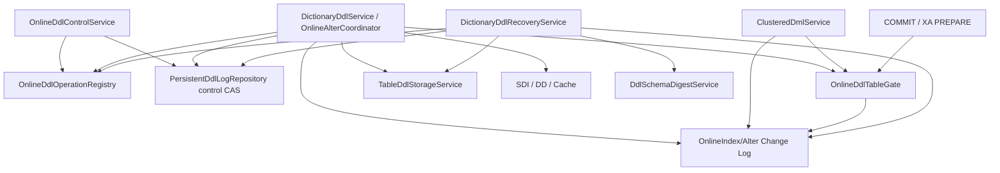

# MiniMySQL Online DDL 演进完整设计

## 1. 文档定位

本文定义 Online ADD INDEX v1 之后的连续演进协议。2026-07-22 的实施顺序与当前状态为：

1. DDL marker source/target schema digest 与持久控制裁决——已实现；
2. Online DDL 可观察性与 crash-safe 取消——已实现Java/admin facade；
3. Online DROP INDEX——live/cancel/recovery/retirement已实现；
4. 通用 Online ALTER——strategy selector、versioned multi-index descriptor chain、通用journal、
   INPLACE multi-index、online shadow rebuild、MVCC/retirement barrier及恢复均已实现。

本文是 [mysql-data-dictionary-ddl-design.md](mysql-data-dictionary-ddl-design.md) 和
[mysql-online-add-index-design.md](mysql-online-add-index-design.md) 的 operation-family 扩展。事务、MDL、
undo/purge、B+Tree、WAL、flush 与 crash recovery 的通用不变量仍以对应厚设计为准。

本文同时保存已落地协议与后续目标。每节显式标注的当前状态以及
`current-implementation-map.md`中的源码调用链为实现事实；复制binlog、主键/任意类型/foreign/generated
ALTER、prefix/FULLTEXT/SPATIAL、并行/外排与持久scan continuation仍未接，不能画成生产实线。

## 2. 当前基线与待解决问题

当前生产链已经具备：

- Online ADD INDEX 的 SU→短 X→SU→final X 协议；
- per-table gate、持久 row-log、candidate high-water、普通 COMMIT/XA PREPARE force；
- staged index descriptor、双向验证、`RECONCILED` 与 committed DD 前滚恢复；
- Online DROP INDEX 的SU/final-X、durable retirement fence、history/source-pin barrier与恢复；
- DDL log v4 的operation 1..11、schema digest、protocol、control/cancellation/retirement及v1-v3兼容；
- Online DDL registry/snapshot/control facade与prepare handoff、MDL wait唤醒；
- general ALTER selector、versioned manifest/descriptor chain、multi-target capture与单版本发布；
- clustered identity journal、bounded shadow copy、两遍reconcile、ReadView/purge barrier与old-space retirement；
- INPLACE/shadow的cancel、可观察性及source/target/forward-only crash recovery；
- MDL timeout/deadlock和锁快照的基础能力。

通用Online ALTER v1已绕开page3单descriptor限制：一个operation以独立segment/page chain拥有有序
multi-index descriptor，并以同一manifest digest绑定marker、journal与物理资源。row-layout变化使用clustered
identity journal和保守的final ReadView/purge barrier，不把current-row copy伪装成完整历史版本转换。当前剩余缺口
集中在MySQL完整能力矩阵与性能：主键/任意类型/foreign/generated、复制binlog、prefix/FULLTEXT/SPATIAL、
并行/外排和持久断点均不在v1范围。

## 3. 目标与非目标

### 3.1 目标

- 用版本化、确定性的 SHA-256 schema digest 绑定 DDL source/target 逻辑形状。
- 用 durable CAS 明确裁决“取消回滚”与“越过不可回退点继续前滚”的竞争。
- 提供低侵入、不可修改内核状态的 Online DDL snapshot API。
- 取消在返回“已持久接受”后，即使立即崩溃也必须由 recovery 继续回滚。
- Online DROP 只在短 cutover X 内移除 DD 可见性，物理 segment 通过 retirement fence 延迟回收。
- 通用 Online ALTER 复用同一 gate、row-log、control state、诊断和 recovery 模板。
- 所有等待有 timeout、取消或明确唤醒条件；锁内不进入 FileChannel、redo、B+Tree、DD 或慢诊断 sink。

### 3.2 非目标

- 不在本阶段实现 MySQL `ALGORITHM`/`LOCK` 全兼容矩阵、复制 binlog 或 group replication。
- 不把 DDL 改造成用户可提交/回滚的事务型 DDL；DDL 前仍隐式提交用户事务。
- 不通过删除 row-log、interrupt worker 或直接删 segment 表达取消成功。
- 不让 diagnostics registry 成为恢复真相或业务锁的 owner。
- 不在第一版 general online rebuild 支持主键修改、列类型任意转换、foreign/generated、FULLTEXT/SPATIAL。
- 不在没有权限系统前增加 SQL `KILL DDL`；第一入口是 Java/admin facade，后续才适配 SQL/Performance Schema。
- 不承诺无界长事务下 final cutover 一定成功；timeout 必须恢复 capture 或留下可恢复裁决。

## 4. 总体架构



权威关系固定为：

1. committed DD 决定逻辑对象是否已发布；
2. DDL marker 的 phase/control/digest 决定未完成 operation 的允许方向；
3. page3 descriptor 决定 staged/retired physical resource owner；
4. row-log 决定 capture generation、candidate durability 和 storage-side abort；
5. runtime registry 只提供诊断投影，不参与上述四类正确性裁决。

## 5. 统一领域模型

### 5.1 DdlSchemaDigest

```text
DdlSchemaDigest
  algorithm       = SHA_256(1)
  canonicalFormat = TABLE_SCHEMA_V1(1)
  bytes           = exactly 32 bytes
```

digest 对象必须防御性复制 byte array，`equals` 用常量时间比较；不能使用 Java `hashCode()`、对象序列化、
catalog record 原始字节或 SDI 原始字节。catalog/SDI 有各自兼容版本和生命周期字段，不能成为 DDL schema
语义的隐式格式。

digest 的输入不是任意 `TableDefinition`，而是显式 `DdlTableSchemaImage(schema, table,
rowFormatVersion)`。image 必须校验 schema/table identity 一致；LOB capability 从 table column type 集合确定性推导，
不得读取 `lobSegment.isPresent()`，否则同一逻辑 schema 会被物理分配结果污染。CREATE/shadow target 尚无 binding 时，
coordinator 仍须从冻结计划显式提供 planned row-format version。

marker 保存的 checkpoint 分为：

- source：DDL 开始时 committed aggregate；
- intermediate：只有会 durable 发布 `*_PENDING` aggregate 的 operation 才存在；
- target：operation 最终 committed aggregate，包括普通 lookup 不可见但 recovery 仍可读取的 `DROPPED` tombstone。

checkpoint 与 operation/state/version 共同解释；digest 不替代 lifecycle state，也不能把合法 intermediate 当作第三态。

### 5.2 DdlExecutionProtocol

同一 `DdlLogOperation` 可能同时存在 blocking 与 online 执行协议，marker 必须另存 immutable stable code：

- `LEGACY_PHASE_ONLY(0)`：只由 v1-v3 decoder 产生，禁止新 prepare 和 live cancel；
- `ATOMIC_BLOCKING_V1(1)`：沿既有 operation-specific phase 恢复，不开放 cancel CAS；
- `ONLINE_INDEX_V1(2)`：Online ADD INDEX，可在 `PREPARED/OPEN` 竞争 cancel/forward；
- `ONLINE_DROP_INDEX_V1(3)`：Online DROP retirement，已启用；
- `ONLINE_ALTER_INPLACE_V1(4)`：承载instant metadata和同一manifest下的多secondary ADD/DROP；
- `ONLINE_ALTER_SHADOW_V1(5)`：承载row-layout变化的独立tablespace copy、reconcile与延迟回收。

public control facade 只能对 protocol 明确声明 cancel-capable 的 marker 工作，不能依据 auxiliary path、descriptor 是否存在
或 operation 名称猜测。这样升级后仍能安全区分旧 blocking marker 与新 online marker。

### 5.3 DdlControlState

```text
OPEN ───────────────> CANCEL_REQUESTED ─────> terminal ROLLED_BACK
  └────────────────> FORWARD_ONLY ─────────> ENGINE_DONE / DD publish / COMMITTED
```

- `OPEN`：尚无 durable 方向裁决；只有 cancel-capable protocol 才允许取消者与 coordinator 竞争。
- `CANCEL_REQUESTED`：取消已经进入 durable catalog，禁止再越过发布 fence。
- `FORWARD_ONLY`：coordinator 已持久封闭取消，崩溃后只能重建/验证并前滚。
- control state 不允许回退、互转或清空；phase/control 组合必须同时满足：
  - `CANCEL_REQUESTED` 只能保持 `PREPARED` 或进入 `ROLLED_BACK`，禁止 `ENGINE_DONE`/DD publish；
  - `FORWARD_ONLY` 禁止进入 `ROLLED_BACK`；
  - cancel-capable protocol 从 `PREPARED` 进入其首个不可回退 phase 前必须已经是 `FORWARD_ONLY`；
  - `ATOMIC_BLOCKING_V1` 可按既有 phase 图以 `OPEN` 完成，且 control API 必须拒绝它；
  - terminal phase 禁止新的 control CAS。
- committed target DD 若已存在，永远按 target truth 前滚；发现 `CANCEL_REQUESTED + target DD` 表示生产
  CAS/发布顺序被破坏，必须 fail-closed，不能猜测回滚已提交 DD。

### 5.4 DdlCancellation

持久取消信息至少包含：

| 字段 | 语义 |
| --- | --- |
| `reasonCode` | `USER_REQUEST`、`SESSION_KILLED`、`ENGINE_CLOSING` 等稳定码 |
| `requestedAtEpochMillis` | 仅诊断，不参与恢复排序 |
| `requesterId` | admin/session 的 opaque 正 `long` identity；无权限系统时使用保留的正 system id |

自动失败如容量、UNIQUE 冲突、验证失败仍使用 operation abort reason；它们可以统一投影为终止原因，但不得伪装成用户取消。

交叉字段不变量固定为：`OPEN/FORWARD_ONLY` 不携带 cancellation，`CANCEL_REQUESTED` 必须携带且后续逐 phase
原样保留。`requestedAtEpochMillis` 必须非负，reason 使用显式 stable code；固定宽度 requester id 避免把无界诊断字符串
塞入核心恢复记录。

### 5.5 DdlRetirementFence

Online DROP 和 shadow swap 在 logical publish 后仍可能保留旧 physical resource。fence 至少包含：

- table id、source dictionary version；
- 非空、按 stable resource kind/id 排序且去重的 retired resource 集合；单 Online DROP 只有一个 index，通用
  INPLACE ALTER 可以在同一 table-level fence 下保存多个 index，shadow swap 保存 source space；
- final X 下捕获的 `retireThroughTransactionNo`；
- exact source metadata pin version；
- descriptor generation/owner ddl id。

fence 从 absent 到 present 只能写一次，后续 phase 必须原样保留。它不是普通进度计数，而是 crash recovery
判断“旧资源是否还可能被 rollback/purge/旧 metadata lease 使用”的持久安全边界。

## 6. DDL marker v4 与 schema digest

### 6.1 Marker 字段演进

`DdlLogRecord` v4 在现有 immutable identity 之外增加：

- `DdlExecutionProtocol executionProtocol`；
- `Optional<DdlSchemaDigest> sourceSchemaDigest`；
- `Optional<DdlSchemaDigest> intermediateSchemaDigest`；
- `Optional<DdlSchemaDigest> targetSchemaDigest`；
- `DdlControlState controlState`，默认 `OPEN`；
- `Optional<DdlCancellation> cancellation`；
- `Optional<DdlRetirementFence> retirementFence`。

字段分两类：

- immutable：ddl/table/index/space/path identity、operation/protocol、source/intermediate/target digest；
- monotonic：phase、control state、cancellation、retirement fence。

repository 的每次 append 必须在同一 writer fence 内读取 latest record，交叉校验 immutable 字段完全相同，
再执行 expected phase/control CAS。phase transition 同时检查 operation phase 图和 control 约束；禁止普通调用方用
`withPhase` 绕过 control/fence 不变量。

### 6.2 Canonical schema image

`TableSchemaDigestCodec.TABLE_SCHEMA_V1` 按 big-endian、显式 stable code、长度前缀编码。精确 grammar 为：

1. 8-byte ASCII magic `MINIDDS1`、4-byte canonical version `1`；
2. 8-byte table id、8-byte schema id、8-byte dictionary version；
3. canonical schema/table name：4-byte UTF-8 byte length + exact bytes；所有 ObjectName 均使用
   `canonicalName()`，不写 display form；
4. 8-byte row-format version、1-byte LOB capability（只允许 `0/1`）；
5. table options：comment 使用 length+exact UTF-8，随后两个 4-byte charset/collation id；comment、literal、symbol
   不做名称归一化，保留其领域 canonical/exact 内容；
6. 4-byte column count；每列依次写 4-byte ordinal、8-byte column id、canonical name、4-byte type stable code、
   两个 1-byte boolean、四个 4-byte length/scale/charset/collation、4-byte symbol count和各symbol、4-byte
   default stable code；只有 CONSTANT 再写 literal；
7. 4-byte index count；每个 index 写4-byte aggregate ordinal、8-byte index id、canonical name、两个1-byte
   boolean、4-byte key-part count；每个part写8-byte column id、4-byte order stable code、4-byte prefix bytes；
8. 4-byte terminator `0x44445345`（`DDSE`），防止未来字段误拼到 v1 image。

所有长度/count 都是非负 signed int，分别使用 `MAX_STRING_BYTES=8192`、`MAX_COLUMNS=4096`、
`MAX_INDEXES=1024`、`MAX_SYMBOLS=65535` 和 `MAX_KEY_PARTS=4096`。编码必须显式拒绝重复或非连续 ordinal、
重复 id/name/key-part column、非法 UTF-8 surrogate、未知 stable code、整数溢出和超过上限的 count/length。
实现优先把字段流式写入 `MessageDigest`，避免为了 digest 再复制整个 table payload。

### 6.3 明确包含与排除

| 内容 | 是否进入 digest | 原因 |
| --- | --- | --- |
| table/schema/id/name/version | 是 | 绑定 exact aggregate 与 rename/version |
| columns/indexes/options/defaults | 是 | 这是 recovery 必须证明的 schema 形状 |
| row-format version / LOB capability | 是 | 影响 record transform 与物理可解释性 |
| table lifecycle state | 否 | state 由 operation/phase/committed DD 单独裁决 |
| space/path | 否 | marker 已重复保存并做受控路径校验 |
| root level | 否 | B+Tree grow/shrink 可合法改变，不能制造假 digest mismatch |
| root page/segment id | 否 | 由 binding、page3 descriptor 和 operation exact-CAS 校验 |
| cache pin/count、row count、statistics | 否 | 运行时或估计值，不是 schema |

### 6.4 Operation digest policy

| Operation | source digest | intermediate digest | target digest |
| --- | --- | --- | --- |
| CREATE TABLE | absent | absent | required ACTIVE，按 planned row format 构造 |
| DROP TABLE | required ACTIVE | required DROP_PENDING | required DROPPED tombstone |
| CREATE INDEX | required ACTIVE | absent | required ACTIVE，source + exact new index |
| DROP INDEX | required ACTIVE | absent | required ACTIVE，source - exact index |
| DISCARD TABLESPACE | required ACTIVE | required DISCARD_PENDING | required DISCARDED |
| IMPORT TABLESPACE | required DISCARDED | required IMPORT_PENDING | required ACTIVE |
| REBUILD/ONLINE ALTER | required source ACTIVE | absent | required target ACTIVE，来自冻结 transform plan |
| recovery DISCARD | required RECOVERY_UNAVAILABLE | absent | required RECOVERY_DISCARDED |
| recovery DROP | required RECOVERY_UNAVAILABLE或RECOVERY_DISCARDED | absent | required DROPPED tombstone |
| recovery IMPORT | required RECOVERY_DISCARDED | absent | required ACTIVE |

新创建的 production marker 必须满足表中策略。v1-v3 decoder 产生 digest absent 的 legacy record；legacy recovery
继续走已有 exact identity/phase 分支，但不开放 live cancel，也不声称通过 schema digest 验证。

### 6.5 Live 校验点

1. DDL 在 initial X 下重读 source aggregate并构造 source/target image。
2. 在任何 staged segment、shadow file、descriptor 或 DD marker 副作用前计算 digest。
3. `PREPARED` append 同时持久化两个 digest 与 `OPEN` control。
4. final X 下再次对当前 source 计算 digest；不一致表示同表 schema ownership 被破坏，停止且不发布 target。
5. coordinator 越过不可回退点前执行 `OPEN -> FORWARD_ONLY` CAS；CAS 失败且观察到
   `CANCEL_REQUESTED` 时走 rollback。

### 6.6 Recovery 校验点

recovery 不能只比较 digest，也不能只比较 version。固定顺序为：

1. 校验 marker key/payload、identity/path、descriptor owner；
2. 按 operation 的合法 phase/state/version/index presence 分类当前 DD 是 source、intermediate、target 或
   不可解释第三态；不允许先用 digest 猜状态；
3. 对分类结果计算对应 checkpoint digest；pending aggregate 必须直接匹配 intermediate digest，不做运行时字段投影；
4. digest mismatch 一律保留 marker/descriptor/文件并阻止 OPEN，不做“安全删除”；
5. digest 匹配后才消费 cancellation/forward-only control并执行operation policy。

对逻辑同形的 transfer operation，digest 不能单独区分 source/target，仍须使用 dictionary version、table state、
file identity 和 phase。digest 是内容证明，不是替代状态机的哈希开关。

### 6.7 Codec 与兼容

- DDL log payload 写 v4，继续读取 v1/v2/v3；未知版本 fail-closed。v2 必须有真实 secondary identity golden
  fixture，不能只用当前 encoder 回环证明兼容。
- key 保持当前 v2 identity布局并启用既有chunk字段。v4把逻辑payload按每条最多1024 bytes切成同一catalog
  batch的连续chunks；每块key重复identity/phase并携带从0开始的ordinal。decoder先限制总块数和总字节数，拒绝
  缺块、重复、乱序、混合identity/phase与非v4多块；catalog batch SHA保护整组原子性。
- v4 Optional flag/boolean/reserved code只接受声明值。DDL path使用strict UTF-8 encoder/decoder `REPORT`；
  schema name/comment/literal/symbol只进入canonical digest encoder，不在DDL log中重复保存。
- phase/control 更新不得把 legacy record伪造为“digest verified”；若 absent 必须继续 absent。
- golden-byte、单字节 corruption、trailing bytes、unknown stable code和跨版本 transition 都必须有测试。

## 7. Online DDL 可观察性

### 7.1 Registry 所有权

`OnlineDdlOperationRegistry` 由 `DatabaseEngine` 组合根唯一创建，DD live coordinator与 DDL recovery共享。
每个 operation 注册一个 `OnlineDdlOperationTracker`，只持不可变 identity和原子/短锁保护的计数、阶段及时间。

registry 禁止：

- 持有 MDL ticket、page guard、FileChannel 或 B+Tree cursor；
- 在 tracker 锁内写日志、catalog、row-log 或等待 Condition；
- 反向回调 coordinator 改变业务状态；
- 因诊断 sink 失败让 DDL 失败。

### 7.2 Snapshot 模型

`OnlineDdlOperationSnapshot` 至少暴露：

| 分类 | 字段 |
| --- | --- |
| Identity | ddl/build id、operation、table/index id与诊断名称、source/target version |
| Ownership | session/statement/MDL owner opaque id，recovery operation 标记 |
| Runtime | runtime phase、gate phase、开始/更新时间、当前等待原因 |
| Durable | DDL phase、control state、row-log generation、abort/cancel reason |
| Scan | rows/batches scanned、可选 estimate、last clustered key 只输出 hash/摘要 |
| Change log | candidate count、size/max/reserve、appended/forced sequence |
| Cutover | terminal redo high-water、seal wait、retirement fence/safe 状态 |
| Outcome | cancel capability、terminal result、last domain error code、forward-recovery required |

snapshot 是 epoch 标记的弱一致只读视图：字段可能来自相邻瞬间，但每个单字段必须合法且计数单调。禁止为追求
全局原子快照同时锁 gate、row-log、MDL 和 registry。

### 7.3 Runtime phase

```text
REGISTERED -> ACTIVATING -> CAPTURING -> BASE_SCAN
          -> WAITING_FINAL_MDL -> FINALIZING -> RECONCILING -> VERIFYING
          -> FORWARD_FENCED -> PUBLISHING -> RETIRING -> COMPLETED
                         \-> ABORTING -> ROLLED_BACK
RECOVERING_SOURCE / RECOVERING_TARGET -> COMPLETED or FAILED_CLOSED
```

runtime phase 不是 durable phase。snapshot 必须同时输出二者，避免把 `BASE_SCAN + PREPARED` 或
`PUBLISHING + ENGINE_DONE` 误报成矛盾。

### 7.4 数据采集

- coordinator 在阶段边界更新 tracker；base scan 每批而非每行更新。
- row-log 提供一次锁内复制的 `OnlineChangeLogSnapshot`，不得让诊断端组合多个 getter 产生倒退视图。
- gate 提供按 build/table 的 `OnlineDdlGateSnapshot`，只复制 phase/ref/lease/high-water。
- MDL wait 通过既有 snapshot/event id关联，不把 MDL 内部 request 暴露给 DD。
- progress estimate 只能来自 statistics，必须标注 `estimated`；未知时为空，不能用 0 假装完成度。

### 7.5 API

第一阶段提供稳定 Java/admin facade：

```text
OnlineDdlControlService.list()
OnlineDdlControlService.find(DdlId)
OnlineDdlControlService.requestCancel(DdlId, CancelRequest, Duration)
OnlineDdlControlService.awaitTerminal(DdlId, Duration)
```

`list/find` 不建立用户事务、不获取 table MDL、不读取裸文件。完成记录进入有界内存 history ring，保存本次
进程 live/recovery 的最终摘要；重启后历史不承诺保留，durable 非终态仍由 DDL marker重新注册为 recovery tracker。

后续 SQL/Performance Schema adapter只消费此 facade。没有权限模型前不暴露任意用户取消入口。

## 8. Crash-safe 取消

### 8.1 返回语义

`requestCancel` 返回稳定结果：

- `ACCEPTED_BEFORE_PREPARE`：尚无 durable DDL resource；token 已设置，operation 必须在副作用前退出。
- `ACCEPTED_DURABLE`：marker 的 `CANCEL_REQUESTED` 已持久化；崩溃后 recovery 必须继续回滚。
- `ALREADY_REQUESTED`：同一裁决幂等成功。
- `TOO_LATE_FORWARD_ONLY`：`FORWARD_ONLY` 或 target DD 已存在，只能等待前滚。
- `TERMINAL`：返回既有完成结果，不重复操作。
- `NOT_FOUND`：registry和非终态 marker均无该 identity。

catalog append/force outcome 不确定时不能返回 accepted；抛保留 cause 的领域异常，并把 operation 标为
`FAILED_CLOSED`。调用方必须重启/重新读取 durable marker，而不是重试相反裁决。

`ACCEPTED_BEFORE_PREPARE` 不能只依赖“检查一次 token”。tracker 必须提供原子 prepare handoff：

```text
PREPARE_OPEN -> CANCELLED_BEFORE_PREPARE       // cancel胜出，coordinator禁止写marker
PREPARE_OPEN -> PREPARING_DURABLE -> DURABLE  // coordinator胜出并append marker
```

cancel 观察到 `PREPARING_DURABLE` 时不得返回 pre-prepare accepted；它使用同一绝对 deadline 等待 marker append
结果，随后执行 durable CAS。append outcome 不确定时双方都进入 `FAILED_CLOSED`，不能让一次已返回 accepted 的
内存 token 在崩溃后丢失。

### 8.2 取消与 forward fence 的唯一竞争

取消线程与 coordinator 只通过 repository CAS 竞争：

```text
cancel:      expected(PREPARED, OPEN) -> (PREPARED, CANCEL_REQUESTED)
coordinator: expected(PREPARED, OPEN) -> (PREPARED, FORWARD_ONLY)
```

只有一个 append 可以成功。失败方重读 latest record并按 observed control返回。内存 flag 可以用于快速唤醒，
但不能覆盖 durable CAS 结果。

repository CAS 返回 `{changed, observedRecord}`：expected 不匹配是正常竞态结果而不是异常；非法 protocol、terminal
phase、control逆转、cancellation字段错配或immutable漂移才抛领域异常。这样调用方不需要在失败后进行有竞态的
第二次无锁读取。

### 8.3 ADD INDEX 取消流程

取消胜出后：

1. durable marker 已是 `CANCEL_REQUESTED`；
2. 通过 build control handle 在 row-log 写并 force `ABORT_REQUIRED(USER_REQUEST)`；
3. gate进入 `ABORTING`，新 DML admission 不再取得 capture target；
4. 唤醒 final MDL/base scan 等待，coordinator在安全点观察取消；
5. drain append/force lease，回收 staged descriptor/segments；
6. marker转 `ROLLED_BACK`，关闭并精确删除 row-log；
7. tracker发布 terminal snapshot。

若在第 1 步后崩溃，即使 row-log 尚无 abort frame，recovery 仍以 marker control回滚；若先由容量路径持久
row-log abort，recovery也必须回滚，二者是同方向冗余证据。

### 8.4 安全检查点

coordinator 至少在以下位置检查 cancellation token和 durable control：

- identity 预留后、PREPARED 前；
- staged resource 创建前后；
- 每个 scan batch边界；
- final MDL进入等待前及被唤醒后；
- gate finalization成功后、reconciliation每批边界；
- verification结束、`FORWARD_ONLY` CAS 前。

进入 `FORWARD_ONLY` 后任何中断、session close或 engine closing都只能改变等待/诊断，不能触发反向物理 cleanup。

### 8.5 MDL wait 取消

`MetadataLockManager` 增加 cancellation-aware acquire/upgrade request id：

- cancel只标记对应 pending request并 `signalAll`；
- wait loop在 grant前重新检查 cancelled、deadline和wait graph状态；
- cancelled request从 FIFO queue和metadata wait graph精确删除；
- 已授予 X 后取消不强拆 ticket，由 coordinator在安全点处理；
- 取消线程不持 registry/control锁进入 MDL manager，避免控制面锁序反转。

### 8.6 File I/O 边界

Java `FileChannel.force` 不能可靠异步中断。取消可以有界等待文件状态锁，但已开始的 OS I/O 只能在返回后确认。
snapshot必须显示 `WAITING_ROW_LOG_FORCE`/`WAITING_TABLESPACE_FORCE`。不能通过另一个线程 close channel来制造
“取消成功”，因为这会让 durable outcome未知。

## 9. 通用 Online DDL 模板

### 9.1 Gate 状态扩展

当前生产gate已采用以下状态；Online DROP额外从`ACTIVATING`进入`RETIREMENT_OPEN`，不创建capture target：

```text
ABSENT -> ACTIVATING -> CAPTURING ------> SEALING -> SEALED
                         ^                  |
                         |------ RESUME ----|
                         \-> ABORTING

ABSENT -> ACTIVATING -> RETIREMENT_OPEN -> SEALING -> SEALED
```

- `SEALING` 阻止新admission并等待in-flight transaction/I/O lease。
- `beginSeal`等待超时且control仍为`OPEN`时恢复调用前的`CAPTURING`或`RETIREMENT_OPEN`；未来shadow的
  ReadView/purge final barrier也必须复用该pre-forward恢复规则。
- gate `SEALED`只证明进程内admission/transaction/I/O lease已经排空；ADD还必须随后持久化row-log
  `SEALED`。durable `SEALED`后不恢复capture，但在FORWARD_ONLY前仍可转ABORTING。
- `CANCEL_REQUESTED` 可从ACTIVATING/CAPTURING/RETIREMENT_OPEN/SEALING进入ABORTING；row-log已经durable `SEALED`、但尚未
  durable `RECONCILED` 且control仍为OPEN时，也允许 `SEALED -> ABORTING`。SEALED只禁止恢复capture，
  不代表不可回退。
- `FORWARD_ONLY` 以后只允许 SEALED/PUBLISHING/RETIRING方向。

### 9.2 统一阶段

1. **Freeze**：SU→initial X，重读 source、计算 source/target digest、创建 `OPEN/PREPARED` marker。
2. **Prepare**：创建 operation descriptor/manifest/staged resource，force capture generation。
3. **Online work**：X→SU，base scan或预处理；DML按 operation capture strategy运行。
4. **Final admission**：SU→X，gate SEALING，等待事务/lease和operation-specific barrier。
5. **Reconcile/verify**：seal row-log，按cutover truth幂等收敛、双向验证并完成物理/WAL force；此时尚未写
   `RECONCILED`，取消仍可删除 staged resource并回滚。
6. **Forward fence**：`OPEN -> FORWARD_ONLY` durable CAS；失败观察 cancellation并回滚。
7. **Publish**：force `RECONCILED`、ENGINE_DONE、SDI、DD、cache。
8. **Retire**：允许时X→SU或释放X，等待旧 pin/purge fence并回收旧物理资源。
9. **Terminal**：COMMITTED/ROLLED_BACK，注销 runtime、清可删除 sidecar、发布 clean snapshot。

上述是逻辑模板，不规定所有 operation 使用相同 `DdlLogPhase` 顺序。CREATE/ADD/shadow 通常在 DD publish 前
进入 ENGINE_DONE；DROP/retirement operation 按既有 dictionary-first 图在 target DD 后完成 ENGINE_DONE。
每个新 protocol 必须在 marker codec 测试中声明自己的直接后继图。

## 10. Online DROP INDEX

当前状态：本章live、cancel、retirement与recovery链已接入生产；多action原子DROP仍依赖11.2的
versioned multi-descriptor sidecar，不能循环当前单descriptor实现。

### 10.1 为什么不需要 row-log

DROP cutover前，旧 DD仍包含 index，普通 DML按既有 metadata继续维护它；cutover X等待所有跨界 statement/write
transaction。新 DD发布后，新 statement不再选择或维护该 index。因此 DROP不需要记录 DML delta，真正困难的是
旧 metadata lease、rollback和purge何时不再引用被退休的 physical binding。

### 10.2 IndexRetirementBarrier

新增窄接口：

```text
captureIndexFence(tableId, sourceVersion, indexId) -> DdlRetirementFence
awaitIndexSafe(fence, timeout) -> boolean
```

final X 且 source writers排空后捕获 transaction high-water，并 exact-CAS写入 page3 DROP descriptor和DDL marker。
安全条件同时满足：

- 没有 ACTIVE/PREPARED transaction仍持 source table/index引用；
- persistent undo/history 中不再有 `indexId` 的 secondary mutation ≤ fence high-water；
- source dictionary version的 cache pin已归零；
- 没有 recovery rollback/purge lease正在使用 descriptor binding。

新 DD发布后的 DML不再产生该 index id引用，因此 fence是有限集合，不受新业务写持续增长影响。

### 10.3 Live 流程

1. schema IX/table SU下重读 exact non-clustered index，构造 source/target digest。
2. 写 `DROP_INDEX/PREPARED/OPEN`，创建 durable DROP descriptor，但不删 segment。
3. SU→X，gate FINALIZING并排空 source-version statement/write owner；再次校验 source digest。
4. 捕获并持久 retirement fence。
5. 执行 `OPEN -> FORWARD_ONLY` CAS；取消若先胜出则清 descriptor、写 ROLLED_BACK。
6. 写不含目标 index的 SDI，exact commit target DD，推进 DICTIONARY_COMMITTED并发布 cache。
7. X降回SU；普通 DML使用 target DD继续，另一个同表 DDL仍被SU排除。
8. 有界等待 `IndexRetirementBarrier`，安全后单MTR回收 leaf/non-leaf segment并清 descriptor。
9. 推进 ENGINE_DONE、COMMITTED，释放SU和runtime tracker。

物理 cleanup timeout发生在 logical commit后，只能报告 `RETIRING/forward recovery required`，不能把 index重新加入DD。

### 10.4 Recovery

| Durable truth | Recovery action |
| --- | --- |
| source DD + OPEN | 清 descriptor，ROLLED_BACK |
| source DD + CANCEL_REQUESTED | 清 descriptor，ROLLED_BACK |
| source DD + FORWARD_ONLY | 校验 source digest/fence，完成 target DD publish |
| target DD + DICTIONARY_COMMITTED/ENGINE_DONE | 校验 target digest，等待/重建 retirement barrier并回收 segment |
| target DD + descriptor absent | 物理 cleanup已完成，补 terminal |
| digest/descriptor/fence第三态 | fail-closed，保留资源 |

recovery从 persistent undo/history和cache初始空状态重建 barrier，不相信上次进程的内存计数。

## 11. 通用 Online ALTER

当前状态：11.1至11.6均已接入生产。INPLACE以versioned descriptor chain原子发布多个secondary action；
SHADOW以clustered identity journal、bounded copy、两遍reconcile、ReadView/purge barrier和old-space retirement
完成row-layout切换。该完成声明仅覆盖本章v1 action矩阵，不包含主键/任意类型/foreign/generated等非目标。

### 11.1 Strategy matrix

`OnlineAlterStrategySelector` 只依据 bound actions、source/target schema与已实现能力选择：

| Strategy | 典型 action | 并发协议 |
| --- | --- | --- |
| `INSTANT_METADATA` | comment/default、可证明不改record的rename/options | 短X，digest/control，无base scan |
| `INPLACE_INDEX` | 多个ADD/DROP secondary | 一个通用manifest/gate，ADD用candidate，DROP用retirement |
| `SHADOW_REBUILD_V1` | ADD/DROP COLUMN、charset/collation convert等现有blocking rebuild能力 | SU下shadow copy + row-identity log + final quiescence |
| `BLOCKING` | 不满足online不变量但已有安全blocking实现 | 明确降级，不伪装online |
| `UNSUPPORTED` | 主键/任意类型/foreign/generated等 | binder/coordinator副作用前拒绝 |

selector 必须输出选择原因和 rejected capability，供 snapshot与测试断言；不能在执行到一半后静默从online切blocking。

### 11.2 General manifest

`OnlineAlterManifest` 持久保存：

- ddl/table/source/target version与source/target schema digest；
- ordered alter action稳定编码；
- source/target row-format version；
- exact index add/drop定义；
- row transform plan稳定编码；
- shadow space/path identity；
- capture generation和final read-view barrier基准。

manifest只保存逻辑命令和恢复必需identity，不保存Java lambda、AST或cache对象。storage.fil仍只把它当opaque bytes。

marker 与 manifest 中重复的 ddl/table/version/digest/protocol 必须逐字段相等；任一侧缺失或漂移均 fail-closed。
manifest 与 change-log header 共同放入受控 sidecar immutable header，使用独立版本、长度和CRC；page3只保存
sidecar owner/generation摘要及当前物理descriptor集合的根，不把无界多action payload塞入固定footer。

`INPLACE_INDEX` 的candidate携带manifest内的target index ordinal/id，retired resources使用同一个table-level
fence的有序集合。现有单index page3 slot继续只服务 `ONLINE_INDEX_V1/ONLINE_DROP_INDEX_V1`；通用ALTER使用
专属descriptor segment与versioned page chain，不循环覆盖单slot。index visibility在当前DD领域模型不存在，
第一版不支持；后续若实现必须先扩展DD/catalog/SDI/digest。

### 11.3 Shadow change log

第一版继续禁止聚簇主键修改，因此每次 clustered mutation只需捕获稳定 clustered identity：

- INSERT：after clustered key；
- DELETE：before clustered key；
- UPDATE：同一 clustered key；
- 任意列更新都记录，不能像 ADD INDEX只过滤非目标列。

candidate仍在业务 MTR/undo/页修改前append，COMMIT/XA PREPARE force high-water。失败/rollback candidate允许冗余；
final reconciliation先从shadow删除所有candidate identity，再从source当前聚簇真相读取、执行transform并幂等插回。
因此row-log不复制LOB payload，也不把未提交candidate误当commit event。

两遍reconciliation必须按row-log frame批次流式扫描并允许rewind，不能把上限内全部candidate一次装入heap；重复
identity的delete/ensure语义必须幂等。每批复用同一绝对deadline并检查durable cancellation，返回前释放page资源。

### 11.4 Bounded shadow copy

1. 每批最多 `scanBatchRows`，使用完整clustered physical key作为exclusive continuation。
2. 每批返回前释放所有source page latch/fix。
3. 每行在独立短MTR写shadow clustered与全部target secondary。
4. LOB读取在source guard外形成受控逻辑值，target按新LOB segment重新分配；失败清理遵守现有ownership规则。
5. 每批更新tracker并检查cancel/abort/engine close。
6. PREPARED crash不保存continuation：回收旧shadow、reset generation后从空重建。

### 11.5 MVCC-safe final quiescence v1

任意row-layout变化不能只复制当前值就宣称支持旧ReadView。第一版选择正确但保守的有界final barrier：

1. SU→X并使gate进入FINALIZING，排空source write transaction和capture lease；
2. 等待所有早于cutover的ReadView退出；
3. 运行/等待source table history purge到无旧schema版本依赖；
4. timeout时若control仍OPEN，恢复CAPTURING并X→SU，后续可重试finalization；
5. barrier成功后seal/reconcile，target记录作为cutover后的新稳定版本发布。

这比MySQL完整online rebuild的final窗口更保守，但不会让target schema沿source-format undo链构造错误旧版本。
后续若要缩短final X，必须先设计并持久化跨schema MVCC version transform/definition retention；不能仅删除该barrier。

### 11.6 Publish 与 old-space retirement

shadow验证通过后：

1. force source committed redo high-water、shadow data与redo；
2. durable `FORWARD_ONLY`，再force `RECONCILED`并推进ENGINE_DONE；
3. 写target SDI、exact swap DD binding、DICTIONARY_COMMITTED、cache publish；
4. X→SU，按source version/space retirement fence确认无旧pin/lease；
5. durable DISCARDED、drain/invalidate旧space并删除exact旧路径；
6. COMMITTED、清manifest/descriptor并发布clean snapshot。

old-space cleanup失败只允许前滚。target DD已提交后，source file残留是可恢复资源，不是回滚target的依据。

### 11.7 Recovery matrix

| Control/DD truth | Recovery |
| --- | --- |
| source + OPEN | v1固定精确回收shadow并ROLLED_BACK；不在startup关闭流量期自动重做整表copy |
| source + CANCEL_REQUESTED | 精确回收shadow、ROLLED_BACK |
| source + FORWARD_ONLY | 必须验证durable shadow/RECONCILED；缺证据fail-closed，完整则publish target |
| target + descriptor/source file | 校验target digest并前滚retirement |
| target + old file absent | 补phase/cache/terminal |
| source/target digest均不匹配 | fail-closed，不删除任一space |

第一版对 PREPARED+OPEN固定回滚，避免启动时无界重做整表copy；只有显式FORWARD_ONLY才必须完成发布。

## 12. 并发与锁顺序

全局顺序保持：

1. engine lifecycle/read-write gate；
2. schema MDL；
3. table MDL；
4. short DDL control repository writer fence；
5. table gate短锁；
6. transaction row lock；
7. per-row-log短锁；
8. page/FSP/redo既有顺序。

补充规则：

- control CAS不持gate/row-log/MDL manager内部锁；调用方持已授予MDL ticket不等于持MDL manager mutex。
- cancel先完成catalog CAS，释放repository锁后才进入row-log/gate/MDL wakeup。
- snapshot分别复制registry/gate/row-log/MDL数据，不嵌套获取这些锁。
- retirement wait不持page latch、FileChannel lock或dictionary transaction mutex。
- final X等待ReadView/purge必须有同一绝对deadline；timeout恢复capture时不写SEALED或FORWARD_ONLY。
- 进入FORWARD_ONLY后资源释放失败只能保留descriptor/marker供recovery，不能调用反向cleanup。

## 13. 异常与失败语义

建议领域异常：

- `DdlSchemaDigestMismatchException`：恢复或final X观察到不匹配schema，fail-closed。
- `OnlineDdlCancellationException`：coordinator观察到durable cancel并进入正常回滚路径。
- `OnlineDdlCancelTooLateException`：控制API请求晚于forward fence。
- `OnlineDdlControlConflictException`：CAS观察到非法第三态或immutable identity漂移。
- `OnlineDdlRetirementTimeoutException`：target已发布但旧资源尚不能回收，要求前滚恢复。
- `OnlineAlterFinalizationTimeoutException`：尚未forward-only，可恢复capture并报告本次cutover失败。

任何包装必须保留cause。schema mismatch、control第三态、descriptor owner错配、未知持久格式属于阻止OPEN的恢复错误；
普通用户取消、MDL timeout、row-log容量和UNIQUE冲突是可解释的DDL失败，不应自动关闭整个实例，前提是abort证据可持久化。

## 14. TDD 与实施顺序

### 14.1 Slice A：marker digest/control（已完成）

1. 先写 canonical digest golden/mutation/order/strict UTF-8/overflow测试。
2. 写 DDL log v4 codec、v1-v3兼容、phase/control CAS竞争红灯测试。
3. 扩展 `DdlLogRecord`/repository并逐operation接source/target digest。
4. recovery每个source/target分支增加digest mismatch保留资源测试。
5. 全量回归；只有current map真实链路更新后进入Slice B。

验收：所有新marker带策略要求的digest；cancel与forward CAS只能一个成功；legacy仍可读但不冒充digest verified。

### 14.2 Slice B：只读可观察性（已完成）

1. tracker/registry/snapshot不可变和并发快照测试。
2. gate/change-log单次锁内snapshot测试，证明计数不倒退且数组不泄漏。
3. live ADD INDEX各阶段与recovery tracker协作测试。
4. public Java/admin read facade接线；此slice不允许修改DDL裁决。

验收：高频snapshot不阻塞DML/force；异常sink不影响DDL；字段明确区分runtime与durable phase。

### 14.3 Slice C：crash-safe cancel（已完成）

1. repository cancel-vs-forward并发CAS测试。
2. pre-prepare、base scan、final MDL wait、reconciliation、too-late测试。
3. crash注入覆盖cancel marker后/row-log abort前、abort后/cleanup前、forward fence后/ENGINE_DONE前。
4. cancellation-aware MDL request与wait graph cleanup测试。
5. 接public control facade，默认只允许admin/system caller。

验收：`ACCEPTED_DURABLE` 后重启只能回滚；`TOO_LATE` 后重启只能前滚；不存在target DD被取消删除。

### 14.4 Slice D：Online DROP INDEX（已完成）

1. index retirement fence/descriptor格式与persistent history重建测试。
2. prepare期间并发DML、短X cutover、target DD后DML不再维护旧index测试。
3. source pin/purge阻塞、timeout、恢复后继续retire测试。
4. 每个marker/DD/descriptor/segment边界故障注入。
5. 单动作DROP语法路由切到online；blocking实现保留为显式fallback直到全量稳定。

验收：logical publish后可并发DML；segment只在fence安全后删除；取消只在forward fence前成功。

### 14.5 Slice E：通用coordinator与INPLACE_INDEX（已完成）

以下能力已按一个operation、一个manifest和一个目标字典版本接入生产：

1. strategy matrix与reason测试。
2. 多action digest/manifest和一个gate下多ADD/DROP index组合测试。
3. publish必须是单target aggregate/version，不逐action暴露中间DD。
4. cancel/diagnostics/recovery复用统一模板。

### 14.6 Slice F：SHADOW_REBUILD_V1（已完成）

1. clustered identity change-log、全列update、LOB、rollback/savepoint/XA测试。
2. bounded copy/reconciliation/双向全索引验证测试。
3. final ReadView+purge barrier timeout恢复capture测试。
4. source/target/forward-only/old-space retirement完整crash矩阵。
5. 与blocking ALTER结果等价的property/fixture测试。

验收：不支持的主键/类型/foreign/generated在副作用前拒绝；已声明online的action不静默降级或破坏MVCC。

## 15. 测试矩阵

除各slice专项测试外，组合测试必须覆盖：

- digest对任一column/type/default/index/order/prefix/options/version变化都敏感，对root level变化不敏感；
- 取消/forward CAS 1000次并发竞态只产生一个方向；
- snapshot与DML append/force/close并发不抛异常、不泄漏mutable array；
- cancel final MDL pending request后queue/wait graph无残留；
- weak commit durability、XA PREPARED、rollback/savepoint与final seal；
- Online DROP在旧undo/pin存在时不删segment，重启后能继续；
- general rebuild在长ReadView下有界失败并恢复capture；
- row-log capacity仍先持久abort且业务DML可继续；
- descriptor/marker/digest/path任一错绑均不删除第三方资源；
- 全量测试数不得倒退，生产源码静态扫描继续满足无monitor、无裸异常、无反向依赖。

## 16. 文档与 current map 更新规则

- Slice A完成后只把实际v4 codec、digest调用方和recovery校验写入current map。
- Slice B/C未接public facade前，不能把“可观察/取消”标成Implemented。
- Online DROP开始设计或测试但仍走blocking生产路由时，必须标`partial/unwired`。
- General ALTER strategy selector若只实现INPLACE_INDEX，shadow rebuild仍明确标planned。
- 新增但只被测试消费的tracker/descriptor/strategy必须进入Reserved / Unwired表。
- 每个slice完成后回到生产源码核对调用链，并执行current map文件内十项检查清单。

## 17. 十轮设计与实现边界复核

| Pass | 复核维度 | 结论 |
| --- | --- | --- |
| 1 | 当前事实与目标边界 | marker v4、ADD/DROP、instant metadata、multi-index/shadow与control facade均按生产调用链标为current；非目标继续列缺口 |
| 2 | Digest稳定性 | 显式canonical格式、stable code、strict UTF-8与包含/排除表避免复用不稳定序列化或root level |
| 3 | 取消竞态 | durable `OPEN -> CANCEL_REQUESTED/FORWARD_ONLY` CAS给出唯一胜者，内存token不承担恢复裁决 |
| 4 | Crash window | accepted cancel、forward fence、DD commit、descriptor cleanup各窗口都有单向恢复规则 |
| 5 | 锁与等待 | control、gate、row-log、MDL、retirement/snapshot不嵌套慢IO；等待有deadline/取消/唤醒 |
| 6 | 可观察性侵入 | registry是弱一致只读投影，既不拥有资源也不改变业务结果 |
| 7 | Online DROP安全 | DD不可见性与segment回收分离，persistent transaction/purge/pin fence阻止过早删除 |
| 8 | General ALTER/MVCC | shadow使用clustered identity journal与final ReadView/purge barrier；旧ReadView未排空时不发布或回收旧空间 |
| 9 | 分层与兼容 | DD解释schema/control，storage只认识opaque log/descriptor；v1-v3 legacy可读且不冒充digest验证 |
| 10 | 实施可验收性 | Slice A-F均按TDD接线；multi-index原子发布、shadow copy/reconcile、取消和重启裁决由专项测试覆盖 |

## 18. 推荐落地结论

Slice E/F已经完成，下一次实现不再重复扩展当前v1协议。优先项可在复制binlog参与者、主键/类型/foreign/
generated ALTER设计，或并行/外排与持久scan continuation中选择；任何一项都必须先补对应恢复与提交语义，
不能把通用journal当作binlog，也不能绕过现有manifest/digest/control裁决。

## 19. 历史切片验收记录（2026-07-21）

该记录保存Slice E/F实现前的历史基线，不代表2026-07-22当前状态。Slice A-D与当时Slice E部分已按源码完成十轮复核；详细逐轮证据记录在
`current-implementation-map.md` 的“Online DDL Evolution A-D + E-partial 10-Pass Review Log”。复核期间按
TDD补强v4 initial/history校验、legacy编码拒绝、retirement fence协议与顺序、超大正Duration等待、资源
null元素异常边界，并核实XA PREPARED裁决先于DDL recovery hook。固定JDK 25.0.2与Gradle 9.5.1全量结果为
304 suites / 1765 tests，0 failure、0 error、0 skipped。随后完成的Slice E/F以当前源码、测试、本文第14节和
`current-implementation-map.md`中的2026-07-22复核记录为准。

## 20. Slice E/F 当前验收记录（2026-07-22）

实现按五轮复核重新核对：第一轮确认SQL→DD→storage依赖和全部生产消费者；第二轮检查marker/manifest/
descriptor/journal稳定格式及source/target/forward-only恢复矩阵；第三轮检查gate、MDL、取消、deadline与资源释放；
第四轮检查multi-index单版本发布、shadow两遍reconcile、LOB、ReadView/purge与old-space retirement；第五轮执行
静态扫描、文档状态复核和固定工具链全量测试。复核修正了通用取消的capture-id gate唤醒、pending final-MDL
异常归一以及取消abort reason。固定JDK 25.0.2与Gradle 9.5.1执行`test --rerun-tasks --no-daemon`结果为
313 suites / 1802 tests，0 failure、0 error、0 skipped；其中同一次shadow cutover已组合覆盖普通事务
INSERT/UPDATE/DELETE、savepoint rollback冗余candidate与XA PREPARE/COMMIT。
